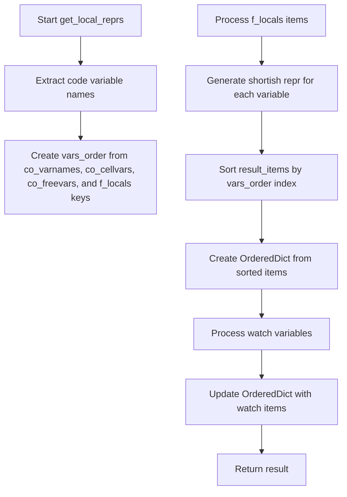
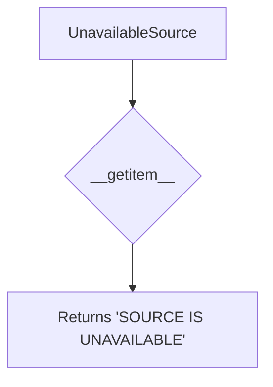
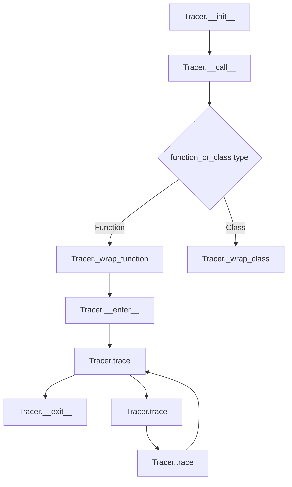

# `tracer.py`

## `pysnooper.tracer.get_local_reprs` · *function*

## Summary:
Generates a consistently ordered, formatted representation of local variables from a Python execution frame for debugging and tracing.

## Description:
Processes all local variables from a Python frame object, creates their string representations using standardized formatting utilities, and returns them in a predictable order that matches the variable declaration sequence in the code. This function serves as a core utility in pysnooper's code tracing functionality, enabling consistent visualization of variable states during program execution.

## Args:
    frame (FrameType): The Python frame object containing local variables to represent
    watch (tuple, optional): Additional variables to monitor, each element should have an items() method that accepts (frame, normalize) arguments. Defaults to empty tuple.
    custom_repr (tuple, optional): Custom representation rules for formatting objects. Defaults to empty tuple.
    max_length (int, optional): Maximum length for string representations. If None, no truncation occurs. Defaults to None.
    normalize (bool): Whether to normalize representations by removing certain patterns. Defaults to False.

## Returns:
    collections.OrderedDict: An ordered dictionary mapping variable names to their string representations, sorted according to variable declaration order in the code plus local variables. The order follows: code variables (co_varnames, co_cellvars, co_freevars) followed by local variables not defined in the code.

## Raises:
    None explicitly raised

## Constraints:
    - Precondition: frame must be a valid Python frame object with f_code and f_locals attributes
    - Precondition: watch elements must have an items() method that accepts (frame, normalize) arguments
    - Postcondition: Return dictionary maintains the order of variables as declared in the code plus local variables
    - Postcondition: All variable representations are processed through utils.get_shortish_repr
    - Postcondition: Variables in watch are merged into the result with sorted ordering

## Side Effects:
    None

## Control Flow:


## Examples:
    # Basic usage with local variables
    import inspect
    def test_func():
        x = 10
        y = "hello"
        frame = inspect.currentframe()
        result = get_local_reprs(frame)
        # Returns OrderedDict([('x', '10'), ('y', "'hello'")])
        # Variables ordered according to their declaration in the code
    
    # Usage with watched variables
    def another_func():
        a = [1, 2, 3]
        b = {'key': 'value'}
        frame = inspect.currentframe()
        # Assuming watch contains objects with items() method
        result = get_local_reprs(frame, watch=(some_watch_object,))
        # Returns OrderedDict with local variables plus watched variables

## `pysnooper.tracer.UnavailableSource` · *class*

## Summary:
Represents a sentinel object that provides a constant "SOURCE IS UNAVAILABLE" message when accessed via indexing.

## Description:
The `UnavailableSource` class serves as a placeholder object used when source code cannot be retrieved or is unavailable. It implements the `__getitem__` method to always return the string "SOURCE IS UNAVAILABLE", making it useful as a fallback mechanism in debugging and inspection contexts where source code access fails.

This class is typically instantiated implicitly by the pysnooper tracer when it encounters situations where source code cannot be obtained, such as when dealing with compiled bytecode or dynamically generated code.

## State:
- No instance attributes maintained
- The class itself has no state beyond its method implementation
- `__getitem__` method accepts any index parameter but ignores it

## Lifecycle:
- Creation: Instantiated automatically by pysnooper when source code is unavailable
- Usage: Accessed through indexing operations (e.g., `source_obj[index]`) 
- Destruction: No special cleanup required as it's a simple sentinel object

## Method Map:


## Raises:
- No exceptions are raised by this class
- The `__getitem__` method always returns a string and never raises exceptions

## Example:
```python
# Usage in pysnooper context
source = UnavailableSource()  # Automatically created by pysnooper
result = source[0]  # Returns 'SOURCE IS UNAVAILABLE'
result = source['any_key']  # Also returns 'SOURCE IS UNAVAILABLE'
```

### `pysnooper.tracer.UnavailableSource.__getitem__` · *method*

## Summary:
Returns a constant string indicating that source code is unavailable for inspection.

## Description:
This method serves as a fallback implementation that always returns the string "SOURCE IS UNAVAILABLE". It is part of the UnavailableSource class, which acts as a placeholder when source code cannot be accessed or inspected during debugging operations. This method is typically invoked when attempting to retrieve source code information from a location where it is not available.

## Args:
    i (int): Index parameter for item access, though it's unused in the implementation.

## Returns:
    str: Always returns the string "SOURCE IS UNAVAILABLE".

## Raises:
    None: This method does not raise any exceptions.

## State Changes:
    Attributes READ: None
    Attributes WRITTEN: None

## Constraints:
    Preconditions: None
    Postconditions: Always returns the same constant string regardless of input.

## Side Effects:
    None: This method performs no I/O operations or external service calls.

## `pysnooper.tracer.get_path_and_source_from_frame` · *function*

## Summary:
Retrieves the file path and source code lines from a frame object, using caching and multiple fallback strategies for different execution environments.

## Description:
Extracts file path and source code from a Python frame object, implementing a sophisticated caching mechanism and multiple fallback approaches to handle different execution contexts like regular Python files, IPython notebooks, and Ansible archives. This function centralizes source code retrieval logic to avoid duplication elsewhere in the codebase.

## Args:
    frame (types.FrameType): A Python frame object containing execution context information

## Returns:
    tuple[str, list[str] or UnavailableSource]: A tuple containing the file path (str) and source code lines (list of str) or UnavailableSource if source cannot be retrieved

## Raises:
    None explicitly raised - exceptions are caught internally and handled gracefully

## Constraints:
    Preconditions:
    - The frame parameter must be a valid Python frame object
    - The frame's f_globals must be accessible
    
    Postconditions:
    - Always returns a tuple with file path and source code lines or UnavailableSource
    - The returned source lines are properly decoded if they contain byte strings

## Side Effects:
    - Reads from filesystem when source is not cached
    - Accesses IPython history manager when processing IPython notebook cells
    - Accesses ZIP archives when processing Ansible files
    - Modifies global cache (source_and_path_cache) with retrieved source data

## Control Flow:
```mermaid
flowchart TD
    A[Start get_path_and_source_from_frame] --> B{Cache Hit?}
    B -- Yes --> C[Return cached result]
    B -- No --> D[Get loader from globals]
    D --> E{Loader has get_source?}
    E -- Yes --> F[Call loader.get_source()]
    F --> G{Source obtained?}
    G -- Yes --> H[Split source into lines]
    G -- No --> I[Check for IPython filename]
    I --> J{IPython match?}
    J -- Yes --> K[Access IPython history]
    K --> L[Get source chunk from history]
    L --> M[Split lines]
    J -- No --> N[Check for Ansible filename]
    N --> O{Ansible match?}
    O -- Yes --> P[Open ZIP archive]
    P --> Q[Read source file from archive]
    Q --> R[Split lines]
    O -- No --> S[Open file with open()]
    S --> T{File opened successfully?}
    T -- No --> U[Set source to UnavailableSource]
    T -- Yes --> V[Read file contents]
    V --> W[Split lines]
    U --> X[End]
    W --> X[End]
    M --> X[End]
    R --> X[End]
```

## Examples:
    # Typical usage within pysnooper tracing
    import inspect
    frame = inspect.currentframe()
    file_path, source_lines = get_path_and_source_from_frame(frame)
    
    # When source is available from cache
    cached_result = get_path_and_source_from_frame(frame)
    assert isinstance(cached_result, tuple)
    assert len(cached_result) == 2
    assert isinstance(cached_result[0], str)  # file path
    assert isinstance(cached_result[1], list) or isinstance(cached_result[1], UnavailableSource)  # source lines

## `pysnooper.tracer.get_write_function` · *function*

## Summary:
Returns an appropriate write function based on the output destination specification.

## Description:
This factory function determines the correct write mechanism based on the type of the output parameter. It supports writing to standard error, files, callable objects, or writable streams. The function validates that the overwrite flag is only used with file destinations.

## Args:
    output (None, str, PathLike, callable, or WritableStream): Specifies the destination for written content. 
        - If None, writes to stderr
        - If str or PathLike, treats as file path and uses FileWriter
        - If callable, uses the callable directly as the write function
        - If WritableStream, uses its write method
    overwrite (bool): When True, allows overwriting existing files. Only valid when output is a file path.

## Returns:
    callable: A write function that accepts a string argument and writes it to the specified destination.

## Raises:
    Exception: When overwrite=True is specified but output is not a file path (str or PathLike).

## Constraints:
    Preconditions:
        - If overwrite=True, then output must be a string or PathLike object
        - output parameter must be one of the supported types
    
    Postconditions:
        - Returned function will accept a string argument
        - Function will write content to the appropriate destination based on output parameter

## Side Effects:
    - When output is a file path, may create or modify files on the filesystem
    - When output is None, writes to standard error stream (sys.stderr)

## Control Flow:
```mermaid
flowchart TD
    A[get_write_function called] --> B{output is None?}
    B -- Yes --> C[Write to stderr]
    B -- No --> D{is_path = isinstance(output, (PathLike, str))?}
    D -- Yes --> E[Create FileWriter and return write method]
    D -- No --> F{output is callable?}
    F -- Yes --> G[Return output directly]
    F -- No --> H[Assert output is WritableStream]
    H --> I[Wrap output.write in lambda]
    C --> J[Return write function]
    E --> J
    G --> J
    I --> J
```

## Examples:
```python
# Write to stderr
write_func = get_write_function(None, False)
write_func("Debug message\\n")

# Write to file with overwrite
write_func = get_write_function("/tmp/debug.log", True)
write_func("Tracing info\\n")

# Write to custom callable
def custom_writer(s):
    print(f"Custom: {s}")
write_func = get_write_function(custom_writer, False)
write_func("Message\\n")
```

## `pysnooper.tracer.FileWriter` · *class*

## Summary:
FileWriter is a utility class that writes content to files with overwrite or append behavior.

## Description:
The FileWriter class provides a simple interface for writing string content to files. It supports both overwrite and append modes based on an internal flag. The class is typically used in logging or tracing scenarios where controlled file I/O is required. Instances are created with a file path and an overwrite flag that determines the write mode for subsequent operations.

## State:
- path (str): The file path where content will be written. This is converted to text type for compatibility purposes.
- overwrite (bool): Flag controlling write mode - if True, file is opened in write mode ('w'); if False, append mode ('a'). This flag is reset to False after each write operation.

## Lifecycle:
- Creation: Instantiate with a file path and overwrite boolean flag
- Usage: Call write() method with string content to write to the file
- Destruction: No explicit cleanup required; relies on Python's file handling mechanisms

## Method Map:
```mermaid
graph TD
    A[FileWriter.__init__] --> B[FileWriter.write]
    B --> C[open(file, 'w'/'a', encoding='utf-8')]
    C --> D[output_file.write(s)]
    D --> E[overwrite = False]
```

## Raises:
- IOError: When file operations fail due to permissions, disk space, or other filesystem issues
- TypeError: When the path parameter is not convertible to text type or when s is not a string

## Example:
```python
# Create a FileWriter that overwrites the file
writer = FileWriter('/path/to/file.txt', overwrite=True)
writer.write('Hello, World!')

# Create a FileWriter that appends to the file
writer = FileWriter('/path/to/file.txt', overwrite=False)
writer.write('Additional content')
```

### `pysnooper.tracer.FileWriter.__init__` · *method*

## Summary:
Initializes a FileWriter instance with a target file path and overwrite behavior configuration.

## Description:
Configures the FileWriter object to manage output to a specified file path, determining whether to overwrite existing files or append to them. This method sets up the fundamental state needed for subsequent write operations.

## Args:
    path (str): The file path where output will be written. Converted to text type for cross-version compatibility.
    overwrite (bool): Flag indicating whether to overwrite existing files (True) or append to them (False).

## Returns:
    None: This method initializes object state and does not return a value.

## Raises:
    None explicitly raised by this method.

## State Changes:
    Attributes READ: None
    Attributes WRITTEN: self.path, self.overwrite

## Constraints:
    Preconditions: 
    - path should be a valid file path string
    - overwrite should be a boolean value
    
    Postconditions:
    - self.path will be stored as a text type string
    - self.overwrite will be set to the provided boolean value

## Side Effects:
    None: This method performs no I/O operations or external service calls.

### `pysnooper.tracer.FileWriter.write` · *method*

## Summary:
Writes a string to the file specified by the instance's path, using either write or append mode based on the overwrite flag.

## Description:
This method handles the actual file writing operation for the FileWriter class. It opens the file in either write mode ('w') or append mode ('a') depending on the current value of the overwrite flag, writes the provided string content, and then disables future overwrites by setting the overwrite flag to False.

## Args:
    s (str): The string content to write to the file

## Returns:
    None

## Raises:
    IOError: If the file cannot be opened or written to

## State Changes:
    Attributes READ: self.path, self.overwrite
    Attributes WRITTEN: self.overwrite

## Constraints:
    Preconditions: The FileWriter instance must have been properly initialized with a valid path and overwrite flag
    Postconditions: The file will contain the provided string content, and the overwrite flag will be set to False

## Side Effects:
    I/O operation: Writes to the filesystem at the location specified by self.path

## `pysnooper.tracer.Tracer` · *class*

## Summary:
A tracing utility class that monitors function execution and variable states during program runtime, providing detailed debugging information through customizable output formats.

## Description:
The Tracer class is a core component of the pysnooper library designed to provide detailed insights into function execution by monitoring variable states, execution flow, and timing information. It can be used as a decorator to trace individual functions or entire classes, and also supports manual context management for selective tracing.

The class works by installing Python's tracing mechanism (sys.settrace) to intercept execution events and generate formatted output showing variable changes, function calls, returns, and exceptions. It supports various customization options including output destinations, watched variables, depth control, and formatting preferences.

## State:
- _write (callable): Function responsible for writing trace output to the configured destination
- watch (list): List of BaseVariable instances representing variables to monitor during execution
- frame_to_local_reprs (dict): Maps frame objects to their current local variable representations
- start_times (dict): Tracks start timestamps for frames to measure execution duration
- depth (int): Maximum frame depth to trace, defaults to 1
- prefix (str): String prefix added to each trace line for easy identification
- thread_info (bool): Flag indicating whether to include thread identification in trace output
- thread_info_padding (int): Width padding for thread information alignment
- target_codes (set): Set of code objects that should be traced
- target_frames (set): Set of frame objects that should be traced
- thread_local (threading.local): Thread-local storage for maintaining per-thread trace state
- custom_repr (tuple): Custom representation functions for formatting specific object types
- last_source_path (str): Most recently displayed source file path to reduce redundant output
- max_variable_length (int): Maximum allowed length for variable representations, defaults to 100
- normalize (bool): Flag to normalize output by removing certain patterns, defaults to False
- relative_time (bool): Flag to show relative timestamps instead of absolute times, defaults to False
- color (bool): Flag to enable ANSI color codes in output, defaults to True on Unix-like systems
- _FOREGROUND_BLUE through _STYLE_RESET_ALL (str): ANSI color and style escape sequences for formatted output

## Lifecycle:
- Creation: Instantiate with configuration parameters to customize tracing behavior
- Usage: Apply as decorator to functions or classes, or use as context manager with 'with' statement
- Destruction: Automatic cleanup occurs when context manager exits or when object is garbage collected

## Method Map:


## Raises:
- NotImplementedError: When attempting to wrap coroutine or async generator functions
- AssertionError: When depth parameter is less than 1 during initialization
- NotImplementedError: When normalize flag is True and thread_info flag is also True

## Example:
```python
import pysnooper

# As a decorator for a function
@pysnooper.snoop()
def my_function(x, y):
    z = x + y
    return z * 2

# As a decorator for a class
@pysnooper.snoop()
class MyClass:
    def method(self, value):
        result = value * 2
        return result

# As a context manager
tracer = pysnooper.Tracer(output='/tmp/debug.log')
with tracer:
    # Code to trace
    result = some_function()

# With custom configuration
tracer = pysnooper.Tracer(
    output=sys.stderr,
    watch=('x', 'y'),
    depth=2,
    prefix='TRACE: '
)
```

### `pysnooper.tracer.Tracer.__init__` · *method*

## Summary:
Initializes a Tracer instance with configuration options for function tracing and variable monitoring.

## Description:
Configures the tracer's behavior including output destination, watched variables, depth control, and formatting options. This constructor establishes the foundational settings that govern how the tracer will monitor function execution and display variable states.

## Args:
    output (None, str, PathLike, callable, or WritableStream, optional): Specifies where trace output should be written. Defaults to None (stderr).
    watch (tuple, optional): Variables to monitor during function execution. Defaults to empty tuple.
    watch_explode (tuple, optional): Variables to monitor with deep inspection. Defaults to empty tuple.
    depth (int, optional): Maximum frame depth to trace. Defaults to 1.
    prefix (str, optional): Prefix string added to each trace line. Defaults to empty string.
    overwrite (bool, optional): Whether to overwrite existing output files. Defaults to False.
    thread_info (bool, optional): Whether to include thread identification in traces. Defaults to False.
    custom_repr (tuple, optional): Custom representation functions for specific types. Defaults to empty tuple.
    max_variable_length (int, optional): Maximum length of variable representations. Defaults to 100.
    normalize (bool, optional): Whether to normalize whitespace in output. Defaults to False.
    relative_time (bool, optional): Whether to show relative timestamps. Defaults to False.
    color (bool, optional): Whether to use colored output. Defaults to True.

## Returns:
    None: This method initializes instance attributes and does not return a value.

## Raises:
    AssertionError: When depth is less than 1.

## State Changes:
    Attributes READ: None
    Attributes WRITTEN: 
        - _write: Write function for output destination
        - watch: List of watched variables (converted to BaseVariable instances)
        - frame_to_local_reprs: Dictionary mapping frames to local variable representations
        - start_times: Dictionary tracking start times for frames
        - depth: Frame depth limit
        - prefix: Trace line prefix
        - thread_info: Thread information flag
        - thread_info_padding: Padding for thread information
        - target_codes: Set of target code objects to trace
        - target_frames: Set of target frames to trace
        - thread_local: Threading-local storage container
        - custom_repr: Custom representation functions
        - last_source_path: Last processed source file path
        - max_variable_length: Maximum variable representation length
        - normalize: Whitespace normalization flag
        - relative_time: Relative timestamp flag
        - color: Color output flag
        - _FOREGROUND_BLUE through _STYLE_RESET_ALL: ANSI color codes (when color is enabled)

## Constraints:
    Preconditions:
        - depth must be >= 1
        - If overwrite=True, output must be a file path (str or PathLike)
        - custom_repr must be properly formatted tuple structure
        
    Postconditions:
        - All instance attributes are initialized with provided or default values
        - _write attribute contains a valid write function
        - watch attribute contains properly converted variable objects
        - color-related attributes are initialized appropriately

## Side Effects:
    - May create or modify files if output specifies a file path
    - Writes to standard error if output is None
    - Initializes threading-local storage
    - Sets up ANSI color escape sequences when color support is enabled

### `pysnooper.tracer.Tracer.__call__` · *method*

## Summary:
Enables tracing of functions or classes by wrapping them with tracing functionality, or returns them unchanged if tracing is disabled.

## Description:
This method implements the callable protocol for the Tracer class, allowing instances to be used as decorators. When called with a function or class, it determines the appropriate wrapping strategy based on the input type. If tracing is disabled (DISABLED is True), it returns the input unchanged. Otherwise, it wraps functions with tracing instrumentation or classes by wrapping all their methods.

## Args:
    function_or_class (callable or type): Either a function or class to be traced. If a function, it will be wrapped with tracing instrumentation. If a class, all its methods will be wrapped.

## Returns:
    callable or type: The original function or class, potentially wrapped with tracing functionality, or the unchanged input if tracing is disabled. In the disabled case, the exact same object reference is returned.

## Raises:
    None: This method itself does not raise exceptions. Exceptions may be raised by the underlying _wrap_function or _wrap_class methods when they encounter unsupported constructs like coroutines.

## State Changes:
    Attributes READ: 
    - self._wrap_class
    - self._wrap_function
    - DISABLED (assumed to be a global boolean flag)
    
    Attributes WRITTEN: 
    - No direct attribute modifications occur in this method

## Constraints:
    Preconditions:
    - The input must be either a callable (function) or a class type
    - If tracing is disabled (DISABLED is True), the method simply returns the input unchanged
    
    Postconditions:
    - If tracing is enabled and input is a function, returns a wrapped version that traces execution when called
    - If tracing is enabled and input is a class, returns the class with all methods wrapped
    - If tracing is disabled, returns the original input unchanged (same object reference)

## Side Effects:
    - None directly; however, the returned wrapped functions/classes will have side effects when executed (they will emit tracing information)
    - May modify the internal tracking of target codes and frames in the Tracer instance through the wrapping process

### `pysnooper.tracer.Tracer._wrap_class` · *method*

## Summary:
Wraps all regular functions in a class with tracing functionality while preserving coroutine functions unchanged.

## Description:
This method processes all attributes of a given class and applies tracing wrapper to regular functions, enabling detailed inspection of method execution. It's part of the pysnooper library's decorator system that allows monitoring of function calls and variable states.

The method is called during the decoration process when a class is passed to the Tracer instance, specifically in the `__call__` method which routes classes to this method.

## Args:
    cls (type): The class whose methods need to be wrapped with tracing functionality

## Returns:
    type: The same class with its regular functions wrapped, allowing for detailed tracing of method execution

## Raises:
    None explicitly raised by this method

## State Changes:
    Attributes READ: None
    Attributes WRITTEN: None (the method modifies the class in-place but doesn't change any instance attributes)

## Constraints:
    Preconditions: 
    - The input must be a valid Python class object
    - The class should have a `__dict__` attribute containing its attributes
    
    Postconditions:
    - All regular functions in the class are replaced with traced versions
    - Coroutine functions remain unchanged
    - The returned class is identical to the input class but with wrapped methods

## Side Effects:
    None - This method operates purely on the class object itself and doesn't perform any I/O operations or external service calls

### `pysnooper.tracer.Tracer._wrap_function` · *method*

## Summary:
Wraps a function to enable tracing of its execution by adding context manager support around function calls.

## Description:
This method transforms a given function into a traced version that records execution details when called. It handles different function types appropriately: regular functions, generator functions, and raises NotImplementedError for coroutine and async generator functions. The wrapped function will automatically trace its execution using the Tracer's context manager protocol.

## Args:
    function (callable): The function to wrap with tracing capabilities

## Returns:
    callable: A wrapped version of the input function that traces its execution when called

## Raises:
    NotImplementedError: When attempting to wrap a coroutine function or async generator function

## State Changes:
    Attributes READ: None
    Attributes WRITTEN: self.target_codes (adds function.__code__ to the set)

## Constraints:
    Preconditions: The input must be a callable function
    Postconditions: The returned function behaves identically to the input function but with tracing enabled

## Side Effects:
    I/O: Writes tracing information to the configured output destination via self.write()
    External service calls: None
    Mutations to objects outside self: Adds the function's code object to self.target_codes set

### `pysnooper.tracer.Tracer.write` · *method*

## Summary:
Formats and writes debug information with a configurable prefix to the configured output destination.

## Description:
Writes formatted debug information to the configured output destination by prepending the tracer's prefix and appending a newline character. This method is primarily used internally by the Tracer class to output debugging information such as variable changes, execution timing, and source code context during function tracing.

## Args:
    s (str): The string content to be written, typically containing debug information about variables or execution state.

## Returns:
    None

## Raises:
    None explicitly raised

## State Changes:
    Attributes READ:
    - self.prefix: The prefix string to prepend to the content
    - self._write: The underlying write function that handles actual output

    Attributes WRITTEN:
    - None

## Constraints:
    Preconditions:
    - The Tracer instance must be properly initialized with a valid _write function
    - The prefix attribute must be a string or convertible to string
    - The input string s must be a valid string

    Postconditions:
    - The formatted string (prefix + s + newline) is passed to the underlying _write function
    - No modification to the Tracer instance's state occurs beyond delegating to _write

## Side Effects:
    - Calls the underlying _write function which may result in I/O operations
    - May write to stderr, files, or other configured output destinations
    - May cause file system modifications when writing to files

### `pysnooper.tracer.Tracer.__enter__` · *method*

## Summary:
Enters the tracer context, setting up frame tracing and recording execution start time.

## Description:
This method is called when entering a `with` statement that uses the Tracer instance. It configures the Python tracing mechanism to monitor the calling frame's execution, records the start time for performance measurement, and manages the trace function stack for proper cleanup.

## Args:
    None

## Returns:
    None

## Raises:
    None explicitly raised

## State Changes:
    Attributes READ: 
    - self._is_internal_frame
    - self.trace
    - self.target_frames
    - self.start_times
    - self.thread_local
    
    Attributes WRITTEN:
    - thread_global.depth
    - calling_frame.f_trace
    - self.target_frames (adds calling_frame)
    - self.start_times (sets entry time)
    - sys.trace (sets to self.trace)

## Constraints:
    Preconditions:
    - The method should only be called as part of a context manager protocol (`with` statement)
    - The calling frame must be available via inspect.currentframe().f_back
    - Thread-local storage should be properly initialized
    
    Postconditions:
    - The calling frame will have its f_trace attribute set to self.trace if it's not an internal frame
    - The global trace function will be set to self.trace
    - The start time for the calling frame will be recorded
    - The original trace function will be saved on the thread-local stack

## Side Effects:
    - Modifies the global trace function via sys.settrace()
    - Sets the f_trace attribute on the calling frame
    - May modify thread-local storage
    - Records timestamps for performance analysis

### `pysnooper.tracer.Tracer.__exit__` · *method*

## Summary:
Exits the tracer context, restores the previous trace function, and reports execution duration for the traced frame.

## Description:
This method is called when exiting a `with` statement that uses a Tracer instance. It cleans up tracing resources by restoring the previous trace function from the thread-local stack, removes tracking data for the exiting frame, and displays the elapsed execution time for the traced operation.

## Args:
    exc_type (type or None): Exception type if an exception occurred in the with block, otherwise None
    exc_value (Exception or None): Exception value if an exception occurred in the with block, otherwise None  
    exc_traceback (traceback or None): Exception traceback if an exception occurred in the with block, otherwise None

## Returns:
    None

## Raises:
    None explicitly raised

## State Changes:
    Attributes READ:
    - self.thread_local.original_trace_functions
    - self._FOREGROUND_YELLOW
    - self._STYLE_DIM
    - self._STYLE_NORMAL
    - self._STYLE_RESET_ALL
    - self.start_times

    Attributes WRITTEN:
    - sys.trace (restored to previous function)
    - self.target_frames (removes calling_frame)
    - self.frame_to_local_reprs (removes entry for calling_frame)
    - self.start_times (removes entry for calling_frame)

## Constraints:
    Preconditions:
    - Must be called as part of a context manager protocol (`with` statement)
    - The calling frame must be available via inspect.currentframe().f_back
    - Thread-local storage must be properly initialized
    - The trace function stack must have entries to pop
    
    Postconditions:
    - The global trace function is restored to its previous state
    - Tracking data for the exiting frame is cleaned up
    - Execution duration is displayed to the output writer
    - The thread-local trace function stack is properly maintained

## Side Effects:
    - Modifies the global trace function via sys.settrace()
    - Writes formatted timing information to the configured output
    - Removes frame-specific tracking data from instance dictionaries

### `pysnooper.tracer.Tracer._is_internal_frame` · *method*

## Summary:
Determines whether a given frame represents internal tracer code rather than user code being traced.

## Description:
This method checks if a frame's source file matches the source file of the Tracer.__enter__ method. It is used to identify and exclude internal tracer frames from the tracing process, preventing the tracer from interfering with its own operation and avoiding infinite recursion scenarios.

## Args:
    frame (FrameType): A Python frame object to check for internal tracer status

## Returns:
    bool: True if the frame corresponds to internal tracer code (same filename as Tracer.__enter__), False otherwise

## Raises:
    None explicitly raised

## State Changes:
    Attributes READ: None
    Attributes WRITTEN: None

## Constraints:
    Preconditions:
    - The frame parameter must be a valid Python frame object
    - The Tracer.__enter__ method must be defined and accessible
    
    Postconditions:
    - Returns a boolean value indicating internal vs user frame status
    - Does not modify any object state

## Side Effects:
    None

### `pysnooper.tracer.Tracer.set_thread_info_padding` · *method*

## Summary:
Updates the thread information padding to ensure consistent column widths in trace output and returns the formatted thread info string.

## Description:
This method manages the padding width for thread information displayed in tracing output. When thread information is captured for a trace entry, this method ensures that subsequent trace entries maintain consistent alignment by tracking the maximum length of thread info strings encountered.

The method is called internally by the tracer's `trace` method when `thread_info` is enabled, ensuring that thread identifiers and names are displayed in aligned columns regardless of their varying lengths.

## Args:
    thread_info (str): Thread identification information string to be formatted and padded

## Returns:
    str: The input thread_info string left-justified to the current padding width

## Raises:
    None

## State Changes:
    Attributes READ: self.thread_info_padding
    Attributes WRITTEN: self.thread_info_padding

## Constraints:
    Preconditions: The method assumes thread_info is a string
    Postconditions: self.thread_info_padding is updated to be at least the length of thread_info, and the returned string is left-justified to this padding width

## Side Effects:
    None

### `pysnooper.tracer.Tracer.trace` · *method*

## Summary:
Handles Python interpreter tracing events to provide detailed debugging information including variable states, execution flow, and timing information.

## Description:
This method serves as the core trace function that gets invoked by Python's tracing mechanism whenever a traced execution event occurs. It processes different event types (call, return, exception) to provide comprehensive debugging information such as variable modifications, execution timing, and source code context. The method integrates with the Tracer class to manage tracing depth, frame tracking, and variable inspection.

## Args:
    frame (types.FrameType): The current Python execution frame being traced
    event (str): The type of tracing event ('call', 'return', 'exception')
    arg (Any): Additional argument associated with the event (varies by event type)

## Returns:
    callable: Returns self.trace to continue tracing, or None to stop tracing

## Raises:
    NotImplementedError: When thread_info is enabled with normalize flag

## State Changes:
    Attributes READ:
    - self.target_codes: Set of code objects to trace
    - self.target_frames: Set of frames to trace
    - self.depth: Maximum depth for tracing
    - self.normalize: Flag for normalizing output
    - self.relative_time: Flag for relative timing
    - self.thread_info: Flag for thread information display
    - self.watch: Watched variables configuration
    - self.custom_repr: Custom representation rules
    - self.max_variable_length: Maximum variable length for display
    - self.start_times: Mapping of frames to start times
    - self.frame_to_local_reprs: Mapping of frames to local variable representations
    - self.last_source_path: Last displayed source path
    - self.thread_info_padding: Thread info padding width

    Attributes WRITTEN:
    - self.start_times: Updates with frame start times
    - self.frame_to_local_reprs: Updates with current local variable representations
    - self.last_source_path: Updates with current source path
    - self.thread_info_padding: Updates with thread info padding width
    - thread_global.depth: Increments/decrements tracing depth

## Constraints:
    Preconditions:
    - frame must be a valid Python frame object
    - event must be one of 'call', 'return', or 'exception'
    - self.depth must be >= 1
    - When self.normalize is True, self.thread_info must be False

    Postconditions:
    - For 'call' events: thread_global.depth is incremented
    - For 'return' events: thread_global.depth is decremented
    - Variable representations are updated in self.frame_to_local_reprs
    - Timing information is recorded in self.start_times
    - Source path is tracked in self.last_source_path
    - Thread info padding is maintained in self.thread_info_padding

## Side Effects:
    - Writes formatted debugging information to output via self.write()
    - Modifies thread-local tracing depth counter (thread_global.depth)
    - Updates internal state tracking dictionaries (start_times, frame_to_local_reprs)
    - May raise NotImplementedError when incompatible flags are used

