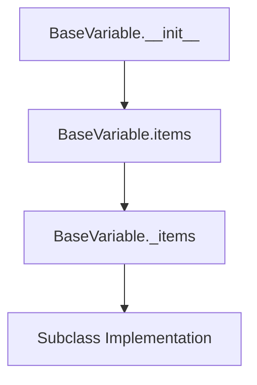
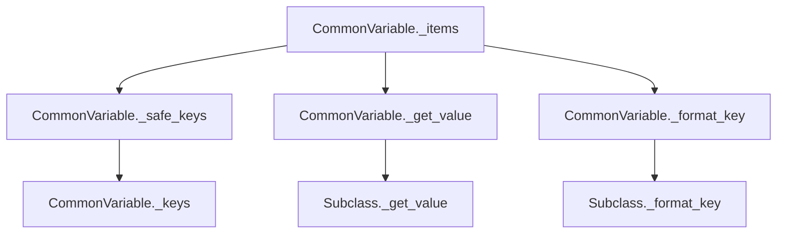
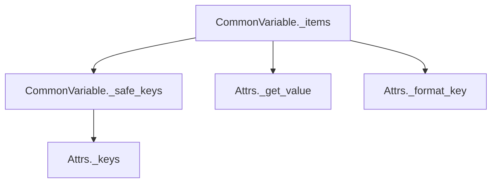
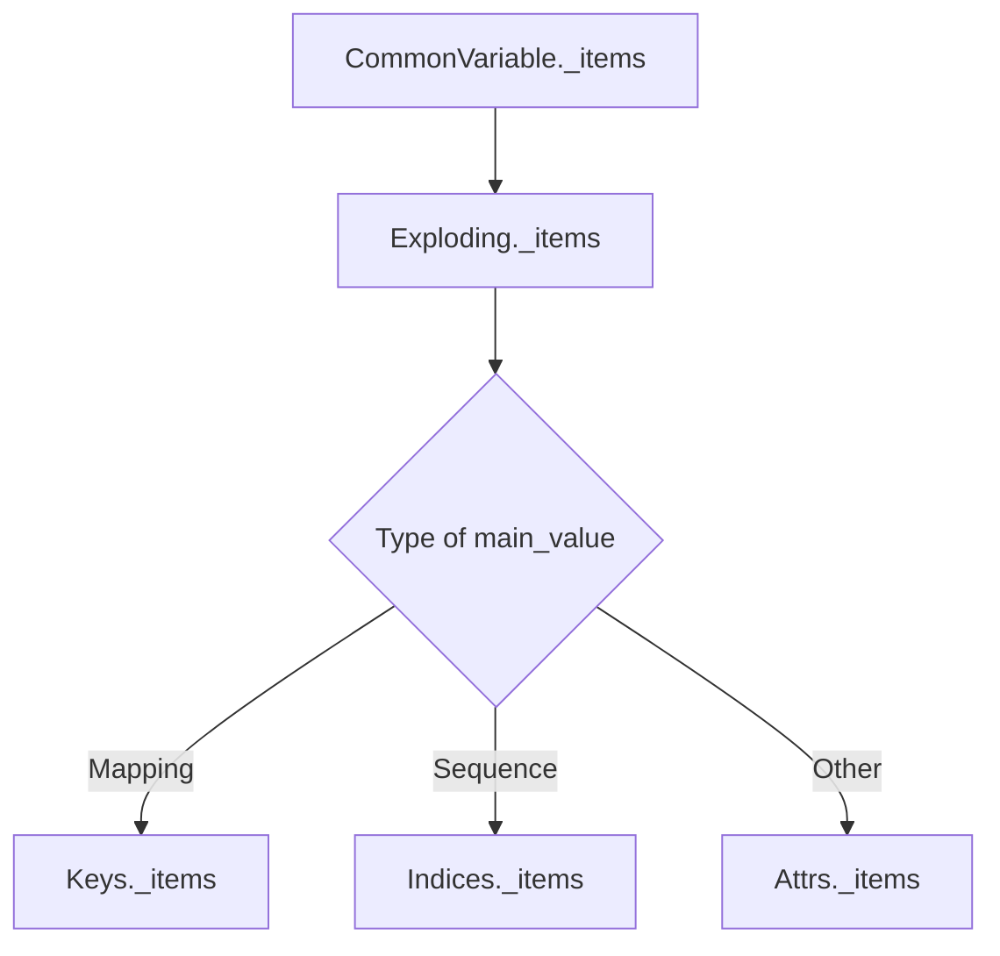

# `variables.py`

## `pysnooper.variables.needs_parentheses` · *function*

*No documentation generated.*

## `pysnooper.variables.BaseVariable` · *class*

## Summary:
Abstract base class representing a variable expression to be evaluated and inspected during function tracing in the pysnooper library.

## Description:
The BaseVariable class serves as the foundation for variable inspection in pysnooper, providing a standardized interface for evaluating expressions and extracting their items. It encapsulates a source expression that gets compiled and evaluated within a given frame context. Subclasses must implement the `_items()` method to define how the evaluated result should be processed and returned as inspectable items.

This class is part of pysnooper's variable tracking system, enabling developers to monitor variable states during function execution by providing a consistent abstraction over different types of variable representations.

## State:
- source (str): The Python expression to be evaluated as a string
- exclude (tuple): Tuple of names to exclude from inspection results, normalized via utils.ensure_tuple()
- code (compiled): Compiled bytecode of the source expression for efficient repeated evaluation
- unambiguous_source (str): Source expression wrapped in parentheses when needed to prevent ambiguity in parsing

## Lifecycle:
- Creation: Instantiate with a source expression string and optional exclude tuple
- Usage: Call `items(frame, normalize=False)` to evaluate and extract items from the expression in the given frame context
- Destruction: Follows normal Python object lifecycle with automatic garbage collection

## Method Map:


## Raises:
- TypeError: When attempting to instantiate BaseVariable directly (since it's abstract)
- Exception: During evaluation in `items()` method when the source expression raises an error (caught and returns empty tuple)

## Example:
```python
# BaseVariable is abstract - concrete implementations are used instead
# Typical usage pattern:
# 1. Create a subclass implementing _items()
# 2. Instantiate with source expression
# 3. Call items() with frame context

# Example of how it would be used:
# var = SomeConcreteVariable("my_var", exclude=("secret",))
# items = var.items(current_frame)
```

### `pysnooper.variables.BaseVariable.__init__` · *method*

## Summary:
Initializes a BaseVariable instance by compiling source code and setting up representation formatting.

## Description:
Constructs a BaseVariable object that represents a variable expression to be tracked during debugging. This method prepares the object's internal state for evaluating the variable expression and determining appropriate display formatting.

## Args:
    source (str): The string representation of the variable or expression to track
    exclude (tuple, optional): Elements to exclude from tracking. Defaults to empty tuple.

## Returns:
    None: This method initializes object state and returns nothing

## Raises:
    None explicitly raised

## State Changes:
    Attributes READ: None
    Attributes WRITTEN: 
        - self.source: Stores the original source string
        - self.exclude: Stores the processed exclude tuple
        - self.code: Stores compiled bytecode for evaluation
        - self.unambiguous_source: Stores source with parentheses if needed

## Constraints:
    Preconditions:
        - source must be a valid Python expression string
        - exclude parameter should be iterable or convertible to tuple
    Postconditions:
        - self.source contains the original source string
        - self.exclude contains a normalized tuple of excluded elements
        - self.code contains compiled bytecode for evaluation
        - self.unambiguous_source contains properly parenthesized source when needed

## Side Effects:
    None

### `pysnooper.variables.BaseVariable.items` · *method*

## Summary:
Evaluates a stored variable expression in the given frame context and returns its items representation.

## Description:
This method executes the compiled variable expression (`self.code`) within the provided frame's local and global scope. It serves as the primary interface for extracting variable information from a debugging context. When evaluation succeeds, it delegates to the abstract `_items` method to process the result. If evaluation fails, it gracefully returns an empty tuple.

## Args:
    frame (FrameType): The execution frame containing local and global variables to evaluate against
    normalize (bool): Flag indicating whether to normalize the returned items (default: False)

## Returns:
    tuple: Items extracted from the evaluated variable, or empty tuple if evaluation fails

## Raises:
    None: Exceptions during evaluation are caught and handled internally

## State Changes:
    Attributes READ: self.code, self._items
    Attributes WRITTEN: None

## Constraints:
    Preconditions: 
    - `frame` must be a valid Python frame object with f_globals and f_locals attributes
    - `self.code` must be a valid compiled expression that can be evaluated in the frame context
    
    Postconditions:
    - Returns a tuple of items representing the variable's contents
    - If evaluation fails, returns empty tuple regardless of normalize parameter

## Side Effects:
    None: No external I/O or state mutations occur beyond the evaluation context

### `pysnooper.variables.BaseVariable._items` · *method*

*No documentation generated.*

### `pysnooper.variables.BaseVariable._fingerprint` · *method*

## Summary:
Returns a unique tuple identifier for this BaseVariable instance based on its type, source code, and exclusion configuration.

## Description:
This property generates a fingerprint tuple that uniquely identifies a BaseVariable instance by combining its class type, source code expression, and exclusion settings. The fingerprint is used internally for hash computation and equality comparison operations, ensuring that BaseVariable instances with identical characteristics are treated as equivalent.

## Args:
    None

## Returns:
    tuple: A 3-element tuple containing (type, source, exclude) where:
        - type: The class type of this instance
        - source: The string source code expression being tracked
        - exclude: The tuple of excluded attribute names (or empty tuple)

## Raises:
    None

## State Changes:
    Attributes READ: self.source, self.exclude
    Attributes WRITTEN: None

## Constraints:
    Preconditions:
    - The instance must have valid source and exclude attributes
    - The returned tuple must be hashable (which is guaranteed by the types used)
    
    Postconditions:
    - The returned tuple remains consistent for the lifetime of the object
    - Equal BaseVariable instances will produce identical fingerprints

## Side Effects:
    None

### `pysnooper.variables.BaseVariable.__hash__` · *method*

## Summary:
Computes and returns the hash value of this BaseVariable instance based on its unique fingerprint.

## Description:
This method implements Python's magic method for hash computation, enabling BaseVariable instances to be used as dictionary keys or set elements. The hash is derived from the instance's immutable fingerprint, which consists of the class type, source code, and exclusion configuration. This ensures that equal BaseVariable instances will have identical hash values, satisfying the contract required for hash-based collections.

## Args:
    None

## Returns:
    int: An integer hash value representing this BaseVariable instance's unique identity.

## Raises:
    TypeError: If the _fingerprint attribute contains unhashable types (though this would be a programming error in the implementation).

## State Changes:
    Attributes READ: self._fingerprint
    Attributes WRITTEN: None

## Constraints:
    Preconditions:
    - The _fingerprint property must return a hashable value
    - The _fingerprint must be immutable for the lifetime of the object to maintain hash consistency
    
    Postconditions:
    - The returned hash value remains constant for the lifetime of the object
    - Equal objects (as determined by __eq__) will have equal hash values

## Side Effects:
    None

### `pysnooper.variables.BaseVariable.__eq__` · *method*

## Summary:
Compares two BaseVariable instances for equality based on their type, source code, and exclusion settings.

## Description:
This method implements equality comparison between BaseVariable instances by checking if they are the same type and have identical source code and exclusion configurations. It is part of the standard Python object comparison protocol and enables proper equality semantics for variable tracking objects.

## Args:
    other (object): Another object to compare with this BaseVariable instance

## Returns:
    bool: True if other is a BaseVariable instance with identical type, source, and exclude attributes; False otherwise

## Raises:
    None

## State Changes:
    Attributes READ: self._fingerprint, other._fingerprint
    Attributes WRITTEN: None

## Constraints:
    Preconditions: 
    - The other object must be an instance of BaseVariable or its subclasses
    - Both self and other must have valid _fingerprint properties
    
    Postconditions:
    - Returns True only when both objects are BaseVariable instances with matching fingerprints
    - Returns False for any other type of object or when fingerprints differ

## Side Effects:
    None

## `pysnooper.variables.CommonVariable` · *class*

## Summary:
Abstract base class for variable inspection that provides common functionality for examining variable contents and generating representations.

## Description:
CommonVariable serves as a foundational abstract class for implementing variable inspection capabilities in the pysnooper library. It defines the interface and common behavior for inspecting variables that have key-value relationships, such as dictionaries, objects, or other container-like structures. Subclasses must implement the abstract methods to handle specific variable types.

This class provides the core infrastructure for variable examination, including safe key iteration, value retrieval, and formatted representation generation. It's part of the variable inspection system that helps pysnooper track and display variable states during program execution.

## State:
- source (str): The original source name of the variable
- unambiguous_source (str): A unique identifier for the variable source  
- exclude (set): Set of keys to exclude from inspection during variable examination
- main_value: The actual value being inspected (inherited from BaseVariable)

## Lifecycle:
- Creation: Instantiated by subclasses that implement the abstract methods
- Usage: Called internally by pysnooper's variable inspection system to generate variable representations
- Destruction: Managed automatically by Python's garbage collection

## Method Map:


## Raises:
- NotImplementedError: When _format_key() or _get_value() methods are not implemented by subclasses

## Example:
```python
# This class would typically be subclassed like:
class DictVariable(CommonVariable):
    def _keys(self, main_value):
        return main_value.keys()
    
    def _format_key(self, key):
        return f'[{repr(key)}]'
    
    def _get_value(self, main_value, key):
        return main_value[key]

# Usage would be handled internally by pysnooper
# when inspecting dictionary variables during debugging
```

### `pysnooper.variables.CommonVariable._items` · *method*

## Summary:
Generates a list of key-value pairs representing the contents of a variable for debugging inspection.

## Description:
Processes a variable's evaluated value and constructs a list of (key, value) pairs for display in pysnooper's trace output. This method is called by `BaseVariable.items()` during variable inspection and serves as the core mechanism for extracting and formatting variable contents. It includes the main variable itself as the first item, followed by all accessible keys and their corresponding values from the variable's contents.

The method handles various edge cases including excluded keys, failed value retrievals, and provides clean string representations of both keys and values using utility functions.

## Args:
    main_value (Any): The evaluated result of the variable expression to be inspected
    normalize (bool): Flag indicating whether to normalize string representations of values (default: False)

## Returns:
    list[tuple[str, str]]: A list of key-value pairs where each pair consists of a formatted key string and a shortish representation of the corresponding value. The first pair represents the main variable itself, followed by pairs for each accessible key-value pair from the variable's contents.

## Raises:
    None: Exceptions during value retrieval are caught and skipped silently

## State Changes:
    Attributes READ: 
    - self.source: Original variable expression for the main value
    - self.unambiguous_source: Parenthesized version of source for key construction
    - self.exclude: Tuple of keys to exclude from inspection
    - self._safe_keys: Method for safely iterating over variable keys
    - self._get_value: Method for retrieving individual values by key
    - self._format_key: Method for formatting keys for display
    Attributes WRITTEN: None

## Constraints:
    Preconditions:
    - main_value must be an object that can be processed by the concrete implementation's _keys, _get_value, and _format_key methods
    - self.exclude must be a tuple-like object that supports membership testing
    - self.source and self.unambiguous_source must be strings
    
    Postconditions:
    - Always returns a list of tuples with at least one entry (the main variable)
    - Excluded keys are never included in the result
    - All returned values are properly formatted string representations

## Side Effects:
    None: No external I/O or state mutations occur beyond the evaluation context

### `pysnooper.variables.CommonVariable._safe_keys` · *method*

## Summary:
Safely yields keys from a variable's value while suppressing any exceptions that might occur during key enumeration.

## Description:
This method provides a defensive wrapper around key enumeration for variable inspection in the pysnooper debugging library. It attempts to iterate over keys using the inherited `_keys()` method, but gracefully handles any exceptions by silently continuing, ensuring that variable inspection doesn't fail due to problematic key enumeration operations.

The method is primarily used by the `_items()` method to enumerate variable contents for debugging output, allowing the debugger to continue functioning even when encountering unusual or problematic data structures that might raise exceptions during key enumeration.

## Args:
    main_value (Any): The variable value from which keys should be extracted. This can be any Python object that may or may not support key enumeration.

## Returns:
    generator: A generator yielding keys from the main_value. If key enumeration fails for any reason, the generator yields nothing.

## Raises:
    None: Exceptions during key enumeration are caught and suppressed.

## State Changes:
    Attributes READ: 
    - self._keys: Method for key enumeration (inherited from subclasses)
    
    Attributes WRITTEN: None

## Constraints:
    Preconditions:
    - main_value should be a Python object that can potentially be processed by the concrete implementation's _keys method
    - The method should only be called from within the variable inspection framework
    
    Postconditions:
    - Always returns a generator object (even if empty)
    - Never raises exceptions during iteration
    - If key enumeration fails, returns an empty generator

## Side Effects:
    None: No external I/O or state mutations occur beyond the evaluation context.

### `pysnooper.variables.CommonVariable._keys` · *method*

## Summary:
Returns an empty tuple, indicating no keys or indices to enumerate for this variable type.

## Description:
This method serves as the base implementation for enumerating keys or indices of a variable's contents. It is intended to be overridden by subclasses to provide appropriate key enumeration for specific variable types (e.g., dictionaries, lists, sets). The base implementation returns an empty tuple, which means no keys are available for enumeration.

This method is called internally by `_safe_keys()` to safely iterate over keys, and is part of the variable inspection framework in pysnooper. It's designed to be overridden in concrete subclasses to provide meaningful key enumeration for different data structures.

## Args:
    main_value (Any): The value being inspected, which could be any Python object.

## Returns:
    tuple: An empty tuple, indicating no keys or indices to enumerate.

## Raises:
    None

## State Changes:
    Attributes READ: None
    Attributes WRITTEN: None

## Constraints:
    Preconditions:
    - main_value can be any Python object
    - This method should only be called from within the variable inspection framework
    
    Postconditions:
    - Always returns an empty tuple
    - The return value is always a tuple (even if empty)

## Side Effects:
    None

### `pysnooper.variables.CommonVariable._format_key` · *method*

## Summary:
Formats a key for display in variable inspection output by converting it to a string representation suitable for inclusion in the traced variable's key-value pairs.

## Description:
This abstract method is responsible for formatting keys extracted from variable values for display in pysnooper's trace output. It is called during the variable inspection process to transform raw keys into human-readable string representations that can be displayed alongside their corresponding values.

The method is part of the CommonVariable class hierarchy and must be implemented by concrete subclasses to handle different key types appropriately. It is invoked internally by the `_items` method when processing variable contents for tracing.

## Args:
    key (any): The key to be formatted, typically representing an attribute name, dictionary key, or index from a container

## Returns:
    str: A formatted string representation of the key suitable for display in trace output

## Raises:
    NotImplementedError: This is an abstract method that must be implemented by subclasses

## State Changes:
    Attributes READ: None
    Attributes WRITTEN: None

## Constraints:
    Preconditions: 
    - Must be called from within the variable inspection context
    - The key parameter should be a valid key type for the container being inspected
    
    Postconditions:
    - Must return a string representation of the key
    - Should handle all key types that may be encountered during variable inspection

## Side Effects:
    None

### `pysnooper.variables.CommonVariable._get_value` · *method*

## Summary:
Retrieves a value from a main object using a specified key for variable inspection.

## Description:
Abstract method that defines the interface for retrieving values from objects during variable inspection in pysnooper. This method is called by the `_items` method to extract individual values from complex objects like dictionaries, lists, or custom objects for logging and debugging purposes.

## Args:
    main_value (object): The object from which to retrieve a value
    key (str): The key or attribute name used to identify which value to retrieve

## Returns:
    Any: The value associated with the specified key from main_value

## Raises:
    NotImplementedError: When called on the abstract base class CommonVariable
    AttributeError: When accessing an attribute that doesn't exist (in concrete implementations like Attrs)
    KeyError: When accessing a dictionary key that doesn't exist (in concrete implementations like Keys)
    Exception: Other exceptions may occur depending on the concrete implementation and object type

## State Changes:
    Attributes READ: None
    Attributes WRITTEN: None

## Constraints:
    Preconditions:
    - main_value must be an object compatible with the concrete implementation's access pattern
    - key must be a valid identifier for the access pattern (attribute name for Attrs, dict key for Keys)
    
    Postconditions:
    - Returns the value associated with key from main_value
    - Raises appropriate exceptions when the key is invalid or inaccessible

## Side Effects:
    None

## `pysnooper.variables.Attrs` · *class*

## Summary:
Handles inspection of object attributes by enumerating and accessing attributes from `__dict__` and `__slots__`.

## Description:
The Attrs class is a specialized variable inspection implementation that focuses on Python objects with attribute dictionaries (`__dict__`) and/or slot definitions (`__slots__`). It extends CommonVariable to provide attribute-specific key enumeration, formatting, and value retrieval capabilities for debugging and tracing purposes.

This class is used internally by pysnooper to inspect object attributes during program execution, particularly when variables reference instances of classes that define attributes through `__dict__` or `__slots__`. It enables detailed examination of object state for debugging and monitoring.

## State:
- Inherits all state from CommonVariable including:
  - source (str): Original variable expression name
  - unambiguous_source (str): Unique identifier for variable source
  - exclude (set): Keys to exclude from inspection
  - main_value: The actual object being inspected

## Lifecycle:
- Creation: Instantiated automatically by pysnooper when encountering object variables during tracing
- Usage: Called internally by CommonVariable._items() method during variable inspection process
- Destruction: Managed by Python's garbage collection

## Method Map:


## Raises:
- AttributeError: Raised by _get_value() when attempting to access non-existent attributes
- NotImplementedError: Inherited from CommonVariable if abstract methods aren't properly implemented

## Example:
```python
# When pysnooper encounters an object variable like:
class Person:
    def __init__(self):
        self.name = "Alice"
        self.age = 30

person = Person()

# The Attrs class would be used to:
# 1. Enumerate attributes via _keys(): ['name', 'age'] 
# 2. Format keys via _format_key(): ['.name', '.age']
# 3. Retrieve values via _get_value(): person.name, person.age
```

### `pysnooper.variables.Attrs._keys` · *method*

## Summary:
Returns an iterator over all attribute names accessible from an object's `__dict__` and `__slots__`.

## Description:
Extracts attribute names from both the object's `__dict__` (instance attributes) and `__slots__` (defined attributes) to provide a complete view of the object's attributes. This method is used internally by the pysnooper library to enumerate all attributes of an object for inspection and logging purposes.

This method is part of the variable inspection system in pysnooper, specifically designed to work with the `Attrs` class which handles attribute-based variable inspection. It's called by the `_safe_keys` method in the parent `CommonVariable` class to safely iterate over all available attributes.

## Args:
    main_value (Any): The object whose attributes are to be enumerated. This can be any Python object that may have `__dict__` and/or `__slots__` attributes.

## Returns:
    iterator: An itertools.chain object that yields attribute names from both `__dict__` and `__slots__` of the main_value object. If either attribute doesn't exist, it defaults to an empty iterable.

## Raises:
    None explicitly raised. The method uses `getattr` with default values, so it will never raise an exception.

## State Changes:
    Attributes READ: 
    - main_value.__dict__ (via getattr)
    - main_value.__slots__ (via getattr)
    
    Attributes WRITTEN: None

## Constraints:
    Preconditions:
    - main_value can be any Python object
    - The method assumes that if `__dict__` or `__slots__` exist, they should be iterable
    
    Postconditions:
    - Always returns an iterator (even if empty)
    - The returned iterator contains attribute names from both `__dict__` and `__slots__` if they exist
    - The method gracefully handles objects that don't have `__dict__` or `__slots__` by returning empty iterables

## Side Effects:
    None

### `pysnooper.variables.Attrs._format_key` · *method*

## Summary:
Formats a key by prepending a dot character for attribute variable representation.

## Description:
This method is responsible for formatting keys when inspecting object attributes. It prepends a dot ('.') to the provided key string to distinguish attribute access in variable representations. This method is part of the variable inspection system used by pysnooper to provide clear visual indication of attribute access patterns.

## Args:
    key (str): The key to be formatted, typically representing an attribute name.

## Returns:
    str: The formatted key with a leading dot character.

## Raises:
    None: This method does not raise any exceptions.

## State Changes:
    Attributes READ: None
    Attributes WRITTEN: None

## Constraints:
    Preconditions: The key parameter must be a string.
    Postconditions: The returned string will always have a leading dot followed by the original key content.

## Side Effects:
    None: This method performs no I/O operations or external service calls. It only manipulates the input string.

### `pysnooper.variables.Attrs._get_value` · *method*

## Summary:
Retrieves an attribute value from an object using the getattr builtin function.

## Description:
This method implements the abstract interface defined in CommonVariable to fetch attribute values from objects. It is used internally by the variable inspection system to extract attribute values for logging and debugging purposes.

## Args:
    main_value (object): The object from which to retrieve the attribute
    key (str): The name of the attribute to retrieve

## Returns:
    Any: The value of the specified attribute from main_value

## Raises:
    AttributeError: When the specified key does not exist as an attribute on main_value

## State Changes:
    Attributes READ: None
    Attributes WRITTEN: None

## Constraints:
    Preconditions: 
    - main_value must be an object that supports attribute access
    - key must be a string representing a valid attribute name on main_value
    
    Postconditions:
    - Returns the value of the attribute specified by key from main_value
    - Raises AttributeError if the attribute doesn't exist

## Side Effects:
    None

## `pysnooper.variables.Keys` · *class*

## Summary:
Concrete implementation of CommonVariable for inspecting dictionary-like objects in the pysnooper debugging tool.

## Description:
The Keys class is a specialized variable inspector that handles dictionary-like objects by implementing the abstract methods defined in CommonVariable. It enables pysnooper to examine and display the contents of dictionary variables during program execution, providing key-value inspection capabilities for debugging purposes.

This class is part of pysnooper's variable inspection system and is typically instantiated internally by the debugging framework when encountering dictionary-type variables during code tracing.

## State:
- Inherits all state from CommonVariable including source, unambiguous_source, exclude, and main_value attributes
- No additional instance attributes beyond those inherited from the parent class

## Lifecycle:
- Creation: Instantiated automatically by pysnooper's variable inspection system when processing dictionary-like variables
- Usage: Methods are called internally by CommonVariable's inspection mechanisms during variable examination
- Destruction: Managed by Python's garbage collection

## Method Map:
```mermaid
graph TD
    A[CommonVariable._items] --> B[Keys._keys]
    A --> C[Keys._get_value]
    A --> D[Keys._format_key]
    B --> E[main_value.keys()]
    C --> F[main_value[key]]
    D --> G[utils.get_shortish_repr(key)]
```

## Raises:
- NotImplementedError: Inherited from CommonVariable when methods are not properly implemented (though this is implemented in Keys)
- KeyError: When _get_value attempts to access a non-existent key in main_value

## Example:
```python
# Typically used internally by pysnooper
# When inspecting a dictionary variable like:
my_dict = {'a': 1, 'b': 2}

# Keys would be instantiated to handle this variable
# and would provide:
# - _keys(my_dict) -> dict_keys(['a', 'b'])
# - _format_key('a') -> '[a]'
# - _get_value(my_dict, 'a') -> 1
```

### `pysnooper.variables.Keys._keys` · *method*

## Summary:
Returns the keys iterator from a dictionary-like object for variable inspection.

## Description:
Extracts and returns the keys iterator from a dictionary or mapping object. This method is part of the Keys class implementation in pysnooper's variable inspection system, specifically designed to handle dictionary-like variables during debugging sessions. It's called internally by the `_safe_keys()` method during variable inspection to enumerate keys for display in debug output.

The method serves as a concrete implementation of the abstract `_keys()` interface defined in the `CommonVariable` base class, providing the specific behavior needed for key-value container inspection. It enables pysnooper to properly examine and display dictionary contents during program execution.

## Args:
    main_value (Mapping): A dictionary-like object or other mapping that supports the `keys()` method. This parameter represents the actual variable value being inspected.

## Returns:
    iterator: An iterator over the keys of the main_value mapping object. The exact type depends on the mapping implementation (e.g., dict_keys, OrderedDict_keys, etc.).

## Raises:
    AttributeError: When main_value does not have a `keys()` method (though this would typically be prevented by the calling context).

## State Changes:
    Attributes READ: None
    Attributes WRITTEN: None

## Constraints:
    Preconditions:
    - main_value must be a mapping-like object that supports the `keys()` method
    - The method should only be called within the variable inspection framework
    - main_value should not be None or a non-mapping object
    
    Postconditions:
    - Always returns a valid iterator over keys
    - The returned iterator is suitable for use in variable inspection contexts

## Side Effects:
    None: This method performs no I/O operations or external service calls. It only accesses the provided mapping object's keys method.

### `pysnooper.variables.Keys._format_key` · *method*

## Summary:
Formats a dictionary or mapping key for display in debugging output by wrapping it in square brackets with a shortened representation.

## Description:
Formats a key from a dictionary or mapping structure for debugging visualization. This method takes a key and returns a string representation wrapped in square brackets, using the utility function `get_shortish_repr` to create a clean, truncated representation of the key value. This is used internally by pysnooper to display dictionary keys in a readable format during variable inspection.

The method is part of the Keys class hierarchy that implements variable inspection for key-value structures, specifically designed to work with the CommonVariable base class framework for consistent variable representation.

## Args:
    key (Any): The key from a dictionary or mapping structure to be formatted for display

## Returns:
    str: A formatted string representation of the key enclosed in square brackets, e.g., "[key_value]"

## Raises:
    None explicitly raised

## State Changes:
    Attributes READ: None
    Attributes WRITTEN: None

## Constraints:
    - Precondition: The key parameter can be any hashable object that can be represented as a string
    - Postcondition: The returned string will always be in the format "[{representation}]" where {representation} is the shortish representation of the key

## Side Effects:
    - Calls utils.get_shortish_repr() which may perform string manipulation operations
    - No external I/O or service calls
    - No mutation of external objects

### `pysnooper.variables.Keys._get_value` · *method*

## Summary:
Retrieves a value from a dictionary-like container using the specified key.

## Description:
Retrieves a value from a dictionary or mapping object using the provided key. This method is part of the Keys class in pysnooper's variable inspection system, which handles inspection of dictionary-like variables. It implements the abstract `_get_value` interface defined in CommonVariable to extract individual values from key-value containers for debugging and tracing purposes.

The method is called internally by the `_items` method during variable inspection to fetch the value associated with each key in a dictionary or mapping structure. It's designed to work with any object that supports the `__getitem__` protocol (i.e., objects that can be indexed with square brackets).

## Args:
    main_value (Mapping): A dictionary-like object or other mapping that supports key-based access via square bracket notation
    key (Any): The key used to retrieve a value from main_value. This should be a valid key type for the mapping object

## Returns:
    Any: The value associated with the specified key in main_value. The return type depends on the mapping's implementation and the key used.

## Raises:
    KeyError: When the specified key does not exist in the main_value mapping
    TypeError: When main_value does not support key-based access (e.g., if it's not a mapping or sequence)

## State Changes:
    Attributes READ: None
    Attributes WRITTEN: None

## Constraints:
    Preconditions:
    - main_value must be a mapping-like object that supports the `__getitem__` protocol
    - key must be a valid key type for the main_value mapping
    - The method should only be called within the variable inspection context
    
    Postconditions:
    - Returns the value associated with key in main_value
    - Raises appropriate exceptions when key access fails

## Side Effects:
    None: This method performs no I/O operations or external service calls. It only accesses the provided mapping object using standard key lookup mechanisms.

## `pysnooper.variables.Indices` · *class*

## Summary:
Concrete implementation of CommonVariable for inspecting sliceable sequence objects in the pysnooper debugging tool, enabling indexed access to sequence elements.

## Description:
The Indices class is a specialized variable inspector that handles sliceable sequence objects (such as lists, tuples, and other indexable containers) by implementing the abstract methods defined in CommonVariable. It enables pysnooper to examine and display specific indexed portions of sequence variables during program execution, particularly useful for debugging array-like data structures.

This class is part of pysnooper's variable inspection system and is typically instantiated internally by the debugging framework when encountering sliceable sequence variables during code tracing. It supports slicing operations to selectively inspect portions of sequences rather than entire collections.

## State:
- _slice (slice): Instance attribute storing the slice object used to filter indices. Defaults to slice(None) which represents the full range.
- Inherits all state from CommonVariable including source, unambiguous_source, exclude, and main_value attributes

## Lifecycle:
- Creation: Instantiated automatically by pysnooper's variable inspection system when processing sliceable sequence variables
- Usage: Methods are called internally by CommonVariable's inspection mechanisms during variable examination, particularly through _keys() for index generation
- Destruction: Managed by Python's garbage collection

## Method Map:
```mermaid
graph TD
    A[CommonVariable._items] --> B[Indices._keys]
    B --> C[range(len(main_value))[self._slice]]
    A --> D[Indices.__getitem__]
    D --> E[deepcopy(self)]
    E --> F[result._slice = item]
```

## Raises:
- AssertionError: Raised in __getitem__ when the provided item is not a slice object
- NotImplementedError: Inherited from CommonVariable when methods are not properly implemented (though this is implemented in Indices)

## Example:
```python
# Typically used internally by pysnooper
# When inspecting a list variable like:
my_list = [10, 20, 30, 40, 50]

# Indices would be instantiated to handle this variable
# _keys(my_list) returns range(0, 5) which represents all indices
# sliced_indices = indices[1:4] creates a new instance with slice(1, 4, None)
# sliced_indices._keys(my_list) returns range(1, 4) which represents indices 1, 2, 3
```

### `pysnooper.variables.Indices._keys` · *method*

## Summary:
Returns a sliced range of indices for sequential data structures based on the current slice filter.

## Description:
Provides index key iteration for sequential data structures (lists, tuples, etc.) by generating a range of valid indices and applying the stored slice filter. This method is part of the Indices class that handles indexed variable inspection in pysnooper's debugging system.

The method is called during variable inspection when processing sequential containers to determine which indices should be examined. It leverages the slice filtering mechanism established by the `__getitem__` method to support array-like slicing operations.

## Args:
    main_value (Sequence): A sequential data structure (list, tuple, etc.) whose indices need to be enumerated. Must support the len() function.

## Returns:
    range: A range object containing integer indices that correspond to the slice filter applied to the length of main_value. The returned range represents valid indices for accessing elements in main_value.

## Raises:
    TypeError: When main_value does not support the len() function.
    AttributeError: When main_value does not have a __len__ method.

## State Changes:
    Attributes READ: self._slice
    Attributes WRITTEN: None

## Constraints:
    Preconditions:
    - main_value must be a sequence-like object supporting len() operation
    - main_value should not be None for meaningful index iteration
    
    Postconditions:
    - Returns a valid range object representing filtered indices
    - Does not modify the original Indices instance state
    - The range contains integers suitable for indexing main_value

## Side Effects:
    None: This method performs no I/O operations or external service calls. It only computes and returns a range object.

### `pysnooper.variables.Indices.__getitem__` · *method*

## Summary:
Creates a new Indices instance with a modified slice filter applied to the index selection.

## Description:
Handles slice indexing operations on Indices objects, allowing for filtered views of index ranges. This method enables array-like slicing syntax (e.g., indices[1:5]) to create new Indices instances with restricted index ranges while preserving the original object's state.

## Args:
    item (slice): A slice object defining the range of indices to select. Must be a slice type.

## Returns:
    Indices: A new Indices instance with the same properties as self, but with the _slice attribute updated to the provided slice.

## Raises:
    AssertionError: When the item parameter is not a slice object.

## State Changes:
    Attributes READ: self._slice
    Attributes WRITTEN: result._slice (on the copied instance)

## Constraints:
    Preconditions:
    - item must be an instance of slice type
    - The slice should define valid index bounds for the target data structure
    
    Postconditions:
    - Returns a new independent Indices instance (deep copy)
    - Original self instance remains unchanged
    - The returned instance's _slice attribute equals the provided slice

## Side Effects:
    None: This method performs no I/O operations or external service calls. It only creates a new object instance.

## `pysnooper.variables.Exploding` · *class*

## Summary:
A dynamic variable inspection dispatcher that selects the appropriate inspection strategy based on the type of the main_value.

## Description:
The `Exploding` class serves as a polymorphic variable inspector that dynamically routes inspection requests to specialized handlers based on the type of the value being inspected. It implements the Strategy pattern by determining whether the main_value is a Mapping, Sequence, or other object type, and then delegating to the corresponding specialized inspector class (`Keys`, `Indices`, or `Attrs` respectively).

This class is part of pysnooper's variable inspection system and is used internally to provide appropriate inspection behavior for different data structures during function tracing. It enables flexible and type-aware variable inspection without requiring explicit type checking in client code.

## State:
- Inherits all state from BaseVariable including:
  - source (str): The Python expression to be evaluated as a string
  - exclude (tuple): Tuple of names to exclude from inspection results
  - code (compiled): Compiled bytecode of the source expression
  - unambiguous_source (str): Source expression wrapped in parentheses when needed
- No additional instance attributes beyond those inherited from BaseVariable

## Lifecycle:
- Creation: Instantiated automatically by pysnooper's variable inspection system when processing variables during function tracing
- Usage: Called internally by CommonVariable._items() method during variable inspection process
- Destruction: Managed by Python's garbage collection

## Method Map:


## Raises:
- None explicitly raised by this class - exceptions are propagated from the delegated classes (Keys, Indices, or Attrs)

## Example:
```python
# When pysnooper encounters different variable types:
# Dictionary variable:
my_dict = {'key1': 'value1', 'key2': 'value2'}
# Exploding would delegate to Keys._items() to inspect dictionary keys

# List variable:
my_list = [1, 2, 3, 4]
# Exploding would delegate to Indices._items() to inspect list indices

# Object variable:
class MyClass:
    def __init__(self):
        self.attr1 = 'value1'
        self.attr2 = 'value2'

obj = MyClass()
# Exploding would delegate to Attrs._items() to inspect object attributes
```

### `pysnooper.variables.Exploding._items` · *method*

## Summary:
Determines the appropriate variable inspection class based on the type of main_value and delegates inspection to that class.

## Description:
The `_items` method in the `Exploding` class serves as a factory method that selects the appropriate variable inspection implementation based on the type of the `main_value` parameter. It routes the inspection process to either `Keys` for dictionary-like objects, `Indices` for sequence objects, or `Attrs` for general object attributes. This method enables polymorphic variable inspection within the pysnooper debugging framework.

This method is called internally by the variable inspection system when processing different types of variables during function tracing. It's designed to be a thin dispatcher that ensures the correct inspection strategy is applied based on the variable's underlying data structure.

## Args:
    main_value (Any): The actual value being inspected, which determines which inspection class to use
    normalize (bool): Flag indicating whether to normalize the inspection results (defaults to False)

## Returns:
    tuple: Inspection results from the delegated class's `_items` method, containing key-value pairs for the variable

## Raises:
    None explicitly raised by this method - exceptions are propagated from the delegated classes

## State Changes:
    Attributes READ: self.source, self.exclude
    Attributes WRITTEN: None

## Constraints:
    Preconditions: 
    - main_value must be a valid Python object that can be inspected
    - self.source and self.exclude must be properly initialized
    
    Postconditions:
    - Returns inspection results in a consistent tuple format regardless of the inspected object type
    - The returned items are properly filtered based on the exclude set

## Side Effects:
    None - this method is pure and doesn't cause any external mutations or I/O operations

