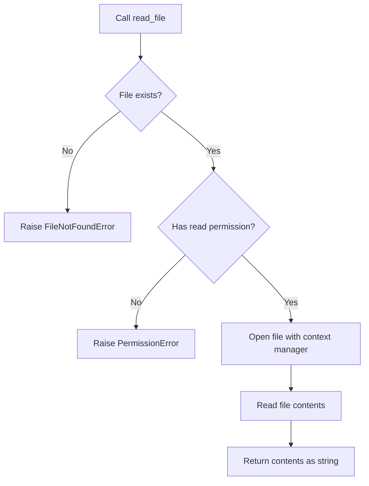

# `setup.py`

## `read_file` · *function*

## Summary:
Reads the complete contents of a text file and returns it as a string.

## Description:
Opens the specified file in read mode and returns its entire content as a string. This function uses Python's built-in file handling with UTF-8 encoding and a context manager to ensure proper resource management.

## Args:
    filename (str): Path to the text file to be read. Must be a valid file path that exists and is readable.

## Returns:
    str: The complete contents of the file as a string.

## Raises:
    FileNotFoundError: If the specified file does not exist at the given path.
    PermissionError: If the process does not have permission to read the specified file.

## Constraints:
    Preconditions:
        - The filename parameter must be a valid string representing a file path
        - The file must exist at the specified location
        - The process must have read permissions for the file
    Postconditions:
        - The file is properly closed after reading
        - The returned string contains the complete file content

## Side Effects:
    - Reads from the filesystem
    - May raise I/O related exceptions if file access fails

## Control Flow:


## Examples:
```python
# Basic usage
content = read_file("README.md")
print(content)

# Error handling
try:
    content = read_file("nonexistent.txt")
except FileNotFoundError:
    print("File not found")
```

