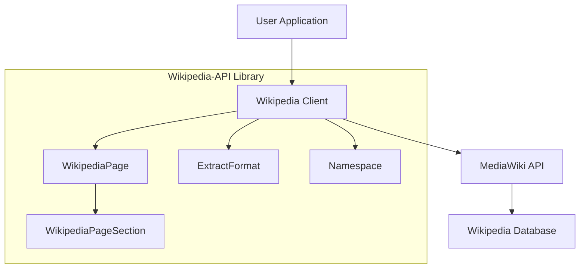

# `Wikipedia-API`

## Wikipedia-API Repository

### Tree:
```
Wikipedia-API/
├── wikipediaapi/
│   └── __init__.py
├── example.py
└── setup.py
```

**wikipediaapi/** - Main library module containing the core Wikipedia API client implementation and supporting classes for interacting with Wikipedia data.

**example.py** - Demonstrates usage patterns and showcases the library's capabilities through practical examples.

**setup.py** - Package configuration file for installing the Wikipedia-API library.

### Purpose:
The Wikipedia-API repository provides a Pythonic interface for accessing and extracting structured information from Wikipedia articles through the MediaWiki API. It addresses the need for developers to programmatically integrate Wikipedia content into their applications without dealing with the complexities of raw API interactions.

This library is particularly valuable for research tools, content analysis systems, educational platforms, and knowledge graph construction projects that require reliable access to Wikipedia's vast repository of structured information. It offers a clean abstraction layer that handles API rate limiting, session management, and lazy loading for efficient resource usage.

### Architecture:


The system follows a client-object model architecture where:
- The main `Wikipedia` client manages API sessions and provides factory methods for creating page objects
- `WikipediaPage` objects represent individual Wikipedia articles with lazy-loaded properties for efficient resource usage
- Hierarchical `WikipediaPageSection` objects model the nested structure of article content
- Enumerations (`ExtractFormat`, `Namespace`) provide type safety for configuration options
- The library implements thread-safe session management for concurrent usage

### Entry Points:
- **Importable API**: `from wikipediaapi import Wikipedia` - Main client class for API interactions
- **CLI Commands**: None - This is a library-only package
- **Service Endpoints**: None - Designed for programmatic use in Python applications

**Target Audience**: 
- Python developers building applications that require Wikipedia data integration
- Researchers analyzing Wikipedia content programmatically  
- Educational technology developers creating learning platforms
- Knowledge graph construction projects requiring structured Wikipedia data

### Core Features:
1. **Page Retrieval** - Fetch complete Wikipedia pages with lazy loading of content
2. **Content Extraction** - Extract page summaries, sections, and full text in various formats (wiki markup or HTML)
3. **Metadata Access** - Retrieve page properties, revision history, and structural information
4. **Link Navigation** - Access internal links, backlinks, and language translations
5. **Category Management** - Explore categories and their hierarchical membership
6. **Multi-language Support** - Access Wikipedia content in multiple languages through configurable clients
7. **Rate Limiting Handling** - Built-in session management to comply with Wikipedia API policies
8. **Structured Data Access** - Provides clean, Python-native data structures for Wikipedia content
9. **Namespace Handling** - Support for various Wikipedia namespaces (main, category, talk, etc.)
10. **Flexible Content Formatting** - Options for different content extraction formats

### Dependencies:
- **requests**: For HTTP communication with Wikipedia's MediaWiki API
- **typing**: For type hints and annotations to improve code clarity and IDE support

### Configuration:
The library primarily uses configuration through constructor parameters:
- `user_agent`: Required identifier for API requests (must comply with Wikipedia's terms of service)
- `language`: Wikipedia language code (defaults to "en" for English)
- `extract_format`: Controls content formatting (WIKI or HTML)
- Additional HTTP headers can be passed through the `headers` parameter

### Extension Points:
The library supports extension through:
- Custom user agents that follow Wikipedia's usage policies
- Language selection for accessing multilingual Wikipedia content
- Session customization for advanced rate limiting control
- Subclassing of core classes for specialized behavior
- Plugin-style usage of the provided utility functions for data processing

---

## Modules

- [`wikipediaapi`](wikipediaapi.md)

