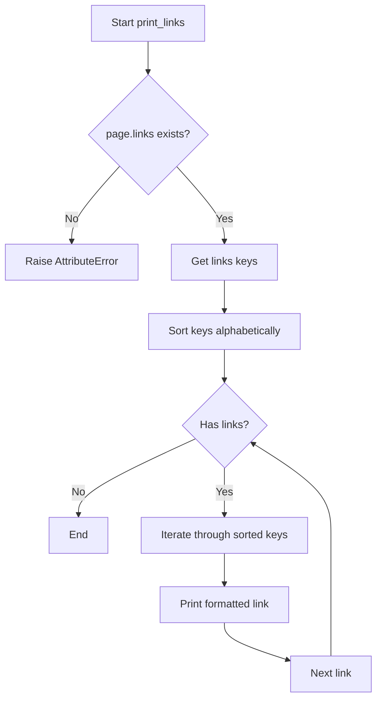

# `example.py`

## `print_sections` · *function*

## Summary:
Recursively prints hierarchical section data with indentation and text truncation.

## Description:
Displays section titles and first 40 characters of section text with increasing asterisk indentation based on nesting level. This function recursively processes hierarchical content structures, commonly used for visualizing Wikipedia page sections.

## Args:
    sections (list): Iterable of section objects with 'title' and 'text' attributes
    level (int): Current nesting level for indentation (default: 0)

## Returns:
    None: This function only produces output to stdout

## Raises:
    AttributeError: If section objects lack 'title' or 'text' attributes
    TypeError: If sections parameter is not iterable or section.text is not indexable

## Constraints:
    Preconditions:
        - sections parameter must be iterable
        - Each section object must have 'title' and 'text' attributes
        - Section text should support slicing operations (s.text[0:40])
    Postconditions:
        - All sections and subsections are printed to stdout with proper indentation
        - Output format: "* Title - Text excerpt"

## Side Effects:
    - Writes formatted text to standard output (stdout)
    - No external state mutations

## Control Flow:
```mermaid
flowchart TD
    A[print_sections(sections, level)] --> B{sections empty?}
    B -- Yes --> C[Return]
    B -- No --> D[For each section s in sections]
    D --> E[Print "%s: %s - %s" % ("*" * (level + 1), s.title, s.text[0:40])]
    E --> F[Recursively call print_sections(s.sections, level + 1)]
    F --> G[Continue to next section]
    G --> B
```

## Examples:
```python
# Basic usage with Wikipedia sections
wiki = wikipediaapi.Wikipedia('en')
page = wiki.page('Python_(programming_language)')
print_sections(page.sections)

# With custom level starting at 1
print_sections(page.sections, level=1)
```

## `print_langlinks` · *function*

## Summary:
Prints language links from a Wikipedia page in a formatted manner, showing the language code, target language, title, and full URL for each link.

## Description:
This function extracts language links from a Wikipedia page object and displays them in a standardized format. It's designed to provide a human-readable view of multilingual connections for a Wikipedia article. The function sorts the language links alphabetically by language code before printing them.

## Args:
    page (wikipediaapi.Page): A Wikipedia page object containing language links. This parameter must be a valid wikipediaapi.Page instance with a populated langlinks attribute.

## Returns:
    None: This function does not return any value. It performs I/O operations by printing to standard output.

## Raises:
    AttributeError: If the provided page object does not have a langlinks attribute or if langlinks is not accessible.

## Constraints:
    Preconditions:
    - The page parameter must be a valid wikipediaapi.Page object
    - The page object must have a langlinks attribute that behaves like a dictionary
    - The langlinks dictionary must contain values that have language, title, and fullurl attributes
    
    Postconditions:
    - All language links from the page are printed to stdout in a formatted manner
    - The function completes execution without returning a value

## Side Effects:
    - Prints formatted text to standard output (stdout)
    - No external state mutations or I/O operations beyond printing

## Control Flow:
```mermaid
flowchart TD
    A[Start print_langlinks] --> B{page.langlinks exists?}
    B -- Yes --> C[Get sorted langlinks keys]
    C --> D[Iterate through keys]
    D --> E{Key exists in langlinks?}
    E -- Yes --> F[Get langlinks[key] value]
    F --> G[Print formatted string]
    G --> H[Next key]
    H --> D
    E -- No --> I[Continue iteration]
    B -- No --> J[AttributeError raised]
```

## Examples:
    # Assuming a valid wikipediaapi.Page object named 'page'
    print_langlinks(page)
    # Output would be something like:
    # de: German - Berlin: https://de.wikipedia.org/wiki/Berlin
    # es: Spanish - Madrid: https://es.wikipedia.org/wiki/Madrid
    # fr: French - Paris: https://fr.wikipedia.org/wiki/Paris

## `print_links` · *function*

## Summary:
Prints all links from a Wikipedia page in alphabetical order with their titles.

## Description:
This function extracts and displays all hyperlinks found on a Wikipedia page in a sorted, formatted manner. It's designed to provide a clean view of all internal Wikipedia links from a given page.

## Args:
    page: A Wikipedia page object from the wikipediaapi library containing a links attribute

## Returns:
    None: This function does not return any value

## Raises:
    AttributeError: If the page parameter does not have a links attribute
    TypeError: If page.links is not a dictionary-like object with keys() method

## Constraints:
    Preconditions:
    - The page parameter must be a valid Wikipedia page object from wikipediaapi
    - The page.links attribute must be accessible and contain key-value pairs
    
    Postconditions:
    - All links from the page are printed to standard output in alphabetical order
    - The original page object remains unchanged

## Side Effects:
    - Prints formatted output to standard output (stdout)
    - No external state mutations or I/O operations beyond printing

## Control Flow:


## Examples:
```python
# Assuming wiki_page is a valid Wikipedia page object
print_links(wiki_page)
# Output (example):
# Category:Art: https://en.wikipedia.org/wiki/Category:Art
# Category:Music: https://en.wikipedia.org/wiki/Category:Music
# History of music: https://en.wikipedia.org/wiki/History_of_music
```

## `print_categories` · *function*

## Summary:
Displays category information from a Wikipedia page object in alphabetical order.

## Description:
This function extracts category data from a Wikipedia page object and prints each category with its associated value in a formatted manner. The categories are displayed in alphabetical order based on their titles.

## Args:
    page: A Wikipedia page object that contains a categories attribute. The categories attribute should be a dictionary-like object where keys represent category names and values represent category metadata.

## Returns:
    None: This function does not return any value.

## Raises:
    AttributeError: If the provided page object does not have a categories attribute.

## Constraints:
    Preconditions:
    - The page parameter must be a valid object with a categories attribute
    - The categories attribute must support dictionary-like access via .keys() method
    - The category titles must be sortable (support comparison operations)
    
    Postconditions:
    - All categories from the page are printed to standard output in alphabetical order
    - Function execution completes without returning a value

## Side Effects:
    - Prints formatted text to standard output (stdout)
    - No modifications to external state or files

## Control Flow:
```mermaid
flowchart TD
    A[Start print_categories] --> B[Get page.categories]
    B --> C[Get sorted(category.keys())]
    C --> D[For each title in sorted list]
    D --> E[Print "%s: %s" % (title, categories[title])]
    E --> F[Next title]
    F --> D
    D --> G[End iteration]
    G --> H[Return None]
```

## Examples:
```python
# Basic usage with a Wikipedia page object
page = wiki_page.page('Example_Page')
print_categories(page)
# Output format:
# Category_Title_1: Category_Metadata_1
# Category_Title_2: Category_Metadata_2
```

## `print_categorymembers` · *function*

## Summary:
Prints Wikipedia category members with hierarchical indentation based on nesting level.

## Description:
Recursively prints category members from a Wikipedia category tree with proper indentation. Each level of nesting is represented by increasing asterisk prefixes. The function stops recursing when the maximum depth level is reached or when encountering non-category namespaces.

## Args:
    categorymembers (dict-like): Dictionary of category members with title and namespace attributes
    level (int): Current nesting level for indentation (default: 0)
    max_level (int): Maximum allowed nesting depth (default: 2)

## Returns:
    None: This function only produces output via print statements

## Raises:
    AttributeError: If categorymembers doesn't support .values() method or if category members lack title or ns attributes
    RecursionError: If the category hierarchy is too deep and exceeds Python's recursion limit

## Constraints:
    Preconditions:
    - categorymembers must be iterable with .values() method
    - Each member in categorymembers must have title and ns attributes
    - level must be a non-negative integer
    - max_level must be a non-negative integer
    
    Postconditions:
    - All category members up to max_level will be printed with appropriate indentation
    - Function terminates when recursion limit is reached or max_level is exceeded

## Side Effects:
    - Prints formatted output to standard output (stdout)
    - May cause RecursionError if category hierarchy is very deep

## Control Flow:
```mermaid
flowchart TD
    A[Start print_categorymembers] --> B{categorymembers.values()}
    B --> C[Iterate through members]
    C --> D[Print member with level indent]
    D --> E{member.ns == CATEGORY AND level < max_level}
    E -->|True| F[Recursive call with level+1]
    E -->|False| G[Continue iteration]
    F --> H[Return from recursion]
    G --> I[Continue loop]
    I --> J{More members?}
    J -->|Yes| C
    J -->|No| K[End]
```

## Examples:
    # Basic usage
    print_categorymembers(category_dict)
    
    # With custom depth limit
    print_categorymembers(category_dict, max_level=3)
    
    # With custom starting level
    print_categorymembers(category_dict, level=1, max_level=4)
```

