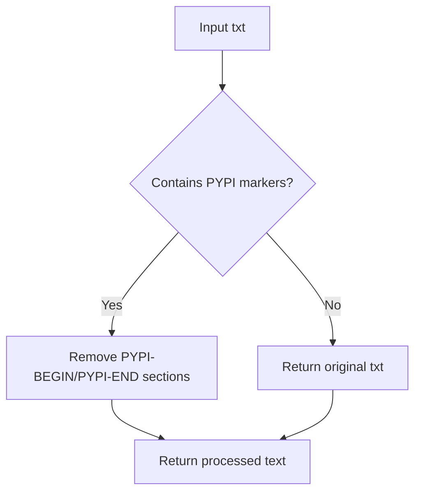

# `setup.py`

## `fix_doc` · *function*

## Summary:
Removes content between PYPI-BEGIN and PYPI-END markers from documentation text.

## Description:
Processes documentation text by stripping out sections enclosed between ".. PYPI-BEGIN" and "PYPI-END" markers. This utility function is typically used to conditionally exclude content from package distributions or documentation builds that should only appear in specific contexts (such as PyPI-specific notes or examples).

## Args:
    txt (str): The documentation text to process, potentially containing PYPI-BEGIN/PYPI-END markers.

## Returns:
    str: The processed documentation text with all content between PYPI-BEGIN and PYPI-END markers removed.

## Raises:
    None: This function does not raise any exceptions.

## Constraints:
    Preconditions: The input text should be a valid string.
    Postconditions: The returned string will have all PYPI-BEGIN/PYPI-END sections removed, preserving all other content.

## Side Effects:
    None: This function performs no I/O operations or external state mutations.

## Control Flow:


## Examples:
    # Basic usage
    doc_text = "Some documentation.. PYPI-BEGIN This content is for PyPI only PYPI-END More content"
    cleaned = fix_doc(doc_text)
    # Result: "Some documentationMore content"
    
    # No markers present
    doc_text = "Simple documentation without markers"
    cleaned = fix_doc(doc_text)
    # Result: "Simple documentation without markers"
```

