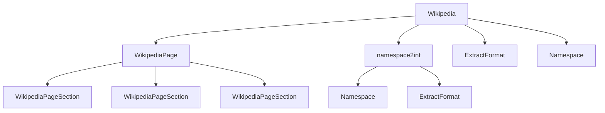

# `wikipediaapi`

## Tree:
```
wikipediaapi/
└── __init__.py
```

## Role:
Provides a Pythonic interface for accessing and extracting structured information from Wikipedia articles through the MediaWiki API.

## Description:
The wikipediaapi module serves as a comprehensive wrapper around Wikipedia's MediaWiki API, offering developers an intuitive way to programmatically access Wikipedia content. It abstracts the complexity of API interactions while providing rich functionality for extracting page summaries, sections, links, categories, and other metadata.

This module is designed to be used in applications requiring Wikipedia data integration, such as research tools, content analysis systems, educational platforms, and knowledge graph construction projects. It supports multiple languages, handles API rate limiting through session management, and implements lazy loading for efficient resource usage.

## Components:
*   `Wikipedia` - Main entry point for API interactions, managing HTTP sessions and providing methods to fetch various page properties
*   `WikipediaPage` - Represents individual Wikipedia pages with lazy-loaded properties for efficient data retrieval
*   `WikipediaPageSection` - Models hierarchical section structure within Wikipedia pages
*   `Namespace` - Enumeration of standard Wikipedia namespace identifiers
*   `ExtractFormat` - Enumeration controlling content extraction format (wiki markup vs HTML)
*   `namespace2int` - Utility function for normalizing namespace identifiers to integers



## Public API:
*   `Wikipedia(user_agent: str, language: str = "en", extract_format: ExtractFormat = ExtractFormat.WIKI, headers: Optional[Dict[str, Any]] = None, **kwargs)` - Constructor for the main Wikipedia API client
*   `Wikipedia.page(title: str, ns: WikiNamespace = Namespace.MAIN, unquote: bool = False)` - Factory method to create WikipediaPage objects
*   `Wikipedia.article(title: str, ns: WikiNamespace = Namespace.MAIN, unquote: bool = False)` - Alias for `page()` method
*   `Wikipedia.extracts(page: WikipediaPage, **kwargs)` - Fetches page summary text
*   `Wikipedia.info(page: WikipediaPage)` - Retrieves page metadata and properties
*   `Wikipedia.langlinks(page: WikipediaPage, **kwargs)` - Gets language links to other versions
*   `Wikipedia.links(page: WikipediaPage, **kwargs)` - Fetches links to other Wikipedia pages
*   `Wikipedia.backlinks(page: WikipediaPage, **kwargs)` - Retrieves backlinks from other pages
*   `Wikipedia.categories(page: WikipediaPage, **kwargs)` - Gets categories associated with a page
*   `Wikipedia.categorymembers(page: WikipediaPage, **kwargs)` - Fetches members of a category
*   `WikipediaPage(wiki: Wikipedia, title: str, ns: WikiNamespace = Namespace.MAIN, language: str = "en", url: Optional[str] = None)` - Constructor for page representations
*   `WikipediaPageSection(wiki: Wikipedia, title: str, level: int = 0, text: str = "")` - Constructor for section representations
*   `Namespace` - Enum of Wikipedia namespace identifiers
*   `ExtractFormat` - Enum controlling extraction format (WIKI or HTML)
*   `namespace2int(namespace: WikiNamespace)` - Utility function to convert namespace identifiers to integers

## Dependencies:
*   Internal: None
*   External: 
    *   `requests` - For HTTP communication with Wikipedia API
    *   `typing` - For type hints and annotations

## Constraints:
*   All API calls require a valid `user_agent` parameter that complies with Wikipedia's terms of service
*   The `language` parameter must be a valid Wikipedia language code (e.g., "en", "fr", "de")
*   The `extract_format` parameter controls how content is formatted and affects parsing behavior
*   The module is thread-safe for concurrent usage of different Wikipedia instances
*   Individual WikipediaPage objects should not be shared across threads without proper synchronization
*   API rate limiting is handled by the underlying requests.Session, but applications should implement appropriate delays for bulk operations

---

## Files

- [`__init__.py`](wikipediaapi/__init__.md)

