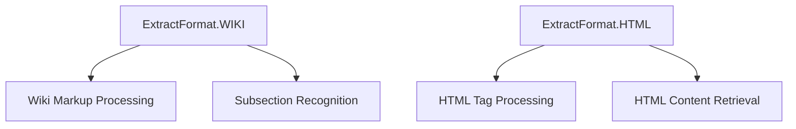
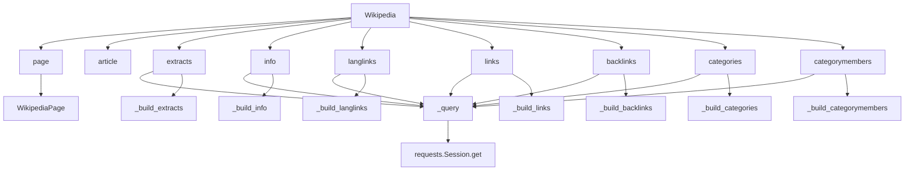

```mermaid
graph TD
    A[Namespace] --> B[MAIN=0]
    A --> C[TALK=1]
    A --> D[USER=2]
    A --> E[USER_TALK=3]
    A --> F[WIKIPEDIA=4]
    A --> G[WIKIPEDIA_TALK=5]
    A --> H[FILE=6]
    A --> I[FILE_TALK=7]
    A --> J[MEDIAWIKI=8]
    A --> K[MEDIAWIKI_TALK=9]
    A --> L[TEMPLATE=10]
    A --> M[TEMPLATE_TALK=11]
    A --> N[HELP=12]
    A --> O[HELP_TALK=13]
    A --> P[CATEGORY=14]
    A --> Q[CATEGORY_TALK=15]
    A --> R[PORTAL=100]
    A --> S[PORTAL_TALK=101]
    A --> T[PROJECT=102]
    A --> U[PROJECT_TALK=103]
    A --> V[REFERENCE=104]
    A --> W[REFERENCE_TALK=105]
    A --> X[BOOK=108]
    A --> Y[BOOK_TALK=109]
    A --> Z[DRAFT=118]
    A --> AA[DRAFT_TALK=119]
    A --> AB[EDUCATION_PROGRAM=446]
    A --> AC[EDUCATION_PROGRAM_TALK=447]
    A --> AD[TIMED_TEXT=710]
    A --> AE[TIMED_TEXT_TALK=711]
    A --> AF[MODULE=828]
    A --> AG[MODULE_TALK=829]
    A --> AH[GADGET=2300]
    A --> AI[GADGET_TALK=2301]
    A --> AJ[GADGET_DEFINITION=2302]
    A --> AK[GADGET_DEFINITION_TALK=2303]
```

# `__init__.py`

## `wikipediaapi.__init__.ExtractFormat` · *class*

## Summary:
Enumeration representing different extraction formats for Wikipedia content processing.

## Description:
The ExtractFormat class defines constants for specifying how Wikipedia content should be extracted and processed. It serves as a type-safe way to indicate whether content should be processed in wiki markup format or HTML format, enabling different parsing strategies for various use cases.

This enum is used throughout the wikipediaapi library to control how content is retrieved and formatted when making API requests to Wikipedia.

## State:
- WIKI: Integer value 1, enables recognizing subsections in wiki markup format
- HTML: Integer value 2, allows retrieval of HTML tags from content

The enum values are immutable and represent fixed extraction strategies that cannot be modified at runtime.

## Lifecycle:
- Creation: Instantiated automatically when referenced by name (WIKI or HTML)
- Usage: Used as a parameter in API calls to specify extraction format
- Destruction: Managed automatically by Python's garbage collector

## Method Map:


## Raises:
No exceptions are raised during instantiation as this is a simple enum class.

## Example:
```python
# Using the enum to specify extraction format
format_wiki = ExtractFormat.WIKI
format_html = ExtractFormat.HTML

# These can be used as parameters in API calls
# api.get_page(title, extract_format=format_wiki)
```

## `wikipediaapi.__init__.Namespace` · *class*

## Summary:
Represents Wikipedia namespace identifiers as integer enumeration values.

## Description:
The Namespace class provides a standardized way to reference Wikipedia namespaces throughout the wikipediaapi library. It defines constants for all major Wikipedia namespaces and their talk pages, enabling type-safe operations and preventing invalid namespace values. This class is used internally by the library to categorize and organize Wikipedia page content according to standard Wikipedia namespace conventions.

## State:
- Inherits from IntEnum, providing integer values for each namespace constant
- All namespace constants are defined as class attributes with integer values
- Each namespace constant represents a specific Wikipedia namespace or talk namespace
- No instance variables or mutable state

## Lifecycle:
- Creation: Instantiated automatically when importing the wikipediaapi module
- Usage: Used as a static enumeration throughout the library's operation
- Destruction: Managed automatically by Python's garbage collection

## Method Map:


## Raises:
- No exceptions are raised during initialization as this is a simple enumeration class
- All namespace constants are predefined and immutable

## Example:
```python
from wikipediaapi import Namespace

# Access namespace constants
main_namespace = Namespace.MAIN  # Returns 0
user_namespace = Namespace.USER   # Returns 2
talk_namespace = Namespace.TALK   # Returns 1

# Use in comparisons
if page.namespace == Namespace.MAIN:
    print("This is a main article")

# Iterate over all namespaces
for ns in Namespace:
    print(f"{ns.name}: {ns.value}")
```

## `wikipediaapi.__init__.namespace2int` · *function*

## Summary:
Converts a namespace identifier to its corresponding integer value.

## Description:
This function serves as a utility to normalize namespace identifiers to their integer representations. It accepts either a Namespace enum instance or a raw integer and returns the appropriate integer value. This abstraction allows the codebase to handle both enum-based and integer-based namespace specifications uniformly.

## Args:
    namespace (WikiNamespace): A namespace identifier that can be either a Namespace enum instance or an integer representing a namespace.

## Returns:
    int: The integer representation of the namespace. If the input is already an integer, it is returned unchanged. If the input is a Namespace enum instance, its .value attribute is returned.

## Raises:
    None explicitly raised by this function.

## Constraints:
    Preconditions:
    - The input namespace must be either an integer or a Namespace enum instance
    - If namespace is a Namespace enum instance, it must have a .value attribute that is an integer
    
    Postconditions:
    - The returned value is always an integer
    - The function preserves the semantic meaning of the namespace identifier

## Side Effects:
    None

## Control Flow:
```mermaid
flowchart TD
    A[namespace2int called] --> B{isinstance(namespace, Namespace)?}
    B -- Yes --> C[return namespace.value]
    B -- No --> D[return namespace]
```

## Examples:
    # Converting a Namespace enum instance
    ns = Namespace.MAIN
    result = namespace2int(ns)  # Returns 0
    
    # Converting an integer namespace
    result = namespace2int(1)   # Returns 1
```

## `wikipediaapi.__init__.Wikipedia` · *class*

## Summary:
Wikipedia is a wrapper class for accessing Wikipedia's API to extract structured information from Wikipedia pages.

## Description:
The Wikipedia class serves as the main entry point for interacting with Wikipedia's API. It provides methods to construct WikipediaPage objects and retrieve various types of information from those pages, such as extracts (summaries), page metadata, language links, links to other pages, backlinks, categories, and category members. The class manages HTTP sessions and handles API communication with proper headers and error handling.

This class should be instantiated once per application or session to efficiently reuse HTTP connections and manage API rate limits. It's designed to be used in conjunction with WikipediaPage objects, which represent individual Wikipedia articles.

## State:
- language: str - The language code for the Wikipedia instance (e.g., "en", "fr"). Must be a non-empty string after stripping whitespace.
- extract_format: ExtractFormat - Controls how extracts are formatted (HTML or Wiki markup). Defaults to ExtractFormat.WIKI.
- _session: requests.Session - HTTP session used for making API requests with configured headers.
- _request_kwargs: dict - Additional keyword arguments passed to requests.Session.get() for configuring HTTP requests.

## Lifecycle:
- Creation: Instantiate with user_agent (required), optional language, extract_format, headers, and additional kwargs for requests configuration.
- Usage: Call methods like page() to create WikipediaPage objects, then call extraction methods on those pages.
- Destruction: Automatically closes the HTTP session when the object is deleted via __del__.

## Method Map:


## Raises:
- AssertionError: Raised during initialization if user_agent is not provided or is less than 5 characters long, or if language is not specified.
- Various exceptions from requests.Session.get() when making HTTP requests (though these are not explicitly caught in the provided code).

## Example:
```python
import wikipediaapi

# Create a Wikipedia instance
wiki = wikipediaapi.Wikipedia('MyApp/1.0', language='en')

# Get a page
page = wiki.page('Python_(programming_language)')

# Extract summary
summary = wiki.extracts(page, exsentences=2)

# Get page info
wiki.info(page)

# Get language links
langlinks = wiki.langlinks(page)

# Get links to other pages
links = wiki.links(page)

# Get backlinks
backlinks = wiki.backlinks(page)

# Get categories
categories = wiki.categories(page)

# Get category members
members = wiki.categorymembers(page)
```

### `wikipediaapi.__init__.Wikipedia.__init__` · *method*

## Summary:
Initializes a Wikipedia client with configuration for making API requests.

## Description:
Constructs a Wikipedia object that handles communication with Wikipedia's API endpoints. This method sets up the HTTP session, validates required parameters like user agent, and configures request parameters for subsequent API calls.

## Args:
    user_agent (str): HTTP User-Agent string required by Wikipedia's terms of service. Must be longer than 5 characters.
    language (str, optional): Language code for the Wikipedia instance. Defaults to "en".
    extract_format (ExtractFormat, optional): Format used for content extraction. Defaults to ExtractFormat.WIKI.
    headers (Dict[str, Any], optional): Additional HTTP headers to include in requests. Defaults to None.
    **kwargs: Additional keyword arguments passed to requests library for configuring HTTP behavior.

## Returns:
    None: This method initializes instance attributes and does not return a value.

## Raises:
    AssertionError: When user_agent is not provided or is less than 6 characters long, or when language is empty after stripping.

## State Changes:
    Attributes READ: None
    Attributes WRITTEN: 
        - self.language: Stores the normalized language code
        - self.extract_format: Stores the extraction format setting
        - self._session: Creates and configures a requests.Session object
        - self._request_kwargs: Stores additional request configuration parameters

## Constraints:
    Preconditions:
        - user_agent must be a non-empty string with length greater than 5 characters
        - language must be a non-empty string after stripping whitespace
    Postconditions:
        - self.language is stored as lowercase, stripped string
        - self._session is initialized with configured headers
        - self._request_kwargs contains all provided kwargs plus default timeout

## Side Effects:
    - Creates a requests.Session object for HTTP communication
    - Sets up logging with configuration information
    - Updates default headers with user agent information

### `wikipediaapi.__init__.Wikipedia.page` · *method*

## Summary:
Constructs and returns a WikipediaPage object for the specified page title, enabling access to Wikipedia content and metadata.

## Description:
The `page` method serves as the primary entry point for accessing Wikipedia content through the wikipediaapi library. It creates a WikipediaPage instance that represents a specific Wikipedia page and allows for lazy-loading of content sections, links, categories, and other metadata on-demand.

This method is typically called as the first step in any Wikipedia data extraction workflow. It handles URL decoding when requested and delegates the creation of the WikipediaPage object to the WikipediaPage constructor, passing along the current Wikipedia instance, page title, namespace, and language settings.

The method is designed to be a factory method that encapsulates the creation logic for WikipediaPage objects, providing a clean interface for users to begin working with Wikipedia content. It is functionally equivalent to the `article` method, serving as an alias for the same functionality.

## Args:
    title (str): The title of the Wikipedia page as it appears in the Wikipedia URL
    ns (WikiNamespace): The namespace identifier for the page, defaults to Namespace.MAIN
    unquote (bool): If True, applies URL decoding to the title parameter, defaults to False

## Returns:
    WikipediaPage: An instance representing the requested Wikipedia page with lazy-loaded properties

## Raises:
    None explicitly raised by this method

## State Changes:
    Attributes READ: 
    - self.language: Used to pass language information to the WikipediaPage constructor
    
    Attributes WRITTEN: 
    - None: This method does not modify any attributes of the Wikipedia instance

## Constraints:
    Preconditions:
    - The Wikipedia instance must be properly initialized with a valid user_agent and language
    - The title parameter should represent a valid Wikipedia page title
    - The ns parameter must be a valid WikiNamespace value
    
    Postconditions:
    - Returns a valid WikipediaPage instance with the specified title and namespace
    - The returned WikipediaPage is configured with the same language as the Wikipedia instance
    - If unquote=True, the title parameter is URL-decoded before creating the WikipediaPage

## Side Effects:
    I/O: None directly, but the returned WikipediaPage may trigger HTTP requests when its properties are accessed
    External service calls: None directly, but the WikipediaPage may make API calls to Wikimedia services when properties are accessed
    Mutations to objects outside self: None

### `wikipediaapi.__init__.Wikipedia.article` · *method*

## Summary:
Constructs a Wikipedia page object with the specified title, namespace, and unquoting behavior.

## Description:
This method serves as an alias for the `page` method and creates a `WikipediaPage` object representing a Wikipedia page. It provides a convenient way to instantiate page objects with optional namespace specification and URL unquoting capabilities. The method delegates all functionality to the underlying `page` method, maintaining identical behavior and parameters.

Known callers:
- Direct API usage: Developers calling `wiki.article(title)` directly
- Indirect usage: When users prefer the more descriptive "article" naming over "page"

This method exists as a convenience alias to provide alternative naming for the same functionality, allowing developers to choose between `wiki.page()` and `wiki.article()` based on their preference or coding conventions.

## Args:
- title (str): The page title as used in Wikipedia URLs
- ns (WikiNamespace, optional): The namespace identifier for the page. Defaults to Namespace.MAIN
- unquote (bool, optional): If True, applies URL unquoting to the title. Defaults to False

## Returns:
- WikipediaPage: An object representing the requested Wikipedia page with lazy-loaded properties

## Raises:
- AssertionError: May be raised by the underlying `page` method if user_agent is invalid or language is unspecified
- Various exceptions may be raised by underlying HTTP requests in the Wikipedia class

## State Changes:
- Attributes READ: self.language, self._session
- Attributes WRITTEN: None (method is read-only)

## Constraints:
- Preconditions: The Wikipedia instance must be properly initialized with a valid user_agent and language
- Postconditions: Returns a valid WikipediaPage object that can be used for accessing page properties

## Side Effects:
- Makes HTTP requests to the Wikipedia API when page properties are accessed (lazy loading)
- Uses the Wikipedia instance's session for making API calls
- May perform URL unquoting operations if unquote=True

### `wikipediaapi.__init__.Wikipedia.extracts` · *method*

## Summary:
Returns a summary extract of a Wikipedia page based on specified parameters, handling different extraction formats and building page sections.

## Description:
The extracts method retrieves a summary of a Wikipedia page using the MediaWiki API's extracts module. It constructs appropriate API parameters based on the Wikipedia instance's extraction format setting and processes the API response to build a structured summary with sections. This method is designed to be called by users to obtain page summaries with customizable formatting options.

Known callers:
- Direct API usage: Called directly by users when they want to retrieve page summaries
- Indirect usage: Called internally by WikipediaPage.summary property when lazy-loading content

This method exists as a separate function because it encapsulates the complex logic of:
1. Building API parameters based on extraction format (HTML vs wiki markup)
2. Making HTTP requests to Wikimedia API
3. Processing API responses to extract and structure content
4. Handling special cases like missing pages (-1) and different content formats

## Args:
    page (WikipediaPage): The Wikipedia page object to extract content from
    **kwargs: Additional API parameters to pass to the Wikimedia API (e.g., exsentences, exintro, etc.)

## Returns:
    str: The summary text of the page, or empty string if the page doesn't exist or is missing

## Raises:
    None explicitly raised by this method, though underlying HTTP requests may raise exceptions

## State Changes:
    Attributes READ:
        - self.extract_format: Determines how content is formatted for extraction (HTML or wiki)
        - page.title: Used to identify the page in API requests
        - page.language: Used to construct the API endpoint URL
    
    Attributes WRITTEN:
        - page._attributes: Populated with common page attributes from API response
        - page._summary: Set to the extracted summary text
        - page._section_mapping: Built with section information from the extract

## Constraints:
    Preconditions:
        - The Wikipedia instance must be properly initialized with valid configuration
        - The page parameter must be a valid WikipediaPage object with a valid title
        - The page must be accessible through the Wikimedia API
        
    Postconditions:
        - The page object will have its _summary and _section_mapping attributes populated
        - The page's _attributes dictionary will contain common page metadata
        - Returns either the summary text or empty string for non-existent pages

## Side Effects:
    - Makes HTTP GET requests to Wikimedia API endpoints
    - Logs the constructed request URL at INFO level
    - May trigger network I/O operations and external service calls
    - Modifies the page object's internal state (attributes, summary, section mapping)

### `wikipediaapi.__init__.Wikipedia.info` · *method*

## Summary:
Fetches comprehensive metadata and properties for a Wikipedia page from the MediaWiki API and populates the page object with the retrieved information.

## Description:
This method retrieves detailed information about a Wikipedia page using the MediaWiki API's 'info' property. It performs an API query to fetch metadata such as protection status, watch information, URLs, readability flags, and display titles. The retrieved data is then processed and stored in the page object's internal attributes dictionary for later access.

The method is typically called during the initialization or lazy-loading phase of page data retrieval, often as part of the broader page information fetching pipeline that includes other API calls like extracts, links, and categories.

## Args:
    page (WikipediaPage): The Wikipedia page object for which to fetch information. This object's title attribute is used to identify the page in the API request.

## Returns:
    WikipediaPage: The same page object with updated attributes populated from the API response, enabling method chaining.

## Raises:
    requests.exceptions.RequestException: If the HTTP request to the Wikimedia API fails due to network issues, timeouts, or invalid responses.
    KeyError: If the API response doesn't contain expected keys (though this would be rare with proper API usage).

## State Changes:
    Attributes READ: 
        - page.title: Used to construct the API query parameter
        - self._session: Used to make the HTTP GET request (via _query method)
        - self._request_kwargs: Additional keyword arguments passed to the HTTP request (via _query method)
        - page.language: Used to construct the base API URL (via _query method)
    
    Attributes WRITTEN:
        - page._attributes: Populated with API response data including page metadata, protection status, watch information, URLs, and other properties

## Constraints:
    Preconditions:
        - The Wikipedia instance must have been initialized with valid configuration
        - The page parameter must be a valid WikipediaPage object with a valid title attribute
        - The page's language attribute must be properly set for API communication
        
    Postconditions:
        - The page object's _attributes dictionary will contain metadata from the API response
        - If the page doesn't exist, pageid will be set to -1
        - The same page object is returned for method chaining

## Side Effects:
    - Makes an HTTP GET request to Wikimedia API endpoints
    - Logs the constructed request URL at INFO level
    - May trigger network I/O operations and external service calls
    - Modifies the internal state of the provided WikipediaPage object by updating its _attributes dictionary

### `wikipediaapi.__init__.Wikipedia.langlinks` · *method*

## Summary:
Returns language links to other versions of the specified Wikipedia page by querying the Wikimedia API.

## Description:
This method retrieves inter-language links from a Wikipedia page, providing access to versions of the same page in different languages. It implements the Wikimedia API's langlinks module to fetch translations and alternate language versions of the page. The method follows the established pattern of other query-based methods in the Wikipedia class, including lazy loading behavior when accessed through WikipediaPage properties.

The method is typically called internally by the `WikipediaPage.langlinks` property when accessing language links for a page, but can also be invoked directly with custom API parameters.

## Args:
    page (WikipediaPage): The Wikipedia page object for which to retrieve language links
    **kwargs: Additional API parameters that can be passed to customize the API request (e.g., lllimit, llprop)

## Returns:
    PagesDict: A dictionary mapping language codes to WikipediaPage objects representing the linked pages in other languages. Returns an empty dictionary if the page doesn't exist or has no language links.

## Raises:
    None explicitly documented - may raise exceptions from underlying API calls or internal methods

## State Changes:
    Attributes READ: 
        - page.title: Used to construct the API query
        - page.language: Used to construct the API endpoint URL
    
    Attributes WRITTEN:
        - page._attributes: Updated with common page attributes via _common_attributes call
        - page._langlinks: Populated with language link WikipediaPage objects (when accessed through WikipediaPage property)

## Constraints:
    Preconditions:
        - The Wikipedia instance must be properly initialized
        - The page parameter must be a valid WikipediaPage object with a valid title and language
        - The page must have been created through the Wikipedia.page() method
        
    Postconditions:
        - The page's _attributes dictionary contains common page metadata
        - If the page exists and has language links, they are returned as a PagesDict
        - If the page doesn't exist (pageid = -1), an empty dictionary is returned

## Side Effects:
    - Makes an HTTP GET request to Wikimedia API endpoints
    - Logs the constructed request URL at INFO level
    - May trigger network I/O operations and external service calls
    - Updates the page object's internal attributes through _common_attributes

### `wikipediaapi.__init__.Wikipedia.links` · *method*

## Summary:
Retrieves all links from a Wikipedia page using the MediaWiki API and returns them as a dictionary mapping page titles to WikipediaPage objects.

## Description:
This method fetches all links from a given Wikipedia page by making API calls to the MediaWiki API's links module. It handles pagination automatically for pages with many links and returns the results as a PagesDict (dictionary mapping page titles to WikipediaPage objects). The method is designed to work with the Wikipedia API's query+links module and supports additional parameters through keyword arguments.

The method follows the standard pattern used throughout the Wikipedia API wrapper where it:
1. Constructs appropriate API parameters
2. Makes API calls using the internal `_query` method
3. Processes the raw API response using `_common_attributes` and `_build_links`
4. Handles pagination when the result set exceeds the limit

Known callers include the `WikipediaPage.links` property getter, which is part of the lazy-loading mechanism for page links.

## Args:
    page (WikipediaPage): The WikipediaPage object to fetch links for
    **kwargs: Additional parameters to pass to the MediaWiki API query (e.g., plnamespace, plfilterredir, etc.)

## Returns:
    PagesDict: A dictionary mapping linked page titles (str) to WikipediaPage objects representing those linked pages. Returns an empty dictionary if the page has no links or if the page doesn't exist.

## Raises:
    None explicitly raised by this method, but may propagate exceptions from underlying API calls or network operations.

## State Changes:
    Attributes READ: 
    - None directly read from self
    
    Attributes WRITTEN:
    - page._attributes: Updated with common page attributes from API response
    - page._links: Populated with the fetched links (though this is handled internally by _build_links)

## Constraints:
    Preconditions:
    - The page parameter must be a valid WikipediaPage instance
    - The Wikipedia instance must be properly initialized with a valid user agent and language
    - The page title must be resolvable in the Wikipedia database
    
    Postconditions:
    - The page's attributes are updated with common page information from the API response
    - Pagination is handled automatically for large result sets
    - The returned PagesDict contains valid WikipediaPage objects for each linked page

## Side Effects:
    - Makes HTTP requests to the Wikipedia API
    - May make multiple API calls for pages with many links due to pagination
    - Updates the page's internal attributes dictionary with API response data

### `wikipediaapi.__init__.Wikipedia.backlinks` · *method*

## Summary:
Retrieves backlinks from other Wikipedia pages that link to the specified page.

## Description:
This method queries the Wikipedia API to fetch all backlinks (incoming links) to a given Wikipedia page. It handles pagination automatically when there are more than 500 backlinks, making multiple API calls as needed. The method follows the same pattern as other query-based methods in the Wikipedia class such as `links`, `categories`, and `langlinks`.

The method is designed to be a standalone interface for retrieving backlink information, separating the concerns of API communication, data processing, and result construction.

## Args:
    page (WikipediaPage): The Wikipedia page for which to retrieve backlinks
    **kwargs: Additional parameters to pass to the Wikipedia API query

## Returns:
    PagesDict: A dictionary mapping backlink page titles to WikipediaPage objects

## Raises:
    None explicitly documented - may raise exceptions from underlying API calls or internal methods

## State Changes:
    Attributes READ: None directly read from self
    Attributes WRITTEN: Modifies page._backlinks attribute through _build_backlinks method

## Constraints:
    Preconditions: 
    - The page parameter must be a valid WikipediaPage object
    - The Wikipedia instance must be properly initialized with valid credentials
    
    Postconditions:
    - The returned PagesDict contains all backlinks to the specified page
    - The page object's _backlinks attribute is populated with the backlink data

## Side Effects:
    - Makes HTTP requests to the Wikipedia API
    - May make multiple API calls if pagination is required
    - Updates the page object's internal _backlinks attribute

### `wikipediaapi.__init__.Wikipedia.categories` · *method*

## Summary:
Retrieves and returns the category information for a given Wikipedia page by querying the Wikimedia API.

## Description:
This method fetches category data for a specified Wikipedia page using the MediaWiki API's categories module. It constructs the appropriate API parameters, makes a query to the Wikimedia API, processes the response, and builds WikipediaPage objects for each category. The method follows the established pattern used by other similar methods in the Wikipedia class such as `links`, `langlinks`, and `backlinks`.

The method is typically called when accessing the `categories` property of a WikipediaPage object, which internally invokes this method through the page's lazy-loading mechanism.

## Args:
    page (WikipediaPage): The Wikipedia page object for which to retrieve category information
    **kwargs: Additional API parameters that can be passed to customize the API request

## Returns:
    PagesDict: A dictionary mapping category titles to WikipediaPage objects representing those categories. Returns an empty dictionary if the page doesn't exist or has no categories.

## Raises:
    None explicitly raised - relies on underlying methods that may raise exceptions

## State Changes:
    Attributes READ: 
        - page.title: Used to construct the API query
        - page.language: Used to construct the API endpoint URL
    
    Attributes WRITTEN:
        - page._categories: Populated with category WikipediaPage objects
        - page._attributes: Updated with common page attributes via _common_attributes call

## Constraints:
    Preconditions:
        - The Wikipedia instance must be properly initialized
        - The page parameter must be a valid WikipediaPage object with a valid title and language
        - The page must have been created through the Wikipedia.page() method
        
    Postconditions:
        - The page's _categories attribute is populated with category WikipediaPage objects
        - The page's _attributes dictionary contains common page metadata
        - Returns a PagesDict containing category mappings

## Side Effects:
    - Makes an HTTP GET request to Wikimedia API endpoints
    - Logs the constructed request URL at INFO level
    - May trigger network I/O operations and external service calls

### `wikipediaapi.__init__.Wikipedia.categorymembers` · *method*

## Summary:
Retrieves all pages belonging to a given Wikipedia category, handling pagination automatically.

## Description:
This method queries the MediaWiki API to fetch all pages that belong to a specified category. It handles large categories by automatically following continuation tokens to retrieve all results. The method constructs WikipediaPage objects for each member and returns them in a dictionary keyed by page title.

This method is designed as a separate component because it encapsulates the specific logic for category membership queries, including pagination handling and result building, which are distinct from other API query operations like extracts or links.

## Args:
    page (WikipediaPage): The WikipediaPage object representing the category to query
    **kwargs: Additional API parameters to customize the query (e.g., cmtype, cmlimit, cmprop)

## Returns:
    PagesDict: Dictionary mapping page titles to WikipediaPage objects representing category members

## Raises:
    None explicitly documented - relies on underlying API calls and internal helper methods

## State Changes:
    Attributes READ: None directly read from self
    Attributes WRITTEN: Modifies page._categorymembers attribute through helper methods

## Constraints:
    Preconditions: 
    - The page parameter must be a valid WikipediaPage object representing an existing category
    - The Wikipedia instance must be properly initialized with valid credentials
    
    Postconditions:
    - The returned PagesDict contains all category members
    - Page attributes are updated via _common_attributes call

## Side Effects:
    - Makes HTTP requests to Wikimedia API endpoints
    - May make multiple API calls for large categories due to pagination
    - Updates page attributes through _common_attributes helper method

### `wikipediaapi.__init__.Wikipedia._query` · *method*

## Summary:
Queries the Wikimedia API to fetch content for a specific Wikipedia page.

## Description:
This private method serves as the core HTTP communication layer for interacting with the Wikimedia API. It constructs the appropriate API endpoint URL using the page's language, prepares standard API parameters (format=json and redirects=1), and executes a GET request to retrieve page content. The method is called internally by various public methods like `extracts`, `info`, `langlinks`, etc., to fetch data from Wikipedia's API.

## Args:
    page (WikipediaPage): The Wikipedia page object containing language information used to construct the API endpoint URL.
    params (Dict[str, Any]): Dictionary of API parameters to be sent with the request. Note: This dictionary is modified in-place to add 'format' and 'redirects' parameters.

## Returns:
    dict: JSON response from the Wikimedia API as a Python dictionary.

## Raises:
    requests.exceptions.RequestException: If the HTTP request fails due to network issues, timeouts, or invalid responses.
    KeyError: If the API response doesn't contain expected keys (though this would be rare with proper API usage).

## State Changes:
    Attributes READ: 
        - self._session: Used to make the HTTP GET request
        - self._request_kwargs: Additional keyword arguments passed to the HTTP request
        - page.language: Used to construct the base API URL
    
    Attributes WRITTEN: None

## Constraints:
    Preconditions:
        - The Wikipedia instance must have been initialized with valid configuration
        - The page parameter must be a valid WikipediaPage object with a valid language attribute
        - The params dictionary should contain valid Wikimedia API parameters
        
    Postconditions:
        - The returned dictionary contains the parsed JSON response from the Wikimedia API
        - The API request includes format=json and redirects=1 parameters automatically

## Side Effects:
    - Makes an HTTP GET request to Wikimedia API endpoints
    - Logs the constructed request URL at INFO level
    - May trigger network I/O operations and external service calls

### `wikipediaapi.__init__.Wikipedia._build_extracts` · *method*

*No documentation generated.*

### `wikipediaapi.__init__.Wikipedia._build_info` · *method*

## Summary:
Processes API response data from the 'info' property query and populates page attributes.

## Description:
This method takes raw API extract data from a Wikipedia 'info' property query and populates the WikipediaPage object with the available attributes. It first processes common attributes using the shared `_common_attributes` helper method, then copies all remaining key-value pairs from the extract dictionary to the page's internal `_attributes` dictionary.

The method is called internally by the `info` method when fetching page information from the Wikipedia API. It's part of the data processing pipeline that transforms raw API responses into structured page objects.

## Args:
    extract (dict): Raw API response data containing page information from the 'info' property query
    page (WikipediaPage): The WikipediaPage object to populate with extracted attributes

## Returns:
    WikipediaPage: The same page object with updated attributes, for method chaining

## Raises:
    None explicitly raised - however, underlying API calls or attribute assignment may raise exceptions

## State Changes:
    Attributes READ: 
    - None directly read from self (the method only uses self._common_attributes which is a static method)
    
    Attributes WRITTEN:
    - page._attributes: All key-value pairs from extract are copied to this dictionary
    - Common attributes (title, pageid, ns, redirects) are set via _common_attributes call

## Constraints:
    Preconditions:
    - The extract parameter must be a dictionary containing API response data from a 'info' property API call
    - The page parameter must be a valid WikipediaPage instance
    - The extract should contain valid page information from a 'info' property API call
    
    Postconditions:
    - The page object's _attributes dictionary will contain all keys from extract
    - Common attributes will be properly set in page._attributes
    - The same page object is returned for method chaining

## Side Effects:
    None - this method only modifies the internal state of the provided WikipediaPage object

### `wikipediaapi.__init__.Wikipedia._build_langlinks` · *method*

## Summary:
Constructs and populates language link references for a Wikipedia page from API response data.

## Description:
Processes language link information from a Wikipedia API extract and creates corresponding WikipediaPage objects for each linked language version. This method builds the `_langlinks` attribute of a Wikipedia page object by parsing the "langlinks" field from API responses.

This method is separated from other page construction logic to handle the specific processing of inter-language links, allowing for clean organization of different aspects of page data extraction.

## Args:
    self: The Wikipedia instance containing configuration and methods
    extract (dict): Raw API response data containing language link information under the "langlinks" key
    page (WikipediaPage): The page object whose _langlinks attribute will be populated

## Returns:
    dict[str, WikipediaPage]: Dictionary mapping language codes to their corresponding WikipediaPage objects

## Raises:
    KeyError: When extract data lacks expected keys like "langlinks", "lang", or "*"
    TypeError: When extract or page parameters are not of expected types

## State Changes:
    Attributes READ: None
    Attributes WRITTEN: page._langlinks (populated with language link pages)

## Constraints:
    Preconditions: 
    - extract must be a dictionary containing API response data with optional "langlinks" key
    - page must be a WikipediaPage instance
    - extract.get("langlinks") must be iterable or None
    
    Postconditions:
    - page._langlinks will be a dictionary mapping language codes to WikipediaPage objects
    - Each WikipediaPage in the dictionary will have proper language, title, and URL attributes
    - The WikipediaPage objects will inherit common attributes from the parent page via _common_attributes

## Side Effects:
    None

### `wikipediaapi.__init__.Wikipedia._build_links` · *method*

## Summary:
Populates a Wikipedia page's link references from API response data and returns the link mapping.

## Description:
Processes link information from a Wikipedia API extract and creates corresponding WikipediaPage objects for each linked page. This method builds the `_links` attribute of a Wikipedia page object by parsing the "links" field from API responses.

The method is called during the lazy-loading process when accessing a page's links property, specifically through the `Wikipedia.links()` method. It follows the same pattern as other build methods in the Wikipedia class (`_build_categories`, `_build_langlinks`, etc.) for consistency in handling API responses.

## Args:
    self: Wikipedia instance - the Wikipedia API client
    extract (dict): Raw API response data containing link information under the "links" key
    page (WikipediaPage): The page object whose _links attribute will be populated

## Returns:
    PagesDict - Dictionary mapping link titles to WikipediaPage objects representing those linked pages

## Raises:
    None explicitly raised - relies on underlying data processing and WikipediaPage construction

## State Changes:
    Attributes READ: 
        - extract.get("links", []) - retrieves link data from API response
        - extract - used to extract common attributes
        - page.language - used to set language for linked pages
    
    Attributes WRITTEN:
        - page._links - populated with linked WikipediaPage objects
        - page._attributes - updated with common attributes via _common_attributes call

## Constraints:
    Preconditions:
        - extract parameter must be a dictionary containing API response data
        - page parameter must be a valid WikipediaPage instance
        - extract should contain a "links" key (though it defaults to empty list if missing)
        
    Postconditions:
        - page._links is initialized as a dictionary
        - page._links contains WikipediaPage objects for each link in the API response
        - Common attributes are populated in page._attributes
        - Returns the populated page._links dictionary

## Side Effects:
    None - this method is purely data transformation and does not perform I/O operations or external service calls

### `wikipediaapi.__init__.Wikipedia._build_backlinks` · *method*

*No documentation generated.*

### `wikipediaapi.__init__.Wikipedia._build_categories` · *method*

## Summary:
Populates a Wikipedia page's category information from API response data and returns the category mapping.

## Description:
This method processes category data returned from the Wikipedia API and constructs WikipediaPage objects for each category. It initializes the page's category collection, extracts common attributes, and creates individual WikipediaPage instances for each category in the API response.

The method is called during the lazy-loading process when accessing a page's categories property, specifically through the `Wikipedia.categories()` method. It follows the same pattern as other build methods in the Wikipedia class (`_build_links`, `_build_langlinks`, etc.) for consistency in handling API responses.

## Args:
    self: Wikipedia instance - the Wikipedia API client
    extract: dict - API response data containing category information under the "categories" key
    page: WikipediaPage - the page object being populated with category data

## Returns:
    PagesDict - Dictionary mapping category titles to WikipediaPage objects representing those categories

## Raises:
    None explicitly raised - relies on underlying methods and data processing

## State Changes:
    Attributes READ: 
        - extract.get("categories", []) - retrieves category data from API response
        - extract - used to extract common attributes
        - page.language - used to set language for category pages
    
    Attributes WRITTEN:
        - page._categories - populated with category WikipediaPage objects
        - page._attributes - updated with common attributes via _common_attributes call

## Constraints:
    Preconditions:
        - extract parameter must be a dictionary containing API response data
        - page parameter must be a valid WikipediaPage instance
        - extract should contain a "categories" key (though it defaults to empty list if missing)
        
    Postconditions:
        - page._categories is initialized as a dictionary
        - page._categories contains WikipediaPage objects for each category in the API response
        - Common attributes are populated in page._attributes
        - Returns the populated page._categories dictionary

## Side Effects:
    None - this method is purely data transformation and does not perform I/O operations or external service calls

### `wikipediaapi.__init__.Wikipedia._build_categorymembers` · *method*

## Summary:
Builds a dictionary of category member pages from API categorymembers response data.

## Description:
This method processes the API response data from a categorymembers query and constructs a dictionary mapping member page titles to WikipediaPage instances. It populates the page's `_categorymembers` attribute with these constructed pages and returns the dictionary.

The method is called internally by the `categorymembers()` method when processing API responses containing category member data. It's designed to be reusable across different build methods in the Wikipedia class.

## Args:
    self: Wikipedia instance
    extract: Dictionary containing API response data with categorymembers key
    page: WikipediaPage instance whose _categorymembers attribute will be populated

## Returns:
    Dict[str, WikipediaPage]: Dictionary mapping member page titles (str) to WikipediaPage instances

## Raises:
    KeyError: If member data in extract lacks required keys like "title", "ns", or "pageid"
    TypeError: If member["ns"] cannot be converted to int
    AttributeError: If page parameter doesn't have required attributes

## State Changes:
    Attributes READ: 
        - self._common_attributes
    Attributes WRITTEN:
        - page._categorymembers: Set to a new dictionary mapping member titles to WikipediaPage instances

## Constraints:
    Preconditions:
        - extract parameter must be a dictionary that may contain "categorymembers" key
        - page parameter must be a WikipediaPage instance with a language attribute
        - member dictionaries in extract["categorymembers"] must contain "title", "ns", and "pageid" keys
    Postconditions:
        - page._categorymembers is populated with all category members from the API response
        - Each member is represented as a WikipediaPage instance with proper initialization

## Side Effects:
    - Creates new WikipediaPage instances for each category member
    - Modifies the page._categorymembers attribute in-place
    - Calls self._common_attributes() to populate common page attributes

### `wikipediaapi.__init__.Wikipedia._common_attributes` · *method*

## Summary:
Populates standard page attributes from API response data into the page's attribute dictionary.

## Description:
This private helper method extracts common Wikipedia page metadata (title, page ID, namespace, redirects) from API response data and stores them in the page's internal attributes dictionary. It's designed to reduce code duplication across various API response processing methods in the Wikipedia class.

The method is called by multiple page data retrieval methods including `extracts`, `info`, `langlinks`, `links`, `backlinks`, `categories`, and `categorymembers` to ensure consistent attribute population from different API response formats.

## Args:
    extract (dict): Dictionary containing API response data with potential common attributes
    page (WikipediaPage): The page object whose attributes will be populated

## Returns:
    None: This method operates by side effect, modifying the page's internal state

## Raises:
    None: This method does not raise exceptions directly

## State Changes:
    Attributes READ: 
    - extract (to check for presence of attributes)
    Attributes WRITTEN: 
    - page._attributes["title"] (when present in extract)
    - page._attributes["pageid"] (when present in extract)
    - page._attributes["ns"] (when present in extract)
    - page._attributes["redirects"] (when present in extract)

## Constraints:
    Preconditions:
    - The `extract` parameter must be a dictionary-like object that supports the `in` operator
    - The `page` parameter must be a valid WikipediaPage instance
    - The page's `_attributes` dictionary must be initialized
    
    Postconditions:
    - Any of the common attributes present in `extract` will be set in `page._attributes`
    - The method does not modify any other attributes of the page object
    - The method preserves existing values in `page._attributes` for attributes not present in `extract`

## Side Effects:
    None: This method only modifies the internal state of the provided WikipediaPage object

## `wikipediaapi.__init__.WikipediaPageSection` · *class*

*No documentation generated.*

### `wikipediaapi.__init__.WikipediaPageSection.__init__` · *method*

## Summary:
Initializes a WikipediaPageSection object with a title, level, text content, and associated Wikipedia instance.

## Description:
Constructs a WikipediaPageSection instance that represents a hierarchical section of a Wikipedia page. This method sets up the fundamental attributes needed to build a tree-like structure of page sections, where each section can contain child sections. The method is called during the creation of section objects when parsing Wikipedia page content.

This logic is encapsulated in its own method rather than being inlined because it establishes the core data structure for representing hierarchical page content, allowing for recursive navigation and text extraction operations throughout the Wikipedia page structure.

## Args:
- wiki (Wikipedia): The Wikipedia instance that owns this section, providing access to configuration and API settings
- title (str): The title of this section, identifying what the section covers
- level (int): The indentation level of this section (default: 0), indicating nesting depth in the page hierarchy
- text (str): The textual content of this section (default: empty string), containing the main body text

## Returns:
- None: This method initializes the object's attributes and does not return any value

## Raises:
- No explicit exceptions are raised by this method itself

## State Changes:
- Attributes READ: None
- Attributes WRITTEN: 
  - self.wiki: Stores the Wikipedia instance reference
  - self._title: Stores the section title
  - self._level: Stores the section indentation level
  - self._text: Stores the section text content
  - self._section: Initializes an empty list to store child sections

## Constraints:
- Preconditions: 
  - The wiki parameter must be a valid Wikipedia instance
  - The title parameter must be a string
  - The level parameter must be an integer >= 0
  - The text parameter must be a string
- Postconditions:
  - The self.wiki attribute will reference the provided Wikipedia instance
  - The self._title attribute will contain the provided title string
  - The self._level attribute will contain the provided level integer
  - The self._text attribute will contain the provided text string
  - The self._section attribute will be initialized as an empty list

## Side Effects:
- No I/O operations, external service calls, or mutations to objects outside self occur during initialization

### `wikipediaapi.__init__.WikipediaPageSection.title` · *method*

## Summary:
Returns the title of the current Wikipedia page section.

## Description:
This property provides read-only access to the title of a Wikipedia page section. It serves as a clean interface to retrieve the section's title without exposing the internal _title attribute directly.

## Args:
    None

## Returns:
    str: The title of the current section as a string.

## Raises:
    None

## State Changes:
    Attributes READ: self._title
    Attributes WRITTEN: None

## Constraints:
    Preconditions: The WikipediaPageSection object must be properly initialized with a title.
    Postconditions: The returned value is always a string representing the section title.

## Side Effects:
    None

### `wikipediaapi.__init__.WikipediaPageSection.level` · *method*

## Summary:
Returns the indentation level of the current section, indicating its nesting depth within the Wikipedia article structure.

## Description:
The level property provides access to the hierarchical indentation level of a Wikipedia section. This value corresponds to the section's nesting depth in the article's outline, where level 0 represents the topmost section (main article title), level 1 represents first-level subsections, and so forth. The property is read-only and reflects the structural hierarchy established during the parsing of Wikipedia content.

This method exists as a dedicated property rather than being inlined because:
1. It encapsulates the internal representation of section hierarchy
2. It provides a clean interface for accessing section nesting information
3. It allows for potential future modifications to how level is calculated without affecting external code
4. It follows Python conventions for property access

## Returns:
    int: The indentation level of the current section, where 0 indicates the main article level and higher values indicate deeper nesting levels.

## State Changes:
    Attributes READ: self._level
    Attributes WRITTEN: None

## Constraints:
    Preconditions: The WikipediaPageSection object must have been properly initialized with a valid level value.
    Postconditions: The returned value is always a non-negative integer representing the section's nesting depth.

## Side Effects:
    None

### `wikipediaapi.__init__.WikipediaPageSection.text` · *method*

## Summary:
Returns the textual content of the current Wikipedia page section.

## Description:
Provides access to the main text content of a Wikipedia page section. This property serves as a read-only accessor for the internal `_text` attribute that stores the section's content. The property is part of the standard interface for navigating and extracting information from Wikipedia page sections.

This method exists as a dedicated property rather than being inlined because:
1. It provides a clean, consistent API for accessing section content
2. It encapsulates the internal storage mechanism (`_text`) from external consumers
3. It allows for future enhancements or validation without breaking existing code
4. It follows Python conventions for property access

## Args:
    None

## Returns:
    str: The textual content of the current section, which may be empty if no content was extracted

## Raises:
    None

## State Changes:
    Attributes READ: 
    - self._text
    
    Attributes WRITTEN: None

## Constraints:
    Preconditions:
    - The WikipediaPageSection object must have been properly initialized
    - The `_text` attribute should contain valid string content (can be empty)
    
    Postconditions:
    - Returns a string representation of the section's content
    - The returned string is immutable and does not affect the internal state

## Side Effects:
    None

### `wikipediaapi.__init__.WikipediaPageSection.sections` · *method*

## Summary:
Returns the list of subsections contained within the current section.

## Description:
Provides access to the subsections of the current WikipediaPageSection. This property serves as a read-only interface to the internal `_section` attribute that stores child sections. The method is implemented as a property to provide clean, consistent access to subsection data while maintaining encapsulation.

This logic is implemented as a dedicated property rather than being inlined because:
1. It provides a clean, consistent interface for accessing subsections
2. It maintains encapsulation by exposing only the data without allowing direct modification
3. It follows Python conventions for property-based access to internal state
4. It allows for future enhancements without breaking existing code

## Args:
    None

## Returns:
    List[WikipediaPageSection]: A list of subsections belonging to the current section. Returns an empty list if no subsections exist.

## Raises:
    None

## State Changes:
    Attributes READ: 
    - self._section (the internal list storing subsections)
    
    Attributes WRITTEN: None

## Constraints:
    Preconditions:
    - The WikipediaPageSection object must have been properly initialized
    - The object must have a valid `_section` attribute (which is always initialized as an empty list)
    
    Postconditions:
    - Returns a list of WikipediaPageSection objects (or empty list)
    - The returned list is a reference to the internal `_section` list
    - Modifications to the returned list affect the internal state (since it's a reference, not a copy)

## Side Effects:
    None

### `wikipediaapi.__init__.WikipediaPageSection.section_by_title` · *method*

## Summary:
Returns the last subsection with the specified title from the current section's collection of subsections.

## Description:
This method searches through all subsections of the current WikipediaPageSection to find one with a matching title. It returns the last occurrence of a subsection with the specified title, or None if no matching subsection is found. This method is useful for accessing specific subsections by name when navigating the hierarchical structure of Wikipedia articles.

The method exists as a dedicated utility rather than being inlined because:
1. It encapsulates the search logic for subsections by title
2. It provides a clean, reusable interface for accessing subsections
3. It handles the case where multiple subsections might have the same title
4. It maintains consistency with the existing API design patterns in the WikipediaPageSection class

## Args:
    title (str): The title of the subsection to search for

## Returns:
    Optional[WikipediaPageSection]: The last subsection with the matching title, or None if no such subsection exists

## Raises:
    None

## State Changes:
    Attributes READ: 
    - self._section (list of subsections)
    - s.title (for each subsection in self._section)
    
    Attributes WRITTEN: None

## Constraints:
    Preconditions:
    - The WikipediaPageSection object must have been properly initialized
    - The title parameter must be a string
    
    Postconditions:
    - Returns either a WikipediaPageSection object or None
    - The returned section has the exact title specified in the parameter
    - If multiple sections exist with the same title, the last one is returned

## Side Effects:
    None

### `wikipediaapi.__init__.WikipediaPageSection.full_text` · *method*

## Summary:
Returns the complete text content of this section including all nested subsections with appropriate formatting based on the extraction format.

## Description:
This method recursively collects and formats the text content of the current section and all its subsections. It generates properly formatted output based on the Wikipedia instance's extract_format setting, supporting both wiki markup and HTML formats. The method is designed to provide a complete hierarchical view of section content for processing or display purposes.

## Args:
    level (int): The indentation level to use for formatting (default: 1)

## Returns:
    str: Formatted text containing the section title, content, and all subsections

## Raises:
    NotImplementedError: When the wiki.extract_format is set to an unknown or unsupported format

## State Changes:
    Attributes READ: 
    - self.wiki.extract_format
    - self.title
    - self._text
    - self.sections
    
    Attributes WRITTEN: None

## Constraints:
    Preconditions:
    - self.wiki must be a valid Wikipedia instance with extract_format properly initialized
    - self._text must be a string (can be empty)
    - self.sections must be a list of WikipediaPageSection objects
    
    Postconditions:
    - Returns a string with proper formatting based on extract_format
    - The returned string includes the section title, content, and recursively all subsections
    - The recursion depth depends on the nesting level of subsections

## Side Effects:
    None

### `wikipediaapi.__init__.WikipediaPageSection.__repr__` · *method*

## Summary:
Returns a string representation of the Wikipedia page section showing title, level, text, and recursively formatted subsections.

## Description:
Provides a hierarchical string representation of a Wikipedia page section and all its subsections. This method is automatically called when using `repr()` on a WikipediaPageSection object or when the object is displayed in interactive environments. It recursively formats the section structure to show parent-child relationships clearly.

## Args:
    self: The WikipediaPageSection instance being represented

## Returns:
    str: A formatted string containing the section title, level, text content, and recursively formatted subsections

## Raises:
    None: This method does not raise any exceptions under normal operation

## State Changes:
    Attributes READ: 
        - self._title: Title of the current section
        - self._level: Indentation level of the current section  
        - self._text: Text content of the current section
        - self._section: List of subsections contained within this section
    Attributes WRITTEN: None

## Constraints:
    Preconditions:
        - All internal attributes (_title, _level, _text, _section) must be properly initialized
        - The _section attribute should be a list of WikipediaPageSection objects or empty
    Postconditions:
        - Returns a consistent string format regardless of section depth
        - The returned string maintains recursive structure of subsections

## Side Effects:
    None: This method performs no I/O operations or external service calls. It only uses internal object attributes to construct the representation string.

## `wikipediaapi.__init__.WikipediaPage` · *class*

## Summary:
Represents a Wikipedia page with lazy-loaded properties and metadata.

## Description:
The WikipediaPage class serves as a client-side representation of a Wikipedia page that provides access to various page attributes and content through lazy-loading mechanisms. It acts as a proxy to the Wikipedia API, fetching data on-demand when properties are accessed. The class is typically instantiated through the Wikipedia class's `page()` method and provides access to page metadata, content sections, links, categories, and other Wikipedia-specific information.

The class implements a lazy-loading pattern where API calls are made only when specific properties are accessed for the first time. This optimization reduces unnecessary network requests and improves performance when only partial information about a page is needed.

## State:
- `wiki`: Wikipedia instance used for making API requests
- `_summary`: str - cached summary text of the page
- `_section`: List[WikipediaPageSection] - cached list of page sections
- `_section_mapping`: Dict[str, List[WikipediaPageSection]] - mapping of section titles to their sections
- `_langlinks`: PagesDict - cached language links to other language versions
- `_links`: PagesDict - cached links to other Wikipedia pages
- `_backlinks`: PagesDict - cached backlinks from other pages
- `_categories`: PagesDict - cached categories associated with the page
- `_categorymembers`: PagesDict - cached members of categories this page belongs to
- `_called`: Dict[str, bool] - tracks which API calls have been made for this page
- `_attributes`: Dict[str, Any] - stores basic page attributes like title, namespace, language, etc.

The constructor parameters:
- `wiki`: Wikipedia instance (required)
- `title`: str - page title (required)
- `ns`: WikiNamespace - namespace identifier (defaults to Namespace.MAIN)
- `language`: str - language code (defaults to "en")
- `url`: Optional[str] - full URL if known (defaults to None)

Class invariants:
- All page attributes are stored in `_attributes` dictionary
- The `_called` dictionary tracks which API calls have been made
- Properties are lazily loaded and cached once fetched
- Page existence can be determined via `exists()` method

## Lifecycle:
Creation: Instances are created through `Wikipedia.page()` method, which takes a title and optional namespace/language parameters.

Usage: Properties are accessed on-demand, triggering lazy loading of data from the Wikipedia API. The typical usage pattern involves:
1. Creating a Wikipedia instance
2. Getting a page via `wiki.page(title)`
3. Accessing properties like `page.summary`, `page.sections`, `page.links`, etc.
4. Each property access may trigger one or more API calls depending on what data has already been fetched

Destruction: The class doesn't require explicit cleanup, but the underlying Wikipedia session will be closed when the Wikipedia instance is destroyed.

## Method Map:
```mermaid
graph TD
    A[WikipediaPage.__init__] --> B[Wikipedia.page()]
    B --> C[WikipediaPage]
    C --> D[WikipediaPage.summary]
    C --> E[WikipediaPage.sections]
    C --> F[WikipediaPage.langlinks]
    C --> G[WikipediaPage.links]
    C --> H[WikipediaPage.backlinks]
    C --> I[WikipediaPage.categories]
    C --> J[WikipediaPage.categorymembers]
    D --> K[WikipediaPage._fetch("extracts")]
    E --> K
    F --> L[WikipediaPage._fetch("langlinks")]
    G --> M[WikipediaPage._fetch("links")]
    H --> N[WikipediaPage._fetch("backlinks")]
    I --> O[WikipediaPage._fetch("categories")]
    J --> P[WikipediaPage._fetch("categorymembers")]
    K --> Q[WikipediaPage.extracts()]
    L --> R[WikipediaPage.langlinks()]
    M --> S[WikipediaPage.links()]
    N --> T[WikipediaPage.backlinks()]
    O --> U[WikipediaPage.categories()]
    P --> V[WikipediaPage.categorymembers()]
```

## Raises:
- AssertionError: Raised by Wikipedia constructor if user_agent is invalid or language is unspecified
- Various exceptions may be raised by underlying HTTP requests in the Wikipedia class (not directly raised by WikipediaPage)

## Example:
```python
import wikipediaapi

# Create a Wikipedia instance
wiki = wikipediaapi.Wikipedia('en')

# Get a page
page = wiki.page('Python_(programming_language)')

# Access various properties (lazy loading occurs on first access)
print(f"Title: {page.title}")
print(f"Language: {page.language}")
print(f"Namespace: {page.namespace}")

# Access summary (triggers fetch of extracts data)
summary = page.summary
print(f"Summary: {summary}")

# Access sections (also triggers fetch of extracts data)
sections = page.sections
for section in sections[:3]:  # Show first 3 sections
    print(f"Section: {section.title}")

# Access links (triggers fetch of links data)
links = page.links
print(f"Number of links: {len(links)}")

# Check if page exists
if page.exists():
    print("Page exists")
else:
    print("Page does not exist")
```

### `wikipediaapi.__init__.WikipediaPage.__init__` · *method*

## Summary:
Initializes a WikipediaPage object with basic metadata and prepares internal data structures for storing extracted content.

## Description:
The WikipediaPage constructor creates a new Wikipedia page representation with the specified title and metadata. It initializes internal data structures for caching extracted content and tracking which API operations have been performed on this page. This method serves as the foundation for all subsequent page data extraction operations.

## Args:
    wiki (Wikipedia): The Wikipedia instance that owns this page, used for making API requests.
    title (str): The title of the Wikipedia page.
    ns (WikiNamespace, optional): The namespace identifier for the page. Defaults to Namespace.MAIN.
    language (str, optional): The language code for the Wikipedia instance. Defaults to "en".
    url (str, optional): The full URL to the page, if available. Defaults to None.

## Returns:
    None: This method initializes instance attributes and does not return a value.

## Raises:
    None explicitly raised by this method.

## State Changes:
    Attributes READ: None
    Attributes WRITTEN: 
    - self.wiki: Assigned the wiki parameter
    - self._summary: Initialized as empty string
    - self._section: Initialized as empty list
    - self._section_mapping: Initialized as empty dictionary
    - self._langlinks: Initialized as empty dictionary
    - self._links: Initialized as empty dictionary
    - self._backlinks: Initialized as empty dictionary
    - self._categories: Initialized as empty dictionary
    - self._categorymembers: Initialized as empty dictionary
    - self._called: Initialized with boolean flags for tracking API calls
    - self._attributes: Initialized with title, namespace integer, and language

## Constraints:
    Preconditions:
    - The wiki parameter must be a valid Wikipedia instance
    - The title parameter must be a non-empty string
    - The ns parameter must be a valid namespace identifier (either integer or Namespace enum)
    - The language parameter must be a valid language code string
    
    Postconditions:
    - All internal data structures are initialized with appropriate default values
    - The _attributes dictionary contains title, namespace integer, and language
    - The _called dictionary tracks which API operations have been performed

## Side Effects:
    None: This method performs only local initialization and does not make external calls or modify external state.

### `wikipediaapi.__init__.WikipediaPage.__getattr__` · *method*

## Summary:
Lazy-loads Wikipedia page attributes by making API calls only when needed.

## Description:
This special method intercepts attribute access for Wikipedia page properties that are defined in `ATTRIBUTES_MAPPING`. It implements a lazy-loading mechanism where page metadata is fetched from the Wikipedia API only when first accessed, improving performance by avoiding unnecessary API calls.

## Args:
    name (str): The name of the attribute being accessed

## Returns:
    Any: The value of the requested attribute, either from cached data or fetched via API call

## Raises:
    AttributeError: When the requested attribute is not in `ATTRIBUTES_MAPPING` and doesn't exist as a regular attribute

## State Changes:
    Attributes READ: 
    - self.ATTRIBUTES_MAPPING
    - self._attributes
    - self._called
    
    Attributes WRITTEN:
    - self._attributes (when new attribute values are fetched and cached)
    - self._called (when API calls are marked as completed)

## Constraints:
    Preconditions:
    - The WikipediaPage instance must be properly initialized with required attributes
    - The requested attribute name must be present in `ATTRIBUTES_MAPPING` for this method to handle it
    
    Postconditions:
    - If the attribute exists in `self._attributes`, it's returned immediately
    - If the attribute doesn't exist in `self._attributes`, the first uncalled API call in `ATTRIBUTES_MAPPING[name]` is made
    - After fetching, the attribute value is stored in `self._attributes` for future access

## Side Effects:
    - Makes HTTP requests to the Wikipedia API via the `_fetch` method
    - Modifies internal state by updating `self._called` to mark API calls as completed
    - Updates `self._attributes` with fetched data for caching purposes

### `wikipediaapi.__init__.WikipediaPage.language` · *method*

## Summary:
Returns the language code of the current Wikipedia page as a string.

## Description:
This property provides access to the language identifier associated with the Wikipedia page. It retrieves the language value from the internal attributes dictionary that was set during page initialization.

## Args:
    None

## Returns:
    str: The language code of the current page (e.g., "en", "fr", "de").

## Raises:
    None explicitly raised. The method assumes the "language" key exists in self._attributes, which is guaranteed during proper object initialization.

## State Changes:
    Attributes READ: self._attributes["language"]
    Attributes WRITTEN: None

## Constraints:
    Preconditions: The WikipediaPage object must have been properly initialized with a language attribute.
    Postconditions: The returned value is always a string representation of the language code.

## Side Effects:
    None

### `wikipediaapi.__init__.WikipediaPage.title` · *method*

## Summary:
Returns the title of the current Wikipedia page.

## Description:
This property provides access to the title of the Wikipedia page represented by this object. It retrieves the title from the internal attributes dictionary that stores page metadata.

## Args:
    None

## Returns:
    str: The title of the current page as a string.

## Raises:
    KeyError: If the "title" key is not present in the _attributes dictionary (though this should not occur as title is set during initialization).

## State Changes:
    Attributes READ: self._attributes
    Attributes WRITTEN: None

## Constraints:
    Preconditions: The WikipediaPage object must be properly initialized with a title in its _attributes dictionary.
    Postconditions: The returned value is always a string representation of the page title.

## Side Effects:
    None

### `wikipediaapi.__init__.WikipediaPage.namespace` · *method*

## Summary:
Returns the namespace identifier of the current Wikipedia page as an integer.

## Description:
Provides access to the namespace of the Wikipedia page, which indicates the category or type of the page according to Wikipedia's namespace system. This property is essential for determining the context of a page (e.g., whether it's an article, user page, talk page, etc.) and is commonly used for filtering, categorization, and navigation within Wikipedia content.

The namespace value corresponds to standard Wikipedia namespace identifiers, where:
- 0 = Main (article) namespace
- 1 = Talk namespace  
- 2 = User namespace
- 3 = User talk namespace
- And so on for all standard Wikipedia namespaces

This method is called by the `__repr__` method to display namespace information in string representations of WikipediaPage objects.

## Args:
    None

## Returns:
    int: The namespace identifier of the current page as an integer. This value corresponds to standard Wikipedia namespace constants defined in the Namespace enum.

## Raises:
    KeyError: If the "ns" key is not present in the internal `_attributes` dictionary (should not occur under normal circumstances).
    ValueError: If the value stored under "ns" cannot be converted to an integer (should not occur under normal circumstances).

## State Changes:
    Attributes READ: 
    - self._attributes: Reads the "ns" key from the internal attributes dictionary

    Attributes WRITTEN: None

## Constraints:
    Preconditions:
    - The WikipediaPage instance must be properly initialized
    - The `_attributes` dictionary must contain the "ns" key with a valid integer-like value
    
    Postconditions:
    - Returns a valid integer representing the Wikipedia namespace
    - Does not modify the state of the WikipediaPage instance

## Side Effects:
    None: This method performs no I/O operations or external service calls. It only accesses internal state.

### `wikipediaapi.__init__.WikipediaPage.exists` · *method*

## Summary:
Determines whether the current Wikipedia page exists by checking if its page ID is not equal to -1.

## Description:
This method provides a convenient way to check if a Wikipedia page exists. It leverages the fact that the Wikipedia API returns a page ID of -1 for non-existent pages. The method accesses the page's pageid attribute, which is lazily loaded when first accessed through the `__getattr__` mechanism.

## Returns:
    bool: True if the page exists (pageid != -1), False otherwise

## State Changes:
    Attributes READ: self.pageid
    Attributes WRITTEN: None

## Constraints:
    Preconditions: The WikipediaPage instance must be properly initialized
    Postconditions: Returns a boolean indicating page existence status

## Side Effects:
    I/O: May trigger an API call to fetch page metadata if pageid hasn't been loaded yet

### `wikipediaapi.__init__.WikipediaPage.summary` · *method*

## Summary:
Returns the summary text of the current Wikipedia page, fetching it from the API if not already retrieved.

## Description:
This property provides access to the summary text of a Wikipedia page. It implements lazy loading behavior - if the summary data hasn't been fetched from the Wikipedia API yet, it automatically retrieves it before returning the summary. This approach minimizes unnecessary API calls by only fetching data when explicitly requested.

The method is called during property access for various page elements like summary, sections, and other metadata, ensuring efficient data retrieval only when needed.

## Args:
    None

## Returns:
    str: The summary text of the current Wikipedia page. Returns an empty string if no summary is available or if the API call fails to retrieve summary data.

## Raises:
    AttributeError: If the underlying _fetch method attempts to call a non-existent method on the wiki instance.
    Exception: May propagate exceptions from the Wikipedia API calls made by _fetch method.

## State Changes:
    Attributes READ: 
    - self._called["extracts"]: Checked to determine if data needs to be fetched
    - self._summary: Returned as the result
    
    Attributes WRITTEN:
    - self._called["extracts"]: Set to True after successful data retrieval

## Constraints:
    Preconditions:
    - The WikipediaPage instance must be properly initialized with a valid wiki instance
    - The page must have a valid title and language set
    
    Postconditions:
    - If data was fetched, the _called["extracts"] flag is set to True
    - The _summary attribute contains the page summary text
    - The method returns the summary text

## Side Effects:
    - Makes HTTP requests to the Wikipedia API when summary data hasn't been previously fetched
    - Modifies internal state by updating the _called dictionary

### `wikipediaapi.__init__.WikipediaPage.sections` · *method*

## Summary:
Returns all sections of the current Wikipedia page, fetching section data from the API if not already loaded.

## Description:
This method provides access to all sections contained within the current Wikipedia page. It implements lazy loading behavior, automatically fetching section data from the Wikipedia API if it hasn't been previously retrieved. The method ensures that section data is available before returning it, making it safe to call multiple times without redundant API calls.

## Args:
    None

## Returns:
    List[WikipediaPageSection]: A list of WikipediaPageSection objects representing all sections in the current page

## Raises:
    None explicitly raised

## State Changes:
    Attributes READ: 
    - self._called["extracts"]: Checked to determine if section data needs to be fetched
    - self._section: Returned as the result containing section data
    
    Attributes WRITTEN:
    - None

## Constraints:
    Preconditions:
    - The WikipediaPage instance must be properly initialized with a valid wiki instance
    - The page must have a valid title and namespace
    
    Postconditions:
    - If section data was not previously fetched, it will be fetched via _fetch("extracts")
    - The returned list contains all sections of the current page
    - The method returns a reference to the internal _section list

## Side Effects:
    - Makes HTTP requests to the Wikipedia API if section data has not been previously fetched
    - May modify internal state by calling _fetch("extracts") which updates self._called["extracts"]

### `wikipediaapi.__init__.WikipediaPage.section_by_title` · *method*

## Summary:
Returns the last section with the specified title from the current Wikipedia page.

## Description:
This method retrieves the most recent section (by order of appearance) with the given title from the page's section hierarchy. It lazily loads the page's extract data if not already loaded, then searches through the section mapping to find matching sections. This method is useful for accessing specific sections when there might be multiple sections with the same title.

The method is designed as a separate utility rather than being inlined because it provides a clean interface for retrieving specific sections by title, handles the lazy loading of extract data automatically, and maintains consistency with similar functionality in the class (like `sections_by_title`).

## Args:
    title (str): The title of the section to search for

## Returns:
    Optional[WikipediaPageSection]: The last section with the specified title, or None if no such section exists

## Raises:
    None explicitly raised

## State Changes:
    Attributes READ:
    - self._called: Checked to determine if "extracts" data needs to be fetched
    - self._section_mapping: Used to lookup sections by title
    
    Attributes WRITTEN:
    - self._called["extracts"]: Set to True if fetch is performed

## Constraints:
    Preconditions:
    - The WikipediaPage instance must be properly initialized
    - The title parameter must be a string
    
    Postconditions:
    - If the section exists, the last occurrence is returned
    - If no section with the title exists, None is returned
    - The "extracts" data is loaded if not already present

## Side Effects:
    - May make an HTTP request to the Wikipedia API if the "extracts" data hasn't been loaded yet
    - Modifies internal state by marking the "extracts" API call as completed

### `wikipediaapi.__init__.WikipediaPage.sections_by_title` · *method*

## Summary:
Returns all sections of the current page that match the specified title.

## Description:
This method retrieves all sections from the current Wikipedia page that have the given title. It implements lazy loading by fetching page extracts if they haven't been loaded yet. The method is useful when a Wikipedia page contains multiple sections with the same title (which can happen in complex articles), allowing access to all such sections rather than just the last one.

## Args:
    title (str): The title of the sections to retrieve

## Returns:
    List[WikipediaPageSection]: A list of all sections matching the given title. Returns an empty list if no sections with the specified title exist.

## Raises:
    None explicitly raised

## State Changes:
    Attributes READ: 
        - self._called (to check if "extracts" has been fetched)
        - self._section_mapping (to retrieve sections by title)
    
    Attributes WRITTEN:
        - self._called (when calling _fetch, marks "extracts" as fetched)

## Constraints:
    Preconditions:
        - The Wikipedia page must have been initialized with valid data
        - The title parameter must be a string
    
    Postconditions:
        - If extracts have not been fetched yet, they will be fetched before searching
        - The returned list will contain all sections with the specified title, or an empty list if none exist

## Side Effects:
    - May perform network I/O if extracts need to be fetched from the Wikipedia API
    - Modifies the internal state by marking "extracts" as fetched in self._called

### `wikipediaapi.__init__.WikipediaPage.text` · *method*

## Summary:
Returns the complete text content of the Wikipedia page by combining the summary with all section texts.

## Description:
This property provides access to the full textual content of a Wikipedia page. It first retrieves the page summary, then appends all section content with appropriate formatting. The method ensures proper spacing between the summary and sections, and recursively includes all subsection content.

## Args:
    None

## Returns:
    str: Complete text content of the Wikipedia page, including summary and all sections with their subsections formatted appropriately.

## Raises:
    None explicitly raised

## State Changes:
    Attributes READ: 
    - self.summary (accesses _summary and triggers _fetch("extracts") if needed)
    - self.sections (accesses _section and triggers _fetch("extracts") if needed)
    - sec.full_text(level=2) (calls section's full_text method)

    Attributes WRITTEN: 
    - None

## Constraints:
    Preconditions:
    - The WikipediaPage instance must be properly initialized with a valid Wikipedia connection
    - The page must exist (though this is handled internally through the _fetch mechanism)
    
    Postconditions:
    - Returns a string containing all page content
    - The returned string is stripped of leading/trailing whitespace
    - If no content exists, returns an empty string

## Side Effects:
    - Makes network requests to Wikipedia API if content hasn't been fetched yet
    - Triggers the _fetch("extracts") mechanism to load page summary and sections
    - May make multiple API calls depending on how much content was previously loaded

### `wikipediaapi.__init__.WikipediaPage.langlinks` · *method*

## Summary:
Returns all language links to pages in other languages, implementing lazy loading for Wikipedia API data.

## Description:
This property provides access to language links pointing to equivalent pages in other languages. It follows the lazy loading pattern used throughout the WikipediaPage class, fetching data only when first accessed. The method acts as a wrapper around the MediaWiki API's langlinks module.

## Args:
    None

## Returns:
    PagesDict: A dictionary-like structure mapping language codes to WikipediaPage objects representing equivalent pages in other languages.

## Raises:
    None explicitly raised

## State Changes:
    Attributes READ: 
    - self._called["langlinks"]: Checked to determine if data needs fetching
    - self._langlinks: Returned as the result
    
    Attributes WRITTEN:
    - self._called["langlinks"]: Set to True after successful data fetching

## Constraints:
    Preconditions:
    - The WikipediaPage instance must be properly initialized with a valid wiki instance
    - The page must have a valid title and language attribute
    
    Postconditions:
    - If data was fetched, self._called["langlinks"] is set to True
    - The returned PagesDict contains language link information for the page

## Side Effects:
    - Makes HTTP requests to the Wikipedia API through the wiki instance when data is first accessed
    - Modifies internal state by marking the langlinks API call as completed

### `wikipediaapi.__init__.WikipediaPage.links` · *method*

## Summary:
Returns all pages linked from the current Wikipedia page by fetching them from the Wikipedia API on first access.

## Description:
This property provides access to all pages that are linked from the current Wikipedia page. It implements lazy loading behavior - the linked pages are only fetched from the Wikipedia API when first accessed, and subsequently cached for future accesses. This approach minimizes unnecessary API calls and improves performance when only partial page information is needed.

The method serves as a wrapper around the MediaWiki API's links module (https://www.mediawiki.org/wiki/API:Links) and follows the same lazy-loading pattern as other properties in the WikipediaPage class (`summary`, `sections`, `langlinks`, `backlinks`, `categories`, `categorymembers`).

## Args:
    None

## Returns:
    PagesDict: A dictionary mapping linked page titles (str) to WikipediaPage objects representing those linked pages. Returns an empty dictionary if the page has no links or if the page doesn't exist.

## Raises:
    None explicitly raised, but may propagate exceptions from underlying API calls made during lazy loading (e.g., network errors, invalid page titles).

## State Changes:
    Attributes READ: 
    - self._called["links"]: Boolean flag indicating whether links have been fetched
    - self._links: Dictionary containing the fetched links (if already retrieved)
    
    Attributes WRITTEN:
    - self._called["links"]: Set to True after successful fetching to mark links as retrieved

## Constraints:
    Preconditions:
    - The WikipediaPage instance must be properly initialized with a valid wiki instance
    - The page title must be valid and resolvable in the Wikipedia database
    
    Postconditions:
    - If links haven't been fetched yet, they are fetched from the API and stored in self._links
    - The _called["links"] flag is set to True to prevent redundant API calls
    - The method always returns a PagesDict (dictionary mapping linked page titles to WikipediaPage objects)

## Side Effects:
    - Makes HTTP requests to the Wikipedia API when links are first accessed (lazy loading)
    - Modifies internal state by updating the _called flag to indicate links have been retrieved
    - May trigger additional API calls through the _fetch method if links haven't been previously loaded

### `wikipediaapi.__init__.WikipediaPage.backlinks` · *method*

## Summary:
Returns all pages that link to the current Wikipedia page by fetching backlinks from the Wikipedia API.

## Description:
This property implements lazy loading for backlinks, retrieving them only when first accessed. It serves as a wrapper around the MediaWiki API's backlinks module to provide convenient access to pages that link to the current page. The method follows the same lazy-loading pattern as other properties like `langlinks` and `links` in the WikipediaPage class.

## Args:
    None

## Returns:
    Dict[str, WikipediaPage]: A dictionary mapping page titles (str) to WikipediaPage objects representing pages that link to the current page.

## Raises:
    None explicitly raised, but underlying API calls may raise exceptions from the requests library or Wikipedia API.

## State Changes:
    Attributes READ: 
    - self._called["backlinks"]: Used to determine if backlinks have already been fetched
    - self._backlinks: Used to return cached results
    
    Attributes WRITTEN:
    - self._called["backlinks"]: Set to True after fetching backlinks
    - self._backlinks: Populated with backlink data after fetching

## Constraints:
    Preconditions:
    - The WikipediaPage instance must be properly initialized with a valid wiki instance
    - The page title must be valid and exist on Wikipedia
    
    Postconditions:
    - If backlinks haven't been fetched yet, they are fetched via API call
    - The backlinks are stored in self._backlinks for future access
    - The backlinks are marked as fetched in self._called["backlinks"]

## Side Effects:
    - Makes HTTP requests to the Wikipedia API through the wiki instance
    - May trigger network I/O operations
    - Modifies internal state by caching fetched backlinks

### `wikipediaapi.__init__.WikipediaPage.categories` · *method*

## Summary:
Returns the categories associated with the current Wikipedia page, fetching them from the Wikipedia API on first access.

## Description:
This method provides access to the categories that the current Wikipedia page belongs to. It implements lazy loading behavior - the categories are only fetched from the Wikipedia API when first accessed, and subsequently cached for future accesses. This approach minimizes unnecessary API calls and improves performance when only partial page information is needed.

The method follows the same lazy-loading pattern as other properties in the WikipediaPage class (`summary`, `sections`, `langlinks`, `links`, `backlinks`, `categorymembers`), ensuring consistent behavior across all page data accessors.

## Args:
    None

## Returns:
    PagesDict: A dictionary mapping category titles (str) to WikipediaPage objects representing those categories. Returns an empty dictionary if the page has no categories or if the page doesn't exist.

## Raises:
    None explicitly raised, but may propagate exceptions from underlying API calls made during lazy loading (e.g., network errors, invalid page titles).

## State Changes:
    Attributes READ:
    - self._called["categories"]: Boolean flag indicating whether categories have been fetched
    - self._categories: Dictionary containing the fetched categories (if already retrieved)
    
    Attributes WRITTEN:
    - self._called["categories"]: Set to True after successful fetching to mark categories as retrieved

## Constraints:
    Preconditions:
    - The WikipediaPage instance must be properly initialized with a valid wiki instance
    - The page title must be valid and resolvable in the Wikipedia database
    
    Postconditions:
    - If categories haven't been fetched yet, they are fetched from the API and stored in self._categories
    - The _called["categories"] flag is set to True to prevent redundant API calls
    - The method always returns a PagesDict (dictionary mapping category titles to WikipediaPage objects)

## Side Effects:
    - Makes HTTP requests to the Wikipedia API when categories are first accessed (lazy loading)
    - Modifies internal state by updating the _called flag to indicate categories have been retrieved
    - May trigger additional API calls through the _fetch method if categories haven't been previously loaded

### `wikipediaapi.__init__.WikipediaPage.categorymembers` · *method*

## Summary:
Returns all pages belonging to the current category by lazily fetching category members from the Wikipedia API.

## Description:
This property provides access to all pages that belong to the current category page. It implements a lazy loading pattern where the actual API call to fetch category members is made only when the property is first accessed. The method serves as a wrapper around the MediaWiki API's categorymembers module.

## Args:
    None

## Returns:
    PagesDict: A dictionary mapping page titles to WikipediaPage objects representing all members of the current category

## Raises:
    None explicitly raised - the underlying API call may raise exceptions from the requests library or Wikipedia API

## State Changes:
    Attributes READ: 
    - self._called["categorymembers"]: Used to determine if data has already been fetched
    - self._categorymembers: Used to return cached results
    
    Attributes WRITTEN:
    - self._called["categorymembers"]: Set to True after successful data fetch
    - self._categorymembers: Populated with fetched category member data

## Constraints:
    Preconditions:
    - The WikipediaPage instance must be properly initialized with a valid wiki instance
    - The current page must represent a valid Wikipedia category (not a regular article)
    
    Postconditions:
    - If data was not previously fetched, the Wikipedia API is queried for category members
    - The fetched data is stored in self._categorymembers for future access
    - The _called["categorymembers"] flag is set to True to prevent redundant fetches

## Side Effects:
    - Makes HTTP requests to the Wikipedia API when first accessed
    - Modifies internal state by caching fetched data in self._categorymembers
    - Sets the _called["categorymembers"] flag to True after successful fetch

### `wikipediaapi.__init__.WikipediaPage._fetch` · *method*

## Summary:
Fetches data from the Wikipedia API for a specific aspect of the page by invoking the corresponding method on the wiki instance.

## Description:
This private method implements the core mechanism for lazy-loading Wikipedia page data. When a property getter (such as `summary`, `sections`, `langlinks`) needs to fetch data that hasn't been previously retrieved, it calls `_fetch` with the appropriate API call identifier. The method dynamically invokes the corresponding method on the `wiki` instance, marks the call as completed, and returns the page object to enable method chaining.

## Args:
    call (str): The name of the API call to execute (e.g., "extracts", "info", "langlinks", "links", "backlinks", "categories", "categorymembers")

## Returns:
    WikipediaPage: The current WikipediaPage instance, enabling method chaining

## Raises:
    AttributeError: If the specified call does not correspond to a valid method on the wiki instance

## State Changes:
    Attributes READ: 
    - self.wiki: Used to dynamically invoke methods via getattr
    - self._called: Used to track which API calls have been completed
    
    Attributes WRITTEN:
    - self._called[call]: Marked as True to indicate the API call has been completed

## Constraints:
    Preconditions:
    - The WikipediaPage instance must be properly initialized with a valid wiki instance
    - The `call` parameter must correspond to a valid method name on the wiki instance
    
    Postconditions:
    - The specified API call is executed via `getattr(self.wiki, call)(self)`
    - The `_called[call]` entry is set to True
    - The method returns self for method chaining

## Side Effects:
    - Makes HTTP requests to the Wikipedia API through the wiki instance
    - Modifies internal state by marking API calls as completed

### `wikipediaapi.__init__.WikipediaPage.__repr__` · *method*

## Summary:
Returns a string representation of the Wikipedia page showing title and namespace, with optional page ID when page data has been loaded.

## Description:
This special method provides a human-readable string representation of a WikipediaPage object. It's used when the object is printed or converted to string. The representation varies based on whether any API calls have been made to load page data, indicating partial loading state.

## Args:
    self: The WikipediaPage instance being represented

## Returns:
    str: Formatted string containing page title, page ID (if available), and namespace. Format is:
         - When page data has been loaded: "{title} (id: {pageid}, ns: {ns})"
         - When page data hasn't been loaded: "{title} (id: ??, ns: {ns})"

## Raises:
    None: This method does not raise exceptions

## State Changes:
    Attributes READ: 
    - self.title: Page title property
    - self.pageid: Page ID property (accessed via __getattr__)
    - self.ns: Namespace property (accessed via __getattr__)
    - self._called: Dictionary tracking which API calls have been made

    Attributes WRITTEN: None

## Constraints:
    Preconditions:
    - The WikipediaPage instance must be properly initialized
    - All referenced attributes (title, pageid, ns, _called) must be accessible
    
    Postconditions:
    - Returns a formatted string representation of the page
    - Does not modify the state of the WikipediaPage instance

## Side Effects:
    None: This method performs no I/O operations or external service calls

