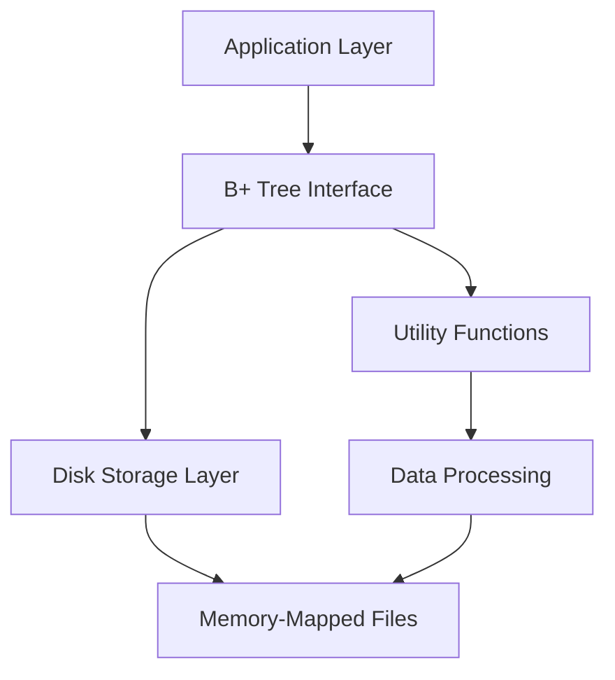

# `bplustree`

## Tree:
```
bplustree/
├── tree.py
└── utils.py
```

## Purpose:
This repository implements a high-performance, disk-backed B+ tree data structure that solves the problem of efficient key-value storage and retrieval for large datasets. It addresses scenarios where traditional in-memory data structures are insufficient due to memory constraints or when persistent storage with fast indexed access is required. The system is particularly valuable for database engines, indexing systems, and applications requiring efficient range queries and batch operations on large sorted datasets.

Target users include database developers, systems engineers, and application developers building storage-intensive applications that require persistent, sorted key-value data structures with optimal performance characteristics for disk-based storage.

The repository positions itself as a standalone storage engine or integration component within larger systems requiring robust, high-performance indexed data access.

## Architecture:


The system follows a layered architecture pattern with clear separation between:
- Application interface layer (BPlusTree class)
- Disk storage abstraction (memory-mapped files)
- Data processing utilities (iter_slice, pairwise)
- Core B+ tree algorithm implementation

Key architectural patterns include:
- Memory mapping for efficient disk I/O
- Separation of concerns between core data structure and utilities
- Persistent storage with automatic overflow handling
- Batch operation support for bulk data processing

## Entry Points:
- **API Import**: `from bplustree import BPlusTree` - Direct programmatic access for building applications
- **Module Usage**: `import bplustree` - Access to both BPlusTree class and utility functions
- **Command Line**: Not currently exposed via CLI (but could be added)

The primary entry point is the BPlusTree class which provides all core functionality for key-value storage operations.

## Core Features:
- **Persistent Key-Value Storage**: Efficient storage and retrieval of key-value pairs with disk persistence
- **Range Queries**: Fast range-based lookups and iterations over ordered keys
- **Batch Operations**: Support for efficient bulk insertions and operations
- **Automatic Overflow Handling**: Transparent management of large values that exceed node capacity
- **Memory-Efficient I/O**: Utilizes memory-mapped files for optimal disk access patterns
- **Sorted Data Structure**: Maintains keys in ascending order for efficient traversal

## Dependencies:
- **Standard Python Libraries**: typing, collections, itertools, os, pathlib
- **No External Dependencies**: Pure Python implementation with no third-party requirements

## Extension Points:
The system supports extension through:
- Custom key comparison functions for specialized ordering requirements
- Subclassing BPlusTree for domain-specific behavior modifications
- Adding new utility functions in utils.py for data processing extensions
- Implementing custom storage backends (though currently limited to memory-mapped files)

---

## Modules

- [`bplustree`](bplustree.md)

