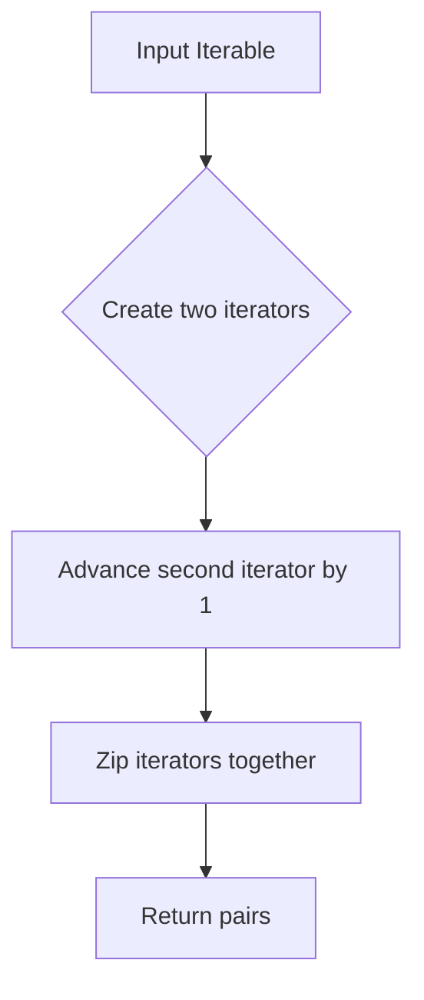

# `utils.py`

## `bplustree.utils.pairwise` · *function*

## Summary:
Creates consecutive pairs of elements from an iterable.

## Description:
Generates tuples containing pairs of consecutive elements from the input iterable. Each tuple consists of an element and its subsequent element in the sequence. This function is commonly used for comparing adjacent elements or creating sliding windows over data.

## Args:
    iterable (Iterable): An iterable object containing elements to be paired consecutively.

## Returns:
    zip: An iterator of tuples, where each tuple contains two consecutive elements from the input iterable. If the input has fewer than 2 elements, returns an empty iterator.

## Raises:
    None

## Constraints:
    Preconditions:
        - Input must be an iterable object
        - The iterable should support multiple iterations (since itertools.tee is used internally)
    
    Postconditions:
        - Output iterator yields tuples of length 2
        - Each tuple contains consecutive elements from the input
        - Empty input produces empty output

## Side Effects:
    None

## Control Flow:


## Examples:
```python
# Basic usage
list(pairwise([1, 2, 3, 4]))  # [(1, 2), (2, 3), (3, 4)]

# Empty iterable
list(pairwise([]))  # []

# Single element
list(pairwise([1]))  # []

# String input
list(pairwise("abc"))  # [('a', 'b'), ('b', 'c')]
```

## `bplustree.utils.iter_slice` · *function*

## Summary:
Chunks a bytes iterable into fixed-size segments and indicates whether each segment is the final one.

## Description:
This function divides a bytes object into contiguous slices of specified size, yielding each slice along with a boolean flag indicating if it's the last chunk. It's designed for efficient processing of large binary data streams where chunked processing is preferred over loading everything into memory at once.

## Args:
    iterable (bytes): The bytes object to be chunked into segments.
    n (int): The size of each chunk in bytes. Must be positive.

## Returns:
    Generator[tuple[bytes, bool]]: A generator yielding tuples of (chunk_bytes, is_last_chunk) where:
        - chunk_bytes: A slice of the original bytes object of length n (or less for the final chunk)
        - is_last_chunk: Boolean indicating if this is the final chunk (True when remaining bytes < n)

## Raises:
    TypeError: If iterable is not of type bytes or n is not an integer.

## Constraints:
    Preconditions:
        - iterable must be of type bytes
        - n must be a positive integer
    Postconditions:
        - All bytes from the original iterable are yielded exactly once
        - Each yielded chunk (except possibly the last) has exactly n bytes
        - The final chunk may have fewer than n bytes

## Side Effects:
    None

## Control Flow:
```mermaid
flowchart TD
    A[Start] --> B{start >= final_offset?}
    B -- Yes --> C[Break]
    B -- No --> D[Slice iterable[start:stop]]
    D --> E[Update start = stop]
    E --> F[Update stop = start + n]
    F --> G[Yield (rv, start >= final_offset)]
    G --> B
```

## Examples:
    >>> list(iter_slice(b'hello world', 3))
    [(b'hel', False), (b'lo ', False), (b'wor', False), (b'ld', True)]
    
    >>> list(iter_slice(b'abc', 5))
    [(b'abc', True)]
    
    >>> list(iter_slice(b'', 2))
    []

