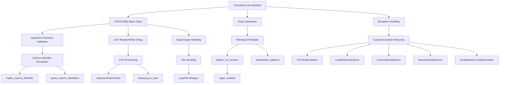

# `csvkit`

## Repository Overview

### Tree Structure
```
csvkit/
├── csvkit/              # Main package directory
│   ├── __init__.py      # Package initialization
│   ├── convert/         # Conversion utilities for fixed-width and GeoJSON formats
│   │   ├── __init__.py
│   │   ├── fixed.py
│   │   └── geojs.py
│   ├── utilities/       # Command-line utility implementations
│   │   ├── __init__.py
│   │   ├── csvclean.py   # Clean CSV files with error reporting
│   │   ├── csvcut.py     # Select columns from CSV files
│   │   ├── csvformat.py  # Convert CSV format to different delimiters
│   │   ├── csvgrep.py    # Filter CSV files by pattern matching
│   │   ├── csvjoin.py    # Join CSV files on common columns
│   │   ├── csvjson.py    # Convert CSV to JSON
│   │   ├── csvlook.py    # Pretty-print CSV files in a table format
│   │   ├── csvpy.py      # Execute Python expressions on CSV data
│   │   ├── csvsort.py    # Sort CSV files by specified columns
│   │   ├── csvsql.py     # Convert CSV to SQL statements
│   │   ├── csvstack.py   # Stack CSV files vertically
│   │   ├── csvstat.py    # Compute statistics for CSV files
│   │   ├── in2csv.py     # Convert other formats to CSV
│   │   └── sql2csv.py    # Convert SQL results to CSV
│   ├── cleanup.py        # CSV row validation and cleanup operations
│   ├── cli.py            # Core command-line interface and utility base classes
│   ├── exceptions.py     # Custom exception classes for CSV operations
│   └── grep.py           # Pattern matching and filtering for CSV data
```

### Purpose
csvkit is a comprehensive command-line toolkit for working with CSV (Comma-Separated Values) files. It provides a collection of utilities that enable users to manipulate, transform, filter, and analyze CSV data efficiently from the command line. The toolkit addresses the common need for quick data processing tasks without requiring complex programming or GUI applications.

The repository solves the problem of making CSV data processing accessible and efficient for analysts, developers, and data scientists who need to perform routine operations on tabular data. It offers both simple transformations (like selecting columns or sorting) and more complex operations (like joining datasets or converting formats).

### Target Users
- Data analysts and scientists who need to quickly process CSV data
- Developers who want to integrate CSV processing capabilities into command-line workflows
- System administrators performing batch CSV data transformations
- Anyone who needs to work with CSV files regularly and wants efficient command-line tools

### Position in Ecosystem
csvkit is a standalone command-line tool that operates independently but integrates well with Unix-style pipelines. It's designed to complement other command-line tools and shell scripting workflows. The library provides both executable command-line programs and a Python API that can be imported for programmatic use.

### Architecture


### Entry Points
1. **CLI Commands**: The primary entry point is the `csvkit` command-line interface, which provides access to all utilities through subcommands:
   - `csvclean` - Clean CSV files with error reporting
   - `csvcut` - Select columns from CSV files
   - `csvformat` - Convert CSV format to different delimiters
   - `csvgrep` - Filter CSV files by pattern matching
   - `csvjoin` - Join CSV files on common columns
   - `csvjson` - Convert CSV to JSON
   - `csvlook` - Pretty-print CSV files in a table format
   - `csvpy` - Execute Python expressions on CSV data
   - `csvsort` - Sort CSV files by specified columns
   - `csvsql` - Convert CSV to SQL statements
   - `csvstack` - Stack CSV files vertically
   - `csvstat` - Compute statistics for CSV files
   - `in2csv` - Convert other formats to CSV
   - `sql2csv` - Convert SQL results to CSV

2. **Importable API**: The library can be imported programmatically:
   ```python
   from csvkit import CSVKitUtility
   from csvkit.cli import match_column_identifier, parse_column_identifiers
   ```

### Core Features
1. **CSV Data Cleaning** - `csvclean` utility detects and reports formatting issues in CSV files
2. **Column Selection** - `csvcut` allows selecting specific columns by name or position
3. **Data Filtering** - `csvgrep` filters rows based on regular expression patterns
4. **Data Transformation** - `csvformat` converts between different CSV delimiters
5. **Data Joining** - `csvjoin` joins multiple CSV files on common columns
6. **Data Conversion** - `csvjson` and `csvsql` convert CSV to JSON and SQL respectively
7. **Data Analysis** - `csvstat` computes statistical summaries of CSV data
8. **Data Visualization** - `csvlook` displays CSV data in a formatted table view
9. **Format Conversion** - `in2csv` converts various file formats to CSV
10. **SQL Integration** - `sql2csv` converts SQL query results back to CSV

### Dependencies
- **Internal Dependencies**:
  - `csvkit.convert` - Provides conversion utilities for fixed-width and GeoJSON formats
  - `csvkit.utilities` - Contains command-line utility implementations
  - `csvkit.exceptions` - Provides custom exception classes
- **External Dependencies**:
  - `argparse` - Command-line argument parsing
  - `csv` - Standard library CSV reader/writer
  - `json` - Standard library JSON processing
  - `re` - Regular expression support
  - `sys` - System-specific parameters
  - `io` - File handling utilities
  - `codecs` - Encoding handling
  - `warnings` - Warning handling
  - `signal` - Signal handling for SIGPIPE
  - `gzip, bz2, lzma` - Compressed file support
  - `agate` - Data processing and type inference

### Extension Points
1. **Adding New Utilities**: Create new modules in `utilities/` that inherit from `CSVKitUtility` and register them appropriately
2. **Custom Filters**: Extend `grep.py` with new pattern matching capabilities by implementing new filtering functions
3. **New Converters**: Add new modules to `convert/` for different input/output formats by following existing patterns
4. **Custom Exceptions**: Extend `exceptions.py` for domain-specific error handling by inheriting from existing exception classes
5. **CLI Arguments**: Override `add_arguments()` in `CSVKitUtility` subclasses to add custom options and parameters
6. **Custom CSV Processing**: Implement custom CSV readers/writers by extending the base CSV processing classes in `cli.py`

---

## Modules

- [`csvkit`](csvkit.md)
- [`csvkit/convert`](csvkit/convert.md)
- [`csvkit/utilities`](csvkit/utilities.md)

