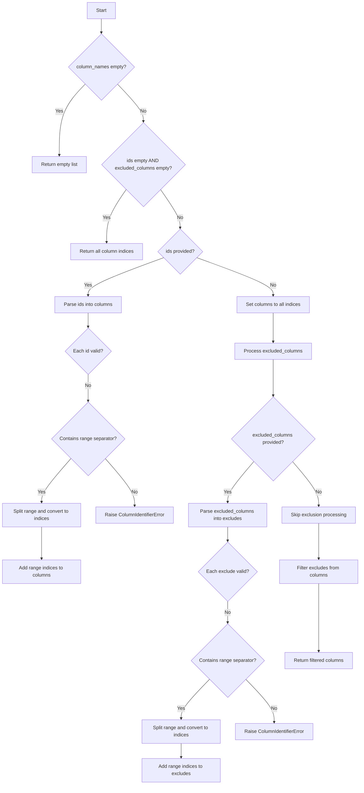

# `cli.py`

## `csvkit.cli.LazyFile` · *class*

## Summary:
A lazy file wrapper that delays file opening until the first access to the file object.

## Description:
The LazyFile class serves as a proxy that defers the actual opening of a file until it's first accessed. This is useful for avoiding unnecessary file operations when a file handle might not be needed, or when dealing with potentially large files. It implements Python's descriptor protocol through `__getattr__` to delegate all attribute access to the underlying file object once opened.

## State:
- init: callable that creates the file object when opened
- f: file object reference, initially None
- _is_lazy_opened: boolean flag indicating whether the file has been opened yet
- _lazy_args: tuple of positional arguments to pass to init when opening
- _lazy_kwargs: dict of keyword arguments to pass to init when opening

## Lifecycle:
- Creation: Instantiate with a callable `init` and any arguments needed to create the file object
- Usage: Access attributes or iterate over the object - this triggers lazy opening
- Destruction: Call `close()` method to explicitly close the underlying file and reset state

## Method Map:
```mermaid
graph TD
    A[LazyFile.__init__] --> B{__getattr__ or __next__}
    B --> C[_open]
    C --> D[init(*_lazy_args, *_lazy_kwargs)]
    D --> E[f = result]
    E --> F[Return delegated attribute]
    A --> G[__iter__]
    G --> H[Return self]
    A --> I[__next__]
    I --> J[_open]
    J --> K[Next item from f]
    K --> L[Replace null bytes]
```

## Raises:
- None explicitly raised by __init__
- Any exceptions raised by the underlying `init` function when called during `_open()`

## Example:
```python
# Create a lazy file that opens a gzipped CSV file
import gzip
lazy_file = LazyFile(gzip.open, 'data.csv.gz', 'rt')

# File is not opened yet
# Accessing attributes triggers opening
first_line = next(lazy_file)  # Triggers _open() internally

# Close when done
lazy_file.close()
```

### `csvkit.cli.LazyFile.__init__` · *method*

## Summary:
Initializes a LazyFile instance that defers actual file opening until first access.

## Description:
Configures a LazyFile object to store initialization parameters for deferred file opening. This lazy initialization pattern prevents premature file access, which is particularly useful when handling multiple files or when file access might be conditional.

## Args:
    init (callable): A callable (typically a file opening function) that will be invoked with the provided args and kwargs when the file is first accessed.
    *args: Positional arguments to pass to the init callable when opening the file.
    **kwargs: Keyword arguments to pass to the init callable when opening the file.

## Returns:
    None: This method initializes instance attributes but does not return a value.

## Raises:
    None explicitly raised by this method.

## State Changes:
    Attributes READ: None
    Attributes WRITTEN: 
    - self.init: Stores the initialization callable
    - self.f: Initialized to None
    - self._is_lazy_opened: Initialized to False
    - self._lazy_args: Stores positional arguments for later use
    - self._lazy_kwargs: Stores keyword arguments for later use

## Constraints:
    Preconditions:
    - The init parameter must be a callable that can accept the provided *args and **kwargs
    - The init callable should return a file-like object when invoked
    
    Postconditions:
    - self.f is initialized to None
    - self._is_lazy_opened is initialized to False
    - All initialization parameters are stored for later use

## Side Effects:
    None: This method performs no I/O or external operations. File opening occurs later in the _open() method.

### `csvkit.cli.LazyFile.__getattr__` · *method*

## Summary:
Delegates attribute access to the underlying file object after lazily opening it if not already opened.

## Description:
This method implements Python's attribute access protocol (__getattr__) to enable lazy loading of file resources. When an attribute is accessed on a LazyFile instance that isn't directly defined on the LazyFile itself, this method is invoked. It ensures the underlying file object is opened (if not already done) and then delegates the attribute access to that file object.

## Args:
    name (str): The name of the attribute being accessed.

## Returns:
    Any: The value of the requested attribute from the underlying file object.

## Raises:
    AttributeError: If the requested attribute doesn't exist on the underlying file object.

## State Changes:
    Attributes READ: self._is_lazy_opened, self.f
    Attributes WRITTEN: self.f (when first opened), self._is_lazy_opened (when first opened)

## Constraints:
    Preconditions: The LazyFile instance must have been properly initialized with valid initialization parameters.
    Postconditions: If the file hasn't been opened yet, it will be opened before attribute access, and the attribute will be retrieved from the underlying file object.

## Side Effects:
    I/O operations: Opens the underlying file resource if not already opened.
    Mutates object state: Sets self.f and self._is_lazy_opened when first opening the file.

### `csvkit.cli.LazyFile.__iter__` · *method*

*No documentation generated.*

### `csvkit.cli.LazyFile.close` · *method*

## Summary:
Closes a lazily opened file handle and resets the internal state.

## Description:
Closes the underlying file handle associated with this LazyFile instance if it was previously opened lazily. This method ensures proper resource cleanup by closing the file and resetting internal state flags. It is typically called during the cleanup phase of file processing or when explicitly managing file resources.

## Args:
    None

## Returns:
    None

## Raises:
    AttributeError: If the file handle is not properly initialized and attempts to call close() on a None object (though this is prevented by the conditional check).

## State Changes:
    Attributes READ: self._is_lazy_opened, self.f
    Attributes WRITTEN: self.f, self._is_lazy_opened

## Constraints:
    Preconditions: The LazyFile instance must have been previously opened lazily (i.e., _is_lazy_opened must be True)
    Postconditions: The file handle is closed, self.f is set to None, and _is_lazy_opened is set to False

## Side Effects:
    I/O operation: Closes the underlying file handle, releasing system resources

### `csvkit.cli.LazyFile.__next__` · *method*

## Summary:
Returns the next line from the lazily opened file, with null characters removed.

## Description:
Implements the iterator protocol's `__next__` method for the LazyFile class. This method ensures the underlying file is opened (if not already opened) and retrieves the next line from the file, removing any null characters ('\0') before returning it. This method is automatically called when iterating over a LazyFile instance.

## Args:
    None

## Returns:
    str: The next line from the file with null characters removed. Raises StopIteration when the end of file is reached.

## Raises:
    StopIteration: When the end of file is reached.
    Exception: Any exceptions that may occur during file reading or when the underlying file object raises them.

## State Changes:
    Attributes READ: self._is_lazy_opened, self.f
    Attributes WRITTEN: None

## Constraints:
    Preconditions: The LazyFile instance must have been properly initialized with valid initialization parameters.
    Postconditions: The underlying file is opened if not already opened, and the next line is returned with null characters stripped.

## Side Effects:
    I/O operations: Reads from the underlying file resource.
    Mutates object state: Calls self._open() which may modify self.f and self._is_lazy_opened if the file wasn't previously opened.

### `csvkit.cli.LazyFile._open` · *method*

## Summary:
Initializes and opens a lazy file resource when first accessed.

## Description:
This method implements lazy initialization for file resources. It is automatically called when accessing attributes or methods of the wrapped file object, ensuring the underlying file is only opened when actually needed. The method uses the stored initialization parameters to create the file object and tracks its opened state.

## Args:
    None

## Returns:
    None

## Raises:
    Exception: Any exceptions raised by the underlying file initialization function (`self.init`) when creating the file object.

## State Changes:
    Attributes READ: self._is_lazy_opened, self.init, self._lazy_args, self._lazy_kwargs
    Attributes WRITTEN: self.f, self._is_lazy_opened

## Constraints:
    Preconditions: The LazyFile instance must have been properly initialized with an `init` callable and appropriate arguments.
    Postconditions: After execution, `self._is_lazy_opened` will be True and `self.f` will reference the opened file object.

## Side Effects:
    I/O operations: Opens a file or resource using the stored initialization parameters.
    Mutates object state: Sets `self.f` to the opened file handle and updates `self._is_lazy_opened` flag.

## `csvkit.cli.CSVKitUtility` · *class*

## Summary:
Base class for CSVKit command-line utilities that provides common argument parsing, file handling, and CSV processing capabilities.

## Description:
CSVKitUtility serves as the foundation for all command-line tools in the csvkit suite. It standardizes argument parsing, file I/O operations, and CSV processing behaviors across different utilities. Subclasses must implement the `add_arguments()` and `main()` methods to define their specific functionality.

This class handles common CSV processing concerns such as:
- Command-line argument parsing with argparse
- Input file handling (including compressed files like .gz, .bz2, .xz)
- CSV reader and writer configuration
- Exception handling and user-friendly error messages
- Column identifier parsing
- Data type inference for CSV columns
- Line number handling
- Zero-based vs 1-based column numbering
- Skip line functionality for comments or headers

## State:
- `argparser`: argparse.ArgumentParser instance configured with common CSV arguments
- `args`: Parsed command-line arguments from argparse
- `output_file`: File-like object for writing output (defaults to sys.stdout)
- `input_file`: File-like object for reading input (set during run() when 'f' not in override_flags)
- `reader_kwargs`: Dictionary of keyword arguments for CSV reader construction
- `writer_kwargs`: Dictionary of keyword arguments for CSV writer construction
- `description`: Class variable for describing the utility (default empty string)
- `epilog`: Class variable for additional help text (default empty string)
- `override_flags`: Class variable to control which arguments are excluded (default empty string)

## Lifecycle:
Creation: Instantiate with optional args list and output_file parameter. The constructor:
1. Initializes the common argument parser (_init_common_parser)
2. Calls add_arguments() to allow subclasses to add custom arguments
3. Parses arguments using argparse
4. Sets up output file handle
5. Extracts CSV reader and writer kwargs
6. Installs exception handler
7. Sets up SIGPIPE signal handling

Usage: Call `run()` method which orchestrates the execution flow:
1. Opens input file if 'f' not in override_flags
2. Executes main() method (implemented by subclasses)
3. Closes input file if 'f' not in override_flags

Destruction: Automatic cleanup occurs through context managers and file closing in the run() method.

## Method Map:
```mermaid
graph TD
    A[run()] --> B[_open_input_file()]
    A --> C[main()]
    A --> D[with warnings.catch_warnings()]
    C --> E[get_rows_and_column_names_and_column_ids()]
    C --> F[print_column_names()]
    C --> G[get_column_types()]
    C --> H[skip_lines()]
    E --> I[agate.csv.reader()]
    E --> J[parse_column_identifiers()]
    F --> K[agate.csv.reader()]
    F --> L[make_default_headers()]
    G --> M[agate.TypeTester()]
    H --> N[input_file.readline()]
    C --> O[additional_input_expected()]
```

## Raises:
- NotImplementedError: Raised by add_arguments() and main() if not overridden by subclasses
- RequiredHeaderError: Raised by print_column_names() when --no-header-row is used with -n/--names
- ValueError: Raised by skip_lines() when skip_lines argument is not an integer
- UnicodeDecodeError: Handled by custom exception handler for encoding issues

## Example:
```python
# Basic usage pattern for a subclass
class MyCSVTool(CSVKitUtility):
    def add_arguments(self):
        self.argparser.add_argument('--custom-flag', action='store_true', help='Custom option')
    
    def main(self):
        # Process CSV data here
        rows, column_names, column_ids = self.get_rows_and_column_names_and_column_ids(**self.reader_kwargs)
        # ... process rows ...

# Usage:
tool = MyCSVTool(['--custom-flag', 'input.csv'])
tool.run()
```

### `csvkit.cli.CSVKitUtility.__init__` · *method*

## Summary:
Initializes a CSVKit utility instance by setting up argument parsing, configuring output handling, and preparing CSV processing parameters.

## Description:
This method serves as the constructor for CSVKit utility classes, initializing the command-line interface and configuration settings. It builds upon the common argument parser setup, adds utility-specific arguments, processes command-line options, configures output streams, and prepares CSV reader/writer parameters for subsequent operations.

## Args:
    args (list[str], optional): Command-line arguments to parse. If None, uses sys.argv. Defaults to None.
    output_file (file-like object, optional): Output file handle. If None, defaults to sys.stdout. Defaults to None.

## Returns:
    None: This method initializes the instance and does not return a value.

## Raises:
    None explicitly raised, though argument parsing may raise SystemExit for invalid arguments.

## State Changes:
    Attributes READ: 
        - self.override_flags (used in _init_common_parser)
        - self.description (used in _init_common_parser)
        - self.epilog (used in _init_common_parser)
    Attributes WRITTEN:
        - self.argparser (initialized by _init_common_parser)
        - self.args (set by parsing arguments)
        - self.output_file (set based on input parameter or defaults to sys.stdout)
        - self.reader_kwargs (extracted from parsed arguments)
        - self.writer_kwargs (extracted from parsed arguments)

## Constraints:
    Preconditions:
        - The class must have defined self.override_flags, self.description, and self.epilog attributes
        - The class must implement add_arguments() method
        - The class must implement _extract_csv_reader_kwargs() and _extract_csv_writer_kwargs() methods
        - The class must implement _install_exception_handler() method
    Postconditions:
        - self.argparser is initialized with common and utility-specific arguments
        - self.args contains parsed command-line arguments
        - self.output_file is set to a valid file handle
        - self.reader_kwargs and self.writer_kwargs are populated with appropriate CSV parameters

## Side Effects:
    - Initializes sys.excepthook with custom exception handler
    - Sets up signal handling for SIGPIPE
    - May modify global signal handlers
    - Reads command-line arguments via argparse
    - May write to stderr in exception handler

### `csvkit.cli.CSVKitUtility.add_arguments` · *method*

## Summary:
Adds custom command-line arguments specific to a subclass of CSVKitUtility to the argument parser.

## Description:
This is an abstract method that must be implemented by all subclasses of CSVKitUtility. It allows each utility to define its own set of command-line arguments beyond the common ones provided by the base class. The method is called during the initialization phase of CSVKitUtility, after the common argument parser has been established but before arguments are parsed.

## Args:
    self: The instance of the CSVKitUtility subclass implementing this method.

## Returns:
    None: This method does not return any value.

## Raises:
    NotImplementedError: Always raised by the base class implementation, requiring subclasses to override this method.

## State Changes:
    Attributes READ: None
    Attributes WRITTEN: Modifies self.argparser by adding additional arguments to it.

## Constraints:
    Preconditions: This method must be implemented by all subclasses of CSVKitUtility.
    Postconditions: The argument parser contains all arguments needed for the specific utility's functionality.

## Side Effects:
    None: This method doesn't perform I/O operations or mutate external state, but it does modify the internal argument parser object.

### `csvkit.cli.CSVKitUtility.run` · *method*

## Summary:
Executes the CSVKit utility by managing input file handling, running the main processing logic with warning suppression, and ensuring proper resource cleanup.

## Description:
This method serves as the primary entry point for executing CSVKit utilities. It orchestrates the complete lifecycle of a CSV processing operation, including input file management, main logic execution with appropriate warning handling, and resource cleanup. The method respects the utility's configuration through override_flags to conditionally enable/disable file operations.

## Args:
    None explicitly taken as parameters (uses self)

## Returns:
    None

## Raises:
    Any exceptions raised by self.main() or underlying file operations

## State Changes:
    Attributes READ: self.override_flags, self.args.input_path, self.args.no_header_row, self.args.verbose
    Attributes WRITTEN: self.input_file (when 'f' is not in override_flags)

## Constraints:
    Preconditions:
    - self.override_flags must be initialized as a string containing disabled flag characters
    - self.args must be properly parsed with argparse
    - If 'f' is not in override_flags, self._open_input_file() must be callable and functional
    - self.main() must be implemented by subclasses
    
    Postconditions:
    - If 'f' is not in override_flags, self.input_file is properly closed after execution
    - Warning filters are appropriately applied during main execution
    - Execution proceeds regardless of exceptions in main() or cleanup

## Side Effects:
    - Opens and closes input file resources when 'f' is not in override_flags
    - Suppresses specific agate warnings during main execution
    - May modify sys.stdin encoding when reading from stdin
    - Calls self.main() which may perform additional I/O operations

### `csvkit.cli.CSVKitUtility.main` · *method*

## Summary:
Abstract method that must be implemented by subclasses to provide the core processing logic for CSV utilities.

## Description:
This method serves as the primary entry point for the core functionality of each CSV utility subclass. It is called by the parent class's `run()` method during execution and contains the specific business logic unique to each utility. The method is intentionally left unimplemented in the base class to enforce proper inheritance and implementation by concrete subclasses.

## Args:
    self: The instance of the CSVKitUtility subclass that implements this method.

## Returns:
    This method does not return a value directly. Its behavior depends entirely on the implementation in each subclass.

## Raises:
    NotImplementedError: Always raised by the base class implementation, requiring subclasses to override this method with their specific logic.

## State Changes:
    Attributes READ: Reads from self.args, self.input_file, and other instance attributes configured during initialization.
    Attributes WRITTEN: May modify various instance attributes depending on the specific implementation in subclasses.

## Constraints:
    Preconditions: This method must be implemented by all subclasses of CSVKitUtility.
    Postconditions: The specific implementation in each subclass determines the resulting behavior and output.

## Side Effects:
    I/O operations: May read from self.input_file and write to self.output_file.
    External service calls: May interact with external libraries like agate for CSV processing.
    Mutations to objects outside self: May modify the output file stream or other external resources.

### `csvkit.cli.CSVKitUtility._init_common_parser` · *method*

## Summary:
Initializes a common argument parser with standard CSV processing options for CSVKit utilities.

## Description:
Configures an `argparse.ArgumentParser` instance with commonly used command-line arguments for CSV file processing. This method sets up parsing options for file input, delimiter specification, quoting styles, encoding, and other CSV-specific settings. The parser is stored in `self.argparser` and is used by subclasses to handle command-line arguments consistently.

This method is designed to be called during the initialization of CSVKit utility classes, providing a standardized set of command-line options that can be overridden by specific implementations through the `override_flags` mechanism.

## Args:
    None (method takes only self)

## Returns:
    None (modifies self.argparser in place)

## Raises:
    None explicitly raised

## State Changes:
    Attributes READ: 
        - self.description
        - self.epilog  
        - self.override_flags
    Attributes WRITTEN:
        - self.argparser

## Constraints:
    Preconditions:
        - `self.description` must be a string describing the utility
        - `self.epilog` must be a string providing additional help text
        - `self.override_flags` must be an iterable of flag names to exclude from argument addition
    Postconditions:
        - `self.argparser` is initialized as an `argparse.ArgumentParser` instance
        - The parser contains all applicable command-line arguments based on override flags

## Side Effects:
    None (does not perform I/O or external service calls)

### `csvkit.cli.CSVKitUtility._open_input_file` · *method*

## Summary:
Opens and returns a file handle for CSV input, supporting stdin, compressed files, and regular files with proper encoding handling.

## Description:
This method provides a unified interface for opening CSV input files, handling various file types including standard input, gzipped files (.gz), bzip2-compressed files (.bz2), xz-compressed files (.xz), and regular text files. It ensures proper encoding configuration for stdin and uses LazyFile wrappers for efficient file handling.

## Args:
    path (str): Path to the input file, or '-' to indicate stdin
    opened (bool): Flag indicating if the file is already opened (default: False)

## Returns:
    file-like object: A file handle that can be used for reading CSV data, wrapped in LazyFile for deferred opening

## Raises:
    None explicitly raised by this method

## State Changes:
    Attributes READ: self.args.encoding
    Attributes WRITTEN: None

## Constraints:
    Preconditions: 
    - self.args.encoding must be set to a valid encoding string
    - path parameter should be a valid file path or '-' for stdin
    - The method assumes the caller will manage closing the returned file handle
    
    Postconditions:
    - Returns a file-like object suitable for CSV reading operations
    - For stdin, the encoding is properly configured
    - For compressed files, appropriate decompression is handled

## Side Effects:
    - Configures sys.stdin encoding when path is '-' and opened is False
    - Creates LazyFile wrapper objects for deferred file opening
    - May perform file I/O operations when the returned LazyFile is first accessed

### `csvkit.cli.CSVKitUtility._extract_csv_reader_kwargs` · *method*

## Summary:
Extracts CSV reader configuration keyword arguments from command-line arguments for use in CSV processing operations.

## Description:
This method processes command-line arguments to construct a dictionary of keyword arguments suitable for configuring CSV readers. It handles delimiter specification, quoting options, and header row settings based on user-provided command-line options.

## Args:
    None (uses self.args internally)

## Returns:
    dict: A dictionary containing CSV reader configuration parameters including:
        - delimiter: Tab character ('\t') or custom delimiter string
        - quotechar: Quote character specification
        - quoting: Quoting style specification
        - doublequote: Double quote handling specification
        - escapechar: Escape character specification
        - field_size_limit: Maximum field size limit
        - skipinitialspace: Whether to skip initial whitespace
        - header: Boolean indicating whether to treat first row as header

## Raises:
    None explicitly raised

## State Changes:
    Attributes READ: self.args.tabs, self.args.delimiter, self.args.quotechar, self.args.quoting, self.args.doublequote, self.args.escapechar, self.args.field_size_limit, self.args.skipinitialspace, self.args.no_header_row
    Attributes WRITTEN: None

## Constraints:
    Preconditions: 
    - self.args must be initialized with command-line argument parsing results
    - All referenced arguments in self.args must be defined
    
    Postconditions:
    - Returns a dictionary with appropriate CSV reader configuration parameters
    - Delimiter is set to tab or custom delimiter based on command-line flags
    - Header parameter is properly inverted from no_header_row flag

## Side Effects:
    None

### `csvkit.cli.CSVKitUtility._extract_csv_writer_kwargs` · *method*

*No documentation generated.*

### `csvkit.cli.CSVKitUtility._install_exception_handler` · *method*

## Summary:
Installs a custom exception handler that provides user-friendly error messages while preserving verbose debugging output.

## Description:
Configures the global exception hook to display customized error messages to stderr. When verbose mode is disabled, it provides helpful guidance for common encoding issues like UnicodeDecodeError, while showing full tracebacks in verbose mode. This method centralizes error presentation logic for CSVKit utilities.

## Args:
    None

## Returns:
    None

## Raises:
    None explicitly raised

## State Changes:
    Attributes READ: self.args.verbose, self.args.encoding
    Attributes WRITTEN: sys.excepthook

## Constraints:
    Preconditions: 
    - self.args must be initialized with verbose and encoding attributes
    - sys module must be importable
    
    Postconditions:
    - sys.excepthook is replaced with a custom handler function
    - Error messages are written to stderr

## Side Effects:
    - Modifies global sys.excepthook behavior
    - Writes formatted error messages to stderr

### `csvkit.cli.CSVKitUtility.get_column_types` · *method*

## Summary:
Constructs and returns an agate.TypeTester instance configured with appropriate data type inference rules based on command-line arguments.

## Description:
This method builds a type inference configuration for CSV column processing by creating various agate data type objects with appropriate null value handling. It's designed to be called during CSV processing operations to determine how to interpret column data types. The method is typically invoked when preparing to read CSV data with automatic type inference enabled.

## Args:
    None - This is a method that operates on self and uses self.args

## Returns:
    agate.TypeTester: An agate TypeTester instance configured with a list of data type candidates in priority order for column type inference

## Raises:
    None explicitly raised - The method itself doesn't raise exceptions, though underlying agate operations may raise exceptions

## State Changes:
    Attributes READ: 
    - self.args.blanks
    - self.args.null_values  
    - self.args.no_inference
    - self.args.locale
    - self.args.date_format
    - self.args.datetime_format

## Constraints:
    Preconditions:
    - self.args must be properly initialized through argparse parsing
    - The CSVKitUtility instance must have been properly constructed with argument parsing completed
    
    Postconditions:
    - Returns a valid agate.TypeTester object ready for use in column type inference operations

## Side Effects:
    None - This method performs no I/O operations or external service calls. It only constructs objects and returns them.

### `csvkit.cli.CSVKitUtility.get_column_offset` · *method*

## Summary:
Returns the column offset (0 or 1) based on the zero-based command-line flag setting.

## Description:
Determines whether column indexing should be zero-based or one-based. This offset is used consistently throughout the CSVKitUtility class when processing column identifiers and performing column-related operations. When the --zero command-line argument is specified, column indices are treated as zero-based (starting from 0), otherwise they are treated as one-based (starting from 1).

This method is called by several other methods in the CSVKitUtility class including `get_rows_and_column_names_and_column_ids` and `print_column_names` to ensure consistent column indexing behavior across all operations.

## Args:
    None

## Returns:
    int: 0 if zero-based indexing is enabled via the --zero flag, 1 otherwise (one-based indexing)

## Raises:
    None

## State Changes:
    Attributes READ: self.args.zero_based
    Attributes WRITTEN: None

## Constraints:
    Preconditions: The CSVKitUtility instance must have been initialized with arguments that include the 'zero' flag
    Postconditions: Always returns either 0 or 1

## Side Effects:
    None

### `csvkit.cli.CSVKitUtility.skip_lines` · *method*

*No documentation generated.*

### `csvkit.cli.CSVKitUtility.get_rows_and_column_names_and_column_ids` · *method*

## Summary:
Processes CSV input to extract rows iterator, column names, and column ID mappings for further data manipulation.

## Description:
This method prepares CSV data for downstream processing by creating a CSV reader, handling header rows appropriately, determining column indexing conventions, and parsing column identifier specifications. It serves as a central data preparation utility that standardizes how CSV data is accessed across different CSVKit utilities.

The method handles two modes of operation: when CSV files have header rows (default) and when they don't (when --no-header-row flag is set). In the latter case, it generates default alphabetical headers (A, B, C, ...). It also accounts for command-line flags such as --skip-lines and --zero to adjust data processing behavior accordingly.

## Args:
    **kwargs: Additional keyword arguments passed directly to agate.csv.reader for CSV parsing configuration

## Returns:
    tuple: A 3-tuple containing:
        - rows (iterator): An iterator over CSV rows, with proper header handling
        - column_names (list[str]): List of column names from the header row or generated default headers
        - column_ids (list[int]): List of zero-based column indices matching the requested column identifiers

## Raises:
    None explicitly raised by this method, though underlying operations may raise exceptions from:
        - agate.csv.reader
        - parse_column_identifiers
        - file I/O operations

## State Changes:
    Attributes READ: 
        - self.args.no_header_row
        - self.args.columns
        - self.args.zero_based
        - self.args.skip_lines
        - self.args.not_columns (via getattr)
    Attributes WRITTEN: None

## Constraints:
    Preconditions:
        - self.args must be properly initialized with CSV processing arguments
        - self.input_file must be opened and accessible
        - self.skip_lines() must work correctly with the current input_file state
        - parse_column_identifiers must be able to process the column names and identifiers
        
    Postconditions:
        - Returns a valid 3-tuple with properly initialized elements
        - If input is empty, returns empty iterators/lists as appropriate
        - column_ids are always valid indices within the range of column_names

## Side Effects:
    - Reads from self.input_file (file I/O)
    - May modify self.args.skip_lines during skip_lines() execution
    - Calls external functions: agate.csv.reader, make_default_headers, parse_column_identifiers

### `csvkit.cli.CSVKitUtility.print_column_names` · *method*

## Summary:
Prints column names from a CSV file with numbered indices to the output stream.

## Description:
Displays the column names of a CSV file with sequential numbering, either starting from 1 (default) or 0 (when --zero flag is used). This method is typically invoked when the -n or --names command-line option is specified to show column metadata without processing the full dataset.

## Args:
    None explicitly taken as parameters (uses self.args internally)

## Returns:
    None

## Raises:
    RequiredHeaderError: When the --no-header-row option is used in combination with the -n or --names options.

## State Changes:
    Attributes READ: 
        - self.args.no_header_row
        - self.args.zero_based
        - self.reader_kwargs
    Attributes WRITTEN: 
        - self.output_file (via write operation)

## Constraints:
    Preconditions:
        - The CSV file must be readable through self.input_file
        - The CSV file must have at least one row (header row)
    Postconditions:
        - Column names are written to self.output_file in formatted manner
        - Method does not modify any internal state beyond writing to output

## Side Effects:
    - Writes formatted text to self.output_file (stdout by default)
    - Calls self.skip_lines() to advance past initial lines
    - Uses agate.csv.reader to parse CSV data

### `csvkit.cli.CSVKitUtility.additional_input_expected` · *method*

## Summary:
Determines whether additional input is expected from standard input based on terminal connection and input path configuration.

## Description:
This method evaluates whether the application should expect additional input from stdin by checking two conditions: 1) whether stdin is connected to a terminal (TTY) and 2) whether no input file path was specified. This is used primarily in command-line tools to determine when to prompt for interactive input or when to process piped data.

## Args:
    None: This method takes no arguments beyond the implicit self reference.

## Returns:
    bool: True if stdin is connected to a terminal AND no input path was provided, indicating that additional input is expected. False otherwise.

## Raises:
    None: This method does not raise any exceptions.

## State Changes:
    Attributes READ: 
    - self.args.input_path: The path to the input file specified by the user
    - sys.stdin: Standard input stream
    
    Attributes WRITTEN: None

## Constraints:
    Preconditions: 
    - self.args must be initialized (typically during object construction)
    - sys.stdin must be available and accessible
    - isatty function must be available in the scope
    
    Postconditions: 
    - Returns a boolean value indicating whether additional input is expected
    - Does not modify any object state

## Side Effects:
    None: This method performs no I/O operations or state mutations beyond reading from sys.stdin and accessing self.args.

## Usage Context:
This method is typically called during the initialization or setup phase of a CSVKit utility to determine appropriate input handling behavior. When True, it indicates that the program should either prompt the user for input or expect piped data, rather than processing a file from disk.

## Control Flow:
```mermaid
flowchart TD
    A[additional_input_expected()] --> B{isatty(sys.stdin)?}
    B -- Yes --> C{not self.args.input_path?}
    C -- Yes --> D[Return True]
    C -- No --> E[Return False]
    B -- No --> F[Return False]
```

## `csvkit.cli.isatty` · *function*

block.
ACTION: WRITE
<DOCUMENTATION>
## Summary:
Determines whether a file-like object is connected to a terminal device.

## Description:
Safely checks if a file-like object is connected to a terminal (TTY) by calling its isatty() method. This function gracefully handles closed files by catching ValueError exceptions and returning False.

## Args:
    f: A file-like object that supports the isatty() method

## Returns:
    bool: True if the file is connected to a terminal, False otherwise. Returns False when the file is closed or when an I/O error occurs.

## Raises:
    None: This function catches and handles ValueError internally

## Constraints:
    Preconditions: The argument must be a file-like object that implements the isatty() method
    Postconditions: Always returns a boolean value

## Side Effects:
    None: This function performs no I/O operations or state mutations beyond calling the isatty() method on the input file object

## Control Flow:
```mermaid
flowchart TD
    A[Call isatty(f)] --> B{f.isatty() succeeds?}
    B -- Yes --> C[Return f.isatty()]
    B -- No --> D{Exception is ValueError?}
    D -- Yes --> E[Return False]
    D -- No --> F[Raise exception]
```

## Examples:
    # Check if stdout is connected to a terminal
    if isatty(sys.stdout):
        print("Outputting to terminal")
    else:
        print("Outputting to file or pipe")
        
    # Check a file handle
    with open('data.csv', 'r') as f:
        if isatty(f):
            print("File is a TTY")
        else:
            print("File is not a TTY")

## `csvkit.cli.default_str_decimal` · *function*

## Summary:
Converts datetime and decimal objects to JSON-serializable string representations.

## Description:
A custom JSON serializer function that handles conversion of datetime and decimal objects to string formats suitable for JSON serialization. This function is intended to be used as the `default` parameter in JSON serialization functions like `json.dumps()`.

## Args:
    obj (Any): The object to serialize. Must be either a datetime.date, datetime.datetime, or decimal.Decimal instance.

## Returns:
    str: The string representation of the object in a JSON-compatible format:
         - For datetime.date/datetime.datetime: ISO format string (e.g., "2023-12-25" or "2023-12-25T14:30:00")
         - For decimal.Decimal: String representation of the decimal value

## Raises:
    TypeError: When the object is not a datetime.date, datetime.datetime, or decimal.Decimal instance.

## Constraints:
    Precondition: The input object must be one of the supported types (datetime.date, datetime.datetime, or decimal.Decimal)
    Postcondition: If successful, returns a string representation that can be serialized to JSON

## Side Effects:
    None

## Control Flow:
```mermaid
flowchart TD
    A[default_str_decimal called] --> B{Is datetime.date or datetime.datetime?}
    B -- Yes --> C[Return obj.isoformat()]
    B -- No --> D{Is decimal.Decimal?}
    D -- Yes --> E[Return str(obj)]
    D -- No --> F[Raise TypeError]
```

## Examples:
```python
import json
import datetime
import decimal

# Valid usage
dt = datetime.datetime(2023, 12, 25, 14, 30, 0)
result = default_str_decimal(dt)
# Returns: "2023-12-25T14:30:00"

dec = decimal.Decimal('123.45')
result = default_str_decimal(dec)
# Returns: "123.45"

# Error case
try:
    default_str_decimal([1, 2, 3])
except TypeError as e:
    print(e)
    # Prints: '[1, 2, 3] is not JSON serializable'
```

## `csvkit.cli.default_float_decimal` · *function*

## Summary:
Converts decimal objects to float values while delegating other types to a string conversion handler.

## Description:
A utility function that serves as a bridge between decimal.Decimal objects and float representations, primarily used for JSON serialization compatibility in command-line interface operations. This function specifically handles decimal.Decimal instances by converting them to floats, while all other object types are passed to the default_str_decimal function for further processing.

## Args:
    obj (Any): The object to convert. Can be any type, but specifically designed to handle decimal.Decimal instances.

## Returns:
    float or str: Returns a float if the input is a decimal.Decimal instance; otherwise returns the result of default_str_decimal(obj) which typically returns a string representation.

## Raises:
    TypeError: When the object is not a datetime.date, datetime.datetime, or decimal.Decimal instance (raised by default_str_decimal when it encounters unsupported types).

## Constraints:
    Precondition: The input object can be any type, but the function expects default_str_decimal to handle non-decimal types appropriately.
    Postcondition: If input is a decimal.Decimal, output is guaranteed to be a float; otherwise output depends on default_str_decimal behavior.

## Side Effects:
    None

## Control Flow:
```mermaid
flowchart TD
    A[default_float_decimal called] --> B{Is obj decimal.Decimal?}
    B -- Yes --> C[Return float(obj)]
    B -- No --> D[Return default_str_decimal(obj)]
```

## Examples:
```python
import decimal

# Convert decimal to float
dec = decimal.Decimal('123.45')
result = default_float_decimal(dec)
# Returns: 123.45 (as float)

# Delegate to default_str_decimal for other types
import datetime
dt = datetime.datetime(2023, 12, 25)
result = default_float_decimal(dt)
# Returns: "2023-12-25T00:00:00" (string from default_str_decimal)
```

## `csvkit.cli.make_default_headers` · *function*

## Summary:
Generates a tuple of default alphabetical column headers for CSV files.

## Description:
Creates a sequence of default column headers using alphabetical naming convention (A, B, C, ...). This function is used when CSV files lack header rows and default column names are needed for data processing. It's typically called when processing CSV data without explicit column headers.

## Args:
    n (int): The number of default headers to generate. Must be a non-negative integer.

## Returns:
    tuple[str]: A tuple containing n default column headers, where each header follows the alphabetical sequence starting from 'A'. For example, n=3 returns ('A', 'B', 'C').

## Raises:
    None explicitly raised.

## Constraints:
    Preconditions:
        - n must be a non-negative integer
    Postconditions:
        - Returns exactly n header strings
        - Each header is a single letter from the alphabet in sequential order
        - Returns empty tuple when n=0

## Side Effects:
    None.

## Control Flow:
```mermaid
flowchart TD
    A[Input: n] --> B{Is n >= 0?}
    B -->|Yes| C[Create range(0,n)]
    C --> D[For each i in range, apply letter_name(i)]
    D --> E[Return tuple of letter_name results]
    B -->|No| F[Return empty tuple]
```

## Examples:
    >>> make_default_headers(3)
    ('A', 'B', 'C')
    
    >>> make_default_headers(0)
    ()
    
    >>> make_default_headers(5)
    ('A', 'B', 'C', 'D', 'E')

## `csvkit.cli.match_column_identifier` · *function*

## Summary:
Resolves column identifiers (names or 1-based integers) into 0-based array indices for CSV column access.

## Description:
Converts human-readable column identifiers into zero-based integer indices suitable for array indexing. This function supports both column name strings and 1-based integer positions, making it flexible for command-line tools that accept various column specification formats. The function validates that the resolved column exists within the provided column set and raises appropriate errors for invalid identifiers.

## Args:
    column_names (list[str]): List of available column names in the CSV dataset
    c (str or int): Column identifier, either a column name (string) or 1-based column position (integer)
    column_offset (int): Offset applied to integer column identifiers, defaults to 1 (for 1-based indexing)

## Returns:
    int: Zero-based index of the resolved column in the column_names list

## Raises:
    ColumnIdentifierError: When c is neither a valid column name nor a valid integer, or when the resolved column index is out of bounds

## Constraints:
    Preconditions:
        - column_names must be a non-empty list of strings
        - c must be either a string that exists in column_names or a numeric value
        - column_offset must be a positive integer
    
    Postconditions:
        - Returned index is always within [0, len(column_names))
        - Function raises ColumnIdentifierError for invalid inputs

## Side Effects:
    None

## Control Flow:
```mermaid
flowchart TD
    A[Start] --> B{c is string AND not digit AND in column_names?}
    B -- Yes --> C[Return column_names.index(c)]
    B -- No --> D[Convert c to int(c) - column_offset]
    D --> E{Value conversion successful?}
    E -- No --> F[Raise ColumnIdentifierError]
    E -- Yes --> G{c < 0?}
    G -- Yes --> H[Raise ColumnIdentifierError]
    G -- No --> I{c >= len(column_names)?}
    I -- Yes --> J[Raise ColumnIdentifierError]
    I -- No --> K[Return c]
```

## Examples:
    >>> match_column_identifier(['name', 'age', 'city'], 'age')
    1
    
    >>> match_column_identifier(['name', 'age', 'city'], 2)
    1
    
    >>> match_column_identifier(['name', 'age', 'city'], 1, column_offset=0)
    0
    
    >>> match_column_identifier(['name', 'age', 'city'], 'email')
    ColumnIdentifierError: Column 'email' is invalid. It is neither an integer nor a column name. Column names are: name, age, city
```

## `csvkit.cli.parse_column_identifiers` · *function*

## Summary:
Parses column identifier specifications into zero-based integer indices, supporting both explicit column names and ranges.

## Description:
Converts human-readable column identifiers (names, numbers, or ranges) into zero-based integer indices for programmatic column access. This function handles multiple column specifications separated by commas and supports inclusive ranges using colon (:) or dash (-) separators. It also supports excluding specific columns from a selection.

## Args:
    ids (str, optional): Comma-separated column identifiers (names or 1-based integers) to include. If None or empty, all columns are selected.
    column_names (list[str]): List of available column names in the CSV dataset.
    column_offset (int): Offset applied to integer column identifiers, defaults to 1 (for 1-based indexing).
    excluded_columns (str, optional): Comma-separated column identifiers (names or 1-based integers) to exclude from the selection.

## Returns:
    list[int]: List of zero-based column indices that match the specified criteria.

## Raises:
    ColumnIdentifierError: When column identifiers are invalid or cannot be resolved to valid column indices.

## Constraints:
    Preconditions:
        - column_names must be a non-empty list of strings
        - ids and excluded_columns must be strings or None
        - column_offset must be a positive integer
    
    Postconditions:
        - Returned indices are always within [0, len(column_names))
        - All returned indices are unique
        - If no ids are specified, all column indices are returned (excluding exclusions)
        - If no excluded_columns are specified, no columns are filtered out

## Side Effects:
    None

## Control Flow:


## Examples:
    >>> parse_column_identifiers('name,age', ['name', 'age', 'city'])
    [0, 1]
    
    >>> parse_column_identifiers('1:3', ['name', 'age', 'city', 'country'])
    [0, 1, 2]
    
    >>> parse_column_identifiers('name,age', ['name', 'age', 'city'], excluded_columns='age')
    [0]
    
    >>> parse_column_identifiers(None, ['name', 'age', 'city'])
    [0, 1, 2]
```

