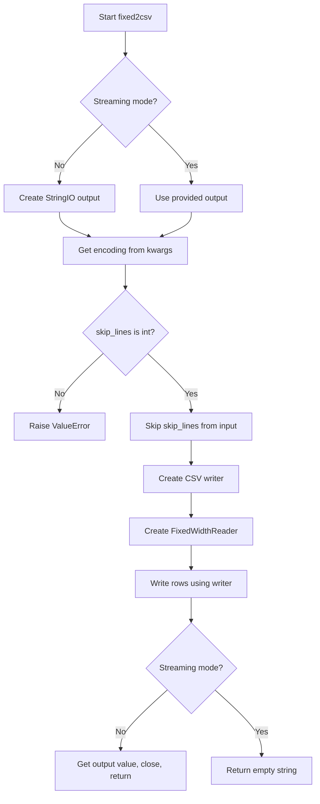

# `fixed.py`

## `csvkit.convert.fixed.fixed2csv` · *function*

## Summary:
Converts fixed-width formatted text data into CSV format using a schema definition.

## Description:
Transforms structured fixed-width text data into comma-separated values format. This function reads fixed-width formatted input using a schema-based parser and writes the result as CSV data. It supports both streaming output (writing directly to a provided output stream) and buffered output (returning the complete CSV string). The function can skip initial lines and handles character encoding through keyword arguments.

This logic is extracted into its own function to separate the concerns of fixed-width parsing from CSV writing, enabling reuse across different input/output scenarios and providing a clean interface for converting fixed-width data to CSV format.

## Args:
    f (file-like object): Input stream containing fixed-width formatted data
    schema (file-like object or schema definition): Schema defining column positions and lengths for fixed-width parsing
    output (file-like object, optional): Output stream for CSV data. If None, returns CSV string instead
    skip_lines (int): Number of initial lines to skip before processing data. Must be a non-negative integer
    **kwargs: Additional keyword arguments, primarily for encoding specification

## Returns:
    str or None: CSV-formatted data as string when output is None; empty string when output is provided (streaming mode)

## Raises:
    ValueError: When skip_lines argument is not an integer
    ValueError: When schema definition is invalid (raised by FixedWidthReader)

## Constraints:
    Preconditions:
        - Input file handle `f` must be readable
        - Schema must define valid column positions and lengths
        - skip_lines must be a non-negative integer
        - If output is provided, it must be writable
    
    Postconditions:
        - All fixed-width data is converted to CSV format
        - When not in streaming mode, the returned string contains complete CSV data
        - When in streaming mode, output stream is properly written to

## Side Effects:
    - Reads from input file handle `f`
    - Writes to output file handle when provided
    - May read from stdin if `f` refers to stdin
    - May write to stdout if `output` refers to stdout

## Control Flow:


## Examples:
```python
from csvkit.convert.fixed import fixed2csv
from io import StringIO

# Example 1: Convert to CSV string
schema_data = '''col1,1,5
col2,6,8
col3,14,10'''

input_data = '''Hello   World   TestData   
Goodbye Universe  MoreData '''

csv_result = fixed2csv(
    StringIO(input_data),
    StringIO(schema_data),
    skip_lines=0
)
print(csv_result)
# Output: "col1,col2,col3\nHello,World,TestData\nGoodbye,Universe,MoreData"

# Example 2: Stream to output file
with open('output.csv', 'w') as output_file:
    fixed2csv(
        StringIO(input_data),
        StringIO(schema_data),
        output=output_file,
        skip_lines=0
    )
```

## `csvkit.convert.fixed.FixedWidthReader` · *class*

## Summary:
A fixed-width file reader that iterates over structured data rows using a schema-based parser.

## Description:
The FixedWidthReader class provides an iterator interface for reading fixed-width formatted text files. It processes input data using a FixedWidthRowParser to convert raw text lines into structured data. This class is designed to work with fixed-width formatted files where each field has a predetermined position and length, making it suitable for processing legacy data formats or structured text files.

The reader handles optional character encoding conversion and automatically skips header rows when processing data. It implements Python's iterator protocol, making it easy to consume in for-loops and other iteration contexts.

## State:
- file: file-like object - The input stream containing fixed-width formatted data
- parser: FixedWidthRowParser - Parser instance that handles the conversion of text lines to structured data
- header: bool - Flag indicating whether the header row should be returned on next iteration (defaults to True)

## Lifecycle:
- Creation: Instantiate with a file-like object, schema definition, and optional encoding
- Usage: Iterate over the reader object using standard Python iteration protocols (__iter__ and __next__)
- Destruction: No special cleanup required; standard Python garbage collection applies

## Method Map:
```mermaid
graph TD
    A[FixedWidthReader.__init__] --> B[Handle encoding if specified]
    B --> C[Store file reference]
    C --> D[Create FixedWidthRowParser with schema]
    D --> E[Initialize header flag to True]
    
    F[FixedWidthReader.__iter__] --> G[Return self]
    
    H[FixedWidthReader.__next__] --> I{header flag}
    I -->|True| J[Set header flag to False]
    J --> K[Return parser.headers]
    I -->|False| L[Return parser.parse(next(file))]
```

## Raises:
- ValueError: May be raised by FixedWidthRowParser during initialization if schema definition is invalid
- StopIteration: Raised by __next__ when end of file is reached (standard Python iterator behavior)

## Example:
```python
from csvkit.convert.fixed import FixedWidthReader
from io import StringIO

# Sample fixed-width data
data = '''John Doe    25New York City     
Jane Smith  30Los Angeles       
Bob Johnson 35Chicago           '''

# Schema definition
schema = '''column,start,length
name,1,10
age,11,3
city,14,20'''

# Create reader
reader = FixedWidthReader(StringIO(data), StringIO(schema), encoding='utf-8')

# Iterate over records
for record in reader:
    print(record)
# Output: ['John Doe', '25', 'New York City']
#         ['Jane Smith', '30', 'Los Angeles']
#         ['Bob Johnson', '35', 'Chicago']
```

### `csvkit.convert.fixed.FixedWidthReader.__init__` · *method*

## Summary:
Initializes a FixedWidthReader instance to parse fixed-width formatted text data using a provided schema.

## Description:
Configures the reader with a file handle, parsing schema, and optional character encoding. This method prepares the reader for iteration over fixed-width formatted data by setting up the underlying parser and file handling mechanism.

## Args:
    f (file-like object): A file handle or iterable of text lines containing fixed-width formatted data
    schema (Schema or file-like object): Schema definition specifying field names, start positions, and lengths for parsing
    encoding (str, optional): Character encoding of the input file. If provided, the file will be decoded using codecs.iterdecode

## Returns:
    None: This method initializes instance attributes and does not return a value

## Raises:
    ValueError: Raised by FixedWidthRowParser when the schema definition contains invalid entries or malformed data

## State Changes:
    Attributes READ: None
    Attributes WRITTEN: 
    - self.file: Set to the input file handle (potentially wrapped with iterdecode if encoding is specified)
    - self.parser: Set to a FixedWidthRowParser instance initialized with the provided schema
    - self.header: Set to True, indicating that the first row should be treated as headers

## Constraints:
    Preconditions:
    - The schema parameter must define valid field specifications with proper start positions and lengths
    - The file handle must be readable and contain properly formatted fixed-width data
    - If encoding is specified, it must be a valid character encoding recognized by Python's codecs module
    
    Postconditions:
    - self.file contains either the original file handle or an iterdecode-wrapped version
    - self.parser is initialized with the provided schema
    - self.header is set to True to indicate the first row should be processed as headers

## Side Effects:
    I/O: Opens and reads from the provided file handle
    External service calls: None
    Mutations: Sets instance attributes self.file, self.parser, and self.header

### `csvkit.convert.fixed.FixedWidthReader.__iter__` · *method*

## Summary:
Makes the FixedWidthReader instance iterable by returning itself as the iterator.

## Description:
This method implements Python's iterator protocol by returning the instance itself, allowing FixedWidthReader to be used in for-loops and other iteration contexts. When called, it establishes the reader as its own iterator, enabling sequential access to parsed fixed-width data rows.

## Args:
    None

## Returns:
    FixedWidthReader: The instance itself, making it conform to Python's iterator protocol.

## Raises:
    None

## State Changes:
    Attributes READ: self.file, self.parser, self.header
    Attributes WRITTEN: None

## Constraints:
    Preconditions: The FixedWidthReader instance must be properly initialized with a file handle, schema, and encoding.
    Postconditions: The instance becomes ready to iterate over fixed-width data rows starting from the first data row (skipping header if present).

## Side Effects:
    None

### `csvkit.convert.fixed.FixedWidthReader.__next__` · *method*

## Summary:
Returns the next row of fixed-width formatted data, handling header row processing and subsequent data rows.

## Description:
This method implements the iterator protocol's `__next__` method for the FixedWidthReader class. It manages the distinction between header row processing and data row parsing, returning the appropriate structure based on the current iteration state. The method is called during iteration over fixed-width formatted data files and handles the transition from header processing to data parsing.

## Args:
    None

## Returns:
    list: When processing the header row, returns a list of column names from the parser's headers.
    list: When processing data rows, returns a list of parsed field values from the current line.

## Raises:
    StopIteration: Raised when the underlying file iterator is exhausted, signaling the end of iteration.

## State Changes:
    Attributes READ: self.header, self.parser, self.file
    Attributes WRITTEN: self.header (set to False after first call)

## Constraints:
    Preconditions: 
    - The FixedWidthReader instance must be properly initialized with a file handle and schema
    - The file handle must support iteration (be iterable)
    - The parser must be properly configured with a valid schema
    
    Postconditions:
    - On first call, self.header is set to False
    - The method returns either header names or parsed data values
    - Iteration continues until StopIteration is raised

## Side Effects:
    I/O: Reads from the underlying file handle via next(self.file)
    External service calls: None
    Mutations: Modifies self.header state from True to False on first call

## `csvkit.convert.fixed.FixedWidthRowParser` · *class*

## Summary:
A parser that converts fixed-width formatted text lines into structured data using schema-defined field specifications.

## Description:
The FixedWidthRowParser class is responsible for parsing fixed-width formatted text data according to a predefined schema. It processes a schema definition to understand field positions and lengths, then provides methods to extract field values from individual lines of fixed-width data. This class is commonly used in data processing pipelines where fixed-width formatted files need to be converted to structured formats like lists or dictionaries.

## State:
- fields: list[FixedWidthField] - A list of field specifications defining column names, start positions, and lengths for parsing fixed-width data
- Each FixedWidthField has attributes: name (str), start (int), length (int)

## Lifecycle:
- Creation: Instantiate with a schema parameter that defines field specifications
- Usage: Call parse() or parse_dict() methods with individual lines of fixed-width data
- Destruction: No special cleanup required; standard Python garbage collection applies

## Method Map:
```mermaid
graph TD
    A[FixedWidthRowParser.__init__] --> B[Process schema with SchemaDecoder]
    B --> C[Populate self.fields with FixedWidthField objects]
    D[FixedWidthRowParser.parse] --> E[Extract field values from line]
    F[FixedWidthRowParser.parse_dict] --> G[Call parse() then zip with headers]
    H[FixedWidthRowParser.headers] --> I[Return field names]
    E --> J[Return list of values]
    G --> K[Return dict of field names to values]
```

## Raises:
- ValueError: Raised when schema definition contains invalid entries or when parsing fails due to malformed schema data

## Example:
```python
# Create parser with schema
schema_content = '''column,start,length
name,1,10
age,11,3
city,14,20'''

parser = FixedWidthRowParser(StringIO(schema_content))

# Parse a fixed-width line
line = "John Doe    25New York City     "
values = parser.parse(line)  # ['John Doe', '25', 'New York City']

# Parse as dictionary
data_dict = parser.parse_dict(line)  # {'name': 'John Doe', 'age': '25', 'city': 'New York City'}
```

### `csvkit.convert.fixed.FixedWidthRowParser.__init__` · *method*

## Summary:
Initializes a FixedWidthRowParser instance by processing a schema definition to create a list of field specifications.

## Description:
This method parses a schema definition (provided as a CSV-like input) to construct a list of field specifications that define how fixed-width data should be parsed. It reads the schema header to determine column positions, then processes each subsequent row to create FixedWidthField objects representing individual fields.

## Args:
    schema: A CSV-like input source containing field definitions with columns for 'column', 'start', and 'length'

## Returns:
    None: This method initializes the instance state and does not return a value

## Raises:
    ValueError: Raised when there's an error reading the schema at any line, with a message indicating the problematic line number

## State Changes:
    Attributes READ: None
    Attributes WRITTEN: self.fields (populated with FixedWidthField objects)

## Constraints:
    Preconditions: 
    - The schema parameter must be iterable and contain valid CSV data with required columns
    - The first row of schema must contain the column names 'column', 'start', and 'length'
    - Each subsequent row must contain valid values for the field specification
    
    Postconditions:
    - self.fields will contain a list of FixedWidthField objects representing the parsed schema
    - Each FixedWidthField will have valid name, start position, and length properties

## Side Effects:
    None: This method performs no I/O operations or external service calls beyond reading the schema input

### `csvkit.convert.fixed.FixedWidthRowParser.parse` · *method*

## Summary:
Parses a fixed-width formatted line into a list of field values based on predefined field specifications.

## Description:
Extracts field values from a fixed-width formatted input line by applying the field specifications stored in the parser's configuration. This method processes each field definition in `self.fields` to slice the input line appropriately and strip whitespace from extracted values.

## Args:
    line (str): A fixed-width formatted string containing data fields

## Returns:
    list[str]: A list of field values extracted from the input line, with leading/trailing whitespace removed from each value

## Raises:
    None explicitly raised

## State Changes:
    Attributes READ: self.fields
    Attributes WRITTEN: None

## Constraints:
    Preconditions:
        - The input line must be long enough to accommodate all field specifications
        - Each field in self.fields must have 'start' and 'length' attributes
        - Field start positions and lengths must be valid integer indices for the input line
    
    Postconditions:
        - Returns a list of strings with whitespace stripped from each field value
        - The number of returned values equals the number of fields in self.fields

## Side Effects:
    None

### `csvkit.convert.fixed.FixedWidthRowParser.parse_dict` · *method*

## Summary:
Converts a fixed-width line into a dictionary mapping column names to parsed values.

## Description:
Transforms a raw fixed-width text line into a dictionary where keys are column headers and values are the corresponding parsed field values. This method provides a convenient way to access parsed data by column name rather than position.

## Args:
    line (str): A single line of fixed-width formatted text to parse.

## Returns:
    dict: A dictionary mapping header names to parsed field values from the input line.

## Raises:
    None explicitly raised, but may propagate exceptions from underlying parsing operations.

## State Changes:
    Attributes READ: self.headers, self.parse
    Attributes WRITTEN: None

## Constraints:
    Preconditions: 
    - self.headers must be a sequence of strings representing column names
    - self.parse(line) must return a sequence of values with the same length as self.headers
    Postconditions:
    - Returns a dictionary with keys matching self.headers
    - Values correspond to parsed fields from the input line

## Side Effects:
    None

### `csvkit.convert.fixed.FixedWidthRowParser.headers` · *method*

## Summary:
Returns a list of field names from the fixed-width schema fields.

## Description:
Retrieves the header names (field names) from all fields defined in the fixed-width schema. This method is used to obtain the column names that will be associated with parsed data rows.

## Args:
    None

## Returns:
    list[str]: A list of field names as strings, one for each field in the schema.

## Raises:
    None

## State Changes:
    Attributes READ: self.fields
    Attributes WRITTEN: None

## Constraints:
    Preconditions: The FixedWidthRowParser instance must have been initialized with a valid schema containing fields.
    Postconditions: The returned list contains exactly one string for each field in self.fields, in the same order.

## Side Effects:
    None

## `csvkit.convert.fixed.SchemaDecoder` · *class*

## Summary:
A decoder class that transforms schema rows into fixed-width field specifications by extracting column name, start position, and length information.

## Description:
The SchemaDecoder class processes schema definition rows from tabular data to create structured field representations. It expects a header row containing 'column', 'start', and 'length' columns, then extracts the positional indices of these columns. When called with a data row, it analyzes the start position value to determine if the schema uses 1-based or 0-based indexing, then returns a FixedWidthField object representing the field specification.

## State:
- start: int - Index position of the 'start' column in the header row
- length: int - Index position of the 'length' column in the header row
- column: int - Index position of the 'column' column in the header row
- one_based: bool or None - Flag indicating if start positions are 1-based (determined dynamically from first data row)

## Lifecycle:
- Creation: Instantiate with a header row that contains 'column', 'start', and 'length' columns
- Usage: Call the instance with individual data rows to process them into FixedWidthField objects
- Destruction: No explicit cleanup required

## Method Map:
```mermaid
graph TD
    A[SchemaDecoder.__init__] --> B[Validate header contains required columns]
    B --> C[Store column index positions]
    D[SchemaDecoder.__call__] --> E{one_based is None?}
    E -- Yes --> F[Determine one_based from first start value]
    E -- No --> G[Use existing one_based flag]
    F --> G
    G --> H[Calculate adjusted_start based on one_based flag]
    H --> I[Create FixedWidthField(name, adjusted_start, length)]
```

## Raises:
- ValueError: Raised when any of the required columns ('column', 'start', 'length') are missing from the header row

## Example:
```python
# Create decoder with header row
header = ['column', 'start', 'length']
decoder = SchemaDecoder(header)

# Process a data row (assuming 1-based indexing)
row = ['name', '1', '10']  # column name, start position, field length
field = decoder(row)  # Returns FixedWidthField(name='name', start=0, length=10)

# Process another data row (assuming 0-based indexing)
row2 = ['age', '0', '3']
field2 = decoder(row2)  # Returns FixedWidthField(name='age', start=0, length=3)
```

### `csvkit.convert.fixed.SchemaDecoder.__init__` · *method*

## Summary:
Initializes the SchemaDecoder by validating required schema columns exist in the header and storing their positional indices as instance attributes.

## Description:
This method validates that the header row contains all required schema columns ('column', 'start', and 'length') and stores their positional indices as integer attributes on the instance. It is called automatically during object instantiation to prepare the decoder for processing data rows via the __call__ method.

## Args:
    header (list[str]): A list of column names from the schema file header row

## Returns:
    None: This method initializes the object's state and does not return a value

## Raises:
    ValueError: Raised when any of the required columns ('column', 'start', 'length') are missing from the header row

## State Changes:
    Attributes READ: None
    Attributes WRITTEN: 
    - column: int - Index position of the 'column' column in the header
    - start: int - Index position of the 'start' column in the header  
    - length: int - Index position of the 'length' column in the header

## Constraints:
    Preconditions:
    - The header parameter must be a list-like object containing column names
    - The header must contain all required columns ('column', 'start', 'length')
    
    Postconditions:
    - All required column indices are stored as integer attributes on the instance
    - The instance is ready to process data rows with the SchemaDecoder.__call__ method

## Side Effects:
    None: This method performs no I/O operations or external service calls

### `csvkit.convert.fixed.SchemaDecoder.__call__` · *method*

## Summary:
Processes a row from a schema file to create a FixedWidthField object with adjusted start position based on 1-based or 0-based indexing detection.

## Description:
This method serves as the main processing interface for SchemaDecoder, converting raw row data from a schema file into a structured FixedWidthField representation. It automatically detects whether the schema uses 1-based or 0-based indexing by examining the start value in the first row, then adjusts the start position accordingly before creating the field definition.

## Args:
    row (list or dict-like): A row from the schema file containing column definitions with start, length, and column name information

## Returns:
    FixedWidthField: An immutable field definition object with column name, adjusted start position, and field length

## Raises:
    None explicitly documented

## State Changes:
    Attributes READ: self.start, self.length, self.column, self.one_based
    Attributes WRITTEN: self.one_based (only set once during first call)

## Constraints:
    Preconditions: 
    - The row must contain elements at indices specified by self.start, self.length, and self.column
    - The schema file must have been properly initialized with required columns
    - The first row processed must contain valid integer values for start positions
    
    Postconditions:
    - self.one_based is set to True/False based on first row's start value
    - The returned FixedWidthField has properly adjusted start position

## Side Effects:
    None

