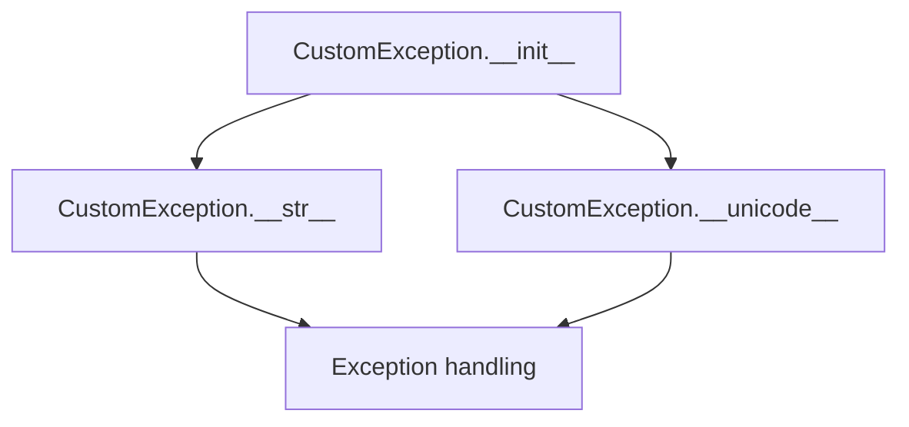
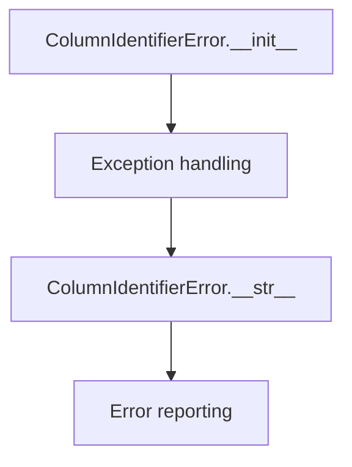
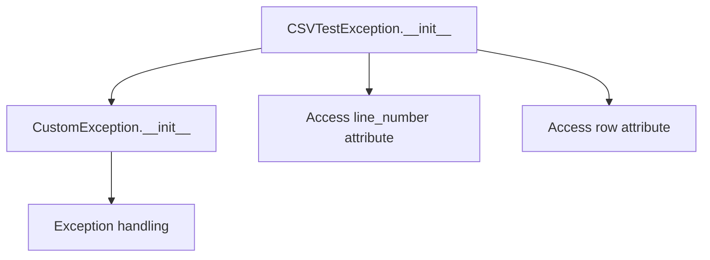
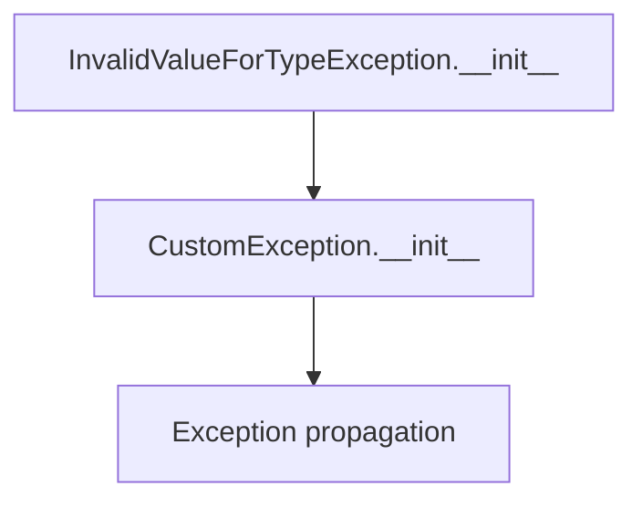
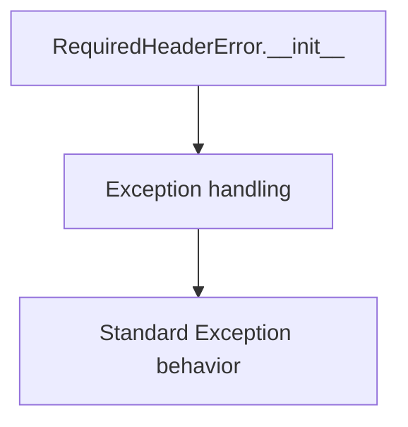

# `exceptions.py`

## `csvkit.exceptions.CustomException` · *class*

## Summary:
Custom exception class that provides a simple way to raise exceptions with custom messages.

## Description:
This class extends Python's built-in Exception class to provide a straightforward mechanism for raising exceptions with custom error messages. It serves as a lightweight wrapper around standard exceptions, allowing for consistent error reporting throughout the application.

## State:
- msg (str): The error message associated with this exception instance. Must be a string value that represents the error description.

## Lifecycle:
- Creation: Instantiate with a string message parameter via `CustomException(msg)`
- Usage: Raise the exception using `raise CustomException("error message")` or handle it in except blocks
- Destruction: Automatic cleanup when the exception propagates out of scope

## Method Map:


## Raises:
- None explicitly raised by __init__
- Inherits standard Exception behavior for instantiation

## Example:
```python
# Creating and raising the exception
try:
    raise CustomException("Something went wrong")
except CustomException as e:
    print(str(e))  # Output: "Something went wrong"
```

### `csvkit.exceptions.CustomException.__init__` · *method*

## Summary:
Initializes a custom exception instance with a descriptive error message.

## Description:
Sets up a CustomException instance by storing the provided error message. This method is called during exception object creation to establish the message that will be displayed when the exception is raised or converted to a string.

## Args:
    msg (str): The error message to associate with this exception instance.

## Returns:
    None: This method does not return a value.

## Raises:
    None: This method does not raise any exceptions.

## State Changes:
    Attributes READ: None
    Attributes WRITTEN: self.msg

## Constraints:
    Preconditions: The msg parameter should be a string or an object that can be converted to a string.
    Postconditions: After execution, the instance will have a self.msg attribute containing the provided message.

## Side Effects:
    None: This method performs no I/O operations or external service calls. It only modifies the instance's internal state.

### `csvkit.exceptions.CustomException.__unicode__` · *method*

## Summary:
Returns the Unicode string representation of the custom exception by returning its stored error message.

## Description:
This method provides the Unicode string representation of a CustomException instance. When the exception is raised, printed, or converted to a Unicode string, this method is automatically invoked to determine what message should be displayed. This implementation follows the standard Python convention for exception string representations, ensuring that the stored error message is properly returned.

## Args:
    None: This method takes no arguments beyond the implicit self parameter.

## Returns:
    str: The error message stored in self.msg, which was set during object initialization.

## Raises:
    None: This method does not raise any exceptions.

## State Changes:
    Attributes READ: self.msg
    Attributes WRITTEN: None

## Constraints:
    Preconditions: The self.msg attribute must be set (typically during object initialization via __init__).
    Postconditions: The method returns the stored error message without modifying the instance state.

## Side Effects:
    None: This method performs no I/O operations, external service calls, or modifications to objects outside the instance.

### `csvkit.exceptions.CustomException.__str__` · *method*

## Summary:
Returns the string representation of the custom exception by returning its stored error message.

## Description:
This method provides the string representation of a CustomException instance. When the exception is raised, printed, or converted to a string, this method is automatically invoked to determine what message should be displayed. This implementation follows the standard Python convention for exception string representations.

## Args:
    None: This method takes no arguments beyond the implicit self parameter.

## Returns:
    str: The error message stored in self.msg, which was set during object initialization.

## Raises:
    None: This method does not raise any exceptions.

## State Changes:
    Attributes READ: self.msg
    Attributes WRITTEN: None

## Constraints:
    Preconditions: The self.msg attribute must be set (typically during object initialization via __init__).
    Postconditions: The method returns the stored error message without modifying the instance state.

## Side Effects:
    None: This method performs no I/O operations, external service calls, or modifications to objects outside the instance.

## `csvkit.exceptions.ColumnIdentifierError` · *class*

## Summary:
Custom exception class for errors related to column identifier resolution in CSV processing operations.

## Description:
The ColumnIdentifierError exception is raised when there are issues with identifying or resolving column references in CSV data processing. This exception inherits from CustomException and provides a standardized way to signal column-related errors throughout the csvkit library. Common scenarios that trigger this exception include invalid column indices, missing column names, or ambiguous column specifications.

## State:
- Inherits all state from CustomException parent class
- No additional attributes beyond those provided by CustomException
- The exception message (stored in the inherited msg attribute) contains details about the specific column identifier error

## Lifecycle:
- Creation: Instantiated by raising `raise ColumnIdentifierError("error message")` or through factory methods that create and raise the exception
- Usage: Typically caught and handled by CSV processing functions when column identifiers are invalid or unresolved
- Destruction: Automatically cleaned up when the exception propagates out of scope

## Method Map:


## Raises:
- None explicitly raised by __init__ (inherits standard Exception behavior)
- Raised when column identifier validation fails during CSV processing operations

## Example:
```python
# Example of raising ColumnIdentifierError
try:
    # Attempt to access a non-existent column
    column_data = csv_data.get_column_by_name('non_existent_column')
except ColumnIdentifierError as e:
    print(f"Column identifier error: {e}")
    # Handle the error appropriately
    
# Example of creating and raising the exception directly
raise ColumnIdentifierError("Column index 15 is out of range for CSV with 10 columns")
```

## `csvkit.exceptions.CSVTestException` · *class*

## Summary:
Custom exception class for CSV validation errors that provides contextual information about the specific line and row where the error occurred.

## Description:
CSVTestException is designed to be raised during CSV file validation processes when data integrity issues are detected. It extends CustomException to provide enhanced error reporting by including the line number and row data that caused the validation failure. This allows developers to quickly identify problematic data entries in CSV files.

## State:
- line_number (int): The line number in the CSV file where the validation error occurred. Must be a positive integer representing the file position.
- row (list): The row data that triggered the validation error. Contains the actual CSV field values as a list of strings or other data types.
- msg (str): The error message describing the specific validation failure. Must be a descriptive string explaining what went wrong.

## Lifecycle:
- Creation: Instantiate with line_number (int), row (list), and msg (str) parameters via `CSVTestException(line_number, row, msg)`
- Usage: Raise the exception using `raise CSVTestException(...)` during CSV validation operations
- Destruction: Automatic cleanup when the exception propagates out of scope

## Method Map:


## Raises:
- None explicitly raised by __init__
- Inherits standard Exception behavior for instantiation

## Example:
```python
# Example usage during CSV validation
try:
    # Some CSV validation logic
    if invalid_data_found:
        raise CSVTestException(
            line_number=42,
            row=['field1', 'field2', 'invalid_value'],
            msg="Field contains invalid characters"
        )
except CSVTestException as e:
    print(f"Error on line {e.line_number}: {e.msg}")
    print(f"Problematic row: {e.row}")
```

### `csvkit.exceptions.CSVTestException.__init__` · *method*

## Summary:
Initializes a CSV test exception with line number, row data, and error message.

## Description:
This constructor creates a CSV test exception that captures contextual information about a CSV validation failure, including the line number where the issue occurred, the row data that caused the problem, and a descriptive error message. This allows for detailed error reporting during CSV processing and validation operations.

## Args:
    line_number (int): The line number in the CSV file where the validation error occurred.
    row (list): The row data that triggered the validation error.
    msg (str): A descriptive error message explaining the nature of the validation failure.

## Returns:
    None: This method initializes the exception object and does not return a value.

## Raises:
    None: This method does not raise any exceptions itself.

## State Changes:
    Attributes READ: None
    Attributes WRITTEN: 
        - self.line_number: Set to the provided line_number parameter
        - self.row: Set to the provided row parameter

## Constraints:
    Preconditions: 
        - line_number should be a positive integer representing a valid line in a CSV file
        - row should be a list-like object containing the CSV row data
        - msg should be a string describing the validation error
    Postconditions: 
        - The exception object will have self.line_number set to the provided value
        - The exception object will have self.row set to the provided value
        - The exception object will inherit the msg attribute from the parent CustomException class

## Side Effects:
    None: This method performs no I/O operations or external service calls. It only initializes object attributes.

## `csvkit.exceptions.LengthMismatchError` · *class*

## Summary:
Custom exception raised when a CSV row contains a different number of columns than expected during validation.

## Description:
LengthMismatchError is specifically designed to handle CSV validation failures where the actual number of columns in a row differs from the expected column count. This exception is typically raised during CSV parsing and validation processes when strict column count enforcement is required. It inherits from CSVTestException, providing contextual information about the line number and problematic row data.

## State:
- line_number (int): The line number in the CSV file where the length mismatch occurred. Must be a positive integer representing the file position.
- row (list): The row data that failed the column count validation. Contains the actual CSV field values as a list of strings or other data types.
- expected_length (int): The number of columns that were expected in the row. Must be a positive integer.
- msg (str): The error message describing the specific validation failure. Automatically generated as "Expected %i columns, found %i columns".

## Lifecycle:
- Creation: Instantiate with line_number (int), row (list), and expected_length (int) parameters via `LengthMismatchError(line_number, row, expected_length)`
- Usage: Raise the exception using `raise LengthMismatchError(...)` during CSV validation operations when column count mismatches are detected
- Destruction: Automatic cleanup when the exception propagates out of scope

## Method Map:
```mermaid
graph TD
    A[LengthMismatchError.__init__] --> B[CSVTestException.__init__]
    B --> C[Exception handling]
    A --> D[Access length property]
    D --> E[Return len(self.row)]
```

## Raises:
- None explicitly raised by __init__
- Inherits standard Exception behavior for instantiation

## Example:
```python
# Example usage during CSV validation
try:
    # Simulate CSV validation where row has 3 columns but 4 expected
    expected_columns = 4
    actual_row = ['field1', 'field2', 'field3']  # Only 3 columns
    
    if len(actual_row) != expected_columns:
        raise LengthMismatchError(
            line_number=15,
            row=actual_row,
            expected_length=expected_columns
        )
except LengthMismatchError as e:
    print(f"Error on line {e.line_number}: {e.args[-1]}")
    print(f"Expected {e.expected_length} columns, found {e.length} columns")
    print(f"Problematic row: {e.row}")
```

### `csvkit.exceptions.LengthMismatchError.__init__` · *method*

## Summary:
Initializes a LengthMismatchError exception with line number, row data, and expected column count for error reporting.

## Description:
Constructs a LengthMismatchError exception that occurs when a CSV row contains a different number of columns than expected during validation. This method formats a descriptive error message indicating the expected and actual column counts, then initializes the exception hierarchy with the provided parameters.

The exception is part of the csvkit library's CSV validation framework, specifically designed to report column count mismatches in CSV data processing workflows.

## Args:
    line_number (int): The line number in the CSV file where the mismatch occurred
    row (list): The actual row data that caused the mismatch
    expected_length (int): The expected number of columns for the row

## Returns:
    None: This method initializes the exception object and does not return a value

## Raises:
    None: This method does not raise any exceptions directly

## State Changes:
    Attributes READ: None
    Attributes WRITTEN: 
    - self.line_number: Set to the provided line_number parameter
    - self.row: Set to the provided row parameter
    - self.msg: Set through the parent class initialization with the formatted error message

## Constraints:
    Preconditions:
    - line_number must be a positive integer representing a valid line in the CSV
    - row must be iterable (list-like) containing the actual column data
    - expected_length must be a non-negative integer representing expected column count
    
    Postconditions:
    - The exception instance will have self.line_number set to the provided value
    - The exception instance will have self.row set to the provided row value
    - The exception instance will have a properly formatted error message in its message field

## Side Effects:
    None: This method performs no I/O operations or external service calls

### `csvkit.exceptions.LengthMismatchError.length` · *method*

## Summary:
Returns the number of columns in the CSV row that caused a length mismatch error.

## Description:
This property provides access to the actual column count of the CSV row that triggered a LengthMismatchError. It's used primarily for error reporting and debugging purposes to show the discrepancy between expected and actual column counts in CSV validation.

## Args:
    None

## Returns:
    int: The number of elements in the row list, representing the actual column count of the problematic CSV row.

## Raises:
    None

## State Changes:
    Attributes READ: 
    - self.row: The row data that caused the validation error
    Attributes WRITTEN: None

## Constraints:
    Preconditions:
    - The LengthMismatchError instance must have been properly initialized with a row parameter
    - self.row must be an iterable (typically a list) containing CSV field values
    
    Postconditions:
    - The returned value equals the length of the row data that caused the error
    - No modification to the exception object's state occurs

## Side Effects:
    None: This method performs no I/O operations, external service calls, or mutations to objects outside self.

## `csvkit.exceptions.InvalidValueForTypeException` · *class*

## Summary:
Exception raised when a value cannot be converted to a specified data type at a given index.

## Description:
This exception is thrown when csvkit encounters a value that cannot be converted to the expected data type during processing. It provides detailed information about the problematic value, the target type, and its position in the data stream. This class serves as a specialized error handler for type conversion failures in CSV processing operations.

## State:
- index (int): The zero-based position in the data where the conversion failed. Valid range: any non-negative integer.
- value (str): The string representation of the value that could not be converted. Valid range: any string value.
- normal_type (str): The target data type that the value was expected to convert to. Valid range: any string representing a data type name.

## Lifecycle:
- Creation: Instantiate with three arguments: index (int), value (str), and normal_type (str)
- Usage: Raise the exception when a type conversion fails during CSV processing operations
- Destruction: Automatic cleanup when the exception propagates out of scope

## Method Map:


## Raises:
- None explicitly raised by __init__ method
- Inherits standard Exception behavior for instantiation and propagation

## Example:
```python
# Example of creating and raising the exception
try:
    raise InvalidValueForTypeException(5, "not_a_number", "int")
except InvalidValueForTypeException as e:
    print(str(e))  # Output: "Unable to convert "not_a_number" to type int (at index 5)"
```

### `csvkit.exceptions.InvalidValueForTypeException.__init__` · *method*

## Summary:
Initializes an InvalidValueForTypeException with conversion failure details.

## Description:
Constructs an exception that indicates a value could not be converted to the expected type at a specific index. This method is called during CSV processing when type conversion fails for a particular field.

## Args:
    index (int): The zero-based index of the field that failed conversion.
    value (str): The string value that could not be converted.
    normal_type (str): The target type that the value was expected to convert to.

## Returns:
    None: This method does not return a value.

## Raises:
    None: This method does not raise exceptions directly.

## State Changes:
    Attributes READ: None
    Attributes WRITTEN: self.index, self.value, self.normal_type

## Constraints:
    Preconditions: All arguments must be provided and non-None.
    Postconditions: The exception instance will have self.index, self.value, and self.normal_type set to the provided values.

## Side Effects:
    None: This method performs no I/O operations or external service calls.

## `csvkit.exceptions.RequiredHeaderError` · *class*

## Summary:
Custom exception class indicating a required header field is missing from input data.

## Description:
RequiredHeaderError is a custom exception that inherits from CustomException and is used to indicate when a required header field cannot be found in input data, such as a CSV file. This exception serves as a specific error type to distinguish missing required headers from other validation failures in data processing workflows.

## State:
- Inherits all attributes and behavior from CustomException parent class
- No additional instance variables or state beyond standard Exception behavior

## Lifecycle:
- Creation: Instantiated with optional error message via `RequiredHeaderError(message)` or `RequiredHeaderError()`
- Usage: Raised using `raise RequiredHeaderError("message")` when header validation detects a missing required field
- Destruction: Automatically cleaned up when the exception propagates out of scope

## Method Map:


## Raises:
- None explicitly raised by __init__ (inherits standard Exception instantiation behavior)
- Raised during header validation operations when required fields are not present

## Example:
```python
# Typical usage in header validation
def validate_headers(required_fields, actual_fields):
    missing = set(required_fields) - set(actual_fields)
    if missing:
        raise RequiredHeaderError(f"Missing required headers: {missing}")
```

