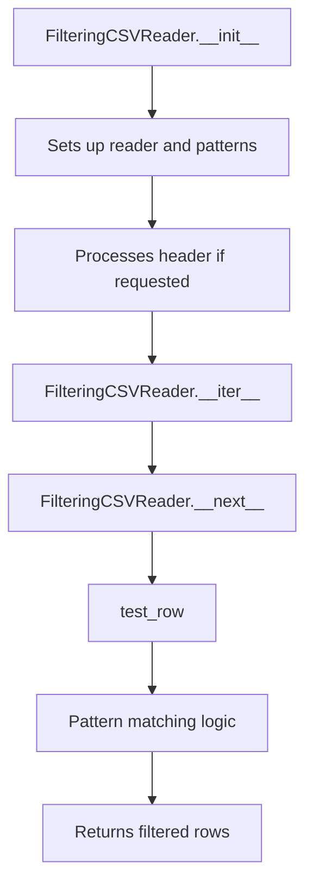

# `grep.py`

## `csvkit.grep.FilteringCSVReader` · *class*

## Summary:
A CSV reader wrapper that filters rows based on pattern matching criteria, supporting flexible pattern specifications and various matching modes.

## Description:
The FilteringCSVReader class provides a filtering interface for CSV data streams, allowing users to select rows based on pattern matching against specific columns. It acts as a wrapper around an existing CSV reader, applying filtering logic to rows while preserving the original reader's interface. This abstraction enables efficient, memory-conscious filtering of large CSV datasets without loading all data into memory simultaneously.

The class supports multiple matching strategies including "any match" (where a row is included if any specified pattern matches) versus "all match" (where a row is included only if all patterns match), and inverse matching (to exclude rows matching patterns). It also handles header processing automatically when requested.

## State:
- reader: An iterable CSV reader object that yields rows as lists of strings
- header: Boolean flag indicating whether the first row contains column headers (default: True)
- column_names: List of column names from the header row, or None if no header is processed
- returned_header: Boolean flag tracking whether the header row has been yielded (default: False)
- any_match: Boolean flag controlling matching strategy (default: False, meaning "all match")
- inverse: Boolean flag controlling inverse matching (default: False, meaning "include matching rows")
- patterns: Dictionary mapping column indices to callable pattern functions, standardized by standardize_patterns()

## Lifecycle:
- Creation: Instantiate with a CSV reader, pattern specifications, and optional configuration flags
- Usage: Iterate over the instance to retrieve filtered rows, with automatic header handling
- Destruction: No explicit cleanup required; relies on underlying reader's lifecycle management

## Method Map:


## Raises:
- ColumnIdentifierError: When column name resolution conflicts occur during pattern standardization
- AttributeError: When pattern specifications don't conform to expected dictionary or sequence formats
- StopIteration: Raised by __next__ when the underlying reader is exhausted

## Example:
```python
import csv
from csvkit.grep import FilteringCSVReader

# Create a basic CSV reader
csv_reader = csv.reader(open('data.csv'))

# Filter rows where column 0 contains 'John' AND column 1 matches '\d+'
filtered_reader = FilteringCSVReader(
    csv_reader, 
    patterns=['John', r'\d+'], 
    header=True,
    any_match=False,  # All patterns must match
    inverse=False     # Include matching rows
)

# Iterate through filtered results
for row in filtered_reader:
    print(row)
```

### `csvkit.grep.FilteringCSVReader.__init__` · *method*

## Summary:
Initializes a FilteringCSVReader object that filters CSV rows based on specified patterns and matching criteria.

## Description:
Configures a CSV reader that applies pattern-based filtering to rows from an underlying CSV reader. This method sets up the filtering configuration including pattern specifications, matching behavior (any vs all), and inversion logic. It processes the CSV header if requested and prepares standardized pattern mappings for efficient row filtering.

## Args:
    reader (Iterator): An iterator that yields CSV rows (lists of strings)
    patterns (dict or list-like): Pattern specification for filtering columns. Can be a dictionary mapping column identifiers to patterns, or a sequence of patterns applied to columns in order
    header (bool, optional): Whether the first row contains column headers. Defaults to True
    any_match (bool, optional): If True, matches any pattern in a row to include it. If False, all patterns must match. Defaults to False
    inverse (bool, optional): If True, inverts the matching logic (excludes rows that would normally match). Defaults to False

## Returns:
    None: This method initializes instance attributes and does not return a value

## Raises:
    ColumnIdentifierError: When column name resolution conflicts occur during pattern standardization
    AttributeError: When patterns argument is not a dictionary-like object or sequence

## State Changes:
    Attributes READ: None
    Attributes WRITTEN: 
        - self.reader: Stores the input CSV reader iterator
        - self.header: Stores the header flag
        - self.column_names: Stores column names if header is True
        - self.any_match: Stores the any_match flag
        - self.inverse: Stores the inverse flag
        - self.patterns: Stores standardized pattern mappings

## Constraints:
    Preconditions:
        - reader must be an iterable that yields lists of strings representing CSV rows
        - patterns must be either a dictionary or sequence-like object
        - If patterns is a dictionary, keys should be valid column identifiers (names or indices)
        - column_names should be a list of strings if provided (when header=True)
    
    Postconditions:
        - self.reader is set to the provided reader
        - self.header is set to the provided header flag
        - self.column_names is populated from reader if header=True
        - self.any_match is set to the provided any_match flag
        - self.inverse is set to the provided inverse flag
        - self.patterns is a standardized dictionary mapping column indices to callable pattern functions

## Side Effects:
    - Reads the first row from reader if header=True (consumes one iteration from the reader)
    - Calls standardize_patterns function which may raise exceptions
    - No external service calls or I/O beyond reading from the provided reader

### `csvkit.grep.FilteringCSVReader.__iter__` · *method*

## Summary:
Makes the FilteringCSVReader instance iterable by returning itself as the iterator.

## Description:
Implements the Python iterator protocol by returning the instance itself. This enables the FilteringCSVReader to be used in for-loops and other iteration contexts. When iterated, the reader will process CSV rows according to the configured filtering patterns, yielding only those rows that match the specified criteria.

This method is part of the standard iterator protocol implementation and delegates the actual iteration logic to the `__next__` method, which handles row filtering and pattern matching.

## Args:
    None

## Returns:
    FilteringCSVReader: The instance itself, making it iterable.

## Raises:
    None

## State Changes:
    Attributes READ: None
    Attributes WRITTEN: None

## Constraints:
    Preconditions:
    - The FilteringCSVReader instance must be properly initialized with a CSV reader and filtering patterns
    - The underlying CSV reader must be valid and accessible
    
    Postconditions:
    - The instance remains unchanged after calling __iter__
    - The instance becomes ready for iteration via __next__

## Side Effects:
    None

### `csvkit.grep.FilteringCSVReader.__next__` · *method*

## Summary:
Returns the next filtered row from the CSV reader, handling header row processing and applying configured filters.

## Description:
Implements the iterator protocol for FilteringCSVReader, providing the next row that matches the configured filtering criteria. On the first call, it returns the column names if header processing is enabled. Subsequent calls iterate through the underlying CSV reader, filtering rows based on the defined patterns and match conditions.

This method serves as the core iteration mechanism for the filtering CSV reader, encapsulating the logic for header handling and row filtering in a single, reusable method rather than inlining this behavior elsewhere.

## Args:
    None

## Returns:
    list[str]: A list of string values representing a CSV row that matches the filter criteria, or the column names on the first call if header processing is enabled.

## Raises:
    StopIteration: When no more rows are available from the underlying reader or when all remaining rows fail to match the filter criteria.

## State Changes:
    Attributes READ: self.column_names, self.returned_header, self.reader, self.test_row
    Attributes WRITTEN: self.returned_header

## Constraints:
    Preconditions:
    - The underlying reader must be initialized and iterable
    - The FilteringCSVReader must be properly configured with patterns and filtering options
    - Column names must be set if header processing is enabled
    
    Postconditions:
    - On first call, self.returned_header is set to True
    - The returned row matches all configured filtering criteria
    - If no rows match, StopIteration is raised

## Side Effects:
    I/O: Reads from the underlying CSV reader
    Mutation: Modifies self.returned_header state flag

### `csvkit.grep.FilteringCSVReader.test_row` · *method*

## Summary:
Tests whether a CSV row matches the configured filtering patterns based on AND/OR logic and inversion settings.

## Description:
Evaluates a CSV row against pre-configured patterns to determine if the row should be included in filtered output. This method implements flexible filtering logic that supports both AND and OR matching modes, as well as inverted matching (negation). It is called internally by the FilteringCSVReader's iteration logic to decide whether to include each row in the output stream.

The method processes each pattern in self.patterns, applying the pattern to the corresponding column value in the row. The matching behavior depends on the self.any_match flag (OR vs AND logic) and self.inverse flag (inverted matching).

When `any_match=True` (OR mode): Returns True if ANY pattern matches, False otherwise.
When `any_match=False` (AND mode): Returns True if ALL patterns match, False otherwise.
When `inverse=True`: Inverts the final result (True becomes False and vice versa).

## Args:
    row (list): A list representing a CSV row, where each element corresponds to a column value

## Returns:
    bool: True if the row matches the filtering criteria according to the configured logic, False otherwise

## Raises:
    None explicitly raised

## State Changes:
    Attributes READ: self.patterns, self.any_match, self.inverse
    Attributes WRITTEN: None

## Constraints:
    Preconditions:
    - self.patterns must be a dictionary mapping column indices to callable pattern functions
    - self.any_match must be a boolean value
    - self.inverse must be a boolean value
    - row must be iterable with sufficient length to access all pattern indices
    
    Postconditions:
    - Method returns a boolean value indicating row inclusion/exclusion
    - No modifications are made to the object's state

## Side Effects:
    None

## `csvkit.grep.standardize_patterns` · *function*

## Summary:
Standardizes column pattern mappings by converting column names to numeric indices and ensuring consistent pattern representation for CSV filtering operations.

## Description:
Processes input patterns for CSV column filtering, normalizing them into a consistent internal format where column identifiers are represented as numeric indices when possible. This function handles both dictionary-based patterns (mapping column names/indices to patterns) and sequence-based patterns (list of patterns), converting them into a unified format suitable for downstream CSV processing.

The function is extracted to provide a clean abstraction for pattern normalization, separating concerns between pattern parsing and actual CSV filtering logic. This allows the core filtering operations to work with a consistent data structure regardless of how patterns were originally specified.

## Args:
    column_names (list[str] or None): List of column names in the CSV, used to resolve column name references to numeric indices. May be None if no column name resolution is needed.
    patterns (dict or list-like): Pattern specification that can be either:
        - A dictionary mapping column names/indices to pattern objects
        - A sequence/list of pattern objects to be applied to columns in order

## Returns:
    dict: A standardized pattern mapping where:
        - Keys are numeric column indices (integers) when column names are resolved
        - Keys are original keys when column name resolution fails or column_names is None
        - Values are callable pattern functions created by pattern_as_function()

## Raises:
    ColumnIdentifierError: When a column name resolves to an index that already has a pattern assigned, indicating a conflict in pattern specification.
    AttributeError: When patterns is not a dictionary-like object and cannot be enumerated as a sequence.

## Constraints:
    Preconditions:
    - Patterns must be either a dictionary or a sequence-like object
    - If patterns is a dictionary, keys should be column identifiers (names or indices)
    - column_names should be a list of strings if provided
    
    Postconditions:
    - All returned patterns are callable functions (created by pattern_as_function)
    - Keys in returned dictionary are either integers (column indices) or original keys
    - No duplicate column index assignments occur in the result

## Side Effects:
    None

## Control Flow:
```mermaid
flowchart TD
    A[Start standardize_patterns] --> B{patterns is dict?}
    B -- Yes --> C{patterns.items()}
    C --> D{v is truthy?}
    D -- Yes --> E[Convert v to function with pattern_as_function]
    E --> F{column_names is None?}
    F -- Yes --> G[Return patterns]
    F -- No --> H[Process column name resolution]
    H --> I{key in column_names?}
    I -- Yes --> J[Get index of key in column_names]
    J --> K{index in patterns?}
    K -- Yes --> L[Throw ColumnIdentifierError]
    L --> M[Map index to pattern function]
    I -- No --> N[Keep original key]
    N --> O[Return p2]
    D -- No --> P[Skip key]
    B -- No --> Q[Handle sequence case via except block]
    Q --> R[Enumerate patterns]
    R --> S[Convert each to function with pattern_as_function]
    S --> T[Return indexed patterns]
```

## Examples:
```python
# Example 1: Dictionary patterns with column names
column_names = ['name', 'age', 'email']
patterns = {'name': 'John', 'age': r'\d+'}
result = standardize_patterns(column_names, patterns)
# Returns: {0: <function for 'John'>, 1: <function for r'\d+'>}

# Example 2: Sequence patterns (no column names)
patterns = ['John', r'\d+', 'example@']
result = standardize_patterns(None, patterns)
# Returns: {0: <function for 'John'>, 1: <function for r'\d+'>, 2: <function for 'example@'>}

# Example 3: Mixed pattern specification
column_names = ['id', 'title', 'content']
patterns = {'title': 'important', 2: 'urgent'}
result = standardize_patterns(column_names, patterns)
# Returns: {1: <function for 'important'>, 2: <function for 'urgent'>}

# Example 4: Error case - conflicting column name/index
column_names = ['name', 'age']
patterns = {'name': 'John', 0: 'Jane'}  # 'name' maps to index 0, which is already used
# Raises ColumnIdentifierError

# Example 5: AttributeError case - non-dict patterns
patterns = "not_a_dict"
result = standardize_patterns(None, patterns)
# Falls through to except block and returns {0: <function for "not_a_dict">}
```

## `csvkit.grep.pattern_as_function` · *function*

## Summary:
Converts a pattern object into a callable function for string matching operations.

## Description:
Transforms various pattern types (callable objects, regex patterns, or literal values) into uniform callable functions that can be used for pattern matching against strings. This function enables flexible pattern matching by normalizing different input types into a consistent interface.

The function is designed to handle three distinct input types:
1. Already callable objects (functions, lambdas, callable instances)
2. Objects with a 'match' attribute (typically compiled regex patterns)
3. Literal values that should be checked for substring inclusion

This extraction into a separate function allows for consistent pattern handling throughout the CSV processing pipeline while maintaining flexibility in input types.

## Args:
    obj (Any): Input pattern that can be a callable, regex pattern, or literal value to be converted into a matching function

## Returns:
    callable: A function that accepts a string argument and returns True if the pattern matches, False otherwise

## Raises:
    None explicitly raised by this function

## Constraints:
    Preconditions:
    - Input object must be of a type that can be processed by the function logic
    - If input is a regex pattern, it must support the 'match' attribute
    
    Postconditions:
    - Returned function will accept string arguments
    - Returned function will return boolean values (True/False)
    - The returned function maintains the semantics of the original pattern type

## Side Effects:
    None

## Control Flow:
```mermaid
flowchart TD
    A[Start pattern_as_function(obj)] --> B{Is obj callable?}
    B -- Yes --> C[Return obj]
    B -- No --> D{Has obj.match?}
    D -- Yes --> E[Return regex_callable(obj)]
    D -- No --> F[Return lambda x: obj in x]
```

## Examples:
```python
# Using a callable pattern
pattern_func = pattern_as_function(lambda x: x.startswith('test'))
result = pattern_func('testing')  # Returns True

# Using a regex pattern
import re
regex_pattern = re.compile(r'\d+')
pattern_func = pattern_as_function(regex_pattern)
result = pattern_func('abc123')  # Returns True

# Using a literal string pattern
pattern_func = pattern_as_function('hello')
result = pattern_func('say hello world')  # Returns True

# Using a pre-defined function
def custom_match(text):
    return len(text) > 5

pattern_func = pattern_as_function(custom_match)
result = pattern_func('example')  # Returns True
```

## `csvkit.grep.regex_callable` · *class*

## Summary:
A callable class that wraps a compiled regex pattern for efficient string matching operations.

## Description:
This class serves as a wrapper around a compiled regular expression pattern, enabling instances to be invoked directly as functions. It's designed to facilitate regex-based filtering and matching operations in CSV processing contexts, particularly when working with column data. The class implements the callable protocol, making it easy to use in filter functions or as callback handlers.

## State:
- pattern: Compiled regex pattern object (type: re.Pattern or similar)
  - Valid range: Must be a compiled regex pattern that supports the search() method
  - Invariant: Once set in __init__, the pattern remains immutable for the instance lifetime

## Lifecycle:
- Creation: Instantiate with a compiled regex pattern object as the sole argument
- Usage: Call the instance directly with a string argument to perform regex matching
- Destruction: No special cleanup required; relies on Python's garbage collection

## Method Map:
```mermaid
graph TD
    A[regex_callable.__init__(pattern)] --> B[regex_callable.__call__(arg)]
    B --> C[Returns pattern.search(arg)]
```

## Raises:
- None explicitly raised by __init__
- The pattern.search() method may raise exceptions if the pattern is invalid or if the argument is not a string, but these are propagated from the underlying regex engine

## Example:
```python
import re
from csvkit.grep import regex_callable

# Create a regex pattern
pattern = re.compile(r'^\d{3}-\d{2}-\d{4}$')  # SSN format

# Create callable instance
ssn_matcher = regex_callable(pattern)

# Use as function
result = ssn_matcher("123-45-6789")  # Returns Match object or None
```

### `csvkit.grep.regex_callable.__init__` · *method*

## Summary:
Initializes a regex_callable instance with a compiled regular expression pattern for subsequent matching operations.

## Description:
This constructor method sets up a regex_callable instance by storing the provided compiled regular expression pattern. The pattern is stored as an instance attribute and will be used by the __call__ method to perform regex searches on input strings. This method is part of the callable protocol implementation that allows regex_callable instances to be used as functions.

## Args:
    pattern (re.Pattern or similar): A compiled regular expression pattern object that supports the search() method. This pattern will be used for all subsequent matching operations performed by the instance.

## Returns:
    None: This method does not return a value.

## Raises:
    None: This method does not explicitly raise exceptions under normal circumstances.

## State Changes:
    Attributes READ: None
    Attributes WRITTEN: self.pattern

## Constraints:
    Preconditions:
    - The pattern argument must be a compiled regular expression object (typically created with re.compile())
    - The pattern must support the search() method for matching operations
    
    Postconditions:
    - The instance will have self.pattern set to the provided pattern object
    - The pattern object will remain unchanged throughout the instance's lifetime

## Side Effects:
    None: This method performs no I/O operations or external service calls.

### `csvkit.grep.regex_callable.__call__` · *method*

## Summary:
Performs a regular expression search on the provided argument using the compiled pattern stored in the instance.

## Description:
This method implements the callable interface for the regex_callable class, allowing instances to be invoked like functions. It executes a regular expression search operation against the input argument using the pre-compiled pattern stored in the instance.

## Args:
    arg (str): The string to search for matches using the compiled regular expression pattern.

## Returns:
    MatchObject or None: A match object if the pattern is found in the argument, or None if no match is found.

## Raises:
    AttributeError: If self.pattern is not properly initialized or does not have a search method.

## State Changes:
    Attributes READ: self.pattern
    Attributes WRITTEN: None

## Constraints:
    Preconditions: 
    - self.pattern must be a compiled regular expression object (from re.compile()) with a search method
    - arg must be a string or string-like object compatible with the regex pattern
    
    Postconditions:
    - The method does not modify any instance state
    - Returns either a MatchObject or None based on the search result

## Side Effects:
    None

