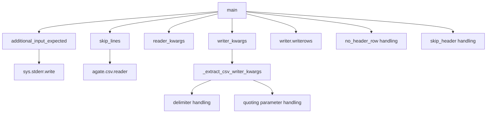

# `csvformat.py`

## `csvkit.utilities.csvformat.CSVFormat` · *class*

## Summary:
A command-line utility for converting CSV files to custom output formats with configurable delimiters, quoting, and other CSV formatting options.

## Description:
The CSVFormat class provides functionality to convert CSV files or standard input into different CSV formats with customizable output parameters. It serves as a CLI utility that allows users to specify various formatting options such as delimiters, quote characters, quoting styles, and line terminators for the output CSV file.

This class is designed to be instantiated by the csvkit command-line framework and is typically invoked through command-line arguments rather than direct instantiation by application code. It overrides certain CSVKitUtility flags to provide specialized CSV formatting capabilities.

## State:
- description (str): A brief description of the utility's purpose, set to 'Convert a CSV file to a custom output format.'
- override_flags (list): Command-line flags that are overridden by this utility, containing ['L', 'blanks', 'date-format', 'datetime-format']
- args (Namespace): Parsed command-line arguments from argparse, containing attributes like skip_header, out_delimiter, out_tabs, out_quotechar, out_quoting, out_doublequote, out_escapechar, out_lineterminator, and potentially line_numbers and no_header_row
- reader_kwargs (dict): Keyword arguments for configuring the CSV reader, inherited from parent class
- writer_kwargs (dict): Keyword arguments for configuring the CSV writer, inherited from parent class via _extract_csv_writer_kwargs method

## Lifecycle:
- Creation: Instantiated automatically by the csvkit CLI framework when the csvformat command is invoked
- Usage: Called through the standard CLI utility lifecycle with argument parsing, followed by main() execution
- Destruction: Managed by the CLI framework, no explicit cleanup required

## Method Map:


## Raises:
- None explicitly raised by __init__ (inherits from CSVKitUtility)
- May raise exceptions from agate.csv.reader or agate.csv.writer during processing
- May raise IOError if file operations fail
- May raise StopIteration if input is exhausted unexpectedly

## Example:
```bash
# Convert CSV with tab delimiter
csvformat -T input.csv > output.tsv

# Convert CSV with custom delimiter and quoting
csvformat -D";" -U1 input.csv > output.csv

# Skip header row in output
csvformat -E input.csv > output.csv

# Convert with custom quote character and line terminator
csvformat -Q'"' -M'\r\n' input.csv > output.csv

# Add line numbers to output
csvformat --line-numbers input.csv > output.csv
```

### `csvkit.utilities.csvformat.CSVFormat.add_arguments` · *method*

## Summary:
Configures command-line arguments for CSV output formatting options including header control, delimiter settings, quoting styles, and line termination characters.

## Description:
Adds command-line arguments to the argument parser that control how CSV output is formatted. This method enables users to customize various aspects of the output CSV file such as whether to include headers, what delimiter to use, quoting behavior, and line termination characters. The method is called during the initialization of CSVKit utilities to set up the command-line interface before argument parsing occurs.

This logic is separated into its own method following the CSVKit utility pattern where each subclass implements `add_arguments()` to define its specific command-line interface, allowing for consistent argument handling across the entire csvkit suite while enabling specialized functionality per utility.

## Args:
    None (modifies self.argparser internally to add command-line arguments)

## Returns:
    None

## Raises:
    None

## State Changes:
    Attributes READ: None
    Attributes WRITTEN: self.argparser (modifies argument parser with new arguments)

## Constraints:
    Preconditions:
    - self.argparser must be initialized (inherited from CSVKitUtility)
    - The method should be called during class initialization before argument parsing
    
    Postconditions:
    - Command-line arguments are registered with self.argparser for CSV output formatting
    - All specified arguments are properly configured with help text and validation

## Side Effects:
    None

## Arguments Added:
- `-E`, `--skip-header`: Do not output a header row.
- `-D`, `--out-delimiter`: Delimiting character of the output CSV file.
- `-T`, `--out-tabs`: Specify that the output CSV file is delimited with tabs. Overrides "-D".
- `-Q`, `--out-quotechar`: Character used to quote strings in the output CSV file.
- `-U`, `--out-quoting`: Quoting style used in the output CSV file. 0 = Quote Minimal, 1 = Quote All, 2 = Quote Non-numeric, 3 = Quote None.
- `-B`, `--out-no-doublequote`: Whether or not double quotes are doubled in the output CSV file.
- `-P`, `--out-escapechar`: Character used to escape the delimiter in the output CSV file if --quoting 3 ("Quote None") is specified and to escape the QUOTECHAR if --out-no-doublequote is specified.
- `-M`, `--out-lineterminator`: Character used to terminate lines in the output CSV file.

### `csvkit.utilities.csvformat.CSVFormat._extract_csv_writer_kwargs` · *method*

## Summary:
Extracts CSV writer configuration keyword arguments from command-line arguments for use in CSV output operations.

## Description:
Processes command-line arguments to construct a dictionary of keyword arguments suitable for configuring CSV writers. This method handles various output formatting options including delimiter selection, quoting styles, and other CSV writer parameters based on user-provided command-line flags.

The method is called during the initialization of CSVKit utilities to populate the `self.writer_kwargs` attribute, which is subsequently used when creating CSV writer instances for output operations.

## Args:
    None (uses self.args internally)

## Returns:
    dict: A dictionary containing CSV writer configuration parameters including:
        - line_numbers: Boolean indicating whether to include line numbers
        - delimiter: Character to use as field delimiter (tab or custom delimiter)
        - quotechar: Quote character specification
        - quoting: Quoting style specification
        - doublequote: Double quote handling specification
        - escapechar: Escape character specification
        - lineterminator: Line terminator specification

## Raises:
    None explicitly raised

## State Changes:
    Attributes READ: self.args.line_numbers, self.args.out_tabs, self.args.out_delimiter, self.args.out_quotechar, self.args.out_quoting, self.args.out_doublequote, self.args.out_escapechar, self.args.out_lineterminator
    Attributes WRITTEN: None

## Constraints:
    Preconditions:
    - self.args must be initialized with command-line argument parsing results
    - All referenced arguments in self.args must be defined
    
    Postconditions:
    - Returns a dictionary with appropriate CSV writer configuration parameters
    - Delimiter is set to tab or custom delimiter based on command-line flags
    - All specified writer parameters are properly extracted from command-line arguments

## Side Effects:
    None

### `csvkit.utilities.csvformat.CSVFormat.main` · *method*

## Summary:
Formats CSV data by reading from input and writing to output with configurable CSV dialect settings and header handling options.

## Description:
Processes CSV data from input source and writes it to output with specified CSV formatting options. This method implements the core CSV formatting logic for the csvformat utility, handling various header configurations and input/output stream management.

The method is called during the execution lifecycle of CSVKit utilities when the `run()` method invokes the subclass's `main()` implementation. It manages the complete CSV processing workflow including input validation, header row handling, and data output.

## Args:
    None: This method operates on instance attributes and does not accept explicit parameters.

## Returns:
    None: This method performs I/O operations and does not return a value.

## Raises:
    None explicitly raised: The method relies on underlying agate CSV readers/writers which may raise exceptions, but these are not caught or re-raised by this method.

## State Changes:
    Attributes READ:
    - self.args.no_header_row: Boolean flag indicating whether to treat first row as data
    - self.args.skip_header: Boolean flag indicating whether to skip first row
    - self.reader_kwargs: Dictionary of keyword arguments for CSV reader construction
    - self.writer_kwargs: Dictionary of keyword arguments for CSV writer construction
    - self.output_file: File-like object for writing formatted output
    - self.additional_input_expected(): Method to check if stdin input is expected
    - self.skip_lines(): Method to skip initial lines from input
    
    Attributes WRITTEN:
    - None: This method does not modify instance state directly

## Constraints:
    Preconditions:
    - self.args must be properly initialized (from CSVKitUtility base class)
    - self.input_file must be opened and accessible
    - self.output_file must be writable
    - self.reader_kwargs and self.writer_kwargs must contain valid CSV reader/writer parameters
    
    Postconditions:
    - All input CSV data is processed and written to output
    - Output conforms to specified CSV formatting options
    - Input file is consumed completely

## Side Effects:
    - Writes formatted CSV data to self.output_file
    - May write informational message to stderr when waiting for stdin input
    - Reads from self.input_file (which may be a file or stdin)
    - Uses agate.csv.reader and agate.csv.writer for CSV processing

## `csvkit.utilities.csvformat.launch_new_instance` · *function*

## Summary:
Instantiates and executes a CSVFormat command-line utility to convert CSV files with custom formatting options.

## Description:
This function serves as the primary entry point for launching the CSVFormat utility within the csvkit command-line framework. It creates a CSVFormat instance and calls its run() method to process CSV input according to command-line specified formatting options such as delimiters, quote characters, and line terminators.

The function follows the standard csvkit pattern where command-line utilities are instantiated and executed through the CLI framework. It is typically invoked by the csvkit command-line dispatcher when the csvformat command is executed, rather than being called directly by application code.

This function encapsulates the instantiation and execution workflow for the CSVFormat utility, delegating all argument parsing, file handling, and CSV processing to the CSVFormat class itself.

## Args:
    None

## Returns:
    None

## Raises:
    None explicitly raised by this function
    - May raise exceptions from CSVFormat.__init__() if instantiation fails due to invalid arguments
    - May raise exceptions from CSVFormat.run() during execution including:
      * IOError: When file operations fail
      * UnicodeDecodeError: When input encoding issues occur
      * StopIteration: When input is exhausted unexpectedly
      * ValueError: When argument parsing encounters invalid values

## Constraints:
    Preconditions:
    - The csvkit command-line environment must be properly initialized
    - Command-line arguments must be available in sys.argv (via CSVKitUtility's argument parsing)
    - Standard input/output streams must be accessible
    - The CSVFormat class must be properly imported and available
    
    Postconditions:
    - A CSVFormat utility instance is created and executed through the CLI framework
    - Command-line arguments are parsed and processed by CSVFormat
    - CSV input is read and formatted according to specified options
    - Formatted output is written to stdout or specified output file
    - All resources are properly cleaned up by the CLI framework

## Side Effects:
    - Reads from standard input or specified input files (via CSVKitUtility framework)
    - Writes formatted CSV output to standard output or specified output file (via CSVKitUtility framework)
    - Processes command-line arguments from sys.argv through CSVKitUtility's argument parser
    - May modify global state through the csvkit CLI framework initialization and exception handling
    - Invokes the CSVFormat class's main() method which performs the actual CSV processing

## Control Flow:
```mermaid
flowchart TD
    A[launch_new_instance() called] --> B[Create CSVFormat() instance]
    B --> C[Call utility.run()]
    C --> D[CSVKitUtility.run() initializes framework]
    D --> E[Parse command-line args from sys.argv]
    E --> F[Validate arguments and setup output file]
    F --> G[Open input file if needed]
    G --> H[Execute CSVFormat.main()]
    H --> I[Process CSV data with formatting options]
    I --> J[Write output to stdout/file]
    J --> K[Return completion status]
```

## Examples:
```bash
# Convert CSV with tab delimiter
csvformat -T input.csv > output.tsv

# Convert CSV with custom delimiter and quoting
csvformat -D";" -U1 input.csv > output.csv

# Skip header row in output
csvformat -E input.csv > output.csv

# Convert with custom quote character and line terminator
csvformat -Q'"' -M'\r\n' input.csv > output.csv

# Add line numbers to output
csvformat --line-numbers input.csv > output.csv
```

