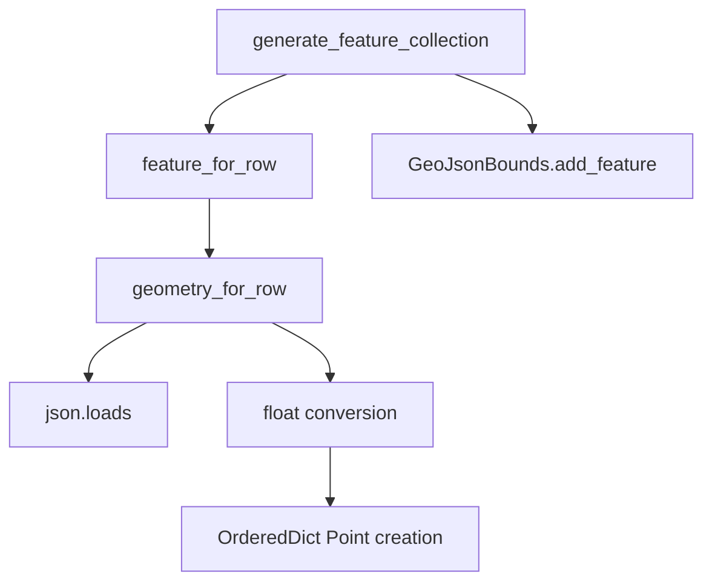
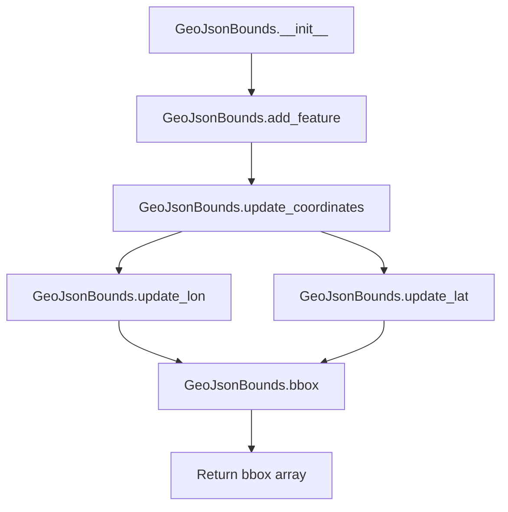

# `csvjson.py`

## `csvkit.utilities.csvjson.CSVJSON` · *class*

## Summary:
Converts CSV files into JSON or GeoJSON format with support for streaming, indentation, key-based output, and geospatial data.

## Description:
The CSVJSON class is a command-line utility that transforms CSV data into JSON or GeoJSON format. It supports various output modes including standard JSON arrays, key-based JSON objects, newline-delimited JSON streams, and GeoJSON feature collections with bounding boxes and coordinate reference systems. The utility handles both regular CSV to JSON conversion and geospatial data conversion with latitude/longitude columns.

This class extends CSVKitUtility and provides specialized argument parsing and execution logic for CSV-to-JSON conversion. It supports advanced features like streaming output, geospatial data handling, and customizable JSON formatting.

## State:
- `args`: Parsed command-line arguments from argparse
- `json_kwargs`: Dictionary of keyword arguments for JSON serialization (indentation settings)
- `output_file`: File-like object for writing output (defaults to sys.stdout)
- `input_file`: File-like object for reading input (set during run() when 'f' not in override_flags)
- `reader_kwargs`: Dictionary of keyword arguments for CSV reader construction
- `description`: Class variable describing the utility as 'Convert a CSV file into JSON (or GeoJSON).'

## Lifecycle:
Creation: Instantiate with optional args list and output_file parameter. The constructor initializes the argument parser and adds CSV-specific arguments via `add_arguments()`.

Usage: Call `run()` method which:
1. Parses command-line arguments
2. Validates argument combinations (lat/lon dependencies, CRS requirements, etc.)
3. Determines output mode (standard JSON, GeoJSON, streaming)
4. Processes CSV data and outputs JSON/GeoJSON

Destruction: Automatic cleanup occurs through context managers and file closing in the parent class run() method.

## Method Map:
```mermaid
graph TD
    A[run()] --> B[main()]
    B --> C{can_stream()}
    C -- True --> D{is_geo()}
    D -- True --> E[streaming_output_ndgeojson()]
    D -- False --> F[streaming_output_ndjson()]
    C -- False --> G{is_geo()}
    G -- True --> H[output_geojson()]
    G -- False --> I[output_json()]
    B --> J[validate_args()]
    J --> K[argparser.error()]
```

## Raises:
- SystemExit: Raised by argparser.error() when validation fails due to invalid argument combinations
- ValueError: Raised by match_column_identifier when column identifiers are invalid
- UnicodeDecodeError: Handled by parent class exception handler for encoding issues

## Example:
```python
# Convert CSV to standard JSON
utility = CSVJSON(['input.csv'])
utility.run()

# Convert CSV to GeoJSON with lat/lon columns
utility = CSVJSON(['--lat', 'latitude', '--lon', 'longitude', 'input.csv'])
utility.run()

# Convert CSV to key-based JSON
utility = CSVJSON(['-k', 'id', 'input.csv'])
utility.run()

# Stream JSON output
utility = CSVJSON(['--stream', 'input.csv'])
utility.run()

# Convert to GeoJSON with CRS
utility = CSVJSON(['--lat', 'lat', '--lon', 'lon', '--crs', 'EPSG:4326', 'input.csv'])
utility.run()
```

## Nested Class: GeoJsonGenerator
The GeoJsonGenerator class handles the conversion of CSV rows into GeoJSON features. It manages column identification for lat/lon/type/geometry/id fields and generates proper GeoJSON structures including Point geometries and feature collections.

### Methods:
- `__init__(args, column_names)`: Initializes generator with command-line arguments and column names
- `generate_feature_collection(table)`: Creates a GeoJSON FeatureCollection from a table
- `feature_for_row(row)`: Converts a CSV row into a GeoJSON feature
- `geometry_for_row(row)`: Generates GeoJSON geometry from lat/lon or geometry column
- `GeoJsonBounds`: Nested class for calculating bounding boxes

### `csvkit.utilities.csvjson.CSVJSON.add_arguments` · *method*

## Summary:
Configures the command-line argument parser with options for JSON output formatting and CSV parsing behavior.

## Description:
This method adds various command-line arguments to the instance's argument parser, enabling users to customize JSON output format, specify GeoJSON features, and control CSV parsing behavior. It serves as the interface between the command-line utility and the underlying CSV-to-JSON conversion process.

## Args:
    None

## Returns:
    None

## Raises:
    None

## State Changes:
    Attributes READ: None
    Attributes WRITTEN: self.argparser

## Constraints:
    Preconditions: The method assumes self.argparser exists and is a proper ArgumentParser instance.
    Postconditions: The argument parser is populated with all supported command-line options.

## Side Effects:
    None

### `csvkit.utilities.csvjson.CSVJSON.main` · *method*

## Summary:
Entry point for CSV to JSON conversion utility that validates arguments and routes processing to appropriate output methods.

## Description:
This method serves as the primary execution point for the csvjson command-line utility. It performs comprehensive argument validation for geographic coordinate options (--lat, --lon, --crs, --type, --geometry) and stream/output configuration (--stream, --key). Based on whether streaming is enabled and whether the data represents geographic information, it routes execution to either streaming or batch output methods.

The method first validates argument dependencies, ensuring that when geographic coordinates are specified, their required counterparts are also provided. It then configures JSON formatting options via self.json_kwargs and selects the appropriate output strategy based on streaming capability and data type.

## Args:
    self: The CSVJSON instance containing parsed arguments and configuration

## Returns:
    None: This method performs side effects through output operations rather than returning values

## Raises:
    SystemExit: When argument validation fails, triggering argparse error messages

## State Changes:
    Attributes READ: self.args, self.argparser, self.additional_input_expected, self.can_stream, self.is_geo
    Attributes WRITTEN: self.json_kwargs (initialized with indent configuration)

## Constraints:
    Preconditions: 
    - When --lat is specified, --lon must also be specified
    - When --lon is specified, --lat must also be specified  
    - When --crs, --type, or --geometry are specified, --lat must also be specified
    - When --key and --stream are both specified, --lat and --lon must also be specified
    - Input data must be provided when not using streaming mode
    
    Postconditions:
    - self.json_kwargs is initialized with indent configuration
    - Either streaming or batch output methods are called based on configuration

## Side Effects:
    - Writes informational messages to stderr when waiting for standard input
    - Calls various output methods that may write to stdout or files
    - May exit the program with SystemExit when argument validation fails

### `csvkit.utilities.csvjson.CSVJSON.dump_json` · *method*

## Summary:
Serializes data to JSON format and writes it to the output file, with optional newline termination.

## Description:
Writes serialized JSON data to the configured output file. This method serves as a centralized JSON serialization utility that handles formatting options and newline termination. It is used throughout the CSVJSON utility for streaming output and GeoJSON generation.

The method leverages Python's built-in `json.dump()` function with specific configurations:
- Uses `default_str_decimal` to handle non-serializable decimal objects
- Disables ASCII escaping for proper Unicode support
- Applies custom JSON formatting options via `self.json_kwargs`
- Supports optional newline character insertion for streaming formats

## Args:
    data (Any): The data structure to serialize to JSON. Can be any JSON-serializable object.
    newline (bool): If True, appends a newline character after the JSON output. Defaults to False.

## Returns:
    None: This method does not return a value.

## Raises:
    TypeError: If data contains non-serializable objects that cannot be handled by default_str_decimal.
    IOError: If writing to self.output_file fails.

## State Changes:
    Attributes READ: 
        - self.output_file: File-like object for writing JSON output
        - self.json_kwargs: Dictionary of additional JSON formatting options
    
    Attributes WRITTEN: None

## Constraints:
    Preconditions:
        - self.output_file must be a valid file-like object opened for writing
        - self.json_kwargs must be a dictionary of valid JSON dump keyword arguments
        - data must be serializable to JSON format
        
    Postconditions:
        - Data is written to self.output_file in JSON format
        - If newline=True, a newline character is appended to the output

## Side Effects:
    - Writes to self.output_file (file I/O operation)
    - May cause IOError if output file cannot be written to

### `csvkit.utilities.csvjson.CSVJSON.can_stream` · *method*

## Summary:
Determines whether streaming output can be enabled for JSON conversion based on command-line argument settings.

## Description:
This method evaluates the current command-line argument configuration to decide if streaming output mode is permissible. Streaming is enabled only when specific conditions are met that ensure compatibility with the JSON conversion process.

The method is called during the execution lifecycle to determine if the output should be streamed directly to stdout rather than being buffered in memory. This optimization is beneficial for large datasets where memory usage needs to be minimized.

Known callers:
- This method is likely called within the main processing loop of the CSVJSON utility to conditionally enable streaming output mode
- It would be used in the context of output handling during CSV to JSON conversion operations

Why this logic is its own method:
- Separates the decision-making logic for streaming capability from the main processing flow
- Makes the streaming condition checking reusable and testable
- Centralizes the streaming eligibility criteria in one location
- Allows for easy modification of streaming conditions without affecting other logic

## Args:
    None

## Returns:
    bool: True if all streaming conditions are met (streamOutput=True, no_inference=True, sniff_limit=0, skip_lines=False); False otherwise

## Raises:
    None

## State Changes:
    Attributes READ: 
    - self.args.streamOutput: Boolean flag indicating if streaming output is requested
    - self.args.no_inference: Boolean flag indicating if type inference should be skipped
    - self.args.sniff_limit: Integer limit on bytes to read for CSV sniffing (0 means no sniffing)
    - self.args.skip_lines: Value indicating lines to skip (False means none to skip)

## Constraints:
    Preconditions:
    - self.args must be properly initialized with parsed command-line arguments
    - All referenced arguments must be available in the args namespace
    
    Postconditions:
    - Returns a boolean value indicating streaming capability
    - Does not modify any object state

## Side Effects:
    None

### `csvkit.utilities.csvjson.CSVJSON.is_geo` · *method*

## Summary:
Determines whether the CSV data contains geographic coordinate columns for GeoJSON output.

## Description:
Checks if both latitude and longitude arguments have been specified to determine if the CSV data should be converted to GeoJSON format instead of regular JSON. This method is used during the conversion process to route data through the appropriate output handler.

## Args:
    None

## Returns:
    bool: True if both `self.args.lat` and `self.args.lon` are truthy, False otherwise.

## Raises:
    None

## State Changes:
    Attributes READ: self.args.lat, self.args.lon
    Attributes WRITTEN: None

## Constraints:
    Preconditions: The CSVJSON instance must have parsed command-line arguments containing `lat` and `lon` fields.
    Postconditions: Returns a boolean indicating whether geographic coordinate processing should be enabled.

## Side Effects:
    None

### `csvkit.utilities.csvjson.CSVJSON.read_csv_to_table` · *method*

## Summary:
Converts CSV input data into an agate Table object with proper column type inference and CSV parsing configuration.

## Description:
Reads CSV data from the input file and constructs an agate Table instance with appropriate column types and parsing parameters. This method serves as a centralized CSV reading utility that encapsulates the logic for converting CSV data into a structured table format suitable for JSON conversion.

The method is called by both `output_json` and `output_geojson` methods to prepare CSV data for serialization to JSON or GeoJSON formats. It leverages the CSVKitUtility base class infrastructure for file handling, argument parsing, and type inference configuration.

## Args:
    None - This is an instance method that operates on self

## Returns:
    agate.Table: An agate Table object containing the parsed CSV data with properly inferred column types

## Raises:
    agate.exceptions.CastError: When column type casting fails during table construction
    IOError: When reading from self.input_file encounters file system errors
    UnicodeDecodeError: When encoding issues occur while reading the input file

## State Changes:
    Attributes READ:
    - self.args.sniff_limit: CSV dialect sniffing limit configuration
    - self.args.skip_lines: Number of lines to skip at beginning of file
    - self.input_file: File handle for reading CSV data
    - self.reader_kwargs: Additional CSV reader configuration parameters
    Attributes WRITTEN: None

## Constraints:
    Preconditions:
    - self.input_file must be a valid file handle opened for reading
    - self.args must be properly initialized through CSVKitUtility argument parsing
    - self.get_column_types() must return a valid agate.TypeTester instance
    - self.reader_kwargs must contain valid CSV reader parameters
    
    Postconditions:
    - Returns a properly constructed agate.Table instance
    - The returned table contains all CSV rows with appropriate column types

## Side Effects:
    I/O: Reads from self.input_file (the input CSV file)
    External service calls: None
    Mutations: None - this method is read-only and returns a new object

### `csvkit.utilities.csvjson.CSVJSON.output_json` · *method*

## Summary:
Converts CSV data to JSON format and writes it to the output file using agate's JSON serialization.

## Description:
This method reads CSV data from the input file using the `read_csv_to_table()` method and converts it to JSON format using agate's `to_json()` method. It is called by the `main()` method when processing regular (non-GeoJSON) CSV data that doesn't require streaming output.

The method supports various JSON formatting options including indentation, key-based output (where a column value becomes the JSON object key), and newline-delimited output. It delegates the actual conversion to agate's Table.to_json method with appropriate parameters derived from command-line arguments.

## Args:
    None (uses instance variables from self)

## Returns:
    None (writes directly to self.output_file)

## Raises:
    Various exceptions may be raised by the underlying agate.Table.to_json method or agate.Table.from_csv method, including but not limited to:
    - TypeError: If data cannot be serialized to JSON
    - ValueError: If invalid parameters are passed to to_json
    - IOError: If there are issues writing to self.output_file

## State Changes:
    Attributes READ: self.args.key, self.args.streamOutput, self.args.indent, self.input_file, self.output_file
    Attributes WRITTEN: None

## Constraints:
    Preconditions: 
    - The CSV input file must be properly opened and accessible via self.input_file
    - The CSV data must be compatible with agate's Table.from_csv method
    - The output file must be properly initialized via self.output_file
    - The method should only be called when not in GeoJSON mode (checked by main())
    - The method should only be called when not in streaming mode (checked by main())
    
    Postconditions:
    - JSON output is written to self.output_file
    - The method does not modify any instance state beyond the output operation

## Side Effects:
    - Writes formatted JSON data to the output file handle (self.output_file)
    - Reads from the input file handle (self.input_file)
    - Delegates to agate.Table.from_csv() and agate.Table.to_json() methods

### `csvkit.utilities.csvjson.CSVJSON.output_geojson` · *method*

## Summary:
Converts CSV data to GeoJSON format, either as a streaming output of individual features or as a complete FeatureCollection.

## Description:
Processes CSV data and outputs it in GeoJSON format. This method serves as the core conversion mechanism for the CSVJSON utility, supporting both streaming and batch output modes. When the `--stream-output` flag is specified, it outputs each CSV row as a separate GeoJSON Feature object. Otherwise, it generates a complete GeoJSON FeatureCollection containing all features.

This method is called during the main execution pipeline of the CSVJSON utility, typically after argument parsing and input file handling have been completed. It acts as the bridge between the CSV data processing pipeline and the GeoJSON output generation.

## Args:
    None: This is a method of the CSVJSON class and operates on instance state.

## Returns:
    None: This method does not return a value.

## Raises:
    None explicitly raised by this method. However, underlying operations may raise exceptions during:
    - CSV reading operations (if input file is malformed)
    - JSON serialization (if data cannot be serialized)
    - Geometry parsing (if coordinate data is invalid)
    - File I/O operations (if output file cannot be written to)

## State Changes:
    Attributes READ: 
        - self.args: Command-line arguments including streamOutput flag and GeoJSON configuration
        - self.input_file: File handle for reading CSV input
        - self.output_file: File handle for writing JSON output
    
    Attributes WRITTEN: 
        - None: This method does not modify instance state directly

## Constraints:
    Preconditions:
        - self.input_file must be a valid file-like object opened for reading
        - self.output_file must be a valid file-like object opened for writing
        - self.args must contain valid configuration including streamOutput flag
        - GeoJsonGenerator must be properly initialized with valid column identifiers
    
    Postconditions:
        - Output is written to self.output_file in valid GeoJSON format
        - If streamOutput is True, each row produces a separate JSON object (one per line)
        - If streamOutput is False, a single FeatureCollection is produced containing all features

## Side Effects:
    - Reads from self.input_file (file I/O operation)
    - Writes to self.output_file (file I/O operation)
    - Calls external methods: read_csv_to_table(), dump_json(), GeoJsonGenerator methods
    - May raise exceptions from underlying file I/O or JSON operations

### `csvkit.utilities.csvjson.CSVJSON.streaming_output_ndjson` · *method*

## Summary:
Converts CSV rows to newline-delimited JSON objects and streams them to output.

## Description:
Processes CSV input line-by-line, converting each row into a JSON object with column names as keys and row values as values. The resulting JSON objects are written to the output file with newline separators, creating a stream of newline-delimited JSON records. This method is specifically designed for streaming output mode (--stream) and handles missing values gracefully by setting them to null.

This method is called during the main execution flow when the CSVJSON utility is configured for streaming output mode and is not generating GeoJSON. It's separated from inline logic to provide clean separation of concerns and reusable functionality for CSV-to-NDJSON conversion.

## Args:
    None: This method takes no parameters beyond the implicit self reference.

## Returns:
    None: This method does not return a value.

## Raises:
    None: This method does not explicitly raise exceptions, though underlying operations may raise IOError or other file-related exceptions.

## State Changes:
    Attributes READ: 
        - self.input_file: File-like object containing CSV input data
        - self.reader_kwargs: Dictionary of keyword arguments for CSV reader configuration
        - self.output_file: File-like object for writing JSON output
        - self.json_kwargs: Dictionary of additional JSON formatting options
    
    Attributes WRITTEN: None

## Constraints:
    Preconditions:
        - self.input_file must be a valid file-like object opened for reading
        - self.reader_kwargs must be a dictionary of valid CSV reader keyword arguments
        - self.output_file must be a valid file-like object opened for writing
        - self.json_kwargs must be a dictionary of valid JSON dump keyword arguments
        
    Postconditions:
        - Each CSV row is converted to a JSON object with column names as keys
        - Missing values in rows are set to null (None) in the JSON output
        - JSON objects are written to self.output_file with newline separators

## Side Effects:
    - Reads from self.input_file (file I/O operation)
    - Writes to self.output_file (file I/O operation)
    - May cause IOError if input file cannot be read or output file cannot be written to

### `csvkit.utilities.csvjson.CSVJSON.streaming_output_ndgeojson` · *method*

## Summary:
Processes CSV data line-by-line and outputs each row as a separate GeoJSON Feature object in newline-delimited format.

## Description:
Converts CSV rows into individual GeoJSON Feature objects and streams them as newline-delimited JSON output. This method is designed for efficient processing of large CSV files by avoiding loading the entire dataset into memory. It reads the CSV file incrementally, generates GeoJSON Features for each row using the GeoJsonGenerator, and outputs each feature immediately without buffering.

This method is called exclusively from the main execution flow when the CSVJSON utility is configured for streaming GeoJSON output (via --stream flag with appropriate conditions). It's specifically used when GeoJSON output is requested but the data should be streamed rather than loaded into memory as a complete FeatureCollection.

## Args:
    None: This method takes no parameters beyond the implicit self reference.

## Returns:
    None: This method does not return a value.

## Raises:
    Exception: May raise exceptions from:
    - agate.csv.reader when reading malformed CSV data
    - self.GeoJsonGenerator.feature_for_row() when processing row data
    - self.dump_json() when writing to output file
    - JSON serialization errors from json.dump() when serializing data
    - ValueError: When numeric conversion fails in geometry processing
    - TypeError: When data cannot be serialized to JSON format

## State Changes:
    Attributes READ: 
        - self.input_file: File-like object containing CSV input data
        - self.reader_kwargs: Dictionary of CSV reader configuration options
        - self.args: Command-line arguments parsed for GeoJSON configuration
        - self.output_file: File-like object for writing JSON output
        - self.json_kwargs: Dictionary of JSON formatting options
    
    Attributes WRITTEN: None

## Constraints:
    Preconditions:
        - self.input_file must be a valid file-like object opened for reading
        - self.output_file must be a valid file-like object opened for writing
        - self.args must contain valid GeoJSON configuration (lat/lon columns specified)
        - self.reader_kwargs must contain valid CSV reader parameters
        - The CSV file must have at least one header row followed by data rows
        - The CSV file must contain columns matching those specified in GeoJSON configuration (lat/lon/type/geometry)
        
    Postconditions:
        - Each CSV row is converted to a GeoJSON Feature and written to output
        - Output consists of newline-delimited GeoJSON Feature objects
        - No complete GeoJSON FeatureCollection is constructed in memory

## Side Effects:
    - Reads from self.input_file (file I/O operation)
    - Writes to self.output_file (file I/O operation)
    - Calls self.dump_json() which performs JSON serialization and file writing
    - May raise exceptions from underlying CSV reading or JSON serialization operations

## `csvkit.utilities.csvjson.GeoJsonGenerator` · *class*

## Summary:
Generates GeoJSON FeatureCollection objects from CSV data by mapping geographic coordinates and properties.

## Description:
The GeoJsonGenerator class transforms tabular CSV data into GeoJSON format, specifically creating FeatureCollection objects. It handles various input formats including separate latitude/longitude columns, geometry column data, and property mappings. This class is designed to work with CSVKit utilities and provides flexible configuration options for GeoJSON generation.

## State:
- args: argparse.Namespace object containing configuration options such as lat, lon, type, geometry, key, no_bbox, and crs
- column_names: list[str] of column names from the CSV table
- lat_column: int or None - index of the latitude column, or None if not specified
- lon_column: int or None - index of the longitude column, or None if not specified
- type_column: int or None - index of the feature type column, or None if not specified
- geometry_column: int or None - index of the geometry column, or None if not specified
- id_column: int or None - index of the ID column, or None if not specified

## Lifecycle:
Creation: Instantiate with args (argparse.Namespace) and column_names (list[str]) parameters. The constructor processes column identifiers using match_column_identifier utility.
Usage: Call generate_feature_collection() with an agate.Table object to produce a GeoJSON FeatureCollection.
Destruction: No explicit cleanup required; uses standard Python garbage collection.

## Method Map:


## Raises:
- None explicitly raised by __init__
- ValueError: May be raised during float conversion of latitude/longitude values in geometry_for_row() when coordinate values cannot be converted to float

## Example:
```python
# Create generator with command line arguments
generator = GeoJsonGenerator(args, ['name', 'lat', 'lon', 'type'])
# Generate GeoJSON from table
geojson = generator.generate_feature_collection(table)
```

### `csvkit.utilities.csvjson.GeoJsonGenerator.__init__` · *method*

## Summary:
Initializes a GeoJsonGenerator instance by resolving column identifiers for geographic coordinates and optional metadata fields.

## Description:
Configures the GeoJsonGenerator with command-line arguments and column names, resolving user-specified column identifiers into zero-based indices for efficient data access. This method prepares the generator for GeoJSON conversion by identifying which columns contain latitude, longitude, feature type, geometry, and ID information.

The method processes several optional command-line arguments:
- `--lat`: Column containing latitude values
- `--lon`: Column containing longitude values  
- `--type`: Column containing feature type information
- `--geometry`: Column containing raw geometry data
- `--key`: Column containing unique identifiers

This logic is separated into its own method to centralize column resolution logic and make the initialization process reusable and testable.

## Args:
    args (argparse.Namespace): Parsed command-line arguments containing geo-related options
    column_names (list[str]): List of column names from the input CSV table

## Returns:
    None: This method initializes instance attributes and does not return a value

## Raises:
    None explicitly raised by this method

## State Changes:
    Attributes READ: 
        - self.args.lat, self.args.lon, self.args.type, self.args.geometry, self.args.key, self.args.zero_based
    Attributes WRITTEN:
        - self.args (stored reference to input args)
        - self.column_names (stored reference to input column_names)
        - self.lat_column (resolved index of latitude column or None)
        - self.lon_column (resolved index of longitude column or None)
        - self.type_column (resolved index of type column or None)
        - self.geometry_column (resolved index of geometry column or None)
        - self.id_column (resolved index of ID column or None)

## Constraints:
    Preconditions:
        - args must be an argparse.Namespace object with expected geo-related attributes
        - column_names must be a list of strings representing CSV column headers
        - All column identifiers in args (lat, lon, type, geometry, key) must be valid column names or 1-based positions
    
    Postconditions:
        - All column attributes are either integer indices or None
        - Instance maintains references to input args and column_names

## Side Effects:
    None: This method performs no I/O operations or external service calls

### `csvkit.utilities.csvjson.GeoJsonGenerator.generate_feature_collection` · *method*

## Summary:
Generates a GeoJSON FeatureCollection object from a table of CSV data, including optional bounding box and coordinate reference system metadata.

## Description:
Transforms a table of CSV data into a GeoJSON FeatureCollection structure by iterating through each row and converting it into individual GeoJSON Features. This method orchestrates the creation of the complete GeoJSON document structure, including handling optional metadata like bounding boxes and coordinate reference systems.

The method is called during the GeoJSON generation pipeline when converting tabular CSV data into a complete GeoJSON FeatureCollection format. It works in conjunction with the `feature_for_row` method to process individual rows and the `GeoJsonBounds` class to calculate spatial extents when requested.

## Args:
    table (agate.Table): A table object containing CSV data rows to be converted into GeoJSON features

## Returns:
    OrderedDict: A GeoJSON FeatureCollection object with the following structure:
        - 'type': Always 'FeatureCollection'
        - 'features': List of GeoJSON Feature objects generated from each CSV row
        - 'bbox': Optional bounding box coordinates if --no-bbox argument is not specified
        - 'crs': Optional coordinate reference system definition if --crs argument is specified

## Raises:
    None explicitly raised by this method. However, underlying calls to `feature_for_row()` and `geometry_for_row()` may raise exceptions if geometry parsing fails.

## State Changes:
    Attributes READ: 
        - self.args.no_bbox: Controls whether bounding box calculation is performed
        - self.args.crs: Controls whether coordinate reference system is included
        - self.args: Contains command-line arguments for GeoJSON generation
    
    Attributes WRITTEN: None

## Constraints:
    Preconditions:
        - The table parameter must be a valid agate.Table object with rows
        - All column identifiers (lat_column, lon_column, etc.) must be properly initialized in the class
        - The GeoJsonBounds class must be properly implemented
    
    Postconditions:
        - Returns a valid GeoJSON FeatureCollection structure with proper keys and types
        - The returned OrderedDict maintains the correct order of elements as required by GeoJSON specification
        - Bounding box is calculated only when --no-bbox argument is not specified
        - CRS information is included only when --crs argument is provided

## Side Effects:
    - Calls self.feature_for_row(row) for each row in the table
    - May call bounds.add_feature(feature) for each feature when bounding box calculation is enabled
    - May call bounds.bbox() to retrieve calculated bounding box coordinates
    - Creates OrderedDict objects for the final GeoJSON structure

### `csvkit.utilities.csvjson.GeoJsonGenerator.feature_for_row` · *method*

## Summary:
Converts a CSV row into a GeoJSON Feature object with properties, ID, and geometry.

## Description:
Transforms a single row from a CSV dataset into a GeoJSON Feature structure. This method processes each cell in the row, assigning special columns (like latitude, longitude, geometry, type, and ID) to their appropriate locations in the GeoJSON structure while collecting remaining data into the properties object. The geometry portion is generated by calling the associated `geometry_for_row` method.

This method is called during the GeoJSON generation pipeline when converting tabular CSV data into GeoJSON format, specifically within the `generate_feature_collection` method which iterates over all rows in a table.

## Args:
    row (list): A single row from a CSV dataset, represented as a list of column values.

## Returns:
    OrderedDict: A GeoJSON Feature object containing:
        - 'type': Always 'Feature'
        - 'properties': OrderedDict of non-special column data
        - 'id': Optional feature ID if id_column is specified
        - 'geometry': GeoJSON geometry object generated by geometry_for_row()

## Raises:
    None explicitly raised by this method. However, underlying calls to `geometry_for_row()` may raise exceptions if geometry parsing fails.

## State Changes:
    Attributes READ: 
        - self.column_names: Used to map column indices to property names
        - self.type_column: Column index for feature type (excluded from properties)
        - self.lat_column: Column index for latitude (excluded from properties)
        - self.lon_column: Column index for longitude (excluded from properties)
        - self.geometry_column: Column index for geometry data (excluded from properties)
        - self.id_column: Column index for feature ID (used to set feature id)
    
    Attributes WRITTEN: None

## Constraints:
    Preconditions:
        - The row parameter must be a list with length matching the expected number of columns
        - All column identifiers (type_column, lat_column, etc.) must be properly initialized in the class
    
    Postconditions:
        - Returns a valid GeoJSON Feature structure with proper keys and types
        - Geometry field is always populated via geometry_for_row() call
        - Properties dictionary is never None, though may be empty

## Side Effects:
    - Calls self.geometry_for_row(row) which may involve JSON parsing or numeric conversion
    - May raise exceptions from underlying geometry parsing logic

### `csvkit.utilities.csvjson.GeoJsonGenerator.geometry_for_row` · *method*

## Summary:
Creates a GeoJSON Point geometry object from latitude and longitude values in a CSV row, or parses a geometry from a dedicated geometry column.

## Description:
Generates a GeoJSON geometry object for a single CSV row by either parsing a pre-formatted geometry from a designated geometry column or by constructing a Point geometry from separate latitude and longitude columns. This method is called by `feature_for_row` during the GeoJSON generation process to populate the geometry field of each feature.

The method follows a priority order: first checking for a dedicated geometry column, then attempting to construct a Point from separate lat/lon columns. When both approaches fail to produce valid geometry, the method returns None.

## Args:
    row (list): A single row from a CSV dataset, represented as a list of column values.

## Returns:
    OrderedDict or None: A GeoJSON Point geometry object with 'type' and 'coordinates' keys, or None if no valid geometry can be constructed. The returned OrderedDict contains:
        - 'type': String 'Point'
        - 'coordinates': List containing [longitude, latitude] in that order
        - None: Returned when no geometry data is available or valid

## Raises:
    None explicitly raised. However, underlying operations may raise exceptions during JSON parsing or numeric conversion, though these are handled internally.

## State Changes:
    Attributes READ: 
        - self.geometry_column: Column index containing pre-formatted GeoJSON geometry
        - self.lat_column: Column index containing latitude values
        - self.lon_column: Column index containing longitude values
    
    Attributes WRITTEN: None

## Constraints:
    Preconditions:
        - The row parameter must be a list with sufficient length to access all referenced column indices
        - The class must have properly initialized geometry_column, lat_column, and lon_column attributes
    
    Postconditions:
        - Returns a valid GeoJSON Point structure when lat/lon values are valid numbers
        - Returns None when no valid geometry can be constructed from the row data
        - The returned coordinates list always contains exactly two numeric values [longitude, latitude]

## Side Effects:
    - Performs JSON parsing when geometry_column is specified
    - Converts string values to float when lat/lon columns are used
    - May raise exceptions during type conversion, though these are caught internally

## `csvkit.utilities.csvjson.GeoJsonBounds` · *class*

## Summary:
Tracks and updates geographic bounding box coordinates from GeoJSON features.

## Description:
The GeoJsonBounds class maintains minimum and maximum longitude and latitude values to represent a geographic bounding box. It's designed to process GeoJSON features and update the bounding box coordinates accordingly. This class is typically used when converting CSV data to GeoJSON format to determine the overall geographic extent of the dataset.

## State:
- min_lon (float or None): Minimum longitude value; initially None
- min_lat (float or None): Minimum latitude value; initially None  
- max_lon (float or None): Maximum longitude value; initially None
- max_lat (float or None): Maximum latitude value; initially None

The class maintains the invariant that min values are always less than or equal to their corresponding max values, though this isn't enforced programmatically.

## Lifecycle:
- Creation: Instantiate with `GeoJsonBounds()` constructor
- Usage: Call `add_feature(feature)` with GeoJSON feature objects to update bounds
- Destruction: No special cleanup required; standard Python garbage collection handles destruction

## Method Map:


## Raises:
- No explicit exceptions are raised by this class
- The class assumes valid GeoJSON structure when processing features

## Example:
```python
bounds = GeoJsonBounds()
feature1 = {
    "type": "Feature",
    "geometry": {
        "type": "Point",
        "coordinates": [-74.006, 40.7128]
    }
}
feature2 = {
    "type": "Feature", 
    "geometry": {
        "type": "Point",
        "coordinates": [-118.2437, 34.0522]
    }
}

bounds.add_feature(feature1)
bounds.add_feature(feature2)
bbox = bounds.bbox()  # Returns [-74.006, 34.0522, -118.2437, 40.7128]
```

### `csvkit.utilities.csvjson.GeoJsonBounds.__init__` · *method*

## Summary:
Initializes geographic bounding box coordinate attributes to None values.

## Description:
This constructor method sets up the instance variables that will track minimum and maximum longitude and latitude values for a geographic bounding box. It's called automatically when creating a new GeoJsonBounds instance and establishes the initial state where no bounding coordinates have been determined yet.

## Args:
    None

## Returns:
    None

## Raises:
    None

## State Changes:
    Attributes READ: None
    Attributes WRITTEN: 
    - self.min_lon: Set to None
    - self.min_lat: Set to None  
    - self.max_lon: Set to None
    - self.max_lat: Set to None

## Constraints:
    Preconditions: None
    Postconditions: All four bounding coordinate attributes are initialized to None

## Side Effects:
    None

### `csvkit.utilities.csvjson.GeoJsonBounds.bbox` · *method*

## Summary:
Returns the geographic bounding box coordinates as a list in [min_lon, min_lat, max_lon, max_lat] order.

## Description:
This method provides access to the computed geographic bounds stored in the GeoJsonBounds instance. It is used to retrieve the minimum and maximum longitude and latitude values that define the spatial extent of features processed by this bounds calculator.

## Args:
    None

## Returns:
    list[float | None]: A list containing four elements representing the bounding box coordinates in the order [min_lon, min_lat, max_lon, max_lat]. Each coordinate may be None if no features have been processed yet.

## Raises:
    None

## State Changes:
    Attributes READ: self.min_lon, self.min_lat, self.max_lon, self.max_lat
    Attributes WRITTEN: None

## Constraints:
    Preconditions: The GeoJsonBounds instance must be initialized and may contain None values for coordinates if no features have been added.
    Postconditions: The returned list always contains exactly four elements in the specified order.

## Side Effects:
    None

### `csvkit.utilities.csvjson.GeoJsonBounds.add_feature` · *method*

## Summary:
Updates the bounding coordinates of the GeoJSON bounds object by processing coordinate data from a GeoJSON feature.

## Description:
This method extracts coordinate information from a GeoJSON feature and updates the minimum and maximum longitude and latitude values stored in the GeoJsonBounds instance. It is designed to be called during the processing of GeoJSON data to incrementally build the overall bounding box encompassing all features encountered.

The method performs a safety check to ensure the feature contains geometry and coordinates properties before attempting to process the coordinate data. This allows it to gracefully handle various GeoJSON feature structures without raising errors for malformed features.

## Args:
    feature (dict): A GeoJSON feature object that may contain geometry information with coordinates

## Returns:
    None: This method does not return a value but modifies the internal state of the GeoJsonBounds instance

## Raises:
    None: This method does not explicitly raise exceptions, though underlying calls to update_coordinates may raise exceptions if coordinates are malformed

## State Changes:
    Attributes READ: 
        - None: This method does not read any instance attributes directly
    
    Attributes WRITTEN:
        - Modifies internal state through calls to self.update_coordinates(), which updates self.min_lon, self.min_lat, self.max_lon, self.max_lat

## Constraints:
    Preconditions:
        - The feature parameter must be a dictionary-like object
        - The feature must contain a 'geometry' key
        - The feature['geometry'] must contain a 'coordinates' key
    
    Postconditions:
        - If the feature has valid geometry and coordinates, the internal bounding box coordinates (min_lon, min_lat, max_lon, max_lat) are potentially updated
        - If the feature does not meet the required structure, no changes are made to the bounding box

## Side Effects:
    - Calls self.update_coordinates() which may modify self.min_lon, self.min_lat, self.max_lon, self.max_lat
    - No external I/O operations or service calls

### `csvkit.utilities.csvjson.GeoJsonBounds.update_lat` · *method*

## Summary:
Updates the minimum and maximum latitude bounds by comparing a given latitude value with existing bounds.

## Description:
This method maintains the minimum and maximum latitude values tracked by the GeoJsonBounds instance. It compares the provided latitude value against the currently stored minimum and maximum latitude values, updating them when appropriate. This method is part of a bounding box calculation system that tracks geographic boundaries of GeoJSON features.

The method is called internally by `update_coordinates` when processing coordinate data from GeoJSON features to incrementally build the overall bounding box encompassing all features encountered.

## Args:
    lat (float or int): The latitude value to compare against existing bounds

## Returns:
    None: This method does not return a value but modifies the internal state of the GeoJsonBounds instance

## Raises:
    None: This method does not explicitly raise exceptions

## State Changes:
    Attributes READ: 
        - self.min_lat: Used to compare against the provided latitude value
        - self.max_lat: Used to compare against the provided latitude value
    
    Attributes WRITTEN:
        - self.min_lat: Updated to the provided latitude value if it's smaller than the current minimum
        - self.max_lat: Updated to the provided latitude value if it's larger than the current maximum

## Constraints:
    Preconditions:
        - The GeoJsonBounds instance must be properly initialized with min_lat and max_lat set to None or numeric values
        - The lat parameter must be a numeric value (float or int)
    
    Postconditions:
        - If this is the first latitude value processed, both min_lat and max_lat will be set to the provided value
        - If subsequent latitude values are provided, min_lat and max_lat will be updated appropriately

## Side Effects:
    - Modifies the internal state of the GeoJsonBounds instance by updating min_lat and/or max_lat attributes
    - No external I/O operations or service calls

### `csvkit.utilities.csvjson.GeoJsonBounds.update_lon` · *method*

## Summary:
Updates the minimum and maximum longitude bounds based on a new longitude value.

## Description:
This method maintains the minimum and maximum longitude values encountered so far. It compares the provided longitude value against existing bounds and updates them if necessary. This method is part of a geographic bounds tracking system for GeoJSON data processing.

The method is called internally by the `update_coordinates` method when processing GeoJSON coordinate data, specifically when encountering longitude values in coordinate arrays.

## Args:
    lon (float or int): The longitude value to compare against existing bounds.

## Returns:
    None: This method does not return a value.

## Raises:
    None: This method does not raise any exceptions.

## State Changes:
    Attributes READ: self.min_lon, self.max_lon
    Attributes WRITTEN: self.min_lon, self.max_lon

## Constraints:
    Preconditions: The method assumes that `self.min_lon` and `self.max_lon` are either None or numeric values.
    Postconditions: After execution, `self.min_lon` contains the smaller of the previous minimum longitude and the provided longitude, while `self.max_lon` contains the larger of the previous maximum longitude and the provided longitude.

## Side Effects:
    None: This method only modifies the internal state of the GeoJsonBounds instance.

### `csvkit.utilities.csvjson.GeoJsonBounds.update_coordinates` · *method*

## Summary:
Updates the bounding coordinates by processing a coordinate array and updating the minimum and maximum longitude and latitude values.

## Description:
This method recursively processes coordinate data from GeoJSON features to update the bounding box coordinates. It handles both simple coordinate pairs (longitude, latitude) and nested coordinate arrays by checking the structure of the input data. When a flat coordinate array with 3 or fewer elements is detected, it treats the first two elements as longitude and latitude respectively. For nested arrays, it recursively processes each sub-coordinate.

The method is called internally by the `add_feature` method when processing GeoJSON features to incrementally build the overall bounding box encompassing all features encountered.

## Args:
    coordinates (list): A list containing coordinate data, which can be either:
        - A flat list with up to 3 elements where the first element is longitude and second is latitude
        - A nested list structure containing multiple coordinate sets

## Returns:
    None: This method does not return a value but modifies the internal state of the GeoJsonBounds instance

## Raises:
    None: This method does not explicitly raise exceptions, though underlying operations may raise exceptions if coordinate data is malformed

## State Changes:
    Attributes READ: 
        - None: This method does not read any instance attributes directly
    
    Attributes WRITTEN:
        - Updates self.min_lon, self.min_lat, self.max_lon, self.max_lat through calls to self.update_lon() and self.update_lat()

## Constraints:
    Preconditions:
        - The coordinates parameter must be a list-like object
        - If coordinates has 3 or fewer elements, the first element must be a float or int (longitude)
        - If coordinates has 3 or fewer elements, the second element must be a float or int (latitude)
    
    Postconditions:
        - If coordinates is a flat array with valid numeric longitude and latitude, the bounding box is updated accordingly
        - If coordinates is a nested array, all nested coordinates are processed recursively
        - The internal bounding box coordinates (min_lon, min_lat, max_lon, max_lat) are potentially updated

## Side Effects:
    - Calls self.update_lon() and self.update_lat() which modify self.min_lon, self.min_lat, self.max_lon, self.max_lat
    - No external I/O operations or service calls

