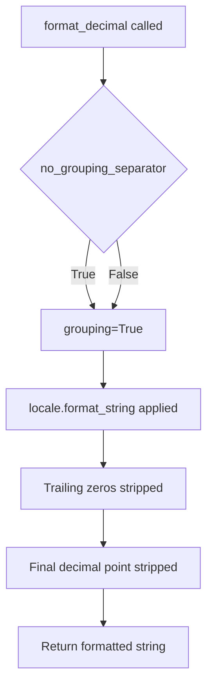
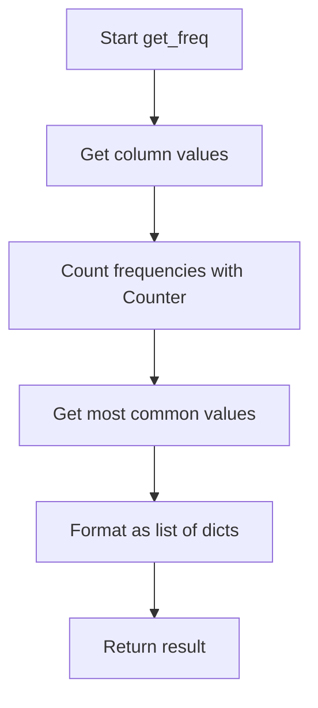

# `csvstat.py`

## `csvkit.utilities.csvstat.CSVStat` · *class*

## Summary
A command-line utility class for computing and displaying descriptive statistics for CSV file columns.

## Description
CSVStat is a command-line utility that analyzes CSV files and computes various descriptive statistics for each column. It supports multiple output formats (plain text, CSV, JSON) and allows users to select specific statistics to display. The utility integrates with the agate library for robust data processing and handles various CSV parsing options including dialect detection and type inference.

## State
- Inherits all state from `CSVKitUtility` base class including:
  - `argparser`: Argument parser for command-line options
  - `input_file`: Input file handle or stream
  - `output_file`: Output file handle or stream
  - `args`: Parsed command-line arguments
  - `reader_kwargs`: Keyword arguments for CSV reader configuration
- `description`: Class attribute describing the utility's purpose as "Print descriptive statistics for each column in a CSV file."

## Lifecycle
- Creation: Instantiated automatically by the CSVKit framework when invoked via command line
- Usage: Called via the `main()` method which processes command-line arguments and performs statistical analysis
- Destruction: Managed by the parent CSVKitUtility class lifecycle

## Method Map
```mermaid
flowchart TD
    A[main()] --> B{names_only?}
    B -- Yes --> C[print_column_names()]
    B -- No --> D{additional_input_expected?}
    D -- Yes --> E[argparser.error()]
    D -- No --> F{operations specified?}
    F -- Yes --> G{single column?}
    G -- Yes --> H[print_one()]
    G -- No --> I[print_one() loop]
    F -- No --> J[calculate_stats()]
    J --> K{output format?}
    K -- CSV --> L[print_csv()]
    K -- JSON --> M[print_json()]
    K -- Plain Text --> N[print_stats()]
```

## Raises
- `SystemExit`: Raised by `argparser.error()` when invalid command-line arguments are provided
- Various exceptions from underlying CSV processing and agate operations when malformed data is encountered

## Example
```python
# Typical usage from command line:
# csvstat data.csv
# csvstat --mean --columns 1,2 data.csv
# csvstat --json --type data.csv
```

### `csvkit.utilities.csvstat.CSVStat.add_arguments` · *method*

## Summary:
Configures command-line argument parser with options for CSV statistical analysis and output formatting.

## Description:
This method initializes the argument parser with various command-line options that control how CSV statistical data is analyzed and displayed. It defines flags and parameters for specifying output formats (CSV, JSON), selecting specific columns for analysis, choosing which statistics to compute, and configuring formatting options for numeric values.

The method is called during the initialization phase of the CSVStat utility to set up all available command-line interface options before parsing user input. It enables users to customize their CSV statistical analysis by controlling what data is processed, what statistics are computed, and how results are formatted.

## Args:
    self: The CSVStat instance whose argparser attribute is being configured

## Returns:
    None: This method modifies the instance's argparser in-place and returns nothing

## Raises:
    None explicitly raised: This method only configures arguments and doesn't raise exceptions

## State Changes:
    Attributes READ: self.argparser (used to add arguments)
    Attributes WRITTEN: self.argparser (modified in-place with new arguments)

## Constraints:
    Preconditions: The CSVStat instance must have an argparser attribute initialized
    Postconditions: The argparser attribute will contain all defined command-line arguments

## Side Effects:
    None: This method only modifies the internal argument parser configuration and has no external I/O or side effects

### `csvkit.utilities.csvstat.CSVStat.is_finite_decimal` · *method*

## Summary:
Checks if a value is a finite Decimal instance.

## Description:
Determines whether the provided value is both an instance of the Decimal class and represents a finite numeric value (not positive/negative infinity or NaN). This method is used to safely process decimal values in statistical calculations where infinite or undefined values should be excluded from formatting or display.

## Args:
    value: Any Python object to be checked for being a finite Decimal

## Returns:
    bool: True if value is a Decimal instance and is finite (not inf or nan), False otherwise

## Raises:
    None

## State Changes:
    None

## Constraints:
    Preconditions: The value parameter can be any Python object
    Postconditions: Returns a boolean indicating both type and finiteness of the value

## Side Effects:
    None

### `csvkit.utilities.csvstat.CSVStat._calculate_stat` · *method*

## Summary:
Calculates a statistical measure for a specified column in a data table, supporting both custom getter functions and standard aggregation operations.

## Description:
This method serves as the core calculation engine for statistical operations in CSV statistics utilities. It attempts to execute a custom getter function for a specific operation (like get_count, get_mean, etc.) first. If no such function exists, it falls back to performing a standard aggregation operation on the specified column. The result is properly formatted according to the application's decimal formatting settings when applicable.

The method is called during the statistical analysis phase of CSV processing, typically when generating detailed column statistics or when executing specific statistical operations via command-line flags.

## Args:
    table: An agate Table object containing the data to analyze
    column_id: Identifier for the column (index or name) to analyze
    op_name (str): Name of the operation to perform (e.g., 'count', 'mean', 'sum')
    op_data (dict): Dictionary containing operation metadata including 'aggregation' key
    **kwargs: Additional keyword arguments passed through to getter functions

## Returns:
    The calculated statistic value, potentially formatted as a string for display purposes, or None if calculation fails

## Raises:
    None explicitly raised - exceptions are caught and silently ignored

## State Changes:
    Attributes READ: 
    - self.args.json_output
    - self.args.decimal_format  
    - self.args.no_grouping_separator
    Attributes WRITTEN: None

## Constraints:
    Preconditions:
    - table must be a valid agate Table instance
    - column_id must reference a valid column in the table
    - op_name must be a valid operation identifier
    - op_data must contain an 'aggregation' key when no custom getter exists
    
    Postconditions:
    - Returns a calculated statistical value or None on failure
    - Decimal values are formatted according to application settings when appropriate
    - Agate warnings are suppressed during calculation

## Side Effects:
    - Suppresses agate.NullCalculationWarning during execution
    - May perform locale-aware decimal formatting of numeric results
    - Reads from command-line arguments for formatting configuration

### `csvkit.utilities.csvstat.CSVStat.print_one` · *method*

## Summary:
Formats and outputs statistical information for a specific column in a CSV table, with optional labeling and special handling for frequency distributions.

## Description:
This method generates and displays statistical information for a single column in a data table. It retrieves the column name from the table's column names, calculates the requested statistic using the internal calculation engine (_calculate_stat), applies special formatting for frequency distributions, and writes the formatted output to the designated output file.

When the operation is 'freq', the method transforms the result into a dictionary-like string format: '{ "value": count, ... }'. For other operations, it outputs either a labeled format ('NNN. column_name: value') or unlabeled format ('value'), depending on the label parameter.

This method is part of the CSV statistics utility and is typically called during the statistical analysis phase when displaying individual column statistics.

## Args:
    table: An agate Table object containing the data to analyze
    column_id (int): Index of the column to analyze within the table
    op_name (str): Name of the statistical operation to perform (e.g., 'count', 'mean', 'freq')
    label (bool): Whether to include column index and name in the output format. Defaults to True
    **kwargs: Additional keyword arguments passed through to the calculation engine

## Returns:
    None

## Raises:
    None explicitly raised - the underlying calculation and I/O operations may raise exceptions that propagate upward

## State Changes:
    Attributes READ: 
    - self.output_file
    Attributes WRITTEN: 
    - self.output_file (writes formatted output)

## Constraints:
    Preconditions:
    - table must be a valid agate Table instance
    - column_id must reference a valid column in the table (0-based indexing)
    - op_name must be a valid operation identifier that can be resolved in the OPERATIONS mapping
    - OPERATIONS dictionary must contain the op_name key with appropriate operation data structure
    - self.output_file must be a writable file-like object
    
    Postconditions:
    - Output is written to self.output_file in a formatted string
    - For 'freq' operations, output uses a dictionary-like format: '{ "value": count, ... }'
    - For other operations, output uses either labeled format: 'NNN. column_name: value' (where NNN is 1-based column index) or unlabeled format: 'value'
    - The column_id parameter is treated as 0-based internally but displayed as 1-based in labeled output

## Side Effects:
    - Writes formatted text to self.output_file
    - Performs string formatting operations
    - May perform I/O operations to write to the output file

### `csvkit.utilities.csvstat.CSVStat.calculate_stats` · *method*

## Summary:
Calculates all descriptive statistics for a specified column in a CSV table.

## Description:
This method computes a comprehensive set of statistical measures for a given column by iterating through all operations defined in the global `OPERATIONS` dictionary and invoking the internal `_calculate_stat` method for each operation. It provides a complete statistical profile for a single column in one operation call.

The method is typically called during bulk statistical analysis of CSV data, where all available statistics for each column need to be computed simultaneously.

## Args:
    table (agate.Table): The table containing the data to analyze
    column_id (int): The index of the column to calculate statistics for
    **kwargs: Additional keyword arguments passed through to individual statistic calculations

## Returns:
    dict: A dictionary mapping operation names (keys from OPERATIONS) to their calculated values for the specified column. The structure of the returned dictionary matches the OPERATIONS schema.

## Raises:
    None explicitly raised - exceptions from individual statistic calculations are caught and handled internally by `_calculate_stat`

## State Changes:
    Attributes READ: None
    Attributes WRITTEN: None

## Constraints:
    Preconditions: 
    - The `table` parameter must be a valid agate.Table instance
    - The `column_id` must be a valid index within the table's columns
    - The global `OPERATIONS` variable must be defined and contain operation definitions with appropriate structure for standard operations
    
    Postconditions:
    - Returns a dictionary with keys matching operation names from OPERATIONS
    - Values are the computed statistics for the specified column
    - The returned dictionary structure matches the OPERATIONS schema

## Side Effects:
    None

### `csvkit.utilities.csvstat.CSVStat.print_stats` · *method*

*No documentation generated.*

### `csvkit.utilities.csvstat.CSVStat.print_csv` · *method*

## Summary:
Writes statistical analysis results for CSV columns to output file in CSV format.

## Description:
This method formats and writes column statistics to the output file in CSV format using agate's DictWriter. It takes pre-computed statistics and transforms them into a tabular CSV structure with columns for identifying information (column ID and name) plus statistical measures. The method leverages the `_rows` helper method to generate properly formatted data rows and handles special formatting for frequency data.

This method is called during the CSV output phase of the CSVStat utility when the user specifies the `--csv` flag. It provides a structured, machine-readable output format for statistical analysis results, producing a CSV table where each row represents a column from the input CSV and contains its statistical measures.

The method first writes a CSV header row containing 'column_id', 'column_name', and all statistical operation names from the OPERATIONS constant. Then it iterates through the data rows generated by `_rows`, applying special formatting to frequency data by converting it from a list of dictionaries to a comma-separated string representation.

## Args:
    table: An agate Table object containing the CSV data being analyzed
    column_ids: Iterable of column identifiers (integers) specifying which columns to process
    stats: Dictionary mapping column IDs to their computed statistics dictionaries

## Returns:
    None

## Raises:
    None explicitly raised - depends on underlying agate.csv.DictWriter behavior

## State Changes:
    Attributes READ: self.output_file
    Attributes WRITTEN: None

## Constraints:
    Preconditions:
    - table must be a valid agate Table instance
    - column_ids must contain valid column indices for the table
    - stats must be a dictionary mapping column IDs to their respective statistics dictionaries
    - OPERATIONS constant must be defined in the module scope and contain statistical operation definitions such as 'count', 'nulls', 'unique', 'min', 'max', 'sum', 'mean', 'median', 'stdev', 'len', 'maxprecision', 'freq'
    - self.output_file must be a valid file-like object supporting write operations

    Postconditions:
    - CSV header row is written with column_id, column_name, and statistical operation names from OPERATIONS
    - Data rows containing column statistics are written to self.output_file
    - Frequency data is formatted as comma-separated string values (e.g., "value1 (count1), value2 (count2)")

## Side Effects:
    I/O: Writes formatted CSV data to self.output_file
    External service calls: None
    Mutations to objects outside self: None

### `csvkit.utilities.csvstat.CSVStat.print_json` · *method*

*No documentation generated.*

### `csvkit.utilities.csvstat.CSVStat._rows` · *method*

## Summary:
Generates formatted output rows containing statistical data for specified CSV columns.

## Description:
This method is a generator that processes column statistics and yields formatted dictionaries suitable for CSV or JSON output. It iterates through specified column IDs, retrieves column names and their associated statistics, and constructs output rows containing column identification information along with available statistical measures.

The method serves as a common data transformation layer in the CSVStat utility, providing a standardized format for statistical data that can be consumed by both CSV and JSON output methods. It ensures consistent data structure regardless of which statistical operations were computed, filtering out null values and maintaining proper column identification.

## Args:
    table: An agate Table object containing the CSV data being analyzed
    column_ids: Iterable of column identifiers (integers) specifying which columns to process
    stats: Dictionary mapping column IDs to their computed statistics dictionaries

## Returns:
    Generator yielding dictionaries with the following structure:
    - 'column_id': Integer representing the column index + 1 (1-based indexing)
    - 'column_name': String containing the column's name
    - For each statistical operation defined in OPERATIONS: The computed statistic value or None (when not applicable)

## Raises:
    None explicitly raised - the method handles missing statistics gracefully by filtering them out

## State Changes:
    Attributes READ: None
    Attributes WRITTEN: None

## Constraints:
    Preconditions:
    - table must be a valid agate Table instance
    - column_ids must contain valid column indices for the table
    - stats must be a dictionary mapping column IDs to their respective statistics dictionaries
    - OPERATIONS constant must be defined in the module scope and contain statistical operation definitions

    Postconditions:
    - Each yielded dictionary contains 'column_id' and 'column_name' keys
    - Only statistical operations with non-None values are included in the output
    - Output rows are suitable for CSV DictWriter or JSON serialization
    - The generator produces dictionaries compatible with the expected CSV/JSON output format

## Side Effects:
    None - this method is pure and doesn't perform I/O or modify external state

## `csvkit.utilities.csvstat.format_decimal` · *function*

## Summary:
Formats a decimal number using locale-aware formatting with customizable precision and grouping options.

## Description:
This utility function applies locale-specific formatting to decimal numbers, allowing for customizable precision and optional grouping separators. It's designed to provide consistent, localized numeric formatting for display purposes in CSV statistics utilities.

## Args:
    d (float or Decimal): The decimal number to format
    f (str, optional): Format string specifying precision. Defaults to '%.3f' (3 decimal places)
    no_grouping_separator (bool): If True, disables thousands grouping separators. Defaults to False

## Returns:
    str: Formatted string representation of the decimal number with trailing zeros removed

## Raises:
    None explicitly raised - relies on locale.format_string behavior

## Constraints:
    Preconditions:
    - Input 'd' must be a numeric type (float or Decimal)
    - Format string 'f' must be a valid Python format string
    - 'no_grouping_separator' must be a boolean value
    
    Postconditions:
    - Returns a string representation of the number
    - Trailing zeros after decimal point are stripped
    - Trailing decimal point is stripped if no fractional part remains
    - Result is locale-aware formatted string

## Side Effects:
    None - Pure function with no external state mutation or I/O operations

## Control Flow:


## Examples:
    >>> format_decimal(1234.5678)
    '1,234.568'
    
    >>> format_decimal(1234.5678, f='%.2f')
    '1,234.57'
    
    >>> format_decimal(1234.5678, no_grouping_separator=True)
    '1234.568'
    
    >>> format_decimal(1234.000)
    '1,234'
    
    >>> format_decimal(-1234.5678)
    '-1,234.568'
    
    >>> format_decimal(0.000)
    '0'
```

## `csvkit.utilities.csvstat.get_type` · *function*

## Summary:
Returns the class name of the data type for a specified column in an agate table.

## Description:
Extracts and returns the class name of the data type associated with a specific column in an agate table. This function is used to determine the underlying data type classification (such as Text, Number, Boolean, etc.) for a given column in a CSV dataset processed by csvkit.

The function is typically called during CSV statistics generation to provide type information for each column in the dataset. It's part of the csvstat utility which analyzes CSV files and reports metadata about their structure and content.

## Args:
    table (agate.Table): An agate Table object containing the CSV data.
    column_id (int): Zero-based index of the column whose data type is to be retrieved.
    **kwargs: Additional keyword arguments (currently unused in the implementation).

## Returns:
    str: The class name of the data type for the specified column (e.g., 'Text', 'Number', 'Boolean', 'Date', 'DateTime').

## Raises:
    IndexError: When column_id is outside the valid range of columns in the table.
    AttributeError: When the column or data_type attribute doesn't exist on the table structure.

## Constraints:
    Preconditions:
        - table must be a valid agate.Table instance
        - column_id must be a valid zero-based index for the table's columns
        - table.columns must be accessible and contain column objects with data_type attributes
    
    Postconditions:
        - Returns a string representing the class name of the column's data type
        - The returned string corresponds to the class name of the data_type attribute
        - The returned string is always a valid Python class name derived from agate's type system

## Side Effects:
    None

## Control Flow:
```mermaid
flowchart TD
    A[get_type(table, column_id, **kwargs)] --> B{Valid column_id?}
    B -- No --> C[Raise IndexError]
    B -- Yes --> D[Access table.columns[column_id]]
    D --> E{Column exists?}
    E -- No --> F[Raise AttributeError]
    E -- Yes --> G[Access data_type]
    G --> H{data_type exists?}
    H -- No --> I[Raise AttributeError]
    H -- Yes --> J[Get class name]
    J --> K[Return class name string]
```

## `csvkit.utilities.csvstat.get_unique` · *function*

## Summary:
Returns the count of distinct values in a specified column of a table.

## Description:
This utility function calculates the number of unique values present in a given column of a data table. It leverages the agate library's column methods to efficiently compute distinct values and returns their count. This function is typically used in CSV statistical analysis tools to provide insights into data uniqueness.

## Args:
    table: An agate Table object containing the data
    column_id: Identifier for the column (index or name) to analyze
    **kwargs: Additional keyword arguments (currently unused)

## Returns:
    int: The count of distinct values in the specified column

## Raises:
    KeyError: If column_id does not exist in the table
    IndexError: If column_id is out of bounds for the table columns
    AttributeError: If table does not have a columns attribute or if values_distinct() method is not available

## Constraints:
    Preconditions:
        - table must be a valid agate Table instance
        - column_id must reference a valid column in the table
    Postconditions:
        - Returns a non-negative integer representing unique value count
        - Does not modify the original table or column data

## Side Effects:
    None: This function performs no I/O operations or external state mutations

## Control Flow:
```mermaid
flowchart TD
    A[get_unique called] --> B{Valid table/column?}
    B -- No --> C[Raises exception]
    B -- Yes --> D[Access table.columns[column_id]]
    D --> E[Call values_distinct()]
    E --> F[Calculate len()]
    F --> G[Return count]
```

## Examples:
    # Basic usage
    unique_count = get_unique(my_table, 'age')
    
    # With column index
    unique_count = get_unique(my_table, 2)
    
    # In context of CSV statistics
    # This function would typically be called by csvstat utility
    # to compute unique value counts for each column

## `csvkit.utilities.csvstat.get_freq` · *function*

## Summary:
Extracts and returns the most frequently occurring values from a specified column in a table.

## Description:
This function computes the frequency distribution of values in a given column of a table and returns the top N most common values. It's designed to provide quick statistical insights into the data distribution within a specific column.

## Args:
    table: An agate table object containing the data
    column_id: Identifier for the column to analyze (can be column index or name)
    freq_count (int): Maximum number of top frequent values to return. Defaults to 5.
    **kwargs: Additional keyword arguments (currently unused)

## Returns:
    list[dict]: A list of dictionaries, each containing 'value' and 'count' keys representing the most frequent values and their occurrence counts, sorted by frequency in descending order.

## Raises:
    None explicitly raised in the function body

## Constraints:
    Preconditions:
    - The table parameter must be a valid agate table object
    - The column_id must reference a valid column in the table
    - The freq_count parameter should be a non-negative integer
    
    Postconditions:
    - Returns a list of dictionaries with consistent structure ('value', 'count')
    - The returned list is ordered by frequency (highest first)
    - The length of the returned list is at most freq_count elements

## Side Effects:
    None

## Control Flow:


## Examples:
    # Basic usage
    freq_data = get_freq(my_table, 'age_column', freq_count=3)
    # Returns [{'value': 25, 'count': 15}, {'value': 30, 'count': 12}, {'value': 22, 'count': 8}]
    
    # Using default frequency count
    freq_data = get_freq(my_table, 'category_column')
    # Returns top 5 most frequent values from category_column
```

## `csvkit.utilities.csvstat.launch_new_instance` · *function*

## Summary
Creates and executes a new CSVStat utility instance to compute and display descriptive statistics for CSV file columns.

## Description
This function serves as the entry point for launching the CSVStat command-line utility. It instantiates a CSVStat object and invokes its run() method to process command-line arguments and execute the CSV statistical analysis functionality. The function follows the standard csvkit pattern where command-line utilities are instantiated and executed through a dedicated launch function.

This logic is extracted into its own function rather than being inlined in the main module to enable:
- Consistent instantiation pattern across different invocation contexts
- Testability of the utility creation and execution flow
- Separation of concerns between utility creation and execution
- Support for alternative launch mechanisms (like in unit tests or other entry points)

## Args
None

## Returns
None

## Raises
SystemExit: Raised by CSVStat.run() when argument validation fails or when the utility encounters fatal errors during execution
Various exceptions from file I/O operations handled by the parent CSVKitUtility class
UnicodeDecodeError: Potentially raised during CSV reading if encoding issues occur (handled by parent class)

## Constraints
Preconditions:
- Command-line arguments must be available via sys.argv for parsing
- Standard input/output streams must be accessible
- Required CSV processing dependencies must be available
- Input files (if specified) must be readable

Postconditions:
- A CSVStat utility instance is created and executed
- Descriptive statistics are computed for each column in the CSV file
- Statistics output is written to stdout or specified output file
- All temporary resources are properly cleaned up

## Side Effects
- Reads from standard input or specified input files (via CSVKitUtility's input_file handling)
- Writes statistical output to standard output or specified output file (via CSVKitUtility's output_file handling)
- Processes command-line arguments from sys.argv through CSVKitUtility's argument parser
- May display usage information or error messages to stderr

## Control Flow
```mermaid
flowchart TD
    A[launch_new_instance()] --> B[Create CSVStat() instance]
    B --> C[Call utility.run()]
    C --> D{Input file handling}
    D -->|File specified| E[Open input file]
    D -->|No file| F[Use stdin]
    E --> G[Parse command-line arguments]
    F --> G
    G --> H{Validation checks}
    H -->|Invalid args| I[Display error and exit]
    H -->|Valid args| J[Process CSV data]
    J --> K[Compute descriptive statistics for each column]
    K --> L[Format and output statistics]
    L --> M[Cleanup and exit]
```

## Examples
```bash
# Compute basic statistics for all columns in a CSV file
csvstat data.csv

# Compute statistics for specific columns
csvstat --columns 1,2,3 data.csv

# Compute specific statistics types
csvstat --mean --median --mode data.csv

# Output in JSON format
csvstat --json data.csv

# Output with custom decimal precision
csvstat --precision 2 data.csv
```

