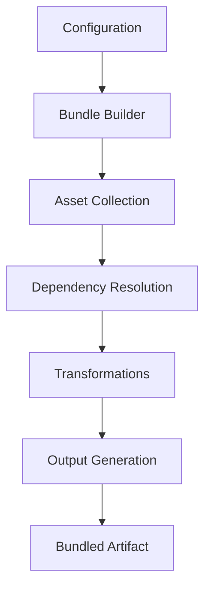

# `exodus-bundler`

## Repository Overview

### Tree Structure
```
exodus-bundler/
└── src/
    └── exodus_bundler/
```

### Purpose
The Exodus Bundler is a core asset packaging system designed to assemble application resources into optimized, deployable bundles. It provides a robust framework for collecting, processing, and packaging application assets for efficient delivery and deployment.

**Target Users:**
- Software developers building applications requiring asset bundling
- DevOps engineers managing build and deployment pipelines
- Platform architects designing packaging solutions

**Use Cases:**
- Creating optimized application bundles for production deployment
- Managing complex dependency graphs and module imports
- Packaging static assets and resources for web applications

### Architecture
The bundler implements a modular architecture with distinct components responsible for different aspects of the bundling process:



Key architectural patterns:
- **Modular Design**: Each responsibility is separated into dedicated components
- **Pipeline Processing**: Assets flow through a defined sequence of processing steps
- **Configuration-Driven**: Behavior controlled through structured configuration objects

### Entry Points

#### Python API
- **Module**: `exodus_bundler`
- **Main Functions**:
  - `build_bundle(config)`: Initiates the bundling process with provided configuration
  - `validate_config(config)`: Validates configuration parameters before processing
  - `get_bundle_stats()`: Returns statistics about the built bundle

#### CLI Interface
- **Command**: `exodus-bundle build` (likely available)
- **Purpose**: Command-line interface for initiating bundling operations
- **Audience**: Developers and automated build systems

### Core Features
The bundler provides fundamental capabilities for application packaging:

1. **Asset Collection** - Gathering source files and resources
2. **Dependency Management** - Resolving module dependencies and import statements  
3. **Transformation Processing** - Applying transformations to assets during bundling
4. **Bundle Generation** - Creating optimized output packages
5. **Statistics Reporting** - Providing metrics about bundle composition

### Dependencies
The bundler relies on standard Python libraries and internal components:

#### Internal Dependencies
- **config_manager**: Configuration handling and validation
- **logger**: Bundling operation logging and debugging

#### External Dependencies
- **pathlib**: File system path operations
- **json**: Configuration file parsing

### Extension Points
The modular design allows for extension through:
- Custom transformer implementations
- Extended asset collection strategies
- Alternative output formats

---

## Modules

- [`src`](src.md)

