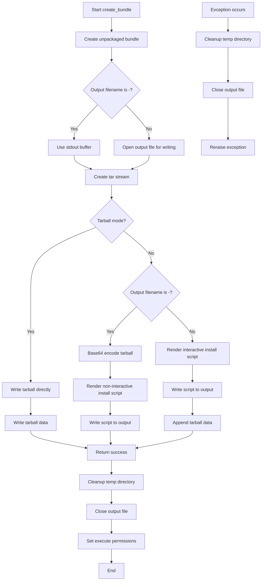
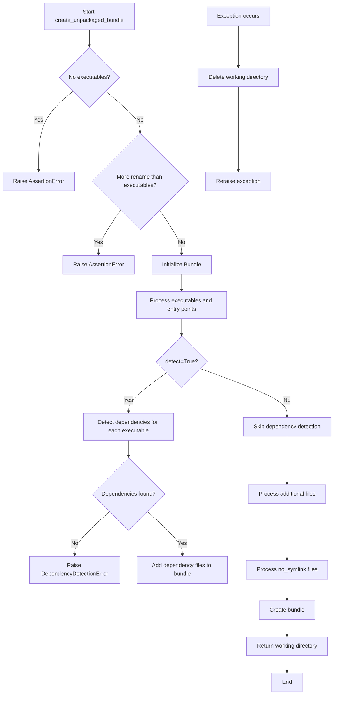
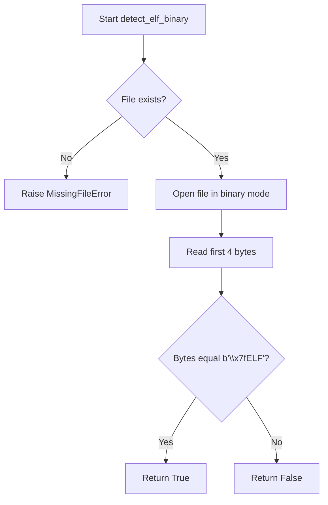
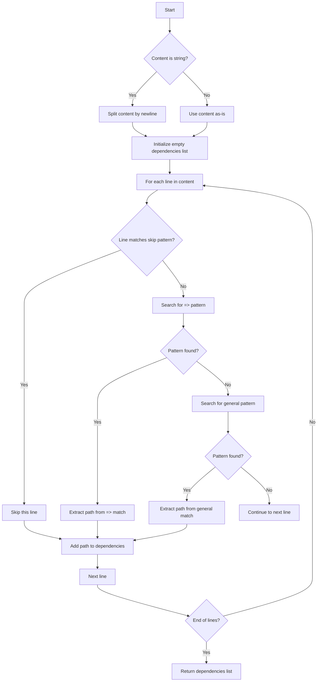
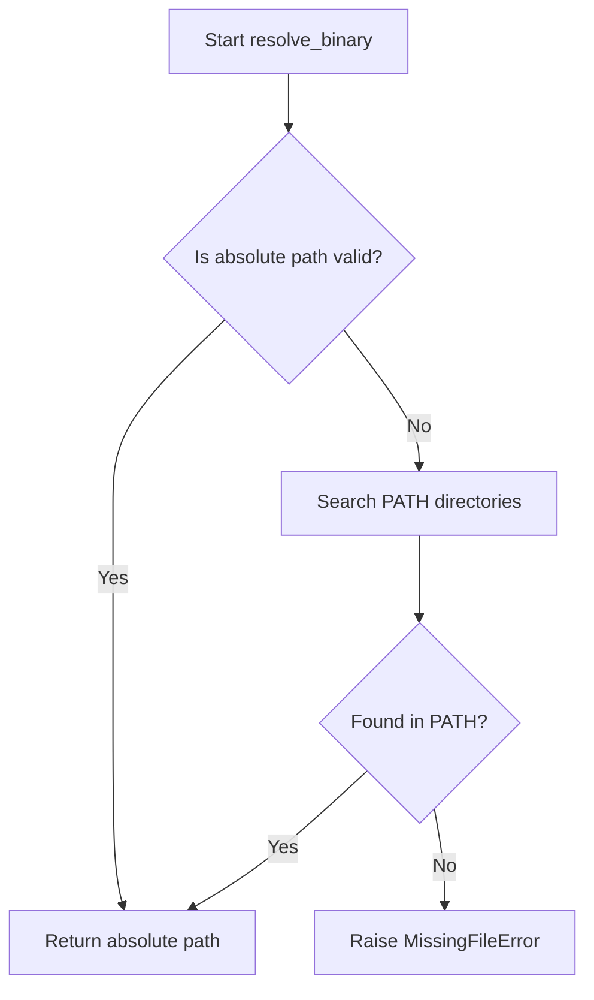
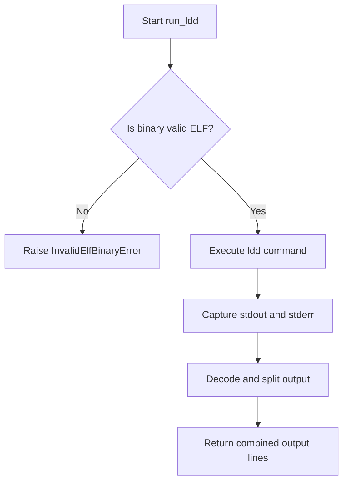
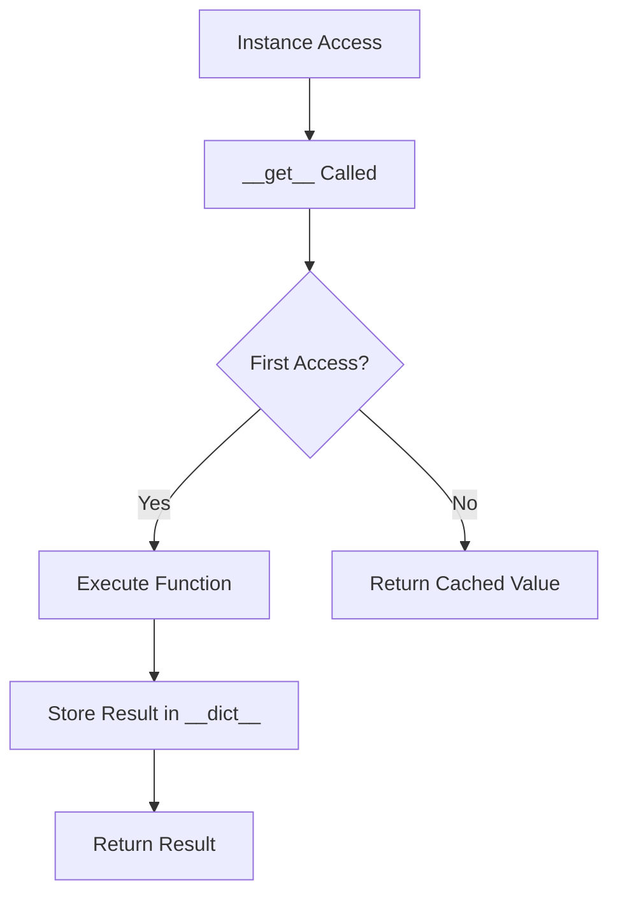
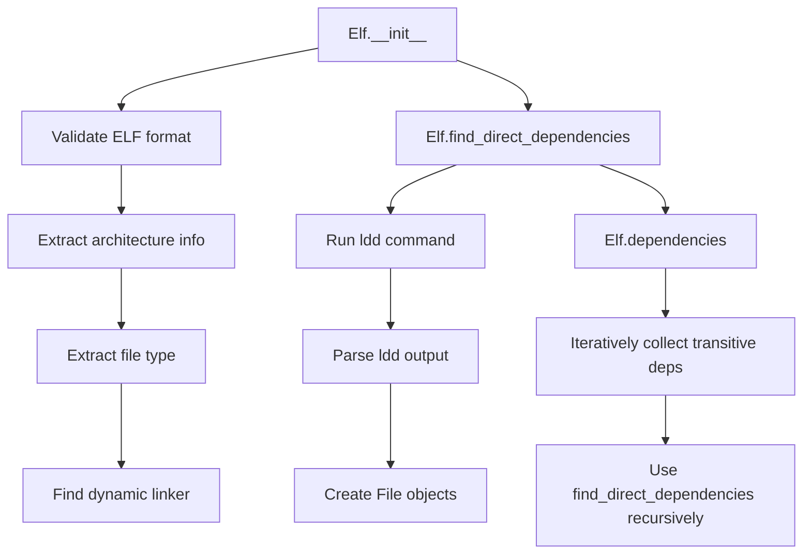
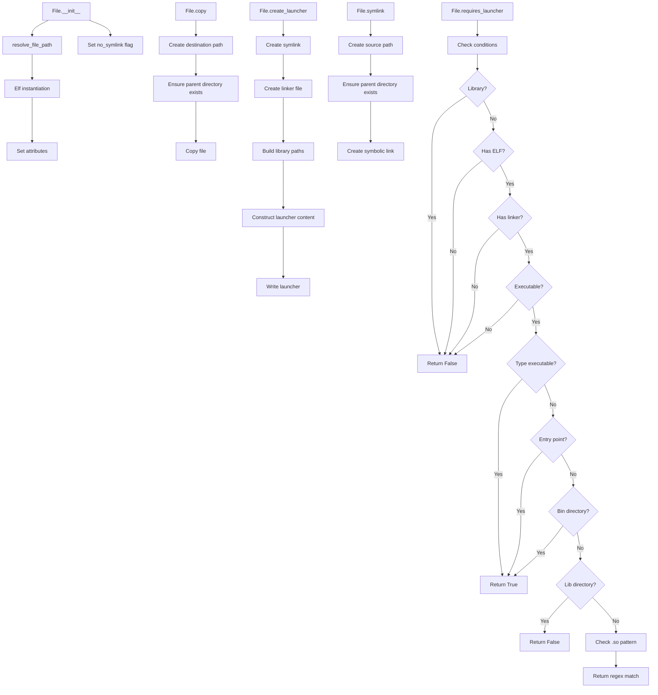

# `bundling.py`

## `src.exodus_bundler.bundling.bytes_to_int` · *function*

## Summary:
Converts a sequence of bytes into an integer value using specified byte order.

## Description:
This function transforms a bytes object into its corresponding integer representation by interpreting the bytes according to the specified endianness. It is commonly used when working with binary data formats where byte sequences need to be converted to numeric values for processing.

## Args:
    bytes (bytes): A sequence of bytes to convert to an integer
    byteorder (str): Byte order specification, either 'big' or 'little'. Defaults to 'big'

## Returns:
    int: The integer value represented by the input bytes sequence

## Raises:
    KeyError: When byteorder is not 'big' or 'little'
    struct.error: When struct.unpack fails due to incompatible data size or format
    TypeError: When bytes is not a bytes object
    IndexError: When accessing bytes with invalid indices

## Constraints:
    Preconditions:
        - bytes must be a valid bytes object
        - byteorder must be either 'big' or 'little'
    Postconditions:
        - Returns an integer value representing the byte sequence
        - The conversion respects the specified byte order
        - Empty bytes input returns 0

## Side Effects:
    None

## Control Flow:
```mermaid
flowchart TD
    A[bytes_to_int called] --> B{byteorder}
    B -->|big| C[Set endian='>']
    B -->|little| D[Set endian='<']
    C --> E[struct.unpack(endian + ('B' * len(bytes)), bytes)]
    D --> E
    E --> F{byteorder}
    F -->|big| G[chars = chars[::-1]]
    F -->|little| H[Skip reversal]
    G --> I[Calculate sum]
    H --> I
    I --> J[Return integer]
```

## Examples:
    >>> bytes_to_int(b'\x01\x02\x03', 'big')
    66051
    >>> bytes_to_int(b'\x01\x02\x03', 'little')
    197121
    >>> bytes_to_int(b'\xff\xff', 'big')
    65535
    >>> bytes_to_int(b'', 'big')
    0

## `src.exodus_bundler.bundling.create_bundle` · *function*

## Summary:
Creates a portable application bundle containing executables and their dependencies, either as an executable shell script or a compressed tarball.

## Description:
This function orchestrates the creation of a distributable application bundle by first preparing the bundle contents using `create_unpackaged_bundle`, then packaging them into either an executable shell script installer or a compressed tarball format. The resulting bundle can be distributed and executed on systems without the original dependencies installed.

The function supports both interactive and non-interactive installation modes, handles proper file permissions, and ensures clean resource cleanup even when errors occur. It provides flexibility in bundle output format through the `tarball` parameter and supports various customization options for the bundled content.

## Args:
    executables (list[str]): List of absolute or relative paths to executable files to include in the bundle.
    output (str): Template string for the output filename, or '-' for stdout. Supports {{executables}} and {{extension}} placeholders.
    tarball (bool): If True, creates a .tgz tarball instead of an executable shell script. Defaults to False.
    rename (list[str]): List of names to rename executables to. Must be equal to or shorter than the executables list. Defaults to [].
    chroot (str): Path to a chroot environment to use for file resolution. Defaults to None.
    add (list[str]): Additional file paths to include in the bundle beyond the executables. Defaults to [].
    no_symlink (list[str]): List of file paths that should not be symlinked in the bundle. Defaults to [].
    shell_launchers (bool): Whether to create shell-based launchers instead of binary launchers. Defaults to False.
    detect (bool): Whether to automatically detect and include dependencies for executables. Defaults to False.

## Returns:
    bool: True if bundle creation succeeds. The function does not return False explicitly, but raises exceptions on failure.

## Raises:
    Exception: Any exception that occurs during bundle creation, which results in cleanup of temporary resources.

## Constraints:
    Preconditions:
        - At least one executable must be specified in the executables list.
        - The number of rename entries must not exceed the number of executables.
        - All specified file paths must exist and be valid files (not directories).
        - The output parameter must be a valid template string.
    Postconditions:
        - The output file is created with appropriate content and permissions.
        - Temporary resources are cleaned up upon successful completion or exception.

## Side Effects:
    - Creates a temporary directory with a unique prefix 'exodus-bundle-'.
    - Modifies the filesystem by creating the output file at the specified location.
    - Sets execute permissions on the output file when not using tarball format.
    - May write to stdout when output is '-'.

## Control Flow:


## Examples:
    >>> # Create an executable bundle
    >>> create_bundle(['/usr/bin/python3'], 'myapp.sh')
    True
    
    >>> # Create a tarball bundle
    >>> create_bundle(['/usr/bin/python3'], 'myapp.tgz', tarball=True)
    True
    
    >>> # Create bundle with dependency detection
    >>> create_bundle(['/usr/bin/python3'], 'myapp.sh', detect=True)
    True
    
    >>> # Create bundle with custom naming and additional files
    >>> create_bundle(
    ...     ['/usr/bin/python3'],
    ...     'myapp.sh',
    ...     rename=['my_python'],
    ...     add=['/etc/passwd']
    ... )
    True

## `src.exodus_bundler.bundling.create_unpackaged_bundle` · *function*

## Summary:
Creates an unpackaged bundle containing specified executables and their dependencies, optionally with automatic dependency detection and custom file handling.

## Description:
This function orchestrates the creation of a portable application bundle by managing file inclusion, dependency resolution, and bundle construction. It handles both explicit file additions and automatic dependency detection, supporting various customization options like renaming executables, excluding symlinks, and creating shell launchers.

The function creates a temporary working directory, adds specified executables and their dependencies (when enabled), processes additional files, configures symlink behavior, and finally constructs the bundle. It ensures proper cleanup of temporary resources even when errors occur.

## Args:
    executables (list[str]): List of absolute or relative paths to executable files to include in the bundle.
    rename (list[str], optional): List of names to rename executables to. Must be equal to or shorter than the executables list. Defaults to [].
    chroot (str, optional): Path to a chroot environment to use for file resolution. Defaults to None.
    add (list[str], optional): Additional file paths to include in the bundle beyond the executables. Defaults to [].
    no_symlink (list[str], optional): List of file paths that should not be symlinked in the bundle. Defaults to [].
    shell_launchers (bool): Whether to create shell-based launchers instead of binary launchers. Defaults to False.
    detect (bool): Whether to automatically detect and include dependencies for executables. Defaults to False.

## Returns:
    str: The absolute path to the temporary working directory containing the created bundle.

## Raises:
    AssertionError: When no executables are specified or when more rename entries are provided than executables.
    DependencyDetectionError: When automatic dependency detection fails for an executable (either because it's not tracked by a package manager or the OS isn't supported).
    Exception: Any other exception that occurs during bundle creation, which results in cleanup of the temporary working directory.

## Constraints:
    Preconditions:
        - At least one executable must be specified in the executables list.
        - The number of rename entries must not exceed the number of executables.
        - All specified file paths must exist and be valid files (not directories).
    Postconditions:
        - A temporary working directory is created and populated with the bundle contents.
        - The returned path points to a valid directory containing the bundle structure.
        - Temporary resources are cleaned up upon successful completion or exception.

## Side Effects:
    - Creates a temporary directory with a unique prefix 'exodus-bundle-'.
    - Modifies the filesystem by copying files and creating symbolic links in the temporary directory.
    - May copy additional dependency files when detect=True is specified.
    - Deletes the temporary working directory if an exception occurs during bundle creation.

## Control Flow:


## Examples:
    >>> # Basic usage with single executable
    >>> bundle_dir = create_unpackaged_bundle(['/usr/bin/python3'])
    >>> print(bundle_dir)
    '/tmp/exodus-bundle-abc123'
    
    >>> # Usage with renaming and dependency detection
    >>> bundle_dir = create_unpackaged_bundle(
    ...     ['/usr/bin/python3'],
    ...     rename=['my_python'],
    ...     detect=True
    ... )
    >>> print(bundle_dir)
    '/tmp/exodus-bundle-def456'
    
    >>> # Usage with additional files and shell launchers
    >>> bundle_dir = create_unpackaged_bundle(
    ...     ['/usr/bin/python3', '/usr/bin/bash'],
    ...     add=['/etc/passwd'],
    ...     shell_launchers=True
    ... )
    >>> print(bundle_dir)
    '/tmp/exodus-bundle-ghi789'

## `src.exodus_bundler.bundling.detect_elf_binary` · *function*

## Summary:
Determines whether a given file is an ELF (Executable and Linkable Format) binary by examining its magic number.

## Description:
This function performs a basic file type detection by checking the ELF magic number at the beginning of a file. ELF binaries begin with the byte sequence b'\x7fELF', which serves as a unique identifier for this file format commonly used in Unix-like operating systems.

## Args:
    filename (str): The absolute or relative path to the file to be checked.

## Returns:
    bool: True if the file is an ELF binary (starts with b'\x7fELF'), False otherwise.

## Raises:
    MissingFileError: When the specified file does not exist on the filesystem.

## Constraints:
    Preconditions:
        - The filename parameter must be a valid string representing a file path.
        - The file must be readable by the executing process.
    
    Postconditions:
        - The function will not modify the file or its contents.
        - The function will return a boolean value indicating ELF binary status.

## Side Effects:
    - Reads the first 4 bytes of the specified file from disk.
    - May raise MissingFileError if the file does not exist.

## Control Flow:


## Examples:
    # Check if a binary file is an ELF binary
    is_elf = detect_elf_binary('/usr/bin/python3')
    if is_elf:
        print("This is an ELF binary")
    else:
        print("This is not an ELF binary")
        
    # Handle missing file case
    try:
        is_elf = detect_elf_binary('/nonexistent/file')
    except MissingFileError as e:
        print(f"File error: {e}")
```

## `src.exodus_bundler.bundling.parse_dependencies_from_ldd_output` · *function*

## Summary:
Extracts absolute file paths of shared library dependencies from ldd command output.

## Description:
Parses the output of the ldd command to identify and extract the full paths of shared library dependencies. This function handles both string and list inputs containing ldd output lines, filtering out lines that report ldd itself as a dependency and extracting only the actual dependency paths.

## Args:
    content (str or list[str]): Either a string containing ldd output (with newlines) or a list of individual lines from ldd output.

## Returns:
    list[str]: A list of absolute file paths representing the shared library dependencies detected in the ldd output.

## Raises:
    None explicitly raised.

## Constraints:
    Preconditions:
    - Input content should contain valid ldd output format
    - Each line should contain a dependency path in one of these formats:
      - "=> /path/to/library (" 
      - "/path/to/library ("
    
    Postconditions:
    - Returns a list of strings representing absolute paths
    - Empty list returned if no dependencies found or input is empty

## Side Effects:
    None.

## Control Flow:


## Examples:
    Example 1: Parsing ldd output string
    ```python
    output = '''
    /lib64/ld-linux-x86-64.so.2 (0x...)
    libpthread.so.0 => /lib64/libpthread.so.0 (0x...)
    libc.so.6 => /lib64/libc.so.6 (0x...)
    '''
    deps = parse_dependencies_from_ldd_output(output)
    # Returns ['/lib64/libpthread.so.0', '/lib64/libc.so.6']
    ```

    Example 2: Parsing list of ldd lines
    ```python
    lines = [
        '/lib64/ld-linux-x86-64.so.2 (0x...)',
        'libpthread.so.0 => /lib64/libpthread.so.0 (0x...)',
        'libc.so.6 => /lib64/libc.so.6 (0x...)'
    ]
    deps = parse_dependencies_from_ldd_output(lines)
    # Returns ['/lib64/libpthread.so.0', '/lib64/libc.so.6']
    ```

    Example 3: Handling skip pattern for ldd self-reference
    ```python
    output = '''
    /lib64/ld-linux-x86-64.so.2 (0x...)
    /lib64/libc.so.6 => ldd (/lib64/libc.so.6)
    '''
    deps = parse_dependencies_from_ldd_output(output)
    # Returns [] - skips the ldd line because it matches the skip pattern
    ```

## `src.exodus_bundler.bundling.resolve_binary` · *function*

## Summary:
Resolves a binary path to its absolute location by checking the filesystem and PATH environment variable.

## Description:
Attempts to locate a binary file by first converting the input to an absolute path and checking if it exists. If not found, searches through directories in the PATH environment variable to find the binary. This function ensures that binaries can be located regardless of whether they are specified with full paths or just filenames.

## Args:
    binary (str): Path to a binary file, which can be either an absolute path or a filename to be searched in PATH.

## Returns:
    str: The absolute path to the resolved binary file.

## Raises:
    MissingFileError: When the specified binary cannot be found in the filesystem or in any directory listed in the PATH environment variable.

## Constraints:
    Preconditions:
        - The input parameter `binary` must be a string representing a valid file path or filename.
    Postconditions:
        - The returned path is always an absolute path.
        - The returned path points to an existing file.

## Side Effects:
    None

## Control Flow:


## Examples:
    >>> resolve_binary("python3")
    "/usr/bin/python3"
    
    >>> resolve_binary("/usr/local/bin/myapp")
    "/usr/local/bin/myapp"
    
    >>> resolve_binary("nonexistent")
    MissingFileError: The "nonexistent" binary could not be found in $PATH.
```

## `src.exodus_bundler.bundling.resolve_file_path` · *function*

## Summary:
Resolves a file path to its absolute normalized form while validating it exists as a file.

## Description:
Validates that a given file path refers to an existing file (not a directory) and returns its absolute normalized path. Optionally resolves binary names against the system PATH environment variable before validation.

## Args:
    path (str): The file path to resolve, which can be relative, absolute, or a binary name if search_environment_path is True.
    search_environment_path (bool): If True, treats the path as a binary name and searches for it in the PATH environment variable. Defaults to False.

## Returns:
    str: The absolute normalized path to the specified file.

## Raises:
    MissingFileError: When the specified file path does not correspond to an existing file.
    UnexpectedDirectoryError: When the specified path points to a directory rather than a file.

## Constraints:
    Preconditions:
        - The path argument must be a string representing a valid file path or binary name.
        - When search_environment_path is True, the binary name must be resolvable through the PATH environment variable.
    Postconditions:
        - The returned path is always an absolute path.
        - The returned path is normalized (removes redundant separators and resolves '.' and '..' components).

## Side Effects:
    None

## Control Flow:
```mermaid
flowchart TD
    A[Start resolve_file_path] --> B{search_environment_path=True?}
    B -- Yes --> C[Call resolve_binary(path)]
    B -- No --> D[path remains unchanged]
    C --> E{File exists?}
    D --> E
    E -- No --> F[Raise MissingFileError]
    E -- Yes --> G{Is directory?}
    G -- Yes --> H[Raise UnexpectedDirectoryError]
    G -- No --> I[Return normpath(abspath(path))]
```

## Examples:
    >>> resolve_file_path("./test.txt")
    "/current/working/directory/test.txt"
    
    >>> resolve_file_path("/usr/bin/python3", search_environment_path=True)
    "/usr/bin/python3"
    
    >>> resolve_file_path("nonexistent")
    MissingFileError: The "nonexistent" file was not found.
    
    >>> resolve_file_path("/tmp", search_environment_path=False)
    UnexpectedDirectoryError: "/tmp" is a directory, not a file.
```

## `src.exodus_bundler.bundling.run_ldd` · *function*

## Summary:
Executes the ldd command on a binary file to retrieve its shared library dependencies and error messages.

## Description:
This function validates that a given file is an ELF binary and then runs the system's ldd command to analyze the shared library dependencies of that binary. It captures both standard output and standard error from the ldd execution and returns them as a list of lines.

The function is designed to be a wrapper around the system's ldd utility, providing a standardized interface for dependency analysis while ensuring proper validation of the input binary.

## Args:
    ldd (str): Path to the ldd command executable (typically '/usr/bin/ldd' or similar)
    binary (str): Path to the binary file to analyze, which can be absolute or relative

## Returns:
    list[str]: A list containing lines from both stdout and stderr of the ldd command execution. This includes dependency information and any error messages.

## Raises:
    InvalidElfBinaryError: When the specified binary file is not a valid ELF binary file, as determined by the detect_elf_binary function.

## Constraints:
    Preconditions:
        - The `ldd` parameter must point to a valid executable file
        - The `binary` parameter must point to a valid file that exists on the filesystem
        - The `binary` file must be an ELF binary (as validated by detect_elf_binary)
    
    Postconditions:
        - The function does not modify the input binary or ldd files
        - The function returns a list of strings representing lines from ldd output

## Side Effects:
    - Executes an external system command (ldd)
    - May cause I/O operations when reading the binary file for validation
    - May raise exceptions if the binary is not found or is invalid

## Control Flow:


## Examples:
    # Basic usage to get dependencies of a binary
    try:
        deps = run_ldd('/usr/bin/ldd', '/usr/bin/python3')
        for line in deps:
            print(line)
    except InvalidElfBinaryError as e:
        print(f"Invalid binary: {e}")

    # Using with a relative path
    try:
        deps = run_ldd('ldd', './my_application')
        if deps:
            print("Dependencies found:")
            for dep in deps:
                if dep.strip():
                    print(f"  {dep.strip()}")
    except InvalidElfBinaryError as e:
        print(f"Binary validation failed: {e}")
```

## `src.exodus_bundler.bundling.stored_property` · *class*

## Summary:
A descriptor class that caches the result of a function call on the first access and returns the cached value on subsequent accesses.

## Description:
The `stored_property` class is a descriptor that transforms a method into a cached property. When accessed on an instance, it executes the wrapped function once and stores the result in the instance's dictionary under the function's name. Subsequent accesses return the cached value without re-executing the function. This is useful for expensive computations that should only be performed once per instance.

This class is typically used as a decorator to convert methods into properties that are computed once and then cached.

## State:
- `function`: The wrapped function whose result is cached
  - Type: callable
  - Valid values: Any callable object (typically a method)
  - Invariant: Must be set during initialization and remain immutable

## Lifecycle:
- Creation: Instantiated with a function as argument
- Usage: Accessed as a descriptor on an instance (typically via dot notation)
- Destruction: No explicit cleanup required; relies on Python's garbage collection

## Method Map:


## Raises:
- None explicitly raised by `__init__` or `__get__`
- The wrapped function may raise exceptions when executed, which propagate normally

## Example:
```python
class MyClass:
    @stored_property
    def expensive_computation(self):
        # This runs only once per instance
        return sum(range(1000000))

# Usage:
obj = MyClass()
result1 = obj.expensive_computation  # Computes and caches result
result2 = obj.expensive_computation  # Returns cached result
```

### `src.exodus_bundler.bundling.stored_property.__init__` · *method*

## Summary:
Initializes a stored_property descriptor with a function to be cached.

## Description:
Constructs a stored_property descriptor that will cache the result of executing the provided function on the first access. This method is called automatically when a stored_property descriptor is instantiated, typically through decorator syntax.

## Args:
    function: The callable function whose result should be cached
        - Type: callable
        - Allowed values: Any callable object (typically a method)
        - Default: None (required parameter)

## Returns:
    None

## Raises:
    None

## State Changes:
    Attributes READ: None
    Attributes WRITTEN: 
    - self.function: Stores the provided function for later execution
    - self.__doc__: Copies the docstring from the function to the descriptor instance

## Constraints:
    Preconditions:
    - The function parameter must be callable
    - The function should be suitable for use as a property getter (typically taking 'self' as first argument)
    
    Postconditions:
    - The function is stored in self.function
    - The docstring is copied to self.__doc__
    - The descriptor is ready for use in the descriptor protocol

## Side Effects:
    None

### `src.exodus_bundler.bundling.stored_property.__get__` · *method*

## Summary:
Computes and caches a property value on first access, returning the cached value on subsequent accesses.

## Description:
This method implements the descriptor protocol's `__get__` method for a `stored_property` descriptor. When accessed on an instance, it computes the property value by calling the associated function and caches the result in the instance's dictionary under the function's name. Subsequent accesses return the cached value instead of recomputing.

## Args:
    self: The stored_property descriptor instance
    instance: The object instance that owns the property, or None when accessed on the class
    type: The class that owns the property (used internally by Python's descriptor protocol)

## Returns:
    The computed property value, or the cached value if already computed

## Raises:
    None explicitly raised - any exceptions come from the underlying function call

## State Changes:
    Attributes READ: self.function, self.function.__name__
    Attributes WRITTEN: instance.__dict__[self.function.__name__]

## Constraints:
    Preconditions: 
    - instance must be an object with a __dict__ attribute
    - self.function must be callable and accept instance as argument
    - self.function.__name__ must be a valid dictionary key
    
    Postconditions:
    - The computed value is stored in instance.__dict__ under the function name
    - The same value is returned on subsequent accesses

## Side Effects:
    None - but may cause I/O or computation side effects through the underlying function call

## `src.exodus_bundler.bundling.Elf` · *class*

## Summary:
Represents an ELF (Executable and Linkable Format) binary file and provides functionality for analyzing its metadata and dependencies.

## Description:
The Elf class encapsulates an ELF binary file, validating its format and extracting key metadata such as architecture, endianness, and file type. It also identifies the dynamic linker used by the binary and provides methods for discovering both direct and transitive dependencies through the ldd command. This class is central to the bundling process, enabling the system to understand what files are required to run a binary in isolation.

## State:
- `path` (str): Absolute path to the ELF binary file
- `chroot` (str, optional): Root directory for resolving paths when operating in a chroot environment
- `file_factory` (callable): Factory function for creating File objects (defaults to File class)
- `bits` (int): Architecture bit width (32 or 64)
- `type` (str): ELF file type ('relocatable', 'executable', 'shared', or 'core')
- `linker_file` (File, optional): File object representing the dynamic linker used by this binary

## Lifecycle:
- Creation: Instantiate with `Elf(path, chroot=None, file_factory=None)` where path is the absolute path to an ELF binary
- Usage: Access properties like `direct_dependencies` and `dependencies` to analyze binary requirements
- Destruction: No special cleanup required; relies on Python's garbage collection

## Method Map:


## Raises:
- `MissingFileError`: When the specified file path does not exist
- `InvalidElfBinaryError`: When the file is not a valid ELF binary
- `UnsupportedArchitectureError`: When the binary is not 32 or 64-bit little-endian

## Example:
```python
# Create an Elf instance
elf = Elf('/usr/bin/python3')

# Find direct dependencies
direct_deps = elf.direct_dependencies

# Find all transitive dependencies
all_deps = elf.dependencies

# Access metadata
print(f"Architecture: {elf.bits} bits")
print(f"File type: {elf.type}")
print(f"Linker: {elf.linker_file.path if elf.linker_file else 'None'}")
```

### `src.exodus_bundler.bundling.Elf.__init__` · *method*

## Summary:
Initializes an ELF binary object by parsing its metadata and identifying the dynamic linker used by the binary.

## Description:
The constructor validates that the specified file is a valid ELF binary and extracts essential metadata including architecture (32/64 bit), endianness, and file type. It also scans the program headers to locate the dynamic linker (interpreter) required for executing the binary. This method is responsible for setting up the core attributes that define the ELF binary's characteristics and runtime requirements.

## Args:
    path (str): Absolute or relative path to the ELF binary file to be analyzed
    chroot (str, optional): Root directory for resolving paths when operating in a chroot environment. Defaults to None
    file_factory (callable, optional): Factory function for creating File objects. Defaults to File class

## Returns:
    None: This is a constructor method that initializes instance attributes

## Raises:
    MissingFileError: When the specified file path does not exist
    InvalidElfBinaryError: When the file is not a valid ELF binary (does not start with '\x7fELF')
    UnsupportedArchitectureError: When the binary is not 32 or 64-bit little-endian architecture

## State Changes:
    Attributes READ: None
    Attributes WRITTEN: 
        - self.path: Stores the absolute path to the ELF binary
        - self.chroot: Stores the chroot environment path
        - self.file_factory: Stores the factory function for creating File objects
        - self.bits: Stores the architecture bit width (32 or 64)
        - self.type: Stores the ELF file type ('relocatable', 'executable', 'shared', or 'core')
        - self.linker_file: Stores the File object representing the dynamic linker

## Constraints:
    Preconditions:
        - The path argument must point to an existing file
        - The file must be a valid ELF binary starting with '\x7fELF'
        - The binary must be either 32 or 64-bit little-endian architecture
    Postconditions:
        - All ELF metadata is parsed and stored in instance attributes
        - The dynamic linker file is identified and stored as a File object
        - If no linker is found, self.linker_file remains None

## Side Effects:
    None: This method performs no I/O operations or external service calls beyond reading the input file

### `src.exodus_bundler.bundling.Elf.__eq__` · *method*

## Summary:
Compares two Elf objects for equality based on their file paths.

## Description:
Implements the equality operator (`==`) for Elf objects. Two Elf instances are considered equal if they represent the same file path. This method is automatically invoked when using the `==` operator between two Elf objects, and it ensures that Elf objects with identical paths are treated as equivalent.

## Args:
    other (object): Another object to compare with this Elf instance.

## Returns:
    bool: True if the other object is an Elf instance and has the same path as this Elf instance; False otherwise.

## Raises:
    None

## State Changes:
    Attributes READ: self.path
    Attributes WRITTEN: None

## Constraints:
    Preconditions: The other object must be comparable (typically another Elf instance)
    Postconditions: Returns a boolean value indicating equality status

## Side Effects:
    None

### `src.exodus_bundler.bundling.Elf.__hash__` · *method*

## Summary:
Returns a hash value based on the ELF binary's file path for use in hash-based data structures.

## Description:
Implements the Python `__hash__` magic method for Elf objects. This method enables Elf instances to be used as dictionary keys or elements in sets. The hash is computed based on the file path stored in `self.path`, ensuring that Elf objects representing the same file will have identical hash values.

This method is part of the standard Python object protocol and works in conjunction with `__eq__` to ensure hash consistency. When two Elf objects are considered equal (via `__eq__`), they must produce the same hash value.

## Args:
    None

## Returns:
    int: An integer hash value derived from the file path stored in `self.path`.

## Raises:
    None

## State Changes:
    Attributes READ: self.path
    Attributes WRITTEN: None

## Constraints:
    Preconditions: The `self.path` attribute must be a string that can be hashed (which is true for all valid file paths)
    Postconditions: The returned hash value remains consistent for the lifetime of the object

## Side Effects:
    None

### `src.exodus_bundler.bundling.Elf.__repr__` · *method*

## Summary:
Returns a string representation of the Elf object showing its file path.

## Description:
Implements the Python `__repr__` magic method for Elf objects. This method provides a standardized string representation of an Elf instance, displaying the file path that the object represents. It is automatically invoked when using functions like `repr()` on an Elf object or when the object is displayed in interactive Python sessions.

This method works in conjunction with `__eq__` and `__hash__` to maintain proper object identity and equality semantics in Python's object model.

## Args:
    None

## Returns:
    str: A string in the format '<Elf(path="path/to/file")>' where the path is the file path stored in self.path.

## Raises:
    None

## State Changes:
    Attributes READ: self.path
    Attributes WRITTEN: None

## Constraints:
    Preconditions: The Elf object must have been properly initialized with a valid path
    Postconditions: The returned string follows a consistent format for all Elf instances

## Side Effects:
    None

### `src.exodus_bundler.bundling.Elf.find_direct_dependencies` · *method*

## Summary:
Finds and returns the direct shared library dependencies of an ELF binary by executing the `ldd` command and parsing its output.

## Description:
This method leverages the `ldd` utility to trace dynamically linked shared library dependencies of an ELF binary. It executes `ldd` with appropriate environment variables and arguments, parses the output to extract dependency paths, and converts these paths into File objects using the instance's file factory. The method handles chroot environments by adjusting library paths appropriately.

The method is designed as a separate component to encapsulate the complex logic of dependency detection, making it reusable and testable. It's called during the dependency resolution phase of the bundling process, specifically when building the dependency graph for an ELF binary.

## Args:
    linker_file (Optional[File]): An optional File object representing a custom linker to use. If not provided, defaults to the instance's `linker_file` attribute.

## Returns:
    Set[File]: A set of File objects representing the direct shared library dependencies of the ELF binary, including the binary's own linker file. Returns an empty set if no linker_file is available or if no dependencies are found.

## Raises:
    None explicitly raised by this method, though underlying operations may raise exceptions from subprocess execution or file operations.

## State Changes:
    Attributes READ: 
    - self.path: Path to the ELF binary being analyzed
    - self.chroot: Chroot environment path, if applicable
    - self.linker_file: Default linker file for the binary
    - self.file_factory: Factory function for creating File objects
    
    Attributes WRITTEN: None

## Constraints:
    Preconditions:
    - The ELF binary must exist at self.path
    - The binary must be a valid ELF file
    - If chroot is specified, it must be a valid directory path
    - The system must have `ldd` available in PATH
    
    Postconditions:
    - Returns a set of File objects with library=True flag
    - If no linker_file is available, returns an empty set
    - All returned File objects are created with the same chroot context as the instance
    - The returned set always includes the linker file as one of the dependencies

## Side Effects:
    - Executes external `ldd` command via subprocess
    - May modify environment variables for subprocess execution
    - Reads files from the filesystem to execute `ldd`
    - May access files within chroot environment if specified

### `src.exodus_bundler.bundling.Elf.dependencies` · *method*

## Summary:
Recursively collects all direct and indirect dependencies of this ELF binary.

## Description:
This method computes the complete set of dependencies for the ELF binary by performing a breadth-first traversal starting from the direct dependencies. It leverages the `find_direct_dependencies` method to discover immediate dependencies and continues recursively until all transitive dependencies are collected. The method uses a set-based approach to prevent cycles in dependency chains.

## Args:
    None

## Returns:
    set[File]: A set containing all unique File objects representing the direct and indirect dependencies of this ELF binary.

## Raises:
    None explicitly raised

## State Changes:
    Attributes READ: 
        - self.direct_dependencies: Used to initialize the traversal (this is a stored property that calls find_direct_dependencies)
        - self.linker_file: Passed to find_direct_dependencies to locate dependencies
    Attributes WRITTEN: 
        - None

## Constraints:
    Preconditions:
        - The ELF binary must be valid (already validated during object construction)
        - The `self.direct_dependencies` property must be accessible
        - The `self.linker_file` attribute must be properly initialized
    Postconditions:
        - Returns a set of File objects representing all unique dependencies
        - The returned set includes both direct and transitive dependencies
        - No circular dependencies will be included due to the tracking mechanism
        - The method is idempotent and will return the same result on subsequent calls

## Side Effects:
    - Invokes external `ldd` command through subprocess to determine dependencies
    - May access filesystem to read ELF binary and linker files
    - Uses environment variables for library path configuration when chroot is enabled

### `src.exodus_bundler.bundling.Elf.direct_dependencies` · *method*

## Summary:
Returns the set of direct dependencies for this ELF binary by analyzing its dynamic linking information.

## Description:
This method provides access to the direct dependencies of an ELF binary by invoking the underlying `find_direct_dependencies` method. It serves as a cached property that ensures the dependency analysis is performed only once per instance, improving performance for repeated accesses.

The method leverages the `ldd` command with appropriate environment settings to extract dependency information from the binary's dynamic section. When a chroot environment is configured, it adjusts library paths accordingly to ensure proper dependency resolution.

## Args:
    None

## Returns:
    set[File]: A set of File objects representing the direct dependencies of this ELF binary. Includes the binary's linked libraries and the dynamic linker itself.

## Raises:
    None explicitly raised by this method
    - The underlying `find_direct_dependencies` method may raise exceptions related to process execution or file access issues

## State Changes:
    Attributes READ: 
        - self.linker_file: Used to determine the dynamic linker path for dependency analysis
        - self.path: Path to the ELF binary being analyzed
        - self.chroot: Chroot environment setting for path resolution
        - self.file_factory: Factory function for creating File objects
    Attributes WRITTEN: 
        - None

## Constraints:
    Preconditions:
        - The ELF binary must be valid (already validated during object construction)
        - The `self.linker_file` attribute must be properly initialized
        - The `self.file_factory` attribute must be properly initialized
    Postconditions:
        - Returns a set of File objects representing all direct dependencies
        - The returned set includes the dynamic linker as one of the dependencies
        - The method is idempotent and will return the same result on subsequent calls due to caching

## Side Effects:
    - Invokes external `ldd` command through subprocess to determine dependencies
    - May access filesystem to read ELF binary and linker files
    - Uses environment variables for library path configuration when chroot is enabled

## `src.exodus_bundler.bundling.File` · *class*

## Summary:
Represents a file to be bundled, handling operations like copying, creating launchers, and managing symbolic links for executables and libraries.

## Description:
The File class encapsulates a file that needs to be bundled into an application package. It provides functionality for copying files to a working directory, creating entry points, generating launchers for executables, and managing symbolic links. The class automatically detects if a file requires a launcher based on its ELF properties and executable status.

## State:
- `path` (str): Absolute path to the file being represented
- `entry_point` (str, optional): Name of the entry point for this file, or None if not an entry point
- `elf` (Elf, optional): Elf object representing the ELF binary properties of this file, or None if not an ELF binary
- `chroot` (str, optional): Root directory for resolving paths when operating in a chroot environment
- `file_factory` (callable): Factory function for creating File objects (defaults to File class)
- `library` (bool): Flag indicating whether this file is a library
- `no_symlink` (bool): Flag indicating whether this file should not be symlinked

## Lifecycle:
- Creation: Instantiate with `File(path, entry_point=None, chroot=None, library=False, file_factory=None)`
- Usage: Call methods like `copy()`, `create_launcher()`, `symlink()` to perform bundling operations
- Destruction: No special cleanup required; relies on Python's garbage collection

## Method Map:


## Raises:
- `InvalidElfBinaryError`: Raised during Elf instantiation when the file is not a valid ELF binary
- `MissingFileError`: Raised by `resolve_file_path` when the file doesn't exist
- `UnexpectedDirectoryError`: Raised by `resolve_file_path` when the path points to a directory
- `AssertionError`: Raised in `create_launcher` when linker file comparison fails, and in `symlink` when existing symlink doesn't match expected path

## Example:
```python
# Create a File instance
file_obj = File('/usr/bin/python3', entry_point='my_python')

# Copy the file to a working directory
destination = file_obj.copy('/tmp/workdir')

# Create a launcher for an executable
launcher_path = file_obj.create_launcher(
    working_directory='/tmp/workdir',
    bundle_root='/tmp/bundle',
    linker_basename='ld-linux.so.2',
    symlink_basename='python3'
)

# Create an entry point symlink
file_obj.create_entry_point('/tmp/workdir', '/tmp/bundle')
```

### `src.exodus_bundler.bundling.File.__init__` · *method*

## Summary:
Initializes a File object by resolving its path, determining entry point status, analyzing ELF properties, and setting up bundling configuration flags that control symlink behavior.

## Description:
The File constructor processes the input file path to create a normalized absolute path, determines if the file should serve as an entry point, analyzes the file's ELF properties if applicable, and configures internal flags that control bundling behavior. This method serves as the central initialization point that sets up all necessary state for subsequent bundling operations, particularly determining whether the file should be symlinked during the bundling process.

## Args:
    path (str): The file path to be represented. Can be relative, absolute, or a binary name if search_environment_path is True.
    entry_point (str or bool, optional): Entry point name for this file, or True to auto-detect from the filename (basename), or None for no entry point.
    chroot (str, optional): Root directory for resolving paths when operating in a chroot environment.
    library (bool): Flag indicating whether this file is a library rather than an executable.
    file_factory (callable, optional): Factory function for creating File objects (defaults to File class).

## Returns:
    None: This is a constructor method that initializes object state rather than returning a value.

## Raises:
    InvalidElfBinaryError: Raised when the file is not a valid ELF binary during Elf instantiation.
    MissingFileError: Raised by resolve_file_path when the file doesn't exist.
    UnexpectedDirectoryError: Raised by resolve_file_path when the path points to a directory.

## State Changes:
    Attributes READ: 
    - self.requires_launcher (in calculation of self.no_symlink)
    - self.entry_point (in calculation of self.no_symlink)
    Attributes WRITTEN: 
    - self.path: Set to the resolved absolute path of the file
    - self.entry_point: Set based on entry_point parameter or auto-detected from filename
    - self.elf: Set to an Elf object if the file is a valid ELF binary, or None otherwise
    - self.chroot: Set to the provided chroot value
    - self.file_factory: Set to the provided file_factory or defaults to File class
    - self.library: Set to the provided library value
    - self.no_symlink: Set based on entry_point and requires_launcher properties

## Constraints:
    Preconditions:
    - The path argument must be a valid file path or resolvable binary name
    - When entry_point is True, the path must refer to an existing file
    - The file at path must be a regular file (not a directory)
    
    Postconditions:
    - self.path contains the absolute normalized path to the file
    - self.elf contains an Elf object if the file is an ELF binary, or None otherwise
    - self.no_symlink is set appropriately based on entry point status and launcher requirements

## Side Effects:
    None

### `src.exodus_bundler.bundling.File.__eq__` · *method*

## Summary:
Compares this File object with another object for equality based on path and entry_point attributes.

## Description:
This method implements the equality operator for File objects, determining whether two File instances represent the same file based on their path and entry_point attributes. It is designed to work in conjunction with the `__hash__` method to ensure consistent behavior in hash-based collections like sets and dictionaries.

## Args:
    other (object): Another object to compare with this File instance.

## Returns:
    bool: True if the other object is a File instance and has the same path and entry_point attributes; False otherwise.

## Raises:
    None

## State Changes:
    Attributes READ: self.path, self.entry_point
    Attributes WRITTEN: None

## Constraints:
    Preconditions: The other object must be comparable (support isinstance check)
    Postconditions: Returns boolean value indicating equality status

## Side Effects:
    None

### `src.exodus_bundler.bundling.File.__hash__` · *method*

## Summary:
Computes and returns a hash value based on the file path and entry point for use in hash-based collections.

## Description:
This method implements Python's magic `__hash__` method to make File objects hashable. It returns a hash of a tuple containing the file's path and entry point attributes, enabling File objects to be used as dictionary keys or set elements. This implementation is designed to be consistent with the `__eq__` method, ensuring that equal File objects have equal hash values.

## Args:
    None

## Returns:
    int: A hash value computed from the tuple (self.path, self.entry_point)

## Raises:
    None

## State Changes:
    Attributes READ: self.path, self.entry_point
    Attributes WRITTEN: None

## Constraints:
    Preconditions: The File object must have been initialized with valid path and entry_point attributes
    Postconditions: The returned hash value remains consistent for the lifetime of the object

## Side Effects:
    None

### `src.exodus_bundler.bundling.File.__repr__` · *method*

## Summary:
Returns a string representation of the File object showing its file path.

## Description:
This method provides a standardized string representation of a File instance for debugging and logging purposes. It displays the file path associated with the object, making it easier to identify and track File instances during development and troubleshooting.

## Args:
    None

## Returns:
    str: A formatted string in the pattern '&lt;File(path="&lt;path&gt;")&gt;' where &lt;path&gt; is the absolute path of the file.

## Raises:
    None

## State Changes:
    Attributes READ: self.path
    Attributes WRITTEN: None

## Constraints:
    Preconditions: The File object must have a valid path attribute set.
    Postconditions: The returned string follows a consistent format for all File instances.

## Side Effects:
    None

### `src.exodus_bundler.bundling.File.copy` · *method*

## Summary:
Copies the file to a destination directory within a working bundle structure, creating parent directories as needed.

## Description:
This method copies the file represented by this File instance to a designated destination within a working directory structure. It ensures the destination directory exists before copying and avoids redundant operations if the file already exists at the destination. The destination path is constructed using the file's hash-based destination path.

## Args:
    working_directory (str): The root directory where the file should be copied to. This is typically a temporary working directory for bundling operations.

## Returns:
    str: The absolute path to the copied file in the working directory.

## Raises:
    None explicitly raised, but may raise exceptions from:
    - os.makedirs() if directory creation fails
    - shutil.copy() if file copying fails
    - os.path.join(), os.path.dirname(), os.path.exists() if path operations fail

## State Changes:
    Attributes READ: self.path, self.destination
    Attributes WRITTEN: None

## Constraints:
    Preconditions:
    - The working_directory must be a valid directory path
    - The file represented by self.path must exist and be readable
    - The self.destination property must return a valid relative path
    
    Postconditions:
    - The file is copied to working_directory + self.destination
    - Parent directories of the destination are created if they don't exist
    - If the destination file already exists, the method returns immediately without copying

## Side Effects:
    - Creates directories in the filesystem if they don't exist
    - Performs file I/O operations (copying a file from self.path to the destination)
    - May modify the filesystem state by creating new directories and files

### `src.exodus_bundler.bundling.File.create_entry_point` · *method*

## Summary:
Creates a symbolic link in the bundle's bin directory pointing to the file's source location.

## Description:
This method establishes an entry point for a file by creating a symbolic link in the bundle's bin directory. It's used during the bundling process to make executables and binaries available in the bundle's execution environment. The method ensures the bin directory exists and creates a relative symbolic link from the entry point to the source file.

## Args:
    working_directory (str): The root directory where the bundle is being constructed
    bundle_root (str): The root path where bundled files are stored

## Returns:
    None: This method doesn't return a value

## Raises:
    None explicitly raised

## State Changes:
    Attributes READ: self.source, self.entry_point
    Attributes WRITTEN: None

## Constraints:
    Preconditions:
    - working_directory must be a valid path where the bundle is being built
    - bundle_root must be a valid path containing the source files
    - self.source must be a valid relative path from the bundle root
    - self.entry_point must be a valid filename for the symbolic link
    
    Postconditions:
    - A symbolic link will exist at working_directory/bin/self.entry_point
    - The symbolic link will point to the correct relative path of the source file

## Side Effects:
    - Creates directories if they don't exist (bin directory)
    - Creates symbolic links in the filesystem
    - May modify the filesystem structure by creating new directories and symlinks

### `src.exodus_bundler.bundling.File.create_launcher` · *method*

## Summary:
Creates a launcher file that wraps an ELF executable with proper runtime environment setup including library paths and linker configuration.

## Description:
Generates a launcher script or binary that enables execution of bundled ELF binaries with their required dependencies. This method is responsible for setting up the execution environment by creating symbolic links, managing linker files, and constructing appropriate launcher content (either optimized binary format or shell-based fallback). The launcher ensures that the bundled executable can find its required libraries at runtime regardless of the target system's library locations.

This logic is separated into its own method because it performs multiple complex operations that are central to the bundling process: file system manipulation (symlinks, file copying), environment setup (library paths), and launcher generation with fallback handling. It's a critical part of the application bundling workflow where executables are made portable across different systems.

## Args:
    working_directory (str): The root directory where the bundled application will be created
    bundle_root (str): The base path for the bundle structure where files are organized
    linker_basename (str): Name of the linker file to be created/copied in the bundle
    symlink_basename (str): Name of the symbolic link to be created pointing to the destination
    shell_launcher (bool): Flag indicating whether to force shell-based launcher creation instead of attempting binary launcher

## Returns:
    str: Absolute normalized path to the created launcher file, representing the full filesystem path where the launcher was written

## Raises:
    AssertionError: When an existing linker file has different contents than the expected reference file from self.elf.linker_file.path
    CompilerNotFoundError: When binary launcher compilation fails and shell_launcher flag is False

## State Changes:
    Attributes READ: self.destination, self.source, self.path, self.elf, self.elf.linker_file.path, self.elf.dependencies, self.chroot
    Attributes WRITTEN: None (method operates on external files but doesn't modify object state)

## Constraints:
    Preconditions: 
    - The working_directory and bundle_root paths must be valid and writable
    - The ELF binary referenced by self.elf must exist and be valid
    - The self.elf.linker_file.path must be accessible and readable
    - The self.path must reference a valid executable file that will be launched
    
    Postconditions:
    - A launcher file is created at the expected location within the bundle structure
    - A symbolic link is created in the bundle pointing to the destination file
    - The linker file is either copied from reference or verified to match existing version
    - Library paths are properly constructed and embedded in the launcher content
    - File permissions are preserved from the original executable

## Side Effects:
    - Creates directories in the bundle structure if they don't exist
    - Creates symbolic links in the bundle structure
    - Writes launcher content to files (both binary and text formats depending on approach)
    - Copies file permissions from the original executable to the launcher
    - May emit warning messages about using shell-based launchers when binary compilation fails

### `src.exodus_bundler.bundling.File.symlink` · *method*

*No documentation generated.*

### `src.exodus_bundler.bundling.File.destination` · *method*

## Summary:
Returns the standardized destination path for this file within a bundle structure, based on the file's content hash.

## Description:
Provides a consistent, hash-based destination path for storing files within the bundling process. The returned path follows the pattern './data/<sha256_hash>', where the hash is computed from the file's content. This ensures that files with identical content are stored at the same location, enabling deduplication and consistent organization within the bundle structure.

This method is called during various stages of the bundling process:
- File copying operations (`File.copy`)
- Launcher creation (`File.create_launcher`) 
- Symbolic link management (`File.symlink`)

The method is implemented as a `@stored_property` to cache the computed path, avoiding repeated computation of the hash-based path for the same file instance.

## Args:
    None

## Returns:
    str: A relative path in the format './data/<sha256_hash>' where <sha256_hash> is the SHA256 hash of the file's content.

## Raises:
    None explicitly raised

## State Changes:
    Attributes READ: self.hash
    Attributes WRITTEN: None

## Constraints:
    Preconditions:
    - The File instance must have a valid `path` attribute
    - The `self.hash` property must be accessible (will compute hash if not yet cached)
    
    Postconditions:
    - Returns a valid relative path string
    - Path follows the format './data/<sha256_hash>'
    - The hash portion is always 64 characters long (SHA256 hex digest)

## Side Effects:
    None

### `src.exodus_bundler.bundling.File.executable` · *method*

## Summary:
Determines whether the file represented by this object has execute permissions.

## Description:
This property checks if the file at the specified path has execute permissions by using `os.access()` with the `os.X_OK` flag. It's implemented as a cached property using the `@stored_property` decorator, meaning the result is computed once and then cached for subsequent accesses.

The method is primarily used in the bundling process to determine if a file should be treated as an executable binary, which affects decisions about whether launchers need to be created for the file.

## Args:
    None

## Returns:
    bool: True if the file has execute permissions, False otherwise.

## Raises:
    None explicitly raised

## State Changes:
    Attributes READ: self.path
    Attributes WRITTEN: None

## Constraints:
    Preconditions: 
    - The File object must have been initialized with a valid path
    - The file at self.path must exist (though os.access will handle missing files gracefully)
    
    Postconditions:
    - Returns a boolean value indicating execute permission status
    - The result is cached after first access for performance

## Side Effects:
    None

### `src.exodus_bundler.bundling.File.hash` · *method*

## Summary:
Computes and returns the SHA256 hash of the file's contents for unique identification.

## Description:
This method calculates the SHA256 hash of the entire file content in binary mode. It's implemented as a stored property, meaning the hash is computed once and cached for subsequent accesses. The hash is used primarily for creating unique destination paths in the bundled output structure.

## Args:
    None

## Returns:
    str: A hexadecimal string representation of the SHA256 hash (64 characters long)

## Raises:
    FileNotFoundError: If the file specified by self.path does not exist
    PermissionError: If the file cannot be opened due to insufficient permissions

## State Changes:
    Attributes READ: self.path
    Attributes WRITTEN: None (cached result stored internally by @stored_property decorator)

## Constraints:
    Preconditions: 
    - self.path must refer to an existing file
    - The file must be readable
    Postconditions:
    - Returns a consistent 64-character hexadecimal string
    - The same file will always produce the same hash

## Side Effects:
    - Reads the entire file content into memory (potentially large files)
    - May raise file I/O related exceptions if file is inaccessible

### `src.exodus_bundler.bundling.File.requires_launcher` · *method*

*No documentation generated.*

### `src.exodus_bundler.bundling.File.source` · *method*

## Summary:
Returns the relative path of the file with respect to the root directory.

## Description:
This method computes and returns the relative path of the file represented by `self.path` with respect to the root directory ('/'). It's used primarily for determining the location of files within a bundle structure, particularly when creating symbolic links or determining file placement in the bundled output. The method is part of the File class's property system and is used extensively in bundle creation processes to track file locations.

## Args:
    None

## Returns:
    str: A string representing the relative path of the file with respect to the root directory.

## Raises:
    None

## State Changes:
    Attributes READ: self.path
    Attributes WRITTEN: None

## Constraints:
    Preconditions: 
    - self.path must be a valid file path string
    - The path should be absolute or relative to the current working directory
    
    Postconditions:
    - The returned string represents a path that is relative to the root directory
    - The path will not contain '..' components when relative to root

## Side Effects:
    None

## `src.exodus_bundler.bundling.Bundle` · *class*

*No documentation generated.*

### `src.exodus_bundler.bundling.Bundle.__init__` · *method*

## Summary:
Initializes a Bundle object with working directory, chroot configuration, and empty file collections.

## Description:
The Bundle constructor sets up the initial state of a bundle object, configuring the working directory, chroot environment, and initializing empty collections for tracking files and linker files. This method handles the special case where a temporary working directory should be created automatically.

## Args:
    working_directory (str or bool, optional): Path to the working directory or True to create a temporary directory. Defaults to None.
    chroot (str, optional): Path to the chroot environment. Defaults to None.

## Returns:
    None: This method initializes instance attributes and does not return a value.

## Raises:
    None explicitly raised.

## State Changes:
    Attributes READ: None
    Attributes WRITTEN: 
    - self.working_directory: Set to the provided value or a temporary directory if True
    - self.chroot: Set to the provided value
    - self.files: Initialized as an empty set
    - self.linker_files: Initialized as an empty set

## Constraints:
    Preconditions:
    - working_directory can be None, a string path, or True
    - chroot can be None or a string path
    
    Postconditions:
    - self.working_directory is either None, a provided path, or a temporary directory
    - self.chroot is either None or a provided path
    - self.files is initialized as an empty set
    - self.linker_files is initialized as an empty set

## Side Effects:
    When working_directory is True, this method creates a temporary directory using tempfile.mkdtemp() and sets appropriate permissions using os.chmod() and os.umask().

### `src.exodus_bundler.bundling.Bundle.add_file` · *method*

*No documentation generated.*

### `src.exodus_bundler.bundling.Bundle.create_bundle` · *method*

*No documentation generated.*

### `src.exodus_bundler.bundling.Bundle.delete_working_directory` · *method*

## Summary:
Deletes the temporary working directory and clears the reference to it.

## Description:
Removes the temporary working directory created during bundle creation and sets the internal working_directory attribute to None. This method serves as a cleanup mechanism to free up temporary filesystem resources after bundle creation is complete.

## Args:
    None: This method takes no arguments beyond the implicit self parameter.

## Returns:
    None: This method does not return any value.

## Raises:
    FileNotFoundError: Raised by shutil.rmtree if the working directory does not exist.
    PermissionError: Raised by shutil.rmtree if the process lacks permission to remove the directory.
    OSError: Raised by shutil.rmtree for other OS-related errors during directory removal.

## State Changes:
    Attributes READ: 
    - self.working_directory: The path to the directory to be deleted
    
    Attributes WRITTEN:
    - self.working_directory: Set to None after successful deletion

## Constraints:
    Preconditions:
    - self.working_directory must be a valid path to an existing directory
    - The directory should be owned by the current process or have appropriate permissions for removal
    
    Postconditions:
    - The working directory is completely removed from the filesystem
    - self.working_directory is set to None

## Side Effects:
    - Filesystem I/O operation: Removes entire directory tree recursively
    - Resource cleanup: Frees up disk space occupied by temporary bundle files

### `src.exodus_bundler.bundling.Bundle.file_factory` · *method*

## Summary:
Creates or retrieves a File object for a given path, ensuring unique file handling within the bundle.

## Description:
The file_factory method manages the creation and reuse of File objects within a Bundle. When a file path is requested, it first checks if a File object already exists for that path. If so, it merges properties like entry_point, chroot, and library flags with the existing file. If no existing file is found, it creates a new File object. This prevents duplicate entries and ensures proper property inheritance.

This method is called during the bundle creation process, particularly by the add_file method, to ensure consistent file management throughout the bundling workflow.

## Args:
    path (str): Absolute or relative path to the file to be managed.
    entry_point (str, optional): Name of the entry point for this file. Defaults to None.
    chroot (str, optional): Root directory for resolving paths when operating in a chroot environment. Defaults to None.
    library (bool): Flag indicating whether this file is a library. Defaults to False.
    file_factory (callable, optional): Factory function for creating File objects. Defaults to None.

## Returns:
    File: Either an existing File object for the given path or a newly created File object.

## Raises:
    AssertionError: When entry_point conflicts with existing file's entry_point, when chroot doesn't match existing file's chroot, or when a file is both an entry point and a library.
    MissingFileError: When the specified file path does not correspond to an existing file.
    UnexpectedDirectoryError: When the specified path points to a directory rather than a file.

## State Changes:
    Attributes READ: 
    - self.files: Set of existing File objects in the bundle
    Attributes WRITTEN:
    - file.entry_point: Updated with new entry_point value if not already set
    - file.library: Updated with new library value if not already set

## Constraints:
    Preconditions:
    - The path argument must be a valid file path or resolvable binary name
    - When entry_point is provided, it must be compatible with existing file properties
    - When chroot is provided, it must match existing file's chroot setting
    - A file cannot simultaneously be both an entry point and a library
    
    Postconditions:
    - If an existing file is found, its properties are merged appropriately
    - If a new file is created, it's initialized with the provided parameters
    - All assertions validate consistency of file properties

## Side Effects:
    None directly, but indirectly calls resolve_file_path which validates file existence and normalizes paths.

### `src.exodus_bundler.bundling.Bundle.bundle_root` · *method*

## Summary:
Returns the absolute path to the bundle directory where bundled files are stored.

## Description:
This property computes and returns the absolute path to the bundle directory by joining the working directory, 'bundles', and the bundle's unique hash. It's used throughout the bundling process to determine where files should be placed and accessed.

## Args:
    None

## Returns:
    str: Absolute path to the bundle directory, normalized to remove redundant separators and resolve '.' and '..' components.

## Raises:
    None

## State Changes:
    Attributes READ: self.working_directory, self.hash
    Attributes WRITTEN: None

## Constraints:
    Preconditions: 
    - self.working_directory must be a valid directory path
    - self.hash must be a valid string representation of a SHA256 hash
    Postconditions:
    - Returns a normalized absolute path string
    - The returned path is guaranteed to be absolute (starts with '/')

## Side Effects:
    None

### `src.exodus_bundler.bundling.Bundle.hash` · *method*

## Summary:
Computes a SHA256 hash representing the combined content of all files in the bundle.

## Description:
Generates a deterministic hash value based on the sorted hashes of all files contained in this bundle. This hash uniquely identifies the bundle's contents and is used to create unique bundle directories.

## Args:
    None

## Returns:
    str: A 64-character hexadecimal string representing the SHA256 hash of the bundle's file contents.

## Raises:
    None

## State Changes:
    Attributes READ: self.files
    Attributes WRITTEN: None

## Constraints:
    Preconditions: 
    - self.files must be iterable containing objects with a hash property
    - Each file.hash must return a string
    
    Postconditions:
    - Returns a consistent hash for identical file sets in the same order
    - The returned hash is always 64 characters long (SHA256 hex digest)

## Side Effects:
    None

