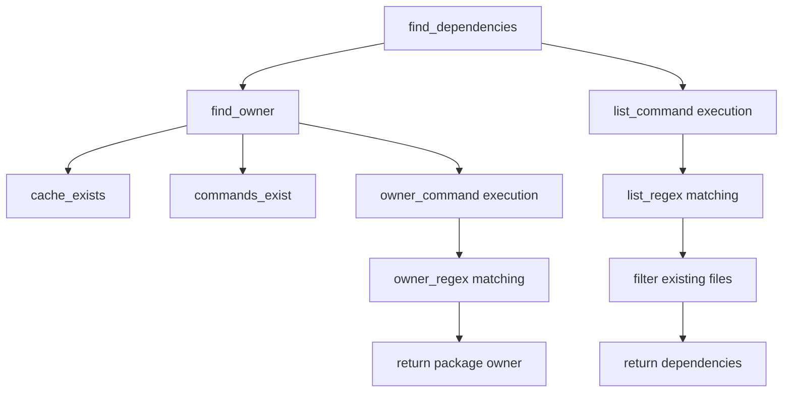

# `dependency_detection.py`

## `src.exodus_bundler.dependency_detection.PackageManager` · *class*

## Summary:
Abstract base class for package managers that provides dependency detection capabilities through external command execution.

## Description:
The PackageManager class serves as a foundation for implementing package manager-specific dependency detection logic. It provides common functionality for finding dependencies of files by determining their package ownership and then listing the dependencies of those packages. Subclasses must define specific class variables like cache_directory, list_command, list_regex, owner_command, and owner_regex to implement concrete package manager behavior.

This class is designed to be extended rather than instantiated directly, with each subclass providing implementation-specific configuration for different package management systems (like apt, yum, pacman, etc.).

## State:
- cache_directory (str): Path to the package manager's cache directory. Must be set by subclasses.
- list_command (list[str]): Command and arguments to list package dependencies. Must be set by subclasses.
- list_regex (str): Regular expression pattern to extract dependency paths from list command output. Defaults to '(.*)'.
- owner_command (list[str]): Command and arguments to find package ownership of a file. Must be set by subclasses.
- owner_regex (str): Regular expression pattern to extract package name from owner command output. Defaults to '(.*)'.
- All class variables must be initialized by subclasses before instantiation.

## Lifecycle:
- Creation: Instantiate subclasses that properly configure all required class variables
- Usage: Call find_dependencies() with a file path to detect its dependencies
- Destruction: No special cleanup required; uses standard Python garbage collection

## Method Map:


## Raises:
- None explicitly raised by __init__
- May return None from find_dependencies() when owner cannot be determined
- May return None from find_owner() when cache or commands don't exist

## Example:
```python
# Subclass implementation example
class AptPackageManager(PackageManager):
    cache_directory = '/var/cache/apt'
    list_command = ['apt-cache', 'show']
    list_regex = r'Provides: (.*)'
    owner_command = ['dpkg', '-S']
    owner_regex = r': (.*)'

# Usage
pm = AptPackageManager()
dependencies = pm.find_dependencies('/usr/bin/python3')
```

### `src.exodus_bundler.dependency_detection.PackageManager.find_dependencies` · *method*

## Summary:
Finds and returns a list of file dependencies for a given path by querying an external tool and parsing its output.

## Description:
This method determines the dependencies of a file by first identifying the "owner" of the file using the `find_owner` method, then executing a configured external command to list those dependencies. It parses the command output using a regular expression pattern to extract dependency paths, filters out directories, and returns only existing files.

The method is designed to work with package managers like dpkg or rpm that can list dependencies for installed packages. It's typically called during the dependency resolution phase of the bundling process.

## Args:
    path (str): The absolute path to the file for which to find dependencies

## Returns:
    list[str] or None: A list of absolute paths to dependency files, or None if no owner could be determined for the input path

## Raises:
    None explicitly raised, though underlying subprocess operations may raise OSError or other system-level exceptions

## State Changes:
    Attributes READ: self.find_owner, self.list_command, self.list_regex
    Attributes WRITTEN: None

## Constraints:
    Preconditions: 
    - The PackageManager instance must have valid list_command and list_regex attributes configured
    - The file path must be a valid string
    - The external tools referenced by list_command must be available in PATH
    
    Postconditions:
    - Returns None if no owner can be determined for the input path
    - Returns a list containing only existing regular files (not directories)
    - All returned paths are absolute paths

## Side Effects:
    - Executes external subprocess commands via subprocess.Popen
    - Reads from external command output streams
    - May perform filesystem operations via os.path.exists() calls

### `src.exodus_bundler.dependency_detection.PackageManager.find_owner` · *method*

## Summary:
Finds the owner of a given file path by executing a system command and parsing its output.

## Description:
This method determines which package or component owns a specified file path by invoking an external command (configured via `owner_command`) and extracting the owner information using a regular expression pattern (`owner_regex`). The method first validates that required cache and command resources are available before proceeding with the lookup.

## Args:
    path (str): The absolute path to the file whose owner needs to be determined.

## Returns:
    str or None: The name of the package/owner that owns the file, or None if the lookup fails due to missing cache, missing commands, or no matching owner in the command output.

## Raises:
    None explicitly raised, though underlying subprocess operations may raise OSError or other exceptions.

## State Changes:
    Attributes READ: self.cache_exists, self.commands_exist, self.owner_command, self.owner_regex
    Attributes WRITTEN: None

## Constraints:
    Preconditions: 
    - The `cache_directory` must exist and be a directory (checked via `cache_exists` property)
    - Both `list_command` and `owner_command` must be configured with valid executable names (checked via `commands_exist` property)
    - The `owner_regex` must be a valid regular expression pattern that can extract the owner from command output
    
    Postconditions:
    - If successful, returns the extracted owner name as a stripped string
    - If unsuccessful, returns None

## Side Effects:
    - Executes an external subprocess command specified by `owner_command`
    - Reads environment variables (copies current environment and sets LC_ALL=C)
    - May cause I/O operations through subprocess communication

### `src.exodus_bundler.dependency_detection.PackageManager.cache_exists` · *method*

## Summary:
Checks whether the package manager's cache directory exists and is a valid directory.

## Description:
This property determines if the cache directory configured for the package manager is properly established. It is used as a precondition check in dependency resolution operations to ensure the environment is properly set up before attempting to query package metadata.

## Args:
    None

## Returns:
    bool: True if `self.cache_directory` exists and is a directory; False otherwise.

## Raises:
    None

## State Changes:
    Attributes READ: self.cache_directory
    Attributes WRITTEN: None

## Constraints:
    Preconditions: The `self.cache_directory` attribute must be set to a valid path string (or None)
    Postconditions: Returns a boolean indicating the existence and validity of the cache directory

## Side Effects:
    None

### `src.exodus_bundler.dependency_detection.PackageManager.commands_exist` · *method*

## Summary:
Checks whether the required system commands for dependency detection exist in the environment.

## Description:
This method verifies that both the list command and owner command specified by the package manager are available in the system PATH. It is used as a property to ensure prerequisite commands exist before attempting dependency resolution operations.

## Args:
    None

## Returns:
    bool: True if both commands exist in the system PATH, False otherwise.

## Raises:
    None

## State Changes:
    Attributes READ: self.list_command, self.owner_command
    Attributes WRITTEN: None

## Constraints:
    Preconditions: 
    - self.list_command must be a list-like object with at least one element
    - self.owner_command must be a list-like object with at least one element
    Postconditions: 
    - Returns boolean indicating command availability

## Side Effects:
    I/O: Calls find_executable function which may involve filesystem operations to search PATH directories

## `src.exodus_bundler.dependency_detection.Pacman` · *class*

## Summary:
Pacman is a package manager implementation that detects file dependencies on Arch Linux systems using the Pacman package manager.

## Description:
The Pacman class extends PackageManager to provide dependency detection specifically for Arch Linux systems that use the Pacman package manager. It implements the required class variables to configure command execution and regex patterns for finding package ownership and listing package dependencies. This class is designed to be instantiated by the dependency detection system to handle Arch Linux package management scenarios.

The class provides configuration for Pacman-specific commands and regular expressions needed to:
1. Determine which package owns a given file using 'pacman -Qo'
2. List all files contained in a package using 'pacman -Ql'

## State:
- cache_directory (str): Path to the Pacman cache directory, set to '/var/cache/pacman'
- list_command (list[str]): Command to list package contents, set to ['pacman', '-Ql']
- list_regex (str): Regular expression to extract file paths from package listings, set to r'.*\s+(\/.+)'
- owner_command (list[str]): Command to find package ownership of files, set to ['pacman', '-Qo']
- owner_regex (str): Regular expression to extract package names from ownership queries, set to r' is owned by (.*)\s+.*'

All class variables are class-level constants that configure the behavior of the dependency detection process for Pacman-managed packages.

## Lifecycle:
- Creation: Instantiate directly as a subclass of PackageManager with all required class variables configured
- Usage: Call find_dependencies() method with a file path to detect its dependencies
- Destruction: Standard Python garbage collection handles cleanup

## Method Map:


## Raises:
- None explicitly raised by __init__
- May return None from find_dependencies() when owner cannot be determined
- May return None from find_owner() when cache or commands don't exist

## Example:
```python
# Create instance (typically done by dependency detection system)
pacman_manager = Pacman()

# Find dependencies for a file
dependencies = pacman_manager.find_dependencies('/usr/bin/python3')

# The class is designed to work with the PackageManager base class
# and integrates with the broader dependency detection framework
```

## `src.exodus_bundler.dependency_detection.Yum` · *class*

## Summary:
Concrete implementation of PackageManager for YUM (Yellowdog Updater Modified) package management system used in Red Hat-based Linux distributions.

## Description:
The Yum class provides dependency detection capabilities specifically for systems using the YUM package manager. It extends the abstract PackageManager base class and implements the required class variables to work with RPM-based package management. This class enables finding dependencies of files by first determining which RPM package owns the file, then listing the dependencies of that package.

This class is intended to be instantiated directly for YUM-based systems (such as CentOS, RHEL, Fedora) where RPM packages are managed through the YUM package manager. It leverages system commands like 'rpm -ql' to list package contents and 'rpm -qf' to find package ownership.

## State:
- cache_directory (str): Path to the YUM cache directory, set to '/var/cache/yum'
- list_command (list[str]): Command to list package contents, set to ['rpm', '-ql']  
- list_regex (str): Regular expression pattern to extract dependency paths, set to r'(.+)'
- owner_command (list[str]): Command to find package ownership, set to ['rpm', '-qf']
- owner_regex (str): Regular expression pattern to extract package names, set to r'(.+)'

All class variables are class-level constants that define the YUM-specific behavior for dependency detection operations.

## Lifecycle:
- Creation: Instantiate Yum directly - no special constructor parameters required
- Usage: Call find_dependencies() method with a file path to detect its dependencies
- Destruction: Standard Python garbage collection handles cleanup

## Method Map:


## Raises:
- None explicitly raised by __init__
- May return None from find_dependencies() when owner cannot be determined
- May return None from find_owner() when cache or commands don't exist

## Example:
```python
# Create Yum package manager instance
yum_manager = Yum()

# Find dependencies of a binary file
dependencies = yum_manager.find_dependencies('/usr/bin/python3')

# Dependencies will contain paths to files that are dependencies of python3 package
if dependencies:
    for dep in dependencies:
        print(f"Dependency: {dep}")
```

## `src.exodus_bundler.dependency_detection.detect_dependencies` · *function*

## Summary:
Detects project dependencies by querying multiple package managers until successful identification.

## Description:
This function serves as the core dependency detection mechanism in the Exodus bundler system. It sequentially tests different package managers (such as npm, pip, etc.) to identify dependencies in a given project path. The function stops and returns the first successful dependency list found, making it efficient for projects that may use different package management systems.

## Args:
    path (str): The file system path to scan for dependencies. This typically refers to a project root directory or manifest file containing dependency declarations.

## Returns:
    list[str] or None: A list of dependency names if dependencies are successfully detected by any package manager, or None if no dependencies are identified by any of the registered package managers.

## Raises:
    None explicitly raised in the function body.

## Constraints:
    Preconditions:
    - The path argument must be a valid string representing a file system location
    - The global variable `package_managers` must be properly initialized and contain a sequence of objects with a `find_dependencies` method
    
    Postconditions:
    - Returns either a list of dependency strings or None
    - Does not modify the input path or any external state
    - Function execution is deterministic for the same input

## Side Effects:
    None explicitly mentioned in the function body.

## Control Flow:
```mermaid
flowchart TD
    A[Start detect_dependencies] --> B{Iterate package_managers}
    B --> C[Call package_manager.find_dependencies(path)]
    C --> D{Dependencies found?}
    D -->|Yes| E[Return dependencies]
    D -->|No| F[Continue to next package_manager]
    F --> B
    B -->|End of list| G[Return None]
```

## Examples:
    # Basic usage
    deps = detect_dependencies("/path/to/project")
    if deps:
        print(f"Found {len(deps)} dependencies")
        for dep in deps:
            print(f"  - {dep}")
    else:
        print("No dependencies detected")

    # Usage in bundling context
    project_deps = detect_dependencies("./my_project")
    if project_deps:
        # Proceed with bundling process
        bundle_with_dependencies(project_deps)
    else:
        # Handle case where no dependencies were detected
        raise ValueError("Could not detect project dependencies")

