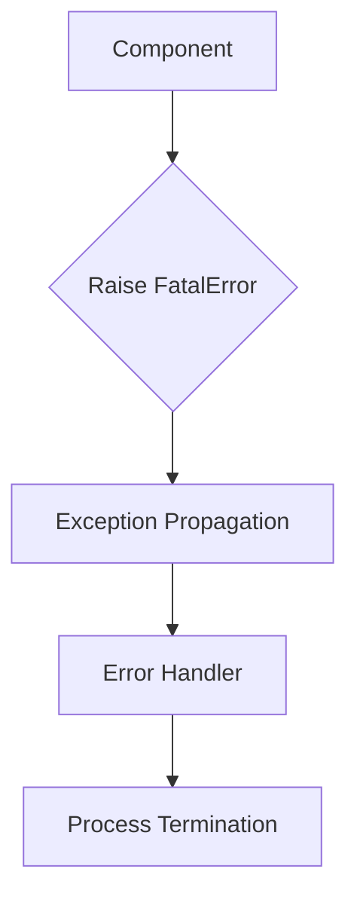
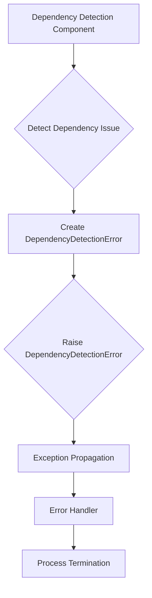
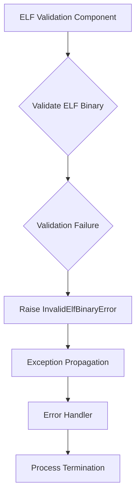
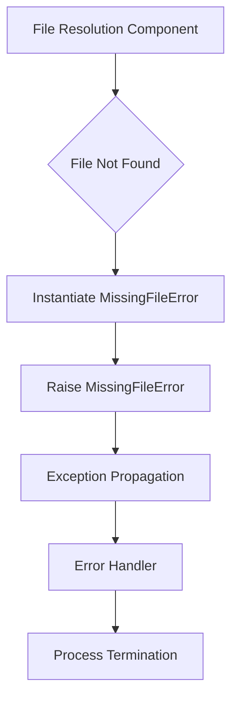
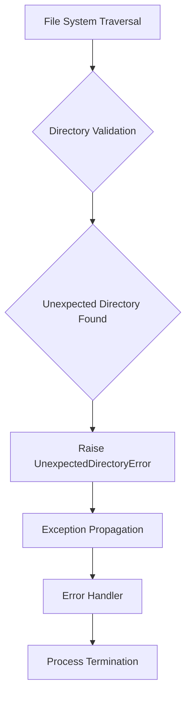
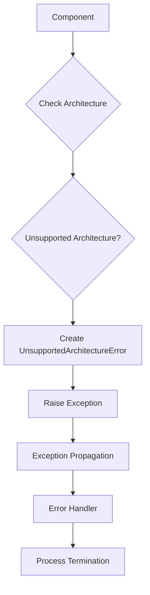

# `errors.py`

## `src.exodus_bundler.errors.FatalError` · *class*

## Summary:
A custom exception class representing unrecoverable errors that terminate the Exodus bundler process.

## Description:
FatalError is a specialized exception type used throughout the exodus_bundler system to indicate critical failures that cannot be recovered from. When raised, these errors signal that the bundling process must stop immediately. The exception inherits from Python's standard Exception class and serves as a clear marker for error handling logic to distinguish between recoverable and non-recoverable failures.

This class is typically instantiated by various components within the bundler when encountering conditions that make continued execution impossible or unsafe, such as configuration errors, missing dependencies, or corrupted input files.

## State:
The class has no instance attributes beyond those inherited from Exception. It maintains no internal state and requires no special initialization parameters beyond what is standard for Python exceptions.

## Lifecycle:
Creation: Instances are created by calling FatalError() or FatalError(message) with an optional error message string. The exception can be raised directly or instantiated and then raised later.

Usage: Once created, FatalError instances are typically raised using the 'raise' keyword to interrupt normal program flow and propagate the error up the call stack until caught by appropriate error handlers.

Destruction: As with all Python exceptions, no explicit cleanup is required. The exception object is automatically destroyed when it goes out of scope or when the error handling mechanism completes.

## Method Map:


## Raises:
The class itself does not raise any exceptions during instantiation. However, when raised during program execution, it propagates as a standard Python Exception.

## Example:
```python
# Raising a fatal error with a descriptive message
raise FatalError("Configuration file not found at path: config.json")

# Or raising without a message
raise FatalError()
```

## `src.exodus_bundler.errors.DependencyDetectionError` · *class*

## Summary:
A custom exception class representing unrecoverable errors that occur during dependency detection in the Exodus bundler process.

## Description:
DependencyDetectionError is a specialized exception type used within the exodus_bundler system to indicate critical failures that occur when detecting dependencies for bundled modules. This exception inherits from FatalError, making it a non-recoverable error that terminates the bundling process immediately.

This class is specifically designed to handle scenarios where the bundler encounters problems that prevent it from properly identifying or resolving module dependencies. Examples include circular dependencies, missing required dependencies, or dependency resolution conflicts that make continued execution impossible.

The error serves as a clear marker for error handling logic to distinguish dependency-related critical failures from other types of fatal errors in the system.

## State:
The class has no instance attributes beyond those inherited from Exception and FatalError. It maintains no internal state and requires no special initialization parameters beyond what is standard for Python exceptions.

## Lifecycle:
Creation: Instances are created by calling DependencyDetectionError() or DependencyDetectionError(message) with an optional error message string. The exception can be raised directly or instantiated and then raised later.

Usage: Once created, DependencyDetectionError instances are typically raised using the 'raise' keyword to interrupt normal program flow and propagate the error up the call stack until caught by appropriate error handlers.

Destruction: As with all Python exceptions, no explicit cleanup is required. The exception object is automatically destroyed when it goes out of scope or when the error handling mechanism completes.

## Method Map:


## Raises:
The class itself does not raise any exceptions during instantiation. However, when raised during program execution, it propagates as a standard Python Exception that inherits all behaviors of FatalError.

## Example:
```python
# Raising a dependency detection error with a descriptive message
raise DependencyDetectionError("Circular dependency detected between modules A and B")

# Or raising without a message
raise DependencyDetectionError()
```

## `src.exodus_bundler.errors.InvalidElfBinaryError` · *class*

## Summary:
A custom exception class indicating a fatal error due to an invalid ELF binary during the Exodus bundling process.

## Description:
InvalidElfBinaryError is a specialized exception that extends FatalError and is specifically raised when the Exodus bundler encounters an ELF (Executable and Linkable Format) binary that fails validation requirements. This exception represents a critical failure condition that stops the bundling process immediately, as the binary cannot be processed further.

As a subclass of FatalError, this exception follows the same error handling semantics - when raised, it terminates the bundling process without allowing recovery. The error is intended to be used by components responsible for ELF binary validation to signal that the input binary is fundamentally incompatible with the bundling requirements.

## State:
The class has no instance attributes beyond those inherited from Exception and FatalError. It maintains no internal state and requires no special initialization parameters beyond what is standard for Python exceptions.

## Lifecycle:
Creation: Instances are created by calling InvalidElfBinaryError() or InvalidElfBinaryError(message) with an optional error message string. The exception can be raised directly or instantiated and then raised later.

Usage: Once created, InvalidElfBinaryError instances are raised using the 'raise' keyword to interrupt normal program flow and propagate the error up the call stack until caught by appropriate error handlers.

Destruction: As with all Python exceptions, no explicit cleanup is required. The exception object is automatically destroyed when it goes out of scope or when the error handling mechanism completes.

## Method Map:


## Raises:
The class itself does not raise any exceptions during instantiation. However, when raised during program execution, it propagates as a standard Python Exception that inherits all behaviors from FatalError.

## Example:
```python
# Raising an invalid ELF binary error with a descriptive message
raise InvalidElfBinaryError("ELF binary at path '/usr/bin/example' is malformed and cannot be processed")

# Or raising without a message
raise InvalidElfBinaryError()
```

## `src.exodus_bundler.errors.MissingFileError` · *class*

## Summary:
A custom exception indicating that a required file could not be found during the Exodus bundling process, resulting in an unrecoverable error.

## Description:
MissingFileError is a specialized exception that extends FatalError and is raised when the Exodus bundler encounters a situation where a file dependency is missing from the filesystem. This represents a critical failure condition that prevents the bundling process from continuing, making it a fatal error that terminates execution immediately.

This exception is typically raised by file resolution and processing components within the bundler when attempting to access files that are expected to exist but are not present in the specified location. Common scenarios include missing source files, configuration files, or dependency files required for the bundling operation.

## State:
The class inherits all state from FatalError and maintains no additional instance attributes. It follows the standard Python exception pattern with optional error message string parameter. The constructor accepts the same parameters as Exception: an optional message string.

## Lifecycle:
Creation: Instances are created by calling MissingFileError() or MissingFileError(message) with an optional descriptive error message. The exception can be raised directly or instantiated and then raised later.

Usage: Once created, MissingFileError instances are raised using the 'raise' keyword to immediately halt the bundling process and propagate the error up the call stack until caught by appropriate error handlers.

Destruction: As with all Python exceptions, no explicit cleanup is required. The exception object is automatically destroyed when it goes out of scope or when the error handling mechanism completes.

## Method Map:


## Raises:
The class itself does not raise any exceptions during instantiation. However, when raised during program execution, it propagates as a FatalError subclass and ultimately as a standard Python Exception.

## Example:
```python
# Raising a missing file error with a descriptive message
raise MissingFileError("Source file not found at path: src/main.js")

# Or raising without a message
raise MissingFileError()
```

## `src.exodus_bundler.errors.UnexpectedDirectoryError` · *class*

## Summary:
A custom exception indicating that an unexpected directory was encountered during the Exodus bundling process, triggering a fatal termination.

## Description:
UnexpectedDirectoryError is a specialized fatal error that signals when the bundler encounters a directory in a location or context that violates expected organizational patterns. This error is raised during file system traversal, validation, or organization phases when the bundler detects directory structures that break predetermined assumptions about the project layout.

Common scenarios include finding temporary directories in the bundle root, encountering directories with invalid naming conventions, or discovering directory structures that conflict with the bundler's expected project organization. As a subclass of FatalError, this exception terminates the bundling process immediately, preventing further execution when directory-related inconsistencies are detected.

## State:
The class inherits all state from FatalError and maintains no additional instance attributes. It follows the standard Python exception initialization pattern with optional message parameter. The exception message (if provided) should clearly describe the unexpected directory and the context in which it was found.

## Lifecycle:
Creation: Instances are created by calling UnexpectedDirectoryError() or UnexpectedDirectoryError(message) with an optional descriptive message string. The exception can be raised directly or instantiated and then raised later.

Usage: Once created, UnexpectedDirectoryError instances are typically raised using the 'raise' keyword to interrupt normal program flow and propagate the error up the call stack until caught by appropriate error handlers. The error should be handled at the top level of the bundling process to ensure clean termination.

Destruction: As with all Python exceptions, no explicit cleanup is required. The exception object is automatically destroyed when it goes out of scope or when the error handling mechanism completes.

## Method Map:


## Raises:
The class itself does not raise any exceptions during instantiation. However, when raised during program execution, it propagates as a standard Python Exception, specifically a FatalError subclass.

## Example:
```python
# Raising an unexpected directory error with a descriptive message
raise UnexpectedDirectoryError("Unexpected directory 'node_modules' found in bundle root")

# Raising with more context about the violation
raise UnexpectedDirectoryError("Directory 'temp_build' not allowed in production bundle")
```

## `src.exodus_bundler.errors.UnsupportedArchitectureError` · *class*

## Summary:
A custom exception indicating that the current system architecture is not supported by the Exodus bundler.

## Description:
`UnsupportedArchitectureError` is a specialized exception that extends `FatalError` to specifically handle cases where the Exodus bundler encounters a system architecture that it cannot support. This exception is raised when the bundler detects that the underlying hardware or operating system architecture is incompatible with the build requirements.

The error serves as a clear indicator to users and automated systems that the bundling process cannot proceed due to architectural incompatibility rather than other types of failures. It inherits all behavior from `FatalError` while providing semantic clarity about the nature of the failure.

## State:
This class inherits all state from `FatalError` and contains no additional instance attributes. It maintains no internal state beyond what is provided by the base Exception class.

## Lifecycle:
Creation: Instances are created by calling `UnsupportedArchitectureError()` or `UnsupportedArchitectureError(message)` with an optional error message string. The exception can be raised directly or instantiated and then raised later.

Usage: Once created, `UnsupportedArchitectureError` instances are typically raised using the 'raise' keyword to interrupt normal program flow and propagate the error up the call stack until caught by appropriate error handlers.

Destruction: As with all Python exceptions, no explicit cleanup is required. The exception object is automatically destroyed when it goes out of scope or when the error handling mechanism completes.

## Method Map:


## Raises:
The class itself does not raise any exceptions during instantiation. However, when raised during program execution, it propagates as a standard Python Exception that inherits all behaviors from `FatalError`.

## Example:
```python
# Raising an unsupported architecture error
raise UnsupportedArchitectureError("ARM64 architecture is not supported on this platform")

# Or raising without a message
raise UnsupportedArchitectureError()
```

