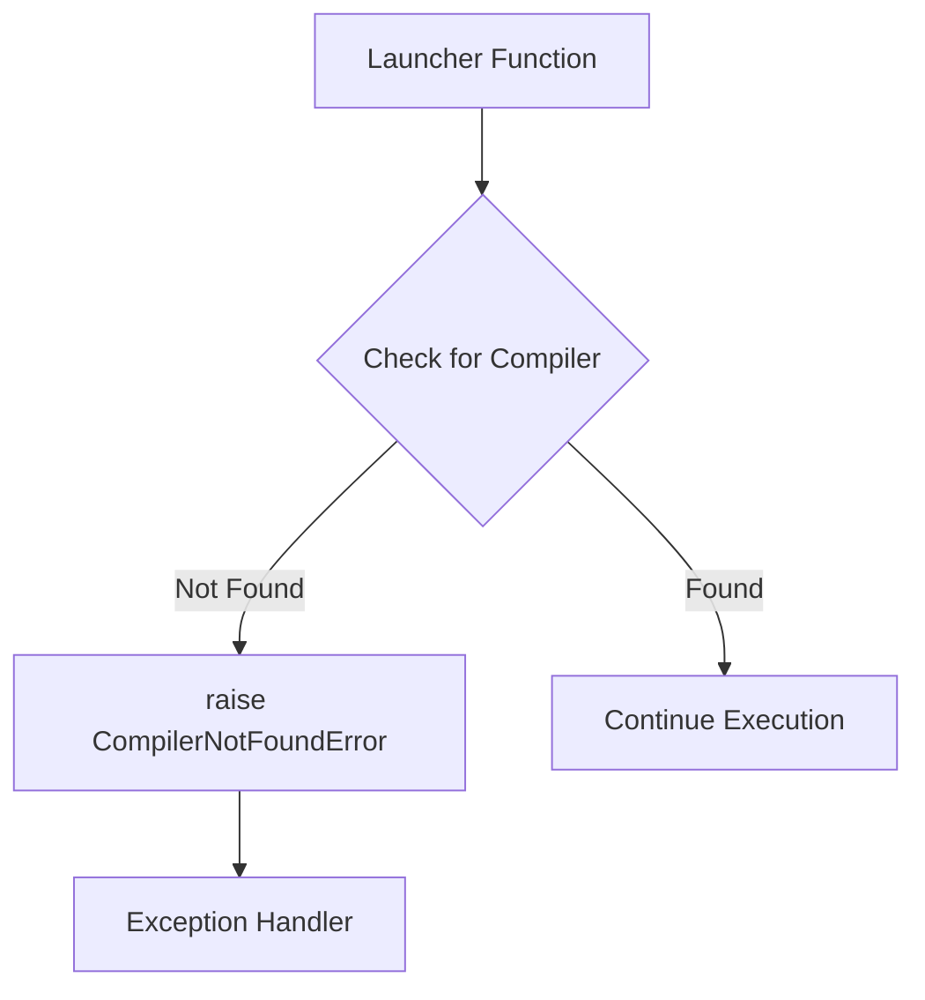
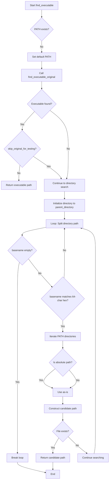
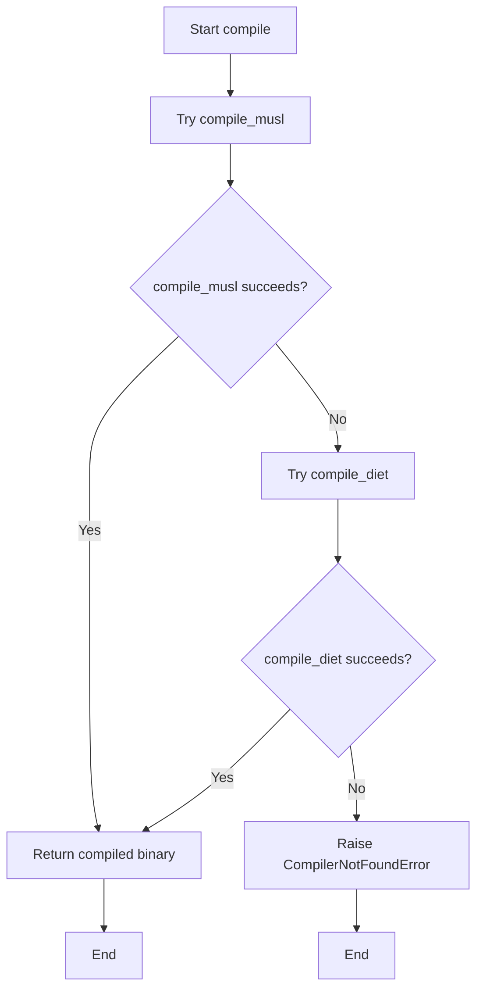
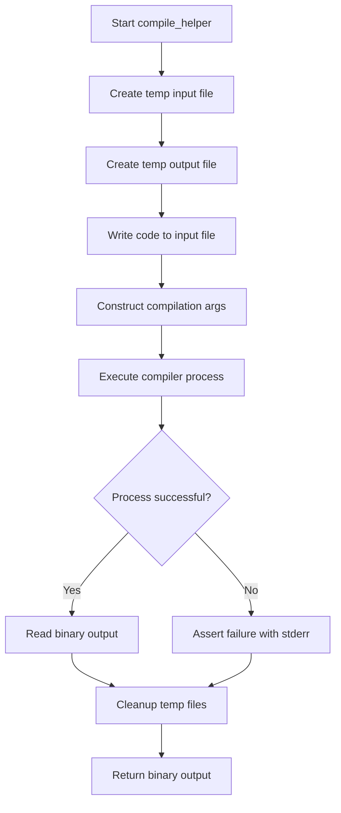
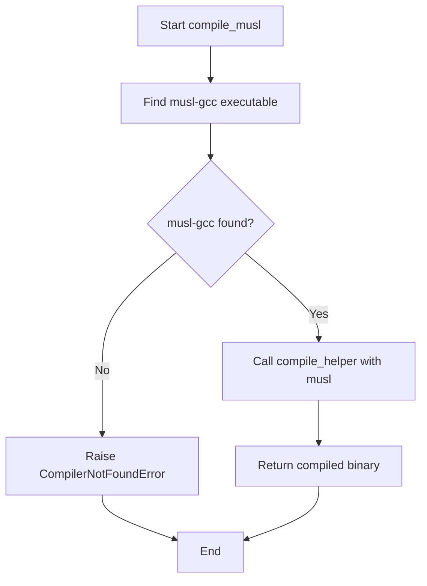
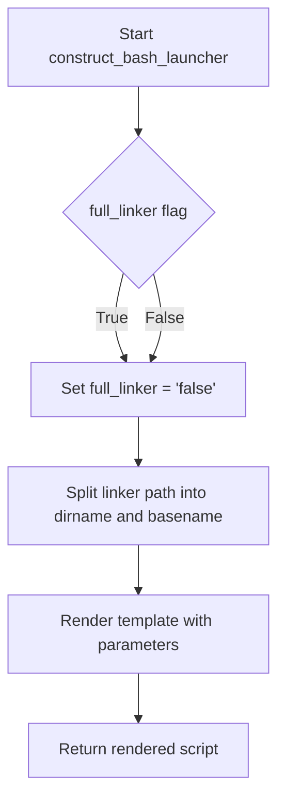
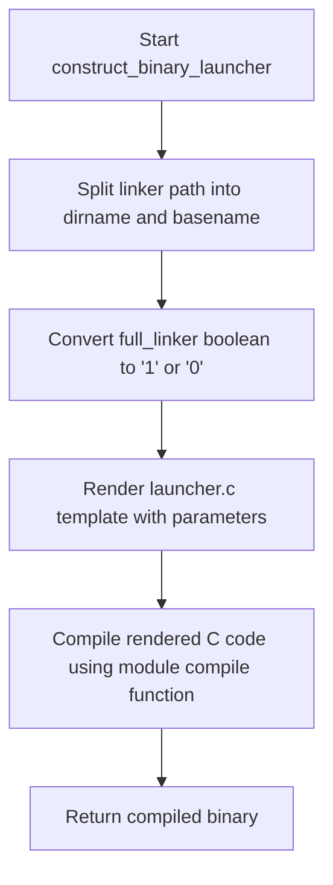

# `launchers.py`

## `src.exodus_bundler.launchers.CompilerNotFoundError` · *class*

## Summary:
Represents an error that occurs when a required compiler cannot be located in the system environment.

## Description:
This exception is raised when the launchers module attempts to execute or locate a compiler but fails to find it in the system PATH or specified locations. It serves as a specialized exception type to distinguish compiler discovery failures from other potential errors in the build or execution process.

## State:
The class inherits from Python's built-in Exception class and has no additional attributes or state beyond what is provided by the base Exception class.

## Lifecycle:
- Creation: Instantiated when a compiler cannot be found during launcher operations
- Usage: Raised by launcher functions when compiler requirements are not met
- Destruction: Handled by exception handlers in calling code

## Method Map:


## Raises:
This exception is raised by launcher functions when compiler detection fails, typically during initialization or execution phases of build processes.

## Example:
```python
try:
    launcher = create_launcher(config)
    launcher.execute()
except CompilerNotFoundError:
    print("Required compiler not found. Please install the compiler and ensure it's in PATH.")
```

## `src.exodus_bundler.launchers.find_executable` · *function*

## Summary:
Finds an executable binary by searching standard PATH or in nested directory structures with 64-character hexadecimal names.

## Description:
This function attempts to locate an executable binary by first checking the standard system PATH using distutils.spawn.find_executable, and if that fails or testing is skipped, it searches recursively upward through directory paths looking for directories with 64-character hexadecimal names, then checks for the binary in subdirectories of those hex-named directories. This appears to be designed for locating executables in containerized or isolated execution environments where binaries might be stored in specific directory structures.

Note: The implementation contains undefined variables (`find_executable_original` and `parent_directory`) that would need to be properly defined for this function to work correctly.

## Args:
    binary_name (str): Name of the executable to find
    skip_original_for_testing (bool): If True, skips the initial search using standard PATH lookup. Defaults to False.

## Returns:
    str or None: Path to the executable if found, None otherwise

## Raises:
    None explicitly raised

## Constraints:
    Preconditions:
    - binary_name must be a non-empty string
    - Environment PATH variable should be accessible
    - The undefined variables `find_executable_original` and `parent_directory` must be properly defined for correct operation
    
    Postconditions:
    - Returns either a valid absolute path to an executable or None
    - Does not modify system state except potentially setting PATH environment variable

## Side Effects:
    - May modify os.environ['PATH'] if it doesn't exist
    - Performs filesystem operations to check for file existence

## Control Flow:


## Examples:
    # Find python executable
    exe_path = find_executable('python')
    
    # Skip standard PATH lookup for testing
    exe_path = find_executable('my_binary', skip_original_for_testing=True)
```

## `src.exodus_bundler.launchers.compile` · *function*

## Summary:
Attempts to compile C source code using multiple compiler strategies, falling back from musl-gcc to diet compiler if the preferred compiler is unavailable.

## Description:
This function provides a robust compilation interface that tries to compile C source code using the musl-gcc compiler first, and falls back to the diet compiler with GCC if musl-gcc is not available. It serves as the primary entry point for compilation within the Exodus bundler system, abstracting away the complexity of compiler discovery and selection.

The function is designed to handle environments where different compilation tools may be available, ensuring that compilation can proceed with whatever tools are present on the system. This approach increases compatibility across different deployment environments.

## Args:
    code (str): The C source code to compile as a string.

## Returns:
    bytes: The compiled binary output as raw bytes from whichever compilation strategy succeeds.

## Raises:
    CompilerNotFoundError: When neither musl-gcc nor diet compiler with GCC can be found in the system PATH, indicating that suitable compilation tools are not available.

## Constraints:
    Preconditions:
        - The code parameter must contain valid C source code
        - At least one of the supported compilers (musl-gcc or diet+gcc) must be available in the system PATH
    
    Postconditions:
        - If successful, returns compiled binary bytes from the compilation process
        - If failed, raises CompilerNotFoundError with descriptive message

## Side Effects:
    - Invokes external system compiler processes through the underlying compile_musl and compile_diet functions
    - Creates temporary files during compilation via the compile_helper function
    - May modify system state through external command execution

## Control Flow:


## `src.exodus_bundler.launchers.compile_diet` · *function*

## Summary:
Compiles C source code using the diet compiler and GCC linker.

## Description:
This function locates the diet compiler and GCC executable in the system PATH, validates their presence, and delegates compilation to the helper function. It serves as a specialized launcher for diet-based C compilation workflows.

## Args:
    code (str): The C source code to compile as a string.

## Returns:
    bytes: The compiled binary output as raw bytes, returned from the compile_helper function.

## Raises:
    CompilerNotFoundError: When either the 'diet' compiler or 'gcc' executable cannot be found in the system PATH.

## Constraints:
    Preconditions:
        - The system must have 'diet' and 'gcc' compilers installed and available in PATH
        - The code parameter must contain valid C source code
    
    Postconditions:
        - If successful, returns compiled binary bytes from the diet compilation process
        - If failed, raises CompilerNotFoundError before attempting compilation

## Side Effects:
    - None directly observable from this function
    - Relies on external system processes for compilation
    - Delegates to compile_helper which creates temporary files and executes system commands

## Control Flow:
```mermaid
flowchart TD
    A[Start compile_diet] --> B[Find diet compiler]
    B --> C[Find gcc compiler]
    C --> D{Both compilers found?}
    D -- No --> E[Raise CompilerNotFoundError]
    D -- Yes --> F[Call compile_helper with [diet, 'gcc']]
    E --> G[Exit with exception]
    F --> H[Return compile_helper result]
    H --> I[End]
```

## `src.exodus_bundler.launchers.compile_helper` · *function*

## Summary:
Compiles C source code into a binary executable using system compiler tools.

## Description:
This function serves as a utility for compiling C code into a binary executable. It accepts C source code as a string and compilation arguments, writes the code to a temporary file, invokes the system compiler with appropriate flags for static linking and optimization, and returns the resulting binary output.

## Args:
    code (str): The C source code to compile as a string.
    initial_args (list[str]): Command-line arguments to pass to the compiler, excluding the automatically added flags.

## Returns:
    bytes: The compiled binary output as raw bytes.

## Raises:
    AssertionError: When the compilation process fails, with the error message from the compiler.

## Constraints:
    Preconditions:
        - The system must have a working C compiler installed (e.g., gcc, clang)
        - The initial_args must contain a valid compiler command
        - The code parameter must contain valid C source code
    
    Postconditions:
        - Temporary files are cleaned up regardless of success or failure
        - The returned bytes represent a valid compiled binary

## Side Effects:
    - Creates temporary files in the system's temporary directory
    - Removes temporary files after compilation completes
    - Invokes external system compiler process

## Control Flow:


## Examples:
    # Compile simple C program
    c_code = '''
    int main() {
        return 0;
    }
    '''
    result = compile_helper(c_code, ['gcc'])
    # Returns compiled binary bytes

## `src.exodus_bundler.launchers.compile_musl` · *function*

## Summary:
Compiles C source code into a binary executable using the musl-gcc compiler.

## Description:
This function serves as a specialized compiler wrapper that locates and uses the musl-gcc compiler to compile C source code into a binary executable. It is designed to work within the Exodus bundler system for creating statically-linked binaries with musl libc.

## Args:
    code (str): The C source code to compile as a string.

## Returns:
    bytes: The compiled binary output as raw bytes, produced by the underlying compile_helper function.

## Raises:
    CompilerNotFoundError: When the musl-gcc compiler executable is not found in the system PATH.

## Constraints:
    Preconditions:
        - The system must have musl-gcc compiler installed and available in PATH
        - The code parameter must contain valid C source code
    
    Postconditions:
        - The function returns compiled binary bytes when successful
        - The function raises CompilerNotFoundError when musl-gcc is not found

## Side Effects:
    - May invoke external system compiler process when musl-gcc is found
    - Delegates to compile_helper which creates temporary files and cleans them up

## Control Flow:


## Examples:
    # Compile a simple C program using musl-gcc
    c_code = '''
    int main() {
        return 0;
    }
    '''
    try:
        result = compile_musl(c_code)
        # Returns compiled binary bytes
    except CompilerNotFoundError:
        print("musl-gcc compiler not found")
```

## `src.exodus_bundler.launchers.construct_bash_launcher` · *function*

## Summary:
Generates a bash launcher script that configures library paths and executes a specified linker command.

## Description:
Creates a portable bash script template that encapsulates the execution environment for a linker command. This function is used to generate launcher scripts that properly set library paths and execute the target executable with appropriate linker configuration.

The function parses the linker path to extract directory and basename components, processes the full_linker flag, and delegates the actual template rendering to the templating system.

## Args:
    linker (str): Absolute or relative path to the linker executable. Used to extract dirname and basename components for the generated script.
    library_path (str): Library search path to be configured in the generated launcher script.
    executable (str): Path to the executable that will be invoked by the generated bash script.
    full_linker (bool, optional): Boolean flag controlling whether to use the full linker path in the generated script. Defaults to True.

## Returns:
    str: Rendered bash launcher script content containing the configured linker, library path, and executable settings.

## Raises:
    FileNotFoundError: If the 'launcher.sh' template file cannot be located in the template directory.
    IOError: If there are file system errors while reading the template or during rendering operations.

## Constraints:
    Preconditions:
        - The linker parameter must be a valid filesystem path
        - The launcher.sh template must exist in the template directory
        - library_path and executable must be valid paths
    
    Postconditions:
        - Returns a complete bash script string with proper variable substitutions
        - The script will contain the correct linker directory and basename information
        - The full_linker parameter is converted to string representation ('true' or 'false')

## Side Effects:
    - Reads template file from disk (filesystem I/O operation)
    - May raise exceptions if template file is missing or inaccessible

## Control Flow:


## Examples:
    # Basic usage to create a launcher for GCC
    launcher_content = construct_bash_launcher(
        linker="/usr/bin/gcc",
        library_path="/opt/mylib:/usr/local/lib",
        executable="/path/to/myprogram"
    )
    
    # Create launcher with minimal linker path reference
    launcher_content = construct_bash_launcher(
        linker="/usr/bin/gcc",
        library_path="/opt/mylib",
        executable="/path/to/myprogram",
        full_linker=False
    )

## `src.exodus_bundler.launchers.construct_binary_launcher` · *function*

## Summary:
Constructs a binary launcher by rendering a C template with specified linking parameters and compiling it into executable form.

## Description:
Creates a C-based binary launcher that encapsulates the necessary linking configuration to execute a target executable with specified library paths. This function serves as a factory for generating platform-specific launchers that can properly load shared libraries and execute binaries with appropriate linking behavior.

The function extracts directory and basename information from the linker path, converts the boolean full_linker flag to a string representation, renders a C template file with all relevant parameters, and compiles the resulting code into a binary executable.

## Args:
    linker (str): Path to the linker executable, used to extract directory and basename components for the launcher.
    library_path (str): Path to the library directory that should be available at runtime for the executable to find required shared libraries.
    executable (str): Path to the target executable that will be launched by the generated launcher.
    full_linker (bool): Flag indicating whether to use full linking behavior. Defaults to True. When False, uses minimal linking.

## Returns:
    bytes: Compiled binary executable representing the launcher, ready for execution as a standalone program.

## Raises:
    None explicitly documented - depends on the underlying compile function implementation.

## Constraints:
    Preconditions:
        - The linker path must be a valid filesystem path
        - The library_path must be a valid directory path
        - The executable path must be a valid filesystem path
        - The launcher.c template file must exist in the template directory
        
    Postconditions:
        - Returns a valid compiled binary that can be executed
        - The returned binary will execute the specified executable with proper library loading

## Side Effects:
    - Reads template file 'launcher.c' from the template directory
    - Calls the module's own compile function which may invoke external compiler processes
    - May create temporary files during the compilation process

## Control Flow:


## Examples:
```python
# Create a launcher for an application with full linking
launcher_binary = construct_binary_launcher(
    linker="/usr/bin/gcc",
    library_path="/opt/myapp/lib",
    executable="/opt/myapp/bin/myapp"
)

# Create a launcher with minimal linking for a system utility
launcher_binary = construct_binary_launcher(
    linker="/usr/bin/ld",
    library_path="/usr/local/lib",
    executable="/usr/bin/some_program",
    full_linker=False
)

# The returned binary can be written to disk and executed
with open("my_launcher", "wb") as f:
    f.write(launcher_binary)
os.chmod("my_launcher", 0o755)  # Make executable
```

