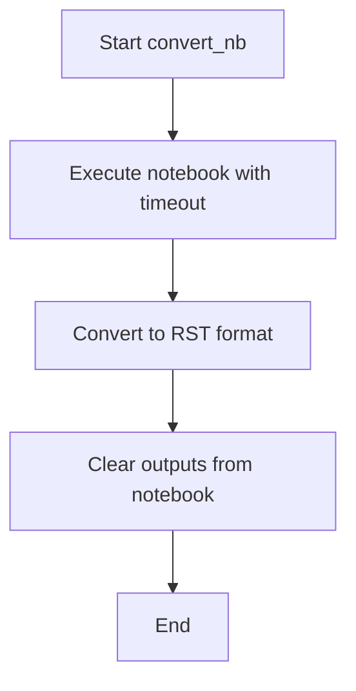

# `nb_to_doc.py`

## `docs.tutorials.tools.nb_to_doc.convert_nb` · *function*

## Summary:
Processes a Jupyter notebook through three sequential nbconvert operations for documentation preparation.

## Description:
Executes a series of Jupyter nbconvert commands on a notebook file to prepare it for documentation generation. The function performs notebook execution, RST conversion, and output clearing in sequence.

## Args:
    nbname (str): Base name of the notebook file (without .ipynb extension) to process

## Returns:
    None: This function does not return any value

## Raises:
    Exception: May raise exceptions from underlying subprocess operations if commands fail

## Constraints:
    Preconditions:
    - The notebook file must exist with the name {nbname}.ipynb
    - Jupyter nbconvert must be installed and available in the system PATH
    - The user must have appropriate permissions to execute the notebook and modify files
    
    Postconditions:
    - The original notebook file is executed and modified in-place
    - An RST version of the notebook is created alongside the original
    - The original notebook file has its outputs cleared and saved in-place

## Side Effects:
    - Executes shell commands via subprocess
    - Modifies the original notebook file in-place during execution and output clearing steps
    - Creates a new RST file with the same base name as the notebook
    - May modify file timestamps due to in-place operations

## Control Flow:


## Examples:
```python
# Process a notebook named "example_notebook"
convert_nb("example_notebook")

# This will:
# 1. Execute example_notebook.ipynb with a 60-second timeout
# 2. Create example_notebook.rst from the executed notebook
# 3. Clear outputs from example_notebook.ipynb and save it
```

