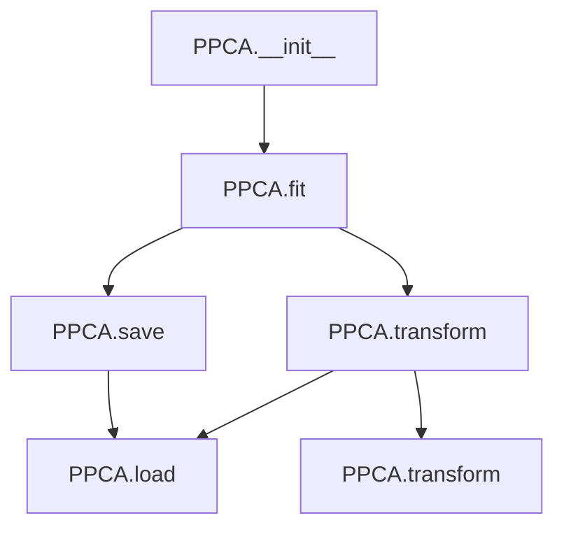

# `ppca.py`

## `hypertools._externals.ppca.PPCA` · *class*

## Summary:
Probabilistic Principal Component Analysis (PPCA) implementation for dimensionality reduction with missing data handling.

## Description:
The PPCA class implements a probabilistic approach to principal component analysis that can handle missing data points. It provides methods for fitting a model to data, transforming new data using the fitted model, and saving/loading the learned projection matrix. This class is particularly useful when dealing with datasets that have missing values or when probabilistic dimensionality reduction is preferred over traditional PCA.

## State:
- raw: Original input data array, or None if not yet fitted
- data: Standardized data used for computation, or None if not yet fitted  
- C: Projection matrix (components) learned during fitting, or None if not yet fitted
- means: Per-feature mean values computed during fitting, or None if not yet fitted
- stds: Per-feature standard deviations computed during fitting, or None if not yet fitted

## Lifecycle:
- Creation: Instantiate with PPCA() constructor
- Usage: Call fit() with data first to initialize internal state, then transform() to project data (either original or new data), optionally save() to persist model
- Destruction: No explicit cleanup required; relies on Python garbage collection

## Method Map:


## Raises:
- RuntimeError: When attempting to standardize, transform, or calculate variance before fitting (means/stds/data not set)
- RuntimeError: When attempting to transform before fitting (C not set)
- AssertionError: When loading from a non-existent file path

## Example:
```python
import numpy as np
from hypertools._externals.ppca import PPCA

# Create PPCA instance
ppca = PPCA()

# Fit on data with missing values
data = np.array([[1, 2, np.nan], [4, 5, 6], [7, np.nan, 9]])
ppca.fit(data, d=2)

# Transform original data (returns projected data)
transformed = ppca.transform()

# Transform new data using same model (returns projected new data)
new_data = np.array([[2, 3, np.nan]])
new_transformed = ppca.transform(new_data)

# Save fitted model
ppca.save('ppca_model.npy')

# Load model into new instance
new_ppca = PPCA()
new_ppca.load('ppca_model.npy')

# Refit with different parameters
ppca.fit(data, d=3)  # Refit with higher dimensionality
```

### `hypertools._externals.ppca.PPCA.__init__` · *method*

## Summary:
Initializes the PPCA object with all internal state variables set to None, indicating an unfitted state ready for data processing.

## Description:
The `__init__` method serves as the constructor for the PPCA class, establishing the initial state of the probabilistic principal component analysis model. It sets all internal tracking variables to None, signaling that the model has not yet been fitted to data and contains no processed information. This initialization prepares the object for subsequent operations like fitting with training data and transformation of new data points.

## Args:
    None

## Returns:
    None

## Raises:
    None

## State Changes:
    Attributes READ: None
    Attributes WRITTEN: 
    - self.raw: Set to None to indicate no original data has been processed
    - self.data: Set to None to indicate no standardized data has been computed
    - self.C: Set to None to indicate no projection matrix has been learned
    - self.means: Set to None to indicate no feature means have been calculated
    - self.stds: Set to None to indicate no feature standard deviations have been computed

## Constraints:
    Preconditions: None
    Postconditions: All internal state variables are initialized to None, indicating an unfitted model state

## Side Effects:
    None

### `hypertools._externals.ppca.PPCA._standardize` · *method*

## Summary:
Standardizes input data using pre-computed mean and standard deviation values.

## Description:
Performs z-score normalization on input data using the mean and standard deviation values previously computed during model fitting. This method is used internally by the PPCA algorithm to normalize data before processing.

## Args:
    X (array-like): Input data to be standardized, with shape (n_samples, n_features)

## Returns:
    array-like: Standardized data with the same shape as input X, where each feature has zero mean and unit variance

## Raises:
    RuntimeError: If the model has not been fitted yet (i.e., self.means or self.stds are None)

## State Changes:
    Attributes READ: self.means, self.stds
    Attributes WRITTEN: None

## Constraints:
    Preconditions: 
    - self.means must be computed and stored (typically via fit() method)
    - self.stds must be computed and stored (typically via fit() method)
    - Input X must be compatible with the dimensions of self.means and self.stds
    
    Postconditions:
    - Returned data has zero mean and unit variance for each feature
    - Output shape matches input shape

## Side Effects:
    None

### `hypertools._externals.ppca.PPCA.fit` · *method*

## Summary:
Fits a probabilistic principal component analysis model to the input data, handling missing values and computing the optimal projection matrix.

## Description:
Performs probabilistic principal component analysis (PPCA) on the provided data to learn a low-dimensional representation. This method handles infinite values by replacing them with the maximum finite value, filters out series with insufficient observations, standardizes the data, and iteratively optimizes the model parameters using an expectation-maximization approach. The fitted model stores the projection matrix, transformed data, and eigenvalues for subsequent use in dimensionality reduction.

## Args:
    data (array-like): Input data matrix with shape (n_samples, n_features) where rows represent samples and columns represent features
    d (int, optional): Number of principal components to compute. If None, defaults to the number of features in the data
    tol (float, optional): Convergence tolerance for the iterative optimization process. Defaults to 1e-4
    min_obs (int, optional): Minimum number of valid observations required for a feature to be included in the analysis. Defaults to 10
    verbose (bool, optional): If True, prints convergence diagnostics during iterations. Defaults to False

## Returns:
    None: This method modifies the object's state in-place and does not return any value

## Raises:
    None explicitly raised, but may raise RuntimeError from internal methods if preconditions aren't met

## State Changes:
    Attributes READ: None
    Attributes WRITTEN: 
    - self.raw: Stores the original input data
    - self.means: Stores the mean values for each feature
    - self.stds: Stores the standard deviation values for each feature
    - self.C: Stores the learned projection matrix (principal components)
    - self.data: Stores the standardized data used for fitting
    - self.eig_vals: Stores the eigenvalues of the covariance matrix

## Constraints:
    Preconditions:
    - Input data should be numeric with potential NaN and Inf values
    - Data should have at least min_obs valid observations per feature
    - The data matrix should be compatible with the expected dimensions
    
    Postconditions:
    - All instance variables related to the fitted model are populated
    - The projection matrix C is orthogonal
    - Eigenvalues are sorted in descending order
    - Variance explained ratios are computed and stored

## Side Effects:
    None

### `hypertools._externals.ppca.PPCA.transform` · *method*

## Summary:
Applies the learned principal component projection to transform data into a lower-dimensional space.

## Description:
Transforms input data using the principal component matrix learned during model fitting. This method projects high-dimensional data onto the principal component subspace, enabling dimensionality reduction. When called without arguments, it transforms the original training data that was used to fit the model. When provided with new data, it applies the same projection to transform new observations.

## Args:
    data (array-like, optional): New data to transform. If None, transforms the original training data used during fitting. Defaults to None.

## Returns:
    array-like: Transformed data with reduced dimensionality. Shape is (n_samples, n_components) where n_components is the number of principal components.

## Raises:
    RuntimeError: If the model has not been fitted yet (i.e., self.C is None).

## State Changes:
    Attributes READ: self.C, self.data
    Attributes WRITTEN: None

## Constraints:
    Preconditions:
    - The model must be fitted before calling this method (self.C must not be None)
    - Input data dimensions must be compatible with the learned projection matrix
    
    Postconditions:
    - Output data is projected onto the principal component subspace
    - Dimensionality is reduced according to the number of components in the projection matrix

## Side Effects:
    None

### `hypertools._externals.ppca.PPCA._calc_var` · *method*

## Summary:
Calculates the cumulative variance explained by eigenvalues and stores the result in the object's state.

## Description:
This method computes the proportion of total variance explained by the cumulative sum of eigenvalues. It is called internally by the `fit` method to populate the `var_exp` attribute with variance explained ratios.

## Args:
    None

## Returns:
    None

## Raises:
    RuntimeError: When `self.data` is None, indicating the model has not been fitted with data yet.

## State Changes:
    Attributes READ: self.data, self.eig_vals
    Attributes WRITTEN: self.var_exp

## Constraints:
    Preconditions: 
    - `self.data` must not be None (model must be fitted)
    - `self.eig_vals` must be computed (typically done during fit)
    
    Postconditions:
    - `self.var_exp` is set to a numpy array of cumulative variance explained ratios

## Side Effects:
    None

### `hypertools._externals.ppca.PPCA.save` · *method*

## Summary:
Saves the principal component matrix (C) to a numpy file for later model restoration.

## Description:
Serializes the fitted principal component matrix (self.C) to a numpy binary file using numpy's save function. This enables model persistence by allowing users to save trained PPCA models and reload them later without re-fitting. The saved file can be loaded using the corresponding load method.

## Args:
    fpath (str): Absolute or relative file path where the numpy array will be saved

## Returns:
    None: This method performs I/O operations and modifies the object's state in-place

## Raises:
    None: This method does not explicitly raise exceptions, though underlying numpy operations may raise IOError or other file-related exceptions

## State Changes:
    Attributes READ: 
    - self.C: The principal component matrix is read and serialized to disk
    Attributes WRITTEN: None

## Constraints:
    Preconditions:
    - The object must have been fitted (self.C must not be None)
    - The directory path specified by fpath must be writable
    - The file path should not be a directory
    
    Postconditions:
    - A numpy file containing the principal component matrix is created at the specified location
    - The method does not modify any other object attributes

## Side Effects:
    I/O operation: Writes data to the filesystem at the specified file path

### `hypertools._externals.ppca.PPCA.load` · *method*

## Summary:
Loads a pre-computed projection matrix from a saved numpy file and assigns it to the object's C attribute.

## Description:
Restores a previously fitted PPCA model's projection matrix (C) from a numpy save file. This method enables model persistence by allowing users to load previously computed principal components without re-fitting the model. The loaded matrix should be compatible with the expected dimensions for subsequent transformation operations.

## Args:
    fpath (str): Absolute or relative file path to the numpy save file containing the projection matrix

## Returns:
    None: This method modifies the object's state in-place by assigning the loaded array to self.C

## Raises:
    AssertionError: If the specified file path does not correspond to an existing regular file

## State Changes:
    Attributes READ: None
    Attributes WRITTEN: 
    - self.C: Replaced with the loaded numpy array from the specified file path

## Constraints:
    Preconditions:
    - The file path must point to an existing regular file
    - The file must contain a numpy array that can be loaded with np.load()
    - The loaded array dimensions should be compatible with expected transformation operations
    
    Postconditions:
    - The self.C attribute contains the loaded projection matrix
    - No other object attributes are modified by this operation

## Side Effects:
    None

