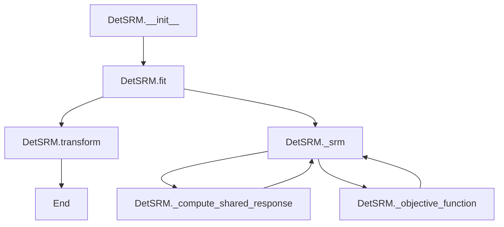

# `srm.py`

## `hypertools._externals.srm._init_w_transforms` · *function*

## Summary:
Initializes weight transformation matrices for subjects using random matrix QR decomposition.

## Description:
Creates random matrices for each subject in the dataset and performs QR decomposition to generate orthogonal weight matrices. This function is typically used to initialize transformation matrices in shared response models where each subject contributes a set of orthogonal basis vectors.

## Args:
    data (list): List of subject data arrays, where each array represents neuroimaging data for a subject. Each array should have shape (n_voxels, n_features).
    features (int): Number of features to use for the transformation matrices. Must be a positive integer.

## Returns:
    tuple: A tuple containing:
        - w (list): List of Q matrices from QR decomposition, one for each subject. Each Q matrix has shape (n_voxels, features).
        - voxels (numpy.ndarray): Array containing the number of voxels for each subject, with shape (n_subjects,).

## Raises:
    None explicitly raised in the function body, but may raise exceptions from:
        * numpy.random.random if invalid parameters are passed
        * numpy.linalg.qr if matrix operations fail

## Constraints:
    - Preconditions: 
        * data must be a list-like object with at least one element
        * features must be a positive integer
        * Each element in data should be a numpy array with at least one row
    - Postconditions:
        * w contains a list of orthogonal matrices (Q from QR decomposition)
        * voxels contains the shape[0] of each subject's data array
        * All returned matrices have compatible dimensions

## Side Effects:
    - Generates random numbers using numpy's random number generator
    - Creates new numpy arrays in memory

## Control Flow:
```mermaid
flowchart TD
    A[Start _init_w_transforms] --> B{data is not empty?}
    B -- Yes --> C[Initialize w=[], subjects=len(data), voxels=np.empty()]
    C --> D[For each subject in range(subjects)]
    D --> E[voxels[subject] = data[subject].shape[0]]
    E --> F[rnd_matrix = np.random.random((voxels[subject], features))]
    F --> G[q, r = np.linalg.qr(rnd_matrix)]
    G --> H[w.append(q)]
    H --> I[Return w, voxels]
    B -- No --> J[Return w, voxels (empty)]
```

## Examples:
```python
# Basic usage with sample data
import numpy as np
data = [np.random.rand(100, 50), np.random.rand(120, 50)]
features = 25
w, voxels = _init_w_transforms(data, features)
print(f"Number of subjects: {len(w)}")
print(f"Voxel counts: {voxels}")
print(f"Shape of first subject's transform: {w[0].shape}")

# Edge case with single subject
single_subject_data = [np.random.rand(80, 30)]
w_single, voxels_single = _init_w_transforms(single_subject_data, 15)
print(f"Single subject transform shape: {w_single[0].shape}")
```

## `hypertools._externals.srm.SRM` · *class*

*No documentation generated.*

### `hypertools._externals.srm.SRM.__init__` · *method*

## Summary:
Initializes the Shared Response Model with configurable hyperparameters for probabilistic shared feature extraction.

## Description:
Configures the probabilistic Shared Response Model (SRM) with specified hyperparameters. This method sets up the core configuration parameters that control the model's training process and feature extraction behavior. The SRM is designed for neuroimaging data analysis to identify shared neural responses across multiple subjects.

## Args:
    n_iter (int): Number of iterations for the Expectation-Maximization algorithm. Defaults to 10.
    features (int): Number of shared features to extract from the multi-subject data. Defaults to 50.
    rand_seed (int): Random seed for reproducible results. Defaults to 0.

## Returns:
    None: This method initializes instance attributes and does not return a value.

## Raises:
    None: This method does not explicitly raise exceptions.

## State Changes:
    Attributes READ: No attributes are read from the instance.
    Attributes WRITTEN: 
    - self.n_iter: Stores the number of iterations for model training
    - self.features: Stores the number of shared features to extract
    - self.rand_seed: Stores the random seed for reproducibility

## Constraints:
    Preconditions: All arguments must be non-negative integers.
    Postconditions: Instance attributes n_iter, features, and rand_seed are set to the provided values.

## Side Effects:
    None: This method performs no I/O operations or external service calls. It only sets instance attributes.

### `hypertools._externals.srm.SRM.fit` · *method*

## Summary:
 Fits the probabilistic Shared Response Model (SRM) to multi-subject neuroimaging data by computing shared response patterns and subject-specific transformations.

## Description:
This method trains the probabilistic SRM model on multi-subject data by performing iterative optimization to find shared neural response patterns across subjects. It validates input data integrity, ensures consistent dimensions across subjects, and computes model parameters through the internal `_srm` method. The method is typically called during the model training phase as part of a machine learning pipeline for neuroimaging data analysis.

## Args:
    X (list[np.ndarray]): List of subject data matrices where each matrix has shape (n_features, n_samples) representing neuroimaging data from different subjects. All matrices must have the same number of samples.
    y (None): Optional target variable (unused in this implementation). Defaults to None.

## Returns:
    SRM: Returns self to enable method chaining for fluent API usage.

## Raises:
    ValueError: Raised when:
        - There are fewer than 2 subjects in the input data
        - The number of samples in the first subject is less than the requested number of features
        - Subjects have inconsistent numbers of samples

## State Changes:
    Attributes READ: 
        - self.features: Used to validate minimum sample requirements
    Attributes WRITTEN:
        - self.sigma_s_: Estimated covariance matrix of shared responses
        - self.w_: List of subject-specific transformation matrices
        - self.mu_: List of subject-specific mean vectors
        - self.rho2_: List of noise variance estimates for each subject
        - self.s_: Shared response matrix

## Constraints:
    Preconditions:
        - X must be a list containing at least 2 subject data matrices
        - Each subject matrix must contain finite numerical values
        - All subject matrices must have the same number of samples (timepoints)
        - The first subject matrix must have at least as many samples as self.features
        
    Postconditions:
        - Model parameters are computed and stored in instance attributes
        - All instance attributes related to model parameters are populated
        - Method returns self for method chaining

## Side Effects:
    - Writes informational log messages at INFO level during execution
    - Sets numpy random seed using self.rand_seed for reproducible results
    - Performs multiple numpy array operations and linear algebra computations

### `hypertools._externals.srm.SRM.transform` · *method*

## Summary:
Transforms multi-subject neuroimaging data into shared response space using fitted transformation weights.

## Description:
Applies the previously fitted subject-specific transformation matrices to project input data into a common shared response space. This method performs a matrix multiplication operation where each subject's data is transformed using the corresponding weight matrix from the fitted model. It is typically called after fitting the SRM model with the `fit` method and is used to transform new or validation data into the shared representation space for downstream analysis.

## Args:
    X (list): List of subject data matrices, where each matrix represents neuroimaging data for a subject with shape (n_voxels, n_timepoints). The number of subjects must match the number of subjects used during fitting.
    y (None): Ignored parameter that exists for scikit-learn compatibility. Defaults to None.

## Returns:
    list: A list of transformed data matrices, where each matrix represents the subject's data projected into the shared response space with shape (n_features, n_timepoints). Each matrix corresponds to the respective subject in the input list.

## Raises:
    sklearn.utils.validation.NotFittedError: Raised when the transform method is called before the model has been fitted (i.e., when `w_` attribute is not present).
    ValueError: Raised when the number of subjects in the input data does not match the number of subjects used during model fitting.

## State Changes:
    Attributes READ: 
        - self.w_: List of subject-specific transformation matrices computed during fitting, each with shape (n_voxels, n_features)
    Attributes WRITTEN: None

## Constraints:
    Preconditions:
        - The SRM model must have been fitted using the `fit` method before calling this transform method
        - The input X must be a list with the same number of subjects as were used during fitting
        - Each subject's data matrix must have compatible dimensions with the corresponding transformation matrix (n_voxels rows)
        - All subject data matrices must contain finite numerical values
        
    Postconditions:
        - The method returns transformed data in shared response space
        - No modifications are made to the instance's state
        - Each transformed matrix has shape (n_features, n_timepoints)

## Side Effects:
    None

### `hypertools._externals.srm.SRM._init_structures` · *method*

## Summary:
Initializes data structures for Statistical Reuse Method (SRM) processing by computing centered data matrices, means, and trace values for each subject.

## Description:
This method prepares the initial data structures required for SRM analysis by processing input data for multiple subjects. It computes the mean vectors for each subject's data, centers the data around these means, and calculates trace values needed for subsequent SRM computations. The method is designed to be called during the initialization phase of SRM processing.

## Args:
    data (array-like): Multi-dimensional array containing data for each subject, where each subject's data is stored as a separate matrix
    subjects (int): Number of subjects in the dataset

## Returns:
    tuple: Four-element tuple containing:
        - x (list): List of centered data matrices for each subject
        - mu (list): List of mean vectors for each subject  
        - rho2 (numpy.ndarray): Array of variance scaling factors (initialized to 1.0) for each subject
        - trace_xtx (numpy.ndarray): Array of trace values (sum of squared elements) for each subject's data

## Raises:
    None explicitly raised

## State Changes:
    - Attributes READ: None (this is a method that doesn't modify instance state directly)
    - Attributes WRITTEN: None (this method returns results rather than modifying self)

## Constraints:
    - Preconditions: 
        * data should be a list or array-like structure with length equal to subjects
        * subjects should be a positive integer
    - Postconditions:
        * x contains centered data matrices (data minus mean for each subject)
        * mu contains mean vectors for each subject
        * rho2 is initialized with ones for each subject
        * trace_xtx contains sum of squares for each subject's data

## Side Effects:
    - None

### `hypertools._externals.srm.SRM._likelihood` · *method*

*No documentation generated.*

### `hypertools._externals.srm.SRM._srm` · *method*

## Summary:
Computes shared response model parameters through iterative optimization of subject-specific transformations and shared responses.

## Description:
This private method implements the core iterative Expectation-Maximization algorithm for Shared Response Model (SRM) estimation. It jointly optimizes subject-specific linear transformations (w), shared neural responses, and model parameters across multiple subjects to find a common representation that captures shared neural activity patterns.

The method initializes model parameters and iteratively updates them using closed-form solutions for the optimization steps, computing subject-specific transformation matrices, shared responses, and noise variances. This implementation follows the mathematical formulation of the SRM algorithm for multi-subject neuroimaging data analysis.

## Args:
    data (list[np.ndarray]): List of subject data matrices where each matrix has shape (features, samples) representing neuroimaging data from different subjects.

## Returns:
    tuple: A tuple containing:
        - sigma_s (np.ndarray): Estimated covariance matrix of shared responses with shape (self.features, self.features)
        - w (list[np.ndarray]): List of subject-specific transformation matrices, each with shape (self.features, self.features)
        - mu (list[np.ndarray]): List of subject-specific mean vectors, each with shape (self.features, 1)
        - rho2 (list[float]): List of noise variance estimates for each subject
        - shared_response (np.ndarray): Shared response matrix with shape (self.features, samples)

## Raises:
    scipy.linalg.LinAlgError: When Cholesky decomposition or matrix inversion fails during optimization
    numpy.linalg.LinAlgError: When singular value decomposition fails during transformation updates

## State Changes:
    Attributes READ: 
        - self.rand_seed
        - self.features
        - self.n_iter
    Attributes WRITTEN: 
        - None (method is pure computation returning results)

## Constraints:
    Preconditions:
        - Input data must be a list of numpy arrays with consistent feature dimensions
        - Data matrices should contain finite values
        - self.features must be a positive integer
        - self.n_iter must be a positive integer
        - Each data matrix should have at least one sample (samples > 0)
        - Data matrices should not contain infinite or NaN values
    Postconditions:
        - All returned matrices have appropriate shapes matching the input data dimensions
        - Returned parameters represent optimized model estimates from the iterative process
        - Subject-specific transformation matrices are orthogonal (unitary)

## Side Effects:
    - Sets random seed using self.rand_seed for reproducible results
    - Writes iteration progress information to logger at INFO level
    - Computes and logs objective function values during optimization

## `hypertools._externals.srm.DetSRM` · *class*

## Summary:
DetSRM implements a deterministic Shared Response Model for aligning multi-subject neuroimaging data by finding common response patterns across subjects.

## Description:
The DetSRM class provides a scikit-learn compatible transformer for fitting and transforming neuroimaging data to extract shared response patterns across multiple subjects. It implements a deterministic version of the Shared Response Model algorithm that aligns data from different subjects by finding a common feature space. This is commonly used in neuroimaging research to identify shared neural responses across participants.

The class follows scikit-learn's BaseEstimator and TransformerMixin interfaces, making it compatible with sklearn pipelines and preprocessing workflows. It can be used to find common neural activation patterns across multiple subjects in fMRI or other neuroimaging studies.

## State:
- n_iter: int, default=10
  - Number of iterations for the alternating optimization algorithm
  - Valid range: positive integers
  - Invariant: must be >= 1 for meaningful execution

- features: int, default=50
  - Number of shared features to extract from the data
  - Valid range: positive integers
  - Invariant: must be <= number of samples per subject for valid computation

- rand_seed: int, default=0
  - Random seed for reproducible initialization of weight matrices
  - Valid range: any integer
  - Invariant: affects initialization randomness but not final results once fitted

- w_: list of numpy.ndarray
  - Weight transformation matrices for each subject (set during fit)
  - Shape: list of arrays, each with shape (n_voxels, features)
  - Invariant: populated after successful fit() call

- s_: numpy.ndarray
  - Shared response matrix computed during fitting (set during fit)
  - Shape: (features, n_samples)
  - Invariant: populated after successful fit() call

## Lifecycle:
- Creation: Instantiate with n_iter, features, and rand_seed parameters
- Usage: Call fit() with list of subject data arrays, then transform() with new data
- Destruction: No explicit cleanup required; relies on Python garbage collection

## Method Map:


## Raises:
- ValueError: Raised in fit() when:
  - Number of subjects is less than or equal to 1
  - Insufficient samples for requested features (X[0].shape[1] < self.features)
  - Inconsistent number of samples between subjects (different shape[1] values)
- NotFittedError: Raised in transform() when fit() has not been called yet
- ValueError: Raised in transform() when number of subjects doesn't match fitted model (len(X) != len(self.w_))

## Example:
```python
import numpy as np
from hypertools._externals.srm import DetSRM

# Create sample neuroimaging data for 3 subjects
subjects_data = [
    np.random.rand(100, 50),  # Subject 1: 100 voxels, 50 samples
    np.random.rand(100, 50),  # Subject 2: 100 voxels, 50 samples  
    np.random.rand(100, 50)   # Subject 3: 100 voxels, 50 samples
]

# Initialize and fit the model
srm_model = DetSRM(n_iter=20, features=25, rand_seed=42)
srm_model.fit(subjects_data)

# Transform new data using the fitted model
transformed_data = srm_model.transform(subjects_data)

# Access the learned shared response
shared_response = srm_model.s_

# The transformed data contains each subject's representation in the shared space
print(f"Transformed data shapes: {[x.shape for x in transformed_data]}")
```

### `hypertools._externals.srm.DetSRM.__init__` · *method*

## Summary:
Initializes a DetSRM instance with configuration parameters for the deterministic Shared Response Model.

## Description:
Configures the DetSRM object with hyperparameters controlling the iterative fitting process and feature extraction. This constructor establishes the fundamental parameters that govern how the Shared Response Model will align multi-subject neuroimaging data during the fitting process.

The method is separated from the class body to allow for clean parameter validation and initialization while maintaining compatibility with scikit-learn's estimator interface. It ensures that all configuration parameters are properly stored as instance attributes before the model is fitted to data.

## Args:
    n_iter (int, optional): Number of iterations for the alternating optimization algorithm. Defaults to 10. Must be a positive integer.
    features (int, optional): Number of shared features to extract from the data. Defaults to 50. Must be a positive integer less than or equal to the number of samples per subject.
    rand_seed (int, optional): Random seed for reproducible initialization of weight matrices. Defaults to 0. Any integer value is acceptable.

## Returns:
    None: This method does not return any value.

## Raises:
    None: This method does not raise any exceptions directly.

## State Changes:
    Attributes READ: None
    Attributes WRITTEN: 
        - self.n_iter: Stores the number of iterations parameter
        - self.features: Stores the number of features parameter  
        - self.rand_seed: Stores the random seed parameter

## Constraints:
    Preconditions:
        - n_iter must be a positive integer (>= 1) for meaningful execution
        - features must be a positive integer (>= 1) and <= number of samples per subject
        - rand_seed can be any integer value

    Postconditions:
        - All three parameters are stored as instance attributes
        - Instance is ready for subsequent fit() operations

## Side Effects:
    None: This method performs no I/O operations or external service calls. It only assigns parameters to instance attributes.

### `hypertools._externals.srm.DetSRM.fit` · *method*

## Summary:
Trains the Deterministic Shared Response Model by validating input data and computing shared response weight matrices and space.

## Description:
Validates input neuroimaging data from multiple subjects and computes the shared response model parameters. This method serves as the primary training interface for the DetSRM estimator, performing validation checks on data consistency and calling the internal `_srm` method to compute the model parameters. The fitted model stores weight matrices in `self.w_` and shared response space in `self.s_`.

This method is called during the model training phase of the scikit-learn estimator lifecycle, specifically when users call `model.fit(X)` where X is a list of subject data matrices.

## Args:
    X (list): List of subject data matrices, where each matrix represents neuroimaging data for a subject with shape (n_voxels, n_timepoints).
    y (None): Ignored parameter that exists for scikit-learn compatibility.

## Returns:
    self: Returns the fitted DetSRM instance for method chaining.

## Raises:
    ValueError: Raised when:
        - There are not enough subjects (less than or equal to 1) to train the model
        - There are not enough samples in the first subject to train with the specified number of features
        - Different subjects have inconsistent numbers of timepoints (samples)

## State Changes:
    Attributes READ: self.features
    Attributes WRITTEN: self.w_, self.s_

## Constraints:
    Preconditions:
        * X must be a list with at least 2 elements (subjects)
        * Each subject's data matrix must have the same number of timepoints (columns)
        * Each subject's data matrix must have at least `self.features` columns
        * All subject data matrices must contain finite values (no NaN or infinity)
    
    Postconditions:
        * Model is trained and ready for transformation
        * `self.w_` contains weight matrices for each subject
        * `self.s_` contains the computed shared response space

## Side Effects:
    - Logs informational messages at INFO level via logger
    - Calls `assert_all_finite` to validate input data
    - Mutates the instance's `self.w_` and `self.s_` attributes

### `hypertools._externals.srm.DetSRM.transform` · *method*

## Summary:
Transforms input data using pre-trained shared response model weights.

## Description:
Applies the learned transformation matrices to new data samples. This method projects input data onto the shared response space using weights computed during the model fitting process. It is typically called after `fit()` has been executed to transform new datasets with the same structure as the training data.

## Args:
    X (list): List of subject data arrays, where each array represents neuroimaging data for a subject. Each array should have shape (n_voxels, n_timepoints).
    y (None): Placeholder parameter for scikit-learn compatibility, not used in this implementation.

## Returns:
    list: List of transformed subject data arrays, where each array has shape (n_features, n_timepoints). Each transformed array represents the input data projected onto the shared response space.

## Raises:
    sklearn.utils.validation.NotFittedError: When the model has not been fitted yet (i.e., w_ attribute is missing).
    ValueError: When the number of subjects in X does not match the number of subjects in the fitted model.

## State Changes:
    - Attributes READ: self.w_
    - Attributes WRITTEN: None

## Constraints:
    - Preconditions: 
        * Model must be fitted (w_ attribute must exist)
        * Number of subjects in X must equal number of subjects in fitted model
        * Each subject's data in X must have compatible dimensions with corresponding weights
    - Postconditions:
        * Returns transformed data with same number of subjects as input
        * Each transformed subject has shape (n_features, n_timepoints)

## Side Effects:
    - None

### `hypertools._externals.srm.DetSRM._objective_function` · *method*

## Summary:
Computes the Frobenius norm-based objective function value for the Deterministic SRM model.

## Description:
This method calculates the objective function value used in the Deterministic SRM (Shared Response Model) optimization process. It measures the reconstruction error between the original multi-subject data and the reconstructed data using the subject-specific weight matrices and shared response space. The method is called during the iterative optimization procedure to monitor convergence and evaluate model fit.

## Args:
    data (list of ndarray): List of subject data matrices, where each matrix has shape (voxels, time_points)
    w (list of ndarray): List of subject-specific weight matrices, where each matrix has shape (voxels, features)
    s (ndarray): Shared response space matrix with shape (features, time_points)

## Returns:
    float: The computed objective function value, scaled by half the number of time points

## Raises:
    None explicitly raised

## State Changes:
    Attributes READ: None
    Attributes WRITTEN: None

## Constraints:
    Preconditions:
    - data must be a list of numpy arrays with consistent time dimensions
    - w must be a list of matrices with compatible dimensions to data
    - s must have appropriate dimensions for matrix multiplication with w elements
    - All matrices should contain finite numerical values

    Postconditions:
    - Returns a non-negative scalar value representing the reconstruction error
    - The returned value is scaled by 0.5 divided by the number of time points

## Side Effects:
    None

### `hypertools._externals.srm.DetSRM._compute_shared_response` · *method*

## Summary:
Computes the shared response by aggregating weighted transformations of multi-subject data matrices.

## Description:
This method implements the core computation for determining the shared response in a Shared Response Model (SRM). It aggregates the dot products of transposed weight matrices with corresponding data matrices across all subjects, then averages the result to produce a shared response representation that captures common patterns across multiple subjects.

The method is called during the iterative optimization process of the SRM algorithm to update the shared response estimate at each iteration.

## Args:
    data (list of array-like): List of data matrices, one for each subject, where each matrix has shape (voxels, time_points)
    w (list of array-like): List of weight matrices, one for each subject, where each matrix has shape (voxels, features)

## Returns:
    array-like: Shared response matrix with shape (features, time_points), representing the common response pattern across all subjects

## Raises:
    None explicitly raised, but depends on underlying numpy operations that may raise exceptions for invalid inputs

## State Changes:
    Attributes READ: None - this is a pure computation method
    Attributes WRITTEN: None - this is a pure computation method

## Constraints:
    Preconditions:
    - Both `data` and `w` must be lists of equal length (number of subjects)
    - Each element in `w` must have compatible dimensions with corresponding elements in `data`
    - Each matrix in `data` must have the same number of time points
    - Each matrix in `w` must have the same number of features as the first element in `w`
    
    Postconditions:
    - The returned matrix has dimensions (features, time_points) where features comes from w[0].shape[1] and time_points comes from data[0].shape[1]

## Side Effects:
    None - this method performs only local computations and returns a new array

### `hypertools._externals.srm.DetSRM._srm` · *method*

## Summary:
Performs alternating optimization to compute shared response model weight matrices and shared response space across multiple subjects.

## Description:
Implements the core iterative algorithm for Deterministic Shared Response Models (SRM) that finds shared response patterns across multiple subjects. The method alternates between updating subject-specific weight matrices and computing the shared response space until convergence or maximum iterations are reached. This method is called internally by the `fit` method of the DetSRM class during model training.

## Args:
    data (list): List of subject data matrices, where each matrix represents neuroimaging data for a subject with shape (n_voxels, n_timepoints).

## Returns:
    tuple: A tuple containing:
        - w (list): List of optimized weight matrices, one for each subject, with shape (n_voxels, features).
        - shared_response (numpy.ndarray): Shared response matrix with shape (features, n_timepoints).

## Raises:
    None explicitly raised, but may propagate exceptions from:
        * numpy operations in SVD computation
        * internal helper functions like _init_w_transforms, _compute_shared_response, _objective_function

## State Changes:
    Attributes READ: self.n_iter, self.features, self.rand_seed
    Attributes WRITTEN: None - this is a pure computation method

## Constraints:
    Preconditions:
        * data must be a list with at least one element
        * Each subject's data matrix must have compatible dimensions
        * self.features must be a positive integer
        * self.n_iter must be a non-negative integer
    
    Postconditions:
        * Returns optimized weight matrices with same number of subjects as input data
        * Returns shared response with features dimension matching self.features
        * Weight matrices are orthogonal (result of QR decomposition in initialization)
        * Algorithm converges after self.n_iter iterations or fewer

## Side Effects:
    - Sets numpy random seed using self.rand_seed for reproducible results
    - May log informational messages at INFO logging level during execution
    - Performs multiple numpy linear algebra operations including SVD and matrix multiplications

