# `hypertools._shared`

## Tree:
_shared/
├── exceptions.py
├── helpers.py
└── params.py

## Role:
Provides foundational utilities, shared data structures, and common error handling mechanisms for the hypertools library.

## Description:
The `_shared` module serves as a central repository for reusable components that are utilized across multiple modules within the hypertools library. It encapsulates common functionality such as data processing helpers, error definitions, and parameter management that would otherwise be duplicated throughout the codebase.

This module acts as a utility layer that abstracts away common operations and provides consistent interfaces for data manipulation, error handling, and configuration management. Its cohesive design ensures that all components within the library can rely on a consistent set of shared utilities.

## Components:
- **HypertoolsError**: Base exception class for library-specific errors
- **HypertoolsBackendError**: Specialized exception for backend-related failures
- **HypertoolsIOError**: Custom I/O exception extending both HypertoolsError and OSError
- **center**: Centers arrays by subtracting the mean of all arrays from each array
- **check_geo**: Processes DataGeometry objects to decode byte-encoded data
- **convert_text**: Converts text data into standardized numpy array format
- **get_dtype**: Identifies and returns the data type identifier for input data
- **get_type**: Determines and returns the categorical type identifier for input data
- **group_by_category**: Converts categorical values into numeric group identifiers
- **interp_array**: Performs piecewise cubic Hermite interpolation on an array
- **interp_array_list**: Applies interpolation to a list of arrays uniformly
- **is_line**: Determines whether a matplotlib format string represents a line style
- **memoize**: Implements a memoization decorator for caching function results
- **parse_args**: Transforms a list of arguments into per-item argument tuples
- **parse_kwargs**: Creates a list of keyword argument dictionaries for items
- **patch_lines**: Appends the first row of each subsequent array to the preceding array
- **reshape_data**: Reorganizes data points into category-specific groups
- **scale**: Scales input data to a normalized range of [-1, 1]
- **vals2bins**: Converts numerical values into discrete bins based on resolution
- **vals2colors**: Maps numerical values to RGB color tuples using a colormap
- **default_params**: Returns default parameters for a specified model with optional updates

```mermaid
graph TD
    A[HypertoolsError] --> B[HypertoolsBackendError]
    A[HypertoolsError] --> C[HypertoolsIOError]
    D[get_type] --> E[convert_text]
    D[get_type] --> F[group_by_category]
    D[get_type] --> G[reshape_data]
    D[get_type] --> H[vals2colors]
    D[get_type] --> I[vals2bins]
    D[get_type] --> J[parse_args]
    D[get_type] --> K[parse_kwargs]
    D[get_type] --> L[get_dtype]
    M[center] --> N[scale]
    M[center] --> O[interp_array_list]
    P[interp_array] --> O
    Q[patch_lines] --> R[reshape_data]
    S[memoize] --> T[helper functions]
    U[default_params] --> V[params.py]
    W[check_geo] --> X[helpers.py]
```

## Public API:
- **HypertoolsError**: Base exception class for library-specific errors
- **HypertoolsBackendError**: Exception for backend-related failures
- **HypertoolsIOError**: Exception for I/O related failures
- **center**: Centers arrays by subtracting the mean of all arrays from each array
- **check_geo**: Processes DataGeometry objects to decode byte-encoded data
- **convert_text**: Converts text data into standardized numpy array format
- **get_dtype**: Identifies and returns the data type identifier for input data
- **get_type**: Determines and returns the categorical type identifier for input data
- **group_by_category**: Converts categorical values into numeric group identifiers
- **interp_array**: Performs piecewise cubic Hermite interpolation on an array
- **interp_array_list**: Applies interpolation to a list of arrays uniformly
- **is_line**: Determines whether a matplotlib format string represents a line style
- **memoize**: Decorator for caching function call results
- **parse_args**: Transforms a list of arguments into per-item argument tuples
- **parse_kwargs**: Creates a list of keyword argument dictionaries for items
- **patch_lines**: Appends the first row of each subsequent array to the preceding array
- **reshape_data**: Reorganizes data points into category-specific groups
- **scale**: Scales input data to a normalized range of [-1, 1]
- **vals2bins**: Converts numerical values into discrete bins based on resolution
- **vals2colors**: Maps numerical values to RGB color tuples using a colormap
- **default_params**: Returns default parameters for a specified model with optional updates

## Dependencies:
- **Internal imports**: 
  - `datageometry.DataGeometry` (for check_geo function)
  - `numpy` (for array operations in most helper functions)
  - `pandas` (for DataFrame type identification in get_dtype/get_type)
  - `seaborn` (for color mapping in vals2colors)
  - `itertools` (for flattening nested lists in vals2colors)
  - `matplotlib.lines` (for is_line function)
- **External imports**:
  - `numpy` (core numerical operations)
  - `pandas` (DataFrame type handling)
  - `seaborn` (color palette generation)
  - `itertools` (list flattening)
  - `matplotlib.lines` (line vs marker detection)

## Constraints:
- All helper functions must maintain immutability of input data where possible
- Exception classes must preserve inheritance chain integrity
- Parameter functions must ensure deep copying of default configurations
- Data processing functions must handle edge cases gracefully (empty inputs, incompatible types)
- Memoization decorator must handle hashable arguments only
- Thread safety: Most functions are stateless and thus inherently thread-safe
- Initialization: No special initialization required for module usage

---

## Files

- [`exceptions.py`](_shared/exceptions.md)
- [`helpers.py`](_shared/helpers.md)
- [`params.py`](_shared/params.md)

