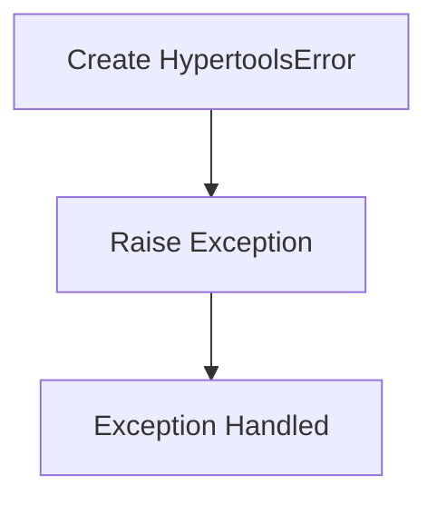
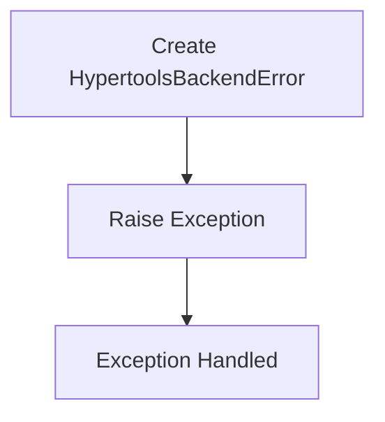
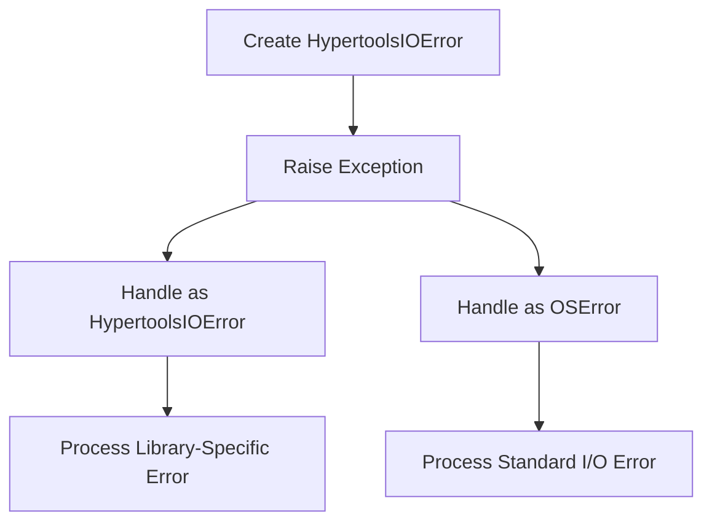

# `exceptions.py`

## `hypertools._shared.exceptions.HypertoolsError` · *class*

## Summary:
Base exception class for the hypertools library that provides a common error type for library-specific exceptions.

## Description:
HypertoolsError serves as the root exception class for all custom exceptions within the hypertools library. It provides a distinct exception hierarchy that allows users to catch library-specific errors while maintaining compatibility with standard Python exception handling. This class should be inherited by more specific exception types within the library to provide meaningful error categorization.

The motivation for having this base exception class is to enable clean error handling patterns where library users can catch all hypertools-related exceptions using a single except clause, while still allowing for more specific exception handling when needed.

## State:
This class has no instance attributes beyond those inherited from Python's built-in Exception class. The constructor accepts the standard Exception arguments including message strings and can accept arbitrary positional and keyword arguments that become part of the exception's representation.

## Lifecycle:
Creation: Instances are created by calling the class constructor with appropriate arguments (typically a descriptive error message). The class can be instantiated directly or through inheritance by more specific exception subclasses.

Usage: Once created, instances behave like standard Python exceptions and can be raised using the 'raise' statement or re-raised using 'raise' without arguments.

Destruction: No special cleanup is required as Python handles exception object lifecycle automatically.

## Method Map:


## Raises:
This class itself does not raise any exceptions during construction. However, like all Python exceptions, it can be raised during program execution when encountered in code flow.

## Example:
```python
# Basic usage
try:
    raise HypertoolsError("Something went wrong in hypertools")
except HypertoolsError as e:
    print(f"Caught exception: {e}")

# Inheritance pattern
class DataProcessingError(HypertoolsError):
    pass

try:
    raise DataProcessingError("Failed to process data")
except HypertoolsError as e:
    print(f"Caught library error: {e}")
```

## `hypertools._shared.exceptions.HypertoolsBackendError` · *class*

## Summary:
Custom exception class representing backend-related errors in the hypertools library.

## Description:
HypertoolsBackendError is a specialized exception class that extends HypertoolsError to represent errors originating from backend operations within the hypertools library. This exception type is specifically designed to handle situations where backend services or components fail during operation, providing a clear distinction from other types of hypertools errors.

The motivation for this separate exception class is to enable more granular error handling for backend-specific failures, allowing library users to differentiate between frontend/user-facing errors and backend infrastructure issues. This promotes cleaner error handling patterns where specific backend problems can be caught and handled appropriately without affecting general error handling flows.

## State:
- message (str): The error message describing the backend failure. This is initialized from the constructor argument and stored as an instance attribute. Valid values are any string describing the backend error condition. The message is passed to the parent HypertoolsError constructor and also stored as a direct instance attribute.

## Lifecycle:
Creation: Instances are created by calling the constructor with a descriptive error message string. The constructor properly initializes the parent HypertoolsError class and stores the message as an instance attribute.

Usage: Once created, instances behave like standard Python exceptions and can be raised using the 'raise' statement or re-raised using 'raise' without arguments.

Destruction: No special cleanup is required as Python handles exception object lifecycle automatically.

## Method Map:


## Raises:
This class does not raise any exceptions during initialization. Like all Python exceptions, it can be raised during program execution when encountered in code flow.

## Example:
```python
# Basic usage
try:
    raise HypertoolsBackendError("Database connection failed")
except HypertoolsBackendError as e:
    print(f"Backend error occurred: {e}")

# Usage in a function that might encounter backend issues
def connect_to_backend():
    # Simulate a backend connection failure
    raise HypertoolsBackendError("Failed to establish connection to backend service")
```

### `hypertools._shared.exceptions.HypertoolsBackendError.__init__` · *method*

## Summary:
Initializes a HypertoolsBackendError instance with a descriptive error message.

## Description:
The constructor for HypertoolsBackendError creates an exception instance that can be raised to indicate backend-related failures within the hypertools library. This method properly initializes the parent HypertoolsError class and stores the provided message as an instance attribute for later retrieval.

This method is called during exception instantiation when backend operations fail, such as database connections, API calls, or other infrastructure-level issues. The method ensures proper inheritance from the exception hierarchy while preserving the error message for debugging and logging purposes.

## Args:
    message (str): A descriptive error message explaining the backend failure. This string is passed to the parent exception constructor and stored as an instance attribute.

## Returns:
    None: This method does not return a value. It initializes the instance state.

## Raises:
    None: This method does not explicitly raise exceptions during initialization.

## State Changes:
    Attributes READ: None
    Attributes WRITTEN: 
        - self.message: Stores the provided error message as an instance attribute

## Constraints:
    Preconditions:
        - The message parameter must be a string or convertible to string
        - This method should only be called during object instantiation
    
    Postconditions:
        - The instance is properly initialized with the provided message
        - The parent HypertoolsError class is correctly initialized
        - The message attribute is set and accessible via self.message

## Side Effects:
    None: This method performs no I/O operations, external service calls, or mutations to objects outside the instance being constructed.

## `hypertools._shared.exceptions.HypertoolsIOError` · *class*

## Summary:
Custom exception class for I/O related errors in the hypertools library that extends both HypertoolsError and OSError.

## Description:
HypertoolsIOError is a specialized exception type designed to represent input/output related failures within the hypertools library. This exception inherits from both HypertoolsError (the library's base exception class) and OSError (Python's built-in I/O exception class), providing a unified error handling interface that maintains compatibility with both library-specific and standard Python I/O error handling patterns.

This exception should be raised when I/O operations fail within hypertools components, such as file reading/writing issues, network connectivity problems, or other filesystem-related errors that occur during hypertools processing. The dual inheritance allows users to catch I/O specific errors either as HypertoolsIOError instances or as OSError instances, providing flexibility in error handling strategies.

The motivation for this specific exception type is to provide more granular error handling than generic HypertoolsError while maintaining compatibility with standard Python I/O error handling patterns.

## State:
- message (str): The error message describing the I/O failure. This is stored as an instance attribute and must be a string. There are no constraints on the message content beyond it being a string. The message is accessible via the standard Exception.message attribute.

## Lifecycle:
- Creation: Instantiate using `HypertoolsIOError(message)` where message is a descriptive string explaining the I/O error.
- Usage: Raise the exception using `raise HypertoolsIOError("error message")` or re-raise with `raise` in exception handlers.
- Destruction: No special cleanup required as Python manages exception object lifecycle.

## Method Map:


## Raises:
This class does not explicitly raise exceptions during initialization. It inherits the standard behavior of Python exceptions, which can be raised during program execution when I/O operations fail.

## Example:
```python
# Creating and raising the exception
try:
    with open('data.csv', 'r') as f:
        data = f.read()
except IOError as e:
    # Convert standard I/O error to hypertools-specific exception
    raise HypertoolsIOError(f"Failed to read data file: {e}")

# Catching the exception with library-specific handling
try:
    load_dataset('dataset.json')
except HypertoolsIOError as e:
    print(f"Hypertools I/O Error occurred: {e}")
    # Handle the I/O error specifically for hypertools

# Catching with standard error handling
try:
    process_data()
except OSError as e:
    print(f"Standard I/O Error occurred: {e}")
    # Handle using standard Python I/O error handling
```

### `hypertools._shared.exceptions.HypertoolsIOError.__init__` · *method*

## Summary:
Initializes a HypertoolsIOError instance with a descriptive error message.

## Description:
The `__init__` method constructs a new HypertoolsIOError instance by calling the parent class constructor and storing the provided error message as an instance attribute. This method serves as the primary constructor for creating I/O related exceptions within the hypertools library.

This method is called during the instantiation of HypertoolsIOError objects, typically when an I/O operation fails within hypertools components. The method ensures proper initialization of both the exception's parent class state and its own message attribute.

## Args:
    message (str): A descriptive error message explaining the I/O failure that occurred. This parameter is required and must be a string.

## Returns:
    None: This method does not return a value. It initializes the instance state.

## Raises:
    None: This method does not explicitly raise exceptions during initialization. Exceptions may be raised by the parent class constructor if invalid arguments are provided.

## State Changes:
    Attributes READ: None
    Attributes WRITTEN: 
        - self.message: Stores the provided error message as an instance attribute

## Constraints:
    Preconditions:
        - The message parameter must be a string
        - The message parameter must not be None
    
    Postconditions:
        - The instance is properly initialized with the provided message
        - The instance inherits all behaviors from both HypertoolsError and OSError parent classes

## Side Effects:
    None: This method performs no I/O operations or external service calls. It only initializes internal object state.

