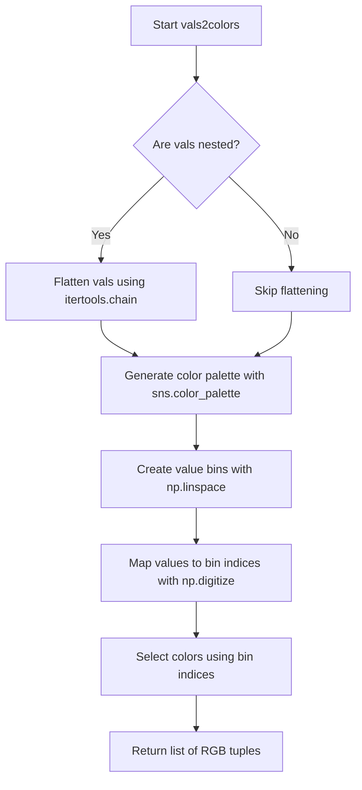
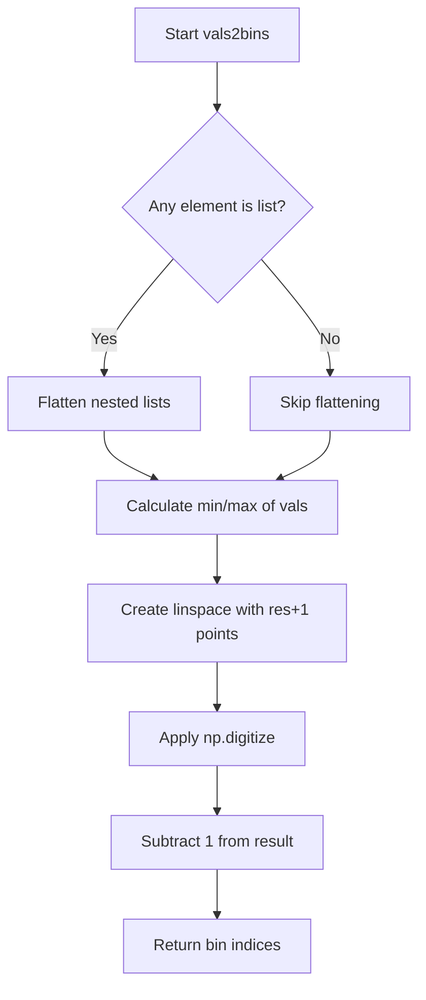
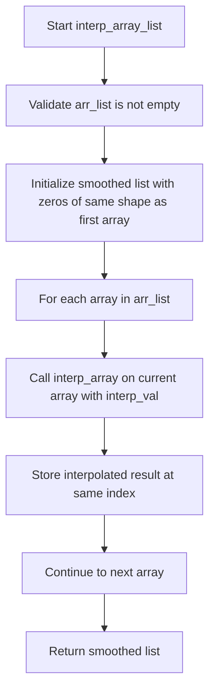
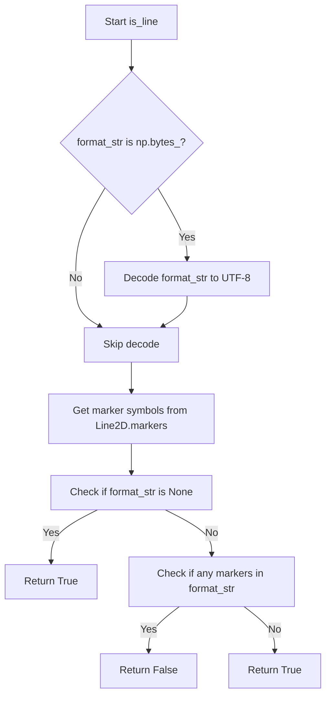
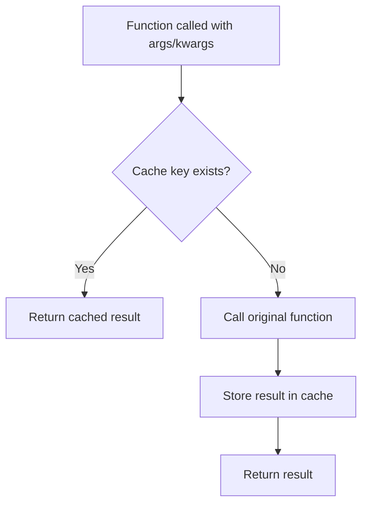

# `helpers.py`

## `hypertools._shared.helpers.center` · *function*

## Summary:
Centers a list of arrays by subtracting the mean of all arrays from each array.

## Description:
This function performs mean-centering on a collection of arrays by computing the mean across all arrays and subtracting it from each individual array. This is commonly used in data preprocessing to remove overall bias or shift data to have zero mean.

## Args:
    x (list): A list of arrays (or array-like objects) to be centered. All arrays must have the same shape.

## Returns:
    list: A new list containing the centered versions of the input arrays, where each array has had the mean of all input arrays subtracted from it.

## Raises:
    AssertionError: If the input x is not a list.

## Constraints:
    Preconditions:
        - Input x must be a list
        - All elements in the list must be array-like objects with compatible shapes
    Postconditions:
        - The returned list contains elements with the same shapes as the input elements
        - Each returned array has been shifted such that its mean is zero (relative to the overall mean)

## Side Effects:
    None

## Control Flow:
```mermaid
flowchart TD
    A[Start center(x)] --> B{Is x a list?}
    B -- No --> C[Assertion Error]
    B -- Yes --> D[Stack arrays with np.vstack]
    D --> E[Compute mean across all arrays]
    E --> F[Subtract mean from each array]
    F --> G[Return centered list]
```

## Examples:
```python
# Basic usage with lists of arrays
data = [[1, 2, 3], [4, 5, 6], [7, 8, 9]]
centered_data = center(data)
# Result: [[-3, -3, -3], [0, 0, 0], [3, 3, 3]]

# With different shaped arrays
data = [[1, 2], [3, 4]]
centered_data = center(data)
# Result: [[-1, -1], [1, 1]]
```

## `hypertools._shared.helpers.scale` · *function*

## Summary:
Scales input data to a normalized range of [-1, 1] using min-max normalization with a custom transformation.

## Description:
This function performs min-max normalization on a list of numerical arrays or lists, transforming the data so that all values fall within the range [-1, 1]. The transformation maps the global minimum value to -1 and global maximum value to 1, with all other values scaled proportionally. This is particularly useful for preparing data for machine learning algorithms or visualization.

## Args:
    x (list): A list of arrays or lists containing numerical data that can be vertically stacked using numpy.vstack

## Returns:
    list: A list of scaled arrays or lists, where each array/list has been transformed such that:
          - The global minimum value becomes -1
          - The global maximum value becomes 1
          - All other values are scaled proportionally to the range [-1, 1]

## Raises:
    AssertionError: If the input x is not of type list
    ZeroDivisionError: If all values in the input data are identical (when max difference equals zero)

## Constraints:
    Preconditions:
        - Input x must be a list
        - All elements in the list must be compatible with numpy operations and vertically stackable via np.vstack
        - Input data must contain at least one element
    Postconditions:
        - Output list contains the same number of elements as input list
        - All values in output are within the range [-1, 1]
        - If input contains only identical values, division by zero occurs

## Side Effects:
    None

## Control Flow:
```mermaid
flowchart TD
    A[Start scale function] --> B{Input type is list?}
    B -- No --> C[AssertionError]
    B -- Yes --> D[Stack input data with np.vstack]
    D --> E[Calculate min value (m1)]
    E --> F[Calculate max difference (m2)]
    F --> G{Is m2 == 0?}
    G -- Yes --> H[ZeroDivisionError]
    G -- No --> I[Define scaling lambda function]
    I --> J[Apply scaling to each element]
    J --> K[Return scaled list]
```

## Examples:
```python
# Basic usage with nested lists
data = [[1, 2, 3], [4, 5, 6]]
scaled_data = scale(data)
# Result: approximately [[-1, -0.5, 0], [0.5, 1, 1]]

# Usage with arrays
data = [[10, 20, 30], [40, 50, 60]]
scaled_data = scale(data)
# Result: approximately [[-1, -0.5, 0], [0.5, 1, 1]]

# Edge case: all identical values (will raise ZeroDivisionError)
data = [[5, 5, 5], [5, 5, 5]]
# scaled_data = scale(data)  # Raises ZeroDivisionError
```

## `hypertools._shared.helpers.group_by_category` · *function*

## Summary:
Converts categorical values into numeric group identifiers by mapping each unique category to its position in a sorted list of unique values.

## Description:
This function performs categorical encoding by transforming input values into integer identifiers. It handles nested lists by flattening them first, then assigns each unique category an integer index based on its alphabetical/sorted order. This is commonly used for machine learning preprocessing where categorical features need to be converted to numerical representations.

## Args:
    vals (list): A list of categorical values that may include nested lists. Values can be of any hashable type (strings, numbers, etc.). The list may contain nested lists which will be flattened.

## Returns:
    list[int]: A list of integer identifiers where each integer represents the zero-based index of the corresponding input value in the sorted unique set of categories. Categories are sorted alphabetically/numerically, and each input value is mapped to its position in this sorted list.

## Raises:
    TypeError: If any element in vals is not hashable (cannot be used as a set element or dictionary key).
    AttributeError: If vals is not iterable.

## Constraints:
    Preconditions:
    - Input `vals` must be iterable
    - All elements in `vals` must be hashable (can be used as dictionary keys/set elements)
    
    Postconditions:
    - Output list has the same length as input list
    - Each returned integer is a valid index in the sorted unique set of categories
    - Returned integers are in the range [0, n) where n is the number of unique categories
    - The mapping preserves the relative ordering of categories in the sorted unique set

## Side Effects:
    None

## Control Flow:
```mermaid
flowchart TD
    A[Start group_by_category] --> B{Any element is list?}
    B -- Yes --> C[Flatten nested lists]
    B -- No --> D[Skip flattening]
    C --> D
    D --> E[Get unique values with set()]
    E --> F[Sort unique values]
    F --> G[Map each value to its index in sorted list]
    G --> H[Return result list]
```

## Examples:
    >>> group_by_category(['a', 'b', 'c', 'a'])
    [0, 1, 2, 0]
    
    >>> group_by_category([['a', 'b'], ['c', 'a']])
    [0, 1, 2, 0]
    
    >>> group_by_category([3, 1, 4, 1, 5])
    [1, 0, 2, 0, 3]
    
    >>> group_by_category(['z', 'a', 'b'])
    [2, 0, 1]
```

## `hypertools._shared.helpers.vals2colors` · *function*

## Summary:
Maps numerical values to RGB color tuples using a specified colormap and resolution.

## Description:
Converts a list of numerical values into corresponding RGB color tuples by mapping each value to a color in a continuous colormap. The function handles both flat and nested lists of values, automatically flattening nested structures before processing. This utility is commonly used for visualizing data with color gradients where each data point needs a distinct color representation.

## Args:
    vals (list): A list of numerical values or nested lists of numerical values to be converted to colors. Values must be comparable using min/max operations.
    cmap (str, optional): Name of the seaborn colormap to use. Defaults to 'GnBu' (Green-Blue colormap). Must be a valid seaborn colormap name.
    res (int, optional): Resolution of the color palette, determining the number of discrete colors in the gradient. Defaults to 100. Higher values produce smoother color transitions.

## Returns:
    list[tuple]: A list of RGB color tuples, where each tuple contains three float values representing the red, green, and blue components of the corresponding color. Each color corresponds to the input value at the same position.

## Raises:
    None explicitly raised in the function body, but may raise exceptions from underlying seaborn or numpy operations if invalid parameters are provided.

## Constraints:
    Preconditions:
    - Input vals should contain values that can be compared using min/max operations
    - cmap must be a valid seaborn colormap name
    - res should be a positive integer
    
    Postconditions:
    - Output list length matches the number of input values (after flattening)
    - Each returned tuple contains exactly three float values in the range [0.0, 1.0]

## Side Effects:
    None

## Control Flow:


## Examples:
    # Basic usage with simple values
    >>> vals2colors([1, 2, 3, 4, 5])
    [(0.5333333333333333, 0.6941176470588236, 0.7568627450980392), (0.403921568627451, 0.6588235294117647, 0.7607843137254902), (0.27058823529411763, 0.5686274509803921, 0.7490196078431373), (0.17647058823529413, 0.49019607843137253, 0.7058823529411765), (0.12941176470588237, 0.403921568627451, 0.6705882352941176)]
    
    # Usage with nested lists
    >>> vals2colors([[1, 2], [3, 4], [5]])
    [(0.5333333333333333, 0.6941176470588236, 0.7568627450980392), (0.403921568627451, 0.6588235294117647, 0.7607843137254902), (0.27058823529411763, 0.5686274509803921, 0.7490196078431373), (0.17647058823529413, 0.49019607843137253, 0.7058823529411765), (0.12941176470588237, 0.403921568627451, 0.6705882352941176)]
    
    # Usage with custom colormap and resolution
    >>> vals2colors([0.1, 0.5, 0.9], cmap='viridis', res=50)
    [(0.267004, 0.004874, 0.329415), (0.001931, 0.408222, 0.670222), (0.135623, 0.618422, 0.352222)]
```

## `hypertools._shared.helpers.vals2bins` · *function*

## Summary:
Converts numerical values into discrete bins based on a specified resolution.

## Description:
Transforms a collection of numerical values into bin indices by dividing the range of values into equally spaced intervals. This function is useful for histogram-like binning operations where values need to be categorized into discrete buckets.

## Args:
    vals (list or array-like): Collection of numerical values to be binned. Can contain nested lists which will be flattened.
    res (int, optional): Resolution parameter determining the number of bins. Defaults to 100.

## Returns:
    list[int]: List of bin indices corresponding to each input value. Bin indices range from 0 to res-1.

## Raises:
    None explicitly raised in the function body.

## Constraints:
    Preconditions:
    - vals must contain numerical values that can be processed by numpy.min() and numpy.max()
    - res must be a positive integer
    
    Postconditions:
    - Returned list contains integers in the range [0, res-1]
    - Length of returned list matches length of input vals

## Side Effects:
    None

## Control Flow:


## Examples:
    >>> vals2bins([1, 2, 3, 4, 5], res=3)
    [0, 0, 1, 1, 2]
    
    >>> vals2bins([[1, 2], [3, 4]], res=2)
    [0, 0, 1, 1]

## `hypertools._shared.helpers.interp_array` · *function*

## Summary:
Performs piecewise cubic Hermite interpolation on an array to increase its resolution.

## Description:
This function takes an input array and applies piecewise cubic Hermite interpolation to generate a higher-resolution version of the array. It uses PCHIP (Piecewise Cubic Hermite Interpolating Polynomial) interpolation which preserves monotonicity and avoids overshoots in the interpolated values.

## Args:
    arr (array-like): Input array to be interpolated. Must be a 1-D array-like object.
    interp_val (int, optional): Interpolation factor determining the number of interpolated points between original samples. Defaults to 10.

## Returns:
    numpy.ndarray: Interpolated array with increased resolution. The length of the returned array is approximately (len(arr)-1) * interp_val + 1.

## Raises:
    None explicitly raised by this function.

## Constraints:
    Preconditions:
    - Input `arr` must be convertible to a numpy array
    - `interp_val` must be a positive integer
    
    Postconditions:
    - Output array length is approximately (len(arr)-1) * interp_val + 1
    - Interpolated values preserve the general shape and characteristics of the input array

## Side Effects:
    None.

## Control Flow:
```mermaid
flowchart TD
    A[Start interp_array] --> B[arr to numpy array]
    B --> C[x = arange(0, len(arr), 1)]
    C --> D[xx = arange(0, len(arr)-1, 1/interp_val)]
    D --> E[q = pchip(x, arr)]
    E --> F[q(xx)]
    F --> G[Return interpolated array]
```

## Examples:
    >>> import numpy as np
    >>> arr = [1, 2, 3, 4, 5]
    >>> result = interp_array(arr, interp_val=2)
    >>> print(result)
    [1.         1.5        2.         2.5        3.         3.5
     4.         4.5        5.        ]
    
    >>> arr = [0, 1, 4, 9, 16]
    >>> result = interp_array(arr, interp_val=3)
    >>> print(len(result))
    13
```

## `hypertools._shared.helpers.interp_array_list` · *function*

## Summary:
Performs piecewise cubic Hermite interpolation on a list of arrays to increase their resolution uniformly.

## Description:
This function applies interpolation to each array in a list using the `interp_array` helper function. It's designed to uniformly increase the resolution of multiple arrays simultaneously while maintaining their relative structure and characteristics. The function is commonly used in data processing pipelines where multiple related datasets need consistent interpolation.

## Args:
    arr_list (list[array-like]): List of input arrays to be interpolated. All arrays should have compatible shapes for the interpolation process. Each element must be convertible to a numpy array.
    interp_val (int, optional): Interpolation factor determining the number of interpolated points between original samples. Defaults to 10. Must be a positive integer.

## Returns:
    list[numpy.ndarray]: List of interpolated arrays with increased resolution. Each array in the returned list corresponds to the interpolated version of the respective input array. The length of each interpolated array is approximately (original_length-1) * interp_val + 1.

## Raises:
    None explicitly raised by this function.

## Constraints:
    Preconditions:
    - Input `arr_list` must be a non-empty list containing array-like objects
    - All arrays in `arr_list` should have compatible shapes for interpolation
    - `interp_val` must be a positive integer
    
    Postconditions:
    - Output list contains the same number of elements as the input list
    - Each returned array has increased resolution compared to its input counterpart
    - All interpolated arrays maintain the same shape dimensions as the input arrays

## Side Effects:
    None.

## Control Flow:


## Examples:
    >>> import numpy as np
    >>> arr_list = [[1, 2, 3], [4, 5, 6]]
    >>> result = interp_array_list(arr_list, interp_val=2)
    >>> print(len(result))
    2
    >>> print(len(result[0]))
    5
    >>> print(len(result[1]))
    5
```

## `hypertools._shared.helpers.parse_args` · *function*

## Summary:
Transforms a list of arguments into per-item argument tuples, where some arguments are repeated for each item and others are indexed by item position.

## Description:
Processes a sequence of items and a list of argument specifications to create a list of argument tuples. When an argument specification is a list or tuple, it selects the element at the corresponding index for each item in the sequence. Constant arguments are preserved as-is for all items.

## Args:
    x (iterable): Sequence of items to process, determining the length of output argument tuples
    args (list): List of argument specifications, where each element can be either:
        - A scalar value (used for all items)
        - A list or tuple of the same length as x (where each element corresponds to an item in x)

## Returns:
    list[tuple]: A list of argument tuples, where each tuple contains the arguments for the corresponding item in x

## Raises:
    SystemExit: When an argument list/tuple has a different length than x

## Constraints:
    Precondition: All argument lists/tuples must have the same length as x
    Postcondition: The returned list has the same length as x

## Side Effects:
    None

## Control Flow:
```mermaid
flowchart TD
    A[Start parse_args(x, args)] --> B{For each item in x}
    B --> C{For each arg in args}
    C --> D{Is arg a list/tuple?}
    D -->|Yes| E{len(arg) == len(x)?}
    E -->|No| F[Print error and exit]
    E -->|Yes| G[Append arg[i] to tmp]
    D -->|No| H[Append arg to tmp]
    G --> I[Append tmp tuple to args_list]
    H --> I
    I --> J{Next item in x?}
    J -->|Yes| B
    J -->|No| K[Return args_list]
```

## Examples:
    # Basic usage with constant arguments
    result = parse_args(['a', 'b', 'c'], [1, 2, 3])
    # Returns: [(1, 2, 3), (1, 2, 3), (1, 2, 3)]

    # Usage with varying arguments
    result = parse_args(['a', 'b', 'c'], [[1, 2, 3], 4, [5, 6, 7]])
    # Returns: [(1, 4, 5), (2, 4, 6), (3, 4, 7)]

## `hypertools._shared.helpers.parse_kwargs` · *function*

## Summary:
Creates a list of keyword argument dictionaries, where each dictionary corresponds to an item in the input sequence with properly mapped keyword arguments.

## Description:
This function transforms a dictionary of keyword arguments into a list of dictionaries, where each dictionary contains the keyword arguments appropriate for a specific item in the input sequence. When a keyword argument value is a list or tuple, it distributes elements across the sequence items. Otherwise, the same value is used for all items.

## Args:
    x (sequence): Input sequence of items that will be processed individually
    kwargs (dict): Dictionary mapping parameter names to their values, which can be scalar values or sequences of the same length as x

## Returns:
    list[dict]: A list of dictionaries, where each dictionary contains the keyword arguments for the corresponding item in x

## Raises:
    None explicitly raised

## Constraints:
    Preconditions:
    - The input sequence `x` must be iterable
    - If any keyword argument value is a list or tuple, its length must equal the length of `x` or it will be set to None for that item
    
    Postconditions:
    - The returned list has the same length as the input sequence `x`
    - Each dictionary in the returned list has the same keys as the input kwargs dictionary

## Side Effects:
    None

## Control Flow:
```mermaid
flowchart TD
    A[Start parse_kwargs] --> B{Is kwargs[kwarg] list/tuple?}
    B -- Yes --> C{len(kwargs[kwarg]) == len(x)?}
    C -- Yes --> D[tmp[kwarg] = kwargs[kwarg][i]]
    C -- No --> E[tmp[kwarg] = None]
    B -- No --> F[tmp[kwarg] = kwargs[kwarg]]
    D --> G[Add tmp to kwargs_list]
    E --> G
    F --> G
    G --> H{More items in x?}
    H -- Yes --> I[Next iteration]
    H -- No --> J[Return kwargs_list]
```

## Examples:
    >>> parse_kwargs([1, 2, 3], {'color': ['red', 'green', 'blue']})
    [{'color': 'red'}, {'color': 'green'}, {'color': 'blue'}]
    
    >>> parse_kwargs([1, 2, 3], {'color': 'red'})
    [{'color': 'red'}, {'color': 'red'}, {'color': 'red'}]
    
    >>> parse_kwargs([1, 2, 3], {'color': ['red', 'green']})
    [{'color': 'red'}, {'color': 'green'}, {'color': None}]
```

## `hypertools._shared.helpers.reshape_data` · *function*

## Summary:
Reorganizes data points into category-specific groups based on provided categorical labels.

## Description:
Groups input data points into separate arrays according to their corresponding categorical labels. This function is commonly used in data visualization and analysis workflows where data needs to be segmented by categories before processing or plotting.

## Args:
    x (array-like): Input data points to be reshaped, typically a list of arrays or matrix
    hue (array-like): Categorical labels corresponding to each data point in x
    labels (array-like, optional): Additional labels associated with each data point. Defaults to None

## Returns:
    tuple: A tuple containing two elements:
        - List of numpy arrays: Each array contains data points belonging to a specific category
        - List of lists: Each inner list contains labels corresponding to data points in the respective category

## Raises:
    None explicitly raised in the function

## Constraints:
    Preconditions:
        - All input arrays (x, hue, labels) must be compatible in length
        - hue values should be hashable for set operations
    Postconditions:
        - Output data arrays will contain the same number of rows as the input data
        - Each returned array corresponds to exactly one unique category from hue

## Side Effects:
    None

## Control Flow:
```mermaid
flowchart TD
    A[Start reshape_data] --> B{labels is None?}
    B -- Yes --> C[Set labels = [None] * len(hue)]
    B -- No --> C
    C --> D[Get unique categories from hue]
    D --> E[Stack x data vertically]
    E --> F[Initialize result lists]
    F --> G[Iterate through hue and labels]
    G --> H{Category exists?}
    H --> I[Append x to category group]
    I --> J[Append label to category group]
    J --> K[End iteration]
    K --> L[Stack each category group]
    L --> M[Return grouped data and labels]
```

## Examples:
```python
# Basic usage with categorical data
data = [[1, 2], [3, 4], [5, 6], [7, 8]]
categories = ['A', 'B', 'A', 'B']
result_data, result_labels = reshape_data(data, categories)
# Returns: ([array([[1, 2], [5, 6]]), array([[3, 4], [7, 8]])], [['A', 'A'], ['B', 'B']])

# Usage with labels
data = [[1, 2], [3, 4], [5, 6], [7, 8]]
categories = ['A', 'B', 'A', 'B']
labels = ['p', 'q', 'r', 's']
result_data, result_labels = reshape_data(data, categories, labels)
# Returns: ([array([[1, 2], [5, 6]]), array([[3, 4], [7, 8]])], [['p', 'r'], ['q', 's']])
```

## `hypertools._shared.helpers.patch_lines` · *function*

## Summary:
Appends the first row of each subsequent array to the preceding array in a list of arrays.

## Description:
This function performs in-place modification of a list of arrays by vertically stacking the first row of each array with the subsequent array. For each adjacent pair of arrays in the input list, it takes the first row of the second array and appends it to the first array using NumPy's vertical stack operation. This is commonly used in data processing to merge sequential data segments.

## Args:
    x (list): A list of NumPy arrays or array-like objects where each element supports indexing and vertical stacking operations. Each element must have at least one row.

## Returns:
    list: The same list object passed as input, with each array (except the last) modified in-place to include the first row of the next array appended to it.

## Raises:
    IndexError: When accessing elements beyond the bounds of the list or when array elements don't have sufficient rows for indexing.
    AttributeError: When array elements lack required methods like indexing or vstack operations.

## Constraints:
    Preconditions:
    - Input `x` must be a list-like object with at least one element
    - Each element in `x` must support indexing operations with [0,:] notation
    - Each element in `x` must support NumPy's vstack operation
    - Each element in `x` must have at least one row to allow [0,:] indexing
    
    Postconditions:
    - The returned list maintains the same length as the input
    - Each element in the returned list (except the last) has been modified in-place
    - The modification follows the pattern: x[i] = vstack([x[i], x[i+1][0,:]])
    - The last element in the list remains unchanged

## Side Effects:
    Modifies the input list in-place by changing the contents of the array elements. The original arrays in the list are altered.

## Control Flow:
```mermaid
flowchart TD
    A[Start patch_lines(x)] --> B{len(x) > 1?}
    B -- Yes --> C[Initialize idx = 0]
    C --> D[idx < len(x)-1?]
    D -- Yes --> E[x[idx] = vstack([x[idx], x[idx+1][0,:]])]
    E --> F[idx++]
    F --> D
    D -- No --> G[Return x]
    B -- No --> G
```

## Examples:
```python
# Example 1: Basic usage with 2D arrays
import numpy as np
data = [np.array([[1, 2], [3, 4]]), np.array([[5, 6], [7, 8]])]
result = patch_lines(data)
# result[0] becomes [[1, 2], [3, 4], [5, 6]] 
# (first row [5, 6] of second array appended to first array)

# Example 2: With more than two arrays  
data = [np.array([[1, 2]]), np.array([[3, 4]]), np.array([[5, 6]])]
result = patch_lines(data)
# result[0] becomes [[1, 2], [3, 4]]
# result[1] becomes [[3, 4], [5, 6]]
# result[2] remains unchanged as [5, 6]
```

## `hypertools._shared.helpers.is_line` · *function*

## Summary:
Determines whether a matplotlib format string represents a line style rather than a marker style.

## Description:
Checks if a format string contains any marker symbols (like 'o', 's', '^') that would indicate a point/marker plot style. Returns True if the format string represents a line style or is None, and False if it contains marker symbols.

This function is extracted to provide a clean abstraction for distinguishing between line and marker plot styles in matplotlib formatting, allowing callers to make decisions based on plot type without duplicating marker detection logic.

## Args:
    format_str (str or bytes or None): A matplotlib format string or None. Can be a string representation of a line style (like '-', '--', ':') or marker style (like 'o', 's', '^'), or bytes representing such strings.

## Returns:
    bool: True if format_str is None or does not contain any marker symbols, indicating a line style. False if format_str contains marker symbols, indicating a marker style.

## Raises:
    None explicitly raised

## Constraints:
    Preconditions:
    - format_str can be None, str, bytes, or any other type
    - When format_str is bytes, it must be decodable as UTF-8
    
    Postconditions:
    - Always returns a boolean value
    - Returns True for None input
    - Returns True for line-style format strings (containing only line characters like '-', '--', ':')
    - Returns False for marker-style format strings (containing marker characters like 'o', 's', '^')

## Side Effects:
    None

## Control Flow:


## Examples:
    # Line styles - returns True
    is_line(None)           # True
    is_line('-')            # True
    is_line('--')           # True
    is_line(':')            # True
    
    # Marker styles - returns False  
    is_line('o')            # False
    is_line('s')            # False
    is_line('^')            # False
    is_line('o--')          # False (contains marker 'o')
```

## `hypertools._shared.helpers.memoize` · *function*

## Summary:
Implements a memoization decorator that caches function call results based on arguments to avoid redundant computations.

## Description:
A decorator that wraps a function to cache its return values. When the function is called with the same arguments again, it returns the cached result instead of re-executing the function. This optimization is particularly useful for computationally expensive functions or functions with repeated calls with identical parameters.

The decorator uses string representations of both positional and keyword arguments as cache keys, making it suitable for functions with hashable arguments.

## Args:
    obj (callable): The function to be memoized. This can be any callable object that accepts positional and keyword arguments.

## Returns:
    callable: A wrapped version of the input function with caching capabilities. The returned function maintains the same interface as the original but adds memoization behavior.

## Raises:
    None: This decorator itself does not raise exceptions, though the wrapped function may raise exceptions as normal.

## Constraints:
    Preconditions:
    - The input `obj` must be a callable object
    - Arguments passed to the decorated function must be hashable (since they're converted to strings for cache keys)
    
    Postconditions:
    - The decorated function behaves identically to the original function for all inputs
    - Subsequent calls with identical arguments return cached results
    - Cache is stored as an attribute on the decorated function object

## Side Effects:
    - Modifies the input object by adding a `cache` attribute
    - Stores intermediate results in memory (cache)
    - May increase memory usage over time as more unique argument combinations are encountered

## Control Flow:


## Examples:
```python
@memoize
def expensive_calculation(n):
    # Simulate expensive computation
    return sum(i**2 for i in range(n))

# First call - computes and caches result
result1 = expensive_calculation(1000)  # Slow execution

# Second call with same argument - returns cached result
result2 = expensive_calculation(1000)  # Fast execution

# Different argument - computes new result
result3 = expensive_calculation(500)   # Slow execution
```

## `hypertools._shared.helpers.get_type` · *function*

## Summary:
Determines and returns the categorical type identifier for input data structures.

## Description:
This function analyzes the type and structure of input data to classify it into predefined categories. It serves as a type dispatcher that enables downstream processing to handle different data types appropriately. The function is designed to support various data formats including lists, numpy arrays, pandas DataFrames, strings, bytes, and custom DataGeometry objects.

## Args:
    data (any): The input data structure to be categorized. Can be of any type but must be one of the supported types.

## Returns:
    str: A string identifier representing the data type category. Possible return values include:
        - 'list_str': List containing strings or bytes
        - 'list_num': List containing numbers (int or float)
        - 'list_arr': List containing numpy arrays
        - 'arr_str': Numpy array containing strings or bytes
        - 'arr_num': Numpy array containing numbers
        - 'df': Pandas DataFrame
        - 'str': String or bytes object
        - 'geo': DataGeometry object

## Raises:
    TypeError: When the input data type is not supported. The error message specifies the supported data types: Numpy Array, Pandas DataFrame, String, List of strings, List of numbers.

## Constraints:
    Preconditions:
        - Input data must be one of the supported types
        - For list inputs, the first element must be of a supported type to determine the list category
        - For numpy array inputs, the first element must be accessible to determine the array category
    
    Postconditions:
        - Function always returns one of the predefined string identifiers
        - Function raises TypeError for unsupported input types

## Side Effects:
    None: This function performs no I/O operations or external state mutations.

## Control Flow:
```mermaid
flowchart TD
    A[get_type(data)] --> B{isinstance(data, list)?}
    B -- Yes --> C{isinstance(data[0], (str,bytes))?}
    C -- Yes --> D[return 'list_str']
    C -- No --> E{isinstance(data[0], (int,float))?}
    E -- Yes --> F[return 'list_num']
    E -- No --> G{isinstance(data[0], np.ndarray)?}
    G -- Yes --> H[return 'list_arr']
    G -- No --> I[raise TypeError]
    B -- No --> J{isinstance(data, np.ndarray)?}
    J -- Yes --> K{isinstance(data[0][0], (str,bytes))?}
    K -- Yes --> L[return 'arr_str']
    K -- No --> M[return 'arr_num']
    J -- No --> N{isinstance(data, pd.DataFrame)?}
    N -- Yes --> O[return 'df']
    N -- No --> P{isinstance(data, (str,bytes))?}
    P -- Yes --> Q[return 'str']
    P -- No --> R{isinstance(data, DataGeometry)?}
    R -- Yes --> S[return 'geo']
    R -- No --> T[raise TypeError]
```

## Examples:
    >>> get_type(['a', 'b', 'c'])
    'list_str'
    
    >>> get_type([1, 2, 3])
    'list_num'
    
    >>> get_type(np.array([[1, 2], [3, 4]]))
    'arr_num'
    
    >>> get_type(pd.DataFrame({'A': [1, 2], 'B': [3, 4]}))
    'df'
    
    >>> get_type("hello")
    'str'
    
    >>> get_type(DataGeometry())
    'geo'
    
    >>> get_type({'key': 'value'})
    TypeError: Unsupported data type passed. Supported types: Numpy Array, Pandas DataFrame, String, List of strings, List of numbers

## `hypertools._shared.helpers.convert_text` · *function*

## Summary:
Converts text data into a standardized numpy array format with a single column.

## Description:
Transforms input data that is either a string or list of strings into a numpy array with shape (-1, 1). This ensures consistent formatting for text data processing while leaving other data types unchanged. The function leverages the `get_type` helper to identify when text data conversion is needed.

## Args:
    data (any): Input data that can be a string, list of strings, or other data types. The function specifically processes data identified as 'list_str' or 'str' by the `get_type` function.

## Returns:
    numpy.ndarray or original data type: If input data is classified as 'list_str' or 'str', returns a numpy array with shape (-1, 1). Otherwise, returns the input data unchanged.

## Raises:
    None explicitly raised by this function. However, underlying `get_type` function may raise TypeError for unsupported data types.

## Constraints:
    Preconditions:
        - Input data must be compatible with the `get_type` function's supported types
        - When data is a list of strings, all elements should be strings or bytes
        
    Postconditions:
        - For 'list_str' or 'str' inputs, result is always a numpy array with shape (-1, 1)
        - For all other inputs, the original data type and structure is preserved

## Side Effects:
    None: This function performs no I/O operations or external state mutations.

## Control Flow:
```mermaid
flowchart TD
    A[convert_text(data)] --> B[get_type(data)]
    B --> C{dtype in ['list_str', 'str']?}
    C -- Yes --> D[np.array(data).reshape(-1, 1)]
    C -- No --> E[return data]
    D --> F[Return reshaped numpy array]
    E --> F
```

## Examples:
    >>> convert_text("hello")
    array([['hello']])
    
    >>> convert_text(["apple", "banana", "cherry"])
    array([['apple'], ['banana'], ['cherry']])
    
    >>> convert_text([1, 2, 3])
    [1, 2, 3]
    
    >>> convert_text(np.array([[1, 2], [3, 4]]))
    array([[1, 2], [3, 4]])
```

## `hypertools._shared.helpers.check_geo` · *function*

## Summary:
Processes a DataGeometry object to decode byte-encoded data in its reduce attribute and kwargs dictionary.

## Description:
This utility function ensures that byte-encoded data within a DataGeometry object is properly decoded to string format. It handles both single byte values and lists/arrays of bytes, making the object compatible with subsequent processing steps that expect string data rather than encoded bytes.

The function is typically called when loading DataGeometry objects from disk or when receiving data that may contain byte-encoded values that need to be converted to strings for further processing. This prevents encoding-related errors in downstream operations.

## Args:
    geo (DataGeometry): A DataGeometry object with attributes 'reduce' and 'kwargs'. The 'reduce' attribute may contain bytes that need decoding, and 'kwargs' may contain bytes or lists/arrays containing bytes.

## Returns:
    DataGeometry: A copy of the input DataGeometry object with all byte-encoded data properly decoded to strings. The original geo object remains unmodified due to the copy operation.

## Raises:
    AttributeError: If the geo parameter does not have the expected attributes (reduce, kwargs).
    UnicodeDecodeError: If bytes cannot be decoded using default UTF-8 encoding.

## Constraints:
    Preconditions:
    - The geo parameter must be a DataGeometry-like object with reduce and kwargs attributes
    - The reduce attribute may be bytes or other types
    - The kwargs dictionary may contain bytes, lists of bytes, or other types
    
    Postconditions:
    - The returned object is a copy of the input with decoded data
    - All bytes in reduce and kwargs are converted to strings using UTF-8 decoding
    - Original geo object remains unchanged due to copying

## Side Effects:
    None

## Control Flow:
```mermaid
flowchart TD
    A[Start check_geo] --> B{geo.reduce is bytes?}
    B -- Yes --> C[geo.reduce = geo.reduce.decode()]
    B -- No --> D[Skip decode reduce]
    C --> E[Iterate geo.kwargs keys]
    D --> E
    E --> F{geo.kwargs[key] is not None?}
    F -- Yes --> G{geo.kwargs[key] is list/array?}
    G -- Yes --> H[fix_list(geo.kwargs[key])]
    G -- No --> I{geo.kwargs[key] is bytes?}
    I -- Yes --> J[fix_item(geo.kwargs[key])]
    I -- No --> K[Skip geo.kwargs[key]]
    H --> L[geo.kwargs[key] = result]
    J --> L
    K --> L
    L --> M[Return geo]
```

## Examples:
```python
# Typical usage when loading a saved DataGeometry object
import pickle
from datageometry import DataGeometry

# Load a DataGeometry object that may contain byte-encoded data
with open('data.geo', 'rb') as f:
    geo = pickle.load(f)

# Ensure all byte data is properly decoded before processing
geo = check_geo(geo)

# Now geo can be safely used in downstream processing without encoding errors
result = geo.transform()  # This won't fail due to byte encoding issues
```

## `hypertools._shared.helpers.get_dtype` · *function*

## Summary:
Identifies and returns the data type identifier for the given input data structure.

## Description:
Determines the specific data type of the input parameter and returns a standardized string identifier. This function serves as a type dispatcher that enables downstream code to handle different data types appropriately without requiring explicit type checking throughout the codebase.

## Args:
    data (any): The input data structure whose type needs to be identified. Can be of various supported types including lists, numpy arrays, pandas DataFrames, strings, bytes, or DataGeometry objects.

## Returns:
    str: A string identifier representing the data type:
        - 'list' for Python lists
        - 'arr' for NumPy arrays
        - 'df' for Pandas DataFrames
        - 'str' for strings or bytes
        - 'geo' for DataGeometry objects

## Raises:
    TypeError: When the input data type is not supported. The error message specifies the supported data types: Numpy Array, Pandas DataFrame, String, List of strings, List of numbers.

## Constraints:
    Preconditions:
        - Input data must be one of the supported types (list, numpy array, pandas DataFrame, string, bytes, or DataGeometry)
    Postconditions:
        - Function always returns one of the predefined string identifiers ('list', 'arr', 'df', 'str', 'geo')
        - Function raises TypeError for any unsupported input type

## Side Effects:
    None

## Control Flow:
```mermaid
flowchart TD
    A[get_dtype(data)] --> B{isinstance(data, list)?}
    B -- Yes --> C[return 'list']
    B -- No --> D{isinstance(data, np.ndarray)?}
    D -- Yes --> E[return 'arr']
    D -- No --> F{isinstance(data, pd.DataFrame)?}
    F -- Yes --> G[return 'df']
    F -- No --> H{isinstance(data, (str, bytes))?}
    H -- Yes --> I[return 'str']
    H -- No --> J{isinstance(data, DataGeometry)?}
    J -- Yes --> K[return 'geo']
    J -- No --> L[raise TypeError]
```

## Examples:
```python
# Valid usage
get_dtype([1, 2, 3])           # Returns 'list'
get_dtype(numpy.array([1, 2, 3]))  # Returns 'arr'
get_dtype(pandas.DataFrame({'a': [1, 2]}))  # Returns 'df'
get_dtype("hello")              # Returns 'str'
get_dtype(DataGeometry(...))    # Returns 'geo'

# Error case
get_dtype(123)                  # Raises TypeError
```

