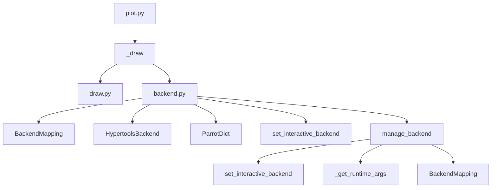

# `hypertools.plot`

## Tree:
```
plot/
├── backend.py
├── draw.py
└── plot.py
```

## Role:
Manages matplotlib backend configuration and provides unified plotting interfaces for 1D, 2D, and 3D data visualization with support for static and animated plots.

## Description:
The plot module serves as the core visualization system for hypertools, providing a unified interface for creating static and animated plots of multi-dimensional data. It handles the complexity of backend management across different execution environments (Jupyter notebooks vs. regular Python) while offering rich visualization capabilities including interactive exploration, animations, and customizable styling.

This module is organized around two main functional areas:
1. **Backend Management** (`backend.py`): Handles matplotlib backend configuration, switching, and environment detection
2. **Drawing Engine** (`draw.py`): Contains the core logic for rendering plots of different dimensional data

The module provides a clean abstraction over matplotlib's complex backend system, ensuring consistent behavior across different execution contexts while exposing powerful visualization features.

Primary consumers of this module include:
- `hypertools.plot.plot` - Main public interface for creating plots
- `hypertools.plot.animate` - Specialized interface for animated visualizations
- Internal plotting functions that require backend management

## Components:
- `BackendMapping` (class): Manages bidirectional mappings between Python and IPython matplotlib backend names, supporting equivalent key definitions
- `HypertoolsBackend` (class): Enhanced string subclass that maintains type consistency during string operations and enables automatic conversion between IPython and Python backends
- `ParrotDict` (class): Dictionary subclass that automatically wraps all keys and values with HypertoolsBackend objects for consistent backend handling
- `set_interactive_backend` (class): Context manager that temporarily switches matplotlib's interactive plotting backend
- `_init_backend` (function): Initializes the matplotlib backend configuration based on execution environment
- `_draw` (function): Core plotting engine that dispatches to appropriate dimensionality-specific plotting functions
- `manage_backend` (decorator): Decorator that manages matplotlib backend contexts for plotting functions

## Public API:
- `plot` (function): Main interface for creating static and animated plots of multi-dimensional data
- `animate` (function): Specialized interface for creating animated visualizations
- `BackendMapping` (class): Class for managing backend name mappings
- `HypertoolsBackend` (class): Enhanced string subclass for backend handling
- `ParrotDict` (class): Dictionary subclass for consistent backend type handling
- `set_interactive_backend` (context manager): Context manager for temporary backend switching

## Dependencies:
Internal imports:
- `hypertools.plot.backend` - Provides backend management utilities and classes
- `hypertools.plot.draw` - Contains core drawing logic for different dimensional data

External imports:
- `matplotlib.pyplot` - Core plotting library for visualization
- `numpy` - Numerical computing library for data handling
- `sys` - System-level operations for module management
- `warnings` - Warning handling for backend configuration issues
- `inspect` - Function signature inspection for argument binding
- `contextlib` - Context manager utilities
- `os` - Operating system interface for environment variable access
- `platform` - Platform information for OS-specific backend preferences

## Constraints:
- Backend initialization must occur before any plotting operations
- All plotting functions must be called within a valid matplotlib context
- Interactive features require appropriate matplotlib backends to be available
- Thread-safety: Backend switching operations are not thread-safe and should not be performed concurrently
- Environment variable `HYPERTOOLS_BACKEND` can override default backend selection
- Animation functions require 3D data (shape[1] == 3) when animate=True is specified
- The module assumes matplotlib is properly installed and importable

## Component Interaction Diagram:


---

## Files

- [`backend.py`](plot/backend.md)
- [`draw.py`](plot/draw.md)
- [`plot.py`](plot/plot.md)

