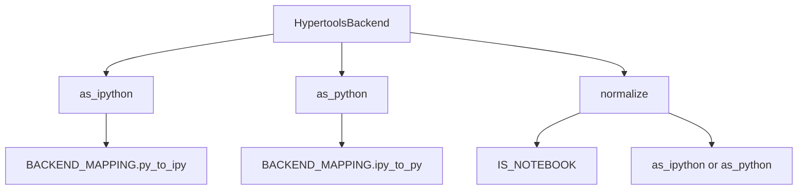
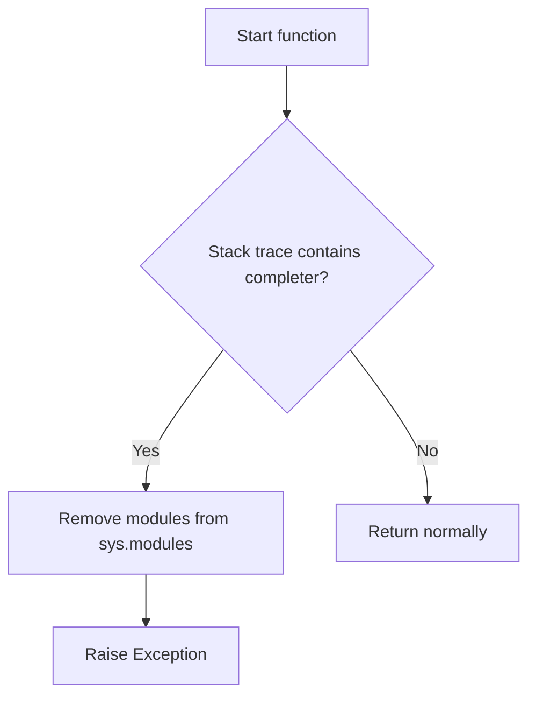
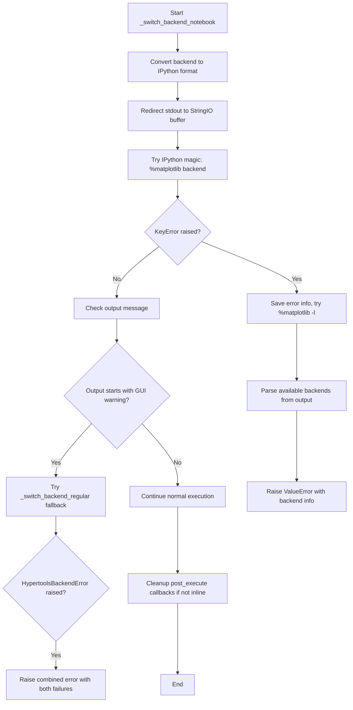
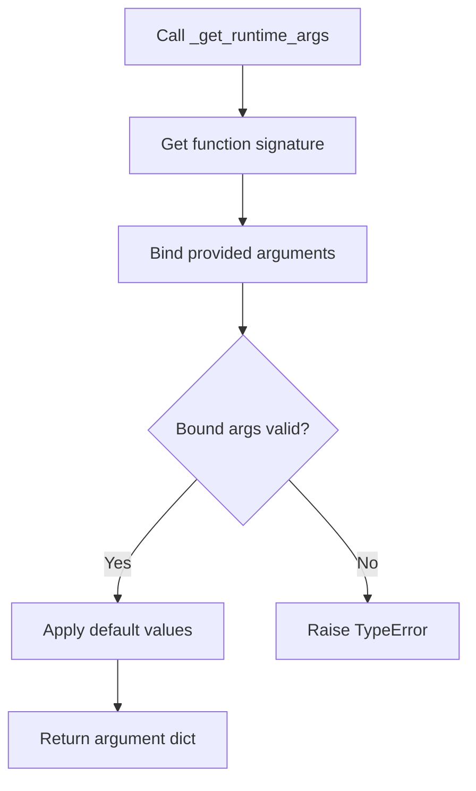
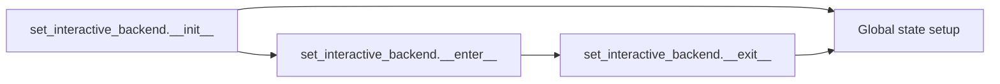
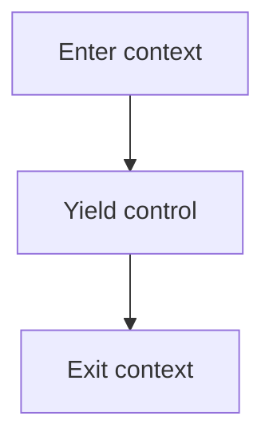
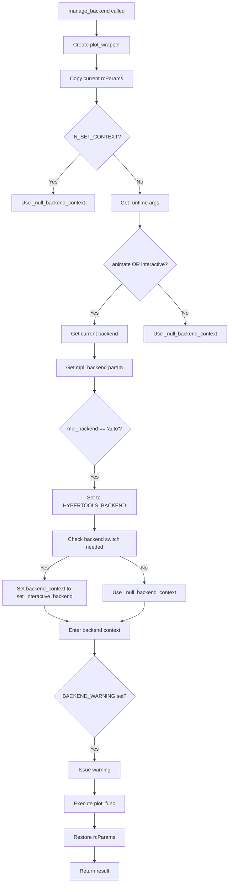

# `backend.py`

## `hypertools.plot.backend.ParrotDict` · *class*

## Summary:
A dictionary subclass that automatically wraps all keys and values with HypertoolsBackend objects for consistent backend handling.

## Description:
ParrotDict is a specialized dictionary implementation designed to work with matplotlib backends in the hypertools library. It automatically converts all dictionary keys and values to HypertoolsBackend objects during insertion and retrieval operations, ensuring consistent type handling throughout the backend management system. This prevents type mismatches when working with different matplotlib backends and maintains the specialized behavior of HypertoolsBackend objects.

The class overrides standard dictionary methods (__contains__, __getitem__, __setitem__, __missing__) to intercept key access and ensure proper conversion to HypertoolsBackend objects, providing transparent type handling for backend management.

## State:
- Inherits all standard dictionary behavior from the built-in dict class
- All keys and values are automatically wrapped with HypertoolsBackend during __setitem__ operations
- Keys are converted to HypertoolsBackend when accessed via __contains__, __getitem__, and __missing__ methods
- Maintains standard dictionary key-value storage semantics with enhanced type safety
- Keys are compared using HypertoolsBackend equality (case-insensitive)

## Lifecycle:
- Creation: Instantiate with standard dict constructor arguments (positional args, keyword args)
- Usage: Access and modify dictionary entries normally; keys and values are automatically converted to HypertoolsBackend
- Destruction: Inherits standard dictionary destruction behavior

## Method Map:
```mermaid
graph TD
    A[ParrotDict.__init__] --> B[super().__init__]
    A --> C[dict initialization]
    
    B --> D[ParrotDict.__contains__]
    D --> E[HypertoolsBackend(key) in self.keys()]
    
    B --> F[ParrotDict.__getitem__]
    F --> G[key = HypertoolsBackend(key)]
    G --> H[super().__getitem__(key)]
    
    B --> I[ParrotDict.__missing__]
    I --> J[HypertoolsBackend(key)]
    
    B --> K[ParrotDict.__setitem__]
    K --> L[key, value = HypertoolsBackend(key), HypertoolsBackend(value)]
    L --> M[super().__setitem__(key, value)]
```

## Raises:
- HypertoolsBackendError: May be raised by HypertoolsBackend constructor during key/value conversion (indirectly)
- KeyError: May be raised by parent dict class during normal dictionary operations

## Example:
```python
# Create a ParrotDict instance
backend_dict = ParrotDict()

# Set items - keys and values are automatically converted to HypertoolsBackend
backend_dict["Agg"] = "TkAgg"

# Retrieve items - keys are converted to HypertoolsBackend for lookup
value = backend_dict["Agg"]  # Returns HypertoolsBackend("TkAgg")

# Check membership - keys are converted to HypertoolsBackend for comparison
exists = "Agg" in backend_dict  # Returns True

# Missing key handling - returns new HypertoolsBackend instance
missing_value = backend_dict["NonExistent"]  # Returns HypertoolsBackend("NonExistent")
```

### `hypertools.plot.backend.ParrotDict.__init__` · *method*

## Summary:
Initializes a ParrotDict instance by delegating to the parent dictionary class constructor.

## Description:
This method serves as the constructor for the ParrotDict class, which extends Python's built-in dict class. It delegates all initialization responsibilities to the parent class, allowing standard dictionary construction patterns while maintaining the specialized behavior of ParrotDict for key and value handling.

The method is called during object instantiation and accepts any arguments that would be valid for initializing a standard Python dictionary. This includes positional arguments (like another dictionary or iterable of key-value pairs) and keyword arguments (for direct key-value assignment).

## Args:
    *args: Variable length argument list passed to the parent dict constructor. Can include:
        - Another dictionary or iterable of key-value pairs
        - A single iterable containing key-value pairs
        - No arguments to create an empty dictionary
    **kwargs: Arbitrary keyword arguments passed to the parent dict constructor. Used for direct key-value assignment.

## Returns:
    None: This method does not return a value. It initializes the instance state.

## Raises:
    HypertoolsBackendError: May be raised indirectly during key/value conversion if HypertoolsBackend constructor fails (though this occurs during item setting, not initialization).
    TypeError: May be raised by the parent dict class if invalid arguments are provided.
    ValueError: May be raised by the parent dict class if invalid arguments are provided.

## State Changes:
    Attributes READ: None
    Attributes WRITTEN: Initializes all standard dictionary attributes through parent class constructor

## Constraints:
    Preconditions: The arguments provided must be compatible with the parent dict class constructor.
    Postconditions: The instance is properly initialized as a dictionary with all standard dict behaviors preserved.

## Side Effects:
    None: This method performs no I/O operations or external service calls. It only initializes internal dictionary state.

### `hypertools.plot.backend.ParrotDict.__contains__` · *method*

## Summary:
Checks if a given key exists in the dictionary by comparing it against stored HypertoolsBackend keys.

## Description:
Implements the `in` operator for the ParrotDict class, allowing users to test membership using the syntax `key in parrot_dict`. This method converts the provided key to a HypertoolsBackend instance and checks if it exists among the dictionary's keys.

This method is part of the ParrotDict's special method implementation that ensures consistent handling of backend identifiers throughout the dictionary operations. It enables seamless membership testing regardless of whether the key is provided as a plain string or HypertoolsBackend instance.

The method exists as a separate implementation to maintain type consistency with other dictionary operations in ParrotDict, which all convert keys to HypertoolsBackend instances. This ensures that membership testing behaves consistently with item retrieval and assignment operations.

## Args:
    key (str or HypertoolsBackend): The key to check for existence in the dictionary. If provided as a string, it will be converted to a HypertoolsBackend instance.

## Returns:
    bool: True if the key (converted to HypertoolsBackend) exists in the dictionary, False otherwise

## Raises:
    None explicitly raised

## State Changes:
    Attributes READ: self.keys()
    Attributes WRITTEN: None

## Constraints:
    Preconditions: The key parameter must be convertible to a string
    Postconditions: Returns a boolean indicating membership status

## Side Effects:
    None

### `hypertools.plot.backend.ParrotDict.__getitem__` · *method*

## Summary:
Retrieves a value from the dictionary using a key, converting the key to a HypertoolsBackend instance for consistent type handling.

## Description:
Implements the `[]` operator for dictionary access in the ParrotDict class. This method ensures consistent type handling by converting the provided key to a HypertoolsBackend instance before retrieving the associated value from the parent dictionary. This approach maintains uniform behavior across all dictionary operations in ParrotDict, including `__setitem__`, `__contains__`, and `__missing__`.

The method exists as a separate implementation to ensure that all dictionary key operations maintain the same type consistency requirements, preventing type mismatches that could occur when mixing plain strings and HypertoolsBackend instances.

## Args:
    key (str or HypertoolsBackend): The key to retrieve from the dictionary. If provided as a string, it will be automatically converted to a HypertoolsBackend instance.

## Returns:
    Any: The value associated with the specified key in the dictionary.

## Raises:
    KeyError: When the specified key is not found in the dictionary.

## State Changes:
    Attributes READ: None
    Attributes WRITTEN: None

## Constraints:
    Preconditions: The key parameter must be convertible to a string
    Postconditions: Returns the value associated with the key, or raises KeyError if not found

## Side Effects:
    None

### `hypertools.plot.backend.ParrotDict.__missing__` · *method*

## Summary:
Returns a new HypertoolsBackend instance when a key is not found in the dictionary.

## Description:
This method implements the `__missing__` protocol for the `ParrotDict` class. When a key lookup fails (i.e., when a key is not present in the dictionary), Python automatically calls this method with the missing key as an argument. Instead of raising a KeyError, this implementation creates and returns a new `HypertoolsBackend` instance initialized with the missing key value.

This enables lazy initialization of backend entries in the dictionary, allowing users to access non-existent keys and automatically get a properly typed `HypertoolsBackend` object without explicitly creating it first.

## Args:
    key (str): The key that was not found in the dictionary

## Returns:
    HypertoolsBackend: A new HypertoolsBackend instance initialized with the missing key value

## Raises:
    None: This method does not raise exceptions directly

## State Changes:
    Attributes READ: None
    Attributes WRITTEN: None

## Constraints:
    Preconditions: The method assumes the key parameter is a string that can be used to initialize a HypertoolsBackend instance
    Postconditions: The returned value is always a HypertoolsBackend instance with the provided key as its string value

## Side Effects:
    None: This method performs no I/O operations or external service calls

### `hypertools.plot.backend.ParrotDict.__setitem__` · *method*

*No documentation generated.*

## `hypertools.plot.backend.BackendMapping` · *class*

## Summary:
A mapping utility class that manages bidirectional associations between Python and IPython matplotlib backend names, supporting equivalent key definitions.

## Description:
The BackendMapping class provides a mechanism for creating bidirectional mappings between Python and IPython matplotlib backend identifiers. It's designed to handle cases where multiple names might refer to the same backend, allowing for flexible backend specification while maintaining consistent internal representation. This class is particularly useful in environments where different backend naming conventions might be used (such as in Jupyter notebooks vs. regular Python scripts).

The class stores mappings in two directions: from Python to IPython backends and vice versa, plus a registry of equivalent keys that can be used interchangeably. This enables robust backend resolution regardless of which naming convention is used.

## State:
- `py_to_ipy` (ParrotDict): Maps Python backend names to their corresponding IPython backend names
- `ipy_to_py` (ParrotDict): Maps IPython backend names to their corresponding Python backend names  
- `equivalents` (ParrotDict): Stores equivalent key mappings for handling alternative names for the same backend
- `_dict` (dict): The original dictionary passed to the constructor containing the initial mappings

## Lifecycle:
- Creation: Instantiate with a dictionary mapping Python backend names to IPython backend names
- Usage: Access the mapping attributes (`py_to_ipy`, `ipy_to_py`, `equivalents`) to resolve backend names
- Destruction: Inherits standard object destruction behavior

## Method Map:
```mermaid
graph TD
    A[BackendMapping.__init__] --> B[_store_equivalents(py_key)]
    A --> C[_store_equivalents(ipy_key)]
    A --> D[py_to_ipy[py_key_default] = ipy_key_default]
    A --> E[ipy_to_py[ipy_key_default] = py_key_default]
    
    B --> F[Check if keylist is Iterable]
    F --> G{Is Iterable?}
    G -->|Yes| H[default_key = keylist[0]]
    G -->|No| I[default_key = keylist]
    H --> J[Store equivalents for remaining keys]
    I --> J
    
    J --> K[Return default_key]
```

## Raises:
- HypertoolsBackendError: May be raised indirectly through ParrotDict operations when converting keys to HypertoolsBackend objects
- TypeError: May occur if the input `_dict` is not a dictionary-like object with `.items()` method

## Example:
```python
# Create a backend mapping with basic mappings
mapping = BackendMapping({
    "Agg": "TkAgg",
    "Qt5Agg": "Qt5Agg"
})

# Create a mapping with equivalent keys
mapping_with_equivalents = BackendMapping({
    ["Agg", "agg", "AGG"]: ["TkAgg", "tkagg"],
    "Qt5Agg": "Qt5Agg"
})

# Access the mappings
python_backend = mapping.py_to_ipy["Agg"]  # Returns "TkAgg"
ipython_backend = mapping.ipy_to_py["TkAgg"]  # Returns "Agg"
```

### `hypertools.plot.backend.BackendMapping.__init__` · *method*

## Summary:
Initializes a backend mapping system that establishes bidirectional translations between Python and IPython matplotlib backends, while tracking equivalent backend names.

## Description:
The `__init__` method constructs the core backend mapping infrastructure for the hypertools plotting system. It creates three internal dictionaries (`py_to_ipy`, `ipy_to_py`, and `equivalents`) to manage translations between Python and IPython matplotlib backends. This method is called during object instantiation to set up the complete backend translation framework.

The method processes a dictionary mapping where keys represent Python backend names and values represent corresponding IPython backend names. It handles complex cases where backend names might have multiple equivalent forms by leveraging the `_store_equivalents` helper method.

## Args:
    _dict (dict): A dictionary mapping Python backend names to IPython backend names. Keys and values can be either string names or iterable collections of equivalent names.

## Returns:
    None: This method initializes instance attributes and does not return a value.

## Raises:
    None explicitly raised by this method, though underlying operations may raise HypertoolsBackendError through ParrotDict or _store_equivalents.

## State Changes:
    Attributes READ: None
    Attributes WRITTEN: 
        - self.py_to_ipy: Initialized as ParrotDict and populated with bidirectional Python-to-IPython mappings
        - self.ipy_to_py: Initialized as ParrotDict and populated with bidirectional IPython-to-Python mappings  
        - self.equivalents: Initialized as ParrotDict and populated with equivalent name mappings

## Constraints:
    Preconditions:
        - Input `_dict` must be a dictionary-like object with iterable items() method
        - Keys and values in `_dict` should be valid backend name representations
    Postconditions:
        - Three ParrotDict instances are initialized and populated with appropriate backend mappings
        - Bidirectional translation capabilities are established between Python and IPython backends
        - Equivalent name relationships are recorded in the equivalents dictionary

## Side Effects:
    None: This method performs only internal state initialization and does not cause external I/O or service calls.

### `hypertools.plot.backend.BackendMapping._store_equivalents` · *method*

## Summary:
Stores equivalent backend names in the equivalents mapping dictionary, establishing canonical references for alternative backend name representations.

## Description:
Processes a keylist parameter to establish equivalent backend name relationships. When the keylist is an iterable of backend names (excluding strings), it designates the first element as the canonical default key and maps all subsequent elements to this default in the self.equivalents dictionary. When the keylist is a single string, it returns that string as the default key without modification.

This method is primarily used during BackendMapping initialization to handle cases where matplotlib backend names may have multiple equivalent representations, ensuring consistent lookup and translation between Python and IPython backends.

## Args:
    keylist (str or Iterable[str]): Either a single backend name string or an iterable collection of equivalent backend names. If iterable, the first element becomes the canonical reference for all subsequent elements.

## Returns:
    str: The canonical default key derived from the keylist parameter. For string inputs, returns the input string unchanged. For iterable inputs, returns the first element of the iterable.

## Raises:
    None: This method does not explicitly raise exceptions, though underlying operations may raise HypertoolsBackendError through ParrotDict mechanisms.

## State Changes:
    Attributes READ: None
    Attributes WRITTEN: 
        - self.equivalents: Populated with key-value mappings where equivalent keys map to their canonical default key

## Constraints:
    Preconditions:
        - keylist must be either a string or an iterable of strings
        - If keylist is iterable, it must contain at least one element
    Postconditions:
        - For iterable inputs: all elements except the first are mapped to the first element in self.equivalents
        - For string inputs: the string is returned as-is without modification
        - The method always returns a string representing the canonical default key

## Side Effects:
    None: This method performs no I/O operations or external service calls. It only modifies the internal self.equivalents dictionary.

## `hypertools.plot.backend.HypertoolsBackend` · *class*

## Summary:
A string subclass that provides specialized backend handling for matplotlib visualization, maintaining type consistency during string operations and enabling automatic conversion between IPython and Python backends.

## Description:
The HypertoolsBackend class extends Python's built-in str type to provide enhanced backend management for matplotlib visualizations. Its key feature is automatic type maintenance - when string methods are called on a HypertoolsBackend instance, the results remain as HypertoolsBackend objects rather than plain strings. This prevents type loss during string manipulations while preserving the specialized backend behavior. The class also provides explicit methods for converting between IPython and Python backends, making it suitable for environments where the backend needs to be dynamically selected based on execution context.

## State:
- Inherits all string attributes and methods from the built-in str class
- Maintains case-insensitive equality comparison through the __eq__ method
- Implements custom hash behavior based on case-folded string representation
- Automatically maintains HypertoolsBackend type when string operations return strings, lists, tuples, or sets
- Depends on global constants BACKEND_MAPPING and IS_NOTEBOOK for backend conversion functionality

## Lifecycle:
- Creation: Instantiate with a string representing a backend name using HypertoolsBackend(value)
- Usage: Call methods like as_ipython(), as_python(), and normalize() to convert between backend representations
- Destruction: Inherits standard string destruction behavior

## Method Map:


## Raises:
- HypertoolsBackendError: May be raised by underlying backend mapping operations (not shown in provided code)

## Example:
```python
# Create a backend instance
backend = HypertoolsBackend("Agg")

# String operations maintain HypertoolsBackend type
upper_backend = backend.upper()  # Returns HypertoolsBackend object
split_result = backend.split("A")  # Returns tuple of HypertoolsBackend objects

# Convert to IPython backend
ipython_backend = backend.as_ipython()

# Convert to Python backend  
python_backend = backend.as_python()

# Normalize based on environment
normalized_backend = backend.normalize()
```

### `hypertools.plot.backend.HypertoolsBackend.__new__` · *method*

## Summary:
Creates a new instance of HypertoolsBackend by delegating to the parent str class constructor.

## Description:
This method implements the object creation protocol for the HypertoolsBackend class, which inherits from str. It delegates the actual object creation to the parent class's __new__ method while maintaining the custom behavior of the HypertoolsBackend class.

## Args:
    cls: The class being instantiated (HypertoolsBackend)
    x: The value to initialize the string with, typically a string or string-like object

## Returns:
    HypertoolsBackend: A new instance of HypertoolsBackend initialized with the provided value

## Raises:
    TypeError: If the provided value cannot be converted to a string

## State Changes:
    Attributes READ: None
    Attributes WRITTEN: None

## Constraints:
    Preconditions: 
    - cls must be the HypertoolsBackend class
    - x must be a valid argument for str() constructor
    
    Postconditions:
    - Returns a new HypertoolsBackend instance
    - The returned instance behaves like a string but with custom methods

## Side Effects:
    None

### `hypertools.plot.backend.HypertoolsBackend.__eq__` · *method*

## Summary:
Compares two HypertoolsBackend objects for equality in a case-insensitive manner.

## Description:
Implements case-insensitive equality comparison between HypertoolsBackend instances and other objects. This method converts both operands to strings using their string representations and performs a case-folded comparison to ensure equality is determined regardless of case differences.

## Args:
    other (Any): Another object to compare for equality with this HypertoolsBackend instance.

## Returns:
    bool: True if both objects have equivalent string representations (case-insensitive), False otherwise.

## Raises:
    None: This method does not raise any exceptions.

## State Changes:
    Attributes READ: None - this method only reads the string representation of self and other.
    Attributes WRITTEN: None - this method does not modify any instance attributes.

## Constraints:
    Preconditions: The method can accept any object as the 'other' parameter, though meaningful comparisons are typically made with string-like objects or other HypertoolsBackend instances.
    Postconditions: The return value is always a boolean indicating equality status.

## Side Effects:
    None: This method performs no I/O operations or external service calls. It only performs in-memory string comparisons.

### `hypertools.plot.backend.HypertoolsBackend.__getattribute__` · *method*

## Summary:
Intercepts attribute access for str methods to automatically wrap return values in HypertoolsBackend instances.

## Description:
Overrides the default `__getattribute__` behavior to intercept access to methods defined on the built-in `str` class. When a str method is accessed, this implementation returns a wrapper function that:
1. Calls the parent's method with the same name and arguments
2. Processes the return value according to its type:
   - String returns: wrap in `HypertoolsBackend` instance
   - Container returns (list, tuple, set): wrap each element in `HypertoolsBackend` instances
   - Other returns: return unchanged
3. For non-str attributes, delegates to the parent's `__getattribute__` method

This design enables `HypertoolsBackend` instances to seamlessly integrate with standard string operations while maintaining their enhanced functionality. The wrapper ensures that operations like `split()`, `replace()`, `upper()`, etc. return `HypertoolsBackend` instances when appropriate, preserving the extended capabilities throughout method chains.

## Args:
    name (str): The name of the attribute being accessed.

## Returns:
    Any: Either a wrapped method that processes string-returning operations or the result from the parent's `__getattribute__` method.

## Raises:
    AttributeError: If the requested attribute doesn't exist and isn't handled by the special string method wrapping logic.

## State Changes:
    Attributes READ: None - this method only reads the attribute name parameter.
    Attributes WRITTEN: None - this method does not modify any instance attributes.

## Constraints:
    Preconditions: The `HypertoolsBackend` class must be properly initialized and inherit from `str`.
    Postconditions: When accessing str methods, return values are appropriately wrapped in `HypertoolsBackend` instances when applicable.

## Side Effects:
    None: This method performs no I/O operations or external service calls. It only manipulates internal attribute access behavior.

### `hypertools.plot.backend.HypertoolsBackend.__hash__` · *method*

## Summary:
Computes a hash value for the HypertoolsBackend instance using a case-folded string representation.

## Description:
Implements a custom hash function that ensures consistent hashing behavior for HypertoolsBackend instances. This method is designed to work in conjunction with the case-insensitive equality implementation (__eq__) to maintain hash consistency. The hash is computed by converting the instance to a string, applying case folding for case-insensitive normalization, and then computing the standard string hash.

This method is automatically called when the instance is used as a dictionary key or added to a set, ensuring that semantically equivalent instances (differing only in case) produce identical hash values.

## Args:
    None: This method takes no arguments beyond the implicit self parameter.

## Returns:
    int: An integer hash value derived from the case-folded string representation of the instance.

## Raises:
    None: This method does not raise any exceptions under normal circumstances.

## State Changes:
    Attributes READ: None - this method only accesses the instance's string representation.
    Attributes WRITTEN: None - this method does not modify any instance attributes.

## Constraints:
    Preconditions: The instance must be properly initialized as a HypertoolsBackend object inheriting from str.
    Postconditions: The returned hash value is consistent with the case-insensitive equality semantics of the class.

## Side Effects:
    None: This method performs no I/O operations or external service calls. It only computes a hash value from internal string data.

### `hypertools.plot.backend.HypertoolsBackend.as_ipython` · *method*

## Summary:
Converts a HypertoolsBackend instance to its IPython-compatible backend representation.

## Description:
This method transforms the current backend instance into its corresponding IPython backend equivalent by looking up the appropriate mapping in the global BACKEND_MAPPING configuration. It's part of the backend normalization system that ensures proper rendering behavior in different execution environments, particularly when transitioning from Python environments to IPython/Jupyter notebooks.

## Args:
    None - This is a method of the HypertoolsBackend class and operates on self.

## Returns:
    HypertoolsBackend: A new HypertoolsBackend instance representing the IPython equivalent of the current backend.

## Raises:
    KeyError: If the current backend instance is not found in BACKEND_MAPPING.equivalents or if the IPython mapping is not found in BACKEND_MAPPING.py_to_ipy.

## State Changes:
    Attributes READ: self (the current backend instance), BACKEND_MAPPING.equivalents, BACKEND_MAPPING.py_to_ipy
    Attributes WRITTEN: None - returns a new instance rather than modifying self

## Constraints:
    Preconditions: 
    - The current instance must be a valid backend identifier present in BACKEND_MAPPING.equivalents
    - BACKEND_MAPPING.py_to_ipy must contain a mapping for the equivalent backend key
    Postconditions: 
    - Returns a new HypertoolsBackend instance with the IPython-compatible backend name

## Side Effects:
    None - This method is pure and doesn't cause any I/O operations or external service calls.

### `hypertools.plot.backend.HypertoolsBackend.as_python` · *method*

## Summary:
Converts a HypertoolsBackend instance from its IPython-compatible representation to its Python-compatible backend representation.

## Description:
This method transforms the current backend instance into its corresponding Python backend equivalent by looking up the appropriate mapping in the global BACKEND_MAPPING configuration. It's part of the backend normalization system that ensures proper rendering behavior in different execution environments, particularly when transitioning from IPython/Jupyter notebooks to standard Python environments.

## Args:
    None - This is a method of the HypertoolsBackend class and operates on self.

## Returns:
    HypertoolsBackend: A new HypertoolsBackend instance representing the Python equivalent of the current backend.

## Raises:
    KeyError: If the current backend instance is not found in BACKEND_MAPPING.equivalents or if the Python mapping is not found in BACKEND_MAPPING.ipy_to_py.

## State Changes:
    Attributes READ: self (the current backend instance), BACKEND_MAPPING.equivalents, BACKEND_MAPPING.ipy_to_py
    Attributes WRITTEN: None - returns a new instance rather than modifying self

## Constraints:
    Preconditions: 
    - The current instance must be a valid backend identifier present in BACKEND_MAPPING.equivalents
    - BACKEND_MAPPING.ipy_to_py must contain a mapping for the equivalent backend key
    Postconditions: 
    - Returns a new HypertoolsBackend instance with the Python-compatible backend name

## Side Effects:
    None - This method is pure and doesn't cause any I/O operations or external service calls.

### `hypertools.plot.backend.HypertoolsBackend.normalize` · *method*

## Summary:
Normalizes the backend representation to match the current execution environment (IPython/Jupyter notebook vs standard Python).

## Description:
This method conditionally converts the current backend instance to its appropriate representation based on whether the code is running in a Jupyter notebook environment. When running in a notebook, it uses IPython-compatible backend representations; otherwise, it uses standard Python-compatible representations. This ensures proper rendering behavior across different execution contexts.

## Args:
    None - This is a method of the HypertoolsBackend class and operates on self.

## Returns:
    HypertoolsBackend: A new HypertoolsBackend instance representing the normalized backend for the current execution environment.

## Raises:
    KeyError: If the current backend instance is not found in BACKEND_MAPPING.equivalents or if the appropriate mapping is not found in either BACKEND_MAPPING.py_to_ipy or BACKEND_MAPPING.ipy_to_py.

## State Changes:
    Attributes READ: self (the current backend instance), IS_NOTEBOOK, BACKEND_MAPPING.equivalents, BACKEND_MAPPING.py_to_ipy, BACKEND_MAPPING.ipy_to_py
    Attributes WRITTEN: None - returns a new instance rather than modifying self

## Constraints:
    Preconditions: 
    - The current instance must be a valid backend identifier present in BACKEND_MAPPING.equivalents
    - IS_NOTEBOOK must be a boolean value indicating the execution environment
    Postconditions: 
    - Returns a new HypertoolsBackend instance with the appropriate backend name for the current environment

## Side Effects:
    None - This method is pure and doesn't cause any I/O operations or external service calls.

## `hypertools.plot.backend._init_backend` · *function*

## Summary:
Initializes the matplotlib backend for hypertools plotting, selecting an appropriate backend based on the execution environment and available system resources.

## Description:
The `_init_backend` function establishes the matplotlib backend configuration for the hypertools plotting system. It determines whether the code is running in a Jupyter notebook environment or regular Python interpreter, then selects and configures an appropriate matplotlib backend with proper fallback mechanisms. This function ensures consistent plotting behavior across different execution contexts while handling potential backend compatibility issues gracefully.

The function is typically called during module initialization to set up the plotting environment before any plotting operations occur. It manages backend selection with priority order, environment variable overrides, and appropriate error handling for cases where preferred backends are unavailable.

## Args:
    None

## Returns:
    None - This function operates via global variable assignments and does not return a value

## Raises:
    None - The function handles all exceptions internally and provides appropriate warnings

## Constraints:
    Preconditions:
    - Matplotlib must be installed and importable
    - The function should be called during module initialization, before any plotting operations
    - Environment variables like HYPERTOOLS_BACKEND may influence backend selection
    
    Postconditions:
    - Global variables are initialized: BACKEND_MAPPING, BACKEND_WARNING, HYPERTOOLS_BACKEND, IPYTHON_INSTANCE, IS_NOTEBOOK, reset_backend, switch_backend
    - A working matplotlib backend is established and configured
    - Appropriate fallback mechanisms are in place for unsupported backends

## Side Effects:
    - Modifies global variables: BACKEND_MAPPING, BACKEND_WARNING, HYPERTOOLS_BACKEND, IPYTHON_INSTANCE, IS_NOTEBOOK, reset_backend, switch_backend
    - Calls matplotlib's backend switching functions (mpl.use())
    - May issue warnings via Python's warnings module
    - Invokes _block_greedy_completer_execution() in non-notebook environments
    - May modify sys.modules when IPython greedy completer is detected

## Control Flow:
```mermaid
flowchart TD
    A[Start _init_backend] --> B{IPython available?}
    B -- No --> C[_block_greedy_completer_execution]
    C --> D[Set IS_NOTEBOOK=False]
    D --> E[Define backend priority list]
    E --> F{Platform is macOS?}
    F -- Yes --> G[Add MacOSX to backends]
    F -- No --> H[Skip MacOSX addition]
    H --> I[Check HYPERTOOLS_BACKEND env var]
    I --> J{Env var set?}
    J -- Yes --> K[Reorder backends with env var first]
    J -- No --> L[Use default backend list]
    L --> M[Iterate through backends]
    M --> N{Can use backend?}
    N -- Yes --> O[Set working_backend and break]
    N -- No --> P[Continue to next backend]
    P --> Q{All backends tried?}
    Q -- Yes --> R[Set fallback to Agg backend]
    Q -- No --> M
    R --> S{Env var differs from working backend?}
    S -- Yes --> T[Issue warning about backend mismatch]
    T --> U[Set switch_backend and reset_backend]
    U --> V[End]

    B -- Yes --> W[Set IS_NOTEBOOK=True]
    W --> X[Try to use nbAgg backend]
    X --> Y{Success?}
    Y -- Yes --> Z[Set working_backend="nbAgg"]
    Y -- No --> AA[Set fallback to inline backend]
    AA --> AB[Set appropriate switch/reset backends]
    AB --> AC[End]
```

## Examples:
```python
# This function is typically called internally during module import
# and would not normally be called directly by users

# In a Jupyter notebook environment:
# - Attempts to use 'nbAgg' backend
# - Falls back to 'inline' if 'nbAgg' is not available
# - Sets IS_NOTEBOOK=True and appropriate callback functions

# In a regular Python environment:
# - Attempts various GUI backends in priority order
# - Falls back to 'Agg' if none work
# - Sets IS_NOTEBOOK=False and appropriate callback functions
# - Respects HYPERTOOLS_BACKEND environment variable if set
```

## `hypertools.plot.backend._block_greedy_completer_execution` · *function*

## Summary:
Blocks execution when IPython's greedy completer is active by clearing specific modules from sys.modules and raising an exception to interrupt the completion process.

## Description:
This function serves as a safeguard against conflicts between IPython's greedy completer and the hypertools plotting system. When IPython's autocompletion engine attempts to introspect code during tab completion, it can interfere with the plotting backend's module loading and execution. This function detects such situations and proactively cleans up problematic modules to prevent runtime errors.

The function is typically invoked automatically by the plotting backend when certain operations are performed, particularly those involving matplotlib or numpy interactions that could trigger the completer during execution. It acts as a preventive measure to avoid incomplete module loading or execution conflicts during interactive development.

## Args:
    None

## Returns:
    None - The function either returns early or raises an exception, never returning a value

## Raises:
    Exception: Raised when IPython's greedy completer is detected in the call stack, indicating that the completion process should be interrupted. This exception is specifically designed to break out of the autocompletion process.

## Constraints:
    Preconditions:
    - The function must be called within a context where IPython's completer might be active
    - The sys.modules dictionary must be accessible for modification
    
    Postconditions:
    - If triggered, the specified modules ('hypertools.plot', 'hypertools.plot.backend', 'numpy') will be removed from sys.modules
    - The function will always raise an exception when the completer is detected

## Side Effects:
    - Modifies sys.modules by removing entries for 'hypertools.plot', 'hypertools.plot.backend', and 'numpy'
    - Raises an exception that interrupts the current execution flow
    - May affect subsequent imports of the removed modules in the same session

## Control Flow:


## Examples:
```python
# This function is typically called internally by the plotting backend
# and would not normally be called directly by users

# Example scenario where this function is triggered:
# User types "ht.plot." and IPython starts autocompleting
# The plotting backend detects this and calls _block_greedy_completer_execution()
# Result: Clean up modules and raise exception to prevent interference
```

## `hypertools.plot.backend._switch_backend_regular` · *function*

## Summary:
Switches the matplotlib plotting backend to the specified backend type and handles common errors gracefully.

## Description:
This function provides a standardized way to switch matplotlib's plotting backend while handling common failure modes. It converts the backend specification to its Python representation and attempts to switch the backend, catching and re-raising specific exceptions as HypertoolsBackendError with informative messages.

## Args:
    backend: An object representing a plotting backend that has an `as_python()` method returning a string representation of the backend name.

## Returns:
    None: This function does not return any value.

## Raises:
    HypertoolsBackendError: Raised when switching the plotting backend fails due to missing dependencies or unsupported backend configurations.

## Constraints:
    Preconditions:
    - The backend parameter must have an `as_python()` method that returns a valid matplotlib backend string
    - The matplotlib library must be properly installed and importable
    
    Postconditions:
    - If successful, the matplotlib backend has been switched to the requested backend
    - If failed, a HypertoolsBackendError is raised with detailed information about the failure

## Side Effects:
    - Modifies the global matplotlib backend configuration
    - May trigger matplotlib's backend initialization process

## Control Flow:
```mermaid
flowchart TD
    A[Start _switch_backend_regular] --> B{backend.as_python()}
    B --> C[plt.switch_backend(backend)]
    C --> D{Exception raised?}
    D -->|Yes| E{Is ImportError/ModuleNotFoundError?}
    E -->|Yes| F[Create detailed ImportError message]
    E -->|No| G[Create general error message]
    F --> H[Raise HypertoolsBackendError]
    G --> H
    D -->|No| I[Return normally]
```

## `hypertools.plot.backend._switch_backend_notebook` · *function*

## Summary:
Switches the matplotlib plotting backend in a Jupyter notebook environment, handling various error conditions and providing fallback mechanisms.

## Description:
This function provides a robust mechanism for switching matplotlib plotting backends within Jupyter notebook environments. It attempts to set the specified backend using IPython magic commands, handles invalid backend specifications, and manages GUI toolkit conflicts by falling back to regular backend switching. The function also cleans up IPython event callbacks to ensure proper figure management.

## Args:
    backend: An object representing a plotting backend that implements an `as_ipython()` method returning a string representation of the backend suitable for IPython magic commands.

## Returns:
    None: This function does not return any value.

## Raises:
    ValueError: Raised when the specified backend is not a valid IPython plotting backend, with information about available backends.
    HypertoolsBackendError: Raised when both IPython-based and regular backend switching fail, containing detailed error information about the failure.

## Constraints:
    Preconditions:
    - The backend parameter must have an `as_ipython()` method that returns a valid matplotlib backend string
    - IPYTHON_INSTANCE must be available in the module scope (typically provided by Jupyter environment)
    - The matplotlib library must be properly installed and importable
    
    Postconditions:
    - If successful, the matplotlib backend has been switched to the requested backend
    - If failed, appropriate exceptions are raised with detailed error information

## Side Effects:
    - Modifies the global matplotlib backend configuration
    - Manipulates IPython event callbacks by unregistering flush_figures from post_execute events
    - Captures and processes stdout output from IPython magic commands

## Control Flow:


## Examples:
```python
# Switch to interactive Qt backend
_switch_backend_notebook('qt5')

# Switch to static inline backend  
_switch_backend_notebook('inline')

# This would raise ValueError for invalid backend
# _switch_backend_notebook('invalid_backend')
```

## `hypertools.plot.backend._reset_backend_notebook` · *function*

## Summary:
Sets up a deferred callback to reset the matplotlib backend before Jupyter notebook cell execution.

## Description:
This internal utility function configures a callback mechanism that ensures the matplotlib backend is properly reset before each notebook cell executes. It prevents backend conflicts that commonly occur during interactive development when switching between different plotting backends.

The function registers a callback with IPython's event system that executes `_switch_backend_notebook(backend)` just before each cell runs. The callback automatically unregisters itself after execution to prevent duplicate invocations. This approach ensures consistent backend state across notebook cells without requiring manual intervention.

## Args:
    backend: A backend object that implements an `as_ipython()` method returning a string representation of the matplotlib backend for IPython magic commands.

## Returns:
    None: This function does not return any value.

## Raises:
    None explicitly raised by this function.

## Constraints:
    Preconditions:
    - The backend parameter must have an `as_ipython()` method returning a valid matplotlib backend string
    - IPYTHON_INSTANCE must be available in the module scope (provided by Jupyter environment)
    - The `_switch_backend_notebook` function must be available in the module scope
    
    Postconditions:
    - A callback function is registered with IPython's 'pre_run_cell' event
    - The callback executes `_switch_backend_notebook(backend)` before each cell run
    - The callback automatically unregisters itself after execution
    - Duplicate callback registrations are prevented

## Side Effects:
    - Modifies IPython's event callback registry by registering a 'pre_run_cell' callback
    - Invokes `_switch_backend_notebook` function during callback execution
    - Unregisters the callback from IPython's event system after execution

## Control Flow:
```mermaid
flowchart TD
    A[Start _reset_backend_notebook] --> B[Convert backend via as_ipython()]
    B --> C[Check if _deferred_reset_cb already registered]
    C --> D{Is callback registered?}
    D -->|Yes| E[Return without changes]
    D -->|No| F[Register _deferred_reset_cb with pre_run_cell event]
    F --> G[End]
    
    subgraph Callback Behavior
    H[_deferred_reset_cb executes] --> I[Call _switch_backend_notebook(backend)]
    I --> J[Unregister _deferred_reset_cb from pre_run_cell]
    J --> K[End]
    end
```

## Examples:
```python
# This function is typically called internally by backend management functions
# Example usage:
# backend_obj = SomeBackendClass('inline')
# _reset_backend_notebook(backend_obj)
```

## `hypertools.plot.backend._get_runtime_args` · *function*

## Summary:
Binds function arguments to their parameters and applies default values to produce a complete argument dictionary.

## Description:
Extracts the signature of a given function and binds the provided positional and keyword arguments to create a complete mapping of parameter names to their values. Default values are automatically applied for any parameters not explicitly provided.

This utility function is designed to normalize function arguments for consistent processing across different calling contexts, particularly useful in plotting backends where functions may be called with varying argument combinations.

## Args:
    func (callable): The function whose signature will be inspected and used for argument binding
    *func_args (tuple): Positional arguments to bind to the function signature
    **func_kwargs (dict): Keyword arguments to bind to the function signature

## Returns:
    dict: A dictionary mapping parameter names to their bound values, including default values for unspecified parameters

## Raises:
    TypeError: When the provided arguments don't match the function signature (e.g., wrong number of arguments, invalid parameter names)

## Constraints:
    Preconditions:
        - The `func` parameter must be a callable object (function, method, etc.)
        - All provided arguments must be compatible with the function signature
    Postconditions:
        - The returned dictionary will contain all parameters defined in the function signature
        - Any missing arguments will have their default values applied

## Side Effects:
    None

## Control Flow:


## Examples:
```python
# Basic usage
def sample_func(a, b=10, c=20):
    return a + b + c

args = _get_runtime_args(sample_func, 5)
# Returns: {'a': 5, 'b': 10, 'c': 20}

# With keyword arguments
args = _get_runtime_args(sample_func, 5, c=30)
# Returns: {'a': 5, 'b': 10, 'c': 30}
```

## `hypertools.plot.backend.set_interactive_backend` · *class*

## Summary:
A context manager class that temporarily switches matplotlib's interactive plotting backend for use within a with-statement block.

## Description:
The `set_interactive_backend` class provides a context manager interface for temporarily changing matplotlib's plotting backend to an interactive mode. It ensures that the original backend configuration is properly restored when exiting the context, preventing side effects from persistent backend modifications. This is particularly useful in environments where different backends are needed for different types of plots or when working in Jupyter notebooks.

The class compares the requested backend with the currently configured backend and only performs a switch if they differ, minimizing unnecessary operations. It manages global state variables to maintain proper backend configuration throughout the context lifecycle.

## State:
- `old_interactive_backend`: Stores the previously configured interactive backend (type: HypertoolsBackend) - retrieved from global HYPERTOOLS_BACKEND during initialization
- `old_backend_warning`: Stores the previous backend warning state (type: any) - retrieved from global BACKEND_WARNING during initialization  
- `new_interactive_backend`: The target interactive backend to switch to (type: HypertoolsBackend) - created by normalizing the input backend parameter using HypertoolsBackend constructor
- `new_is_different`: Boolean flag indicating if the new backend differs from the old one (type: bool) - computed during initialization by comparing new and old backends
- `backend_switched`: Boolean flag tracking whether a backend switch actually occurred (type: bool) - set during __enter__ method when current backend differs from target backend
- `curr_backend`: Stores the current matplotlib backend during context entry (type: HypertoolsBackend) - retrieved using matplotlib's get_backend() during __enter__ method

## Lifecycle:
- Creation: Instantiate with a backend string parameter to specify the desired interactive backend
- Usage: Use as a context manager with the `with` statement
- Destruction: Automatically restores original backend configuration upon context exit through __exit__ method

## Method Map:


## Raises:
- HypertoolsBackendError: May be raised during backend normalization if an invalid backend name is provided (inherited from HypertoolsBackend constructor)

## Example:
```python
from hypertools.plot.backend import set_interactive_backend

# Switch to an interactive backend for plotting
with set_interactive_backend('TkAgg'):
    # All matplotlib operations here use TkAgg backend
    import matplotlib.pyplot as plt
    plt.plot([1, 2, 3], [1, 4, 9])
    plt.show()

# Backend automatically restored to original configuration
```

### `hypertools.plot.backend.set_interactive_backend.__enter__` · *method*

## Summary:
Enters the interactive backend context by switching to the specified interactive backend if different from the current one.

## Description:
This method is part of a context manager that temporarily switches matplotlib's plotting backend to an interactive mode. It's called automatically when entering a `with` statement block. The method determines whether a backend switch is necessary and performs the switch if needed, tracking the state changes for proper cleanup during context exit.

## Args:
    None - This is a magic method that takes no explicit arguments beyond `self`

## Returns:
    None - This method doesn't return any value

## Raises:
    None explicitly raised - The method itself doesn't raise exceptions, though underlying backend switching operations might

## State Changes:
    Attributes READ:
        - self.new_interactive_backend
    Attributes WRITTEN:
        - self.curr_backend
        - self.backend_switched
        - IN_SET_CONTEXT (global variable)

## Constraints:
    Preconditions:
        - The `set_interactive_backend` instance must be properly initialized with a valid backend specification
        - The `new_interactive_backend` attribute must be set to a normalized backend name
        - The global variable `IN_SET_CONTEXT` should be accessible for modification
    
    Postconditions:
        - The global `IN_SET_CONTEXT` flag is set to True
        - If a backend switch occurs, `self.backend_switched` is set to True
        - `self.curr_backend` contains the normalized current backend name
        - The matplotlib backend is switched to the new interactive backend if different

## Side Effects:
    - Modifies global state via `IN_SET_CONTEXT` assignment
    - Calls matplotlib's backend switching mechanism (`switch_backend`)
    - May cause matplotlib to reload its backend, affecting subsequent plot rendering

### `hypertools.plot.backend.set_interactive_backend.__exit__` · *method*

## Summary:
Restores previous matplotlib backend configuration when exiting a context manager block, ensuring proper cleanup of backend state.

## Description:
This method serves as the `__exit__` dunder method for a context manager that temporarily switches matplotlib backends. When exiting the context, it restores the original backend configuration if changes were made during the context execution. This ensures proper cleanup and prevents side effects from persistent backend modifications.

## Args:
    exc_type: Exception type if an exception occurred in the context, None otherwise
    exc_value: Exception value if an exception occurred in the context, None otherwise  
    traceback: Traceback object if an exception occurred in the context, None otherwise

## Returns:
    None

## Raises:
    None explicitly raised

## State Changes:
    Attributes READ: self.new_is_different, self.old_interactive_backend, self.old_backend_warning, self.backend_switched, self.curr_backend
    Attributes WRITTEN: None (modifies global variables instead)

## Constraints:
    Preconditions: The context manager must have been properly entered, and all instance attributes (new_is_different, old_interactive_backend, old_backend_warning, backend_switched, curr_backend) must be initialized
    Postconditions: Global state variables are restored to their previous values if backend changes were made during context execution

## Side Effects:
    Modifies global variables: 
    - IN_SET_CONTEXT: Set to False to indicate context exit
    - HYPERTOOLS_BACKEND: Restored to previous value if self.new_is_different is True
    - BACKEND_WARNING: Restored to previous value if self.new_is_different is True
    Calls reset_backend function if self.backend_switched is True

## `hypertools.plot.backend._null_backend_context` · *function*

## Summary:
Provides a no-operation context manager for backend handling in plotting operations.

## Description:
A context manager that yields control without performing any backend-specific operations. This function serves as a placeholder backend context that performs no actual backend manipulation, allowing the plotting system to maintain consistent interface usage regardless of the actual backend being employed. It acts as a fallback when no specific backend operations are required.

## Args:
    dummy_backend (any): A parameter that would normally specify a backend configuration, but is unused in this null implementation.

## Returns:
    Generator: A context manager generator that yields control back to the caller.

## Raises:
    None: This function does not raise any exceptions.

## Constraints:
    Preconditions: None required.
    Postconditions: None guaranteed.

## Side Effects:
    None: This function performs no I/O operations or external state mutations.

## Control Flow:


## Examples:
```python
# Typical usage in conditional backend selection
with _null_backend_context(some_backend_config):
    # Plotting operations here
    pass
```

## `hypertools.plot.backend.manage_backend` · *function*

## Summary:
A decorator that manages matplotlib backend contexts for plotting functions, ensuring appropriate backend switching for interactive and animated plots while preserving original configuration.

## Description:
The `manage_backend` decorator provides automatic backend management for plotting functions by temporarily switching matplotlib backends when needed for interactive or animated visualizations. It preserves the original matplotlib configuration and ensures proper cleanup after plotting operations complete.

This function extracts runtime arguments from decorated plotting functions to determine if special backend handling is required (for animations or interactive plots) and applies appropriate backend switching only when necessary. It maintains matplotlib's rcParams settings and handles deprecation warnings appropriately.

## Args:
    plot_func (callable): The plotting function to be decorated and wrapped with backend management capabilities.

## Returns:
    callable: A wrapper function that manages matplotlib backends around the execution of the original plotting function.

## Raises:
    HypertoolsBackendError: May be raised during backend normalization if an invalid backend name is encountered.

## Constraints:
    Preconditions:
        - The decorated function must accept standard plotting arguments
        - Global variable `IN_SET_CONTEXT` must be defined and accessible
        - Global variable `HYPERTOOLS_BACKEND` must be defined and accessible
        - Global variable `BACKEND_WARNING` must be defined and accessible
        - Required helper functions must be available: `_get_runtime_args`, `HypertoolsBackend`
        - Required context managers must be available: `_null_backend_context`, `set_interactive_backend`
    Postconditions:
        - Original matplotlib rcParams are restored after function execution
        - Matplotlib backend configuration is properly managed
        - No permanent changes are made to global matplotlib state

## Side Effects:
    - Temporarily modifies matplotlib backend configuration during function execution
    - Updates matplotlib rcParams to original values after execution
    - May issue warnings via Python's warnings module when BACKEND_WARNING is set
    - May cause matplotlib backend switching operations

## Control Flow:


## Examples:
```python
# Basic usage as decorator
@manage_backend
def my_plot_function(data, animate=False, interactive=False):
    # Plotting code here
    pass

# Usage with backend specification
@manage_backend
def animated_plot(data, animate=True, mpl_backend='auto'):
    # Plotting code here
    pass

# The decorator ensures proper backend handling for interactive plots
result = my_plot_function([1, 2, 3], interactive=True)
```

