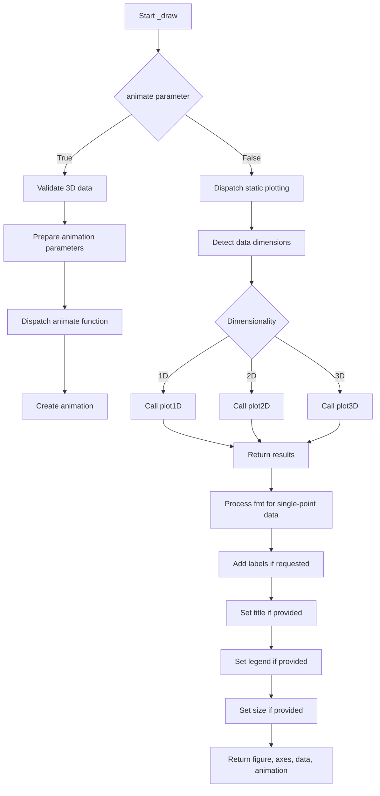

# `draw.py`

## `hypertools.plot.draw._draw` · *function*

## Summary:
Draws static or animated plots for 1D, 2D, or 3D data with customizable styling, labels, and interactive features.

## Description:
The `_draw` function serves as the core plotting engine for the hypertools library, supporting visualization of multi-dimensional data in both static and animated formats. It automatically detects the dimensionality of input data and routes to appropriate plotting functions. The function supports various plot styles including line plots, scatter plots, and 3D wireframe visualizations, with options for animations, labels, and interactive exploration.

Known callers within the codebase:
- `hypertools.plot.plot` - The main public interface that calls `_draw` after preprocessing data and parameters
- `hypertools.plot.animate` - Direct caller for animation-specific functionality

This logic is extracted into its own function rather than being inlined because it encapsulates the complex logic for:
- Dimensionality detection and routing to appropriate plotting methods
- Static vs animated plot handling
- 1D/2D/3D data processing with different rendering strategies
- Label and annotation management
- Animation control and timing
- Interactive features like mouse motion and click events

## Args:
    x (list of numpy arrays): List of data arrays to plot, where each array represents a dataset with shape (n_points, dimensions). All arrays must have the same number of columns (dimensions).
    legend (list of str, optional): Legend labels for each data series. Defaults to None.
    title (str, optional): Plot title. Defaults to None.
    labels (bool or list of str): Whether to display labels for data points, or a list of custom labels. Defaults to False.
    show (bool): Whether to display the plot. Defaults to True.
    kwargs_list (list of dicts, optional): List of keyword arguments for each data series. Defaults to None.
    fmt (list of str, optional): Format strings for each data series. Defaults to None. Note: Single-point data with line formats ('-', ':', '--') gets converted to marker format ('.') for proper display.
    animate (bool or str): Enable animation. Can be True/'parallel'/'spin' for animated plots, False for static. Defaults to False.
    tail_duration (float): Duration of the trailing line in seconds for animated plots. Defaults to 2.
    rotations (int): Number of rotations for animated views. Defaults to 2.
    zoom (float): Zoom level for 3D plots. Defaults to 1.
    chemtrails (bool): Whether to show chemtrail effects in animations. Defaults to False.
    precog (bool): Whether to show future trajectory in animations. Defaults to False.
    bullettime (bool): Whether to slow down animation at the beginning. Defaults to False.
    frame_rate (int): Frame rate for animations. Defaults to 50.
    elev (int): Elevation angle for 3D plots. Defaults to 10.
    azim (int): Azimuthal angle for 3D plots. Defaults to -60.
    duration (int): Duration of animation in seconds. Defaults to 30.
    explore (bool): Enable interactive exploration mode. Defaults to False.
    size (tuple, optional): Figure size as (width, height). Defaults to None.
    ax (matplotlib.axes.Axes, optional): Axes object to draw on. Defaults to None.

## Returns:
    tuple: A tuple containing (figure, axes, data, animation_object) where:
        - figure (matplotlib.figure.Figure): The created figure object
        - axes (matplotlib.axes.Axes): The axes object used for plotting
        - data (list): The input data arrays
        - animation_object (matplotlib.animation.Animation or None): Animation object if animate=True, otherwise None

## Raises:
    AssertionError: When animate=True is specified but data is not 3D (shape[1] != 3)

## Constraints:
    Preconditions:
    - Input data arrays in x must have consistent number of columns (dimensions)
    - When animate=True, all data arrays must be 3D (shape[1] == 3)
    - If labels is a list, it must have the same length as the number of data series
    - fmt parameter, if provided, must match the number of data series
    - Data arrays must have at least one row (n_points >= 1)

    Postconditions:
    - Returns a valid matplotlib figure and axes object
    - Animation object is returned only when animate parameter is truthy
    - Labels are properly positioned and displayed when enabled
    - Plot is configured according to specified parameters
    - Single-point data with line formats gets converted to marker format

## Side Effects:
    - Creates matplotlib figures and axes
    - May modify global state through matplotlib canvas connections
    - Connects event handlers to figure canvas for interactive features
    - May disable interactive mode if show=False
    - Modifies the fmt parameter in-place for single-point data

## Control Flow:


## Examples:
    # Basic 2D line plot
    data = [np.random.randn(100, 2)]
    fig, ax, data, ani = _draw(data, title="Sample Plot")

    # Animated 3D plot with chemtrails
    data = [np.random.randn(100, 3)]
    fig, ax, data, ani = _draw(data, animate='parallel', chemtrails=True, tail_duration=3)

    # Multiple 2D datasets with labels
    data1 = np.random.randn(50, 2)
    data2 = np.random.randn(50, 2)
    fig, ax, data, ani = _draw([data1, data2], labels=['Dataset 1', 'Dataset 2'], legend=['A', 'B'])

    # Interactive exploration mode
    data = [np.random.randn(100, 3)]
    fig, ax, data, ani = _draw(data, explore=True, labels=True)
```

