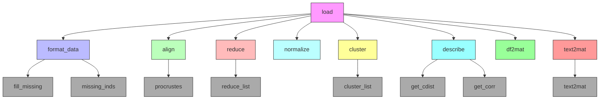

# `hypertools.tools`

## Tree:
    tools/
    ├── align.py
    ├── analyze.py
    ├── cluster.py
    ├── describe.py
    ├── df2mat.py
    ├── format_data.py
    ├── load.py
    ├── missing_inds.py
    ├── normalize.py
    ├── procrustes.py
    ├── reduce.py
    └── text2mat.py

## Role:
Provides a comprehensive suite of data processing, transformation, and analysis utilities for preparing and analyzing complex datasets in visualization workflows.

## Description:
The tools module serves as the foundational data processing layer for the hypertools library, offering a collection of specialized functions for handling diverse data types and analysis requirements. It encapsulates common preprocessing, transformation, and analytical operations that are frequently needed when working with multidimensional data for visualization and comparative analysis.

This module is designed to support end-to-end data workflows, from raw data loading and preprocessing to advanced transformations like alignment, dimensionality reduction, and clustering. The tools are carefully organized to maintain clear separation of concerns while enabling seamless integration between different processing steps.

## Components:
- **align**: Implements data alignment techniques (hyperalignment, SRM) for comparing datasets across subjects or conditions
- **analyze**: Provides analysis capabilities including dimensionality reduction performance evaluation and correlation analysis
- **cluster**: Offers flexible clustering solutions with automatic data formatting and multiple algorithm support
- **describe**: Evaluates dimensionality reduction effectiveness by measuring correlation preservation across component counts
- **df2mat**: Converts mixed-type pandas DataFrames into numerical matrices suitable for visualization
- **format_data**: Handles data preprocessing including missing value imputation and dimensionality reduction
- **load**: Unified data loading interface supporting example datasets, file paths, and legacy formats
- **missing_inds**: Identifies missing value positions in datasets for targeted handling
- **normalize**: Applies various z-score normalization strategies for data standardization
- **procrustes**: Performs Procrustes analysis for optimal linear transformation between datasets
- **reduce**: Implements dimensionality reduction techniques using scikit-learn models
- **text2mat**: Processes text data through vectorization and topic modeling for numerical representation

## Public API:
- **align(data, align='hyper', format_data=True)**: Aligns multiple datasets into a common coordinate system
- **analyze(x, reduce='IncrementalPCA', max_dims=None, show=True, format_data=True)**: Analyzes dimensionality reduction performance
- **cluster(x, cluster='KMeans', n_clusters=3, format_data=True)**: Performs clustering on input data
- **describe(x, reduce='IncrementalPCA', max_dims=None, show=True, format_data=True)**: Evaluates dimensionality reduction effectiveness
- **df2mat(data, return_labels=False)**: Converts pandas DataFrame to numerical matrix
- **fill_missing(x)**: Imputes missing values using PPCA
- **format_data(x, ppca=True, format_data=True)**: Formats data for analysis with optional PCA preprocessing
- **load(dataset, reduce=None, ndims=None, align=None, normalize=None, legacy=False)**: Loads and optionally transforms data
- **missing_inds(x, format_data=True)**: Identifies missing value indices
- **normalize(x, normalize='across', internal=False, format_data=True)**: Normalizes data using various z-score strategies
- **procrustes(source, target, scaling=True, reflection=True, reduction=False, oblique=False, format_data=True)**: Performs Procrustes analysis for data alignment
- **reduce(x, reduce='IncrementalPCA', ndims=None, format_data=True)**: Applies dimensionality reduction to data
- **text2mat(x, vmodel=None, tmodel=None, model_is_fit=False)**: Converts text data to numerical representations

## Dependencies:
- **Internal imports**: 
  - `hypertools.tools.format_data` - for data formatting utilities
  - `hypertools.tools.load` - for data loading functionality
  - `hypertools.tools.missing_inds` - for missing value identification
  - `hypertools.tools.procrustes` - for Procrustes analysis
  - `hypertools.tools.reduce` - for dimensionality reduction
  - `hypertools.tools.cluster` - for clustering operations
  - `hypertools.tools.describe` - for descriptive statistics and analysis
  - `hypertools.tools.align` - for data alignment operations
  - `hypertools.tools.normalize` - for data normalization
  - `hypertools.tools.df2mat` - for DataFrame to matrix conversion
  - `hypertools.tools.text2mat` - for text data processing

- **External imports**:
  - `numpy` - Core numerical operations and array handling
  - `pandas` - Data manipulation and DataFrame operations
  - `scipy` - Scientific computing functions including distance calculations
  - `sklearn` - Machine learning algorithms and preprocessing tools
  - `matplotlib` - Visualization capabilities
  - `seaborn` - Statistical data visualization
  - `requests` - HTTP requests for downloading example datasets
  - `pickle` - Serialization for data persistence
  - `os`, `pathlib` - File system operations
  - `warnings` - Warning management
  - `inspect` - Runtime introspection
  - `typing` - Type hinting support

## Constraints:
- All functions expect input data to be compatible with numpy operations
- Data alignment functions require datasets to have matching sample counts
- Dimensionality reduction functions require sufficient samples relative to features
- Some functions have deprecated parameters that will be removed in future versions
- Text processing functions require scikit-learn models to be properly fitted
- Loading functions may require internet connectivity for example datasets
- Thread safety: Most functions are stateless and thread-safe, except those that modify global state or cache files

## Component Interaction Diagram:

---

## Files

- [`align.py`](tools/align.md)
- [`analyze.py`](tools/analyze.md)
- [`cluster.py`](tools/cluster.md)
- [`describe.py`](tools/describe.md)
- [`df2mat.py`](tools/df2mat.md)
- [`format_data.py`](tools/format_data.md)
- [`load.py`](tools/load.md)
- [`missing_inds.py`](tools/missing_inds.md)
- [`normalize.py`](tools/normalize.md)
- [`procrustes.py`](tools/procrustes.md)
- [`reduce.py`](tools/reduce.md)
- [`text2mat.py`](tools/text2mat.md)

