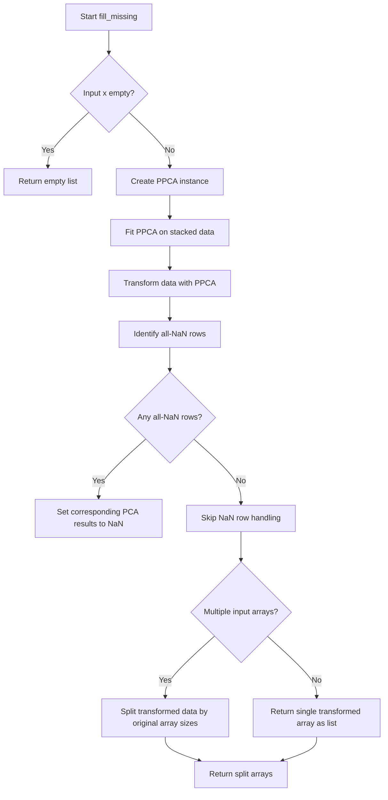

# `format_data.py`

## `hypertools.tools.format_data.format_data` · *function*

*No documentation generated.*

## `hypertools.tools.format_data.fill_missing` · *function*

## Summary:
Fills missing values in data arrays using Probabilistic Principal Component Analysis (PPCA) and preserves rows with all-NaN entries.

## Description:
This function applies Probabilistic Principal Component Analysis to impute missing values in data arrays. It takes a list of data arrays, stacks them vertically, fits a PPCA model to handle missing data, and transforms the data. Rows that contain all NaN values are identified and preserved as NaN in the output. The function maintains the original structure by splitting the results back into separate arrays when multiple inputs are provided.

The function is extracted from the data processing pipeline to encapsulate the missing value imputation logic using probabilistic dimensionality reduction, separating this concern from other data processing steps like alignment or formatting.

## Args:
    x (list): A list of numpy arrays or similar data structures containing numerical data with potential missing values (represented as np.nan).

## Returns:
    list: A list of arrays with missing values filled using PPCA. If the input contains multiple arrays, the output will contain the same number of arrays split according to the original input structure. If the input contains a single array, a list with one element is returned.

## Raises:
    None explicitly raised by this function, though underlying PPCA operations may raise RuntimeError if improperly configured.

## Constraints:
    Preconditions:
        - Input `x` must be a list of arrays/matrices
        - Arrays in the list should be compatible for vertical stacking (same number of columns)
        
    Postconditions:
        - Output arrays will have the same shape as input arrays
        - Missing values in input arrays are replaced with imputed values
        - Rows with all NaN values in input are preserved as all NaN in output

## Side Effects:
    None: This function performs no I/O operations or external state mutations.

## Control Flow:

## Examples:
    >>> import numpy as np
    >>> # Single array with missing values
    >>> data = [np.array([[1, 2], [np.nan, 4]])]
    >>> result = fill_missing(data)
    >>> print(result[0])
    # Returns array with imputed values
    
    >>> # Multiple arrays with missing values
    >>> data1 = np.array([[1, 2], [np.nan, 4]])
    >>> data2 = np.array([[5, np.nan], [7, 8]])
    >>> result = fill_missing([data1, data2])
    >>> print(len(result))
    # Returns 2 arrays with imputed values

