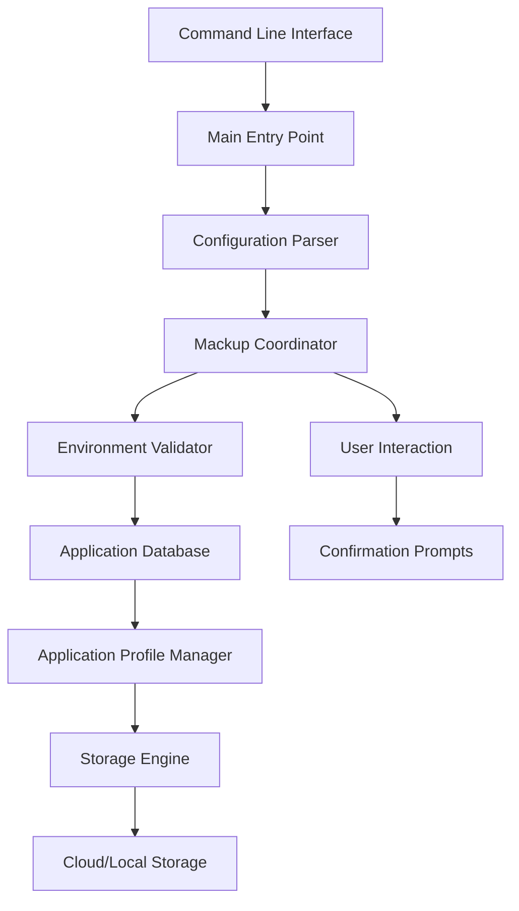

# `mackup`

## Repository Overview

### Tree Structure
```
mackup/
└── mackup/
    ├── application.py
    ├── appsdb.py
    ├── config.py
    ├── mackup.py
    ├── main.py
    └── utils.py
```

### Purpose
The mackup repository provides a comprehensive solution for managing application configuration backups, restores, and uninstalls across different operating systems and cloud storage platforms. It addresses the common problem of losing application settings when switching computers, reinstalling operating systems, or managing multiple development environments.

Target users include developers, power users, and anyone who wants to preserve their application configurations across system changes. The tool is particularly valuable for developers who rely on numerous applications with complex configuration files.

In the broader ecosystem, mackup serves as a standalone configuration management utility that can be integrated into larger DevOps workflows or used independently for personal configuration management.

### Architecture


The system follows a pipeline architecture pattern where:
- The main entry point orchestrates operations through a command-line interface
- Configuration management handles user preferences and storage settings  
- Environment validation ensures safe operations
- Application database maintains metadata about supported applications
- Application profile managers handle individual application operations
- Storage engines abstract platform-specific file operations

### Entry Points
1. **CLI Commands**: `mackup` command-line interface
   - Exposes backup, restore, and uninstall operations
   - Accepts standard command-line arguments via docopt
   - Target audience: System administrators, developers, power users

2. **Importable APIs**: Direct module imports
   - `from mackup import Mackup, Config, ApplicationProfile`
   - Exposes core classes for programmatic usage
   - Target audience: Developers building integrations

3. **Service Endpoints**: None (standalone tool)

### Core Features
- **Backup Management**: Backs up application configuration files to selected storage platforms
- **Restore Operations**: Restores application configurations from backup
- **Uninstall Support**: Completely removes application configurations while preserving user data
- **Multi-Platform Support**: Works across Linux, macOS, and Windows
- **Multi-Storage Support**: Integrates with Dropbox, Google Drive, Copy, iCloud, and local filesystems
- **Application Database**: Maintains registry of supported applications and their configuration files
- **Selective Sync**: Allows users to specify which applications to backup/restore

### Dependencies
- **Internal Dependencies**: 
  - `configparser`: For parsing configuration files
  - `os`, `sys`, `subprocess`, `platform`: For system-level operations
  - `shutil`, `stat`, `glob`: For file system operations
  - `sqlite3`: For accessing database files (Google Drive, Copy)
  - `base64`: For decoding Dropbox host database entries
  - `docopt`: For command-line argument parsing

- **External Dependencies**: None explicitly listed, but relies on underlying OS APIs for file operations and storage access

### Configuration
The system supports configuration through:
- `.mackup.cfg` configuration file in user home directory
- Environment variables for storage location overrides
- Command-line arguments for runtime options
- Default settings for common storage platforms

### Extension Points
The system supports extension through:
- Plugin-like architecture via the ApplicationsDatabase for adding new applications
- Custom storage engine implementations (though not explicitly documented)
- Configuration-driven behavior for specifying applications to sync/ignore
- Subclassing of core classes for custom behavior

---

## Modules

- [`mackup`](mackup.md)

