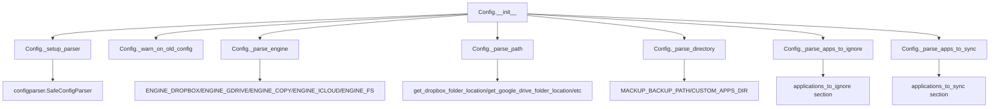
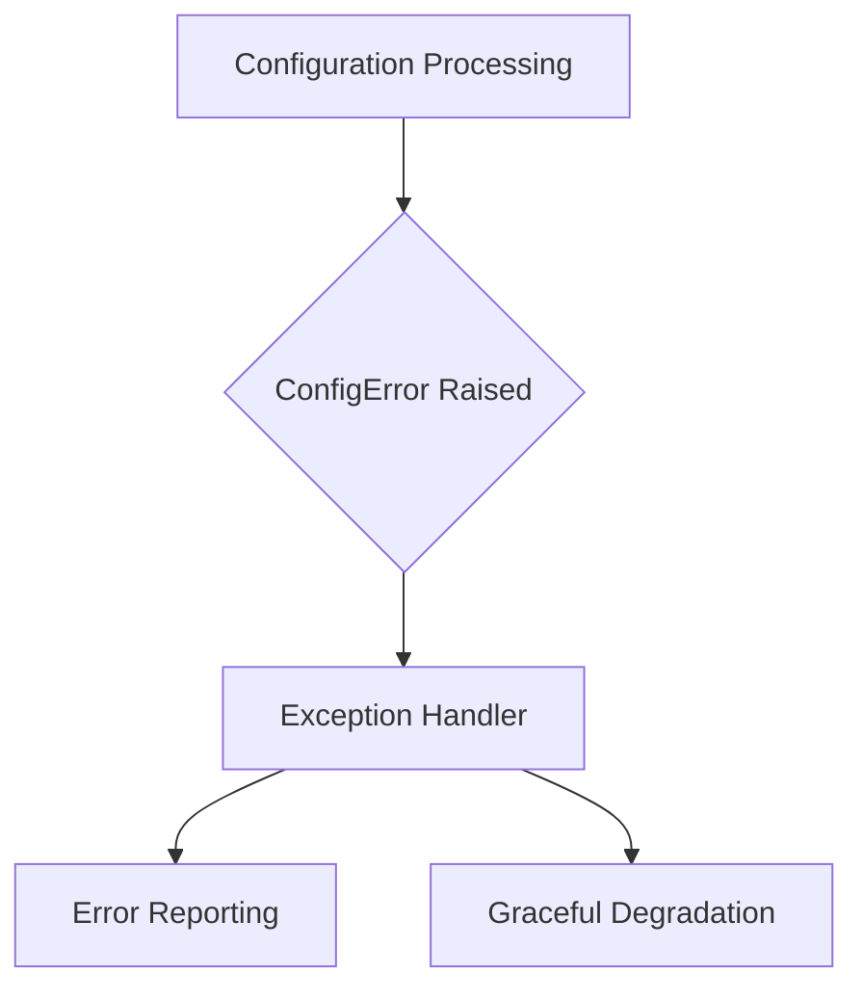

# `config.py`

## `mackup.config.Config` · *class*

## Summary:
Configuration class for managing Mackup backup settings including storage engine, path, directory, and application filtering.

## Description:
The Config class reads and parses configuration files to determine backup storage settings and application preferences. It supports multiple storage engines (Dropbox, Google Drive, Copy, iCloud, and filesystem) and allows users to specify which applications to ignore or sync. This class acts as a central configuration manager for the Mackup backup tool, parsing configuration from a file located in the user's home directory.

## State:
- `_parser`: configparser.SafeConfigParser object containing parsed configuration data
- `_engine`: string representing the chosen storage engine (one of ENGINE_DROPBOX, ENGINE_GDRIVE, ENGINE_COPY, ENGINE_ICLOUD, ENGINE_FS)
- `_path`: string representing the base storage path for backups
- `_directory`: string representing the backup directory name within the storage path
- `_apps_to_ignore`: set of application names to exclude from backup
- `_apps_to_sync`: set of application names to include in backup
- `filename`: optional parameter passed to constructor, defaults to MACKUP_CONFIG_FILE

## Lifecycle:
- Creation: Instantiate with optional filename parameter pointing to configuration file (defaults to MACKUP_CONFIG_FILE in user's home directory)
- Usage: Access read-only properties like engine, path, directory, apps_to_ignore, apps_to_sync
- Destruction: No explicit cleanup required, uses standard Python garbage collection

## Method Map:


## Raises:
- AssertionError: Raised when filename parameter is not a string or None
- ConfigError: Raised when unknown storage engine is specified, invalid directory is used, or required path is missing for filesystem engine

## Example:
```python
# Create config instance
config = Config()

# Access configuration properties
print(config.engine)           # e.g., "dropbox"
print(config.path)             # e.g., "/home/user/Dropbox"
print(config.directory)        # e.g., ".mackup"
print(config.fullpath)         # e.g., "/home/user/Dropbox/.mackup"
print(config.apps_to_ignore)   # e.g., {"vim", "git"}
print(config.apps_to_sync)     # e.g., {"firefox", "chrome"}

# The apps_to_ignore and apps_to_sync properties return immutable sets
# that can be used for set operations
ignored_apps = config.apps_to_ignore
sync_apps = config.apps_to_sync
```

### `mackup.config.Config.__init__` · *method*

## Summary:
Initializes a Config object by parsing configuration data from a file and setting up storage engine, path, directory, and application filtering parameters.

## Description:
The Config.__init__ method serves as the primary constructor for the configuration management class. It initializes all configuration parameters by calling specialized parsing methods that extract settings from a configuration file. This method orchestrates the complete configuration loading process, ensuring all necessary parameters are properly validated and set before the object is ready for use.

## Args:
    filename (str, optional): Path to the configuration file. If None, defaults to MACKUP_CONFIG_FILE constant. Defaults to None.

## Returns:
    None: This method initializes the object's state and does not return a value.

## Raises:
    AssertionError: When filename argument is not a string or None.

## State Changes:
    Attributes READ: None
    Attributes WRITTEN: 
        - self._parser: Set to the result of _setup_parser(filename)
        - self._engine: Set to the result of _parse_engine()
        - self._path: Set to the result of _parse_path()
        - self._directory: Set to the result of _parse_directory()
        - self._apps_to_ignore: Set to the result of _parse_apps_to_ignore()
        - self._apps_to_sync: Set to the result of _parse_apps_to_sync()

## Constraints:
    Preconditions:
        - filename must be either a string or None
        - HOME environment variable must be set and accessible
        - Configuration file must exist at the computed path if filename is provided
        - All helper methods (_setup_parser, _warn_on_old_config, _parse_engine, _parse_path, _parse_directory, _parse_apps_to_ignore, _parse_apps_to_sync) must be callable and properly implemented
    
    Postconditions:
        - All configuration parameters are parsed and validated
        - The object is ready for use with all configuration properties accessible
        - If deprecated configuration sections are found, the program will terminate

## Side Effects:
    - Reads from the filesystem to load configuration data
    - May call error() function and terminate execution if deprecated configuration sections are detected
    - No modifications to external state beyond reading configuration files

### `mackup.config.Config.engine` · *method*

## Summary:
Returns the configured storage engine type as a string.

## Description:
Provides access to the storage engine configuration, which determines how Mackup synchronizes application settings. This property is initialized during object construction and reflects the engine specified in the configuration file or defaults to Dropbox if not specified.

## Args:
    None

## Returns:
    str: The storage engine type as a string, one of: 'dropbox', 'google_drive', 'copy', 'icloud', or 'file_system'

## Raises:
    None

## State Changes:
    Attributes READ: self._engine
    Attributes WRITTEN: None

## Constraints:
    Preconditions: The Config object must be properly initialized with a valid configuration parser
    Postconditions: The returned value is always a string representation of the engine type

## Side Effects:
    None

### `mackup.config.Config.path` · *method*

## Summary:
Returns the absolute path to the backup directory for the configured storage engine.

## Description:
This property provides access to the resolved backup directory path determined during configuration parsing. The path is computed based on the storage engine specified in the configuration file and corresponds to the user's cloud storage location or custom filesystem path.

## Args:
    None

## Returns:
    str: The absolute path to the backup directory for the configured storage engine.

## Raises:
    None

## State Changes:
    Attributes READ: self._path
    Attributes WRITTEN: None

## Constraints:
    Preconditions:
    - The Config object must be properly initialized with a valid configuration
    - self._path must be initialized (set during __init__)
    Postconditions:
    - Returns a valid string path that can be used for backup operations

## Side Effects:
    None

### `mackup.config.Config.directory` · *method*

## Summary:
Returns the string representation of the backup directory path configured for Mackup.

## Description:
This method provides access to the backup directory path that has been parsed from the configuration file during initialization. It serves as a property accessor for the internal `_directory` attribute, ensuring that the directory path is always returned as a string regardless of its original type.

## Args:
    None

## Returns:
    str: The backup directory path as a string, either from the configuration file's 'directory' option or the default MACKUP_BACKUP_PATH constant.

## Raises:
    None

## State Changes:
    Attributes READ: self._directory
    Attributes WRITTEN: None

## Constraints:
    Preconditions:
        - The Config instance must have been properly initialized
        - The `_directory` attribute must have been set during initialization (via `_parse_directory()` method)
    Postconditions:
        - Returns a string representation of the directory path
        - The returned value is guaranteed to be a string

## Side Effects:
    None

### `mackup.config.Config.fullpath` · *method*

## Summary:
Returns the absolute path by joining the configuration path with the directory name.

## Description:
This method constructs a full filesystem path by combining the base path stored in self.path with the directory name stored in self.directory. It is used to determine the complete location where configuration files should be stored or retrieved.

## Args:
    None

## Returns:
    str: A string representing the full filesystem path constructed by joining self.path and self.directory.

## Raises:
    None explicitly raised

## State Changes:
    Attributes READ: self.path, self.directory
    Attributes WRITTEN: None

## Constraints:
    Preconditions: Both self.path and self.directory must be valid path components
    Postconditions: The returned string represents a valid joined path

## Side Effects:
    None

### `mackup.config.Config.apps_to_ignore` · *method*

*No documentation generated.*

### `mackup.config.Config.apps_to_sync` · *method*

## Summary:
Returns a set of application names that are configured to be synchronized by Mackup.

## Description:
This property provides access to the collection of applications that have been explicitly configured for synchronization in the Mackup configuration file. It retrieves the parsed list of applications from the "applications_to_sync" section and returns them as a set for efficient membership testing and set operations.

## Args:
    None

## Returns:
    set[str]: A set containing the names of applications configured to be synchronized. Returns an empty set if no applications are configured for synchronization.

## Raises:
    None

## State Changes:
    Attributes READ: self._apps_to_sync
    Attributes WRITTEN: None

## Constraints:
    Preconditions: The Config instance must be properly initialized with a valid configuration file.
    Postconditions: The returned set is immutable and represents the state of applications to sync at the time of property access.

## Side Effects:
    None

### `mackup.config.Config._setup_parser` · *method*

## Summary:
Initializes and configures a SafeConfigParser instance to read configuration files from the user's home directory.

## Description:
This method creates a SafeConfigParser object with specific settings for handling configuration files, including support for inline comments and values without explicit assignment. It reads configuration data from a specified file path located in the user's home directory and returns the configured parser instance.

## Args:
    filename (str, optional): Path to the configuration file. If None, defaults to MACKUP_CONFIG_FILE constant.

## Returns:
    configparser.SafeConfigParser: A configured parser instance ready to read the specified configuration file.

## Raises:
    AssertionError: When filename argument is not a string or None.

## State Changes:
    Attributes READ: None
    Attributes WRITTEN: None

## Constraints:
    Preconditions: 
    - HOME environment variable must be set and accessible
    - filename must be either a string or None
    - Configuration file must exist at the computed path
    
    Postconditions:
    - Returns a valid SafeConfigParser instance
    - Parser is configured with allow_no_value=True and inline_comment_prefixes=(";", "#")

## Side Effects:
    - Reads from the filesystem to load configuration data
    - May raise exceptions if the configuration file doesn't exist or is unreadable

### `mackup.config.Config._warn_on_old_config` · *method*

## Summary:
Checks for deprecated configuration sections and aborts if found to prevent using outdated config formats.

## Description:
This private method validates the configuration file during initialization by scanning for deprecated sections that were used in older versions of Mackup. If either "Allowed Applications" or "Ignored Applications" sections are detected, it displays an error message and terminates execution to prevent potential data corruption or unexpected behavior from using outdated configuration syntax.

## Args:
    None

## Returns:
    None

## Raises:
    SystemExit: When deprecated configuration sections are detected, causing the program to terminate with an error message.

## State Changes:
    Attributes READ: self._parser
    Attributes WRITTEN: None

## Constraints:
    Preconditions: 
    - self._parser must be initialized and contain parsed configuration data
    - This method should only be called during Config class initialization
    
    Postconditions:
    - Program execution terminates if deprecated sections are found
    - No changes are made to the Config object's state if no deprecated sections are found

## Side Effects:
    - Calls error() function which prints an error message to stderr and exits the program
    - No modifications to any object attributes or external state

### `mackup.config.Config._parse_engine` · *method*

## Summary:
Parses and validates the storage engine configuration option from the configuration parser.

## Description:
This method extracts the storage engine specification from the configuration file's "storage" section. It provides a fallback to Dropbox engine if no engine is specified, and validates that the specified engine is one of the supported options. This method is called during object initialization to set up the storage engine configuration.

## Args:
    None

## Returns:
    str: The validated storage engine identifier as a string, one of: 'dropbox', 'gdrive', 'copy', 'icloud', or 'fs'

## Raises:
    ConfigError: When an unknown or unsupported storage engine is specified in the configuration

## State Changes:
    Attributes READ: self._parser
    Attributes WRITTEN: None

## Constraints:
    Preconditions: 
    - self._parser must be initialized as a configparser object
    - The configuration parser must be properly loaded with configuration data
    
    Postconditions:
    - Returns a string representing a valid storage engine
    - The returned engine is one of the predefined ENGINE_* constants

## Side Effects:
    None

### `mackup.config.Config._parse_path` · *method*

## Summary:
Determines and returns the appropriate backup path based on the configured storage engine.

## Description:
This method resolves the correct backup directory path according to the storage engine specified in the configuration. It handles multiple cloud storage providers (Dropbox, Google Drive, Copy) and local filesystem options. The method is called during configuration parsing to establish the proper backup location.

## Args:
    None

## Returns:
    str: The absolute path to the backup directory for the configured storage engine.

## Raises:
    ConfigError: When using the 'file_system' engine and the required 'path' option is missing from the configuration.

## State Changes:
    Attributes READ: self.engine, self._parser
    Attributes WRITTEN: None

## Constraints:
    Preconditions: 
    - self.engine must be one of the defined engine constants (ENGINE_DROPBOX, ENGINE_GDRIVE, ENGINE_COPY, ENGINE_ICLOUD, ENGINE_FS)
    - self._parser must be initialized and contain configuration data
    Postconditions:
    - Returns a valid string path that can be used for backup operations

## Side Effects:
    None

### `mackup.config.Config._parse_directory` · *method*

## Summary:
Parses and validates the storage directory configuration option, returning a safe directory path for backups.

## Description:
This method retrieves the storage directory from the configuration parser's "storage" section. If a custom directory is specified and it matches the reserved CUSTOM_APPS_DIR constant, it raises a ConfigError. When no directory is configured, it defaults to MACKUP_BACKUP_PATH. This method is called during Config class initialization to set the _directory attribute.

## Args:
    None

## Returns:
    str: The validated storage directory path as a string, either from configuration or the default MACKUP_BACKUP_PATH.

## Raises:
    ConfigError: When the configured directory equals CUSTOM_APPS_DIR, indicating an invalid storage location.

## State Changes:
    Attributes READ: self._parser
    Attributes WRITTEN: None

## Constraints:
    Preconditions: The Config instance must have a valid _parser attribute containing configuration data
    Postconditions: Returns a string representing a valid storage directory path

## Side Effects:
    None

### `mackup.config.Config._parse_apps_to_ignore` · *method*

## Summary:
Parses the applications_to_ignore section from the configuration file and returns a set of application names to exclude from backup operations.

## Description:
This method extracts application names from the "applications_to_ignore" section in the configuration file. It's called during the initialization of the Config class to populate the internal `_apps_to_ignore` attribute. The method leverages Python's configparser module to check for the existence of the section and retrieve all option names as application identifiers.

## Args:
    None

## Returns:
    set[str]: A set containing the names of applications to ignore during backup operations. Returns an empty set if the "applications_to_ignore" section doesn't exist in the configuration file.

## Raises:
    None

## State Changes:
    Attributes READ: 
        - self._parser: Used to check for section existence and retrieve options
    
    Attributes WRITTEN: 
        - None

## Constraints:
    Preconditions:
        - self._parser must be a valid configparser object initialized during Config construction
        - The parser should have already read the configuration file
        
    Postconditions:
        - Returns a set of strings representing application names to ignore
        - If the section exists, all options in that section are returned as elements in the set
        - If the section doesn't exist, returns an empty set

## Side Effects:
    None

### `mackup.config.Config._parse_apps_to_sync` · *method*

*No documentation generated.*

## `mackup.config.ConfigError` · *class*

## Summary:
Represents configuration-related errors that occur during Mackup's configuration processing.

## Description:
ConfigError is a custom exception class that extends Python's built-in Exception class. It serves as a specialized error type for handling configuration-related issues within the Mackup application. This exception is raised when the configuration parsing, validation, or processing encounters problems that prevent proper operation.

The class acts as a clear indicator to callers that an issue occurred specifically within the configuration subsystem, allowing for more granular error handling compared to generic exceptions.

## State:
- Inherits all state from Exception base class
- No additional instance attributes are defined
- The exception message contains details about the specific configuration problem encountered

## Lifecycle:
- Creation: Instantiated when configuration-related errors occur, typically by raising the exception with descriptive error messages
- Usage: Caught by exception handlers in the configuration processing pipeline to provide appropriate error responses
- Destruction: Automatically cleaned up by Python's garbage collector after being handled

## Method Map:


## Raises:
- ConfigError is raised when configuration validation fails or when invalid configuration data is encountered
- Trigger conditions typically include malformed configuration files, missing required configuration options, or invalid configuration values

## Example:
```python
try:
    # Configuration processing code
    config = load_configuration()
except ConfigError as e:
    print(f"Configuration error: {e}")
    # Handle configuration-specific error appropriately
```

