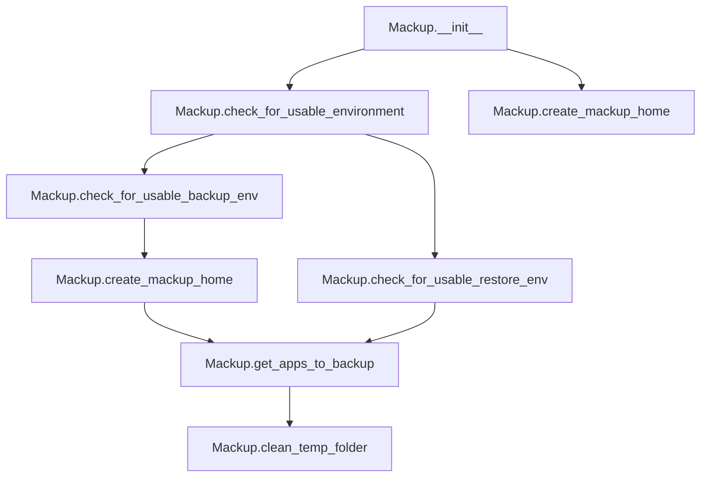

# `mackup.py`

## `mackup.mackup.Mackup` · *class*

## Summary:
Mackup class manages the core backup and restore operations for application configurations, handling environment setup, folder management, and application selection.

## Description:
The Mackup class serves as the central coordinator for the Mackup backup system. It manages the configuration, temporary file handling, and environment validation required for backing up and restoring application configurations. The class is responsible for ensuring the backup environment is properly set up, validating that required directories exist, and providing mechanisms for selecting which applications to backup.

This class is typically instantiated by the main application entry point and is used throughout the backup/restore workflow to manage the underlying infrastructure and configuration decisions.

## State:
- `_config`: config.Config object holding all configuration settings including storage engine, path, and application filtering preferences
- `mackup_folder`: str representing the full path to the Mackup storage directory (derived from config.fullpath)
- `temp_folder`: str representing the path to a temporary directory created for operations

## Lifecycle:
- Creation: Instantiate with `Mackup()` - automatically initializes configuration and creates a temporary directory
- Usage: Call methods in sequence for environment validation, folder management, and application selection
- Destruction: Temporary directory is cleaned up via `clean_temp_folder()` method

## Method Map:


## Raises:
- SystemExit: Raised by `check_for_usable_environment()` when running as root without permission or when the configured storage directory cannot be found
- SystemExit: Raised by `check_for_usable_restore_env()` when the Mackup folder cannot be found
- SystemExit: Raised by `create_mackup_home()` when user declines to create the Mackup directory

## Example:
```python
# Create Mackup instance
mackup = Mackup()

# Check environment for backup operation
mackup.check_for_usable_backup_env()

# Get list of applications to backup
apps_to_backup = mackup.get_apps_to_backup()

# Clean up temporary files when done
mackup.clean_temp_folder()
```

### `mackup.mackup.Mackup.__init__` · *method*

## Summary:
Initializes a Mackup instance by setting up configuration and creating a temporary directory for operations.

## Description:
The `__init__` method serves as the constructor for the Mackup class, establishing the fundamental infrastructure required for backup and restore operations. It creates a configuration object to manage storage settings and application preferences, then establishes the backup directory path and creates a temporary workspace for intermediate operations.

This method is automatically invoked when creating a new Mackup instance and forms the foundation for all subsequent backup operations. It ensures that the basic environment is ready before any backup or restore activities begin.

## Args:
    None

## Returns:
    None

## Raises:
    None

## State Changes:
    Attributes READ: 
        - self._config: Used to access configuration properties
    
    Attributes WRITTEN:
        - self._config: Initialized with a new config.Config() instance
        - self.mackup_folder: Set to the full path from the configuration
        - self.temp_folder: Set to a newly created temporary directory path

## Constraints:
    Preconditions:
        - The config module must be properly imported and available
        - The tempfile module must be available for temporary directory creation
        
    Postconditions:
        - A valid config.Config instance is stored in self._config
        - self.mackup_folder contains the full path to the Mackup storage directory
        - self.temp_folder contains the path to a temporary directory for operations

## Side Effects:
    - Creates a temporary directory on the filesystem
    - May raise SystemExit if the configuration setup fails (though this happens indirectly through the config object)

### `mackup.mackup.Mackup.check_for_usable_environment` · *method*

## Summary:
Validates that the current environment is safe and usable for Mackup operations by checking root privileges and storage directory existence.

## Description:
This method performs essential environment validation to ensure Mackup can operate safely and effectively. It prevents dangerous operations when running as superuser (unless explicitly permitted) and confirms that the configured storage directory exists. This validation is critical for both backup and restore operations to prevent data loss or corruption.

The method is called internally by `check_for_usable_backup_env` and `check_for_usable_restore_env` to establish a safe working environment before proceeding with backup or restore operations.

## Args:
    None

## Returns:
    None

## Raises:
    SystemExit: When running as root without permission to do so, or when the configured storage directory cannot be found.

## State Changes:
    Attributes READ: 
        - self._config.path: Used to verify storage directory existence
        
    Attributes WRITTEN:
        - None

## Constraints:
    Preconditions:
        - The Mackup instance must be properly initialized with a valid _config object
        - The system must have appropriate file system permissions to check directory existence
        
    Postconditions:
        - Environment is validated for safe Mackup operations
        - Either the method completes successfully or the program exits with SystemExit

## Side Effects:
    - Exits the program with SystemExit if validation fails
    - Performs filesystem I/O to check directory existence

### `mackup.mackup.Mackup.check_for_usable_backup_env` · *method*

## Summary:
Validates the backup environment and ensures the Mackup home directory is available for storing configuration files.

## Description:
This method performs essential environment validation and setup required before initiating a backup operation. It first verifies that the current environment is safe and usable for backup operations, then ensures that the Mackup directory exists and is ready for storing configuration files. This method is called during backup workflows to prepare the system state before proceeding with actual backup operations.

## Args:
    None

## Returns:
    None

## Raises:
    SystemExit: When environment validation fails (e.g., running as root without permission, missing storage folder) or when user declines to create the Mackup directory.

## State Changes:
    Attributes READ: 
        - self._config.path (used in check_for_usable_environment)
        - self.mackup_folder (used in create_mackup_home)
    
    Attributes WRITTEN:
        - self.mackup_folder (potentially modified by create_mackup_home if directory is created)
        - self.temp_folder (created in __init__, but not modified by this method)

## Constraints:
    Preconditions:
        - The Mackup instance must be initialized with a valid _config object
        - The system must have appropriate permissions to create directories if needed
    
    Postconditions:
        - Environment is validated for backup operations
        - Mackup directory exists and is accessible
        - User has confirmed creation of directory if it didn't exist

## Side Effects:
    - May prompt user for confirmation via stdin when creating Mackup directory
    - May exit the program with SystemExit if validation fails
    - May create directories on the filesystem

### `mackup.mackup.Mackup.check_for_usable_restore_env` · *method*

## Summary:
Validates that the Mackup folder exists for restore operations by checking directory existence and exiting with an error if not found.

## Description:
This method ensures that the Mackup folder is available before proceeding with restore operations. It first performs general environment validation by calling `check_for_usable_environment()`, then specifically verifies that the Mackup folder exists as a directory. This validation is crucial for restore operations because without the Mackup folder containing backed-up files, no restoration can occur.

The method is called during restore workflows to prevent attempting to restore from a non-existent backup location, which would result in data loss or operation failure.

## Args:
    None

## Returns:
    None

## Raises:
    SystemExit: When the Mackup folder cannot be found, causing the program to exit with an error message.

## State Changes:
    Attributes READ: 
        - self.mackup_folder: Directory path to verify existence
        - self._config.path: Used by check_for_usable_environment() for storage directory validation
        
    Attributes WRITTEN:
        - None

## Constraints:
    Preconditions:
        - The Mackup instance must be properly initialized with a valid _config object
        - The system must have appropriate file system permissions to check directory existence
        - The check_for_usable_environment() method must pass validation
        
    Postconditions:
        - Either the method completes successfully (folder exists) or the program exits with SystemExit
        - Environment is validated for safe restore operations

## Side Effects:
    - Exits the program with SystemExit if the Mackup folder does not exist
    - Performs filesystem I/O to check directory existence
    - Calls external utility functions (utils.error) that may output to stderr

### `mackup.mackup.Mackup.clean_temp_folder` · *method*

## Summary:
Removes the temporary directory used by Mackup for intermediate operations.

## Description:
Deletes the temporary folder created during Mackup initialization. This method is typically called at the end of backup or restore operations to clean up temporary files and free up disk space.

## Args:
    None

## Returns:
    None

## Raises:
    FileNotFoundError: If the temporary folder does not exist when this method is called.
    PermissionError: If the process lacks permissions to remove the temporary folder.

## State Changes:
    Attributes READ: self.temp_folder
    Attributes WRITTEN: None

## Constraints:
    Preconditions: The self.temp_folder attribute must be initialized (typically in __init__)
    Postconditions: The temporary directory and all its contents are permanently deleted

## Side Effects:
    I/O operation: Deletes files and directories from the filesystem
    Mutates: Removes the temporary directory specified by self.temp_folder

### `mackup.mackup.Mackup.create_mackup_home` · *method*

## Summary:
Creates the Mackup home directory if it doesn't already exist, prompting user confirmation before creation.

## Description:
This method ensures that the Mackup configuration storage directory exists before proceeding with backup operations. It checks if the directory specified by `self.mackup_folder` exists, and if not, prompts the user for confirmation to create it. This separation of concerns allows the backup workflow to cleanly handle directory creation while maintaining user control over the process.

The method is called during the backup environment validation phase (`check_for_usable_backup_env`) to prepare the system state before initiating backup operations.

## Args:
    None

## Returns:
    None

## Raises:
    SystemExit: When the user declines to create the Mackup directory, causing the program to exit with an error message.

## State Changes:
    Attributes READ: 
        - self.mackup_folder: Directory path to check for existence
        
    Attributes WRITTEN:
        - None

## Constraints:
    Preconditions:
        - The Mackup instance must be initialized with a valid configuration
        - The `self.mackup_folder` attribute must be properly set to a valid path string
        
    Postconditions:
        - If the directory exists, no changes occur
        - If the directory doesn't exist, it will be created if user confirms
        - If user declines creation, program exits with SystemExit

## Side Effects:
    - Prompts user for confirmation via stdin when directory creation is needed
    - Creates directories on the filesystem if user confirms
    - Exits the program with SystemExit if user declines to create directory

### `mackup.mackup.Mackup.get_apps_to_backup` · *method*

## Summary:
Returns a set of application names that should be included in the backup process, considering user configuration and ignored applications.

## Description:
This method determines which applications should be backed up by combining the user's configured applications to sync (if specified) with the full list of available applications from the database, then excluding any applications marked for ignore. This method centralizes the logic for determining the backup scope, making it easy to manage application inclusion/exclusion rules.

The method is called during the backup preparation phase to establish which applications will have their configuration files backed up. It respects user configuration from the mackup config file, specifically the `applications_to_sync` and `applications_to_ignore` sections.

## Args:
    None

## Returns:
    set[str]: A set of application names to be backed up. Each name represents an application whose configuration files will be processed for backup.

## Raises:
    None explicitly raised

## State Changes:
    Attributes READ: 
    - self._config.apps_to_sync
    - self._config.apps_to_ignore
    
    Attributes WRITTEN: 
    - None

## Constraints:
    Preconditions:
    - self._config must be initialized and valid
    - self._config.apps_to_sync must be a set or None
    - self._config.apps_to_ignore must be iterable
    
    Postconditions:
    - The returned set contains only application names that exist in the ApplicationsDatabase
    - The returned set will not contain any applications listed in self._config.apps_to_ignore
    - If self._config.apps_to_sync is not None, the returned set will be a subset of self._config.apps_to_sync

## Side Effects:
    None

