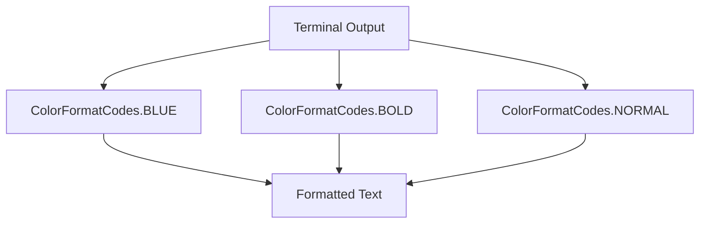
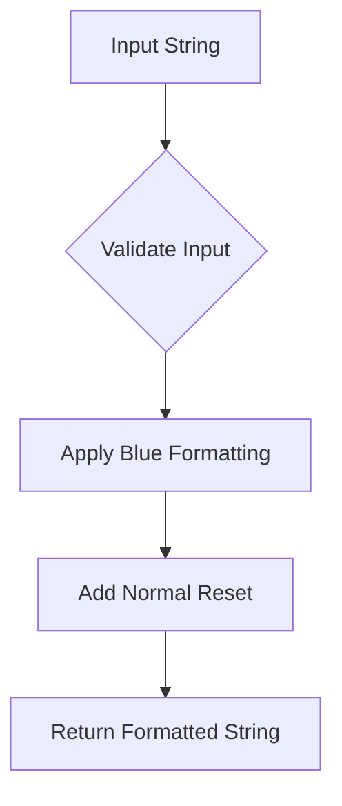

# `main.py`

## `mackup.main.ColorFormatCodes` · *class*

## Summary:
Defines ANSI escape codes for terminal text formatting including colors and styles.

## Description:
A utility class that provides constant values for ANSI terminal formatting codes. This class serves as a centralized location for terminal color and style codes used throughout the application to ensure consistent formatting and avoid magic strings in the codebase.

## State:
- BLUE: str = "\033[34m" - ANSI escape code for blue text color
- BOLD: str = "\033[1m" - ANSI escape code for bold text formatting
- NORMAL: str = "\033[0m" - ANSI escape code to reset text formatting to normal

All attributes are immutable class constants that represent ANSI terminal control sequences.

## Lifecycle:
Creation: The class is designed to be used directly via class attribute access - no instantiation required.
Usage: Access the class constants directly (e.g., ColorFormatCodes.BLUE) to apply formatting to terminal output.
Destruction: No cleanup required as this is a pure constants class.

## Method Map:


## Raises:
None - This class only defines constants and does not raise exceptions.

## Example:
```python
from mackup.main import ColorFormatCodes

# Apply formatting to text
print(f"{ColorFormatCodes.BLUE}This is blue text{ColorFormatCodes.NORMAL}")
print(f"{ColorFormatCodes.BOLD}This is bold text{ColorFormatCodes.NORMAL}")
```

## `mackup.main.header` · *function*

## Summary:
Formats a string with blue color coding for display purposes.

## Description:
Wraps the input string with blue color formatting codes to visually distinguish header content in terminal output. This function serves as a utility for consistent colored text formatting throughout the application.

## Args:
    str (str): The string to be formatted with blue color coding.

## Returns:
    str: The input string wrapped with blue color formatting codes followed by normal formatting reset.

## Raises:
    None: This function does not explicitly raise any exceptions.

## Constraints:
    Preconditions: The input must be a string type.
    Postconditions: The returned string will contain the original string wrapped with color formatting codes.

## Side Effects:
    None: This function has no side effects beyond returning a formatted string.

## Control Flow:


## Examples:
    >>> header("Welcome to Mackup")
    '\x1b[34mWelcome to Mackup\x1b[0m'

## `mackup.main.bold` · *function*

*No documentation generated.*

## `mackup.main.main` · *function*

## Summary:
Entry point function that processes command-line arguments and orchestrates backup, restore, uninstall, list, and show operations for application configurations.

## Description:
The main function serves as the primary command-line interface for the Mackup application. It parses command-line arguments using docopt (which reads from the module's docstring), initializes core components, and routes execution to appropriate operations based on user input. This function acts as the central coordinator that manages the entire backup/restore workflow by instantiating necessary objects and delegating to specialized classes for specific operations.

The function handles five main operations: backup, restore, uninstall, list, and show. Each operation follows a specific workflow involving environment validation, application selection, and file management through the ApplicationProfile class. The function also manages global state flags (FORCE_YES, CAN_RUN_AS_ROOT) and handles user confirmation prompts.

This function is extracted from the core logic to provide a clean separation between the command-line interface and the business logic. It ensures proper initialization of components, validates user intent through environment checks, and coordinates the complex multi-step operations required for backup/restore workflows.

## Args:
    None: This function does not accept parameters directly. It reads command-line arguments via docopt from the module's docstring.

## Returns:
    None: This function does not return a value. It performs operations and exits with system codes when needed.

## Raises:
    SystemExit: Raised when unsupported applications are requested in show operations, or when environment validation fails
    SystemExit: Raised by environment checking methods when running in invalid conditions (e.g., root without permission)

## Constraints:
    Preconditions: 
    - Command-line arguments must be valid according to docopt specification in the module's docstring
    - Environment must be suitable for the requested operation (backup, restore, etc.)
    - Required directories must be accessible
    
    Postconditions:
    - Temporary folders are cleaned up after execution
    - Appropriate operations are performed based on command-line arguments

## Side Effects:
    - Reads command-line arguments via docopt from module's docstring
    - Modifies global state through utils.FORCE_YES and utils.CAN_RUN_AS_ROOT
    - Performs file I/O operations for backup/restore/uninstall operations
    - Prints formatted output to stdout for user interaction
    - May prompt user for confirmation via stdin
    - Creates/deletes temporary files during execution

## Control Flow:
```mermaid
flowchart TD
    A[Parse CLI args with docopt(__doc__)] --> B{--force flag?}
    B -->|Yes| C[Set utils.FORCE_YES = True]
    B -->|No| D[Continue]
    C --> D
    D --> E{--root flag?}
    E -->|Yes| F[Set utils.CAN_RUN_AS_ROOT = True]
    E -->|No| G[Continue]
    F --> G
    G --> H{--dry-run flag?}
    H --> I[Set dry_run variable]
    I --> J{--verbose flag?}
    J --> K[Set verbose variable]
    K --> L{backup?}
    L -->|Yes| M[Check backup environment]
    M --> N[Get apps to backup]
    N --> O[Process each app with ApplicationProfile.backup()]
    O --> P[Clean temp folder]
    L -->|No| Q{restore?}
    Q -->|Yes| R[Check restore environment]
    R --> S[Restore Mackup app first]
    S --> T[Reinitialize Mackup and AppsDB]
    T --> U[Get apps to backup (excluding Mackup)]
    U --> V[Process each app with ApplicationProfile.restore()]
    V --> W[Clean temp folder]
    Q -->|No| X{uninstall?}
    X -->|Yes| Y[Check restore environment]
    Y --> Z[Confirm uninstallation]
    Z --> AA[Get apps to backup (excluding Mackup)]
    AA --> AB[Process each app with ApplicationProfile.uninstall()]
    AB --> AC[Uninstall Mackup app]
    AC --> AD[Print completion message]
    AD --> AE[Clean temp folder]
    X -->|No| AF{list?}
    AF -->|Yes| AG[Check environment]
    AG --> AH[Get all app names]
    AH --> AI[Print supported apps list]
    AI --> AJ[Clean temp folder]
    AF -->|No| AK{show?}
    AK -->|Yes| AL[Check environment]
    AL --> AM[Get app name from args]
    AM --> AN[Validate app name]
    AN --> AO[Print app info]
    AO --> AP[Clean temp folder]
    AK -->|No| AQ[Invalid command - exit]
```

## Examples:
    # Backup all configured applications
    $ mackup backup
    
    # Restore configuration files from backup
    $ mackup restore
    
    # Uninstall Mackup and restore all files to original locations
    $ mackup uninstall --dry-run
    
    # List all supported applications
    $ mackup list
    
    # Show configuration files for a specific application
    $ mackup show vim
    
    # Force yes to all prompts and run in verbose mode
    $ mackup backup --force --verbose

