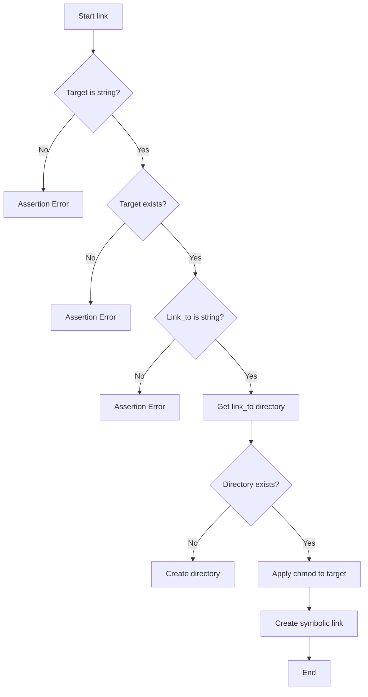
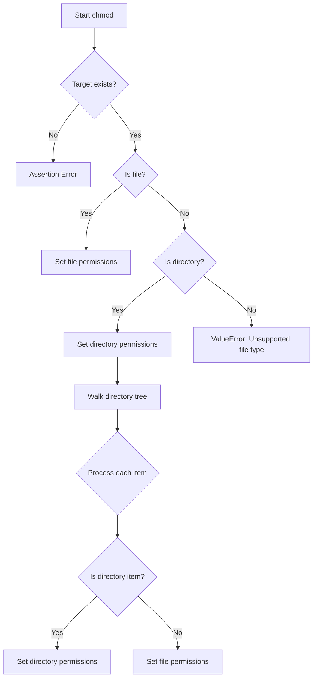
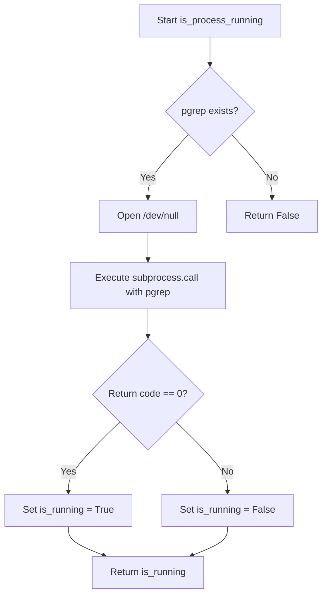
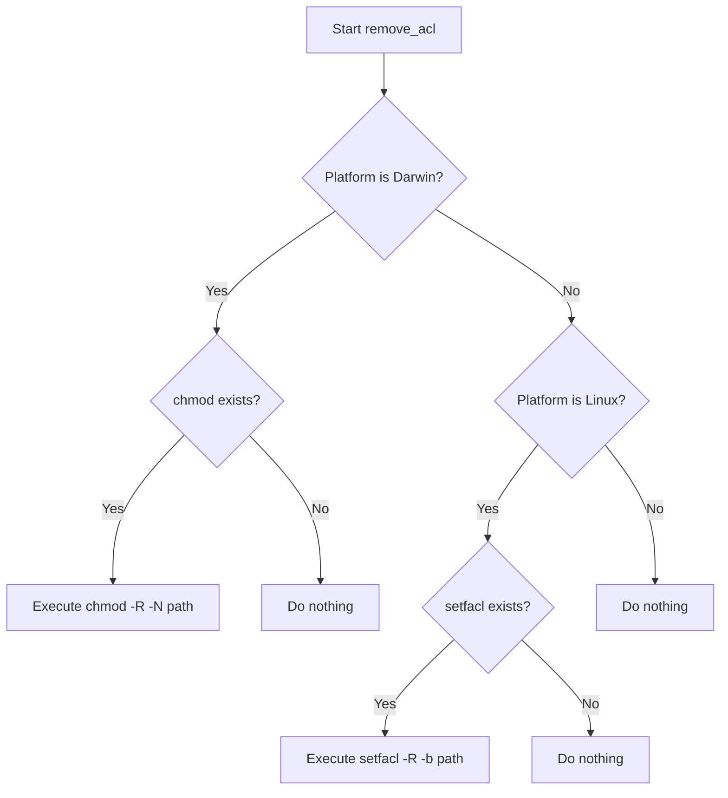
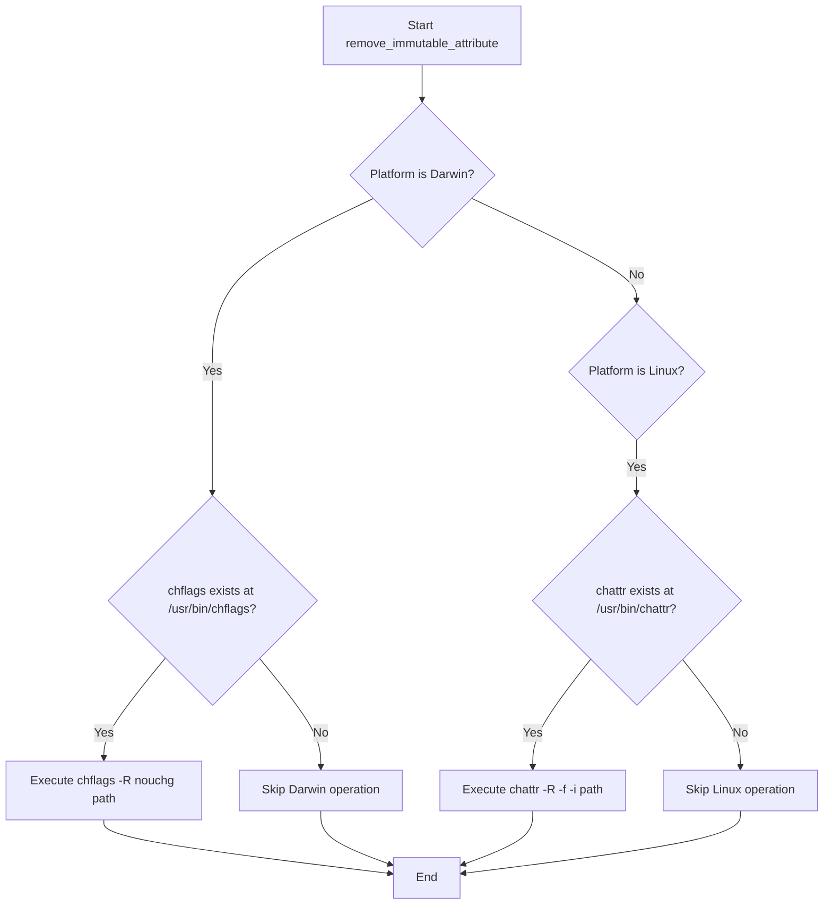

# `utils.py`

## `mackup.utils.confirm` · *function*

## Summary:
Requests user confirmation for a given question and returns a boolean indicating acceptance or rejection.

## Description:
Displays a prompt to the user with the specified question and waits for a yes/no response. This function serves as a standardized confirmation mechanism throughout the application. When the global `FORCE_YES` flag is enabled, the function bypasses user interaction and immediately returns True.

## Args:
    question (str): The question to present to the user for confirmation.

## Returns:
    bool: True if the user confirms (answers "yes" or "y"), False if the user rejects (answers "no" or "n").

## Raises:
    None explicitly raised, but underlying `input()` may raise EOFError or KeyboardInterrupt if input is interrupted.

## Constraints:
    Preconditions:
        - The `question` parameter must be a string
        - The global variable `FORCE_YES` must be defined (though not checked in code)
    
    Postconditions:
        - Returns a boolean value (True or False)
        - Function execution blocks until user provides valid input

## Side Effects:
    - Prints to stdout: displays the question prompt to the user
    - Reads from stdin: waits for user input from the terminal

## Control Flow:
```mermaid
flowchart TD
    A[Start confirm()] --> B{FORCE_YES?}
    B -- Yes --> C[Return True]
    B -- No --> D[Display question prompt]
    D --> E[Read user input]
    E --> F{Input is "yes" or "y"?}
    F -- Yes --> G[Set confirmed=True]
    F -- No --> H{Input is "no" or "n"?}
    H -- Yes --> I[Set confirmed=False]
    H -- No --> J[Loop back to read input]
    G --> K[Break loop]
    I --> K
    K --> L[Return confirmed]
```

## Examples:
    >>> confirm("Do you want to delete this file?")
    Do you want to delete this file? <Yes|No> y
    True
    
    >>> confirm("Are you sure you want to proceed?")
    Are you sure you want to proceed? <Yes|No> no
    False

## `mackup.utils.delete` · *function*

## Summary:
Deletes a file, symbolic link, or directory by first removing special attributes and then performing the actual removal operation.

## Description:
This function provides a robust deletion mechanism that handles files, symbolic links, and directories. It first removes Access Control Lists (ACLs) and immutable attributes from the target path to ensure successful deletion, then performs the appropriate removal operation based on the path type. This function is typically used in backup/restore utilities where files might have special permissions or attributes that prevent normal deletion.

## Args:
    filepath (str): The absolute or relative path to the file, symbolic link, or directory to be deleted.

## Returns:
    None: This function does not return any value.

## Raises:
    OSError: When the file or directory cannot be removed due to permission issues or other filesystem errors.

## Constraints:
    Preconditions:
    - The filepath must exist and be accessible
    - The user must have appropriate permissions to modify file attributes and delete the target
    - System commands required by remove_acl and remove_immutable_attribute must be available
    
    Postconditions:
    - All ACLs are removed from the target path and its contents recursively
    - All immutable attributes are removed from the target path and its contents recursively
    - The target path is completely removed from the filesystem

## Side Effects:
    - Removes Access Control Lists from files and directories using system commands
    - Removes immutable attributes from files and directories using system commands
    - Modifies filesystem permissions and attributes
    - Performs file I/O operations to delete the target path

## Control Flow:
```mermaid
flowchart TD
    A[Start delete] --> B[Remove ACLs from filepath]
    B --> C[Remove immutable attributes from filepath]
    C --> D{Is filepath a file or link?}
    D -- Yes --> E[os.remove(filepath)]
    D -- No --> F{Is filepath a directory?}
    F -- Yes --> G[shutil.rmtree(filepath)]
    F -- No --> H[Do nothing - path doesn't exist or is invalid]
```

## Examples:
    # Delete a regular file
    delete('/path/to/file.txt')
    
    # Delete a symbolic link
    delete('/path/to/symlink')
    
    # Delete a directory
    delete('/path/to/directory')
```

## `mackup.utils.copy` · *function*

## Summary:
Copies files or directories from a source location to a destination, creating parent directories as needed and setting appropriate file permissions.

## Description:
This function provides a robust mechanism for copying files or directories while ensuring proper directory structure and file permissions. It handles both regular files and directories, automatically creating parent directories for the destination if they don't exist. The function ensures that copied files have appropriate read/write permissions by calling the chmod utility function after copying.

## Args:
    src (str): The absolute or relative path to the source file or directory to be copied. Must exist on the filesystem.
    dst (str): The absolute or relative path to the destination where the source will be copied. Parent directories will be created if they don't exist.

## Returns:
    None: This function does not return any value.

## Raises:
    AssertionError: If src is not a string, dst is not a string, or src does not exist on the filesystem.
    ValueError: If src is neither a file nor a directory (unsupported file type).

## Constraints:
    Preconditions:
    - The src parameter must be a string and must reference an existing file or directory
    - The dst parameter must be a string
    - The system must have appropriate read permissions for the source and write permissions for the destination
    
    Postconditions:
    - The destination path will exist with appropriate parent directories created
    - The source content will be copied to the destination
    - The destination will have appropriate file permissions set

## Side Effects:
    - Creates parent directories for the destination path if they don't exist
    - Copies files or directories from source to destination
    - Modifies file permissions on the destination using chmod function
    - May create new files or directories on the filesystem

## Control Flow:
```mermaid
flowchart TD
    A[Start copy] --> B{src is string?}
    B -- No --> C[Assertion Error]
    B -- Yes --> D{src exists?}
    D -- No --> E[Assertion Error]
    D -- Yes --> F{dst is string?}
    F -- No --> G[Assertion Error]
    F -- Yes --> H{Create parent dirs}
    H --> I{Parent dir exists?}
    I -- No --> J[Create parent dirs]
    I -- Yes --> K[Continue]
    K --> L{Is file?}
    L -- Yes --> M[shutil.copy(src, dst)]
    L -- No --> N{Is directory?}
    N -- Yes --> O[shutil.copytree(src, dst)]
    N -- No --> P[ValueError: Unsupported file type]
    M --> Q[chmod(dst)]
    O --> Q
    Q --> R[End]
```

## Examples:
    # Copy a single file
    copy("/home/user/config.txt", "/backup/config.txt")
    
    # Copy a directory
    copy("/home/user/documents", "/backup/documents")
    
    # Copy with automatic parent directory creation
    copy("/home/user/file.txt", "/backup/subdir/nested/file.txt")
```

## `mackup.utils.link` · *function*

## Summary:
Creates a symbolic link from a target file or directory to a specified location, ensuring proper directory structure and permissions.

## Description:
This function establishes a symbolic link between a source file or directory and a destination path. It validates inputs, ensures the destination directory exists, applies appropriate file permissions to the target, and finally creates the symbolic link. This utility is typically used in backup/restore systems where files need to be linked to their original locations while maintaining proper access permissions.

## Args:
    target (str): The absolute or relative path to the source file or directory that will be linked. Must exist on the filesystem.
    link_to (str): The absolute or relative path where the symbolic link will be created. The parent directory will be automatically created if it doesn't exist.

## Returns:
    None: This function does not return any value.

## Raises:
    AssertionError: If target is not a string, does not exist on the filesystem, or if link_to is not a string.

## Constraints:
    Preconditions:
    - The target parameter must be a string
    - The target path must exist on the filesystem
    - The link_to parameter must be a string
    
    Postconditions:
    - The directory structure for link_to exists
    - The target has appropriate read/write permissions applied
    - A symbolic link is created from target to link_to

## Side Effects:
    - Creates directories in the path of link_to if they don't exist
    - Modifies file permissions on the target using chmod
    - Creates a symbolic link on the filesystem

## Control Flow:


## Examples:
    # Create a symbolic link for a configuration file
    link("/home/user/.bashrc", "/home/user/Backups/configs/bashrc_link")
    
    # Create a symbolic link for a directory
    link("/home/user/Documents", "/home/user/Backups/docs_link")
``

## `mackup.utils.chmod` · *function*

## Summary:
Sets appropriate read/write permissions for files and directories, removing immutable attributes first to ensure successful permission changes.

## Description:
This function configures file permissions for a given target path, applying different permission modes based on whether the target is a file or directory. It first removes immutable attributes using `remove_immutable_attribute` to ensure permission changes can be applied, then sets appropriate permissions: read/write for files and read/write/execute for directories. This function is typically used in backup/restore workflows where file permissions need to be adjusted to allow proper access.

## Args:
    target (str): The absolute or relative path to the file or directory whose permissions need to be set. Must exist on the filesystem.

## Returns:
    None: This function does not return any value.

## Raises:
    AssertionError: If target is not a string or does not exist on the filesystem.
    ValueError: If the target is neither a file nor a directory (unsupported file type).

## Constraints:
    Preconditions:
    - The target parameter must be a string
    - The target path must exist on the filesystem
    - The system must have appropriate permissions to modify file attributes and permissions
    
    Postconditions:
    - The target and its contents have appropriate read/write permissions
    - Immutable attributes have been removed from the target and its contents

## Side Effects:
    - Modifies file permissions on the filesystem using os.chmod
    - Removes immutable attributes from files and directories via system commands
    - May execute system commands through subprocess calls (via remove_immutable_attribute)

## Control Flow:


## Examples:
    # Set permissions for a configuration file
    chmod("/home/user/.bashrc")
    
    # Set permissions for a backup directory
    chmod("/home/user/Backups/myapp")
``

## `mackup.utils.error` · *function*

## Summary:
Exits the program with a colored error message displayed in red.

## Description:
Displays an error message in red text using ANSI escape codes and terminates the program execution. This function serves as a centralized error reporting mechanism that provides visual distinction for error messages in terminal environments.

## Args:
    message (str): The error message to display before exiting the program.

## Returns:
    This function does not return as it calls sys.exit() to terminate execution.

## Raises:
    This function does not raise exceptions directly, but sys.exit() may be called with an exit code.

## Constraints:
    Preconditions:
    - The message parameter must be a string
    - The program environment must support ANSI escape codes for colored output
    
    Postconditions:
    - Program execution terminates immediately
    - Error message is displayed in red text to stderr

## Side Effects:
    - Terminates program execution via sys.exit()
    - Outputs colored text to stderr (standard error stream)
    - No file I/O or external state mutations

## Control Flow:
```mermaid
flowchart TD
    A[error(message)] --> B{Validate message}
    B --> C[Set ANSI red color code]
    C --> D[Set ANSI reset code]
    D --> E[Format error message]
    E --> F[Exit program with error message]
```

## Examples:
    error("Configuration file not found")
    # Displays: Error: Configuration file not found (in red)
    # Then exits the program

    error("Invalid user credentials")
    # Displays: Error: Invalid user credentials (in red)
    # Then exits the program
```

## `mackup.utils.get_dropbox_folder_location` · *function*

## Summary:
Retrieves the local Dropbox folder path by parsing the Dropbox host database file.

## Description:
This function reads the Dropbox host database file located at ~/.dropbox/host.db to extract the local Dropbox folder path. The host.db file contains base64-encoded paths that are decoded to determine where Dropbox stores files locally. This function is part of the Mackup application's storage detection system for cloud services.

## Args:
    None

## Returns:
    str: The absolute path to the local Dropbox folder as stored in the Dropbox host database.

## Raises:
    SystemExit: When the Dropbox host database file cannot be found or accessed, causing the program to exit with an error message.

## Constraints:
    Preconditions:
    - The user's home directory must be accessible via os.environ["HOME"]
    - The Dropbox installation must be present on the system
    - The ~/.dropbox/host.db file must exist and be readable
    
    Postconditions:
    - The function will either return a valid Dropbox folder path or terminate the program execution

## Side Effects:
    - Reads from the filesystem (specifically ~/.dropbox/host.db)
    - Terminates program execution via sys.exit() if Dropbox installation is not found

## Control Flow:
```mermaid
flowchart TD
    A[get_dropbox_folder_location()] --> B{Check host.db existence}
    B -->|File exists| C[Open host.db file]
    C --> D[Read and split file content]
    D --> E{Parse data array}
    E -->|Success| F[Decode base64 data[1]]
    F --> G[Return decoded path]
    B -->|File missing| H[Call error()]
    H --> I[Exit program with error message]
```

## Examples:
    # Typical usage in Mackup configuration
    try:
        dropbox_path = get_dropbox_folder_location()
        print(f"Dropbox folder found at: {dropbox_path}")
    except SystemExit:
        print("Dropbox installation not found")
```

## `mackup.utils.get_google_drive_folder_location` · *function*

## Summary:
Retrieves the local synchronized folder path for Google Drive by querying the application's configuration database.

## Description:
This function attempts to locate the local folder where Google Drive synchronizes files by accessing the SQLite configuration database. It handles different macOS version paths for the Google Drive sync configuration and extracts the local synchronization root path from the database. This logic is extracted into a separate function to encapsulate the complexity of database access and path resolution, making the calling code cleaner and more maintainable.

## Args:
    This function takes no arguments.

## Returns:
    str: The absolute path to the local Google Drive synchronized folder.

## Raises:
    SystemExit: When unable to locate the Google Drive installation or configuration database, causing the program to exit with an error message.

## Constraints:
    Preconditions:
    - The user's home directory must be accessible via os.environ['HOME']
    - Google Drive must be installed on the system
    - The Google Drive configuration database must exist in one of the expected locations
    
    Postconditions:
    - Either returns a valid path to the Google Drive sync folder or terminates the program

## Side Effects:
    - Accesses the local filesystem to check for database files
    - Opens and reads from a SQLite database file
    - May terminate program execution if Google Drive configuration cannot be found

## Control Flow:
```mermaid
flowchart TD
    A[get_google_drive_folder_location()] --> B{Check Yosemite DB path}
    B -->|Exists| C[Use Yosemite DB path]
    C --> D[Construct full DB path]
    D --> E{DB file exists?}
    E -->|Yes| F[Connect to SQLite DB]
    F --> G[Execute query for local_sync_root_path]
    G --> H[Extract data value]
    H --> I[Close DB connection]
    I --> J{googledrive_home set?}
    J -->|No| K[Call error with ERROR_UNABLE_TO_FIND_STORAGE]
    K --> L[Exit program]
    J -->|Yes| M[Return googledrive_home]
```

## Examples:
    # Typical usage in a backup utility
    try:
        drive_path = get_google_drive_folder_location()
        print(f"Google Drive folder located at: {drive_path}")
        # Proceed with backup operations...
    except SystemExit:
        # Program exits if Google Drive not found
        pass

## `mackup.utils.get_copy_folder_location` · *function*

## Summary:
Retrieves the storage location path for Copy application by parsing its configuration database.

## Description:
Extracts the root storage path for the Copy application from its SQLite configuration database. This function is designed to locate and read the 'csmRootPath' setting from Copy's configuration file, which specifies where Copy stores its data files. The function follows a specific lookup path within the user's home directory and terminates the program with an error message if the configuration cannot be found or parsed.

## Args:
    None

## Returns:
    str: The absolute path to the Copy application's storage directory as stored in the configuration database.

## Raises:
    SystemExit: When the Copy configuration database cannot be found or the required 'csmRootPath' setting cannot be retrieved, causing the program to exit with an error message.

## Constraints:
    Preconditions:
    - The user's HOME environment variable must be set and accessible
    - The Copy application must have installed its configuration database at the expected location
    - The configuration database must contain the 'config2' table with the 'csmRootPath' option
    
    Postconditions:
    - If successful, returns a valid filesystem path string
    - If unsuccessful, terminates program execution with error message

## Side Effects:
    - Reads from the filesystem to access the Copy configuration database
    - Opens and closes a SQLite database connection
    - Terminates program execution upon failure through error() function

## Control Flow:
```mermaid
flowchart TD
    A[get_copy_folder_location()] --> B{Copy config DB exists?}
    B -->|No| C[error: Unable to find Copy storage]
    B -->|Yes| D[Connect to SQLite DB]
    D --> E{Database connected?}
    E -->|No| F[error: Unable to find Copy storage]
    E -->|Yes| G[Execute SQL query for csmRootPath]
    G --> H{Query successful?}
    H -->|No| I[error: Unable to find Copy storage]
    H -->|Yes| J[Return retrieved path]
```

## Examples:
    # Typical usage in a backup/restore workflow
    try:
        copy_storage_path = get_copy_folder_location()
        print(f"Copy storage located at: {copy_storage_path}")
        # Proceed with backup/restore operations using this path
    except SystemExit:
        # Program exits here if Copy installation not found
        pass

## `mackup.utils.get_icloud_folder_location` · *function*

## Summary:
Retrieves the local iCloud Drive folder path on macOS systems, validating its existence.

## Description:
This function resolves the standard iCloud Drive folder location on macOS Yosemite and later versions. It expands the user's home directory path and verifies that the iCloud directory actually exists on the filesystem. The function is designed specifically for macOS environments where iCloud Drive is available.

## Args:
    None

## Returns:
    str: The absolute path to the iCloud Drive folder as a string, e.g., "/Users/username/Library/Mobile Documents/com~apple~CloudDocs"

## Raises:
    SystemExit: When the iCloud Drive folder cannot be found on the filesystem, causing the program to terminate with an error message.

## Constraints:
    Preconditions:
    - Must be running on macOS (the path is specific to macOS)
    - iCloud Drive must be enabled and configured on the system
    - The user must have appropriate permissions to access the iCloud directory
    
    Postconditions:
    - If successful, returns a valid absolute path string to iCloud Drive
    - If unsuccessful, terminates program execution with error message

## Side Effects:
    - Terminates program execution via sys.exit() when iCloud folder is not found
    - No file I/O operations performed beyond checking directory existence
    - No external state mutations

## Control Flow:
```mermaid
flowchart TD
    A[get_icloud_folder_location()] --> B{Expand iCloud path}
    B --> C{Check if directory exists}
    C --> D[If exists: Return path]
    C --> E[If not exists: Call error()]
    E --> F[Exit program with error]
```

## Examples:
    # Successful case - returns path like:
    # "/Users/john/Library/Mobile Documents/com~apple~CloudDocs"
    
    # Error case - when iCloud Drive is not found:
    # Program exits with error message indicating iCloud Drive could not be located
```

## `mackup.utils.is_process_running` · *function*

## Summary:
Checks whether a process with the specified name is currently running on the system.

## Description:
This function determines if a process is actively running by invoking the pgrep command-line utility. It's designed to work specifically on Unix-like systems where pgrep is available. The function serves as a cross-platform abstraction for process detection, though it only functions reliably on systems with pgrep installed.

## Args:
    process_name (str): The name of the process to check for existence. This corresponds to the process name as it would appear in the process table.

## Returns:
    bool: True if the process is running, False otherwise. Returns False if pgrep is not available on the system or if the process is not found.

## Raises:
    OSError: If subprocess.call fails to execute the pgrep command due to permission issues or other system errors.

## Constraints:
    Preconditions:
    - The system must be Unix-like (Linux, macOS, etc.) where pgrep is available
    - The pgrep command must be located at "/usr/bin/pgrep"
    - The process_name parameter must be a valid string that can be processed by pgrep

    Postconditions:
    - The function returns a boolean value indicating process status
    - No modifications are made to system state

## Side Effects:
    - Opens /dev/null for writing to suppress stdout from subprocess call
    - Makes a subprocess call to execute pgrep command
    - May cause slight performance overhead due to external command execution

## Control Flow:


## Examples:
```python
# Check if Chrome is running
if is_process_running("chrome"):
    print("Chrome is currently running")

# Check if SSH daemon is running
if is_process_running("sshd"):
    print("SSH server is active")

# Check if a custom process is running
if is_process_running("myapp"):
    print("Custom application is running")
```

## `mackup.utils.remove_acl` · *function*

## Summary:
Removes Access Control Lists (ACLs) from a specified path recursively, using platform-appropriate system commands.

## Description:
This function removes ACLs from files and directories at the specified path. It implements platform-specific behavior to ensure compatibility with different operating systems. On macOS (Darwin), it uses the `chmod -R -N` command to remove ACLs recursively. On Linux systems, it uses the `setfacl -R -b` command to remove ACLs recursively. The function is designed to be safe by checking for the existence of required system commands before execution. This function is typically used in backup/restore utilities to ensure consistent file permissions across different systems.

## Args:
    path (str): The absolute or relative path to the directory or file from which ACLs should be removed.

## Returns:
    None: This function does not return any value.

## Raises:
    None: This function does not explicitly raise exceptions, though underlying system calls may fail silently.

## Constraints:
    Preconditions:
    - The path must exist and be accessible
    - The system must have appropriate permissions to modify file permissions
    - Either `/bin/chmod` (for macOS) or `/bin/setfacl` (for Linux) must be available
    
    Postconditions:
    - ACLs are removed from all files and directories under the specified path
    - The function does not alter other file permissions beyond removing ACLs

## Side Effects:
    - Executes system commands (`chmod` or `setfacl`) which may modify file permissions
    - May cause I/O operations when accessing files to modify their ACLs
    - No external state mutations beyond the file system changes

## Control Flow:


## Examples:
    # Remove ACLs from a backup directory
    remove_acl('/path/to/backup/directory')
    
    # Remove ACLs from user home directory
    remove_acl('/home/user')

## `mackup.utils.remove_immutable_attribute` · *function*

## Summary:
Removes immutable attributes from files and directories on macOS and Linux systems.

## Description:
This function removes the immutable flag from files and directories by executing platform-specific system commands. On macOS (Darwin platform), it uses the `chflags` command with the `-R nouchg` option to remove the "no update" flag recursively. On Linux, it uses the `chattr` command with the `-R -f -i` options to remove the immutable attribute recursively. This utility is typically used when preparing files for backup or modification operations that would otherwise be blocked by immutable flags.

## Args:
    path (str): The absolute or relative path to the file or directory from which to remove immutable attributes.

## Returns:
    None: This function does not return any value.

## Raises:
    None: This function does not explicitly raise exceptions, though underlying system calls may fail.

## Constraints:
    Preconditions:
    - The system must be either macOS (Darwin) or Linux
    - The appropriate system utility must be installed and executable (/usr/bin/chflags on macOS, /usr/bin/chattr on Linux)
    - The user must have sufficient privileges to modify file attributes
    
    Postconditions:
    - Immutable attributes are removed from the specified path and its contents recursively
    - No return value is provided

## Side Effects:
    - Executes system commands via subprocess calls
    - May modify file attributes on the filesystem
    - Could potentially affect file permissions or access control

## Control Flow:


## Examples:
    # Remove immutable attributes from a backup directory
    remove_immutable_attribute("/path/to/backup/directory")
    
    # Remove immutable attributes from a configuration file
    remove_immutable_attribute("/path/to/config/file")
```

## `mackup.utils.can_file_be_synced_on_current_platform` · *function*

## Summary:
Determines whether a file path should be synced based on platform-specific restrictions.

## Description:
This function evaluates if a given file path should be excluded from synchronization based on the current operating system. On Linux systems, files located within the user's Library directory are excluded from syncing due to platform-specific considerations. The function constructs the full path by joining the HOME environment variable with the provided relative path, then applies platform-specific filtering rules.

## Args:
    path (str): A relative file path that will be evaluated for sync eligibility.

## Returns:
    bool: True if the file can be synced, False if it should be excluded from synchronization.

## Raises:
    None explicitly raised.

## Constraints:
    Preconditions:
    - The HOME environment variable must be set and accessible
    - The path parameter must be a valid string
    
    Postconditions:
    - The function always returns a boolean value
    - The returned value indicates sync eligibility based on platform rules

## Side Effects:
    None.

## Control Flow:
```mermaid
flowchart TD
    A[Start] --> B[Construct fullpath from HOME + path]
    B --> C[Construct library_path from HOME + "Library/"]
    C --> D{platform.system() == PLATFORM_LINUX?}
    D -- Yes --> E{fullpath.startswith(library_path)?}
    E -- Yes --> F[can_be_synced = False]
    E -- No --> G[can_be_synced = True]
    D -- No --> H[can_be_synced = True]
    F --> I[Return can_be_synced]
    G --> I
    H --> I
    I[Return can_be_synced] --> J[End]
```

## Examples:
    # For a Linux system with a file in Library directory
    can_file_be_synced_on_current_platform("Library/Application Support/myapp/config")  # Returns False
    
    # For a Linux system with a file outside Library directory  
    can_file_be_synced_on_current_platform(".config/myapp/config")  # Returns True
    
    # For macOS or Windows system (regardless of path)
    can_file_be_synced_on_current_platform("Library/Application Support/myapp/config")  # Returns True

