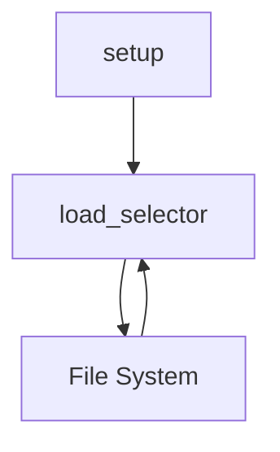

# `docs`

## Tree:
```
docs/
└── conftest.py
```

## Role:
Provides pytest configuration and utility functions for documentation testing and parsing

## Description:
This module serves as a pytest configuration file that sets up testing utilities for documentation validation. It provides helper functions to load and parse HTML/XML documents for testing documentation examples and fixtures. The module is specifically designed to support documentation testing workflows, particularly when using tools like Sybil for parsing documentation examples.

The module acts as a bridge between documentation testing frameworks and the actual parsing utilities needed to validate documentation examples. It ensures that test environments have access to convenient functions for loading and parsing static documentation content.

## Components:
- `load_selector(filename, **kwargs)` - Loads a static file and creates a parsel Selector object for document parsing
- `setup(namespace)` - Configures the test namespace with the load_selector utility function



## Public API:
- `load_selector(filename, **kwargs)` - Loads a file from `_static` directory and returns a parsel Selector object for parsing HTML/XML content
- `setup(namespace)` - Adds `load_selector` to the pytest test namespace, making it available in documentation tests

## Dependencies:
- Internal: None
- External: parsel (for Selector objects)

## Constraints:
- The `load_selector` function expects files to exist in the `_static` subdirectory relative to this module
- Files must be UTF-8 encoded text
- The `setup` function modifies the namespace dictionary in-place
- Both functions are designed for use in documentation testing contexts

---

## Files

- [`conftest.py`](docs/conftest.md)

