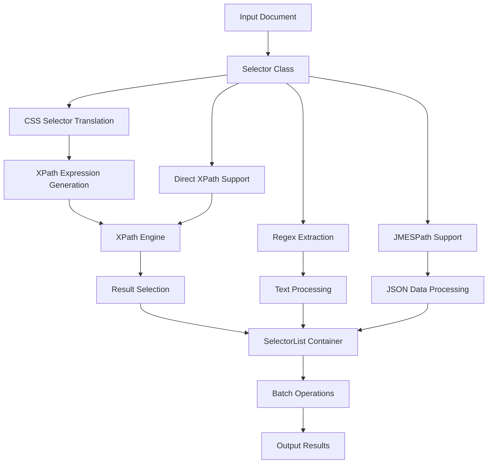

# `parsel`

## Repository Structure

```
parsel/
├── docs/
│   └── conftest.py
└── parsel/
    ├── csstranslator.py
    ├── selector.py
    ├── utils.py
    └── xpathfuncs.py
```

### Directory Responsibilities

**docs/**: Contains documentation testing utilities and configuration for validating documentation examples. Specifically includes `conftest.py` which provides pytest configuration for documentation testing.

**parsel/**: The main library package containing core functionality for parsing and selecting content from HTML, XML, and JSON documents.

## Purpose

The parsel repository provides a powerful, unified interface for parsing and extracting structured data from HTML, XML, and JSON documents. It bridges the gap between CSS selector syntax (familiar to web developers) and XPath expressions (powerful for XML/HTML processing) by providing intelligent translation between these formats.

This library addresses the common need in web scraping and data extraction projects to work with structured markup languages efficiently. It simplifies complex parsing tasks by offering a consistent, high-level API that handles the complexities of document parsing, selection, and content extraction.

Target users include web scrapers, data analysts, content processors, and developers building applications that need to extract structured information from unstructured document formats. The library is particularly valuable for developers who prefer CSS-style selectors but need the power of XPath under the hood.

In the broader ecosystem, parsel serves as a foundational library for web scraping applications and data extraction pipelines, often used alongside other tools in the Python web scraping stack.

## Architecture



The architecture follows a pipeline pattern where documents are parsed into Selector objects, which then support multiple selection mechanisms (CSS, XPath, Regex, JMESPath) that operate on the parsed content. The system maintains a clean separation between parsing logic, selection logic, and utility functions.

Key architectural patterns include:
- **Selector Pattern**: Core Selector and SelectorList classes provide the main interface
- **Translation Layer**: CSS-to-XPath translation system for intuitive selection syntax
- **Extensible XPath**: Custom XPath functions that extend lxml's capabilities
- **Batch Processing**: SelectorList enables efficient batch operations on multiple elements

## Entry Points

### CLI Commands
None - This is a library-only package without command-line interface.

### Importable APIs
**Primary Interface:**
- `from parsel import Selector` - Main class for parsing and selecting content
- `from parsel import SelectorList` - Container for batch operations on selectors
- `from parsel import css2xpath` - Direct CSS to XPath conversion function

**Utility Functions:**
- `from parsel import extract_regex` - Text extraction using regular expressions
- `from parsel import flatten, iflatten` - Nested structure flattening utilities
- `from parsel import shorten` - Text truncation utility
- `from parsel.xpathfuncs import setup` - Registers custom XPath functions

### Target Audience
- Web scrapers and automation developers
- Data analysts extracting structured information
- Content processing pipeline builders
- Developers working with HTML/XML/JSON documents

## Core Features

1. **Multi-format Parsing** - Parse HTML, XML, JSON, and plain text documents with consistent API
2. **CSS Selector Support** - Intuitive CSS-style selectors that translate to XPath internally
3. **XPath Integration** - Direct XPath expression support for advanced selections
4. **Regular Expression Extraction** - Extract text patterns using regex with HTML entity handling
5. **JMESPath Support** - Query JSON data using JMESPath expressions
6. **Batch Operations** - SelectorList enables efficient processing of multiple elements
7. **Custom XPath Functions** - Extended XPath capabilities including CSS class checking
8. **Text Processing Utilities** - Flattening, truncation, and regex extraction helpers

## Dependencies

### Core Dependencies
- **lxml**: Required for XML/HTML parsing and XPath evaluation
- **cssselect**: Required for CSS selector to XPath translation
- **w3lib**: Required for HTML entity processing

### Development Dependencies
- **pytest**: Testing framework for documentation validation
- **sybil**: Documentation testing framework

### Version Requirements
- lxml: Minimum version supporting XPath extensions
- cssselect: Compatible with current stable versions
- w3lib: Standard version requirements for HTML processing

## Configuration

### Runtime Parameters
The library supports configuration through:
- `huge_tree` parameter for handling large documents
- `encoding` specification for text processing
- Namespace definitions for XPath expressions
- Custom XPath function registration

### Environment Variables
None - The library operates purely through API parameters and configuration objects.

## Extension Points

### Plugins and Hooks
The library supports extension through:
- Custom XPath functions (via `xpathfuncs.setup()`)
- Namespace registration (`Selector.register_namespace()`)
- Custom CSS selector translators (through internal translation layer)

### Subclassing
Developers can extend functionality by:
- Subclassing `Selector` for custom parsing behavior
- Extending `SelectorList` for specialized batch operations
- Creating custom utility functions that integrate with existing APIs

### Configuration-Driven Behavior
The library supports configuration through:
- Parameterized initialization of Selector objects
- Namespace management for XPath expressions
- Global function registration for XPath extensions

---

## Modules

- [`docs`](docs.md)
- [`parsel`](parsel.md)

