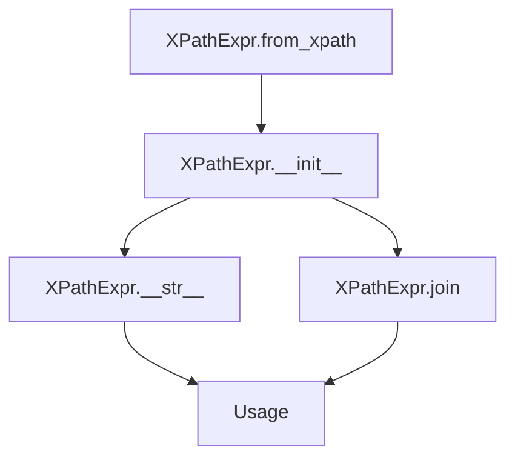
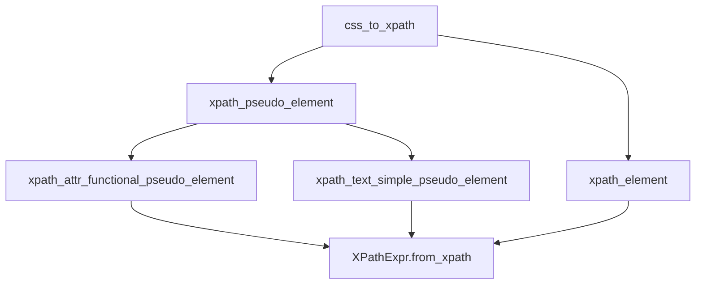
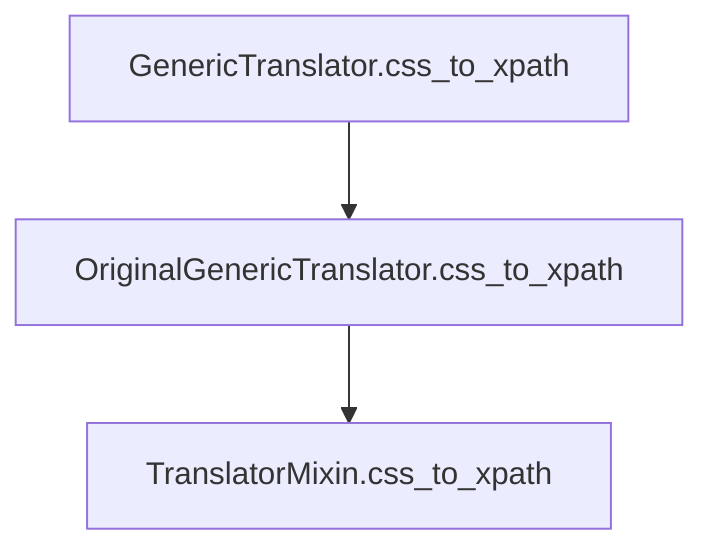

# `csstranslator.py`

## `parsel.csstranslator.XPathExpr` · *class*

## Summary:
A specialized XPath expression class that extends CSSSelect's XPathExpr to support text node and attribute-specific path representations.

## Description:
This class enhances the standard XPath expression functionality by adding support for text node selection and attribute access. It's designed to work with CSS selectors and provides custom string representation and joining behavior to properly handle these extended features. The class is typically used internally by parsel's CSS translation system when processing CSS selectors that target text content or specific attributes.

## State:
- textnode: bool - Flag indicating whether this expression targets a text node. Defaults to False.
- attribute: Optional[str] - Name of the attribute this expression targets, or None if not targeting an attribute.

## Lifecycle:
- Creation: Instances can be created directly or via the `from_xpath` classmethod which copies properties from an existing XPathExpr
- Usage: Typically used in CSS selector translation workflows where XPath expressions need to represent text content or attribute access
- Destruction: Inherits standard Python object destruction behavior

## Method Map:


## Raises:
- ValueError in join() method when attempting to join with non-XPathExpr objects
- Inherits all exceptions from the parent OriginalXPathExpr class

## Example:
```python
# Creating from an existing XPathExpr
original = OriginalXPathExpr(path="div", element="div", condition="")
expr = XPathExpr.from_xpath(original, textnode=True)

# String representation
print(str(expr))  # Outputs: "div/text()" or "text()" for wildcard paths

# Joining with another XPathExpr
other = XPathExpr.from_xpath(original, attribute="class")
joined = expr.join("and", other)
```

### `parsel.csstranslator.XPathExpr.from_xpath` · *method*

## Summary:
Creates a new XPathExpr instance by copying properties from an existing XPath expression while allowing override of textnode and attribute settings.

## Description:
This class method serves as a factory for creating XPathExpr instances from existing XPath expressions. It's designed to facilitate the creation of modified XPath expressions while preserving the core path structure. The method is particularly useful when you need to create a copy of an XPath expression but want to change how it handles text nodes or attributes.

## Args:
    cls: The class type (used for classmethod)
    xpath: OriginalXPathExpr - An existing XPath expression object containing path, element, and condition attributes
    textnode: bool - Flag indicating whether the expression targets text nodes. Defaults to False
    attribute: Optional[str] - Name of attribute to target, or None if targeting elements. Defaults to None

## Returns:
    XPathExpr: A new instance of XPathExpr with copied path, element, and condition from xpath parameter, but with overridden textnode and attribute properties

## Raises:
    None explicitly raised by this method

## State Changes:
    Attributes READ: xpath.path, xpath.element, xpath.condition
    Attributes WRITTEN: x.textnode, x.attribute

## Constraints:
    Preconditions: 
    - xpath parameter must have path, element, and condition attributes
    - xpath must be compatible with the XPathExpr constructor
    
    Postconditions:
    - Returned instance has identical path, element, and condition from input xpath
    - Returned instance has textnode set to provided textnode parameter
    - Returned instance has attribute set to provided attribute parameter

## Side Effects:
    None - This method performs no I/O operations or external service calls

### `parsel.csstranslator.XPathExpr.__str__` · *method*

## Summary:
Returns a string representation of the XPath expression with special handling for text nodes and attribute selection.

## Description:
Overrides the parent class's `__str__` method to provide a customized string representation of XPath expressions. This method handles special cases for text node selection and attribute access, ensuring proper XPath syntax in the returned string.

## Args:
    None

## Returns:
    str: A string representation of the XPath expression that properly formats text nodes and attributes according to XPath syntax rules.

## Raises:
    None explicitly raised

## State Changes:
    Attributes READ: self.textnode, self.attribute
    Attributes WRITTEN: None

## Constraints:
    Preconditions: The object must be properly initialized with valid `textnode` and `attribute` values.
    Postconditions: The returned string follows XPath syntax conventions for text nodes and attribute access.

## Side Effects:
    None

### `parsel.csstranslator.XPathExpr.join` · *method*

## Summary:
Joins two XPath expressions, copying textnode and attribute properties from the other expression.

## Description:
This method combines the current XPath expression with another XPath expression using a specified combiner operator. It ensures type compatibility between expressions and propagates special attributes (textnode and attribute) from the joined expression to the current one. This method extends the base XPathExpr functionality to preserve additional metadata during expression composition.

The method is typically called during CSS selector parsing when combining multiple XPath fragments into a complete expression.

## Args:
    combiner (str): The operator to use for joining expressions (e.g., 'and', 'or', '/', '//')
    other (OriginalXPathExpr): Another XPath expression to join with this one. Must be an instance of cssselect.xpath.XPathExpr or its descendant.
    *args (Any): Additional positional arguments passed to the parent join method
    **kwargs (Any): Additional keyword arguments passed to the parent join method

## Returns:
    Self: Returns self to enable method chaining

## Raises:
    ValueError: When the other expression is not of type XPathExpr or its descendant

## State Changes:
    Attributes READ: None
    Attributes WRITTEN: self.textnode, self.attribute

## Constraints:
    Preconditions: The other parameter must be an instance of cssselect.xpath.XPathExpr or its descendant
    Postconditions: The current expression is modified to include the joined expression, and textnode/attribute properties are copied from the other expression

## Side Effects:
    None

## `parsel.csstranslator.TranslatorProtocol` · *class*

*No documentation generated.*

### `parsel.csstranslator.TranslatorProtocol.xpath_element` · *method*

*No documentation generated.*

### `parsel.csstranslator.TranslatorProtocol.css_to_xpath` · *method*

## Summary:
Converts a CSS selector string into an XPath expression with optional namespace prefix.

## Description:
This method translates CSS selectors into their equivalent XPath expressions for use in XPath-based XML/HTML parsing operations. It serves as the core interface for CSS-to-XPath conversion within the parsel library's translation system. As part of the TranslatorProtocol, this method ensures consistent behavior across different translator implementations such as GenericTranslator and HTMLTranslator.

## Args:
    css (str): A CSS selector string to be converted to XPath. Must be a valid CSS selector supported by the underlying cssselect library.
    prefix (str): An optional namespace prefix to prepend to the XPath expression. Defaults to "descendant-or-self::" when not specified.

## Returns:
    str: The equivalent XPath expression for the provided CSS selector. The result is a valid XPath string that can be used with XPath parsers.

## Raises:
    ExpressionError: Raised by the underlying cssselect library when CSS selectors contain invalid syntax, unsupported pseudo-elements, or malformed expressions.

## State Changes:
    Attributes READ: None
    Attributes WRITTEN: None

## Constraints:
    Preconditions: The CSS selector string must be valid and supported by the underlying cssselect library implementation.
    Postconditions: The returned XPath expression will be a valid XPath string that can be used with XPath parsers.

## Side Effects:
    None

## `parsel.csstranslator.TranslatorMixin` · *class*

## Summary:
A mixin class that extends CSS selector translation capabilities with custom pseudo-element handling for XPath expression generation.

## Description:
The TranslatorMixin class provides enhanced functionality for translating CSS selectors to XPath expressions, specifically focusing on custom handling of CSS pseudo-elements. It serves as an extension point for cssselect's GenericTranslator and HTMLTranslator classes, enabling support for additional pseudo-elements beyond the standard CSS specification. This mixin is designed to be inherited alongside cssselect's base translator classes to extend their capabilities.

## State:
- `self` (TranslatorProtocol): The instance implementing the translator protocol that this mixin extends
- The mixin maintains no internal state beyond what's provided by the parent translator classes
- `OriginalXPathExpr`: Type alias for cssselect's XPathExpr class used in method signatures

## Lifecycle:
- Creation: Instances are created automatically when inheriting from TranslatorMixin in a translator class like GenericTranslator or HTMLTranslator
- Usage: Methods are invoked internally by the cssselect library during CSS to XPath translation processes
- Destruction: Managed by Python's garbage collection; no explicit cleanup required

## Method Map:


## Raises:
- ExpressionError: Raised when encountering unknown functional pseudo-elements (::attr(), etc.) or when pseudo-element functions don't match expected argument types
- ExpressionError: Raised when ::attr() pseudo-element receives invalid arguments (not STRING or IDENT types)

## Example:
```python
# Typically used internally by translators
from parsel.csstranslator import GenericTranslator

# Create a translator instance (this uses TranslatorMixin internally)
translator = GenericTranslator()

# The mixin handles pseudo-element translation automatically
# when css_to_xpath is called
xpath = translator.css_to_xpath("div::text")
# Returns XPath expression for text nodes within div elements
```

### `parsel.csstranslator.TranslatorMixin.xpath_element` · *method*

*No documentation generated.*

### `parsel.csstranslator.TranslatorMixin.xpath_pseudo_element` · *method*

## Summary:
Handles CSS pseudo-element translation by delegating to specialized handler methods based on pseudo-element type.

## Description:
This method processes CSS pseudo-elements (both functional and simple) by dynamically dispatching to appropriate handler methods. It serves as the central entry point for pseudo-element processing within the CSS-to-XPath translation pipeline. The method distinguishes between functional pseudo-elements (like ::attr()) and simple pseudo-elements (like ::text) and routes them to their respective handler methods.

The method follows a naming convention where handler methods are named `xpath_<name>_functional_pseudo_element` for functional pseudo-elements and `xpath_<name>_simple_pseudo_element` for simple pseudo-elements. When a matching handler method is found, it is invoked with the appropriate arguments, and the resulting XPath expression is returned.

## Args:
    self: The TranslatorMixin instance containing the pseudo-element handling methods
    xpath (OriginalXPathExpr): The existing XPath expression to be modified
    pseudo_element (PseudoElement): The CSS pseudo-element to translate

## Returns:
    OriginalXPathExpr: A new XPath expression incorporating the pseudo-element semantics

## Raises:
    ExpressionError: When a functional pseudo-element lacks a corresponding handler method
    ExpressionError: When a simple pseudo-element lacks a corresponding handler method

## State Changes:
    Attributes READ: None
    Attributes WRITTEN: None

## Constraints:
    Preconditions:
    - The pseudo_element parameter must be either a FunctionalPseudoElement or PseudoElement instance
    - The TranslatorMixin instance must have corresponding handler methods defined for the pseudo-element type
    - The xpath parameter must be a valid XPath expression object
    
    Postconditions:
    - Returns a properly modified XPath expression that incorporates the pseudo-element semantics
    - Raises ExpressionError for unsupported pseudo-elements

## Side Effects:
    None

### `parsel.csstranslator.TranslatorMixin.xpath_attr_functional_pseudo_element` · *method*

## Summary:
Transforms a CSS ::attr() functional pseudo-element into an XPath expression that extracts a specified attribute value.

## Description:
Handles the conversion of CSS functional pseudo-elements of the form `::attr(attribute-name)` into equivalent XPath expressions. This method is invoked by the CSS selector translation pipeline when encountering the `::attr()` pseudo-element, which allows selecting the value of a specific HTML attribute from matched elements.

## Args:
    xpath (OriginalXPathExpr): The base XPath expression to modify
    function (FunctionalPseudoElement): The functional pseudo-element representing ::attr() with its arguments

## Returns:
    XPathExpr: A new XPath expression configured to extract the specified attribute value

## Raises:
    ExpressionError: When the ::attr() pseudo-element is called with invalid arguments (not a single string or identifier)

## State Changes:
    Attributes READ: None
    Attributes WRITTEN: None

## Constraints:
    Preconditions:
        - The function parameter must be a FunctionalPseudoElement instance
        - The function must have exactly one argument
        - The argument type must be either "STRING" or "IDENT"
    Postconditions:
        - Returns a properly constructed XPathExpr with the attribute property set
        - The returned XPath expression will select attribute values rather than element content

## Side Effects:
    None

### `parsel.csstranslator.TranslatorMixin.xpath_text_simple_pseudo_element` · *method*

## Summary:
Creates a new XPath expression that targets text nodes instead of element nodes.

## Description:
This method transforms an existing XPath expression by creating a new XPath expression with the `textnode=True` parameter set. It is a specialized handler for simple pseudo-elements such as `::text` within the CSS-to-XPath translation system.

The method is invoked by the `xpath_pseudo_element` method when processing simple pseudo-elements. It utilizes the `XPathExpr.from_xpath` constructor with the `textnode=True` argument to modify the node selection behavior of the original XPath expression.

## Args:
    self: The TranslatorMixin instance containing this method
    xpath: An XPath expression object to be transformed

## Returns:
    XPathExpr: A new XPath expression configured to select text nodes rather than element nodes

## Raises:
    None explicitly documented

## State Changes:
    Attributes READ: None
    Attributes WRITTEN: None

## Constraints:
    Preconditions:
    - The xpath parameter must be a valid XPath expression object that can be processed by `XPathExpr.from_xpath`
    - The underlying `XPathExpr.from_xpath` method must support the `textnode` parameter
    
    Postconditions:
    - Returns a properly constructed XPath expression with text node selection enabled
    - The returned expression preserves the structural elements of the original while changing its node selection behavior

## Side Effects:
    None

## `parsel.csstranslator.GenericTranslator` · *class*

## Summary:
A CSS selector to XPath expression translator that extends cssselect's GenericTranslator with LRU caching for improved performance.

## Description:
The GenericTranslator class provides a cached interface for converting CSS selectors into XPath expressions. It inherits from both TranslatorMixin (which adds custom pseudo-element handling) and OriginalGenericTranslator (from the cssselect library). This implementation optimizes repeated CSS-to-XPath conversions by caching results with a maximum size of 256 entries.

## State:
- Inherits all state from parent classes (OriginalGenericTranslator and TranslatorMixin)
- No additional instance attributes beyond those provided by the inheritance chain
- The caching mechanism is managed internally by the @lru_cache decorator

## Lifecycle:
- Creation: Instantiated using standard Python class construction syntax
- Usage: Call the css_to_xpath() method with CSS selector string and optional prefix
- Destruction: Managed by Python's garbage collection; no explicit cleanup required

## Method Map:


## Raises:
- ExpressionError: Raised by the underlying cssselect library when CSS selectors contain invalid syntax or unsupported pseudo-elements
- ExpressionError: Raised when pseudo-element functions don't match expected argument types

## Example:
```python
from parsel.csstranslator import GenericTranslator

# Create translator instance
translator = GenericTranslator()

# Convert CSS selector to XPath with default prefix
xpath = translator.css_to_xpath("div p:nth-child(2)")
# Returns XPath equivalent for div elements containing second p child

# Convert with custom prefix
xpath = translator.css_to_xpath("span", prefix="child::")
# Returns XPath with child:: prefix
```

### `parsel.csstranslator.GenericTranslator.css_to_xpath` · *method*

## Summary:
Converts a CSS selector string into an XPath expression with optional namespace prefix.

## Description:
This method serves as a wrapper around the parent class's `css_to_xpath` implementation, converting CSS selectors to XPath expressions. It is part of the Parsel library's CSS-to-XPath translation system, enabling users to work with CSS selectors while internally using XPath for parsing.

## Args:
    css (str): A CSS selector string to be converted to XPath.
    prefix (str): An optional namespace prefix to prepend to the XPath expression. Defaults to "descendant-or-self::".

## Returns:
    str: The equivalent XPath expression for the provided CSS selector.

## Raises:
    ExpressionError: If the CSS selector contains invalid syntax or unsupported pseudo-elements.

## State Changes:
    Attributes READ: None
    Attributes WRITTEN: None

## Constraints:
    Preconditions: The CSS selector string must be valid and supported by the underlying cssselect library.
    Postconditions: The returned XPath expression will be a valid XPath string that can be used with XPath parsers.

## Side Effects:
    None

## `parsel.csstranslator.HTMLTranslator` · *class*

## Summary:
A cached CSS to XPath translator that extends CSSSelect's HTMLTranslator with LRU caching.

## Description:
This class provides a cached implementation of CSS selector to XPath expression conversion for HTML documents. It inherits from both TranslatorMixin and OriginalHTMLTranslator to extend functionality while maintaining compatibility with the CSSSelect library's interface. The implementation caches results of CSS to XPath conversions to improve performance for repeated queries.

## State:
- Inherits all state from parent classes (TranslatorMixin and OriginalHTMLTranslator)
- No additional instance attributes defined in this class
- Implements LRU cache with maxsize=256 for css_to_xpath method

## Lifecycle:
- Creation: Instantiated like any other HTMLTranslator from the cssselect library
- Usage: Call css_to_xpath() method with CSS selector string and optional prefix
- Destruction: Managed by Python's garbage collection, no special cleanup required

## Method Map:
```mermaid
graph TD
    A[HTMLTranslator.css_to_xpath] --> B[super().css_to_xpath]
    B --> C[Base CSSSelect Implementation]
```

## Raises:
- ExpressionError: When the CSS selector syntax is invalid (inherited from base implementation)
- TypeError: When arguments are of incorrect type (inherited from base implementation)

## Example:
```python
from parsel.csstranslator import HTMLTranslator

translator = HTMLTranslator()
xpath = translator.css_to_xpath("div.content p")
# Returns XPath expression for the CSS selector
```

### `parsel.csstranslator.HTMLTranslator.css_to_xpath` · *method*

*No documentation generated.*

## `parsel.csstranslator.css2xpath` · *function*

## Summary:
Converts a CSS selector string into its XPath expression equivalent using a module-level translator instance.

## Description:
This function provides a convenient interface for converting CSS selectors to XPath expressions. It delegates the conversion to a globally configured translator instance (_translator) that handles the actual transformation process. This is a utility function that simplifies CSS-to-XPath conversion for users of the parsel library.

## Args:
    query (str): A valid CSS selector string that identifies elements in an HTML/XML document.
                 Must conform to CSS selector syntax supported by the underlying cssselect library.

## Returns:
    str: The XPath expression equivalent of the provided CSS selector. This XPath expression can be used
         directly with XPath-compatible parsers to select matching elements.

## Raises:
    ExpressionError: Raised when the CSS selector contains invalid syntax or uses unsupported features
                     that cannot be converted to XPath expressions by the underlying cssselect library.

## Constraints:
    Preconditions:
    - The input query must be a valid string containing a CSS selector
    - The CSS selector must be compatible with the capabilities of the cssselect library
    
    Postconditions:
    - The returned XPath expression is guaranteed to be syntactically valid XPath
    - The XPath expression will select the same elements as the original CSS selector

## Side Effects:
    None: This function performs no I/O operations or external state mutations.

## Control Flow:
```mermaid
flowchart TD
    A[css2xpath called with query] --> B[_translator.css_to_xpath(query) called]
    B --> C[Converted XPath returned]
```

## Examples:
```python
# Basic element selection
xpath = css2xpath("div")
# Returns: ".//div"

# Complex selector
xpath = css2xpath("div.container > p:first-child")
# Returns: ".//div[@class='container']/p[1]"

# With error handling
try:
    xpath = css2xpath("invalid[selector")
except ExpressionError as e:
    print(f"CSS selector error: {e}")
```

