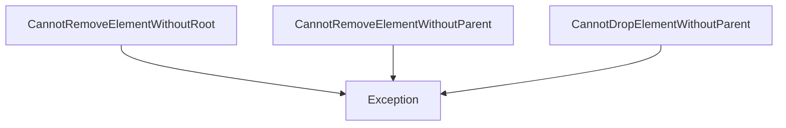
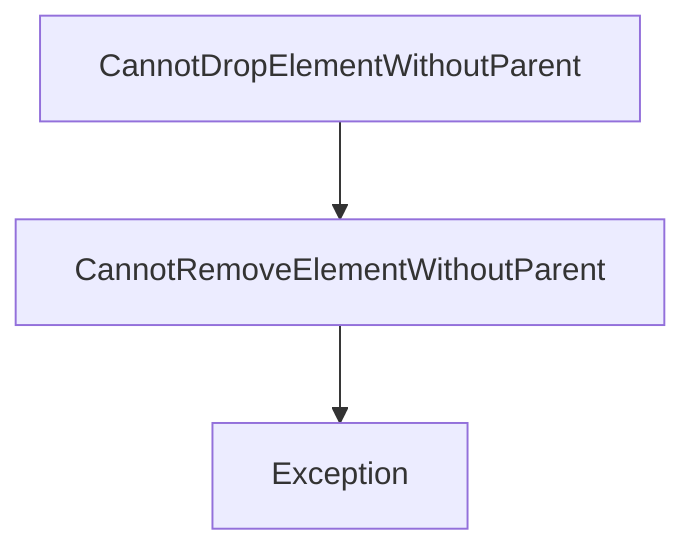
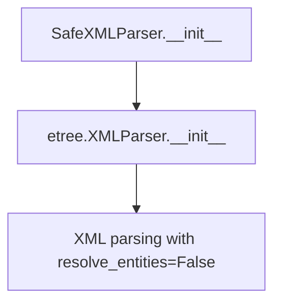
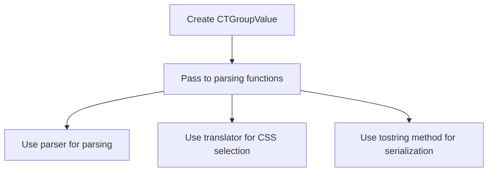
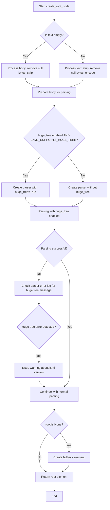
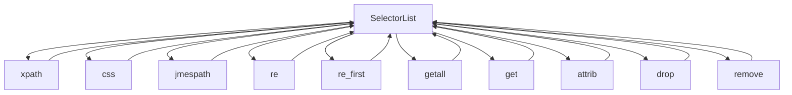

# `selector.py`

## `parsel.selector.CannotRemoveElementWithoutRoot` · *class*

## Summary:
Exception raised when attempting to remove or drop an element that lacks a root element reference in selector operations.

## Description:
This exception is raised when code attempts to perform remove or drop operations on a selector element that does not have a proper root element attached to a document tree. This typically occurs when working with pseudo-elements or text fragments that are not part of a complete document structure. The exception is part of a family of exceptions related to element removal operations in the parsel selector system, specifically designed to prevent invalid operations on detached or incomplete elements.

## State:
- Inherits all state from Exception (no additional instance attributes)
- No constructor parameters beyond those inherited from Exception
- The exception carries no additional state information beyond its type

## Lifecycle:
- Creation: Instantiated when selector operations detect an attempt to remove/drop an element without root reference
- Usage: Caught by exception handlers during element manipulation operations in Selector.remove() and Selector.drop() methods
- Destruction: Handled by Python's standard exception mechanism

## Method Map:


## Raises:
- Raised during Selector.remove() and Selector.drop() operations when an element lacks root reference
- Triggered by selector's internal validation logic when attempting to access .getparent() on an element without root

## Example:
```python
from parsel import Selector

# This would raise CannotRemoveElementWithoutRoot
# because the selector targets text content rather than an element
selector = Selector(text='<div>Hello World</div>')
element = selector.css('div::text').first  # Selects text node, not element

try:
    element.drop()  # Raises CannotRemoveElementWithoutRoot
except CannotRemoveElementWithoutRoot:
    print("Cannot remove element without root - likely a text node fragment")
```

## `parsel.selector.CannotRemoveElementWithoutParent` · *class*

*No documentation generated.*

## `parsel.selector.CannotDropElementWithoutParent` · *class*

## Summary:
Exception raised when attempting to drop an element without a parent reference in selector operations.

## Description:
This exception is raised when code attempts to perform a drop operation on an element that lacks a parent element in the document tree structure. It inherits from CannotRemoveElementWithoutParent, indicating it's part of a hierarchy of exceptions related to element removal operations in the parsel selector system.

## State:
- Inherits all state from CannotRemoveElementWithoutParent (which inherits from Exception)
- No additional instance attributes or properties
- No constructor parameters beyond those inherited from Exception

## Lifecycle:
- Creation: Instantiated when selector operations detect an attempt to drop an element without parent reference
- Usage: Caught by exception handlers during element manipulation operations
- Destruction: Handled by Python's standard exception mechanism

## Method Map:


## Raises:
- Raised during element drop operations when an element lacks parent reference
- Triggered by selector's internal validation logic when attempting invalid element removal

## Example:
```python
# This exception would be raised when:
try:
    selector.drop_element(element_without_parent)
except CannotDropElementWithoutParent:
    # Handle the case where element has no parent
    pass
```

## `parsel.selector.SafeXMLParser` · *class*

## Summary:
A custom XML parser that disables entity resolution for enhanced security.

## Description:
The SafeXMLParser class extends lxml's XMLParser to provide a secure parsing environment by setting the resolve_entities parameter to False by default. This prevents XML entities from being resolved during parsing operations, which can help mitigate certain security risks associated with XML processing.

This class is intended to be used as a drop-in replacement for etree.XMLParser when security considerations require disabling entity resolution.

## State:
- Inherits all attributes from etree.XMLParser
- The `resolve_entities` parameter is explicitly set to `False` in the constructor
- No additional instance attributes beyond those inherited from the parent class

## Lifecycle:
- Creation: Instantiate with any arguments supported by etree.XMLParser
- Usage: Use like any standard lxml XMLParser instance for parsing XML content
- Destruction: Managed automatically by Python's garbage collector; no special cleanup required

## Method Map:


## Raises:
- Any exceptions that etree.XMLParser.__init__ might raise due to invalid arguments
- Typically includes ValueError for invalid parser configuration options

## Example:
```python
from parsel.selector import SafeXMLParser
from lxml import etree

# Create a secure parser instance
parser = SafeXMLParser()

# Parse XML content with entity resolution disabled
xml_content = "<root><item>value</item></root>"
tree = etree.fromstring(xml_content, parser=parser)
```

### `parsel.selector.SafeXMLParser.__init__` · *method*

*No documentation generated.*

## `parsel.selector.CTGroupValue` · *class*

## Summary:
A type annotation representing a configuration group containing parser, CSS translator, and tostring method settings for HTML/XML processing.

## Description:
CTGroupValue is a TypedDict that defines a structured configuration for parsing and CSS translation operations. It serves as a container for holding parser type, CSS translator instance, and tostring method name that are commonly used together in HTML/XML processing workflows. This abstraction allows for consistent passing of these related configuration parameters as a single unit rather than as separate arguments.

## State:
- `_parser`: Union[Type[etree.XMLParser], Type[html.HTMLParser]]
  - Type: Parser class type
  - Valid values: Either XMLParser or HTMLParser classes from lxml
  - Purpose: Specifies the parser type to be used for document parsing
- `_csstranslator`: Union[GenericTranslator, HTMLTranslator]
  - Type: CSS translator instance
  - Valid values: Instance of GenericTranslator or HTMLTranslator from csstranslator
  - Purpose: Provides CSS selector translation capabilities
- `_tostring_method`: str
  - Type: String identifier
  - Valid values: Any string representing a tostring method name
  - Purpose: Specifies the method to use for converting elements back to string representation

## Lifecycle:
- Creation: Instantiated by creating a dictionary with the three required keys
- Usage: Passed as a configuration object to functions that require parser, translator, and tostring settings
- Destruction: No explicit cleanup required as it's a simple data structure

## Method Map:


## Raises:
- No exceptions raised by the TypedDict itself
- Invalid key names or types would cause runtime errors when used as a dictionary

## Example:
```python
# Creating a CTGroupValue instance
config = {
    '_parser': html.HTMLParser,
    '_csstranslator': HTMLTranslator(),
    '_tostring_method': 'tostring'
}

# Using the configuration
# This would typically be passed to functions that process HTML/XML documents
```

## `parsel.selector._xml_or_html` · *function*

## Summary:
Determines whether to treat content as XML or HTML based on input type specification.

## Description:
This utility function normalizes type specifications for XML/HTML processing by returning "xml" when the input is explicitly "xml", otherwise defaulting to "html". It serves as a simple type resolver that ensures consistent handling of XML vs HTML content throughout the parsing system.

## Args:
    type (Optional[str]): Input type specification, typically "xml" or "html". When None or any value other than "xml", defaults to "html".

## Returns:
    str: Either "xml" or "html" representing the normalized content type.

## Raises:
    None: This function does not raise any exceptions.

## Constraints:
    Preconditions: The input parameter should be a string or None.
    Postconditions: The return value is always either "xml" or "html" string.

## Side Effects:
    None: This function has no side effects.

## Control Flow:
```mermaid
flowchart TD
    A[Input type] --> B{type == "xml"?}
    B -- Yes --> C[Return "xml"]
    B -- No --> D[Return "html"]
```

## Examples:
    >>> _xml_or_html("xml")
    'xml'
    >>> _xml_or_html("html")
    'html'
    >>> _xml_or_html(None)
    'html'
    >>> _xml_or_html("unknown")
    'html'

## `parsel.selector.create_root_node` · *function*

## Summary:
Creates a robust XML/HTML root element from text or binary content with automatic error recovery and fallback handling.

## Description:
This function provides a standardized approach to parsing text or binary content into lxml element trees, with built-in handling for common edge cases such as empty inputs, null bytes, and large documents. It encapsulates the complexity of proper XML/HTML parsing with recovery modes and fallback mechanisms, making it a reliable foundation for web scraping and content extraction operations in the parsel library.

The function centralizes parsing logic to ensure consistent behavior across different parsing contexts while providing flexibility through configurable parser options and encoding settings.

## Args:
    text (str): Text content to parse. When empty, the body parameter is used instead.
    parser_cls (Type[_ParserType]): The lxml parser class to use for parsing (e.g., etree.HTMLParser or etree.XMLParser).
    base_url (Optional[str]): Base URL to use for resolving relative URLs in the parsed content. Defaults to None.
    huge_tree (bool): Whether to enable huge tree parsing mode. Defaults to LXML_SUPPORTS_HUGE_TREE constant.
    body (bytes): Binary content to parse when text is empty. Defaults to b"".
    encoding (str): Character encoding to use for text encoding. Defaults to "utf8".

## Returns:
    etree._Element: The root element of the parsed XML/HTML document. Always returns a valid etree element, even when input is empty or malformed.

## Raises:
    None explicitly raised, but lxml parsing may raise exceptions from etree.fromstring or parser construction.

## Constraints:
    Preconditions:
    - parser_cls must be a valid lxml parser class (HTMLParser or XMLParser)
    - text should be a string or empty
    - body should be bytes or empty
    
    Postconditions:
    - Always returns a valid etree._Element instance
    - The returned element is suitable for further XPath/CSS selection operations

## Side Effects:
    - May issue warnings via the warnings module when huge_tree is requested but not supported
    - Uses lxml's etree.fromstring for parsing
    - May modify global warning state through warnings.warn()

## Control Flow:


## Examples:
    # Parse HTML content with automatic fallback for malformed content
    root = create_root_node("<div>Hello World</div>", etree.HTMLParser)
    
    # Handle empty text by providing binary content directly
    root = create_root_node("", etree.HTMLParser, body=b"<p>Content</p>")
    
    # Parse with base URL for relative link resolution
    root = create_root_node("<a href='/link'>Link</a>", etree.HTMLParser, base_url="https://example.com")
    
    # Parse large XML documents with huge tree support
    root = create_root_node(large_xml_content, etree.XMLParser, huge_tree=True)
    
    # Robust parsing with automatic error recovery
    root = create_root_node(invalid_html_content, etree.HTMLParser)

## `parsel.selector.SelectorList` · *class*

## Summary:
A list-like container for selector objects that provides batch operations for extracting data from parsed HTML/XML documents.

## Description:
The SelectorList class extends Python's built-in List type to provide a collection of selector objects (typically Selector instances) that can be operated on collectively. It enables batch processing of selectors for common extraction operations like XPath, CSS, JMESPath queries, regular expressions, and attribute access. This abstraction allows developers to apply the same selection operation to multiple elements simultaneously, making web scraping and data extraction more efficient.

## State:
- Inherits from `List[_SelectorType]` where `_SelectorType` represents Selector instances
- Maintains all standard list properties and behaviors
- No additional instance attributes beyond those inherited from the parent List class
- Designed specifically for collections of Selector objects from the parsel library

## Lifecycle:
- Creation: Instances are created either by calling the constructor directly with selector objects, or by using methods like `xpath()`, `css()`, `jmespath()` on existing SelectorList instances
- Usage: Typically used by calling selection methods like `xpath()`, `css()`, `re()`, `getall()`, `get()` to process all contained selectors at once
- Destruction: No special cleanup required; follows normal Python garbage collection

## Method Map:


## Raises:
- TypeError from `__getstate__`: Raised when attempting to pickle a SelectorList object, as pickling is not supported
- Various exceptions may be raised by underlying selector methods when invalid XPath/CSS/JMESPath queries are provided
- DeprecationWarning from `remove`: Indicates use of deprecated method, suggesting `drop` instead

## Example:
```python
from parsel import Selector

# Create a selector list from multiple elements
html_content = '''
<div class="item">First item</div>
<div class="item">Second item</div>
<div class="item">Third item</div>
'''

selector = Selector(text=html_content)
items = selector.css('.item')  # Returns a SelectorList of Selector objects

# Apply operations to all items at once
texts = items.getall()  # ['First item', 'Second item', 'Third item']
first_text = items.get()  # 'First item'
all_texts = items.xpath('./text()').getall()  # Same result

# Access attributes from all elements
all_attributes = items.attrib  # Returns attributes from first element
```

### `parsel.selector.SelectorList.__getstate__` · *method*

## Summary:
Prevents serialization of SelectorList objects by raising a TypeError during pickling operations.

## Description:
This method overrides Python's default `__getstate__` behavior to explicitly prevent pickling of SelectorList instances. It is called internally by Python's pickle module when attempting to serialize a SelectorList object. The method raises a TypeError with the message "can't pickle SelectorList objects" to indicate that such objects cannot be serialized.

## Args:
    None

## Returns:
    None

## Raises:
    TypeError: Always raised with the message "can't pickle SelectorList objects" when the method is called during pickling operations.

## State Changes:
    Attributes READ: None
    Attributes WRITTEN: None

## Constraints:
    Preconditions: None
    Postconditions: None

## Side Effects:
    None

### `parsel.selector.SelectorList.jmespath` · *method*

## Summary:
Applies a JMESPath query to each selector in the list and returns a flattened result as a new SelectorList.

## Description:
This method executes a JMESPath query on each individual selector within the SelectorList instance. It processes each selector sequentially, applying the same JMESPath query with the provided keyword arguments, then flattens all results into a single SelectorList. This approach allows for batch processing of JMESPath queries across multiple selectors while maintaining the hierarchical structure of the results.

## Args:
    query (str): The JMESPath query string to apply to each selector.
    **kwargs (Any): Additional keyword arguments to pass to the underlying JMESPath implementation.

## Returns:
    SelectorList[_SelectorType]: A new SelectorList containing the flattened results from applying the JMESPath query to each selector.

## Raises:
    None explicitly raised by this method. Exceptions from individual selector jmespath methods may propagate upward.

## State Changes:
    Attributes READ: None - this method only reads from the self collection.
    Attributes WRITTEN: None - this method creates a new object rather than modifying self.

## Constraints:
    Preconditions: 
    - self must contain selectable objects that support the jmespath method
    - query must be a valid JMESPath query string
    - Each selector in self must have a compatible jmespath method signature
    
    Postconditions:
    - Returns a new SelectorList instance of the same type as self
    - All results from individual selector jmespath calls are flattened into the returned list

## Side Effects:
    None - this method is pure and doesn't cause any I/O operations or external service calls.

### `parsel.selector.SelectorList.xpath` · *method*

## Summary:
Applies an XPath expression to each selector in the list and returns a flattened list of matching elements.

## Description:
This method enables cascading XPath selection operations across all selectors in the list. It iterates through each selector in the current list, applies the provided XPath expression to each one, and flattens all results into a new SelectorList instance. This allows for batch processing of XPath queries across multiple elements while maintaining a clean, flat result structure.

## Args:
    xpath (str): An XPath expression string to apply to each element in the selector list.
    namespaces (Optional[Mapping[str, str]]): A mapping of namespace prefixes to URIs for XPath resolution. Defaults to None.
    **kwargs (Any): Additional keyword arguments to pass to the underlying XPath implementation.

## Returns:
    SelectorList[_SelectorType]: A new SelectorList containing all elements that match the XPath expression across all selectors in the current list, with nested results flattened into a single list.

## Raises:
    None explicitly raised by this method. However, underlying XPath operations may raise exceptions from the lxml library when given invalid XPath expressions or when encountering malformed XML/HTML content.

## State Changes:
    Attributes READ: self (reads the collection elements to iterate over them)
    Attributes WRITTEN: None - this method creates a new object but doesn't modify self

## Constraints:
    Preconditions: 
    - The SelectorList must contain elements that support XPath selection (i.e., they must be Selector instances with valid type attributes)
    - The xpath parameter must be a valid XPath expression string
    
    Postconditions:
    - Returns a new SelectorList instance with the same type as the original
    - All nested results from individual XPath queries are flattened into a single-level list
    - The returned list contains only elements that matched the XPath expression
    - If no elements match the expression, returns an empty SelectorList

## Side Effects:
    None - this method is pure and doesn't cause any I/O or external service calls

### `parsel.selector.SelectorList.css` · *method*

## Summary:
Applies a CSS selector query to each element in the selector list and returns a flattened list of matching elements.

## Description:
This method enables cascading CSS selection operations across all selectors in the list. It iterates through each selector in the current list, applies the provided CSS query to each one, and flattens all results into a new SelectorList instance. This allows for chaining CSS selections and working with hierarchical HTML/XML structures.

## Args:
    query (str): A CSS selector string to apply to each element in the selector list.

## Returns:
    SelectorList[_SelectorType]: A new SelectorList containing all elements that match the CSS query across all selectors in the current list, with nested results flattened into a single list.

## Raises:
    None explicitly raised by this method. However, underlying CSS operations may raise exceptions from the underlying lxml or CSS translation libraries when given invalid CSS queries.

## State Changes:
    Attributes READ: self (reads the collection elements to iterate over them)
    Attributes WRITTEN: None - this method creates a new object but doesn't modify self

## Constraints:
    Preconditions: 
    - The SelectorList must contain elements that support CSS selection (i.e., they must be Selector instances with valid type attributes)
    - The query parameter must be a valid CSS selector string
    
    Postconditions:
    - Returns a new SelectorList instance with the same type as the original
    - All nested results from individual CSS queries are flattened into a single-level list
    - The returned list contains only elements that matched the CSS query
    - If no elements match the query, returns an empty SelectorList

## Side Effects:
    None - this method is pure and doesn't cause any I/O or external service calls

### `parsel.selector.SelectorList.re` · *method*

*No documentation generated.*

### `parsel.selector.SelectorList.re_first` · *method*

## Summary:
Returns the first match of a regex pattern from all selectors in the list, or a default value if no matches are found.

## Description:
This method applies a regular expression pattern to each selector in the list and returns the first match found. It's particularly useful when you want to extract a single value from potentially multiple matching elements across multiple selectors. The method processes selectors sequentially and returns immediately upon finding the first match, making it efficient for cases where only the first result matters.

This method is similar to `Selector.re_first` but operates on a list of selectors rather than a single selector. It flattens results from multiple selectors and returns the first match encountered.

## Args:
- regex: Union[str, Pattern[str]] - A regular expression pattern to match against selector content
- default: Optional[str] - Default value to return if no matches are found (defaults to None)
- replace_entities: bool - Whether to replace HTML entities in the matched results (defaults to True)

## Returns:
- Optional[str] - The first matched string from any selector in the list, or the default value if no matches are found

## Raises:
- No explicit exceptions are raised by this method itself

## State Changes:
- Attributes READ: None
- Attributes WRITTEN: None

## Constraints:
- Preconditions: The method assumes that `self` is a SelectorList instance containing Selector objects
- Postconditions: The method returns either a string match or the default value, never modifying the SelectorList state

## Side Effects:
- No I/O operations or external service calls
- No mutations to objects outside the method scope

### `parsel.selector.SelectorList.getall` · *method*

## Summary:
Returns a list of extracted text content from all selectors in this list.

## Description:
Extracts text content from each selector in the list by calling the `get()` method on each element. This method is commonly used to retrieve the textual content of multiple matched elements in HTML/XML parsing operations.

## Args:
    self: The SelectorList instance containing selector objects.

## Returns:
    List[str]: A list of strings containing the extracted text content from each selector. If a selector has no content, an empty string is returned for that selector.

## Raises:
    AttributeError: If any element in the list does not have a `get()` method.

## State Changes:
    Attributes READ: None - this method only reads from the list elements
    Attributes WRITTEN: None - this method does not modify any attributes

## Constraints:
    Preconditions: 
    - The instance must be a SelectorList containing selector objects that implement a `get()` method
    - Each selector object must be iterable (since the method uses `for x in self`)
    
    Postconditions:
    - Returns a list of strings with length equal to the number of elements in the SelectorList
    - Each string corresponds to the result of calling `get()` on the respective selector

## Side Effects:
    None - this method performs no I/O or external service calls

### `parsel.selector.SelectorList.attrib` · *method*

*No documentation generated.*

### `parsel.selector.SelectorList.remove` · *method*

## Summary:
Removes elements from their parent nodes in the XML/HTML tree for all selectors in this list. This method is deprecated and should be replaced with the `drop` method.

## Description:
This method iterates through all Selector objects contained in this SelectorList and removes each element from its parent node in the XML/HTML tree. It issues a deprecation warning directing users to use the `drop` method instead. This method is typically used when you want to remove selected elements from the parsed document structure.

## Args:
    None

## Returns:
    None

## Raises:
    CannotRemoveElementWithoutRoot: When attempting to remove an element that has no root node.
    CannotRemoveElementWithoutParent: When attempting to remove an element that has no parent node (such as a root element itself).

## State Changes:
    Attributes READ: None
    Attributes WRITTEN: None

## Constraints:
    Preconditions: 
    - All elements in the SelectorList must be valid Selector objects with root nodes
    - The SelectorList must not be empty (though this is not enforced)
    
    Postconditions:
    - Each Selector in the list will have been removed from its parent node in the XML/HTML tree
    - The SelectorList itself remains unchanged (elements are removed from the tree, not from the list)

## Side Effects:
    Mutates the XML/HTML tree structure by removing elements from their parent nodes
    Issues a DeprecationWarning to alert users about the deprecated method

## `parsel.selector._get_root_from_text` · *function*

## Summary:
Creates an lxml root element from text content using a parser configured for a specific content type.

## Description:
This function serves as a factory for creating lxml root elements from text content by selecting the appropriate parser based on content type. It abstracts away the complexity of parser selection and delegation to the core `create_root_node` function, providing a clean interface for content parsing operations.

The function is typically called internally by selector methods when parsing text content from various sources, ensuring consistent parsing behavior across different content types while maintaining flexibility through configurable lxml parser arguments.

## Args:
    text (str): The text content to parse into an lxml root element
    type (str): The content type identifier that determines which parser configuration to use
    **lxml_kwargs (Any): Additional keyword arguments to pass to the lxml parser

## Returns:
    etree._Element: An lxml root element representing the parsed content

## Raises:
    Exception: May raise exceptions from lxml parsing operations when the text is malformed or the parser fails

## Constraints:
    Preconditions:
    - The `type` parameter must correspond to a valid key in the internal `_ctgroup` mapping
    - The `text` parameter should be a valid string
    - The `_ctgroup[type]["_parser"]` must resolve to a valid lxml parser class

    Postconditions:
    - Always returns a valid etree._Element instance
    - The returned element is suitable for XPath/CSS selection operations

## Side Effects:
    - May issue warnings through the warnings module if parsing issues occur
    - Uses lxml's etree parsing capabilities
    - May modify global warning state through warnings.warn()

## Control Flow:
```mermaid
flowchart TD
    A[Start _get_root_from_text] --> B[Get parser from _ctgroup[type]["_parser"]]
    B --> C[Call create_root_node with text, parser, and lxml_kwargs]
    C --> D[Return result from create_root_node]
```

## Examples:
    # Parse HTML content
    root = _get_root_from_text("<div>Hello World</div>", type="html")
    
    # Parse XML content with custom parser options
    root = _get_root_from_text("<root><item>value</item></root>", type="xml", huge_tree=True)
``

## `parsel.selector._get_root_and_type_from_bytes` · *function*

*No documentation generated.*

## `parsel.selector._get_root_and_type_from_text` · *function*

## Summary:
Parses text content to determine its type (JSON, HTML, XML, or plain text) and returns the appropriate root element and type identifier.

## Description:
This utility function analyzes input text to automatically detect its content type and prepares it for further processing by the selector system. It handles four possible input types: plain text, JSON, HTML, and XML. The function is designed to be called internally by selector methods when processing text content from various sources.

The function follows a prioritized detection order: first checking for explicit text type, then attempting JSON parsing, then handling explicit JSON type, and finally falling back to XML/HTML detection with automatic type inference.

## Args:
    text (str): The text content to analyze and parse
    input_type (Optional[str]): Explicit type hint for the content, can be "text", "json", "html", "xml", or None
    **lxml_kwargs (Any): Additional keyword arguments to pass to lxml parsers for XML/HTML content

## Returns:
    Tuple[Any, str]: A tuple containing (parsed_content, content_type) where:
        - parsed_content: The parsed root element (etree._Element for XML/HTML, dict for JSON, str for text)
        - content_type: String indicating the detected type ("text", "json", "html", or "xml")

## Raises:
    Exception: May raise exceptions from lxml parsing operations when XML/HTML text is malformed or the parser fails

## Constraints:
    Preconditions:
    - The `text` parameter must be a valid string
    - The `input_type` parameter, if provided, must be one of "text", "json", "html", "xml", or None
    
    Postconditions:
    - Always returns a tuple with a parsed content object and a valid type string
    - The returned content is suitable for subsequent XPath/CSS selection operations

## Side Effects:
    - May issue warnings through the warnings module during XML/HTML parsing
    - Uses lxml's etree parsing capabilities
    - May modify global warning state through warnings.warn()

## Control Flow:
```mermaid
flowchart TD
    A[Start _get_root_and_type_from_text] --> B{input_type == "text"?}
    B -- Yes --> C[Return (text, "text")]
    B -- No --> D{Can parse as JSON?}
    D -- Yes --> E[Return (parsed_json, "json")]
    D -- No --> F{input_type == "json"?}
    F -- Yes --> G[Return (None, "json")]
    F -- No --> H{input_type in ("html", "xml", None)?}
    H -- Yes --> I[Normalize type with _xml_or_html]
    I --> J[Parse with _get_root_from_text]
    J --> K[Return (root, type)]
```

## Examples:
    # Parse plain text
    root, type = _get_root_and_type_from_text("Hello World", input_type="text")
    # Returns: ("Hello World", "text")
    
    # Parse JSON content
    root, type = _get_root_and_type_from_text('{"key": "value"}', input_type=None)
    # Returns: ({"key": "value"}, "json")
    
    # Parse HTML content with explicit type
    root, type = _get_root_and_type_from_text("<div>Hello</div>", input_type="html")
    # Returns: (<etree._Element>, "html")
    
    # Parse XML content with custom lxml options
    root, type = _get_root_and_type_from_text("<root></root>", input_type="xml", huge_tree=True)
    # Returns: (<etree._Element>, "xml")

## `parsel.selector._get_root_type` · *function*

## Summary:
Determines the appropriate root type for parsing based on the input root object and type specification.

## Description:
This function analyzes the type of the root object and input type specification to determine the correct parsing strategy. It enforces type consistency by validating that XML/HTML elements are not incorrectly paired with JSON/text type specifications, and selects appropriate parsing modes for different data types.

## Args:
    root (Any): The root object to analyze, which can be an lxml element, dict, list, or other data type
    input_type (Optional[str]): Explicit type specification, typically "xml", "html", "json", or "text"

## Returns:
    str: The determined root type, which can be "xml", "html", or "json"

## Raises:
    ValueError: When an lxml.etree._Element object is provided as root with input_type set to "json" or "text"

## Constraints:
    Preconditions:
        - root can be any type (lxml element, dict, list, or other)
        - input_type should be a string or None
    Postconditions:
        - Returns one of "xml", "html", or "json" strings
        - Never returns None

## Side Effects:
    None: This function has no side effects.

## Control Flow:
```mermaid
flowchart TD
    A[Start _get_root_type] --> B{root is etree._Element?}
    B -- Yes --> C{input_type in {"json", "text"}?}
    C -- Yes --> D[Raise ValueError]
    C -- No --> E[Call _xml_or_html(input_type)]
    B -- No --> F{root is dict/list OR _is_valid_json(root)?}
    F -- Yes --> G[Return "json"]
    F -- No --> H[Return input_type or "json"]
```

## `parsel.selector._is_valid_json` · *function*

## Summary:
Validates whether a given string contains syntactically correct JSON.

## Description:
Checks if the input string can be successfully parsed as JSON. This utility function is used internally to validate JSON data before processing.

## Args:
    text (str): The string to validate as JSON format

## Returns:
    bool: True if the string is valid JSON, False otherwise

## Raises:
    None

## Constraints:
    Preconditions:
        - Input must be a string type
    Postconditions:
        - Always returns a boolean value
        - Does not modify the input string

## Side Effects:
    None

## Control Flow:
```mermaid
flowchart TD
    A[Start _is_valid_json] --> B{Try json.loads(text)}
    B -->|Success| C[Return True]
    B -->|TypeError/ValueError| D[Return False]
    C --> E[End]
    D --> E
```

## Examples:
    >>> _is_valid_json('{"key": "value"}')
    True
    >>> _is_valid_json('invalid json')
    False
    >>> _is_valid_json('')
    False

## `parsel.selector._load_json_or_none` · *function*

## Summary:
Safely attempts to parse JSON text and returns the parsed result or None if parsing fails.

## Description:
This utility function provides a safe way to parse JSON-formatted text. It handles the common case where JSON parsing might fail due to malformed input, returning None instead of raising an exception. The function accepts string, bytes, or bytearray inputs and attempts to parse them as JSON.

## Args:
    text (str): The JSON-formatted text to parse. Can be a string, bytes, or bytearray.

## Returns:
    Any: The parsed JSON object (dict, list, str, int, float, bool, or None) if successful, or None if the input is not a valid JSON string.

## Raises:
    None: This function does not raise exceptions directly, though it may internally raise ValueError during JSON parsing which is caught and handled.

## Constraints:
    Preconditions:
    - Input should be a string, bytes, or bytearray
    - If input is not one of these types, the function will return None immediately
    
    Postconditions:
    - Returns either a parsed JSON object or None
    - Never raises JSON parsing exceptions to the caller

## Side Effects:
    None: This function has no side effects beyond standard JSON parsing operations.

## Control Flow:
```mermaid
flowchart TD
    A[Start _load_json_or_none] --> B{isinstance(text, (str, bytes, bytearray))} 
    B -- Yes --> C[Try json.loads(text)]
    C --> D{json.loads succeeds?}
    D -- Yes --> E[Return parsed object]
    D -- No --> F[Return None]
    B -- No --> G[Return None]
    E --> H[End]
    F --> H
    G --> H
```

## Examples:
    # Valid JSON string
    result = _load_json_or_none('{"key": "value"}')
    # Returns: {'key': 'value'}
    
    # Invalid JSON string
    result = _load_json_or_none('{invalid json}')
    # Returns: None
    
    # Non-string input
    result = _load_json_or_none(123)
    # Returns: None

## `parsel.selector.Selector` · *class*

*No documentation generated.*

### `parsel.selector.Selector.__init__` · *method*

## Summary:
Initializes a Selector object with content for parsing and selection operations, supporting HTML, XML, JSON, and text formats.

## Description:
The Selector constructor accepts various forms of input content (text, bytes, or pre-parsed root elements) and processes them into a standardized internal representation. It determines the content type automatically when not explicitly specified and sets up the selector's internal state for subsequent XPath/CSS queries.

This method serves as the primary entry point for creating Selector instances and handles the complexity of parsing different input formats while maintaining consistent internal state management.

## Args:
    text (Optional[str]): Text content to parse, defaults to None
    type (Optional[str]): Explicit content type hint ("html", "json", "text", "xml"), defaults to None
    body (bytes): Binary content to parse, defaults to empty bytes
    encoding (str): Character encoding for binary content, defaults to "utf8"
    namespaces (Optional[Mapping[str, str]]): Namespace mappings for CSS/XPath queries, defaults to None
    root (Optional[Any]): Pre-parsed lxml element or data structure, defaults to _NOT_SET sentinel
    base_url (Optional[str]): Base URL for resolving relative URLs in HTML/XML, defaults to None
    _expr (Optional[str]): Internal expression being evaluated, defaults to None
    huge_tree (bool): Enable lxml huge_tree support for large documents, defaults to LXML_SUPPORTS_HUGE_TREE

## Returns:
    None: This method initializes the object's state and returns nothing

## Raises:
    ValueError: When no content is provided (text, body, or root) or when invalid type is specified
    TypeError: When text is not a string or body is not bytes

## State Changes:
    Attributes READ: 
        - self._default_namespaces
    Attributes WRITTEN:
        - self.root: Parsed content root element or data structure
        - self.type: Detected or specified content type
        - self.namespaces: Namespace mapping dictionary initialized with defaults
        - self._expr: Internal expression reference
        - self._huge_tree: Huge tree support flag
        - self._text: Original text content (if provided)

## Constraints:
    Preconditions:
        - At least one of text, body, or root must be provided
        - If text is provided, it must be a string
        - If body is provided, it must be bytes
        - Type must be one of "html", "json", "text", "xml", or None
        - When both text and root are provided, root is ignored with a warning issued
        
    Postconditions:
        - self.root is set to a parsed content structure
        - self.type is set to a valid content type string
        - self.namespaces contains default namespaces plus any provided overrides
        - All internal state variables are initialized appropriately

## Side Effects:
    - Issues warnings when both text and root parameters are provided (warning issued via warnings.warn)
    - May perform I/O operations when parsing text/binary content
    - Uses lxml parsing capabilities for XML/HTML content
    - May modify global warning state through warnings.warn()

### `parsel.selector.Selector.__getstate__` · *method*

## Summary:
Prevents serialization of Selector objects by raising a TypeError during pickle operations.

## Description:
This method implements Python's pickle protocol to prevent Selector objects from being serialized. When Python's pickle module attempts to serialize a Selector object, it calls `__getstate__` to retrieve the object's state. This implementation deliberately raises a TypeError to indicate that Selector objects cannot be pickled.

## Args:
    None

## Returns:
    This method never returns normally as it always raises an exception.

## Raises:
    TypeError: Always raised with the message "can't pickle Selector objects" to prevent serialization of Selector instances.

## State Changes:
    Attributes READ: None
    Attributes WRITTEN: None

## Constraints:
    Preconditions: None
    Postconditions: None

## Side Effects:
    None

### `parsel.selector.Selector._get_root` · *method*

## Summary:
Creates and returns a root XML/HTML element from text or binary content for XPath/CSS selection operations.

## Description:
This method serves as a factory for creating lxml root elements from text or binary content, providing a consistent interface for parsing content with appropriate parsers based on the selector's type. It delegates to the `create_root_node` function with configuration derived from the `_ctgroup` mapping, ensuring proper parser selection and handling of edge cases.

The method is called during XPath operations when text content needs to be parsed for selection, particularly when working with text content that isn't already parsed into a root element. This encapsulation allows for consistent parsing behavior across different selector contexts while maintaining flexibility in parser selection.

## Args:
    text (str): Text content to parse into a root element. Defaults to empty string.
    base_url (Optional[str]): Base URL for resolving relative URLs in parsed content. Defaults to None.
    huge_tree (bool): Enable huge tree parsing mode for large documents. Defaults to LXML_SUPPORTS_HUGE_TREE constant.
    type (Optional[str]): Content type override ('html', 'xml', etc.). Defaults to None.
    body (bytes): Binary content to parse when text is empty. Defaults to empty bytes.
    encoding (str): Character encoding for text processing. Defaults to 'utf8'.

## Returns:
    etree._Element: A parsed lxml root element suitable for XPath/CSS selection operations.

## Raises:
    None explicitly raised, but may propagate exceptions from lxml parsing or `create_root_node`.

## State Changes:
    Attributes READ: self.type
    Attributes WRITTEN: None

## Constraints:
    Preconditions:
    - Parser class must be available in `_ctgroup[type or self.type]["_parser"]`
    - `create_root_node` function must accept the provided parameters
    - Valid lxml parser class must be provided by `_ctgroup`

    Postconditions:
    - Always returns a valid etree._Element instance
    - Returned element is suitable for XPath/CSS selection operations

## Side Effects:
    - Delegates to `create_root_node` which may issue warnings for huge_tree support
    - Uses lxml's etree parsing capabilities
    - May modify global warning state through warnings.warn() via `create_root_node`

### `parsel.selector.Selector.jmespath` · *method*

## Summary:
Performs a JMESPath query on the selector's data and returns a list of new selectors containing the matching results.

## Description:
The `jmespath` method executes a JMESPath query against the selector's underlying data structure. It handles different data types (JSON, HTML, XML) appropriately, parses JSON content when needed, and constructs new selector objects from the query results. This method enables powerful data extraction and transformation capabilities using JMESPath syntax.

## Args:
    query (str): The JMESPath query string to execute against the selector's data.
    **kwargs (Any): Additional keyword arguments to pass to the JMESPath search function.

## Returns:
    SelectorList[_SelectorType]: A new SelectorList containing selector objects constructed from the JMESPath query results. Each selector corresponds to a matched element from the query. Returns an empty SelectorList when no matches are found.

## Raises:
    ValueError: Raised when the selector type is not one of "json", "html", "xml", or "text".
    Exception: May propagate exceptions from underlying JMESPath operations or JSON parsing.

## State Changes:
    Attributes READ: 
    - self.type: Determines how to process the data (json vs html/xml)
    - self.root: Contains the raw data to query
    - self.selectorlist_cls: Class used to construct the return value
    
    Attributes WRITTEN: None

## Constraints:
    Preconditions:
    - The selector must have been initialized with valid data (text, body, or root)
    - The selector's type must be one of "json", "html", "xml", or "text"
    - The query parameter must be a valid JMESPath query string
    
    Postconditions:
    - Returns a SelectorList containing selector objects
    - If no matches are found, returns an empty SelectorList
    - If a single result is returned, wraps it in a list for consistency
    - Always returns a SelectorList regardless of query result type

## Side Effects:
    None: This method has no side effects beyond constructing new selector objects and performing JMESPath queries.

## Known Callers:
    This method is called by SelectorList.jmespath() when applying JMESPath queries to collections of selectors. It is also directly callable on individual Selector instances for querying their data.

## Why This Logic Is Its Own Method:
This method encapsulates the JMESPath-specific logic for querying selector data, providing a clean interface for users to extract structured data using JMESPath syntax. It handles the complexity of data type detection, JSON parsing, result formatting, and selector construction, making it reusable across different selector contexts.

### `parsel.selector.Selector.xpath` · *method*

## Summary:
Executes an XPath query on the current selector's root element and returns a list of matching elements wrapped in new selector objects.

## Description:
This method performs XPath selection on the HTML or XML content represented by the current selector. It supports querying both HTML and XML content types, and can handle custom namespace declarations. The method returns a SelectorList containing new selector objects for each matched element, allowing for chained operations on the results.

The xpath method is designed to be a core interface for extracting structured data from parsed HTML/XML documents using XPath expressions. It handles the complexity of different content types and provides proper error handling for malformed XPath expressions.

## Args:
    query (str): The XPath expression to evaluate against the selector's root element.
    namespaces (Optional[Mapping[str, str]]): Additional namespace declarations to use during XPath evaluation. Defaults to None.
    **kwargs (Any): Additional keyword arguments passed to the underlying lxml XPath engine.

## Returns:
    SelectorList[_SelectorType]: A list-like container of selector objects for each element matching the XPath query. Returns an empty SelectorList if no matches are found or if the root element is invalid.

## Raises:
    ValueError: Raised when:
        - The selector type is not "html", "xml", or "text"
        - An XPath error occurs during evaluation (e.g., malformed XPath expression)
    AttributeError: Raised internally when the root element doesn't support the xpath method (caught and handled gracefully)

## State Changes:
    Attributes READ: 
        - self.type: Determines the content type and processing approach
        - self.root: The root element to perform XPath on (for html/xml types)
        - self.namespaces: Default namespace mappings
        - self._text: Text content for text-type selectors
        - self._lxml_smart_strings: Configuration for string handling
    Attributes WRITTEN: None

## Constraints:
    Preconditions:
        - The selector must have a valid type ("html", "xml", or "text")
        - The selector must have a valid root element or text content
        - The query parameter must be a valid XPath expression string
    Postconditions:
        - Returns a SelectorList containing selector objects for each matched element
        - All returned selectors maintain the same type as the original selector
        - Namespace declarations are properly merged with default namespaces
        - If the XPath result is not a list, it's converted to a single-item list

## Side Effects:
    None: This method does not perform any I/O operations or modify external state. It only processes the internal selector state and returns new selector objects.

### `parsel.selector.Selector.css` · *method*

## Summary:
Converts a CSS selector query to XPath and executes it on the current selector.

## Description:
This method provides CSS selector functionality by internally translating CSS queries to XPath expressions and executing them against the parsed document. It serves as a convenient interface for users who prefer CSS-style selectors over XPath.

## Args:
    query (str): A CSS selector string to be converted and executed.

## Returns:
    SelectorList[_SelectorType]: A list-like object containing matching elements from the document.

## Raises:
    ValueError: When the selector's type is not one of "html", "xml", or "text".

## State Changes:
    Attributes READ: self.type, self._css2xpath, self.xpath
    Attributes WRITTEN: None

## Constraints:
    Preconditions: The selector must be of type "html", "xml", or "text"
    Postconditions: Returns a SelectorList containing matching elements or empty list

## Side Effects:
    None

### `parsel.selector.Selector._css2xpath` · *method*

## Summary:
Converts a CSS selector query into an equivalent XPath expression for use with lxml.

## Description:
This private method transforms CSS selector syntax into XPath expressions that can be used for XML/HTML document traversal. It leverages the csstranslator library to perform the conversion, selecting the appropriate translator based on the content type (XML or HTML) determined from the selector instance.

## Args:
    query (str): A CSS selector string to be converted to XPath syntax.

## Returns:
    str: An XPath expression equivalent to the provided CSS selector.

## Raises:
    None: This method does not explicitly raise exceptions, though underlying translation may raise exceptions from csstranslator.

## State Changes:
    Attributes READ: self.type
    Attributes WRITTEN: None

## Constraints:
    Preconditions: The selector instance must have a valid type attribute ('xml', 'html', or None) that can be processed by _xml_or_html().
    Postconditions: The returned string is a valid XPath expression that can be used with lxml's xpath() method.

## Side Effects:
    None: This method has no side effects beyond the standard operation of the csstranslator library.

### `parsel.selector.Selector.re` · *method*

## Summary:
Extracts strings from the selected element(s) using a regular expression pattern.

## Description:
This method applies a regular expression to the text content of the selected element(s) and returns all matching substrings. It leverages the underlying `extract_regex` utility to handle both standard regex matching and named group extraction patterns. The method is commonly used for extracting specific data patterns like URLs, numbers, or formatted text from HTML/XML documents.

## Args:
    regex (Union[str, Pattern[str]]): Regular expression pattern to match against the text content. Can be either a string pattern or compiled regex object.
    replace_entities (bool): Whether to replace HTML entities in the matched results. Defaults to True.

## Returns:
    List[str]: A list of strings containing all matches found by the regex pattern. Returns an empty list if no matches are found.

## Raises:
    None explicitly raised by this method. However, underlying regex compilation or matching errors may propagate from `extract_regex`.

## State Changes:
    Attributes READ: self._expr, self.type, self.root
    Attributes WRITTEN: None

## Constraints:
    Preconditions: 
    - The Selector instance must have been initialized with valid text, body, or root data
    - The regex pattern must be valid (either string or compiled Pattern object)
    
    Postconditions:
    - The method returns a list of strings (possibly empty)
    - The Selector object remains unchanged

## Side Effects:
    None

### `parsel.selector.Selector.re_first` · *method*

## Summary:
Returns the first match from a regular expression search on the selected element's text content.

## Description:
Extracts the first matching substring from the selected element(s) using a regular expression pattern. This method is particularly useful when you expect only one match and want to avoid dealing with lists. It processes all matches from the underlying `re` method and returns only the first one, falling back to a default value if no matches are found.

## Args:
    regex (Union[str, Pattern[str]]): Regular expression pattern to match against the text content. Can be either a string pattern or compiled regex object.
    default (Optional[str]): Default value to return if no matches are found. Defaults to None.
    replace_entities (bool): Whether to replace HTML entities in the matched results. Defaults to True.

## Returns:
    Optional[str]: The first matching substring if matches are found, otherwise returns the default value.

## Raises:
    None explicitly raised by this method. However, underlying regex compilation or matching errors may propagate from `extract_regex` via the `re` method.

## State Changes:
    Attributes READ: self._expr, self.type, self.root
    Attributes WRITTEN: None

## Constraints:
    Preconditions:
    - The Selector instance must have been initialized with valid text, body, or root data
    - The regex pattern must be valid (either string or compiled Pattern object)
    
    Postconditions:
    - The method returns a string or None
    - The Selector object remains unchanged

## Side Effects:
    None

### `parsel.selector.Selector.get` · *method*

## Summary:
Returns the string representation of the selector's root content based on its type.

## Description:
The `get` method extracts and formats the root content of a Selector object according to its type. When the selector type is "text" or "json", it returns the root value directly. For other types (such as "html" or "xml"), it attempts to serialize the root element to a string using lxml's tostring method with specific serialization parameters. If serialization fails due to AttributeError or TypeError, it provides fallback handling for boolean values (returning "1" for True, "0" for False) and falls back to str() conversion for other types.

This method is commonly used to extract the textual content from parsed HTML/XML documents or JSON data, serving as the primary interface for retrieving processed content from selectors.

## Args:
    None

## Returns:
    Any: For text and JSON types, returns the raw root value. For HTML/XML types, returns a string representation of the root element. For boolean values, returns "1" or "0". For other types, returns a string representation via str() conversion.

## Raises:
    None explicitly raised

## State Changes:
    Attributes READ: self.type, self.root
    Attributes WRITTEN: None

## Constraints:
    Preconditions: 
    - The Selector instance must have a valid type attribute (one of "html", "json", "text", "xml", or None)
    - The Selector instance must have a root attribute set
    
    Postconditions:
    - For text/json types: returns the root value unchanged
    - For html/xml types: returns a string representation when successful, or falls back to string conversion
    - Boolean values are converted to "1" or "0" strings
    - Other types are converted to strings using str()

## Side Effects:
    None

### `parsel.selector.Selector.getall` · *method*

## Summary:
Returns a list containing the result of the selector's get operation.

## Description:
This method provides a consistent interface for retrieving selector results as a list format. When working with selectors that may return either single or multiple values, `getall()` ensures a uniform return type of `List[str]`. This method wraps the result of `self.get()` in a list, guaranteeing that callers receive a list even when only one value is selected.

In selector libraries, this pattern allows for consistent handling of both single and multiple element selections without requiring conditional logic in client code.

## Args:
    None

## Returns:
    List[str]: A list containing exactly one string element, which represents the selected value from the parsed document. The element is the result of calling `self.get()`.

## Raises:
    None explicitly raised

## State Changes:
    Attributes READ: self (the instance)
    Attributes WRITTEN: None

## Constraints:
    Preconditions: The instance must be properly initialized and contain valid selector data
    Postconditions: Always returns a list with exactly one element, maintaining the semantic meaning of the underlying get operation

## Side Effects:
    None

### `parsel.selector.Selector.register_namespace` · *method*

## Summary:
Registers an XML namespace prefix with its URI for use in XPath expressions.

## Description:
Adds a namespace prefix-URI mapping to the selector's namespace registry. This allows XPath expressions to use abbreviated namespace prefixes instead of full URIs, making queries more readable and maintainable. The registered namespaces are automatically included in XPath evaluations performed by the selector.

## Args:
    prefix (str): The namespace prefix to register (e.g., "ns").
    uri (str): The full namespace URI (e.g., "http://example.com/ns").

## Returns:
    None: This method does not return a value.

## Raises:
    None: This method does not explicitly raise exceptions, though invalid inputs may cause downstream issues in XPath processing.

## State Changes:
    Attributes READ: self.namespaces
    Attributes WRITTEN: self.namespaces

## Constraints:
    Preconditions: The selector object must be properly initialized with a namespaces dictionary.
    Postconditions: The specified prefix-URI mapping is added to self.namespaces.

## Side Effects:
    None: This method only modifies the internal namespaces dictionary of the selector instance.

### `parsel.selector.Selector.remove_namespaces` · *method*

## Summary:
Removes XML namespace prefixes from element tags and attributes in the parsed document.

## Description:
Strips namespace declarations from all elements and their attributes in the parsed HTML/XML tree. This method modifies the document in-place by removing namespace prefixes (text following the "{" character) from element tags and attribute names. It also performs cleanup of namespace declarations to ensure proper XML structure.

## Args:
    None

## Returns:
    None

## Raises:
    None explicitly raised

## State Changes:
    Attributes READ: self.root
    Attributes WRITTEN: self.root (modifies element tags and attributes in-place)

## Constraints:
    Preconditions: 
    - self.root must be a valid lxml etree element
    - The Selector must have been initialized with a valid HTML/XML document
    
    Postconditions:
    - All element tags in self.root will have namespace prefixes removed
    - All attribute names in self.root will have namespace prefixes removed  
    - Namespace declarations will be cleaned up from the document

## Side Effects:
    None

### `parsel.selector.Selector.remove` · *method*

## Summary:
Removes the selected element from its parent node in the document tree, but is deprecated in favor of the `drop` method.

## Description:
This method removes the current selector's element from its parent node, effectively deleting it from the parsed document structure. It is deprecated and users should use the `drop` method instead. The method first attempts to get the parent element of the current selector's root node, then removes the root element from its parent.

## Args:
    None

## Returns:
    None

## Raises:
    CannotRemoveElementWithoutRoot: When the selector element has no root reference, typically when selecting text nodes or pseudo-elements instead of actual elements. This occurs when calling `getparent()` on an element that doesn't have a proper root.
    CannotRemoveElementWithoutParent: When the selector element has no parent node, such as when trying to remove a root element itself. This occurs when the parent is None or when the removal operation fails.

## State Changes:
    Attributes READ: self.root
    Attributes WRITTEN: None

## Constraints:
    Preconditions:
    - The selector must have a valid root element (self.root must not be None)
    - The selector element must have a parent node in the document tree
    
    Postconditions:
    - The element represented by this selector is removed from its parent
    - The selector's root reference becomes invalid (the element no longer exists in the document tree)

## Side Effects:
    Mutates the document tree by removing an element from its parent
    Issues a deprecation warning to inform users to use `drop` instead
    May raise exceptions if the element cannot be removed due to structural constraints

### `parsel.selector.Selector.drop` · *method*

## Summary:
Removes the selected element from its parent node in the document tree.

## Description:
This method removes the current selector's element from its parent node, effectively deleting it from the parsed document structure. It handles both XML and HTML document types differently - for XML documents it uses the standard `parent.remove()` method, while for HTML documents it uses `drop_tree()` to properly handle HTML-specific tree structures. This method replaces the deprecated `remove()` method.

## Args:
    None

## Returns:
    None

## Raises:
    CannotRemoveElementWithoutRoot: When the selector element has no root reference, typically when selecting text nodes or pseudo-elements instead of actual elements. This occurs when calling `getparent()` on an element that doesn't have a root.
    CannotDropElementWithoutParent: When the selector element has no parent node, such as when trying to drop a root element itself. This occurs when the parent is None or when the removal operation fails.

## State Changes:
    Attributes READ: self.root, self.type
    Attributes WRITTEN: None

## Constraints:
    Preconditions:
    - The selector must have a valid root element (self.root must not be None)
    - The selector element must have a parent node in the document tree
    - The selector type must be either "xml" or "html" (or other supported types)
    
    Postconditions:
    - The element represented by this selector is removed from its parent
    - The selector's root reference becomes invalid (the element no longer exists in the document tree)

## Side Effects:
    Mutates the document tree by removing an element from its parent
    May raise exceptions if the element cannot be removed due to structural constraints
    Uses lxml's drop_tree() method for HTML elements, which handles HTML-specific tree cleanup

### `parsel.selector.Selector.attrib` · *method*

## Summary:
Returns a dictionary copy of the root element's attributes.

## Description:
This property provides access to the attributes of the root element as a dictionary. It creates a shallow copy of the underlying attribute dictionary to prevent modification of the original attributes through the returned dictionary.

## Args:
    None

## Returns:
    Dict[str, str]: A dictionary containing all attributes of the root element, where both keys and values are strings.

## Raises:
    None

## State Changes:
    Attributes READ: self.root.attrib
    Attributes WRITTEN: None

## Constraints:
    Preconditions: The Selector instance must have been initialized with a valid root element.
    Postconditions: The returned dictionary is a copy and modifications to it won't affect the original root element's attributes.

## Side Effects:
    None

### `parsel.selector.Selector.__bool__` · *method*

## Summary:
Returns the truthiness of the selector's content by converting the result of `get()` to a boolean value.

## Description:
This special method enables the use of Selector instances in boolean contexts (like `if` statements). It delegates to the `get()` method to retrieve the selector's content and then converts that content to a boolean value using Python's built-in `bool()` function. This allows selectors to be evaluated as True or False based on whether they contain meaningful content.

## Args:
    None

## Returns:
    bool: True if the selector's content (as returned by `get()`) is truthy, False otherwise.

## Raises:
    None

## State Changes:
    Attributes READ: self.get()
    Attributes WRITTEN: None

## Constraints:
    Preconditions: The Selector instance must be properly initialized with valid content.
    Postconditions: The return value is always a boolean (True or False).

## Side Effects:
    None

### `parsel.selector.Selector.__str__` · *method*

## Summary:
Returns a string representation of the Selector object showing its type, query expression, and content data.

## Description:
Provides a human-readable string representation of a Selector instance for debugging and logging purposes. This method displays the selector's class name, the XPath/CSS query used to create it, and a shortened version of the selected content data.

## Args:
    None

## Returns:
    str: A formatted string in the pattern "<ClassName query=expression data='content'>"

## Raises:
    None

## State Changes:
    Attributes READ: 
    - self._expr: The query expression used to create this selector
    - self.get(): Retrieves the content/data being selected
    Attributes WRITTEN: None

## Constraints:
    Preconditions:
    - The Selector object must have been initialized with valid parameters
    - The selector must have content/data available (via self.get())
    Postconditions:
    - Returns a string representation that follows the format "<ClassName query=expression data='content'>"
    - The content data is truncated to 40 characters maximum

## Side Effects:
    None

