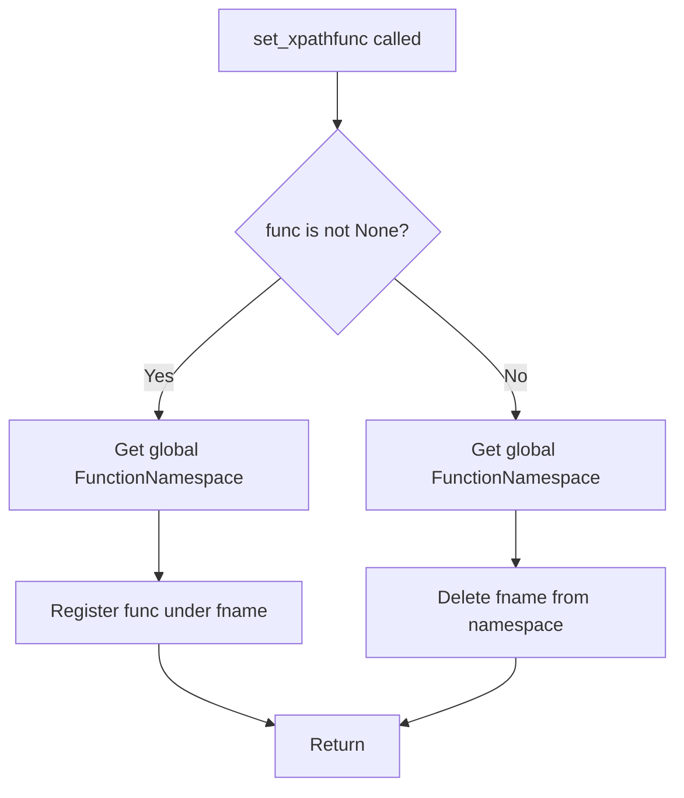
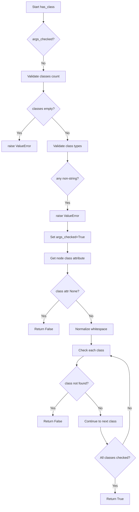

# `xpathfuncs.py`

## `parsel.xpathfuncs.set_xpathfunc` · *function*

## Summary:
Registers or unregisters a custom XPath function in the global XPath function namespace for use in lxml XPath expressions.

## Description:
This function provides a mechanism to extend lxml's XPath capabilities by registering custom functions that can be invoked from XPath expressions. It operates on the global XPath function namespace, affecting all subsequent XPath processing in the application.

## Args:
    fname (str): The name to register the XPath function under. This string identifies the function in XPath expressions.
    func (Optional[Callable]): The callable function to register, or None to unregister a previously registered function.

## Returns:
    None: This function does not return any value.

## Raises:
    KeyError: When attempting to delete a function that does not exist in the namespace.
    TypeError: When fname is not a string or func is not callable and not None.

## Constraints:
    Preconditions:
    - The fname parameter must be a valid string that can be used as an XPath function name
    - The func parameter must be callable or None
    
    Postconditions:
    - If func is not None, the function is registered in the global XPath namespace under fname
    - If func is None, the function is removed from the global XPath namespace (raises KeyError if not found)

## Side Effects:
    - Modifies the global XPath function namespace in lxml
    - This affects all subsequent XPath processing in the application that uses lxml
    - Changes to the global namespace persist for the lifetime of the application

## Control Flow:


## Examples:
    # Register a custom XPath function
    def my_function(context, arg1, arg2):
        return arg1 + arg2
    
    set_xpathfunc('myfunc', my_function)
    
    # Later in XPath processing:
    # xpath_expr = "myfunc(1, 2)"  # Would call my_function with context, 1, 2
    
    # Unregister the function
    set_xpathfunc('myfunc', None)
```

## `parsel.xpathfuncs.setup` · *function*

## Summary:
Registers the 'has-class' XPath function to enable CSS class-based element filtering in XPath expressions.

## Description:
This function extends lxml's XPath capabilities by registering the 'has-class' function in the global XPath function namespace. Once registered, this function can be used within XPath expressions to filter HTML elements based on their CSS class attributes. The function is designed to be called during application initialization to make the custom XPath function available throughout the application's lifecycle.

The 'has-class' function specifically checks if an HTML element contains all specified CSS classes in its class attribute, handling whitespace normalization according to HTML5 standards for robust matching.

## Args:
    None: This function takes no arguments.

## Returns:
    None: This function does not return any value.

## Raises:
    None: This function does not explicitly raise any exceptions.

## Constraints:
    Preconditions:
    - The lxml library must be properly imported and available
    - The 'has-class' function must be defined in the same module
    - The 'set_xpathfunc' function must be available and working correctly
    
    Postconditions:
    - The 'has-class' XPath function is registered in the global XPath namespace
    - All subsequent XPath processing can utilize the 'has-class' function
    - The registration persists for the lifetime of the application

## Side Effects:
    - Modifies the global XPath function namespace in lxml
    - Makes the 'has-class' XPath function available application-wide
    - Affects all subsequent XPath processing that uses lxml

## Control Flow:
```mermaid
flowchart TD
    A[setup() called] --> B[Call set_xpathfunc("has-class", has_class)]
    B --> C[Register has_class function under "has-class" in global namespace]
    C --> D[Function available for XPath expressions]
    D --> E[Return]
```

## Examples:
    # Typical usage during application initialization
    from parsel.xpathfuncs import setup
    setup()
    
    # Later in XPath processing:
    # xpath_expr = "//div[has-class('btn', 'primary')]"
    # This would select div elements that have both 'btn' and 'primary' classes
    
    # Another example:
    # xpath_expr = "//a[has-class('external-link')]"
    # This would select anchor elements with the 'external-link' class

## `parsel.xpathfuncs.has_class` · *function*

## Summary:
Checks if an HTML element has all specified CSS classes in its class attribute.

## Description:
This function determines whether an HTML element contains all the specified CSS classes in its class attribute. It's designed to be used as an XPath function for filtering elements based on their CSS classes. The function handles whitespace normalization according to HTML5 standards and ensures robust matching even when classes are separated by various whitespace characters.

## Args:
    context (Any): XPath evaluation context containing the node being evaluated and evaluation state
    *classes (str): Variable number of CSS class names to check for existence on the element

## Returns:
    bool: True if the element has all specified classes, False otherwise

## Raises:
    ValueError: When no classes are provided as arguments, or when any argument is not a string

## Constraints:
    Preconditions:
        - The context parameter must be a valid XPath evaluation context object
        - The context.node must have a "class" attribute accessible via .get("class")
        - All arguments must be strings
    Postconditions:
        - Returns a boolean value indicating class membership
        - The function caches argument validation in context.eval_context after first call

## Side Effects:
    - Modifies context.eval_context by setting "args_checked" flag after initial validation
    - No external I/O operations or state mutations beyond context modification

## Control Flow:


## Examples:
    # Check if element has both "btn" and "primary" classes
    result = has_class(context, "btn", "primary")
    
    # Check if element has "active" class
    result = has_class(context, "active")
    
    # This would raise ValueError: has-class must have at least 1 argument
    # result = has_class(context)
    
    # This would raise ValueError: has-class arguments must be strings
    # result = has_class(context, 123)
```

