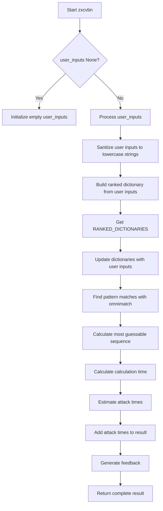

# `__init__.py`

## `zxcvbn.__init__.zxcvbn` · *function*

## Summary:
Estimates password strength by analyzing patterns and calculating guess probabilities using the zxcvbn algorithm.

## Description:
This function serves as the primary interface for assessing password strength using the zxcvbn algorithm. It analyzes a password for common patterns, calculates the number of guesses required to crack it, estimates attack times for various scenarios, and provides security feedback. The function handles both Python 2 and Python 3 string compatibility and processes user inputs to enhance pattern matching accuracy.

## Args:
    password (str): The password string to analyze for strength
    user_inputs (list[str], optional): Additional words or phrases to include in the dictionary for pattern matching. Defaults to None (empty list).

## Returns:
    dict: A comprehensive analysis result containing:
        - 'password' (str): The analyzed password
        - 'guesses' (Decimal): Estimated number of guesses needed to crack the password
        - 'guesses_log10' (float): Logarithm base 10 of the guess count
        - 'sequence' (list): List of pattern matches found in the password
        - 'calc_time' (timedelta): Time taken to perform the analysis
        - 'crack_times_seconds' (dict): Attack times for different scenarios (online/offline, throttled/fast)
        - 'crack_times_display' (dict): Human-readable attack time estimates
        - 'score' (int): Strength score from 0-4 (0=very weak, 4=very strong)
        - 'feedback' (dict): Security suggestions and warnings

## Raises:
    None explicitly raised - All exceptions are handled internally by the underlying modules

## Constraints:
    Preconditions:
        - Password must be a string
        - User inputs, if provided, should be iterable containing strings or convertible values
    Postconditions:
        - Returns a dictionary with all analysis results including strength score and feedback
        - Calculation time is recorded in the result

## Side Effects:
    None - This function is pure and doesn't modify external state or perform I/O operations

## Control Flow:

## Examples:
    >>> result = zxcvbn("password123")
    >>> print(result['score'])
    2
    >>> print(result['feedback']['warning'])
    ""
    
    >>> result = zxcvbn("mysecretpassword", ["john", "doe"])
    >>> print(result['guesses'])
    Decimal('123456')
    >>> print(result['crack_times_display']['offline_fast_hashing_1e10_per_second'])
    "less than a second"

