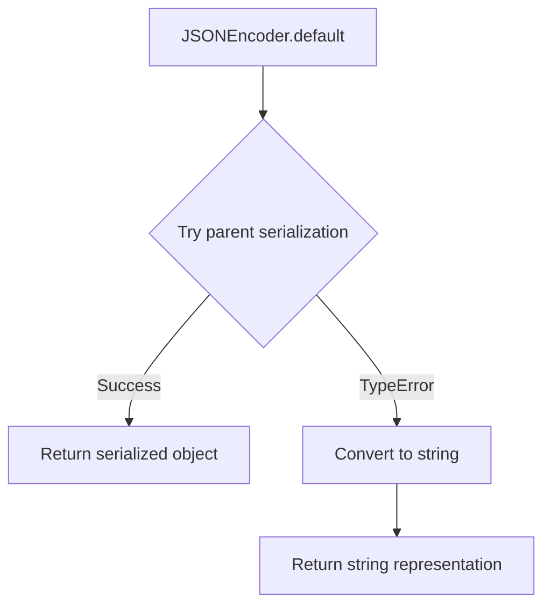
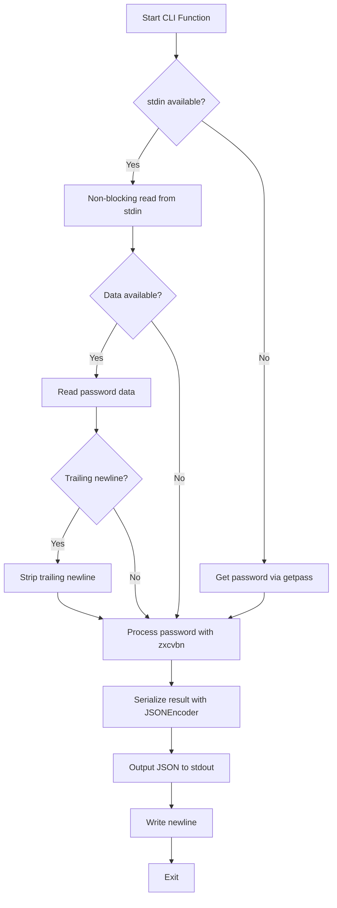

# `__main__.py`

## `zxcvbn.__main__.JSONEncoder` · *class*

## Summary:
A custom JSON encoder that extends the standard library's JSONEncoder to handle non-serializable objects by converting them to strings.

## Description:
This class provides a fallback mechanism for JSON serialization when objects cannot be handled by the standard JSON encoder. It is designed to prevent serialization errors when attempting to encode objects that are not natively supported by JSON (such as custom objects, datetime objects, or other non-primitive types). The encoder attempts to use the parent's default serialization method, and if that fails due to a TypeError, it falls back to converting the object to its string representation.

## State:
- Inherits from `json.JSONEncoder` - no additional instance attributes
- The class doesn't store any state beyond what's inherited from the parent class

## Lifecycle:
- Creation: Instantiated automatically by the JSON serialization process when specified as the cls parameter in json.dumps() or similar functions
- Usage: Called internally by the JSON serialization machinery when encountering non-serializable objects
- Destruction: Managed automatically by Python's garbage collector

## Method Map:


## Raises:
- TypeError: Raised by the parent JSONEncoder.default() when an object cannot be serialized, which is caught and handled by returning str(o)

## Example:
```python
import json
from zxcvbn.__main__ import JSONEncoder

# Custom object that can't be serialized by default JSON encoder
class CustomObject:
    def __init__(self, value):
        self.value = value

obj = CustomObject("test")
# Without custom encoder, this would raise TypeError
result = json.dumps(obj, cls=JSONEncoder)
# Result would be '"<__main__.CustomObject object at 0x...>"'
```

## `zxcvbn.__main__.cli` · *function*

## Summary:
Command-line interface for analyzing password strength using the zxcvbn algorithm.

## Description:
This function serves as the entry point for the zxcvbn command-line tool. It parses command-line arguments, reads a password from either standard input (if available) or prompts the user interactively, analyzes the password strength using the zxcvbn algorithm, and outputs the results as formatted JSON to standard output.

## Args:
    None - This function does not accept any explicit parameters. It reads configuration from command-line arguments via a global parser object.

## Returns:
    None - This function does not return any value. It produces output to standard output and exits.

## Raises:
    None - This function does not explicitly raise exceptions, though underlying operations may raise exceptions during argument parsing, password input, or JSON serialization.

## Constraints:
    Precondition: The global parser object must be properly initialized before calling this function.
    Precondition: The zxcvbn function must be available in the module's namespace.
    Precondition: The JSONEncoder class must be available in the module's namespace.
    Postcondition: The function will output a JSON-formatted result to stdout containing password strength analysis.

## Side Effects:
    - Reads from standard input if available (using non-blocking select for stdin)
    - Prompts user for password input via getpass if stdin is not available
    - Writes JSON-formatted analysis result to standard output
    - May cause terminal to echo to be disabled during password prompt

## Control Flow:


## Examples:
    # Using stdin redirection
    echo "mypassword123" | python -m zxcvbn
    
    # Interactive mode
    python -m zxcvbn
    # User will be prompted to enter password securely
    
    # With user inputs
    python -m zxcvbn --user-input "john" "password123"

