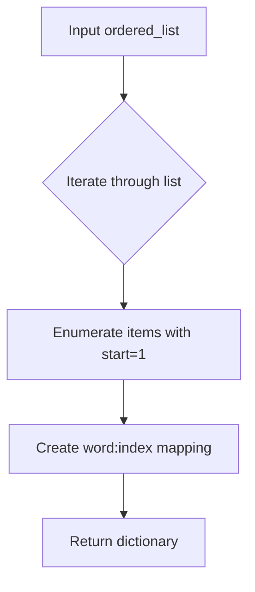
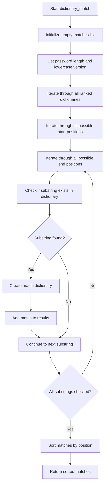
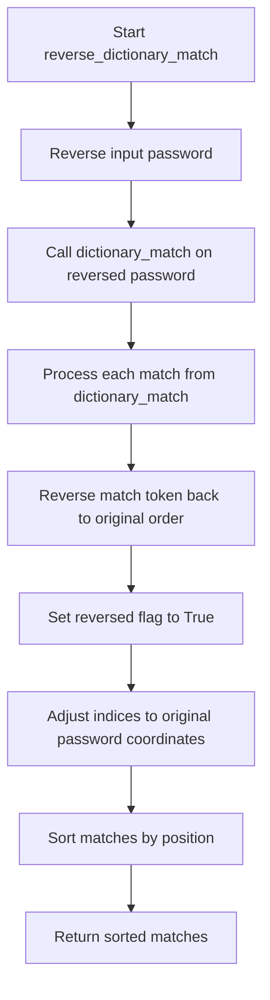
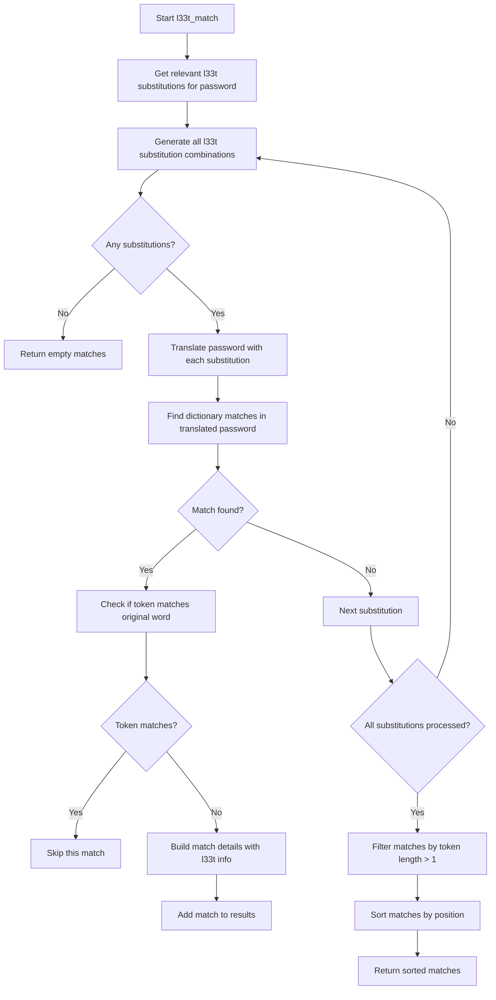

# `matching.py`

## `zxcvbn.matching.build_ranked_dict` · *function*

## Summary:
Creates a dictionary mapping words to their ranked positions in an ordered list.

## Description:
Transforms an ordered list of words into a dictionary where each word maps to its position (starting from 1) in the original list. This ranking system is used for frequency analysis and password strength estimation.

## Args:
    ordered_list (list[str]): A list of words sorted in descending order of frequency or importance.

## Returns:
    dict[str, int]: A dictionary where keys are words from the input list and values are their 1-based indices in the list.

## Raises:
    None

## Constraints:
    Preconditions:
        - The input `ordered_list` must be iterable
        - Each item in the list must be hashable (suitable for use as a dictionary key)
    
    Postconditions:
        - The returned dictionary will have exactly as many entries as the input list
        - All keys in the returned dictionary will be present in the input list
        - All values in the returned dictionary will be positive integers starting from 1

## Side Effects:
    None

## Control Flow:


## Examples:
```python
# Basic usage
words = ["password", "123456", "qwerty"]
ranked_dict = build_ranked_dict(words)
# Result: {"password": 1, "123456": 2, "qwerty": 3}

# Empty list
empty_dict = build_ranked_dict([])
# Result: {}

# Single item
single_dict = build_ranked_dict(["hello"])
# Result: {"hello": 1}
```

## `zxcvbn.matching.omnimatch` · *function*

## Summary:
Applies multiple pattern-matching strategies to identify structural elements within a password.

## Description:
The omnimatch function serves as the primary entry point for pattern detection in the zxcvbn password strength estimator. It systematically applies eight distinct matching algorithms to identify various types of patterns within a given password, including dictionary words, reversed words, leet-speak substitutions, spatial patterns, repeated characters, sequences, regular expressions, and date formats. The results from all matching strategies are aggregated and sorted by their positional indices to create a comprehensive pattern analysis.

This function was extracted to centralize the pattern-matching orchestration logic, allowing for clean separation between the matching strategies and their coordination. This design enables easy extension with new matching algorithms while maintaining a consistent interface for consumers of the matching results.

## Args:
    password (str): The password string to analyze for patterns
    _ranked_dictionaries (dict, optional): Dictionary of ranked word lists used by various matchers. Defaults to RANKED_DICTIONARIES global constant.

## Returns:
    list[dict]: A list of match dictionaries, each containing pattern information with common fields:
        - i (int): Start position of the match in the password
        - j (int): End position of the match in the password  
        - pattern (str): Type of pattern matched (e.g., 'dictionary', 'sequence', 'date')
        - matched_word (str, optional): The actual word or pattern found
        - rank (int, optional): Position in the frequency list (for dictionary-based matches)
        - dictionary_name (str, optional): Name of the dictionary used (for dictionary-based matches)
        - reversed (bool, optional): True if the word was reversed (for reverse dictionary matches)
        - l33t (bool, optional): True if leet-speak substitution was used (for l33t matches)
        - base_guesses (int, optional): Number of guesses required for the base pattern
        - guesses (int, optional): Total number of guesses required for the pattern
        - sequence_name (str, optional): Name of the sequence type (for sequence matches)
        - sequence_space (int, optional): Size of the sequence space (for sequence matches)
        - regex_name (str, optional): Name of the regex pattern (for regex matches)
        - date (datetime.date, optional): Date object if match is a date (for date matches)
        - separator (str, optional): Separator character if match uses separators (for date matches)

## Raises:
    None explicitly raised by this function, though individual matchers may raise exceptions during processing.

## Constraints:
    Preconditions:
    - Password must be a string
    - Ranked dictionaries must be properly formatted dictionaries
    
    Postconditions:
    - Returns a list of match dictionaries sorted by start position (i) and end position (j)
    - All returned matches are valid pattern matches from the password

## Side Effects:
    None - This function is pure and does not modify external state or perform I/O operations.

## Control Flow:
```mermaid
flowchart TD
    A[Start omnimatch] --> B[Initialize empty matches list]
    B --> C[Iterate through 8 matcher functions]
    C --> D[Apply dictionary_match]
    D --> E{Has matches?}
    E -->|Yes| F[Extend matches list]
    F --> G[Apply reverse_dictionary_match]
    G --> H{Has matches?}
    H -->|Yes| I[Extend matches list]
    I --> J[Apply l33t_match]
    J --> K{Has matches?}
    K -->|Yes| L[Extend matches list]
    L --> M[Apply spatial_match]
    M --> N{Has matches?}
    N -->|Yes| O[Extend matches list]
    O --> P[Apply repeat_match]
    P --> Q{Has matches?}
    Q -->|Yes| R[Extend matches list]
    R --> S[Apply sequence_match]
    S --> T{Has matches?}
    T -->|Yes| U[Extend matches list]
    U --> V[Apply regex_match]
    V --> W{Has matches?}
    W -->|Yes| X[Extend matches list]
    X --> Y[Apply date_match]
    Y --> Z{Has matches?}
    Z -->|Yes| AA[Extend matches list]
    AA --> AB[Sort matches by (i,j)]
    AB --> AC[Return sorted matches]
```

## Examples:
    # Basic usage
    matches = omnimatch("password123")
    # Returns list of pattern matches like [{'pattern': 'dictionary', 'matched_word': 'password', 'i': 0, 'j': 7}, ...]

    # With custom dictionaries
    custom_dicts = {'common': ['foo', 'bar']}
    matches = omnimatch("foo123", _ranked_dictionaries=custom_dicts)
    # Returns matches using custom dictionary

## `zxcvbn.matching.dictionary_match` · *function*

## Summary:
Identifies dictionary words embedded within a password and returns all matching substrings with their positional and statistical information.

## Description:
This function performs dictionary matching on a password by scanning all possible substrings to find matches in pre-defined ranked dictionaries. It's part of the zxcvbn password strength estimation algorithm, specifically designed to detect common dictionary words that may weaken password security.

The function is typically called as part of the broader password matching process within the zxcvbn library, where various pattern-matching functions (like dictionary_match, spatial_match, etc.) are used to identify potential patterns in passwords before estimating guessability.

This logic is extracted into its own function to encapsulate the dictionary matching algorithm, allowing for clean separation of concerns and making it easier to test and maintain the specific matching logic independently from other pattern matching strategies.

## Args:
    password (str): The password string to analyze for dictionary matches
    _ranked_dictionaries (dict): Optional parameter containing ranked dictionaries for matching. Defaults to RANKED_DICTIONARIES which contains pre-loaded frequency lists.

## Returns:
    list[dict]: A list of match dictionaries, each containing:
        - pattern (str): Always 'dictionary' for this function
        - i (int): Starting index of the matched substring in the password
        - j (int): Ending index of the matched substring in the password  
        - token (str): The actual substring from the password that matched
        - matched_word (str): The lowercase version of the matched word
        - rank (int): The frequency rank of the matched word
        - dictionary_name (str): Name of the dictionary where the match was found
        - reversed (bool): Whether the match was reversed (always False for this function)
        - l33t (bool): Whether the match involved l33t speak substitution (always False for this function)

## Raises:
    None explicitly raised by this function

## Constraints:
    Preconditions:
    - Password must be a string
    - Ranked dictionaries must be properly formatted dictionaries mapping words to ranks
    
    Postconditions:
    - Returns a sorted list of matches ordered by starting position and ending position
    - All returned matches are substrings of the input password
    - Each match contains complete positional and dictionary information

## Side Effects:
    None

## Control Flow:


## Examples:
    # Basic usage
    matches = dictionary_match("mypassword")
    # Returns list of dictionaries identifying all dictionary words found
    
    # With custom dictionaries
    custom_dicts = {"common": {"password": 1, "admin": 2}}
    matches = dictionary_match("mypassword", custom_dicts)
    # Returns matches found in the custom dictionary

## `zxcvbn.matching.reverse_dictionary_match` · *function*

## Summary:
Finds dictionary words embedded within a password that appear in reverse order by reversing the password, performing standard dictionary matching, and adjusting the results back to the original coordinate system.

## Description:
This function identifies dictionary words that occur in reverse order within a password. It's used as part of the zxcvbn password strength estimation algorithm to detect patterns where common dictionary words appear backwards in the password string.

The function works by reversing the input password, applying the standard dictionary_match algorithm to find matches in the reversed string, then transforming those matches back to the original password's coordinate system. This allows detection of reversed dictionary words like "drowssap" instead of "password".

This logic is extracted into its own function to encapsulate the reverse matching algorithm separately from forward matching, enabling clean separation of concerns and making it easier to test and maintain the reverse matching capability independently.

## Args:
    password (str): The password string to analyze for reversed dictionary matches
    _ranked_dictionaries (dict): Optional parameter containing ranked dictionaries for matching. Defaults to RANKED_DICTIONARIES which contains pre-loaded frequency lists.

## Returns:
    list[dict]: A list of match dictionaries, each containing:
        - pattern (str): Always 'dictionary' for this function
        - i (int): Starting index of the matched substring in the password
        - j (int): Ending index of the matched substring in the password  
        - token (str): The actual substring from the password that matched (in original order)
        - matched_word (str): The lowercase version of the matched word
        - rank (int): The frequency rank of the matched word
        - dictionary_name (str): Name of the dictionary where the match was found
        - reversed (bool): Always True for this function, indicating the match was found in reverse
        - l33t (bool): Whether the match involved l33t speak substitution (always False for this function)

## Raises:
    None explicitly raised by this function

## Constraints:
    Preconditions:
    - Password must be a string
    - Ranked dictionaries must be properly formatted dictionaries mapping words to ranks
    
    Postconditions:
    - Returns a sorted list of matches ordered by starting position and ending position
    - All returned matches are substrings of the input password
    - Each match contains complete positional and dictionary information with reversed flag set to True

## Side Effects:
    None

## Control Flow:


## Examples:
    # Find reversed dictionary words in a password
    matches = reverse_dictionary_match("drowssap123")
    # Returns matches for "password" found in reverse order
    
    # With custom dictionaries
    custom_dicts = {"common": {"password": 1, "admin": 2}}
    matches = reverse_dictionary_match("drowssap123", custom_dicts)
    # Returns matches found in the custom dictionary
```

## `zxcvbn.matching.relevant_l33t_subtable` · *function*

*No documentation generated.*

## `zxcvbn.matching.enumerate_l33t_subs` · *function*

## Summary:
Generates all valid combinations of l33t character substitutions from a given substitution table.

## Description:
This function processes a substitution table mapping characters to their l33t equivalents and computes all possible combinations of these substitutions. It's designed to handle the complexity of generating meaningful l33t substitution patterns while avoiding duplicate representations of the same substitution set. The function is typically used during password strength analysis to account for common leet speak variations in password guessing algorithms.

## Args:
    table (dict): A dictionary mapping characters to lists of their l33t equivalents. For example, {'a': ['@', '4'], 'e': ['3']} would represent that 'a' can be substituted with '@' or '4', and 'e' with '3'.

## Returns:
    list[dict]: A list of dictionaries, where each dictionary represents a unique combination of l33t substitutions. Each dictionary maps l33t characters to their corresponding regular characters (e.g., {'@': 'a', '3': 'e'}).

## Raises:
    None explicitly raised

## Constraints:
    Preconditions:
    - The input table must be a dictionary
    - Each key in the table should map to a list of characters
    - The function assumes all input data is valid and properly formatted
    
    Postconditions:
    - Returns a list of dictionaries with unique substitution mappings
    - Each returned dictionary contains valid l33t-to-character mappings
    - No duplicate substitution combinations are present in the result

## Side Effects:
    None

## Control Flow:
```mermaid
flowchart TD
    A[Start enumerate_l33t_subs] --> B{table.keys()}
    B --> C[Initialize subs = [[]]]
    C --> D[Call helper(keys, subs)]
    D --> E{keys empty?}
    E -->|Yes| F[Return subs]
    E -->|No| G[Process first_key]
    G --> H[For each l33t_chr in table[first_key]]
    H --> I[For each existing sub in subs]
    I --> J{Duplicate l33t_chr found?}
    J -->|No| K[Create sub_extension with new substitution]
    J -->|Yes| L[Create sub_alternative with replacement]
    K --> M[Add sub_extension to next_subs]
    L --> N[Add both sub and sub_alternative to next_subs]
    M --> O[Apply dedup to next_subs]
    O --> P[Recursively call helper with rest_keys]
    P --> Q[Convert assoc lists to dicts]
    Q --> R[Return sub_dicts]
```

## Examples:
    Example 1: Basic usage with simple substitutions
    Input: {'a': ['@', '4'], 'e': ['3']}
    Output: [{'@': 'a', '3': 'e'}, {'4': 'a', '3': 'e'}]
    
    Example 2: Single character substitution
    Input: {'o': ['0']}
    Output: [{'0': 'o'}]

## `zxcvbn.matching.translate` · *function*

## Summary:
Translates characters in a string according to a provided character mapping dictionary.

## Description:
Maps each character in the input string to a replacement character using the provided mapping dictionary. If a character is not found in the mapping dictionary, it remains unchanged in the output string. This utility function is commonly used for normalizing or transforming character sets in password analysis.

## Args:
    string (str): The input string to be translated
    chr_map (dict): A dictionary mapping original characters to their replacement characters

## Returns:
    str: A new string with characters translated according to the mapping dictionary

## Raises:
    None

## Constraints:
    Preconditions:
    - The input string must be a valid string object
    - The chr_map must be a dictionary-like object with string keys
    
    Postconditions:
    - The returned string will have the same length as the input string
    - Characters not present in chr_map remain unchanged

## Side Effects:
    None

## Control Flow:
```mermaid
flowchart TD
    A[Start translate] --> B{char in chr_map?}
    B -- Yes --> C[Append chr_map[char]]
    B -- No --> D[Append char]
    C --> E[Next character]
    D --> E
    E --> F{More characters?}
    F -- Yes --> B
    F -- No --> G[Join chars]
    G --> H[Return result]
```

## Examples:
    >>> translate("hello", {'h': 'H', 'e': 'E'})
    'HELlo'
    
    >>> translate("abc123", {'a': 'A', 'b': 'B', 'c': 'C'})
    'ABC123'
    
    >>> translate("test", {})
    'test'
```

## `zxcvbn.matching.l33t_match` · *function*

## Summary:
Identifies dictionary word matches in passwords that involve l33t (leet) character substitutions, such as replacing 'a' with '@' or 'e' with '3'.

## Description:
This function detects dictionary words in passwords that have been modified using common l33t character substitutions. It systematically generates all possible l33t substitution patterns for characters present in the password, translates the password accordingly, and then searches for dictionary matches in the transformed password. This logic is extracted into its own function to separate the l33t-specific matching algorithm from general dictionary matching, enabling modular password strength analysis.

## Args:
    password (str): The password string to analyze for l33t dictionary matches
    _ranked_dictionaries (dict, optional): Dictionary of ranked word lists for matching. Defaults to RANKED_DICTIONARIES which contains pre-loaded frequency lists.
    _l33t_table (dict, optional): Mapping of regular characters to their l33t equivalents. Defaults to L33T_TABLE which contains common l33t substitutions.

## Returns:
    list[dict]: A list of match dictionaries, each containing:
        - pattern (str): Always 'dictionary' for this function
        - i (int): Starting index of the matched substring in the password
        - j (int): Ending index of the matched substring in the password  
        - token (str): The actual substring from the password that matched
        - matched_word (str): The lowercase version of the matched word
        - rank (int): The frequency rank of the matched word
        - dictionary_name (str): Name of the dictionary where the match was found
        - reversed (bool): Whether the match was reversed (always False for this function)
        - l33t (bool): Always True for this function, indicating l33t substitution was used
        - sub (dict): Dictionary mapping l33t characters to their regular equivalents
        - sub_display (str): String representation of the substitutions for display purposes

## Raises:
    None explicitly raised

## Constraints:
    Preconditions:
    - Password must be a string
    - Ranked dictionaries must be properly formatted dictionaries mapping words to ranks
    - L33T table must be a dictionary mapping characters to lists of l33t equivalents
    
    Postconditions:
    - Returns a sorted list of matches ordered by starting position and ending position
    - All returned matches are substrings of the input password
    - Each match contains complete positional and dictionary information including l33t details
    - All returned matches have tokens with length greater than 1

## Side Effects:
    None

## Control Flow:


## Examples:
    # Basic usage with a password containing l33t substitutions
    matches = l33t_match("p@ssw0rd")
    # Returns matches for dictionary words like "password" with l33t substitutions
    
    # Match with multiple substitutions
    matches = l33t_match("h3ll0_w0rld")
    # Returns matches for "hello" and "world" with substitutions like '3'->'e', '0'->'o'

## `zxcvbn.matching.spatial_match` · *function*

## Summary:
Identifies spatial keyboard pattern matches in passwords across multiple keyboard layouts.

## Description:
Analyzes a password to detect sequential character patterns that follow keyboard layouts such as QWERTY or Dvorak. This function systematically tests the password against multiple predefined keyboard graphs to identify spatial patterns, including directional turns and shifted key counts. It serves as the main entry point for spatial pattern matching in the zxcvbn password strength estimation algorithm.

The function leverages the spatial_match_helper function to process each keyboard layout graph and aggregates all detected patterns. It ensures consistent sorting of results by starting position to facilitate subsequent analysis in the password strength calculation pipeline.

## Args:
    password (str): The password string to analyze for spatial patterns
    _graphs (dict, optional): Dictionary mapping keyboard layout names to their adjacency graph definitions. Defaults to GRAPHS constant defined elsewhere in the module.
    _ranked_dictionaries (dict, optional): Dictionary of ranked word lists for common patterns. Defaults to RANKED_DICTIONARIES constant defined elsewhere in the module.

## Returns:
    list[dict]: A sorted list of dictionaries describing detected spatial patterns, each containing:
        - pattern (str): Always 'spatial' indicating the pattern type
        - i (int): Starting index of the matched sequence in the password
        - j (int): Ending index of the matched sequence in the password  
        - token (str): The actual character sequence that was matched
        - graph (str): The keyboard layout name used for matching
        - turns (int): Number of directional changes in the pattern
        - shifted_count (int): Count of shifted key presses in the pattern

## Raises:
    None explicitly raised - delegates to spatial_match_helper which handles internal errors gracefully

## Constraints:
    Preconditions:
    - password must be a string
    - _graphs must be a dictionary-like object with keyboard layout definitions
    - Each graph in _graphs must support key lookup returning lists of adjacent characters
    
    Postconditions:
    - Returns a list of match dictionaries with consistent structure
    - Results are sorted by starting index (i) and ending index (j)
    - Only patterns of length 3 or greater are returned (length 1 or 2 chains are ignored)
    - All returned matches represent valid spatial patterns found in the password

## Side Effects:
    None

## Control Flow:
```mermaid
flowchart TD
    A[Start spatial_match] --> B[Initialize empty matches list]
    B --> C[For each graph in _graphs]
    C --> D[Call spatial_match_helper]
    D --> E[Extend matches with helper results]
    E --> F[Sort matches by (i,j) tuple]
    F --> G[Return sorted matches]
```

## Examples:
    # Basic usage with default parameters
    matches = spatial_match("qwerty123")
    # Returns spatial pattern matches found across all keyboard layouts
    
    # Usage with custom graphs
    custom_graphs = {"qwerty": {"q": ["w"], "w": ["q", "e"]}}
    matches = spatial_match("qwe", _graphs=custom_graphs)
    # Returns matches for the custom keyboard layout

## `zxcvbn.matching.spatial_match_helper` · *function*

## Summary:
Identifies and extracts spatial keyboard pattern matches from passwords, including directional turns and shifted key counts.

## Description:
This helper function detects sequential character patterns that follow keyboard layouts (such as QWERTY or Dvorak). It identifies chains of characters that appear adjacent on a keyboard, tracking changes in direction and shifted key presses to calculate pattern complexity. This function is part of the spatial pattern matching system used by the zxcvbn password strength estimator.

The function specifically analyzes keyboard adjacency relationships to find patterns like "asdf" or "qwer" on QWERTY keyboards, counting directional changes and shifted key presses to better estimate guessability. Patterns of length 1 or 2 are excluded from results.

## Args:
    password (str): The password string to analyze for spatial patterns
    graph (dict): A dictionary mapping keyboard characters to lists of adjacent characters
    graph_name (str): Name of the keyboard layout being analyzed ('qwerty', 'dvorak', etc.)

## Returns:
    list[dict]: A list of dictionaries describing detected spatial patterns, each containing:
        - pattern (str): Always 'spatial' indicating the pattern type
        - i (int): Starting index of the matched sequence in the password
        - j (int): Ending index of the matched sequence in the password  
        - token (str): The actual character sequence that was matched
        - graph (str): The keyboard layout name used for matching
        - turns (int): Number of directional changes in the pattern
        - shifted_count (int): Count of shifted key presses in the pattern

## Raises:
    None explicitly raised - handles KeyError when accessing graph dictionary gracefully

## Constraints:
    Preconditions:
    - password must be a string
    - graph must be a dictionary-like object that supports key lookup returning lists
    - graph_name must be a string identifying a supported keyboard layout
    
    Postconditions:
    - Returns a list of match dictionaries with consistent structure
    - Only patterns of length 3 or greater are returned (length 1 or 2 chains are ignored)
    - All returned matches represent valid spatial patterns found in the password
    - The graph parameter must contain entries for all characters that appear in the password

## Side Effects:
    None

## Control Flow:
```mermaid
flowchart TD
    A[Start spatial matching] --> B{Password length > 1?}
    B -- Yes --> C[Initialize i=0]
    C --> D[i < len(password)-1?]
    D -- Yes --> E[Initialize j=i+1, turns=0, last_direction=None]
    E --> F{graph_name in ['qwerty','dvorak'] AND char is shifted?}
    F -- Yes --> G[shifted_count = 1]
    F -- No --> H[shifted_count = 0]
    G --> I[Enter inner loop]
    H --> I
    I --> J[prev_char = password[j-1]]
    J --> K{prev_char in graph?}
    K -- Yes --> L[adjacents = graph[prev_char]]
    K -- No --> M[adjacents = []]
    L --> N{j < len(password)?}
    N -- Yes --> O[cur_char = password[j]]
    O --> P[Iterate through adjacents]
    P --> Q{cur_char in adj?}
    Q -- Yes --> R[found = True]
    R --> S{adj.index(cur_char) == 1?}
    S -- Yes --> T[shifted_count += 1]
    S -- No --> U[No shift increment]
    T --> V{last_direction != found_direction?}
    V -- Yes --> W[turns += 1, last_direction = found_direction]
    V -- No --> X[No turn increment]
    Q -- No --> Y[found = False]
    Y --> Z{found?}
    Z -- Yes --> AA[j += 1]
    Z -- No --> AB{j-i > 2?}
    AB -- Yes --> AC[Add match to results]
    AC --> AD[i = j]
    AB -- No --> AE[i = j]
    AD --> AF[Break inner loop]
    AE --> AF
    AA --> AG[Continue inner loop]
    AF --> AH[Check outer loop condition]
    AH --> D
    N -- No --> AI[Skip inner loop]
    AI --> AJ[Add match to results]
    AJ --> AK[i = j]
    AK --> AL[Break inner loop]
    AL --> AH
    D -- No --> AM[Return matches]
```

## Examples:
    # Example of finding a QWERTY pattern
    graph = {'q': ['w'], 'w': ['q', 'e'], 'e': ['w', 'r']}
    result = spatial_match_helper("qwe", graph, "qwerty")
    # Returns [{'pattern': 'spatial', 'i': 0, 'j': 2, 'token': 'qwe', 'graph': 'qwerty', 'turns': 0, 'shifted_count': 0}]

Note: This function depends on the global variable SHIFTED_RX which defines what constitutes a shifted key character. The exact behavior of shifted key detection may vary based on the implementation of this regex pattern.

## `zxcvbn.matching.sequence_match` · *function*

## Summary:
Identifies sequential character patterns in passwords, such as alphabetical sequences (abc), numeric sequences (123), or other ordered character groups.

## Description:
This function analyzes a password to detect sequential character patterns where adjacent characters follow a consistent increment or decrement in ASCII value. It's designed to identify common sequential patterns that users might employ, such as 'abc', 'xyz', '123', or '987'. The function operates by examining character differences and grouping consecutive characters that share the same difference pattern.

The logic is extracted into its own function to separate the sequence detection algorithm from the broader password strength analysis, allowing for modular testing and reuse in different contexts within the zxcvbn password strength estimation framework.

## Args:
    password (str): The password string to analyze for sequential patterns
    _ranked_dictionaries (any): Optional parameter for dictionary-based matching (default uses RANKED_DICTIONARIES constant)

## Returns:
    list[dict]: A list of dictionaries describing detected sequential patterns, each containing:
        - pattern (str): Always 'sequence' for this pattern type
        - i (int): Starting index of the sequence in the password
        - j (int): Ending index of the sequence in the password  
        - token (str): The actual sequential substring
        - sequence_name (str): Type of sequence ('lower', 'upper', 'digits', or 'unicode')
        - sequence_space (int): Size of the character set for this sequence type (26 for letters, 10 for digits)
        - ascending (bool): Whether the sequence is ascending (True) or descending (False)

## Raises:
    None explicitly raised

## Constraints:
    Preconditions:
        - Password must be a string
        - Password length must be at least 1 (though function returns early for length 1)
    
    Postconditions:
        - Returns a list of pattern dictionaries with consistent structure
        - Empty list returned for passwords of length 1
        - All returned sequences have at least 2 characters or are single characters with delta = ±1

## Side Effects:
    None

## Control Flow:
```mermaid
flowchart TD
    A[Start sequence_match] --> B{Password length == 1?}
    B -- Yes --> C[Return empty list]
    B -- No --> D[Initialize result, i, last_delta]
    D --> E[Loop through password starting at index 1]
    E --> F[Calculate delta = ord(password[k]) - ord(password[k-1])]
    F --> G{last_delta is None?}
    G -- Yes --> H[last_delta = delta]
    G -- No --> I{delta == last_delta?}
    I -- Yes --> J[Continue loop]
    I -- No --> K[Call update(i, j, last_delta)]
    K --> L[i = j]
    L --> M[last_delta = delta]
    J --> N[End loop]
    N --> O[Call update(i, len(password)-1, last_delta)]
    O --> P[Return result]
```

## Examples:
    >>> sequence_match("abc")
    [{'pattern': 'sequence', 'i': 0, 'j': 2, 'token': 'abc', 'sequence_name': 'lower', 'sequence_space': 26, 'ascending': True}]
    
    >>> sequence_match("1234")
    [{'pattern': 'sequence', 'i': 0, 'j': 3, 'token': '1234', 'sequence_name': 'digits', 'sequence_space': 10, 'ascending': True}]
    
    >>> sequence_match("xyz")
    [{'pattern': 'sequence', 'i': 0, 'j': 2, 'token': 'xyz', 'sequence_name': 'lower', 'sequence_space': 26, 'ascending': True}]
    
    >>> sequence_match("cba")
    [{'pattern': 'sequence', 'i': 0, 'j': 2, 'token': 'cba', 'sequence_name': 'lower', 'sequence_space': 26, 'ascending': False}]
```

## `zxcvbn.matching.regex_match` · *function*

## Summary:
Identifies and extracts all regex pattern matches from a password string, returning them sorted by their position in the password.

## Description:
This function scans a password against a collection of predefined regular expressions to find all matching patterns. It's part of the zxcvbn password strength estimation library's pattern matching system, specifically designed to detect regex-based patterns such as dates, emails, or other structured text elements in passwords.

The function is extracted into its own component to separate the regex matching logic from other pattern matching strategies, enabling modular maintenance and testing of different matching approaches within the password strength analysis pipeline.

## Args:
    password (str): The password string to analyze for regex patterns
    _regexen (dict): Dictionary mapping regex pattern names to compiled regex objects. Defaults to REGEXEN constant defined in the module.
    _ranked_dictionaries (dict): Collection of ranked dictionaries used for word matching. Defaults to RANKED_DICTIONARIES constant defined in the module.

## Returns:
    list[dict]: A list of match dictionaries, each containing:
        - 'pattern' (str): Always 'regex' indicating this is a regex match
        - 'token' (str): The matched substring from the password
        - 'i' (int): Starting index of the match in the password (0-based)
        - 'j' (int): Ending index of the match in the password (0-based)
        - 'regex_name' (str): Name of the regex pattern that matched
        - 'regex_match' (re.Match): The raw regex match object

## Raises:
    None explicitly raised by this function

## Constraints:
    Preconditions:
        - Password must be a string
        - _regexen must be a dictionary with regex pattern names as keys and compiled regex objects as values
        - _ranked_dictionaries must be a valid dictionary structure
    
    Postconditions:
        - Returns a list of match dictionaries sorted by starting position (i) and then ending position (j)
        - All returned matches are valid substrings of the input password

## Side Effects:
    None

## Control Flow:
```mermaid
flowchart TD
    A[Start regex_match] --> B[Initialize empty matches list]
    B --> C[Iterate through _regexen items]
    C --> D[For each regex, find all matches in password]
    D --> E[Create match dict for each found match]
    E --> F[Add match dict to matches list]
    F --> G[Sort matches by position (i,j)]
    G --> H[Return sorted matches list]
```

## Examples:
    # Basic usage
    matches = regex_match("My email is john@example.com")
    # Returns list of match dictionaries for email pattern
    
    # With custom regexen
    custom_regexen = {'custom_pattern': re.compile(r'\d{4}-\d{2}-\d{2}')}
    matches = regex_match("Date: 2023-12-25", _regexen=custom_regexen)

## `zxcvbn.matching.date_match` · *function*

*No documentation generated.*

## `zxcvbn.matching.map_ints_to_dmy` · *function*

*No documentation generated.*

## `zxcvbn.matching.map_ints_to_dm` · *function*

## Summary:
Maps a sequence of two integers to a date dictionary with day and month values.

## Description:
Processes a sequence of two integers to determine if they represent valid day and month values. The function tests both the original order and reversed order of the integers to accommodate different date formatting conventions (e.g., MM/DD vs DD/MM). This utility is used internally by the zxcvbn password strength estimator to identify and analyze date patterns in candidate passwords.

## Args:
    ints (list or tuple of int): A sequence containing exactly two integers to be mapped to day/month values.

## Returns:
    dict or None: A dictionary with 'day' and 'month' keys if the integers form valid date values, otherwise None.

## Raises:
    None explicitly raised.

## Constraints:
    Preconditions:
    - Input must be a sequence (list or tuple) of exactly two integers
    - Each integer must be a positive whole number
    
    Postconditions:
    - If valid date values are found, returns a dictionary with 'day' (1-31) and 'month' (1-12) keys
    - If no valid date combination is found, returns None

## Side Effects:
    None.

## Control Flow:
```mermaid
flowchart TD
    A[Start map_ints_to_dm] --> B{Input has 2 elements?}
    B -- No --> C[Return None]
    B -- Yes --> D[Iterate over [ints, reversed(ints)]]
    D --> E{First element 1-31 AND Second element 1-12?}
    E -- Yes --> F[Return {'day': d, 'month': m}]
    E -- No --> G[Continue to next iteration]
    G --> H{End of iterations?}
    H -- No --> E
    H -- Yes --> I[Return None]
```

## Examples:
    >>> map_ints_to_dm([15, 3])
    {'day': 15, 'month': 3}
    
    >>> map_ints_to_dm([3, 15])
    {'day': 3, 'month': 15}
    
    >>> map_ints_to_dm([35, 15])
    None
    
    >>> map_ints_to_dm([15, 13])
    None

## `zxcvbn.matching.two_to_four_digit_year` · *function*

## Summary:
Converts 2-4 digit year representations to full 4-digit years using heuristic year interpretation rules.

## Description:
Handles the conversion of abbreviated year formats (2-4 digits) to complete 4-digit years. This function implements heuristics to determine century placement for 2-digit years, assuming years 51-99 belong to the 1900s and years 0-50 belong to the 2000s. Years with 3+ digits are returned unchanged.

## Args:
    year (int): A year represented as 2-4 digits. Must be a non-negative integer.

## Returns:
    int: A 4-digit year representation. 
    - If year > 99: returns year unchanged
    - If 50 < year <= 99: returns year + 1900
    - If year <= 50: returns year + 2000

## Raises:
    None

## Constraints:
    Preconditions:
    - Input year must be a non-negative integer
    - Function assumes year represents a valid calendar year
    
    Postconditions:
    - Output is always a 4-digit year (1000-9999)
    - Year values > 99 are preserved as-is
    - Year values 0-50 are mapped to 2000-2050
    - Year values 51-99 are mapped to 1951-1999

## Side Effects:
    None

## Control Flow:
```mermaid
flowchart TD
    A[Start: two_to_four_digit_year(year)] --> B{year > 99?}
    B -- Yes --> C[Return year]
    B -- No --> D{year > 50?}
    D -- Yes --> E[Return year + 1900]
    D -- No --> F[Return year + 2000]
    C --> G[End]
    E --> G
    F --> G
```

## Examples:
    >>> two_to_four_digit_year(23)
    2023
    >>> two_to_four_digit_year(75)
    1975
    >>> two_to_four_digit_year(1995)
    1995
    >>> two_to_four_digit_year(45)
    2045
```

