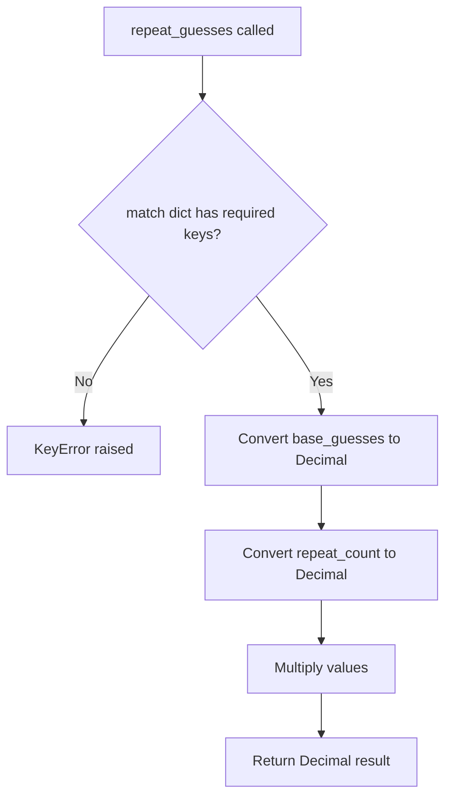

# `scoring.py`

## `zxcvbn.scoring.calc_average_degree` · *function*

## Summary:
Calculates the average degree of nodes in a graph structure by counting non-empty neighbors for each node.

## Description:
This function computes the average degree of all nodes in a graph representation, which is used in password strength estimation to analyze keyboard patterns and character adjacency relationships. It processes a graph where each node maps to a list of neighboring nodes, counting only non-empty neighbors to determine each node's degree. The average degree provides insight into how interconnected the characters are in a keyboard layout.

## Args:
    graph (dict): A dictionary-like object representing a graph where keys are nodes and values are lists of neighboring nodes. Each neighbor list may contain empty values that should be excluded from degree calculation. The graph must not be empty.

## Returns:
    float: The average degree of all nodes in the graph, calculated as the total count of non-empty neighbors divided by the total number of nodes.

## Raises:
    ZeroDivisionError: When the graph parameter is empty (contains no items), causing division by zero.

## Constraints:
    Preconditions:
    - The graph parameter must be iterable with .items() method
    - Each value in the graph must be iterable (support list comprehension with neighbors)
    - The graph must not be empty to avoid division by zero

    Postconditions:
    - Returns a float value representing average degree
    - The result is always non-negative for valid inputs

## Side Effects:
    None

## Control Flow:
```mermaid
flowchart TD
    A[Start calc_average_degree] --> B{graph.items()}
    B --> C[Initialize average = 0]
    C --> D[For each key, neighbors in graph.items()]
    D --> E{neighbors list}
    E --> F[Count non-empty neighbors]
    F --> G[Add to average]
    G --> H[average /= len(graph.items())]
    H --> I[Return average]
```

## Examples:
    # Example with simple graph
    graph = {
        'a': ['b', 'c', ''],
        'b': ['a', 'd'],
        'c': ['a']
    }
    result = calc_average_degree(graph)  # Returns 1.5 (2 + 2 + 1) / 3
    
    # Example with empty graph (raises ZeroDivisionError)
    # empty_graph = {}
    # calc_average_degree(empty_graph)  # Raises ZeroDivisionError

## `zxcvbn.scoring.nCk` · *function*

## Summary:
Computes the binomial coefficient "n choose k" (nCk) using an efficient iterative approach that avoids large factorial calculations.

## Description:
This function calculates the mathematical combination formula C(n,k) = n!/(k!(n-k)!), implemented efficiently to prevent integer overflow issues that would occur with direct factorial computation. The algorithm multiplies and divides incrementally to maintain manageable intermediate values.

## Args:
    n (int): Total number of items in the set, must be non-negative
    k (int): Number of items to choose from the set, must be non-negative

## Returns:
    int: The number of ways to choose k items from n items without regard to order. Returns 0 when k > n, and 1 when k = 0.

## Raises:
    None: This function does not raise any exceptions under normal circumstances.

## Constraints:
    Preconditions:
        - Both n and k must be non-negative integers
        - The function assumes integer inputs and will behave unpredictably with floating-point numbers
    
    Postconditions:
        - Returns an integer representing the binomial coefficient
        - For k > n, returns 0 (mathematically correct)
        - For k = 0, returns 1 (mathematically correct)

## Side Effects:
    None: This function has no side effects and is pure.

## Control Flow:
```mermaid
flowchart TD
    A[Start nCk(n,k)] --> B{k > n?}
    B -- Yes --> C[Return 0]
    B -- No --> D{k == 0?}
    D -- Yes --> E[Return 1]
    D -- No --> F[Initialize r = 1]
    F --> G[For d in range(1, k+1)]
    G --> H[r *= n]
    H --> I[r /= d]
    I --> J[n -= 1]
    J --> K[Next iteration]
    K --> G
    G -- End --> L[Return r]
```

## Examples:
    >>> nCk(5, 2)
    10
    >>> nCk(10, 0)
    1
    >>> nCk(3, 5)
    0
    >>> nCk(0, 0)
    1
```

## `zxcvbn.scoring.most_guessable_match_sequence` · *function*

## Summary:
Finds the most guessable match sequence for a password by computing optimal pattern matches that minimize total guess count using dynamic programming.

## Description:
This function implements a dynamic programming algorithm to determine the optimal sequence of pattern matches that would be used by the most guessable attack strategy against a password. It considers all possible ways to partition the password into pattern matches and selects the sequence that minimizes the total number of guesses required to crack it.

The algorithm builds upon the zxcvbn password strength estimation framework, where each match represents a pattern (dictionary word, spatial pattern, etc.) that could be used in an attack. The function computes the optimal decomposition by considering both explicit matches from the input and implicit brute-force matches for substrings, using dynamic programming to avoid recomputation.

## Args:
    password (str): The password string to analyze
    matches (list[dict]): List of pattern match dictionaries, each containing at least 'i' and 'j' indices indicating match positions, and other pattern-specific fields such as 'pattern', 'token'
    _exclude_additive (bool): Internal flag to control whether to apply additive penalty for sequence growth. When False (default), adds a penalty term to discourage overly long sequences. Defaults to False.

## Returns:
    dict: Dictionary containing:
        - 'password' (str): The input password
        - 'guesses' (Decimal): Estimated number of guesses required for the most guessable sequence
        - 'guesses_log10' (float): Logarithm base 10 of the guess count
        - 'sequence' (list[dict]): List of match dictionaries forming the optimal sequence

## Raises:
    None explicitly raised - though internal TypeError may occur if matches is not iterable

## Constraints:
    Preconditions:
        - password must be a string
        - matches must be iterable (though TypeError is caught)
        - Each match in matches must be a dictionary with 'i' and 'j' keys
    Postconditions:
        - Returns a dictionary with all required keys
        - The sequence represents a valid partition of the password
        - Guesses value is always positive
        - The sequence contains all characters of the password exactly once
        - Each match in the sequence has valid 'i' and 'j' indices

## Side Effects:
    None

## Control Flow:
```mermaid
flowchart TD
    A[Start most_guessable_match_sequence] --> B[Initialize matches_by_j]
    B --> C[Group matches by ending position j]
    C --> D[Initialize optimal DP arrays]
    D --> E[Process each position k from 0 to n-1]
    E --> F[For each match ending at k]
    F --> G{Match starts at 0?}
    G -- Yes --> H[Update with l=1]
    G -- No --> I[For each previous optimal l]
    I --> J[Update with l+1]
    J --> K[Call bruteforce_update(k)]
    K --> L[Unwind optimal sequence]
    L --> M[Calculate final guesses]
    M --> N[Return result dictionary]
```

## Examples:
    >>> password = "p@ssw0rd"
    >>> matches = [
    ...     {'pattern': 'dictionary', 'token': 'p@ss', 'i': 0, 'j': 3},
    ...     {'pattern': 'bruteforce', 'token': 'w0rd', 'i': 4, 'j': 7}
    ... ]
    >>> result = most_guessable_match_sequence(password, matches)
    >>> print(result['guesses'])
    Decimal('1000')
    >>> print(len(result['sequence']))
    2

## `zxcvbn.scoring.estimate_guesses` · *function*

## Summary:
Estimates the number of guesses required to crack a password pattern match using pattern-specific estimation functions.

## Description:
Computes the minimum number of guesses needed to brute-force attack a matched password pattern by dispatching to specialized estimation functions based on pattern type. This function serves as the central hub for guess estimation in the zxcvbn password strength algorithm, ensuring that all pattern types are handled consistently while applying minimum thresholds to prevent underestimation.

The function first checks if guesses have already been calculated and cached in the match dictionary. If not, it selects an appropriate estimation function based on the match pattern type, applies it to the match data, and ensures the result meets minimum guess requirements. It also caches the logarithmic representation of the guess count for performance optimization.

## Args:
    match (dict): Dictionary containing pattern matching information with at least:
        - 'pattern' (str): Pattern type identifier ('bruteforce', 'dictionary', 'spatial', 'repeat', 'sequence', 'regex', 'date')
        - 'token' (str): The matched string token being analyzed
        - 'guesses' (optional, int/float): Previously calculated guess count (if present, will be returned directly)
    password (str): The full password string being analyzed (used to determine if token is partial)

## Returns:
    Decimal: The estimated number of guesses required to crack the matched pattern, with a minimum threshold applied to prevent underestimation.

## Raises:
    KeyError: If match dictionary is missing required keys or if pattern type is not recognized
    TypeError: If match['token'] is not a string-like object or if match['guesses'] cannot be converted to Decimal

## Constraints:
    Preconditions:
        - match must be a dictionary with required keys
        - match['pattern'] must be one of the supported pattern types
        - match['token'] must be a string or string-like object
        - password must be a string
    Postconditions:
        - Returns a Decimal value representing the minimum number of guesses
        - match dictionary is updated with 'guesses' and 'guesses_log10' keys
        - The returned value is always >= minimum threshold based on token length

## Side Effects:
    Modifies the match dictionary in-place by adding:
    - 'guesses' (Decimal): The calculated guess count
    - 'guesses_log10' (float): Logarithm base 10 of the guess count

## Control Flow:
```mermaid
flowchart TD
    A[Start estimate_guesses] --> B{match has 'guesses'?}
    B -- Yes --> C[Return Decimal(match['guesses'])]
    B -- No --> D[Set min_guesses = 1]
    D --> E{len(match['token']) < len(password)?}
    E -- Yes --> F{len(match['token']) == 1?}
    F -- Yes --> G[Set min_guesses = MIN_SUBMATCH_GUESSES_SINGLE_CHAR]
    F -- No --> H[Set min_guesses = MIN_SUBMATCH_GUESSES_MULTI_CHAR]
    E -- No --> I[Skip min_guesses adjustment]
    G --> J[Select estimation function by match['pattern']]
    H --> J
    I --> J
    J --> K[Call estimation function with match]
    K --> L[Set match['guesses'] = max(guesses, min_guesses)]
    L --> M[Set match['guesses_log10'] = log(match['guesses'], 10)]
    M --> N[Return Decimal(match['guesses'])]
```

## Examples:
    >>> match = {'pattern': 'dictionary', 'token': 'password', 'rank': 1000}
    >>> password = 'mypassword'
    >>> estimate_guesses(match, password)
    Decimal('1000')
    
    >>> match = {'pattern': 'bruteforce', 'token': 'a'}
    >>> password = 'password'
    >>> estimate_guesses(match, password)
    Decimal('10')  # Likely min_guesses = MIN_SUBMATCH_GUESSES_SINGLE_CHAR
```

## `zxcvbn.scoring.bruteforce_guesses` · *function*

## Summary:
Calculates the minimum number of brute force guesses required to crack a matched token in password strength estimation.

## Description:
Computes the brute force guess count for a matched token by raising the brute force cardinality to the power of the token length, then applying a minimum threshold based on whether the token is single or multi-character to prevent underestimation.

## Args:
    match (dict): Dictionary containing at least a 'token' key with the matched string to analyze

## Returns:
    int: The estimated number of brute force guesses required to crack the token, bounded by minimum thresholds

## Raises:
    KeyError: If the 'token' key is not present in the match dictionary
    TypeError: If match is not a dictionary or match['token'] is not a string-like object that supports len()

## Constraints:
    Preconditions:
        - match must be a dictionary containing a 'token' key
        - match['token'] must support the len() function
    Postconditions:
        - Returns an integer representing minimum brute force guesses
        - Result is always >= minimum threshold for the token length

## Side Effects:
    None

## Control Flow:
```mermaid
flowchart TD
    A[Start bruteforce_guesses] --> B{len(token) == 1?}
    B -- Yes --> C[Set min_guesses = MIN_SUBMATCH_GUESSES_SINGLE_CHAR + 1]
    B -- No --> D[Set min_guesses = MIN_SUBMATCH_GUESSES_MULTI_CHAR + 1]
    C --> E[guesses = BRUTEFORCE_CARDINALITY ^ len(token)]
    D --> E
    E --> F[Return max(guesses, min_guesses)]
```

## Examples:
    >>> match = {'token': 'a'}
    >>> bruteforce_guesses(match)
    # Returns max(BRUTEFORCE_CARDINALITY^1, MIN_SUBMATCH_GUESSES_SINGLE_CHAR + 1)
    
    >>> match = {'token': 'ab'}
    >>> bruteforce_guesses(match)
    # Returns max(BRUTEFORCE_CARDINALITY^2, MIN_SUBMATCH_GUESSES_MULTI_CHAR + 1)

## `zxcvbn.scoring.dictionary_guesses` · *function*

## Summary:
Calculates the total number of dictionary-based guesses required for a password pattern match by combining base guesses with variations for uppercase letters, l33t substitutions, and reversed patterns.

## Description:
This function computes the total number of possible guesses needed to crack a dictionary word pattern by accounting for various modifications that users might make to the base word. It serves as a core component in the zxcvbn password strength estimation algorithm, specifically for dictionary-based matches.

The function takes a match object that contains information about a dictionary word match and multiplies several factors together to estimate the search space size. It's extracted into its own function to separate the logic of guess calculation from the pattern matching logic, improving modularity and testability.

## Args:
    match (dict): A dictionary containing pattern matching information with the following expected keys:
        - 'rank' (int): The rank of the matched word in the dictionary (used as base guesses)
        - 'reversed' (bool, optional): Whether the word was found in reverse order (defaults to False)
        - 'token' (str): The actual token being analyzed for variations
        - 'l33t' (bool, optional): Indicates if the match involves l33t substitutions
        - 'sub' (dict, optional): Mapping of substituted characters to their original characters (required if l33t=True)

## Returns:
    int: The total number of possible guesses required for the dictionary match, calculated as:
        base_guesses × uppercase_variations × l33t_variations × reversed_variations

## Raises:
    KeyError: If the match dictionary is missing required keys such as 'rank', 'token', or 'sub' (when l33t=True)
    TypeError: If any of the values in the match dictionary are of unexpected types (e.g., 'rank' is not an integer)

## Constraints:
    Preconditions:
        - The match parameter must be a dictionary containing at least 'rank' key
        - The 'rank' value must be a positive integer representing dictionary rank
        - Helper functions (uppercase_variations, l33t_variations) must be callable with the match dict
        - The match dictionary will be modified in-place to add 'base_guesses', 'uppercase_variations', and 'l33t_variations' keys
        
    Postconditions:
        - Returns a positive integer representing the total number of guess variations
        - The match dictionary is modified in-place to include computed variation counts
        - All variations are multiplied together to form the final guess count

## Side Effects:
    Modifies the match dictionary in-place by adding the following keys:
    - 'base_guesses': The rank value from the match
    - 'uppercase_variations': Number of uppercase letter variation patterns
    - 'l33t_variations': Number of l33t substitution variations

## Control Flow:
```mermaid
flowchart TD
    A[Start dictionary_guesses] --> B[Set base_guesses = match['rank']]
    B --> C[Calculate uppercase_variations = uppercase_variations(match)]
    C --> D[Calculate l33t_variations = l33t_variations(match)]
    D --> E[Calculate reversed_variations = 2 if match.get('reversed') else 1]
    E --> F[Modify match dict with base_guesses, uppercase_variations, l33t_variations]
    F --> G[Return base_guesses × uppercase_variations × l33t_variations × reversed_variations]
```

## Examples:
    >>> match = {'rank': 1000, 'token': 'password', 'reversed': False}
    >>> dictionary_guesses(match)
    1000
    
    >>> match = {'rank': 1000, 'token': 'Password', 'reversed': False}
    >>> dictionary_guesses(match)
    2000  # Assuming uppercase_variations returns 2
    
    >>> match = {'rank': 1000, 'token': 'p@ssw0rd', 'l33t': True, 'sub': {'@': 'a'}, 'reversed': False}
    >>> dictionary_guesses(match)
    2000  # Assuming l33t_variations returns 2

## `zxcvbn.scoring.repeat_guesses` · *function*

## Summary:
Computes the total guess count for repeated character patterns in password strength estimation.

## Description:
This function calculates the total number of guesses required for brute-force attacks on repeated character patterns (such as "aaa" or "1111"). It multiplies the base guess count for a single pattern instance by the number of repetitions to estimate the total search space for such patterns.

## Args:
    match (dict): A dictionary containing pattern matching information with the following required keys:
        - 'base_guesses' (numeric): The number of guesses required for one instance of the repeated pattern
        - 'repeat_count' (numeric): The number of times the pattern repeats consecutively

## Returns:
    Decimal: The total number of guesses required for all repetitions of the pattern

## Raises:
    KeyError: If either 'base_guesses' or 'repeat_count' keys are missing from the match dictionary

## Constraints:
    Preconditions:
        - The match dictionary must contain both 'base_guesses' and 'repeat_count' keys
        - Both values must be convertible to Decimal numbers
    Postconditions:
        - Returns a Decimal value representing the total guess count for repeated patterns
        - The result equals base_guesses multiplied by repeat_count

## Side Effects:
    None

## Control Flow:


## Examples:
    >>> match = {'base_guesses': 10, 'repeat_count': 3}
    >>> repeat_guesses(match)
    Decimal('30')
    
    >>> match = {'base_guesses': 26, 'repeat_count': 4}
    >>> repeat_guesses(match)
    Decimal('104')
```

## `zxcvbn.scoring.sequence_guesses` · *function*

## Summary:
Calculates the number of possible guesses needed to crack a sequential character pattern in a password.

## Description:
This function computes the brute-force guess count for sequential character patterns (like 'abc', '123', 'zyx') by analyzing the first character of the sequence and applying appropriate base guess calculations. It's used in the zxcvbn password strength estimation algorithm to quantify how difficult a sequential pattern is to guess.

The function determines base guess possibilities based on character type (digits, lowercase letters, uppercase letters) and adjusts for ascending/descending order patterns. It multiplies the base guess count by the sequence length to estimate total combinations.

## Args:
    match (dict): A dictionary containing at least a 'token' key with the sequential string pattern and an 'ascending' boolean indicating sequence direction.

## Returns:
    int: The estimated number of possible guesses needed to crack the sequential pattern.

## Raises:
    KeyError: If the match dictionary doesn't contain required keys ('token', 'ascending').

## Constraints:
    Preconditions:
        - The match parameter must be a dictionary with 'token' and 'ascending' keys
        - The 'token' value must be a string
        - The 'ascending' value must be a boolean
    
    Postconditions:
        - Returns a positive integer representing guess count
        - The result is proportional to the complexity of the sequential pattern

## Side Effects:
    None

## Control Flow:
```mermaid
flowchart TD
    A[Start sequence_guesses] --> B{First char in ['a','A','z','Z','0','1','9']}
    B -- Yes --> C[base_guesses = 4]
    B -- No --> D{First char is digit}
    D -- Yes --> E[base_guesses = 10]
    D -- No --> F[base_guesses = 26]
    C --> G{match['ascending'] is False}
    E --> G
    F --> G
    G -- Yes --> H[base_guesses *= 2]
    G --> I[Return base_guesses * len(token)]
```

## Examples:
    >>> sequence_guesses({'token': 'abc', 'ascending': True})
    78  # 26 * 3
    
    >>> sequence_guesses({'token': '123', 'ascending': True})
    30  # 10 * 3
    
    >>> sequence_guesses({'token': 'cba', 'ascending': False})
    156  # 26 * 2 * 3
```

## `zxcvbn.scoring.regex_guesses` · *function*

## Summary:
Calculates the number of guesses required to crack a password pattern matched by a regular expression.

## Description:
This function computes the estimated number of guesses needed to brute-force a password pattern identified by a regex match. It handles two main cases: character class patterns (like alphanumeric, digits, symbols) and recent year patterns. The function is part of the zxcvbn password strength estimation algorithm, which estimates how long it would take to crack passwords through brute force attacks.

## Args:
    match (dict): A dictionary containing regex matching information with the following keys:
        - 'regex_name' (str): Name of the regex pattern matched (e.g., 'alpha_lower', 'recent_year')
        - 'token' (str): The matched string token
        - 'regex_match' (re.Match): The regex match object containing the matched text

## Returns:
    int: The estimated number of guesses required to crack the pattern. For character class patterns, this is calculated as base^length where base is the character set size. For recent year patterns, this is the absolute difference from a reference year, with a minimum threshold applied. For unsupported patterns, the function may return None or raise an exception depending on the calling context.

## Raises:
    KeyError: If the match dictionary is missing required keys ('regex_name', 'token', or 'regex_match')
    TypeError: If match['regex_match'] is None or doesn't support group() method
    ValueError: If match['regex_match'].group(0) cannot be converted to integer for recent_year patterns
    AttributeError: If match['regex_match'] doesn't have a group() method

## Constraints:
    Preconditions:
        - match must be a dictionary with required keys
        - match['regex_name'] must be one of the supported regex patterns
        - For 'recent_year' patterns, match['regex_match'].group(0) must be convertible to integer
        - match['regex_match'] must be a valid regex match object with group() method
    Postconditions:
        - Returns a positive integer representing guess count for supported patterns
        - For character class patterns, result is >= 1
        - For recent year patterns, result is >= MIN_YEAR_SPACE (where MIN_YEAR_SPACE is a constant)
        - For unsupported patterns, behavior is undefined (function may return None or raise exception)

## Side Effects:
    None

## Control Flow:
```mermaid
flowchart TD
    A[Start regex_guesses] --> B{regex_name in char_class_bases?}
    B -- Yes --> C[Return base^len(token)]
    B -- No --> D{regex_name == 'recent_year'?}
    D -- Yes --> E[Calculate year_space]
    E --> F[year_space = abs(int(regex_match.group(0)) - REFERENCE_YEAR)]
    F --> G[year_space = max(year_space, MIN_YEAR_SPACE)]
    G --> H[Return year_space]
    D -- No --> I[Implicitly return None or raise exception]
```

## Examples:
    # For character class pattern
    match = {'regex_name': 'digits', 'token': '123', 'regex_match': re.match(r'\d+', '123')}
    guesses = regex_guesses(match)  # Returns 10^3 = 1000
    
    # For recent year pattern  
    match = {'regex_name': 'recent_year', 'token': '2023', 'regex_match': re.match(r'\d{4}', '2023')}
    guesses = regex_guesses(match)  # Returns abs(2023 - REFERENCE_YEAR) or MIN_YEAR_SPACE

## `zxcvbn.scoring.date_guesses` · *function*

## Summary:
Calculates the number of guesses required to crack a date pattern in password brute-force attacks based on year differences from a reference point.

## Description:
This function estimates the computational effort needed to guess a date pattern by calculating the possible combinations based on year differences from a reference point and accounting for common date separators. It's part of the zxcvbn password strength estimation algorithm, specifically designed to estimate the search space for date-based patterns.

## Args:
    match (dict): A dictionary containing date pattern match information with:
        - 'year' (int): The year component of the matched date
        - 'separator' (bool, optional): Whether the date contains a separator character

## Returns:
    int: Estimated number of guesses required to crack the date pattern, representing the search space size

## Raises:
    KeyError: If 'year' key is missing from the match dictionary
    TypeError: If match is not a dictionary or 'year' is not numeric

## Constraints:
    Preconditions:
        - match must be a dictionary containing a 'year' key with a numeric value
        - REFERENCE_YEAR and MIN_YEAR_SPACE constants must be defined in the module scope
    Postconditions:
        - Returns a positive integer representing the estimated guess count
        - The result accounts for at least 365 possibilities per year difference
        - The minimum year space is constrained by MIN_YEAR_SPACE constant

## Side Effects:
    None

## Control Flow:
```mermaid
flowchart TD
    A[Start date_guesses] --> B[Calculate year_space = max(abs(match['year'] - REFERENCE_YEAR), MIN_YEAR_SPACE)]
    B --> C[Calculate guesses = year_space * 365]
    C --> D{match.get('separator', False)}
    D -- True --> E[guesses *= 4]
    D -- False --> F[Return guesses]
    E --> F
```

## Examples:
    >>> match = {'year': 2020}
    >>> date_guesses(match)
    365
    
    >>> match = {'year': 2020, 'separator': True}
    >>> date_guesses(match)
    1460
```

## `zxcvbn.scoring.spatial_guesses` · *function*

## Summary:
Calculates the number of possible guesses for a spatial pattern match based on keyboard layouts and movement patterns.

## Description:
This function estimates the number of possible ways a user could have entered a spatial pattern (such as QWERTY keyboard sequences) by modeling keyboard topology, movement turns, and shift key usage. It's a core component of the zxcvbn password strength estimator that quantifies the guessability of spatial typing patterns.

The function implements a mathematical model that considers:
- Starting positions on the keyboard layout
- Average degree of connectivity in the layout graph  
- Movement patterns with specified turns
- Shift key variations in the pattern

It distinguishes between keyboard layouts (QWERTY/DVORAK vs. numeric keypad) and applies appropriate mathematical formulas for each layout type.

## Args:
    match (dict): A dictionary containing match information with the following required keys:
        - 'graph' (str): Layout type, either 'qwerty', 'dvorak', or other (defaulting to keypad)
        - 'token' (str): The matched token string
        - 'turns' (int): Number of turns made in the pattern (non-negative integer)
        - 'shifted_count' (int): Number of shifted characters in the token (non-negative integer, must not exceed token length)

## Returns:
    float: Estimated number of possible guesses for the spatial pattern match, representing the computational effort required to brute-force this particular spatial pattern. This value is used in password strength calculations to quantify how difficult the pattern is to guess.

## Raises:
    None: This function does not explicitly raise exceptions, though underlying mathematical operations may raise exceptions for invalid inputs.

## Constraints:
    Preconditions:
        - match dictionary must contain 'graph', 'token', 'turns', and 'shifted_count' keys
        - 'token' must be a string
        - 'turns' must be a non-negative integer
        - 'shifted_count' must be a non-negative integer not exceeding the length of 'token'
        
    Postconditions:
        - Returns a positive numeric value representing estimated guess count
        - The result accounts for both spatial movement patterns and shift key variations
        - The calculation uses combinatorial mathematics to model keyboard traversal possibilities
        - The result is suitable for logarithmic scaling in password strength calculations

## Side Effects:
    None: This function has no side effects and is pure.

## Control Flow:
```mermaid
flowchart TD
    A[Start spatial_guesses] --> B{graph in ['qwerty','dvorak']?}
    B -- Yes --> C[Set s = KEYBOARD_STARTING_POSITIONS, d = KEYBOARD_AVERAGE_DEGREE]
    B -- No --> D[Set s = KEYPAD_STARTING_POSITIONS, d = KEYPAD_AVERAGE_DEGREE]
    C --> E[Initialize guesses = 0]
    D --> E
    E --> F[L = len(token)]
    F --> G[t = turns]
    G --> H[For i in range(2, L+1)]
    H --> I[possible_turns = min(t, i-1) + 1]
    I --> J[For j in range(1, possible_turns)]
    J --> K[guesses += nCk(i-1, j-1) * s * pow(d, j)]
    K --> L[Next j]
    L --> M[Next i]
    M --> N{shifted_count > 0?}
    N -- Yes --> O[S = shifted_count, U = len(token) - shifted_count]
    O --> P{S == 0 OR U == 0?}
    P -- Yes --> Q[guesses *= 2]
    P -- No --> R[Calculate shifted_variations]
    R --> S[guesses *= shifted_variations]
    Q --> T[Return guesses]
    S --> T
    N -- No --> T
```

## Examples:
    >>> match = {
    ...     'graph': 'qwerty',
    ...     'token': 'asdf',
    ...     'turns': 2,
    ...     'shifted_count': 1
    ... }
    >>> spatial_guesses(match)
    # Returns estimated guess count for this QWERTY spatial pattern
    
    >>> match = {
    ...     'graph': 'keypad',
    ...     'token': '1234',
    ...     'turns': 1,
    ...     'shifted_count': 0
    ... }
    >>> spatial_guesses(match)
    # Returns estimated guess count for this keypad pattern
    
    >>> match = {
    ...     'graph': 'qwerty',
    ...     'token': 'hello',
    ...     'turns': 3,
    ...     'shifted_count': 2
    ... }
    >>> spatial_guesses(match)
    # Returns estimated guess count accounting for both spatial pattern and shift variations

## `zxcvbn.scoring.uppercase_variations` · *function*

## Summary:
Calculates the number of possible uppercase letter variation patterns for a given word token.

## Description:
This function determines the entropy contribution of uppercase letter arrangements in a password candidate by analyzing different patterns of capitalization. It's part of the zxcvbn password strength estimation algorithm that evaluates various aspects of password complexity.

The function categorizes words into specific uppercase letter patterns and computes the combinatorial possibilities for each pattern type. It's extracted into its own function to separate the logic of uppercase variation calculation from the main scoring logic, making the code more modular and testable.

## Args:
    match (dict): A dictionary containing at least a 'token' key with the string to analyze

## Returns:
    int: The number of possible uppercase letter variation combinations for the given word

## Raises:
    None: This function does not explicitly raise exceptions

## Constraints:
    Preconditions:
        - The match parameter must be a dictionary containing a 'token' key
        - The token value must be a string
        
    Postconditions:
        - Returns an integer representing the number of uppercase variation possibilities
        - For words with no uppercase letters, returns 1
        - For words matching specific patterns, returns 2
        - For general cases, returns a computed combinatorial value

## Side Effects:
    None: This function has no side effects and is pure.

## Control Flow:
```mermaid
flowchart TD
    A[Start uppercase_variations] --> B{ALL_LOWER.match(word) OR word.lower() == word?}
    B -- Yes --> C[Return 1]
    B -- No --> D{Any pattern in [START_UPPER, END_UPPER, ALL_UPPER] matches?}
    D -- Yes --> E[Return 2]
    D -- No --> F[Calculate U = uppercase count]
    F --> G[Calculate L = lowercase count]
    H[Initialize variations = 0]
    H --> I[For i in range(1, min(U,L)+1)]
    I --> J[variations += nCk(U+L, i)]
    J --> K[Return variations]
```

## Examples:
    >>> uppercase_variations({'token': 'password'})
    1
    >>> uppercase_variations({'token': 'Password'})
    2
    >>> uppercase_variations({'token': 'PASSWORD'})
    2
    >>> uppercase_variations({'token': 'PassWord'})
    6
```

## `zxcvbn.scoring.l33t_variations` · *function*

## Summary:
Calculates the number of possible variations for a l33t speak pattern match by computing combinations of character substitutions.

## Description:
This function determines how many different ways a token could have been written given l33t substitutions (like replacing 'a' with '@'). It's used in password strength estimation to account for the complexity introduced by character substitutions. The function analyzes each substitution pair in the match and computes the combinatorial possibilities of how those substitutions could have occurred.

## Args:
    match (dict): A dictionary containing pattern matching information with keys:
        - 'l33t' (bool): Indicates if the match involves l33t substitutions
        - 'sub' (dict): Mapping of substituted characters to their original characters
        - 'token' (str): The actual token being analyzed for substitutions

## Returns:
    int: The total number of possible variations for the l33t pattern. Returns 1 if no l33t substitutions are present.

## Raises:
    None: This function does not explicitly raise exceptions.

## Constraints:
    Preconditions:
        - The match parameter must be a dictionary with required keys ('l33t', 'sub', 'token')
        - The 'sub' key must be a dictionary mapping substituted characters to original characters
        - The 'token' key must be a string
        
    Postconditions:
        - Returns a positive integer representing the number of possible variations
        - If no l33t substitutions are detected, returns 1

## Side Effects:
    None: This function has no side effects and is pure.

## Control Flow:
```mermaid
flowchart TD
    A[Start l33t_variations] --> B{match['l33t'] is False?}
    B -- Yes --> C[Return 1]
    B -- No --> D[Initialize variations = 1]
    D --> E[For each subbed, unsubbed in match['sub'].items()]
    E --> F[Convert token to lowercase]
    F --> G[Count occurrences of subbed character]
    G --> H[Count occurrences of unsubbed character]
    H --> I{S == 0 OR U == 0?}
    I -- Yes --> J[variations *= 2]
    I -- No --> K[Calculate p = min(U, S)]
    K --> L[Initialize possibilities = 0]
    L --> M[For i in range(1, p+1)]
    M --> N[possibilities += nCk(U+S, i)]
    N --> O[variations *= possibilities]
    O --> P[Next substitution]
    P --> E
    E -- End --> Q[Return variations]
```

## Examples:
    >>> match = {'l33t': True, 'sub': {'@': 'a'}, 'token': 'p@ssw0rd'}
    >>> l33t_variations(match)
    2
    
    >>> match = {'l33t': True, 'sub': {'@': 'a', '0': 'o'}, 'token': 'p@ssw0rd'}
    >>> l33t_variations(match)
    # Returns number of combinations considering both substitutions

