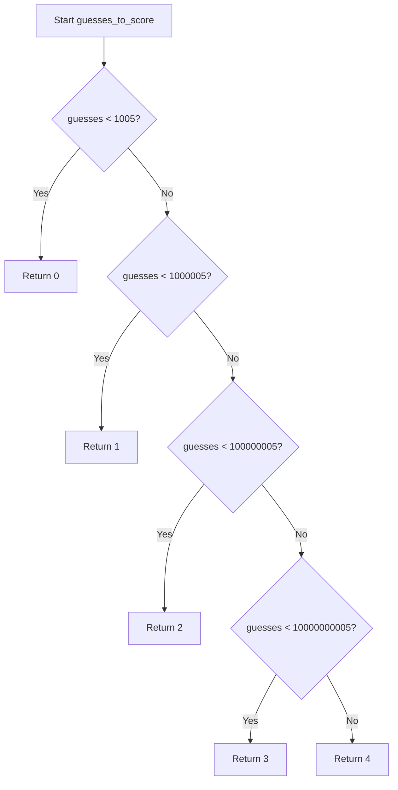

# `time_estimates.py`

## `zxcvbn.time_estimates.estimate_attack_times` · *function*

## Summary:
Calculates estimated time to crack a password using various attack scenarios based on the number of guesses required.

## Description:
This function computes the time required to crack a password under different attack conditions by dividing the total guess count by the rate of guesses per second for each scenario. It provides estimates for online attacks (with and without throttling) and offline attacks (with slow and fast hashing). The results are returned alongside a security strength score derived from the guess count.

The function serves as a bridge between raw guess counts and human-understandable security estimates. It is typically called after a password guess count has been calculated by other components in the zxcvbn library, such as the main password strength estimator.

## Args:
    guesses (int or float): The estimated number of guesses required to crack the password through brute force. This represents the total number of possible combinations that would need to be tried.

## Returns:
    dict: A dictionary containing three keys:
        - 'crack_times_seconds': Dictionary mapping attack scenario names to time estimates in seconds as Decimal objects
        - 'crack_times_display': Dictionary mapping attack scenario names to human-readable time strings
        - 'score': Integer security strength score from 0 to 4 based on the guess count

## Raises:
    None explicitly raised by this function, though underlying operations may raise exceptions from Decimal arithmetic or from the dependent functions.

## Constraints:
    Preconditions:
        - The `guesses` parameter must be a numeric value (int or float)
        - The `guesses` parameter should be non-negative (though negative values are technically accepted)
    
    Postconditions:
        - Returns a dictionary with exactly three keys: 'crack_times_seconds', 'crack_times_display', and 'score'
        - All time estimates in 'crack_times_seconds' are Decimal objects representing exact time values
        - All time estimates in 'crack_times_display' are human-readable strings
        - The score is always an integer in the range [0, 4]

## Side Effects:
    None

## Control Flow:
```mermaid
flowchart TD
    A[Start estimate_attack_times(guesses)] --> B[Calculate crack_times_seconds for 4 scenarios]
    B --> C[For each scenario, divide guesses by rate]
    C --> D[Initialize crack_times_display as empty dict]
    D --> E[For each scenario in crack_times_seconds]
    E --> F[Call display_time(seconds) to get human-readable format]
    F --> G[Store result in crack_times_display]
    G --> H[Call guesses_to_score(guesses) to get security score]
    H --> I[Return dict with crack_times_seconds, crack_times_display, and score]
```

## Examples:
    >>> estimate_attack_times(1000000)
    {
        'crack_times_seconds': {
            'online_throttling_100_per_hour': Decimal('360.0'),
            'online_no_throttling_10_per_second': Decimal('100000.0'),
            'offline_slow_hashing_1e4_per_second': Decimal('100.0'),
            'offline_fast_hashing_1e10_per_second': Decimal('0.0001')
        },
        'crack_times_display': {
            'online_throttling_100_per_hour': '6 minutes',
            'online_no_throttling_10_per_second': '2 minutes',
            'offline_slow_hashing_1e4_per_second': '1 minute',
            'offline_fast_hashing_1e10_per_second': 'less than a second'
        },
        'score': 2
    }
    
    >>> estimate_attack_times(1000000000000)
    {
        'crack_times_seconds': {
            'online_throttling_100_per_hour': Decimal('360000000.0'),
            'online_no_throttling_10_per_second': Decimal('100000000000.0'),
            'offline_slow_hashing_1e4_per_second': Decimal('100000000.0'),
            'offline_fast_hashing_1e10_per_second': Decimal('100.0')
        },
        'crack_times_display': {
            'online_throttling_100_per_hour': '100000 hours',
            'online_no_throttling_10_per_second': '3 years',
            'offline_slow_hashing_1e4_per_second': '1 day',
            'offline_fast_hashing_1e10_per_second': '100 seconds'
        },
        'score': 4
    }

## `zxcvbn.time_estimates.guesses_to_score` · *function*

## Summary:
Converts a guess count into a security strength score ranging from 0 to 4.

## Description:
Maps the number of guesses required to crack a password to a discrete security strength score. This function is used in password strength estimation systems to categorize password security levels based on brute-force attack complexity.

## Args:
    guesses (float or int): The estimated number of guesses required to crack a password through brute force.

## Returns:
    int: Security strength score from 0 to 4, where:
        - 0: Very weak (less than 1,005 guesses)
        - 1: Weak (less than 1,000,005 guesses)  
        - 2: Medium (less than 100,000,005 guesses)
        - 3: Strong (less than 10,000,000,005 guesses)
        - 4: Very strong (10,000,000,005 or more guesses)

## Raises:
    None

## Constraints:
    Preconditions:
        - The `guesses` parameter must be a numeric value (int or float)
        - Negative values are accepted but will likely result in low scores
    
    Postconditions:
        - Always returns an integer in the range [0, 4]
        - The returned value is deterministic for any given input

## Side Effects:
    None

## Control Flow:


## Examples:
    >>> guesses_to_score(100)
    0
    >>> guesses_to_score(500000)
    1
    >>> guesses_to_score(50000000)
    2
    >>> guesses_to_score(5000000000)
    3
    >>> guesses_to_score(50000000000)
    4

## `zxcvbn.time_estimates.display_time` · *function*

## Summary:
Converts a time duration in seconds into a human-readable string representation with appropriate time units and pluralization.

## Description:
Formats a numeric time duration into a readable string by determining the most appropriate time unit (seconds, minutes, hours, days, months, years) and applying proper singular/plural form. This function is designed to provide intuitive time estimates for password strength calculations and similar applications.

## Args:
    seconds (float): The time duration in seconds to convert. Must be non-negative.

## Returns:
    str: A human-readable time string such as "30 seconds", "2 minutes", "1 hour", "5 days", "12 months", "2 years", "less than a second", or "centuries".

## Raises:
    None: This function does not raise any exceptions.

## Constraints:
    Preconditions:
        - Input `seconds` must be a non-negative number
    Postconditions:
        - Returns a properly formatted string representing the time duration
        - Always returns a string (never None)

## Side Effects:
    None: This function has no side effects and is pure.

## Control Flow:
```mermaid
flowchart TD
    A[Start with seconds] --> B{seconds < 1?}
    B -- Yes --> C[Return "less than a second"]
    B -- No --> D{seconds < minute?}
    D -- Yes --> E[Round seconds to nearest integer]
    E --> F[Return "%s second" % base]
    D -- No --> G{seconds < hour?}
    G -- Yes --> H[Round seconds/minute]
    H --> I[Return "%s minute" % base]
    G -- No --> J{seconds < day?}
    J -- Yes --> K[Round seconds/hour]
    K --> L[Return "%s hour" % base]
    J -- No --> M{seconds < month?}
    M -- Yes --> N[Round seconds/day]
    N --> O[Return "%s day" % base]
    M -- No --> P{seconds < year?}
    P -- Yes --> Q[Round seconds/month]
    Q --> R[Return "%s month" % base]
    P -- No --> S{seconds < century?}
    S -- Yes --> T[Round seconds/year]
    T --> U[Return "%s year" % base]
    S -- No --> V[Return "centuries"]
    W[Add 's' if display_num != 1] --> X[Return display_str]
```

## Examples:
    >>> display_time(30)
    '30 seconds'
    >>> display_time(120)
    '2 minutes'
    >>> display_time(7200)
    '2 hours'
    >>> display_time(0.5)
    'less than a second'
    >>> display_time(31536000)
    '1 year'
    >>> display_time(63072000)
    '2 years'
```

## `zxcvbn.time_estimates.float_to_decimal` · *function*

## Summary:
Converts a floating-point number to a precise Decimal representation by using its integer ratio and iterative precision adjustment.

## Description:
This function transforms a Python float into a Decimal object with maximum precision by leveraging the float's mathematical representation as a ratio of two integers. It addresses floating-point precision limitations by starting with a base precision and iteratively increasing it until an exact division result is achieved. This approach ensures that the conversion maintains mathematical accuracy rather than introducing floating-point rounding errors.

The function is typically used in contexts requiring precise numerical calculations, such as password strength estimation where exact computations are critical for accurate scoring.

## Args:
    f (float): The floating-point number to convert to Decimal. Must be a finite float value.

## Returns:
    Decimal: A Decimal representation of the input float with maximum precision. The result will be mathematically exact for the float's value.

## Raises:
    None explicitly raised by this function, though underlying operations may raise exceptions from Decimal arithmetic.

## Constraints:
    Preconditions:
        - Input must be a finite float (not NaN or infinity)
        - Input must be a valid Python float type
    
    Postconditions:
        - Returned value is a Decimal object representing the exact mathematical value of the input float
        - The conversion preserves the mathematical precision of the original float

## Side Effects:
    None

## Control Flow:
```mermaid
flowchart TD
    A[Start float_to_decimal(f)] --> B{f.as_integer_ratio()}
    B --> C[n, d = f.as_integer_ratio()]
    C --> D[numerator = Decimal(n)]
    D --> E[denominator = Decimal(d)]
    E --> F[ctx = Context(prec=60)]
    F --> G[result = ctx.divide(numerator, denominator)]
    G --> H{ctx.flags[Inexact] == True?}
    H -->|Yes| I[ctx.flags[Inexact] = False]
    I --> J[ctx.prec *= 2]
    J --> K[result = ctx.divide(numerator, denominator)]
    K --> L{ctx.flags[Inexact] == True?}
    L -->|Yes| M[Loop back to K]
    L -->|No| N[Return result]
    H -->|No| N
```

