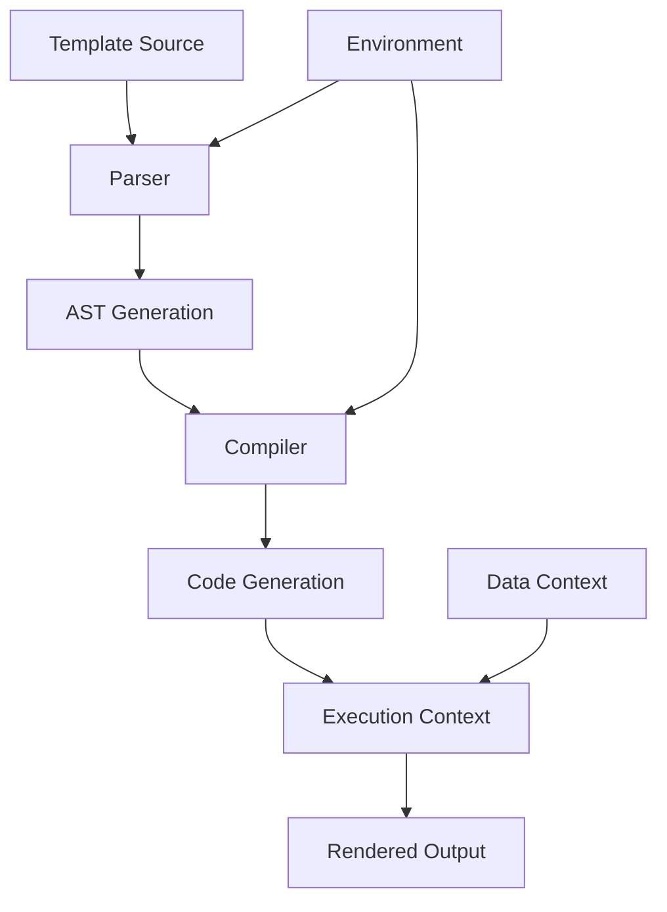

# `Jinja2`

## Repository Overview

### Tree Structure
```
Jinja2/
├── docs/           # Documentation files, guides, and API references
├── scripts/        # Utility scripts for building, testing, and deployment
└── src/            # Source code root directory
    └── jinja2/     # Main Jinja2 package containing core templating engine
```

### Purpose
Jinja2 is a fast, expressive, and extensible templating engine for Python. It enables developers to separate presentation logic from business logic by providing a template syntax that supports variable substitution, conditional rendering, loops, and template inheritance. This repository contains the core implementation of the Jinja2 templating engine.

The templating engine is widely used in web frameworks like Flask and Django, static site generators, and any application requiring dynamic content generation from templates. Its design emphasizes performance, security (with automatic escaping), and extensibility.

### Target Users
- Python web developers using Flask, Django, or other frameworks that depend on Jinja2
- Static site generator authors
- Developers needing dynamic content generation from templates
- Template designers and content creators
- System administrators generating configuration files programmatically

### Position in Ecosystem
Jinja2 serves as a foundational templating library in the Python ecosystem. It operates as a core dependency for many Python-based web applications and static site generators, functioning as a bridge between data models and presentation layers. It's designed to be both powerful and accessible, making it suitable for both simple and complex templating needs.

### Architecture


Key architectural patterns:
- Template parsing and compilation pipeline
- Abstract Syntax Tree (AST) based processing
- Code generation for efficient template execution
- Environment-based configuration management
- Context-aware rendering with variable resolution
- Secure by default with automatic escaping

### Entry Points
1. **Importable API**: Primary Python interface via `from jinja2 import Environment, Template`
   - Required arguments: template source, environment configuration, context data
   - Audience: Application developers integrating templating functionality

2. **Command Line Interface**: Basic command-line utilities for template processing
   - Arguments: template file, context data, output destination
   - Audience: Developers and system administrators for quick template processing

### Core Features
- Template inheritance and macro support
- Conditional rendering and loops
- Variable filtering and formatting
- Customizable environment settings
- Exception handling for template errors
- Extensible filter and function system
- Thread-safe template rendering
- Debugging and error reporting capabilities
- Automatic HTML escaping for security
- Support for custom template loaders

### Dependencies
- Python 3.7+ (required)
- MarkupSafe (for HTML escaping)
- setuptools (for packaging)
- pytest (for testing)
- Sphinx (for documentation generation)

### Configuration
Configuration options include:
- Template loader settings (filesystem, package, or custom loaders)
- Autoescape behavior (HTML, XML, or disabled)
- Trim whitespace control
- Variable naming conventions
- Cache settings for template compilation
- Error handling policies

### Extension Points
- Custom filters and tests via Environment.register_filter() and Environment.register_test()
- Custom functions through Environment.globals
- Custom template loaders by implementing the Loader interface
- Plugin system for extending functionality
- Inheritance of Environment class for custom behavior
- Custom bytecode cache implementations

---

## Modules

- [`src`](src.md)

